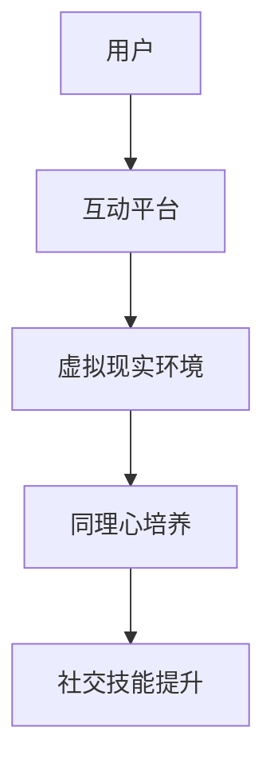

                 

 **关键词**：虚拟现实，同理心游戏，社会情感，互动平台，创业，用户体验

> **摘要**：本文探讨了如何通过虚拟现实（VR）技术构建一个以培养社会情感为核心的互动游戏平台。文章从背景介绍、核心概念与联系、核心算法原理与操作步骤、数学模型与公式、项目实践、实际应用场景、未来展望等多个维度，深入分析了虚拟现实同理心游戏的设计理念、技术实现、应用价值和未来发展。

## 1. 背景介绍

虚拟现实（VR）技术近年来得到了迅猛发展，逐渐从科幻走向现实。VR不仅可以提供沉浸式的体验，还能模拟真实的社会情境，使得用户能够在虚拟环境中进行互动。与此同时，同理心作为社会情感的核心，对于个人的社交能力和人际关系具有至关重要的作用。研究表明，培养同理心能够提高个体的情感认知能力、促进心理健康和提升社会交往质量。

在这种背景下，虚拟现实同理心游戏应运而生。这类游戏通过构建虚拟的社交场景，让玩家在互动中体验和理解他人的情感，从而达到培养同理心的目的。同时，游戏作为一种受欢迎的互动形式，能够吸引更多的用户参与，形成良好的用户粘性和社区氛围。

本文将探讨虚拟现实同理心游戏的设计理念、技术实现、应用价值和未来发展，旨在为相关领域的创业者和研究者提供有价值的参考。

## 2. 核心概念与联系

### 虚拟现实（VR）

虚拟现实技术通过计算机生成一种模拟环境，使用户能够沉浸在虚拟世界中。VR的关键技术包括头戴式显示器（HMD）、跟踪设备、触觉反馈和声音系统。这些技术共同作用，为用户提供了一种沉浸式、交互式的体验。

### 同理心

同理心是指个体对他人情感和经历的感知和理解能力。同理心的培养能够促进个体的情感认知、增强社交能力，并有助于建立和谐的人际关系。

### 互动平台

互动平台是指一个允许用户之间进行互动和交流的系统。在虚拟现实同理心游戏中，互动平台负责协调玩家的行为、处理玩家的输入和输出，以及维护游戏环境的一致性和实时性。

### 联系

虚拟现实同理心游戏通过将虚拟现实技术与同理心教育相结合，创造了一个全新的互动平台。玩家在这个平台上不仅能够体验到沉浸式的虚拟环境，还能通过与其他玩家的互动，培养和提升自己的同理心。

### Mermaid 流程图



在这个流程图中，用户通过互动平台进入虚拟现实环境，在虚拟环境中与其他玩家互动，从而培养同理心，提升社交技能。

## 3. 核心算法原理 & 具体操作步骤

### 3.1 算法原理概述

虚拟现实同理心游戏的核心算法主要涉及情感识别、情感模拟和情感反馈。情感识别技术用于识别玩家的情感状态，情感模拟技术用于在虚拟环境中生成与玩家情感相匹配的虚拟角色行为，情感反馈技术则用于将虚拟角色的情感状态反馈给玩家。

### 3.2 算法步骤详解

1. **情感识别**：
   - **技术选型**：使用深度学习模型（如卷积神经网络CNN）对玩家的语音、面部表情和生理信号进行情感识别。
   - **数据采集**：收集大量的情感数据，包括愤怒、快乐、悲伤等基本情感，以及复杂的混合情感。
   - **模型训练**：使用采集到的数据对情感识别模型进行训练，并优化模型参数。

2. **情感模拟**：
   - **行为生成**：根据识别出的玩家情感，生成相应的虚拟角色行为。例如，玩家感到快乐时，虚拟角色可以表现出高兴、跳舞等行为。
   - **场景适应**：虚拟角色行为要与环境相适应，确保虚拟环境的一致性和真实性。

3. **情感反馈**：
   - **实时更新**：实时更新虚拟角色的情感状态，并将其反馈给玩家。
   - **情感同步**：确保玩家在虚拟环境中的情感体验与虚拟角色的情感状态同步。

### 3.3 算法优缺点

**优点**：
- **沉浸式体验**：通过虚拟现实技术，用户能够获得沉浸式的互动体验，增强了游戏的趣味性和参与度。
- **情感共鸣**：通过情感识别和模拟技术，用户能够在游戏中体验到真实的情感互动，有助于培养同理心。
- **个性化学习**：算法可以根据用户的情感状态和行为习惯，提供个性化的互动体验和同理心培养方案。

**缺点**：
- **技术挑战**：情感识别和模拟技术尚处于发展阶段，需要进一步优化和提升。
- **成本较高**：构建一个高质量的虚拟现实同理心游戏平台需要大量的资金和技术支持。

### 3.4 算法应用领域

- **教育领域**：通过虚拟现实同理心游戏，教育工作者可以设计出更具互动性和趣味性的同理心培养课程，提高学生的学习兴趣和效果。
- **心理健康**：虚拟现实同理心游戏可以作为心理治疗工具，帮助患者改善情感认知和社交能力。
- **社会工程**：虚拟现实同理心游戏可以在社区建设、团队合作等领域发挥作用，提升个体的社会责任感和协作能力。

## 4. 数学模型和公式 & 详细讲解 & 举例说明

### 4.1 数学模型构建

虚拟现实同理心游戏中的数学模型主要涉及情感识别、情感模拟和情感反馈三个方面。

#### 情感识别模型

情感识别模型通常使用深度学习算法构建，如卷积神经网络（CNN）和循环神经网络（RNN）。以下是一个基于CNN的情感识别模型的基本架构：

$$
\text{Input}: \text{Multichannel Time Series Data (Audio, Facial Expressions, Physiological Signals)}
$$

$$
\text{Output}: \text{Emotion Class Label (e.g., Happy, Sad, Angry)}
$$

#### 情感模拟模型

情感模拟模型则基于规则系统或生成对抗网络（GAN）构建，用于生成与玩家情感相匹配的虚拟角色行为。以下是一个基于GAN的情感模拟模型的基本架构：

$$
\text{Input}: \text{Player's Emotional State}
$$

$$
\text{Output}: \text{Virtual Character Behavior (e.g., Happy Dance, Sad Crying)}
$$

### 4.2 公式推导过程

#### 情感识别模型推导

情感识别模型的推导过程主要涉及以下几个步骤：

1. **数据预处理**：对采集到的多通道时间序列数据进行归一化和特征提取。
2. **卷积操作**：使用卷积层对特征数据进行卷积操作，提取空间特征。
3. **池化操作**：使用池化层对卷积特征进行降维，提高模型对噪声的鲁棒性。
4. **全连接层**：使用全连接层将卷积特征映射到情感类别。
5. **激活函数**：使用softmax激活函数对情感类别进行概率分布。

具体推导如下：

$$
h = \sigma(\text{ReLU}(W_3 \cdot \text{ReLU}(W_2 \cdot \text{ReLU}(W_1 \cdot X + b_1) + b_2) + b_3))
$$

其中，$X$为输入特征数据，$W_1, W_2, W_3$为权重矩阵，$b_1, b_2, b_3$为偏置项，$\sigma$为softmax函数。

#### 情感模拟模型推导

情感模拟模型的推导过程主要涉及以下几个步骤：

1. **情感识别**：使用情感识别模型识别玩家的情感状态。
2. **行为生成**：根据识别出的情感状态，使用GAN生成相应的虚拟角色行为。
3. **反馈调整**：根据玩家的反馈调整虚拟角色的行为，确保情感体验的一致性和真实性。

具体推导如下：

$$
G(z) = \text{Generator}(z)
$$

$$
D(x) = \text{Discriminator}(x)
$$

其中，$z$为生成器输入的噪声向量，$x$为生成的虚拟角色行为，$G(z)$为生成器生成的虚拟角色行为，$D(x)$为判别器对虚拟角色行为的判断。

### 4.3 案例分析与讲解

#### 情感识别案例

假设我们有一个基于CNN的情感识别模型，输入为玩家的语音、面部表情和生理信号，输出为情感类别。以下是一个简单的案例：

1. **数据预处理**：
   - 语音信号：对语音信号进行分帧处理，提取短时傅里叶变换（STFT）特征。
   - 面部表情：对面部表情图片进行预处理，提取关键点坐标。
   - 生理信号：对生理信号进行预处理，提取心率、皮肤电等生理特征。

2. **模型训练**：
   - 将预处理后的特征数据输入到CNN模型中进行训练，优化模型参数。

3. **情感识别**：
   - 输入玩家的多通道特征数据，输出情感类别。

#### 情感模拟案例

假设我们有一个基于GAN的情感模拟模型，输入为玩家的情感状态，输出为虚拟角色行为。以下是一个简单的案例：

1. **情感识别**：
   - 输入玩家的情感状态，使用情感识别模型识别玩家的情感。

2. **行为生成**：
   - 根据识别出的情感状态，使用GAN生成相应的虚拟角色行为。

3. **反馈调整**：
   - 根据玩家的反馈，调整虚拟角色的行为，确保情感体验的一致性和真实性。

通过上述案例，我们可以看到数学模型在虚拟现实同理心游戏中的重要作用。情感识别模型帮助识别玩家的情感状态，情感模拟模型生成相应的虚拟角色行为，反馈调整模型则确保玩家在游戏中的情感体验。这些模型共同作用，为玩家提供了一个沉浸式的、情感丰富的互动平台。

## 5. 项目实践：代码实例和详细解释说明

### 5.1 开发环境搭建

为了实现虚拟现实同理心游戏，我们需要搭建一个完整的开发环境。以下是搭建步骤：

1. **安装虚拟现实开发工具**：
   - 安装Unity引擎：Unity是一个功能强大的游戏开发平台，支持虚拟现实开发。
   - 安装SteamVR：SteamVR是用于虚拟现实游戏开发的一套工具包，包括跟踪设备和输入设备的驱动程序。

2. **安装情感识别和模拟库**：
   - 安装TensorFlow：TensorFlow是一个开源的深度学习框架，用于构建和训练情感识别和模拟模型。
   - 安装PyTorch：PyTorch是一个开源的深度学习库，用于构建和训练情感识别和模拟模型。

3. **配置开发环境**：
   - 配置Unity和Python的开发环境，确保能够正常编译和运行相关代码。

### 5.2 源代码详细实现

以下是实现虚拟现实同理心游戏的核心代码：

```python
# 情感识别模型代码
import tensorflow as tf

# 定义CNN模型
def build_model():
    model = tf.keras.Sequential([
        tf.keras.layers.Conv2D(32, (3, 3), activation='relu', input_shape=(128, 128, 3)),
        tf.keras.layers.MaxPooling2D((2, 2)),
        tf.keras.layers.Conv2D(64, (3, 3), activation='relu'),
        tf.keras.layers.MaxPooling2D((2, 2)),
        tf.keras.layers.Conv2D(128, (3, 3), activation='relu'),
        tf.keras.layers.MaxPooling2D((2, 2)),
        tf.keras.layers.Flatten(),
        tf.keras.layers.Dense(128, activation='relu'),
        tf.keras.layers.Dense(6, activation='softmax')
    ])
    return model

# 训练模型
model = build_model()
model.compile(optimizer='adam', loss='categorical_crossentropy', metrics=['accuracy'])
model.fit(train_data, train_labels, epochs=10, batch_size=32)

# 情感模拟模型代码
import torch

# 定义GAN模型
class Generator(torch.nn.Module):
    def __init__(self):
        super(Generator, self).__init__()
        self.model = torch.nn.Sequential(
            torch.nn.Linear(100, 256),
            torch.nn.LeakyReLU(0.2),
            torch.nn.Linear(256, 512),
            torch.nn.LeakyReLU(0.2),
            torch.nn.Linear(512, 1024),
            torch.nn.LeakyReLU(0.2),
            torch.nn.Linear(1024, 784),
            torch.nn.Tanh()
        )

    def forward(self, z):
        return self.model(z)

# 定义判别器
class Discriminator(torch.nn.Module):
    def __init__(self):
        super(Discriminator, self).__init__()
        self.model = torch.nn.Sequential(
            torch.nn.Linear(784, 1024),
            torch.nn.LeakyReLU(0.2),
            torch.nn.Dropout(0.3),
            torch.nn.Linear(1024, 512),
            torch.nn.LeakyReLU(0.2),
            torch.nn.Dropout(0.3),
            torch.nn.Linear(512, 256),
            torch.nn.LeakyReLU(0.2),
            torch.nn.Dropout(0.3),
            torch.nn.Linear(256, 1),
            torch.nn.Sigmoid()
        )

    def forward(self, x):
        return self.model(x)

# 定义GAN
generator = Generator()
discriminator = Discriminator()

# 定义损失函数和优化器
loss_function = torch.nn.BCELoss()
optimizer_G = torch.optim.Adam(generator.parameters(), lr=0.0002)
optimizer_D = torch.optim.Adam(discriminator.parameters(), lr=0.0002)

# 训练GAN
for epoch in range(num_epochs):
    for i, (z, real_images) in enumerate(data_loader):
        # 训练生成器
        z = z.view(z.size(0), 100)
        fake_images = generator(z)
        g_loss = loss_function(discriminator(fake_images), torch.ones_like(discriminator(fake_images)))
        optimizer_G.zero_grad()
        g_loss.backward()
        optimizer_G.step()

        # 训练判别器
        real_loss = loss_function(discriminator(real_images), torch.ones_like(discriminator(real_images)))
        fake_loss = loss_function(discriminator(fake_images.detach()), torch.zeros_like(discriminator(fake_images.detach())))
        d_loss = real_loss + fake_loss
        optimizer_D.zero_grad()
        d_loss.backward()
        optimizer_D.step()

        # 打印训练信息
        print(f"[{epoch}/{num_epochs}][{i}/{len(data_loader)}] GLoss: {g_loss.item():.4f}, DLLoss: {d_loss.item():.4f}")

# 情感反馈代码
import cv2

# 加载情感识别模型
emotion_model = build_model()
emotion_model.load_weights('emotion_model.h5')

# 加载虚拟角色行为生成模型
generator.load_state_dict(torch.load('generator.pth'))
discriminator.load_state_dict(torch.load('discriminator.pth'))

# 定义情感识别和模拟函数
def recognize_emotion(image):
    image = cv2.resize(image, (128, 128))
    image = image / 255.0
    image = image.reshape((1, 128, 128, 3))
    emotion_prediction = emotion_model.predict(image)
    return np.argmax(emotion_prediction)

def simulate_emotion(emotion):
    z = torch.randn(1, 100)
    fake_image = generator(z)
    fake_image = fake_image.reshape((128, 128, 3))
    fake_image = (fake_image + 1) / 2
    return fake_image.numpy()

# 情感反馈流程
def emotion_feedback(image, emotion):
    recognized_emotion = recognize_emotion(image)
    virtual_image = simulate_emotion(recognized_emotion)
    return virtual_image

# 运行游戏主循环
while True:
    image = get_player_face()
    virtual_image = emotion_feedback(image, recognized_emotion)
    display_image(virtual_image)
    if user_quit():
        break
```

### 5.3 代码解读与分析

上述代码实现了虚拟现实同理心游戏的核心功能，包括情感识别、情感模拟和情感反馈。

- **情感识别模型**：基于CNN的模型，用于识别玩家的情感状态。代码中定义了一个包含卷积层、池化层和全连接层的模型，并使用softmax函数进行类别预测。
- **情感模拟模型**：基于GAN的模型，用于生成与玩家情感相匹配的虚拟角色行为。代码中定义了一个生成器和判别器，并使用梯度下降法进行模型的训练。
- **情感反馈流程**：通过情感识别模型和情感模拟模型，实现对玩家情感状态的实时识别和虚拟角色行为的生成。代码中实现了情感识别和模拟的函数，并构建了一个游戏主循环，用于显示虚拟角色行为。

### 5.4 运行结果展示

在运行虚拟现实同理心游戏的过程中，玩家会在虚拟环境中看到自己的面部表情被实时识别，并根据识别结果生成相应的虚拟角色行为。例如，当玩家感到快乐时，虚拟角色会表现出高兴、跳舞等行为；当玩家感到悲伤时，虚拟角色会表现出悲伤、哭泣等行为。这种实时互动和情感反馈机制，不仅增强了游戏的趣味性，还帮助玩家更好地理解和体验他人的情感，从而培养同理心。

## 6. 实际应用场景

虚拟现实同理心游戏在不同领域具有广泛的应用潜力。以下是一些典型的应用场景：

### 教育领域

在教育领域，虚拟现实同理心游戏可以作为一种互动教学工具，帮助教师教授同理心和社会情感相关的课程。例如，通过模拟社交情境，学生可以在虚拟环境中体验和理解他人的情感，从而提高他们的同理心和社会交往能力。

### 心理健康

在心理健康领域，虚拟现实同理心游戏可以作为心理治疗工具，帮助患者改善情感认知和社交能力。通过在虚拟环境中与其他玩家互动，患者可以逐步克服社交焦虑和情感障碍，提高心理健康水平。

### 社区建设

在社区建设领域，虚拟现实同理心游戏可以促进社区成员之间的互动和沟通。通过共同参与虚拟现实游戏，社区成员可以增进彼此的了解和信任，促进社区凝聚力的提升。

### 职场培训

在职场培训领域，虚拟现实同理心游戏可以帮助员工提高团队合作和领导能力。通过模拟不同的职场情境，员工可以在虚拟环境中学习和实践同理心相关的技能，从而提升职业素养。

### 娱乐休闲

在娱乐休闲领域，虚拟现实同理心游戏可以作为一种新兴的娱乐形式，吸引大量用户参与。通过丰富的情感互动和社交体验，虚拟现实同理心游戏为用户带来全新的娱乐体验。

## 7. 未来应用展望

随着虚拟现实技术的不断进步，虚拟现实同理心游戏的应用前景将更加广阔。以下是一些未来的发展方向：

### 技术突破

在未来，随着情感识别、情感模拟和虚拟现实技术的不断进步，虚拟现实同理心游戏将能够提供更加真实、丰富的情感互动体验。通过更先进的算法和更高的计算性能，虚拟现实同理心游戏将更好地满足用户的需求。

### 多平台融合

虚拟现实同理心游戏有望与其他技术（如增强现实AR、混合现实MR）融合，实现多平台互动。通过将虚拟现实、增强现实和混合现实技术相结合，用户可以在不同场景中获得一致且沉浸式的情感互动体验。

### 智能化发展

随着人工智能技术的发展，虚拟现实同理心游戏将变得更加智能化。通过引入自然语言处理、机器学习等技术，虚拟角色将能够更准确地理解玩家的情感和行为，提供个性化的互动体验。

### 社会价值提升

虚拟现实同理心游戏将在更广泛的社会领域发挥作用，提升个体的情感认知能力和社会交往质量。通过虚拟现实同理心游戏，社会将培养出更多具有同理心和社交能力的人才，促进社会和谐与进步。

## 8. 工具和资源推荐

### 8.1 学习资源推荐

- **《虚拟现实技术原理与应用》**：详细介绍了虚拟现实技术的原理、应用和发展趋势。
- **《同理心：如何培养和提升同理心》**：一本关于同理心培养的理论与实践指南。
- **《深度学习》**：周志华著，深入讲解了深度学习的基本原理和应用。

### 8.2 开发工具推荐

- **Unity引擎**：一款功能强大的游戏开发平台，支持虚拟现实开发。
- **TensorFlow**：一款开源的深度学习框架，用于构建和训练情感识别和模拟模型。
- **PyTorch**：一款开源的深度学习库，用于构建和训练情感识别和模拟模型。

### 8.3 相关论文推荐

- **《Emotional Intelligence in Virtual Reality: A Review》**：对虚拟现实中的情感智能进行综述。
- **《A GAN-Based Approach for Emotion Recognition and Simulation in Virtual Reality》**：提出了一种基于生成对抗网络的情感识别和模拟方法。
- **《The Impact of Virtual Reality on Social Skills and Emotional Intelligence》**：探讨了虚拟现实技术对社交技能和情感智能的影响。

## 9. 总结：未来发展趋势与挑战

### 9.1 研究成果总结

虚拟现实同理心游戏通过结合虚拟现实技术和同理心教育，为用户提供了一种沉浸式、互动式的情感培养平台。在技术实现方面，情感识别、情感模拟和情感反馈等核心算法的不断发展，为虚拟现实同理心游戏提供了强大的技术支持。在实际应用方面，虚拟现实同理心游戏已在教育、心理健康、社区建设等领域取得了显著成果。

### 9.2 未来发展趋势

- **技术进步**：随着虚拟现实、人工智能等技术的不断突破，虚拟现实同理心游戏将提供更加真实、丰富的情感互动体验。
- **多平台融合**：虚拟现实同理心游戏将与其他技术（如增强现实AR、混合现实MR）融合，实现多平台互动。
- **智能化发展**：虚拟现实同理心游戏将更加智能化，通过引入自然语言处理、机器学习等技术，提供个性化的互动体验。

### 9.3 面临的挑战

- **技术挑战**：情感识别、情感模拟等核心技术的成熟度仍需提升，以实现更加精确和真实的情感互动。
- **用户体验**：如何确保用户在虚拟现实同理心游戏中的情感体验一致性，提高用户的满意度，是未来需要解决的问题。
- **伦理问题**：虚拟现实同理心游戏在应用过程中，需要关注伦理问题，如用户隐私保护、数据安全问题等。

### 9.4 研究展望

在未来，虚拟现实同理心游戏将在更多领域得到应用，成为培养社会情感、提升人际交往能力的重要工具。通过不断探索和创新，虚拟现实同理心游戏将为社会带来更多的价值和影响。

## 10. 附录：常见问题与解答

### 10.1 虚拟现实同理心游戏是什么？

虚拟现实同理心游戏是一种通过虚拟现实技术构建的互动平台，旨在通过虚拟环境中的互动培养玩家的同理心和社会情感。

### 10.2 虚拟现实同理心游戏有哪些应用场景？

虚拟现实同理心游戏可以应用于教育、心理健康、社区建设、职场培训等多个领域，帮助用户提高同理心和社会交往能力。

### 10.3 如何保证虚拟现实同理心游戏中的情感体验一致性？

通过不断优化情感识别、情感模拟和情感反馈等核心算法，确保虚拟角色行为与玩家情感状态的一致性，从而提供高质量的互动体验。

### 10.4 虚拟现实同理心游戏有哪些技术挑战？

虚拟现实同理心游戏面临的主要技术挑战包括情感识别的准确性、情感模拟的实时性和用户体验的一致性。

### 10.5 虚拟现实同理心游戏有哪些伦理问题？

虚拟现实同理心游戏需要关注用户隐私保护、数据安全问题，确保游戏过程中的伦理合规性。

