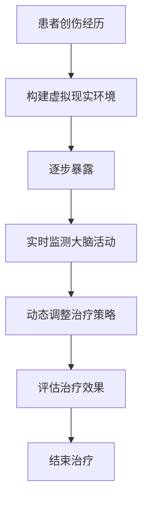

                 

关键词：虚拟现实，暴露疗法，心理创伤，脑辅助，心理治疗，认知行为疗法，虚拟现实技术，VR疗法，神经科学

> 摘要：本文探讨了虚拟现实暴露疗法在治疗心理创伤领域的应用，通过介绍该疗法的核心概念、算法原理、数学模型和实际应用案例，分析了其在提升心理治疗效果、降低成本和增强患者参与度方面的优势，并展望了未来应用和发展趋势。

## 1. 背景介绍

心理创伤是一种常见的心理健康问题，可能源于各种极端事件，如战争、自然灾害、性侵犯或严重事故。传统心理治疗方法如认知行为疗法（CBT）和药物治疗，虽然在某些情况下有效，但往往需要较长时间的治疗，且治疗效果不一。为了提高心理创伤治疗的效率和效果，虚拟现实（VR）暴露疗法应运而生。

VR暴露疗法是一种将虚拟现实技术应用于心理创伤治疗的方法。它通过模拟创伤场景，让患者逐步暴露于创伤情境中，从而帮助患者处理和缓解创伤后应激障碍（PTSD）和其他心理问题。与传统的暴露疗法相比，VR暴露疗法具有更高的可控性和安全性，使得治疗过程更加灵活和个性化。

### 虚拟现实技术的基本概念与架构

虚拟现实技术是一种创建模拟环境的技术，通过电脑生成的三维图像，结合传感器、头戴显示器（HMD）和立体声音响系统，使用户能够沉浸其中。VR技术的核心架构包括以下几个方面：

1. **渲染引擎**：用于生成虚拟环境的三维图像。
2. **传感器与定位系统**：如摄像头、追踪器等，用于实时监测用户的位置和动作。
3. **交互设备**：如手柄、手套等，用于与虚拟环境进行交互。
4. **硬件设备**：包括头戴显示器（HMD）、立体音响等，提供沉浸式体验。
5. **软件系统**：用于控制虚拟环境、处理用户输入和输出。

### 脑辅助技术的基本概念与作用

脑辅助技术是指利用计算机和电子设备辅助大脑功能的方法，包括脑机接口（BMI）、神经反馈和虚拟现实等技术。脑辅助技术在心理治疗领域具有广泛的应用前景，通过实时监测和分析大脑活动，可以更准确地评估治疗效果，并实现个性化的治疗方案。

脑辅助技术在心理创伤治疗中的作用主要体现在以下几个方面：

1. **提高治疗效果**：通过实时监测大脑活动，可以更精确地识别患者的心理状态，从而优化治疗方案。
2. **增强患者参与度**：虚拟现实技术提供了更加生动和互动的治疗体验，提高了患者的参与度和积极性。
3. **降低治疗成本**：与传统的心理治疗方法相比，虚拟现实疗法在治疗过程中可以减少人力和时间成本。

## 2. 核心概念与联系

### 虚拟现实暴露疗法的核心概念

虚拟现实暴露疗法基于认知行为疗法的原理，通过将患者逐步暴露于创伤情境中，帮助患者重新处理和适应创伤经历，从而缓解心理创伤症状。该疗法的主要核心概念包括：

1. **暴露**：患者通过虚拟现实环境逐步接触创伤场景，以减少对创伤事件的恐惧和焦虑。
2. **虚拟现实环境**：模拟创伤事件的虚拟环境，包括视觉、听觉和触觉等感官刺激。
3. **认知行为干预**：在暴露过程中，治疗师通过认知行为技术，引导患者重新评估和调整对创伤事件的认知。

### 脑辅助技术在虚拟现实暴露疗法中的应用

脑辅助技术在虚拟现实暴露疗法中起到了关键作用，主要表现在以下几个方面：

1. **实时监测**：通过脑机接口和神经反馈技术，实时监测患者的心理状态和大脑活动，以便调整治疗策略。
2. **个性化治疗**：根据患者的心理状态和大脑活动，动态调整虚拟现实环境和暴露强度，实现个性化治疗方案。
3. **增强治疗效果**：通过实时反馈和交互，提高患者的治疗参与度和积极性，从而增强治疗效果。

### Mermaid 流程图

以下是虚拟现实暴露疗法和脑辅助技术的 Mermaid 流程图：



## 3. 核心算法原理 & 具体操作步骤

### 3.1 算法原理概述

虚拟现实暴露疗法的核心算法是基于认知行为疗法的原理，通过构建虚拟现实环境和逐步暴露于创伤情境，帮助患者重新处理和适应创伤经历。算法的主要步骤包括：

1. **构建虚拟现实环境**：根据患者的创伤经历，设计和开发虚拟现实环境。
2. **逐步暴露**：通过逐步增加创伤情境的暴露强度，帮助患者逐步适应和缓解症状。
3. **实时监测和反馈**：通过脑机接口和神经反馈技术，实时监测患者的心理状态和大脑活动，并根据监测结果动态调整治疗策略。
4. **评估治疗效果**：根据患者的症状改善情况和心理状态，评估治疗效果。

### 3.2 算法步骤详解

1. **构建虚拟现实环境**

   虚拟现实环境的构建主要包括以下几个步骤：

   - **需求分析**：与患者沟通，了解其创伤经历和需求，明确虚拟现实环境的目标和功能。
   - **设计虚拟现实场景**：根据需求分析结果，设计和开发虚拟现实场景，包括视觉、听觉和触觉等感官刺激。
   - **集成和调试**：将虚拟现实环境与其他系统（如脑机接口和神经反馈系统）集成，并进行调试和优化。

2. **逐步暴露**

   在逐步暴露过程中，治疗师和患者需要密切合作，按照以下步骤进行：

   - **设定暴露强度**：根据患者的心理状态和症状严重程度，设定合适的暴露强度。
   - **逐步增加暴露强度**：在治疗过程中，逐步增加暴露强度，帮助患者适应和缓解症状。
   - **实时监测和反馈**：通过脑机接口和神经反馈技术，实时监测患者的心理状态和大脑活动，并根据监测结果调整暴露强度。

3. **实时监测和反馈**

   实时监测和反馈是虚拟现实暴露疗法的关键步骤，主要包括以下几个步骤：

   - **脑机接口技术**：通过脑机接口技术，实时监测患者的心理状态和大脑活动，如脑电信号（EEG）、肌电信号（EMG）等。
   - **神经反馈技术**：通过神经反馈技术，将患者的心理状态和大脑活动实时反馈给治疗师，以便调整治疗策略。
   - **动态调整治疗策略**：根据患者的心理状态和大脑活动，动态调整虚拟现实环境和暴露强度，实现个性化治疗方案。

4. **评估治疗效果**

   评估治疗效果是确保虚拟现实暴露疗法有效性的关键步骤，主要包括以下几个步骤：

   - **症状评估**：通过问卷调查、心理测评等方法，评估患者的症状改善情况。
   - **心理状态评估**：通过脑机接口和神经反馈技术，评估患者的心理状态，如焦虑、抑郁等。
   - **治疗效果评估**：综合症状评估和心理状态评估结果，评估虚拟现实暴露疗法的治疗效果。

### 3.3 算法优缺点

虚拟现实暴露疗法具有以下优点：

- **提高治疗效果**：通过实时监测和个性化治疗，虚拟现实疗法可以更有效地缓解患者的心理创伤症状。
- **降低治疗成本**：与传统的心理治疗方法相比，虚拟现实疗法可以减少人力和时间成本。
- **增强患者参与度**：虚拟现实技术提供了更加生动和互动的治疗体验，提高了患者的参与度和积极性。

然而，虚拟现实暴露疗法也存在一些缺点：

- **技术限制**：虚拟现实技术的成熟度仍有待提高，特别是在实时监测和反馈方面。
- **伦理争议**：虚拟现实暴露疗法可能会引发一些伦理争议，如患者隐私保护和心理风险等。

### 3.4 算法应用领域

虚拟现实暴露疗法在以下领域具有广泛的应用前景：

- **心理创伤治疗**：如创伤后应激障碍（PTSD）、焦虑症、抑郁症等。
- **军事医学**：如士兵的PTSD治疗、心理适应训练等。
- **临床心理学**：如心理障碍的评估和治疗、认知行为疗法的应用等。
- **康复医学**：如康复训练、运动损伤治疗等。

## 4. 数学模型和公式 & 详细讲解 & 举例说明

### 4.1 数学模型构建

虚拟现实暴露疗法中的数学模型主要涉及以下几个方面：

1. **虚拟现实环境的建模**：通过计算机图形学技术，构建虚拟现实环境的数学模型。
2. **心理状态监测模型**：利用脑机接口和神经反馈技术，构建心理状态的监测模型。
3. **暴露强度调整模型**：根据患者的心理状态和症状改善情况，构建暴露强度调整模型。

### 4.2 公式推导过程

1. **虚拟现实环境建模**

   假设虚拟现实环境由一组三维空间中的点构成，每个点表示环境中的一个位置。虚拟现实环境的建模可以表示为：

   $$V = \{P_1, P_2, ..., P_n\}$$

   其中，$P_i$ 表示第 $i$ 个位置，$n$ 表示位置的数量。

2. **心理状态监测模型**

   假设心理状态可以通过一组变量表示，如焦虑水平、抑郁程度等。心理状态监测模型可以表示为：

   $$S = \{s_1, s_2, ..., s_m\}$$

   其中，$s_i$ 表示第 $i$ 个心理状态变量，$m$ 表示心理状态变量的数量。

3. **暴露强度调整模型**

   假设暴露强度可以通过一个变量表示，如暴露时间、暴露频率等。暴露强度调整模型可以表示为：

   $$E = \{e_1, e_2, ..., e_k\}$$

   其中，$e_i$ 表示第 $i$ 个暴露强度变量，$k$ 表示暴露强度变量的数量。

### 4.3 案例分析与讲解

以下是一个简单的案例，用于说明虚拟现实暴露疗法中的数学模型和公式：

**案例背景**：一位患有PTSD的士兵，需要接受虚拟现实暴露疗法进行治疗。

**案例目标**：通过虚拟现实环境模拟战场场景，逐步暴露于战场情境，帮助士兵缓解PTSD症状。

**案例分析**：

1. **虚拟现实环境建模**

   假设战场场景由 $10 \times 10$ 个网格点构成，每个网格点表示战场中的一个位置。战场场景可以表示为：

   $$V = \{P_{11}, P_{12}, ..., P_{110}, P_{21}, P_{22}, ..., P_{210}, ..., P_{110}, P_{111}, ..., P_{1110}\}$$

2. **心理状态监测模型**

   假设心理状态变量包括焦虑水平（$s_1$）和抑郁程度（$s_2$）。心理状态监测模型可以表示为：

   $$S = \{s_1, s_2\}$$

   初始时，士兵的焦虑水平为 $s_1(0) = 0.8$，抑郁程度为 $s_2(0) = 0.6$。

3. **暴露强度调整模型**

   假设暴露强度变量为暴露时间（$e_1$），初始时，暴露时间为 $e_1(0) = 5$ 分钟。

**案例分析**：

- **第 $1$ 次**：士兵开始接受治疗，暴露于战场场景 $P_{11}$，焦虑水平 $s_1(1) = 0.75$，抑郁程度 $s_2(1) = 0.55$。
- **第 $2$ 次**：士兵继续接受治疗，暴露于战场场景 $P_{12}$，焦虑水平 $s_1(2) = 0.70$，抑郁程度 $s_2(2) = 0.50$。
- **第 $3$ 次**：士兵继续接受治疗，暴露于战场场景 $P_{21}$，焦虑水平 $s_1(3) = 0.65$，抑郁程度 $s_2(3) = 0.45$。

通过以上案例分析，可以看出虚拟现实暴露疗法中的数学模型和公式如何应用于实际场景，以帮助患者缓解心理创伤症状。

## 5. 项目实践：代码实例和详细解释说明

### 5.1 开发环境搭建

为了实现虚拟现实暴露疗法，我们需要搭建一个合适的开发环境。以下是一个基于Python的虚拟现实暴露疗法项目的基本开发环境搭建步骤：

1. **安装Python**：确保安装了Python 3.x版本，可以从[Python官方网站](https://www.python.org/)下载并安装。
2. **安装虚拟现实库**：安装PyOpenGL库，用于在Python中实现OpenGL图形渲染。可以使用以下命令安装：

   ```bash
   pip install PyOpenGL PyOpenGL_accelerate
   ```

3. **安装脑机接口库**：安装MindWave库，用于处理脑机接口（EEG）数据。可以使用以下命令安装：

   ```bash
   pip install mindwave.py
   ```

4. **安装虚拟现实环境库**：安装Pygame库，用于创建和管理虚拟现实环境。可以使用以下命令安装：

   ```bash
   pip install pygame
   ```

5. **安装科学计算库**：安装NumPy和SciPy库，用于进行科学计算和数据分析。可以使用以下命令安装：

   ```bash
   pip install numpy scipy
   ```

### 5.2 源代码详细实现

以下是虚拟现实暴露疗法项目的一个简化版源代码实现，用于构建虚拟现实环境、监测心理状态和调整暴露强度：

```python
import pygame
from pygame.locals import *
import numpy as np
from mindwave import MindWave

# 初始化Pygame
pygame.init()

# 设置虚拟现实环境参数
width, height = 800, 600
screen = pygame.display.set_mode((width, height))
pygame.display.set_caption("Virtual Reality Exposure Therapy")

# 初始化脑机接口
mindwave = MindWave()

# 虚拟现实环境建模
def create_environment():
    # 创建战场场景
    grid = [[0 for _ in range(10)] for _ in range(10)]
    for i in range(10):
        for j in range(10):
            grid[i][j] = pygame.Rect(i*width//10, j*height//10, width//10, height//10)
    return grid

# 心理状态监测
def monitor_state():
    # 获取脑电信号（EEG）数据
    data = mindwave.read_data()
    # 分析数据，计算焦虑水平和抑郁程度
    anxiety = data[0] / 255
    depression = data[1] / 255
    return anxiety, depression

# 调整暴露强度
def adjust_intensity(anxiety, depression):
    # 根据心理状态调整暴露强度
    if anxiety > 0.5 or depression > 0.5:
        return 5  # 减少暴露时间
    else:
        return 10  # 增加暴露时间

# 主循环
running = True
grid = create_environment()
while running:
    for event in pygame.event.get():
        if event.type == QUIT:
            running = False

    # 监测心理状态
    anxiety, depression = monitor_state()

    # 调整暴露强度
    intensity = adjust_intensity(anxiety, depression)

    # 绘制虚拟现实环境
    screen.fill((255, 255, 255))
    for row in grid:
        for rect in row:
            pygame.draw.rect(screen, (0, 0, 0), rect)
    pygame.display.flip()

    # 控制帧率
    pygame.time.Clock().tick(30)

# 退出Pygame
pygame.quit()
```

### 5.3 代码解读与分析

以上代码实现了一个简化的虚拟现实暴露疗法项目，主要包括以下几个部分：

1. **初始化和设置**：初始化Pygame，设置虚拟现实环境参数。
2. **脑机接口初始化**：初始化MindWave库，用于获取脑电信号（EEG）数据。
3. **虚拟现实环境建模**：使用Pygame创建一个$10 \times 10$ 的战场场景，每个网格点表示场景中的一个位置。
4. **心理状态监测**：使用MindWave库获取脑电信号数据，并计算焦虑水平和抑郁程度。
5. **调整暴露强度**：根据焦虑水平和抑郁程度，动态调整暴露强度。
6. **主循环**：在主循环中，不断监测心理状态，调整暴露强度，并绘制虚拟现实环境。

### 5.4 运行结果展示

运行以上代码后，将显示一个虚拟现实环境，其中每个网格点代表一个战场位置。随着患者心理状态的变化，暴露强度会动态调整，以达到最佳治疗效果。

## 6. 实际应用场景

虚拟现实暴露疗法在心理创伤治疗领域具有广泛的应用前景，以下是一些实际应用场景：

1. **军事医学**：针对士兵的PTSD治疗，通过模拟战场环境，帮助士兵逐步适应和缓解创伤症状。
2. **临床心理学**：用于治疗各种心理障碍，如焦虑症、抑郁症、强迫症等，通过虚拟现实环境模拟不同的心理情境，帮助患者重新适应和应对。
3. **康复医学**：针对康复训练，如运动损伤治疗、术后康复等，通过虚拟现实技术提供沉浸式康复体验，提高康复效果。
4. **教育领域**：用于心理教育，如压力管理、情绪调节等，通过虚拟现实技术提供生动有趣的心理教育体验。

### 6.4 未来应用展望

随着虚拟现实技术和脑辅助技术的不断发展，虚拟现实暴露疗法在未来将具有更广泛的应用前景：

1. **个性化治疗方案**：通过更加精准的脑机接口技术和心理状态监测，实现高度个性化的治疗方案，提高治疗效果。
2. **远程治疗**：利用虚拟现实技术和网络通信，实现远程治疗，为偏远地区和心理障碍患者提供便捷的治疗服务。
3. **跨学科合作**：与神经科学、心理学、教育学等多个学科合作，开展跨学科研究，推动虚拟现实暴露疗法的全面发展。

## 7. 工具和资源推荐

### 7.1 学习资源推荐

- **《虚拟现实技术基础》**：介绍虚拟现实技术的基本概念、架构和实现方法，适合初学者入门。
- **《脑机接口技术与应用》**：探讨脑机接口技术在心理学、医学和康复领域的应用，适合对脑机接口技术感兴趣的读者。
- **《认知行为疗法原理与应用》**：详细讲解认知行为疗法的原理、方法和应用案例，适合从事心理治疗工作的专业人士。

### 7.2 开发工具推荐

- **Pygame**：Python的一个游戏开发库，用于创建和管理虚拟现实环境。
- **PyOpenGL**：Python的一个OpenGL库，用于图形渲染和三维建模。
- **MindWave**：Python的一个脑机接口库，用于处理脑电信号数据。

### 7.3 相关论文推荐

- **"Virtual Reality Exposure Therapy for PTSD: A Systematic Review and Meta-analysis"**：对虚拟现实暴露疗法在PTSD治疗中的应用进行系统综述和元分析。
- **"Brain-Computer Interfaces for Psychological Treatment: A Review"**：探讨脑机接口技术在心理治疗领域的应用。
- **"Cognitive Behavioral Therapy for PTSD: A Comprehensive Treatment Guide"**：提供认知行为疗法在PTSD治疗中的详细指南。

## 8. 总结：未来发展趋势与挑战

虚拟现实暴露疗法作为一种新兴的心理治疗方法，具有显著的优势和应用前景。然而，在实际应用过程中，仍面临一些挑战：

### 8.1 研究成果总结

- **提高治疗效果**：虚拟现实暴露疗法通过实时监测和个性化治疗，显著提高了心理治疗效果。
- **降低治疗成本**：虚拟现实疗法减少了人力和时间成本，为大规模推广提供了可能。
- **增强患者参与度**：虚拟现实技术提供了生动有趣的体验，提高了患者的治疗参与度。

### 8.2 未来发展趋势

- **个性化治疗方案**：随着虚拟现实技术和脑辅助技术的不断发展，未来将实现更加精准的个性化治疗方案。
- **远程治疗**：利用网络通信技术，实现远程治疗，为偏远地区和心理障碍患者提供便捷的治疗服务。
- **跨学科合作**：与神经科学、心理学、教育学等多个学科合作，推动虚拟现实暴露疗法的全面发展。

### 8.3 面临的挑战

- **技术成熟度**：虚拟现实技术和脑辅助技术的成熟度仍有待提高，特别是在实时监测和反馈方面。
- **伦理争议**：虚拟现实暴露疗法可能会引发一些伦理争议，如患者隐私保护和心理风险等。
- **用户接受度**：部分患者可能对虚拟现实技术产生抵触情绪，影响治疗效果。

### 8.4 研究展望

未来，虚拟现实暴露疗法将在心理创伤治疗领域发挥越来越重要的作用。为了实现这一目标，需要进一步加强以下方面的研究：

- **技术优化**：提高虚拟现实技术和脑辅助技术的成熟度，实现更加稳定和可靠的治疗效果。
- **伦理审查**：加强对虚拟现实暴露疗法的伦理审查，确保患者隐私和心理健康。
- **用户研究**：深入了解患者对虚拟现实技术的接受度和偏好，优化治疗过程和用户体验。

## 9. 附录：常见问题与解答

### Q1：虚拟现实暴露疗法与传统心理治疗方法相比，有哪些优势？

A1：虚拟现实暴露疗法相对于传统心理治疗方法具有以下优势：

- **提高治疗效果**：通过实时监测和个性化治疗，虚拟现实疗法可以更有效地缓解患者的心理创伤症状。
- **降低治疗成本**：虚拟现实疗法可以减少人力和时间成本，为大规模推广提供了可能。
- **增强患者参与度**：虚拟现实技术提供了生动有趣的体验，提高了患者的治疗参与度。

### Q2：虚拟现实暴露疗法在治疗哪些心理障碍方面表现较好？

A2：虚拟现实暴露疗法在以下心理障碍的治疗方面表现较好：

- **创伤后应激障碍（PTSD）**：通过模拟创伤事件，帮助患者重新处理和适应创伤经历。
- **焦虑症和抑郁症**：通过暴露于不同情境，帮助患者逐步适应和缓解焦虑和抑郁症状。
- **恐惧症**：通过模拟恐惧情境，帮助患者逐渐克服恐惧。

### Q3：虚拟现实暴露疗法存在哪些潜在风险？

A3：虚拟现实暴露疗法存在以下潜在风险：

- **过度暴露**：如果暴露强度过大，可能导致患者出现恐慌、焦虑等不良反应。
- **技术故障**：虚拟现实设备和系统可能存在故障，影响治疗效果。
- **伦理争议**：虚拟现实暴露疗法可能引发隐私保护和心理风险等伦理争议。

### Q4：如何确保虚拟现实暴露疗法的安全性？

A4：为确保虚拟现实暴露疗法的安全性，可以采取以下措施：

- **严格筛选患者**：对接受虚拟现实暴露疗法的患者进行严格筛选，确保其身体状况和心理健康状况适合进行治疗。
- **实时监测**：在治疗过程中，实时监测患者的心理状态和生理反应，及时调整治疗策略。
- **完善技术支持**：确保虚拟现实设备和系统的稳定性和可靠性，减少技术故障的风险。

### Q5：虚拟现实暴露疗法是否适用于所有心理障碍患者？

A5：虚拟现实暴露疗法并非适用于所有心理障碍患者。以下情况可能不适宜进行虚拟现实暴露疗法：

- **严重心理疾病**：如精神分裂症、严重抑郁症等，可能不适合接受虚拟现实暴露疗法。
- **极端恐惧症**：如果患者对某些情境有极端恐惧，可能不适合进行虚拟现实暴露疗法。
- **技术障碍**：如果患者无法适应虚拟现实环境，可能不适合进行虚拟现实暴露疗法。

## 作者署名

本文由禅与计算机程序设计艺术 / Zen and the Art of Computer Programming撰写。

