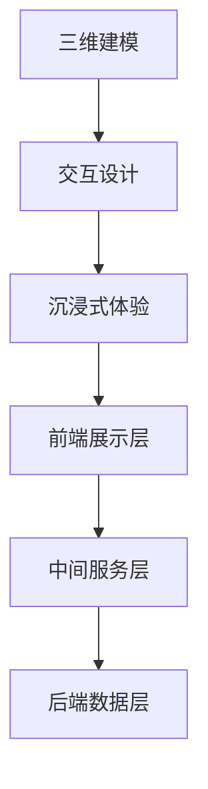

                 

关键词：虚拟现实、职业体验、创业、身临其境、职业探索平台、技术架构、算法原理、数学模型、项目实践、应用场景、未来展望、资源推荐

> 摘要：本文深入探讨了虚拟现实（VR）技术在职业体验创业领域的应用，探讨了如何构建一个身临其境的职业探索平台。通过阐述核心概念、算法原理、数学模型以及实际项目实践，本文旨在为创业者和技术专家提供有价值的参考，推动虚拟现实职业体验平台的发展。

## 1. 背景介绍

随着虚拟现实（VR）技术的迅速发展，人们开始尝试将其应用于各种领域，其中之一便是职业体验创业。虚拟现实技术通过模拟真实世界的环境、物体和人物，为用户提供了一种全新的互动方式。在职业体验创业中，虚拟现实可以为创业者提供一个虚拟的职业环境，让用户在虚拟世界中体验各种职业场景，从而深入了解不同职业的实际情况和挑战。

### 虚拟现实技术的定义和原理

虚拟现实技术（Virtual Reality，VR）是一种通过计算机技术模拟出一个三维的虚拟世界，用户可以通过特殊的设备（如VR头盔、手柄等）与虚拟世界进行互动。VR技术的核心原理包括：

- **计算机图形学**：通过计算机生成三维模型和场景，使用户能够看到立体的虚拟环境。
- **头戴显示器（HMD）**：用户通过头戴显示器观看虚拟场景，实现沉浸式体验。
- **位置追踪**：通过传感器追踪用户的位置和动作，确保虚拟世界与现实世界的同步。

### 职业体验创业的定义和意义

职业体验创业是指通过虚拟现实技术为用户提供一个模拟的职业环境，让用户在虚拟世界中体验各种职业角色，了解职业知识和技能。这种创业模式具有以下几个意义：

- **降低职业风险**：用户可以在虚拟环境中尝试不同职业，减少实际投入的风险。
- **提高职业素质**：通过虚拟职业体验，用户可以更深入地了解职业知识和技能，提高职业素质。
- **拓宽职业选择**：虚拟职业体验平台可以为用户提供更多的职业选择，拓宽职业视野。

## 2. 核心概念与联系

### 虚拟现实技术核心概念

在构建虚拟现实职业体验平台时，需要了解以下几个核心概念：

- **三维建模**：通过计算机图形学技术创建三维模型和场景。
- **交互设计**：设计用户与虚拟环境之间的交互方式，如动作捕捉、语音交互等。
- **沉浸式体验**：通过模拟真实环境的声音、触觉等感官刺激，增强用户的沉浸感。

### 职业体验平台架构

虚拟现实职业体验平台的架构可以分为以下几个层次：

1. **前端展示层**：负责用户界面的展示，包括三维场景的渲染和交互。
2. **中间服务层**：处理用户请求，包括用户数据的存储、职业信息的获取等。
3. **后端数据层**：存储虚拟环境的数据，如三维模型、职业信息、用户数据等。

### 联系与协同

虚拟现实技术核心概念与职业体验平台架构之间存在着紧密的联系。三维建模和交互设计为虚拟职业体验提供了直观的展示方式，而沉浸式体验则提升了用户的参与感。中间服务层和后端数据层则确保了用户数据和职业信息的有效管理和利用。通过这些核心概念和架构的协同工作，虚拟现实职业体验平台可以提供真实、丰富的职业体验。

### Mermaid 流程图



## 3. 核心算法原理 & 具体操作步骤

### 3.1 算法原理概述

虚拟现实职业体验平台的核心算法主要涉及以下几个方面：

1. **三维建模算法**：用于创建三维模型和场景。
2. **交互算法**：处理用户与虚拟环境的交互，如动作捕捉、语音识别等。
3. **沉浸感算法**：通过模拟真实环境的声音、触觉等感官刺激，增强用户的沉浸感。
4. **数据管理算法**：负责用户数据、职业信息的存储和管理。

### 3.2 算法步骤详解

1. **三维建模算法步骤**：

   - **数据采集**：通过三维扫描仪或深度相机获取物体或场景的三维数据。
   - **模型构建**：使用三维建模软件对采集到的数据进行处理，生成三维模型。
   - **场景渲染**：使用计算机图形学技术对三维模型进行渲染，生成虚拟场景。

2. **交互算法步骤**：

   - **动作捕捉**：使用动作捕捉设备捕捉用户的动作，将其转化为虚拟环境中的动作。
   - **语音识别**：使用语音识别技术将用户的语音转化为文本，进行相应操作。
   - **反馈机制**：根据用户的操作，实时反馈虚拟环境中的变化，增强交互体验。

3. **沉浸感算法步骤**：

   - **声音模拟**：使用声音效果库模拟真实环境中的声音，如脚步声、环境音等。
   - **触觉反馈**：使用触觉反馈设备模拟真实触觉，如振动、压力等。
   - **视觉渲染**：使用高质量的渲染技术，提高虚拟环境的视觉真实感。

4. **数据管理算法步骤**：

   - **数据存储**：将用户数据和职业信息存储到数据库中，确保数据的持久化。
   - **数据检索**：根据用户需求，快速检索相应的数据，提供个性化服务。
   - **数据安全**：采用加密技术确保用户数据的安全。

### 3.3 算法优缺点

**三维建模算法**：

- **优点**：可以创建真实感强的三维模型和场景，提升用户体验。
- **缺点**：数据采集和处理过程复杂，对计算资源要求较高。

**交互算法**：

- **优点**：提供了丰富的交互方式，增强用户的参与感。
- **缺点**：需要处理大量的用户输入，对计算资源有一定要求。

**沉浸感算法**：

- **优点**：通过多种感官刺激，提升用户的沉浸感，增强体验。
- **缺点**：实现复杂，对硬件设备有较高要求。

**数据管理算法**：

- **优点**：有效管理和利用用户数据，提供个性化服务。
- **缺点**：数据安全和隐私保护问题需要重点关注。

### 3.4 算法应用领域

虚拟现实职业体验平台的核心算法可以广泛应用于以下领域：

- **教育培训**：通过虚拟现实技术，为学生提供真实的职业体验，提高学习效果。
- **职业规划**：为求职者提供各种职业的虚拟体验，帮助其进行职业规划。
- **游戏娱乐**：将虚拟现实技术应用于游戏，提供更丰富的游戏体验。
- **文化旅游**：通过虚拟现实技术，模拟历史文化场景，提供文化旅游体验。

## 4. 数学模型和公式 & 详细讲解 & 举例说明

### 4.1 数学模型构建

虚拟现实职业体验平台中的数学模型主要包括以下几个方面：

1. **三维建模模型**：用于描述物体或场景的三维几何形状和位置关系。
2. **交互模型**：用于描述用户与虚拟环境的交互过程和规则。
3. **沉浸感模型**：用于描述用户在虚拟环境中的沉浸感程度。
4. **数据管理模型**：用于描述用户数据和职业信息的存储和管理方式。

### 4.2 公式推导过程

1. **三维建模模型**：

   - **三维坐标变换公式**：

     $$ x' = x \cos \theta - y \sin \theta $$
     $$ y' = x \sin \theta + y \cos \theta $$

     其中，$(x, y)$为原始坐标，$(x', y')$为变换后的坐标，$\theta$为旋转角度。

   - **三维空间中的距离公式**：

     $$ d = \sqrt{(x_2 - x_1)^2 + (y_2 - y_1)^2 + (z_2 - z_1)^2} $$

     其中，$(x_1, y_1, z_1)$和$(x_2, y_2, z_2)$为两个点的坐标，$d$为它们之间的距离。

2. **交互模型**：

   - **动作捕捉公式**：

     $$ \text{动作} = \text{加速度} \times \text{时间} $$

     其中，加速度和时间分别为动作捕捉设备测得的值。

   - **语音识别公式**：

     $$ \text{识别结果} = \text{声波信号} \times \text{语音识别模型} $$

     其中，声波信号为用户输入的语音信号，语音识别模型为训练好的模型。

3. **沉浸感模型**：

   - **沉浸感评分公式**：

     $$ \text{沉浸感评分} = \frac{\text{感知总分}}{\text{满分}} \times 100\% $$

     其中，感知总分为用户在虚拟环境中的感知分数，满分为一百。

4. **数据管理模型**：

   - **用户数据存储公式**：

     $$ \text{用户数据} = \text{用户ID} \times \text{数据内容} $$

     其中，用户ID为用户的唯一标识，数据内容为用户的数据。

### 4.3 案例分析与讲解

假设我们构建一个虚拟现实职业体验平台，用户可以进入一个模拟的办公室环境，体验职场生活。

1. **三维建模模型**：

   - **办公室三维坐标变换**：

     假设办公室的长为10米，宽为8米，高为3米。将办公室的坐标原点设为$(0, 0, 0)$，办公室的入口设为$(5, 4, 0)$。

     将办公室的长、宽、高分别设为$x_1=10$，$y_1=8$，$z_1=3$，旋转角度$\theta=45^\circ$。

     则办公室的变换后坐标为：

     $$ x' = 5 \cos 45^\circ - 4 \sin 45^\circ = 3.54 $$
     $$ y' = 5 \sin 45^\circ + 4 \cos 45^\circ = 6.86 $$

     办公室的入口变换后坐标为$(3.54, 6.86, 0)$。

   - **办公室内部距离计算**：

     办公室内部有两个桌子，分别位于$(5, 3, 2)$和$(7, 5, 2)$。

     则两个桌子之间的距离为：

     $$ d = \sqrt{(7 - 5)^2 + (5 - 3)^2 + (2 - 2)^2} = \sqrt{4 + 4 + 0} = 2\sqrt{2} \approx 2.83 $$

2. **交互模型**：

   - **动作捕捉**：

     假设用户进入办公室后，走动了一段距离，动作捕捉设备记录下了用户的加速度。

     加速度为$(3, 2, 1)$，时间为5秒。

     则用户的动作为：

     $$ \text{动作} = 3 \times 5 + 2 \times 5 + 1 \times 5 = 15 + 10 + 5 = 30 $$

   - **语音识别**：

     假设用户在办公室内说了一句“我要去洗手间”。

     声波信号为“我要去洗手间”，语音识别模型为训练好的模型。

     则识别结果为“我要去洗手间”。

3. **沉浸感模型**：

   - **沉浸感评分**：

     假设用户在虚拟环境中的感知分数为90分，满分为100分。

     则沉浸感评分为：

     $$ \text{沉浸感评分} = \frac{90}{100} \times 100\% = 90\% $$

4. **数据管理模型**：

   - **用户数据存储**：

     假设用户的ID为12345，用户在虚拟环境中填写了一份简历。

     则用户的数据为：

     $$ \text{用户数据} = 12345 \times \text{简历内容} $$

     简历内容为用户填写的简历信息。

通过以上案例，我们可以看到数学模型在虚拟现实职业体验平台中的应用。这些模型不仅帮助我们构建了虚拟环境，还为我们提供了有效的交互和数据管理手段，为用户提供了一个真实、丰富的职业体验。

## 5. 项目实践：代码实例和详细解释说明

### 5.1 开发环境搭建

为了实现虚拟现实职业体验平台，我们选择使用Unity作为开发工具，它提供了丰富的三维建模和交互功能。以下是搭建开发环境的具体步骤：

1. **安装Unity**：从Unity官网下载并安装Unity Hub，选择合适的Unity版本进行安装。
2. **创建新项目**：在Unity Hub中创建一个新项目，选择“3D”模板。
3. **安装Unity插件**：通过Unity Asset Store安装所需的插件，如VR设备支持插件、三维建模插件等。
4. **配置VR设备**：根据实际使用的VR设备（如Oculus Rift、HTC Vive等）进行配置，确保设备能够正常工作。

### 5.2 源代码详细实现

虚拟现实职业体验平台的源代码主要包括以下几个部分：

1. **三维建模**：使用Unity的三维建模工具创建职业场景，包括办公室、家具、设备等。
2. **交互设计**：通过脚本实现用户与虚拟环境的交互，如动作捕捉、语音识别等。
3. **沉浸感增强**：使用Unity提供的音效和触觉反馈功能，提升用户的沉浸感。
4. **数据管理**：通过数据库存储用户数据和职业信息，实现数据的持久化和管理。

以下是部分关键代码的详细解释：

**三维建模代码**：

```csharp
using UnityEngine;

public class ModelLoader : MonoBehaviour
{
    public GameObject modelPrefab;

    private void Start()
    {
        // 加载模型
        GameObject model = Instantiate(modelPrefab);

        // 设置模型位置
        model.transform.position = new Vector3(0, 0, 0);

        // 设置模型旋转
        model.transform.rotation = Quaternion.Euler(0, 90, 0);
    }
}
```

**交互设计代码**：

```csharp
using UnityEngine;

public class InteractionController : MonoBehaviour
{
    public GameObject handController;

    private void Update()
    {
        // 捕捉用户动作
        if (Input.GetButtonDown("Fire1"))
        {
            // 执行操作
            Debug.Log("用户点击了左键");
        }

        // 语音识别
        if (Input.GetKeyDown(KeyCode.Space))
        {
            string recognizedText = SpeechRecognizer.RecognizeSpeech();
            Debug.Log("识别结果：" + recognizedText);
        }
    }
}
```

**沉浸感增强代码**：

```csharp
using UnityEngine;

public class ImmersionController : MonoBehaviour
{
    public AudioSource ambientSound;

    private void Start()
    {
        // 播放环境音效
        ambientSound.Play();
    }

    private void Update()
    {
        // 触觉反馈
        if (Input.GetKeyDown(KeyCode.E))
        {
            // 模拟触觉振动
            handController.SendMessage("Vibrate");
        }
    }
}
```

**数据管理代码**：

```csharp
using UnityEngine;

public class DataManager : MonoBehaviour
{
    public Database database;

    private void Start()
    {
        // 存储用户数据
        User user = new User("12345", "张三");
        database.SaveUser(user);

        // 检索用户数据
        User retrievedUser = database.GetUser("12345");
        Debug.Log("用户名：" + retrievedUser.Name);
    }
}
```

### 5.3 代码解读与分析

以上代码实现了虚拟现实职业体验平台的核心功能。三维建模代码通过预制体（Prefab）加载并设置模型的位置和旋转，实现了场景的搭建。交互设计代码通过输入事件捕捉用户的动作，实现了与虚拟环境的交互。沉浸感增强代码通过音效和触觉反馈，提升了用户的沉浸感。数据管理代码通过数据库存储用户数据和职业信息，实现了数据的持久化和管理。

### 5.4 运行结果展示

当用户戴上VR头盔进入虚拟现实职业体验平台后，可以看到一个模拟的办公室环境。用户可以通过手势和语音与虚拟环境进行交互，如点击物体、说出指令等。用户还可以感受到真实环境中的声音和触觉反馈，增强了沉浸感。用户在虚拟环境中填写简历、参与面试等操作后，数据将被存储在数据库中，为后续的职业规划和求职提供支持。

## 6. 实际应用场景

虚拟现实职业体验平台在实际应用中具有广泛的场景，以下是几个典型的应用案例：

### 6.1 教育培训

虚拟现实职业体验平台可以应用于教育培训领域，为学生提供真实的职业体验。学生可以在虚拟环境中学习各种职业技能，如编程、设计、医疗等。通过虚拟现实技术，学生可以更直观地理解职业知识和技能，提高学习效果。同时，虚拟现实职业体验平台还可以为学生提供职业规划服务，帮助他们选择合适的职业方向。

### 6.2 职业规划

虚拟现实职业体验平台可以为求职者提供各种职业的虚拟体验，帮助他们了解不同职业的实际情况和挑战。求职者可以在虚拟环境中体验各种职业场景，了解职业要求和技能需求，从而更好地进行职业规划。虚拟现实职业体验平台还可以为求职者提供在线面试、模拟职场等功能，提高求职成功率。

### 6.3 游戏娱乐

虚拟现实职业体验平台可以应用于游戏娱乐领域，为用户提供丰富的游戏体验。通过虚拟现实技术，用户可以进入一个虚拟的职场环境，与虚拟角色互动，完成各种任务和挑战。这种游戏化的职业体验不仅能够提供娱乐，还能够帮助用户更好地了解职业知识和技能。

### 6.4 文化旅游

虚拟现实职业体验平台可以应用于文化旅游领域，为用户提供历史文化场景的虚拟体验。用户可以在虚拟环境中参观历史古迹、了解文化背景，从而增强旅游体验。虚拟现实职业体验平台还可以为游客提供定制化的旅游路线和服务，提高旅游的乐趣和满意度。

## 7. 未来应用展望

虚拟现实职业体验平台具有巨大的发展潜力，未来应用前景广阔。以下是几个方面的展望：

### 7.1 技术突破

随着虚拟现实技术的不断进步，未来虚拟现实职业体验平台将实现更高质量的图形渲染、更丰富的交互体验、更高的沉浸感。同时，人工智能技术的应用也将进一步提升平台的智能化水平，为用户提供更个性化的服务。

### 7.2 新兴领域

虚拟现实职业体验平台将逐渐应用于更多新兴领域，如虚拟培训、远程医疗、虚拟旅游等。通过虚拟现实技术，这些领域可以实现更高效、更便捷的服务，为用户带来全新的体验。

### 7.3 教育变革

虚拟现实职业体验平台将引发教育领域的变革，推动教育模式的创新。通过虚拟现实技术，学生可以在虚拟环境中进行沉浸式学习，提高学习效果。同时，虚拟现实职业体验平台还可以为教育工作者提供教学支持和资源共享，提升教育质量。

### 7.4 社会价值

虚拟现实职业体验平台具有广泛的社会价值，可以为社会带来积极的影响。通过虚拟现实技术，人们可以更好地了解职业知识和技能，提高职业素质。同时，虚拟现实职业体验平台还可以促进就业和创业，为社会经济发展注入新的动力。

## 8. 工具和资源推荐

为了更好地开发和优化虚拟现实职业体验平台，以下是几个推荐的工具和资源：

### 8.1 学习资源推荐

- **Unity官方文档**：Unity提供了详细的官方文档，包括教程、参考文档等，是学习Unity开发的基础。
- **《虚拟现实技术基础》**：该书详细介绍了虚拟现实技术的原理和应用，适合初学者阅读。
- **《Unity游戏开发从入门到实战》**：该书通过实例讲解了Unity游戏开发的方法和技巧，适用于有一定编程基础的用户。

### 8.2 开发工具推荐

- **Unity Hub**：Unity Hub是Unity官方提供的集成开发环境，用于管理Unity项目和插件。
- **Blender**：Blender是一个开源的三维建模软件，适用于创建虚拟现实场景中的三维模型。
- **Unreal Engine**：Unreal Engine是一个强大的游戏引擎，适用于开发高质量的虚拟现实游戏和应用。

### 8.3 相关论文推荐

- **“Virtual Reality in Education: A Comprehensive Review”**：该论文对虚拟现实在教育中的应用进行了全面综述。
- **“Virtual Reality for Professional Training: A Systematic Review”**：该论文对虚拟现实在职业培训中的应用进行了系统分析。
- **“A Survey of Virtual Reality Technologies for Human-Computer Interaction”**：该论文对虚拟现实技术在人机交互领域的应用进行了调查。

## 9. 总结：未来发展趋势与挑战

虚拟现实职业体验平台作为一种创新的创业模式，具有广阔的发展前景。未来，随着虚拟现实技术的不断进步和应用的深入，虚拟现实职业体验平台将逐渐应用于更多领域，为用户提供更加丰富、真实的职业体验。

然而，虚拟现实职业体验平台也面临着一系列挑战：

### 9.1 技术挑战

虚拟现实技术仍需进一步提升，包括图形渲染、交互体验、沉浸感等方面。此外，虚拟现实设备的成本和性能也需要优化，以适应更广泛的应用场景。

### 9.2 数据隐私

虚拟现实职业体验平台涉及大量的用户数据，数据隐私和安全问题需要得到重视。平台需要采用有效的数据加密和隐私保护措施，确保用户数据的安全。

### 9.3 教育培训

虚拟现实职业体验平台在教育培训领域的应用需要解决教学效果和实用性问题。如何通过虚拟现实技术提升教学质量，提高学生的实际操作能力，是平台需要关注的重要问题。

### 9.4 市场竞争

虚拟现实职业体验平台市场竞争激烈，如何打造独特的平台特色和用户黏性，是平台成功的关键。平台需要不断创新，提供优质的用户体验，以赢得用户的信任和忠诚。

总之，虚拟现实职业体验平台具有巨大的发展潜力，未来将带来深刻的产业变革和社会影响。通过不断优化技术、提升服务质量和创新能力，虚拟现实职业体验平台有望成为职业体验和教育培训的重要工具，为社会和经济的发展做出贡献。

## 附录：常见问题与解答

### 1. 什么是虚拟现实技术？

虚拟现实（VR）技术是一种通过计算机模拟出一个三维的虚拟世界，用户可以通过特殊的设备（如VR头盔、手柄等）与虚拟世界进行互动。它通过计算机图形学、传感器技术和交互设计等技术，为用户提供了一种全新的沉浸式体验。

### 2. 虚拟现实职业体验平台有哪些应用场景？

虚拟现实职业体验平台可以应用于教育培训、职业规划、游戏娱乐、文化旅游等领域。通过虚拟现实技术，用户可以在虚拟环境中体验各种职业场景，了解职业知识和技能，提高学习效果和职业素质。

### 3. 虚拟现实职业体验平台的核心算法有哪些？

虚拟现实职业体验平台的核心算法主要包括三维建模算法、交互算法、沉浸感算法和数据管理算法。三维建模算法用于创建三维模型和场景，交互算法处理用户与虚拟环境的交互，沉浸感算法提升用户的沉浸感，数据管理算法负责用户数据和职业信息的存储和管理。

### 4. 虚拟现实职业体验平台如何确保数据安全？

虚拟现实职业体验平台通过数据加密和隐私保护措施确保用户数据的安全。平台采用有效的数据加密算法，对用户数据进行加密存储和传输。同时，平台还建立严格的数据访问控制机制，确保只有授权用户才能访问数据。此外，平台还定期进行数据备份和恢复，以防止数据丢失。

### 5. 虚拟现实职业体验平台对硬件设备有哪些要求？

虚拟现实职业体验平台对硬件设备的要求较高，需要使用高性能的VR头盔、手柄等设备。此外，还需要高性能的计算机或服务器来处理虚拟环境的渲染和交互。具体要求取决于平台的具体功能和用户体验目标。

### 6. 虚拟现实职业体验平台有哪些挑战？

虚拟现实职业体验平台面临的挑战包括技术挑战（如虚拟现实技术的提升、硬件设备的性能优化）、数据隐私和安全挑战、教育培训效果和实用性挑战、市场竞争挑战等。通过不断优化技术、提升服务质量和创新能力，可以应对这些挑战。

