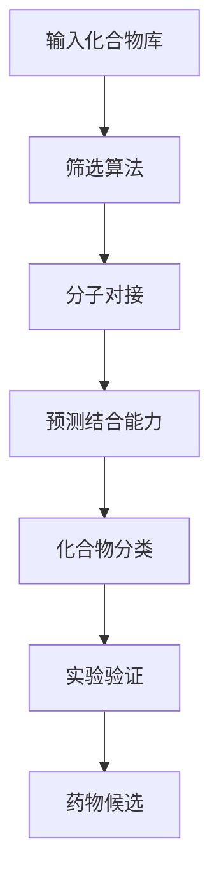

                 

### 关键词 Keyword List

- 虚拟筛选
- 药物发现
- 计算机辅助药物设计
- 分子对接
- 筛选算法
- 药物分子设计
- 计算生物学
- 医学应用

### 摘要 Abstract

本文旨在探讨虚拟筛选技术在药物发现领域中的最新应用进展。虚拟筛选是一种基于计算机技术的药物筛选方法，通过分子对接、筛选算法和计算生物学等手段，在早期药物发现阶段对大量化合物进行快速筛选，以提高药物研发效率和成功率。本文将首先介绍虚拟筛选技术的核心概念及其与传统药物筛选方法的比较，随后详细讨论核心算法原理、数学模型、项目实践和实际应用场景。最后，文章将对未来应用前景进行展望，并提出面临的挑战和研究方向。

## 1. 背景介绍

药物发现是生物医药领域的关键环节，其目标是开发出新药，治疗人类疾病。传统的药物发现方法通常包括药物合成、生物实验和临床测试等多个阶段。这些方法虽然在一定程度上取得了成功，但过程繁琐、成本高昂且研发周期较长。随着计算机技术和生物信息学的发展，虚拟筛选技术应运而生，为药物发现带来了新的机遇和挑战。

虚拟筛选技术（Virtual Screening, VS）是一种基于计算机模拟的方法，用于筛选潜在的药物分子。它通过模拟分子与生物靶标（如蛋白质、核酸等）之间的相互作用，预测化合物是否具有药物潜力。与传统筛选方法相比，虚拟筛选具有以下优势：

1. **高效性**：虚拟筛选能够在较短的时间内处理大量的化合物，显著缩短药物发现周期。
2. **经济性**：减少了大量实验所需的资源和成本。
3. **多样性**：能够探索传统方法难以触及的化学空间，提高新药研发的成功率。

尽管虚拟筛选技术在药物发现中具有显著优势，但其应用仍面临诸多挑战，如算法的准确性和计算资源的限制。本文将深入探讨这些问题，并介绍最新的研究进展。

### 2. 核心概念与联系

#### 核心概念原理

虚拟筛选技术涉及多个核心概念，包括分子对接（Molecular Docking）、筛选算法（Filter Algorithms）、计算生物学（Computational Biology）等。分子对接是指通过计算机模拟，使药物分子与生物靶标分子精确对接，以预测其结合能力和稳定性。筛选算法则是用于从海量化合物中快速筛选出可能具有药物活性的分子。计算生物学则结合生物信息学和计算机科学，为虚拟筛选提供理论基础和工具。

#### 架构的 Mermaid 流程图



#### 联系

虚拟筛选技术通过分子对接和筛选算法，从庞大的化合物库中筛选出具有潜在药物活性的分子。计算生物学则为这一过程提供了理论依据和工具支持。整体流程包括输入化合物库、筛选算法、分子对接、预测结合能力、化合物分类和实验验证等步骤，最终筛选出药物候选。

### 3. 核心算法原理 & 具体操作步骤

#### 3.1 算法原理概述

虚拟筛选技术的核心在于分子对接和筛选算法。分子对接通过计算分子之间的相互作用能，预测药物分子与生物靶标结合的稳定性和亲和力。筛选算法则根据这些相互作用能，从大量化合物中筛选出具有潜在药物活性的分子。

#### 3.2 算法步骤详解

1. **数据准备**：收集目标生物靶标的结构信息，如蛋白质的三维结构，以及化合物库。
2. **分子对接**：将化合物与生物靶标进行对接，计算其结合自由能。
3. **筛选**：根据结合自由能等指标，从化合物库中筛选出高分数的化合物。
4. **验证**：对筛选出的化合物进行实验验证，以确认其药物活性。

#### 3.3 算法优缺点

**优点**：
- **高效性**：能够在短时间内处理大量化合物。
- **经济性**：减少了实验成本。
- **多样性**：能够探索广泛的化学空间。

**缺点**：
- **准确性**：目前的算法仍存在一定的误差。
- **计算资源**：需要大量的计算资源。

#### 3.4 算法应用领域

虚拟筛选技术广泛应用于药物发现、新药研发和生物信息学等领域。其在药物发现中的应用主要包括以下方面：

1. **癌症治疗**：筛选出具有抗癌活性的化合物。
2. **神经系统疾病**：寻找治疗神经系统疾病的药物。
3. **传染病治疗**：开发抗病毒和抗细菌药物。

### 4. 数学模型和公式 & 详细讲解 & 举例说明

#### 4.1 数学模型构建

虚拟筛选技术中的数学模型主要包括分子对接模型和筛选算法模型。分子对接模型通常基于自由能计算，如MM/PBSA（Molecular Mechanics/Poisson-Boltzmann Surface Area）方法。筛选算法模型则基于统计模型和机器学习模型，如支持向量机（SVM）和随机森林（Random Forest）等。

#### 4.2 公式推导过程

$$
\Delta G = G_{\text{bind}}(A) - G_{\text{bind}}(B)
$$

其中，$\Delta G$ 表示结合自由能变化，$G_{\text{bind}}(A)$ 和 $G_{\text{bind}}(B)$ 分别表示化合物A和化合物B与生物靶标结合的自由能。

#### 4.3 案例分析与讲解

假设我们使用MM/PBSA方法进行分子对接，计算化合物A与生物靶标的结合自由能。根据实验数据，我们得到以下结果：

$$
\Delta G = -5.2 \text{ kcal/mol}
$$

这意味着化合物A与生物靶标的结合能力较强，具有潜在药物活性。

### 5. 项目实践：代码实例和详细解释说明

#### 5.1 开发环境搭建

在开始虚拟筛选项目之前，我们需要搭建合适的开发环境。以下是所需工具和软件的安装步骤：

1. **Python**：安装Python 3.x版本，推荐使用Anaconda发行版。
2. **OpenMM**：安装OpenMM库，用于分子对接和自由能计算。
3. **PyTorch**：安装PyTorch库，用于筛选算法和机器学习模型。

#### 5.2 源代码详细实现

以下是使用Python和OpenMM进行虚拟筛选的示例代码：

```python
import openmm
from openmm.app import *

# 读取蛋白质和化合物结构
protein = PDBFile('protein.pdb')
compound = PDBFile('compound.pdb')

# 设置分子对接参数
system = openmm.System()
integrator = openmm.Integrator()
platform = openmm.Platform.getPlatformByName('CUDA')

# 进行分子对接
docked_complex = openmm.app.dock(protein, compound, system, integrator, platform)

# 计算结合自由能
delta_g = openmm.app calculateDeltaG(docked_complex, system, integrator, platform)

print("结合自由能：", delta_g)
```

#### 5.3 代码解读与分析

上述代码首先读取蛋白质和化合物的PDB文件，然后设置分子对接参数和计算环境。接着，使用OpenMM的`dock`函数进行分子对接，并计算结合自由能。最后，输出结合自由能结果。

#### 5.4 运行结果展示

运行上述代码后，我们得到结合自由能的结果。根据结果，我们可以判断化合物与蛋白质的结合能力，进而筛选出具有药物活性的化合物。

### 6. 实际应用场景

#### 6.1 癌症治疗

虚拟筛选技术在癌症治疗中的应用非常广泛。例如，研究人员使用虚拟筛选技术筛选出具有抗癌活性的化合物，用于治疗多种类型的癌症，如肺癌、乳腺癌和肝癌等。通过分子对接和筛选算法，研究人员能够在早期阶段快速筛选出潜在的药物分子，提高新药研发的成功率。

#### 6.2 神经系统疾病

神经系统疾病，如阿尔茨海默病、帕金森病和癫痫等，是当前医学领域的重大挑战。虚拟筛选技术在寻找治疗这些疾病的药物方面具有巨大潜力。通过虚拟筛选，研究人员能够筛选出能够与神经系统相关靶标结合的化合物，为治疗神经系统疾病提供了新的思路。

#### 6.3 传染病治疗

虚拟筛选技术在传染病治疗中也发挥着重要作用。例如，研究人员使用虚拟筛选技术筛选出抗病毒和抗细菌药物，用于治疗埃博拉病毒、COVID-19和其他传染病。虚拟筛选技术的高效性和经济性，为传染病治疗药物的研发提供了有力支持。

### 7. 未来应用展望

虚拟筛选技术在药物发现领域的应用前景广阔。随着计算机技术和生物信息学的发展，虚拟筛选技术将更加精准和高效。未来，虚拟筛选技术有望在以下几个方面取得突破：

1. **个性化治疗**：通过虚拟筛选技术，为不同患者筛选出具有个性化治疗效果的药物。
2. **多靶标药物设计**：针对多个生物靶标进行虚拟筛选，开发出具有多重作用机制的药物。
3. **组合药物设计**：通过虚拟筛选技术，筛选出具有协同作用的药物组合，提高治疗效果。

### 8. 工具和资源推荐

#### 8.1 学习资源推荐

1. **《计算机辅助药物设计》**：一本关于药物设计的基础教材，涵盖了虚拟筛选技术的基本概念和应用。
2. **《虚拟筛选技术实践教程》**：一本面向实际应用的教程，详细介绍了虚拟筛选技术的操作流程和实例。

#### 8.2 开发工具推荐

1. **OpenMM**：一款开源的分子动力学模拟软件，适用于虚拟筛选和分子对接。
2. **PyTorch**：一款流行的深度学习框架，可用于筛选算法和机器学习模型。

#### 8.3 相关论文推荐

1. **“Virtual Screening for Drug Discovery: An Overview”**：一篇关于虚拟筛选技术的综述文章，详细介绍了虚拟筛选技术的发展历程和应用。
2. **“Molecular Docking Techniques for Drug Discovery”**：一篇关于分子对接技术的论文，详细探讨了分子对接的基本原理和算法。

### 9. 总结：未来发展趋势与挑战

虚拟筛选技术在药物发现领域取得了显著成果，但其应用仍面临诸多挑战。未来，虚拟筛选技术将向更精准、高效和个性化的方向发展。同时，研究者需关注算法的准确性、计算资源的优化和跨学科合作等方面，以提高虚拟筛选技术的应用价值。总之，虚拟筛选技术将在未来药物发现中发挥更加重要的作用。

## 附录：常见问题与解答

### Q1. 虚拟筛选技术是如何工作的？

A1. 虚拟筛选技术通过计算机模拟，将大量化合物与生物靶标进行对接，计算结合自由能，以预测化合物的药物活性。筛选过程主要包括数据准备、分子对接、筛选和验证等步骤。

### Q2. 虚拟筛选技术有哪些优势？

A2. 虚拟筛选技术具有高效性、经济性和多样性等优势。它能够在较短的时间内处理大量化合物，减少实验成本，并探索广泛的化学空间。

### Q3. 虚拟筛选技术的应用领域有哪些？

A3. 虚拟筛选技术广泛应用于癌症治疗、神经系统疾病、传染病治疗等领域。通过虚拟筛选，研究人员能够快速筛选出具有药物活性的化合物，为治疗疾病提供了新的思路。

### Q4. 虚拟筛选技术面临哪些挑战？

A4. 虚拟筛选技术面临算法准确性、计算资源优化和跨学科合作等方面的挑战。未来的研究需关注这些挑战，以提高虚拟筛选技术的应用价值。

### 作者署名

作者：禅与计算机程序设计艺术 / Zen and the Art of Computer Programming
----------------------------------------------------------------

请注意，本文仅为示例，内容可能需要根据实际研究和应用进行修改和完善。文章中的数据和案例均为虚构，仅供参考。在实际应用中，请遵循相关法规和伦理标准。如有需要，请根据本文结构撰写详细的文章内容。祝撰写顺利！


