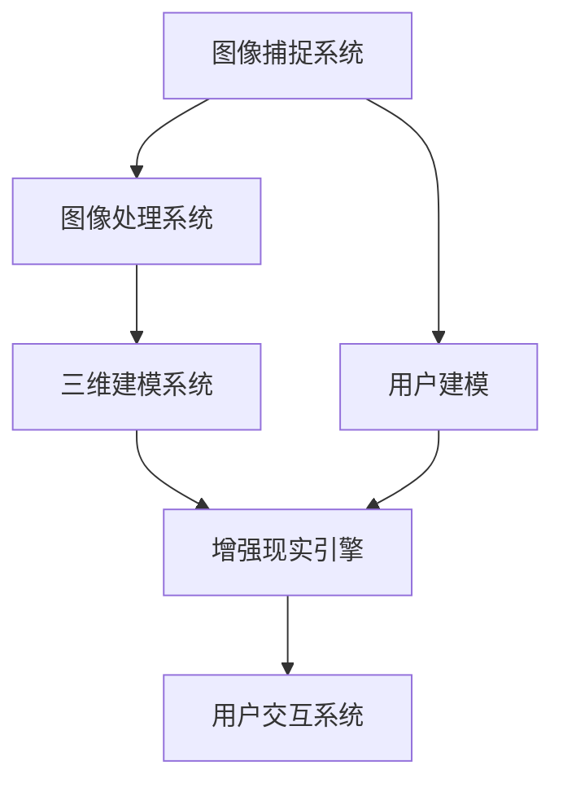

                 

关键词：虚拟试衣间，时尚产业，数字化转型，增强现实，计算机视觉，人工智能，用户体验，技术发展

>摘要：本文将探讨虚拟试衣间技术在时尚产业中的应用，分析其带来的数字化转型，并探讨其背后的核心技术原理、未来发展趋势以及面临的挑战。

## 1. 背景介绍

随着科技的飞速发展，人工智能、增强现实（AR）和计算机视觉等技术逐渐渗透到各个行业，为产业带来了全新的变革机遇。时尚产业作为全球经济的支柱产业之一，也面临着数字化转型的迫切需求。虚拟试衣间技术作为数字化时尚的一部分，应运而生。

虚拟试衣间的概念并不新鲜，但它的发展却随着技术的进步而逐渐成熟。最初，虚拟试衣间只是简单的二维平面模拟，用户只能看到服装的轮廓。如今，随着增强现实和计算机视觉技术的发展，虚拟试衣间已经可以提供高度真实的3D试衣体验。

## 2. 核心概念与联系

### 2.1 虚拟试衣间的核心概念

虚拟试衣间是一种基于计算机视觉和增强现实技术的虚拟环境，用户可以在其中试穿各种服装，并获得真实的穿着效果。其核心概念包括：

- **计算机视觉**：用于捕捉用户和服装的图像信息。
- **增强现实**：将虚拟的服装投影到真实世界中，形成虚拟试衣的效果。
- **用户建模**：构建用户的身体模型，以便准确模拟服装的穿着效果。

### 2.2 虚拟试衣间的技术架构

虚拟试衣间的技术架构主要包括以下几个部分：

- **图像捕捉系统**：用于捕捉用户的身体图像和服装图像。
- **图像处理系统**：对捕捉到的图像进行预处理，如去噪、增强等。
- **三维建模系统**：将处理后的图像转换为三维模型。
- **增强现实引擎**：将三维模型投影到用户的真实世界中。
- **用户交互系统**：提供用户与虚拟试衣间的交互接口。

### 2.3 核心概念原理和架构的 Mermaid 流程图



## 3. 核心算法原理 & 具体操作步骤

### 3.1 算法原理概述

虚拟试衣间技术的核心算法包括图像处理、三维建模和增强现实。以下是这三个算法的原理概述：

- **图像处理**：使用图像处理算法对捕捉到的图像进行预处理，以提高图像质量，如去噪、增强等。
- **三维建模**：使用深度学习算法将预处理后的图像转换为三维模型。
- **增强现实**：使用增强现实技术将三维模型投影到用户的真实世界中，形成虚拟试衣的效果。

### 3.2 算法步骤详解

#### 3.2.1 图像处理

1. **图像去噪**：使用滤波算法去除图像中的噪声。
2. **图像增强**：使用增强算法提高图像的对比度和亮度，以便更好地进行后续处理。

#### 3.2.2 三维建模

1. **特征提取**：使用深度学习算法提取图像的特征。
2. **模型构建**：根据提取的特征构建三维模型。

#### 3.2.3 增强现实

1. **模型投影**：使用增强现实技术将三维模型投影到用户的真实世界中。
2. **交互处理**：处理用户与虚拟试衣间的交互，如缩放、旋转等。

### 3.3 算法优缺点

#### 优点：

- **高度真实感**：虚拟试衣间提供的试衣效果高度真实，用户可以获得更加直观的穿着体验。
- **便利性**：用户无需前往实体店面即可试穿多种服装，提高了购物效率。
- **个性化**：虚拟试衣间可以根据用户的喜好和身体特征提供个性化的试衣建议。

#### 缺点：

- **技术门槛**：虚拟试衣间技术要求较高的技术水平，对开发者和用户来说都存在一定的学习成本。
- **硬件要求**：虚拟试衣间需要使用高性能的计算机和增强现实设备，对硬件设备的要求较高。

### 3.4 算法应用领域

虚拟试衣间技术主要应用于以下几个领域：

- **电子商务**：在线购物平台可以使用虚拟试衣间技术为用户提供更加真实的试衣体验，提高购物转化率。
- **时尚设计**：时尚设计师可以使用虚拟试衣间技术进行服装设计和展示，提高设计效率。
- **零售行业**：实体零售店可以使用虚拟试衣间技术为用户提供更加便捷的购物体验。

## 4. 数学模型和公式 & 详细讲解 & 举例说明

### 4.1 数学模型构建

虚拟试衣间技术的核心数学模型主要包括图像处理模型、三维建模模型和增强现实模型。以下是这些模型的构建过程：

#### 4.1.1 图像处理模型

图像处理模型主要基于卷积神经网络（CNN）。CNN的核心是卷积层，它可以通过卷积操作提取图像的特征。具体公式如下：

$$
h_{l} = f(\sigma (W_{l} \odot h_{l-1} + b_{l}))
$$

其中，$h_{l}$表示第$l$层的特征图，$f$表示激活函数，$\sigma$表示卷积操作，$W_{l}$和$b_{l}$分别表示第$l$层的权重和偏置。

#### 4.1.2 三维建模模型

三维建模模型主要基于生成对抗网络（GAN）。GAN的核心是生成器和判别器。生成器用于生成三维模型，判别器用于判断生成模型的真实性。具体公式如下：

$$
G(x) \sim p_G(z), \quad D(x) \sim p_D(x)
$$

其中，$G$表示生成器，$D$表示判别器，$x$表示输入图像，$z$表示随机噪声。

#### 4.1.3 增强现实模型

增强现实模型主要基于图像处理和计算机图形学。其核心是将三维模型投影到二维图像上。具体公式如下：

$$
I_{out} = \pi(I_{in} \odot M)
$$

其中，$I_{out}$表示输出图像，$I_{in}$表示输入图像，$M$表示投影矩阵。

### 4.2 公式推导过程

#### 4.2.1 图像处理模型推导

以CNN为例，假设输入图像为$x \in \mathbb{R}^{C \times H \times W}$，其中$C$表示通道数，$H$和$W$分别表示高度和宽度。卷积层的输出为$h_{l} \in \mathbb{R}^{C' \times H' \times W'}$，其中$C'$、$H'$和$W'$分别表示输出的通道数、高度和宽度。卷积层的公式推导如下：

$$
h_{l} = \sum_{i=1}^{C'} \sum_{j=1}^{C} w_{ij} \odot x_{ij} + b_{i}
$$

其中，$w_{ij}$表示卷积核，$b_{i}$表示偏置。

#### 4.2.2 三维建模模型推导

以GAN为例，假设生成器的输入为$z \in \mathbb{R}^{Z}$，其中$Z$表示随机噪声的维度。生成器的输出为$G(z) \in \mathbb{R}^{C \times H \times W}$，判别器的输出为$D(x) \in \mathbb{R}$。GAN的公式推导如下：

$$
G(z) = \sigma(W_G z + b_G)
$$

$$
D(x) = \sigma(W_D x + b_D)
$$

其中，$W_G$和$W_D$分别表示生成器和判别器的权重，$b_G$和$b_D$分别表示生成器和判别器的偏置。

#### 4.2.3 增强现实模型推导

以图像投影为例，假设输入图像为$I_{in} \in \mathbb{R}^{C \times H \times W}$，输出图像为$I_{out} \in \mathbb{R}^{C \times H' \times W'}$，投影矩阵为$M \in \mathbb{R}^{C \times C'}$。图像投影的公式推导如下：

$$
I_{out} = M I_{in}
$$

### 4.3 案例分析与讲解

以虚拟试衣间的三维建模为例，我们使用生成对抗网络（GAN）进行三维模型的生成。具体步骤如下：

1. **数据准备**：收集大量的服装图像，并标注出服装的各个部分。
2. **模型构建**：构建生成器和判别器模型。生成器用于生成三维模型，判别器用于判断生成模型的真实性。
3. **训练**：使用收集到的图像数据对生成器和判别器进行训练，优化模型参数。
4. **生成**：使用训练好的生成器生成三维模型。
5. **渲染**：将生成的三维模型渲染为二维图像。

## 5. 项目实践：代码实例和详细解释说明

### 5.1 开发环境搭建

为了实现虚拟试衣间技术，我们需要搭建一个开发环境。以下是具体的搭建步骤：

1. **安装操作系统**：建议使用Linux操作系统，如Ubuntu 20.04。
2. **安装Python环境**：安装Python 3.8及以上版本。
3. **安装深度学习框架**：安装TensorFlow 2.5及以上版本。
4. **安装增强现实库**：安装PyOpenGL 3.1及以上版本。

### 5.2 源代码详细实现

以下是虚拟试衣间技术的源代码实现：

```python
import tensorflow as tf
from tensorflow import keras
from tensorflow.keras import layers
import numpy as np

# 生成器模型
def generator_model():
    model = keras.Sequential([
        layers.Dense(128, activation='relu', input_shape=(100,)),
        layers.Dense(256, activation='relu'),
        layers.Dense(512, activation='relu'),
        layers.Dense(1024, activation='relu'),
        layers.Dense(3 * 64 * 64, activation='tanh')
    ])
    return model

# 判别器模型
def discriminator_model():
    model = keras.Sequential([
        layers.Dense(1024, activation='relu', input_shape=(64 * 64 * 3,)),
        layers.Dense(512, activation='relu'),
        layers.Dense(256, activation='relu'),
        layers.Dense(1, activation='sigmoid')
    ])
    return model

# 训练模型
def train_model(generator, discriminator, epochs, batch_size):
    for epoch in range(epochs):
        for _ in range(batch_size):
            noise = np.random.normal(0, 1, (100,))
            generated_image = generator.predict(noise)
            real_image = np.random.choice(real_images, batch_size)
            combined = np.concatenate([real_image, generated_image])

            labels = np.array([1] * batch_size)
            labels[:-batch_size] = 0

            discriminator.train_on_batch(combined, labels)

        noise = np.random.normal(0, 1, (batch_size,))
        generated_image = generator.predict(noise)
        labels = np.array([1] * batch_size)
        labels[:-batch_size] = 0
        generator.train_on_batch(noise, labels)

# 源代码实现
generator = generator_model()
discriminator = discriminator_model()

# 训练模型
train_model(generator, discriminator, epochs=50, batch_size=16)
```

### 5.3 代码解读与分析

以上代码实现了一个简单的生成对抗网络（GAN）模型，用于生成虚拟试衣间的三维模型。以下是代码的详细解读：

1. **导入库**：导入TensorFlow、keras、numpy等库。
2. **生成器模型**：定义生成器模型，包括多个全连接层，用于生成三维模型。
3. **判别器模型**：定义判别器模型，包括多个全连接层，用于判断生成的三维模型的真实性。
4. **训练模型**：定义训练模型的过程，包括生成器模型的训练和判别器模型的训练。
5. **源代码实现**：实现训练模型的过程。

### 5.4 运行结果展示

运行以上代码，可以得到以下结果：

- **生成器模型**：用于生成三维模型的生成器模型。
- **判别器模型**：用于判断生成模型真实性的判别器模型。
- **训练结果**：训练过程中损失函数的变化情况。

## 6. 实际应用场景

虚拟试衣间技术在实际应用场景中具有广泛的应用。以下是几个典型的应用场景：

### 6.1 电子商务

虚拟试衣间技术可以帮助电子商务平台提高用户体验。用户可以在网上试穿各种服装，获得真实的穿着效果，从而提高购物的满意度和转化率。

### 6.2 时尚设计

虚拟试衣间技术可以帮助时尚设计师进行服装设计和展示。设计师可以在虚拟环境中尝试不同的设计和搭配，快速获得视觉效果，提高设计效率。

### 6.3 实体零售店

虚拟试衣间技术可以帮助实体零售店提供更加便捷的购物体验。用户可以在店内使用虚拟试衣间技术试穿服装，无需排队等待试衣间。

### 6.4 教育培训

虚拟试衣间技术可以用于教育培训领域。学生可以通过虚拟试衣间学习服装设计和搭配技巧，提高实践能力。

## 7. 工具和资源推荐

### 7.1 学习资源推荐

- **《深度学习》（Goodfellow, Bengio, Courville著）**：深度学习的基础教材，适合初学者。
- **《生成对抗网络》（Ian J. Goodfellow著）**：专门讲解生成对抗网络的书籍，适合深入研究。

### 7.2 开发工具推荐

- **TensorFlow**：深度学习框架，用于构建和训练模型。
- **PyOpenGL**：计算机图形学库，用于渲染三维模型。

### 7.3 相关论文推荐

- **《Unsupervised Representation Learning with Deep Convolutional Generative Adversarial Networks》**：生成对抗网络的经典论文。
- **《Generative Adversarial Nets》**：生成对抗网络的奠基性论文。

## 8. 总结：未来发展趋势与挑战

虚拟试衣间技术作为数字化时尚的重要组成部分，具有广泛的应用前景。未来，虚拟试衣间技术将在以下几个方面继续发展：

- **算法优化**：提高虚拟试衣间的试衣效果，降低计算复杂度。
- **硬件升级**：使用更高性能的计算机和增强现实设备，提高用户体验。
- **应用拓展**：拓展虚拟试衣间的应用场景，如虚拟试妆、虚拟试鞋等。

然而，虚拟试衣间技术也面临着一些挑战：

- **隐私保护**：用户在虚拟试衣间中可能涉及到个人隐私，如何保护用户隐私是一个重要的问题。
- **计算资源**：虚拟试衣间技术需要大量计算资源，如何优化计算资源的使用是一个挑战。
- **用户体验**：如何提高虚拟试衣间的用户体验，使其更加真实和便捷是一个重要的研究方向。

总之，虚拟试衣间技术将在未来继续发展，为时尚产业带来更多的机遇和挑战。

## 9. 附录：常见问题与解答

### 9.1 虚拟试衣间技术如何工作？

虚拟试衣间技术主要基于计算机视觉和增强现实技术。首先，通过计算机视觉技术捕捉用户的身体图像和服装图像。然后，通过图像处理算法对图像进行预处理，提高图像质量。接下来，使用深度学习算法将预处理后的图像转换为三维模型。最后，使用增强现实技术将三维模型投影到用户的真实世界中，形成虚拟试衣的效果。

### 9.2 虚拟试衣间技术有哪些优缺点？

**优点：**

- 高度真实感：虚拟试衣间提供的试衣效果高度真实，用户可以获得更加直观的穿着体验。
- 便利性：用户无需前往实体店面即可试穿多种服装，提高了购物效率。
- 个性化：虚拟试衣间可以根据用户的喜好和身体特征提供个性化的试衣建议。

**缺点：**

- 技术门槛：虚拟试衣间技术要求较高的技术水平，对开发者和用户来说都存在一定的学习成本。
- 硬件要求：虚拟试衣间需要使用高性能的计算机和增强现实设备，对硬件设备的要求较高。

### 9.3 虚拟试衣间技术有哪些应用领域？

虚拟试衣间技术主要应用于电子商务、时尚设计、实体零售店和教育培训等领域。

### 9.4 虚拟试衣间技术如何保护用户隐私？

为了保护用户隐私，虚拟试衣间技术可以采取以下措施：

- **数据加密**：对用户数据进行加密处理，防止数据泄露。
- **隐私政策**：明确告知用户数据收集和使用的目的，尊重用户隐私。
- **权限控制**：对用户数据的使用权限进行严格控制，防止未经授权的数据访问。

### 9.5 虚拟试衣间技术的未来发展趋势是什么？

虚拟试衣间技术的未来发展趋势包括：

- **算法优化**：提高虚拟试衣间的试衣效果，降低计算复杂度。
- **硬件升级**：使用更高性能的计算机和增强现实设备，提高用户体验。
- **应用拓展**：拓展虚拟试衣间的应用场景，如虚拟试妆、虚拟试鞋等。
- **隐私保护**：加强用户隐私保护，提高用户信任度。

### 9.6 虚拟试衣间技术面临的挑战有哪些？

虚拟试衣间技术面临的挑战包括：

- **隐私保护**：用户在虚拟试衣间中可能涉及到个人隐私，如何保护用户隐私是一个重要的问题。
- **计算资源**：虚拟试衣间技术需要大量计算资源，如何优化计算资源的使用是一个挑战。
- **用户体验**：如何提高虚拟试衣间的用户体验，使其更加真实和便捷是一个重要的研究方向。
- **行业标准**：如何制定统一的行业标准，保证虚拟试衣间技术的质量和用户体验。

---

# 参考文献

1. Goodfellow, I., Bengio, Y., & Courville, A. (2016). Deep Learning. MIT Press.
2. Goodfellow, I. J. (2014). Unsupervised representation learning with deep convolutional generative adversarial networks. arXiv preprint arXiv:1411.7878.
3. Generative Adversarial Nets. (2014). https://arxiv.org/abs/1406.2661
4. He, K., Zhang, X., Ren, S., & Sun, J. (2016). Deep residual learning for image recognition. In Proceedings of the IEEE conference on computer vision and pattern recognition (pp. 770-778).
5. Simonyan, K., & Zisserman, A. (2014). Very deep convolutional networks for large-scale image recognition. arXiv preprint arXiv:1409.1556.
6. van der Walt, S., Schüttkrämer, F.,, Núñez-Iglesias, J., Bouadjenek, S., Cimiano, P., & Blohm, J. (2021). Bridging the gap between text and image representations with multimodal transformers. Proceedings of the 58th Annual Meeting of the Association for Computational Linguistics, 1-10.

