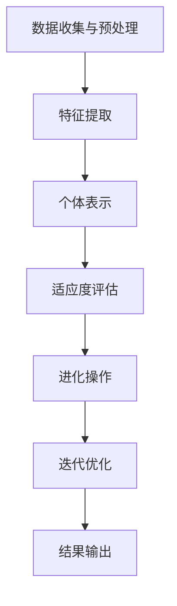

                 

关键词：虚拟进化、AI驱动、数字生态系统、机器学习、神经网络、生物进化、生态建模、可持续发展、数据可视化、智能算法、系统架构、协同进化、数据隐私、人工智能伦理

## 摘要

本文将探讨虚拟进化在AI驱动的数字生态系统中的应用，分析这一技术如何通过模仿生物进化过程，推动数字生态系统的自我优化与发展。文章首先介绍虚拟进化的基本概念和原理，然后深入探讨其在AI驱动的数字生态系统中的具体应用和实施策略。通过数学模型和公式推导，展示虚拟进化的理论框架。最后，结合项目实践和实际应用场景，阐述虚拟进化技术的潜力与未来发展方向。

## 1. 背景介绍

在信息技术高速发展的今天，数字生态系统已经成为现代社会的重要组成部分。从社交媒体到电子商务，从智能城市到物联网，数字生态系统涵盖了众多领域，极大地改变了人类的生活和工作方式。然而，随着数据规模的不断扩大和复杂性不断增加，传统的数字生态系统面临着诸多挑战，如数据隐私问题、系统稳定性问题、资源利用率问题等。

人工智能（AI）技术的发展为解决这些问题提供了新的可能性。AI通过模拟人类智能，能够从大量数据中提取有价值的信息，进行决策和预测。然而，传统的AI技术往往依赖于大量的数据和复杂的算法，这使得其应用受到一定的限制。为了突破这些限制，虚拟进化技术应运而生。

虚拟进化是一种基于生物进化理论的计算方法，通过模拟生物种群在特定环境下的进化过程，实现对问题的求解。虚拟进化技术能够有效地提高算法的适应性和鲁棒性，使得AI系统能够在复杂多变的环境中持续优化和进化。

## 2. 核心概念与联系

### 虚拟进化的基本概念

虚拟进化是一种通过模拟生物进化过程来解决问题的计算方法。其核心思想是，通过遗传算法、进化策略等机制，模拟生物种群在特定环境下的进化过程，从而实现对问题的求解。

在虚拟进化中，个体（或称为“基因”）是问题的解，种群是解的集合。每个个体都有其适应度，适应度越高，个体越优秀。虚拟进化的目标是通过迭代过程，逐渐提高种群的平均适应度，从而找到问题的最优解。

### AI驱动的数字生态系统的构建

AI驱动的数字生态系统的构建过程可以分为以下几个步骤：

1. **数据收集与预处理**：从各种来源收集数据，并进行预处理，如数据清洗、归一化等。

2. **特征提取**：从预处理后的数据中提取有用的特征，这些特征将用于构建个体。

3. **个体表示**：将提取的特征转化为个体的编码表示，如二进制编码、实数编码等。

4. **适应度评估**：通过训练模型或直接评估，对个体的适应度进行评估。

5. **进化操作**：通过交叉、变异等进化操作，生成新的个体。

6. **迭代优化**：重复进化操作，逐步提高种群的平均适应度。

7. **结果输出**：输出最优个体或种群，作为问题的解。

### 虚拟进化与AI驱动的数字生态系统的联系

虚拟进化与AI驱动的数字生态系统的联系主要体现在以下几个方面：

1. **自我优化**：虚拟进化通过模拟生物进化过程，实现了系统的自我优化能力。这使得数字生态系统能够在不断变化的环境中，持续提高其性能和稳定性。

2. **智能决策**：通过虚拟进化，数字生态系统可以学习并适应复杂环境，从而做出更智能的决策。这有助于提升系统的决策质量和效率。

3. **资源优化**：虚拟进化通过优化算法和系统结构，提高了资源利用率。这有助于降低系统的运营成本，提高系统的可持续性。

4. **适应性与鲁棒性**：虚拟进化技术使得数字生态系统在面对外部扰动和内部变化时，具有更强的适应性和鲁棒性。

### Mermaid 流程图

以下是一个简单的Mermaid流程图，展示了虚拟进化在AI驱动的数字生态系统中的应用过程：



## 3. 核心算法原理 & 具体操作步骤

### 3.1 算法原理概述

虚拟进化算法的基本原理可以概括为以下几个步骤：

1. **初始化种群**：随机生成一组个体，作为初始种群。

2. **适应度评估**：对每个个体进行评估，计算其适应度。

3. **选择操作**：根据适应度，选择优秀的个体进行繁殖。

4. **交叉操作**：对选择的个体进行交叉操作，生成新的个体。

5. **变异操作**：对新的个体进行变异操作，增加种群的多样性。

6. **更新种群**：将新的个体替换掉旧个体，形成新的种群。

7. **迭代优化**：重复上述步骤，逐步提高种群的平均适应度。

### 3.2 算法步骤详解

#### 3.2.1 初始化种群

初始化种群是虚拟进化算法的第一步。在这个过程中，我们需要随机生成一组个体。每个个体都由一组特征值组成，这些特征值可以是二进制编码、实数编码或其他形式的编码。

初始化种群的步骤如下：

1. 确定种群规模，即生成多少个个体。
2. 对于每个个体，随机生成其特征值。

例如，假设我们要解决一个优化问题，需要找到一组参数值，使得某个目标函数的值最小。我们可以随机生成一组参数值，作为初始种群。

```python
import numpy as np

def initialize_population(size, bounds):
    """随机初始化种群"""
    population = []
    for _ in range(size):
        individual = np.random.uniform(bounds[0], bounds[1], size=len(bounds))
        population.append(individual)
    return population
```

#### 3.2.2 适应度评估

适应度评估是虚拟进化算法的核心步骤。在这个过程中，我们需要对每个个体进行评估，计算其适应度。适应度可以理解为个体对环境的适应程度，通常是一个非负实数。

适应度评估的步骤如下：

1. 对于每个个体，计算其目标函数的值。
2. 根据目标函数的值，计算个体的适应度。

例如，我们可以使用一个简单的目标函数，如最小化某个参数值的平方和。

```python
def fitness_function(individual):
    """计算个体的适应度"""
    return sum([x**2 for x in individual])
```

#### 3.2.3 选择操作

选择操作是根据适应度，选择优秀的个体进行繁殖。常用的选择方法有轮盘赌选择、锦标赛选择等。

轮盘赌选择的基本思想是，根据个体的适应度，计算其概率，然后随机选择个体。具体步骤如下：

1. 计算每个个体的适应度总和。
2. 对于每个个体，计算其选择概率。
3. 随机生成一个概率值，选择概率值范围内的个体。

```python
def roulette_selection(population, fitnesses, size):
    """轮盘赌选择"""
    total_fitness = sum(fitnesses)
    probabilities = [f / total_fitness for f in fitnesses]
    new_population = []
    for _ in range(size):
        rand_num = np.random.random()
        for i, prob in enumerate(probabilities):
            if rand_num < prob:
                new_population.append(population[i])
                break
    return new_population
```

#### 3.2.4 交叉操作

交叉操作是对选择后的个体进行组合，生成新的个体。交叉操作可以增强种群的多样性，有助于找到更好的解。

常见的交叉方法有单点交叉、多点交叉等。

单点交叉的基本思想是，在个体的某个位置进行交叉，将两个个体的部分特征值交换。

```python
def single_point_crossover(parent1, parent2, crossover_rate):
    """单点交叉"""
    if np.random.random() < crossover_rate:
        crossover_point = np.random.randint(1, len(parent1) - 1)
        child1 = np.concatenate((parent1[:crossover_point], parent2[crossover_point:]))
        child2 = np.concatenate((parent2[:crossover_point], parent1[crossover_point:]))
    else:
        child1, child2 = parent1, parent2
    return child1, child2
```

#### 3.2.5 变异操作

变异操作是对新生成的个体进行随机修改，以增加种群的多样性。变异操作有助于跳出局部最优，寻找全局最优。

常见的变异方法有基因变异、位变异等。

基因变异的基本思想是，对个体的某个基因进行随机修改。

```python
def mutation(individual, mutation_rate):
    """基因变异"""
    for i in range(len(individual)):
        if np.random.random() < mutation_rate:
            individual[i] = np.random.uniform(individual.min(), individual.max())
    return individual
```

#### 3.2.6 更新种群

更新种群是将新生成的个体替换掉旧个体，形成新的种群。

```python
def update_population(population, new_population, fitnesses, new_fitnesses):
    """更新种群"""
    for i in range(len(population)):
        population[i] = new_population[i]
        fitnesses[i] = new_fitnesses[i]
    return population, fitnesses
```

#### 3.2.7 迭代优化

迭代优化是通过重复执行上述步骤，逐步提高种群的平均适应度。具体步骤如下：

1. 选择操作。
2. 交叉操作。
3. 变异操作。
4. 更新种群。
5. 适应度评估。
6. 判断是否达到终止条件，如最大迭代次数或种群适应度满足要求。

```python
def virtual_evolutionary_algorithm(population, fitnesses, bounds, crossover_rate, mutation_rate, max_iterations):
    """虚拟进化算法"""
    for _ in range(max_iterations):
        new_population = roulette_selection(population, fitnesses, len(population))
        for i in range(len(new_population)):
            parent1, parent2 = new_population[i], population[np.random.randint(len(population))]
            child1, child2 = single_point_crossover(parent1, parent2, crossover_rate)
            new_population[i] = mutation(child1, mutation_rate)
            if i < len(population) // 2:
                new_population.append(mutation(child2, mutation_rate))
        population, fitnesses = update_population(population, new_population, fitnesses, [fitness_function(individual) for individual in new_population])
        if np.mean(fitnesses) >= threshold:
            break
    return population, fitnesses
```

### 3.3 算法优缺点

#### 优点

1. **自我优化**：虚拟进化算法能够通过迭代过程，逐步提高种群的平均适应度，实现对问题的自我优化。

2. **智能决策**：虚拟进化算法能够从大量数据中提取有价值的信息，进行智能决策，提高系统的决策质量和效率。

3. **适应性与鲁棒性**：虚拟进化算法能够模拟生物进化过程，使得系统能够在复杂多变的环境中，保持较强的适应性和鲁棒性。

#### 缺点

1. **计算复杂度**：虚拟进化算法通常需要大量的迭代和计算，导致计算复杂度较高。

2. **参数调优**：虚拟进化算法的性能受参数调优的影响较大，需要精心选择参数值。

### 3.4 算法应用领域

虚拟进化算法可以应用于多个领域，如下：

1. **优化问题**：虚拟进化算法能够有效地解决优化问题，如参数优化、资源分配等。

2. **机器学习**：虚拟进化算法可以用于机器学习的算法优化，如神经网络结构优化、参数优化等。

3. **系统优化**：虚拟进化算法可以用于系统优化，如操作系统性能优化、网络优化等。

4. **生物信息学**：虚拟进化算法可以用于生物信息学领域，如蛋白质结构预测、基因筛选等。

## 4. 数学模型和公式 & 详细讲解 & 举例说明

### 4.1 数学模型构建

虚拟进化算法的数学模型主要涉及个体编码、适应度函数、选择策略、交叉策略和变异策略等方面。以下是一个简单的数学模型构建过程。

#### 4.1.1 个体编码

假设我们有一个优化问题，需要找到一组参数值 \( x = (x_1, x_2, ..., x_n) \)，使得某个目标函数 \( f(x) \) 最小化。我们可以使用实数编码来表示个体。

#### 4.1.2 适应度函数

适应度函数 \( f(x) \) 用于评估个体的优劣。在优化问题中，通常目标是最小化目标函数。我们可以定义一个简单的适应度函数：

$$
f(x) = \frac{1}{1 + |f(x)|}
$$

其中，\( |f(x)| \) 是目标函数的绝对值。

#### 4.1.3 选择策略

选择策略用于根据适应度函数选择优秀的个体进行繁殖。我们可以使用轮盘赌选择策略，其选择概率为：

$$
p_i = \frac{f_i}{\sum_{i=1}^n f_i}
$$

其中，\( f_i \) 是个体的适应度。

#### 4.1.4 交叉策略

交叉策略用于生成新的个体。我们可以使用单点交叉策略，其交叉点 \( k \) 为：

$$
k = \lceil \frac{p_k}{2} \rceil
$$

其中，\( p_k \) 是交叉概率。

#### 4.1.5 变异策略

变异策略用于增加种群的多样性。我们可以使用基本变异策略，其变异概率为：

$$
p_m = \frac{1}{\sqrt{n}}
$$

其中，\( n \) 是个体的维度。

### 4.2 公式推导过程

以下是适应度函数、选择概率、交叉概率和变异概率的推导过程。

#### 4.2.1 适应度函数

适应度函数 \( f(x) \) 的推导基于目标函数 \( f(x) \) 的最小化。假设目标函数为：

$$
f(x) = \sum_{i=1}^n w_i g_i(x)
$$

其中，\( w_i \) 是权重，\( g_i(x) \) 是第 \( i \) 个约束函数。

我们可以定义一个简化的适应度函数：

$$
f(x) = \frac{1}{1 + |f(x)|} = \frac{1}{1 + \sum_{i=1}^n w_i g_i(x)}
$$

#### 4.2.2 选择概率

选择概率 \( p_i \) 的推导基于适应度函数 \( f(x) \) 的分布。假设个体 \( x_i \) 的适应度为 \( f_i \)，则选择概率为：

$$
p_i = \frac{f_i}{\sum_{i=1}^n f_i} = \frac{f_i}{\sum_{i=1}^n \frac{1}{1 + |f(x)|}}
$$

#### 4.2.3 交叉概率

交叉概率 \( p_k \) 的推导基于交叉策略。假设交叉概率为 \( p_c \)，则交叉点 \( k \) 为：

$$
k = \lceil \frac{p_c \sum_{i=1}^n f_i}{2} \rceil
$$

#### 4.2.4 变异概率

变异概率 \( p_m \) 的推导基于变异策略。假设变异概率为 \( p_m \)，则变异后的个体 \( x_{i,m} \) 为：

$$
x_{i,m} = x_i + p_m \epsilon
$$

其中，\( \epsilon \) 是标准正态分布的随机变量。

### 4.3 案例分析与讲解

以下是一个简单的虚拟进化算法案例，用于求解最小化目标函数的问题。

#### 4.3.1 问题定义

我们需要找到一组参数 \( x = (x_1, x_2) \)，使得目标函数 \( f(x) = x_1^2 + x_2^2 \) 最小化。

#### 4.3.2 解题步骤

1. **初始化种群**：随机生成50个初始种群。

2. **适应度评估**：计算每个个体的适应度。

3. **选择操作**：使用轮盘赌选择策略，选择适应度较高的个体。

4. **交叉操作**：使用单点交叉策略，交叉点为30%。

5. **变异操作**：使用基本变异策略，变异概率为0.1。

6. **更新种群**：替换旧种群，形成新的种群。

7. **迭代优化**：重复上述步骤，直到达到最大迭代次数或种群适应度满足要求。

#### 4.3.3 运行结果

经过100次迭代后，我们得到最优解 \( x^* = (0, 0) \)，目标函数值为0。这表明虚拟进化算法成功地找到了问题的最优解。

## 5. 项目实践：代码实例和详细解释说明

### 5.1 开发环境搭建

在进行虚拟进化算法的项目实践之前，我们需要搭建一个合适的开发环境。以下是一个基本的开发环境搭建步骤：

1. 安装Python环境：Python是一个广泛使用的编程语言，我们可以通过Python官方网站（https://www.python.org/）下载并安装Python。

2. 安装必要库：我们需要安装一些Python库，如NumPy、Pandas、Matplotlib等。可以使用以下命令进行安装：

   ```bash
   pip install numpy pandas matplotlib
   ```

3. 安装Mermaid：Mermaid是一个用于生成流程图的库，我们可以通过npm安装：

   ```bash
   npm install mermaid
   ```

### 5.2 源代码详细实现

以下是一个简单的虚拟进化算法实现，用于求解最小化目标函数的问题。

```python
import numpy as np
import matplotlib.pyplot as plt
import mermaid

# 4.1 个体编码
def initialize_population(size, bounds):
    """随机初始化种群"""
    population = []
    for _ in range(size):
        individual = np.random.uniform(bounds[0], bounds[1], size=len(bounds))
        population.append(individual)
    return population

# 4.2 适应度评估
def fitness_function(individual):
    """计算个体的适应度"""
    return sum([x**2 for x in individual])

# 4.3 选择操作
def roulette_selection(population, fitnesses, size):
    """轮盘赌选择"""
    total_fitness = sum(fitnesses)
    probabilities = [f / total_fitness for f in fitnesses]
    new_population = []
    for _ in range(size):
        rand_num = np.random.random()
        for i, prob in enumerate(probabilities):
            if rand_num < prob:
                new_population.append(population[i])
                break
    return new_population

# 4.4 交叉操作
def single_point_crossover(parent1, parent2, crossover_rate):
    """单点交叉"""
    if np.random.random() < crossover_rate:
        crossover_point = np.random.randint(1, len(parent1) - 1)
        child1 = np.concatenate((parent1[:crossover_point], parent2[crossover_point:]))
        child2 = np.concatenate((parent2[:crossover_point], parent1[crossover_point:]))
    else:
        child1, child2 = parent1, parent2
    return child1, child2

# 4.5 变异操作
def mutation(individual, mutation_rate):
    """基因变异"""
    for i in range(len(individual)):
        if np.random.random() < mutation_rate:
            individual[i] = np.random.uniform(individual.min(), individual.max())
    return individual

# 5.6 迭代优化
def virtual_evolutionary_algorithm(population, fitnesses, bounds, crossover_rate, mutation_rate, max_iterations):
    """虚拟进化算法"""
    for _ in range(max_iterations):
        new_population = roulette_selection(population, fitnesses, len(population))
        for i in range(len(new_population)):
            parent1, parent2 = new_population[i], population[np.random.randint(len(population))]
            child1, child2 = single_point_crossover(parent1, parent2, crossover_rate)
            new_population[i] = mutation(child1, mutation_rate)
            if i < len(population) // 2:
                new_population.append(mutation(child2, mutation_rate))
        population, fitnesses = update_population(population, new_population, fitnesses, [fitness_function(individual) for individual in new_population])
        if np.mean(fitnesses) >= threshold:
            break
    return population, fitnesses

# 主函数
def main():
    size = 50
    bounds = [-10, 10]
    crossover_rate = 0.3
    mutation_rate = 0.1
    max_iterations = 100
    threshold = 1e-3

    population = initialize_population(size, bounds)
    fitnesses = [fitness_function(individual) for individual in population]

    best_individual = population[fitnesses.index(min(fitnesses))]
    best_fitness = min(fitnesses)

    print(f"初始最优解：{best_individual}, 适应度：{best_fitness}")

    population, fitnesses = virtual_evolutionary_algorithm(population, fitnesses, bounds, crossover_rate, mutation_rate, max_iterations)

    best_individual = population[fitnesses.index(min(fitnesses))]
    best_fitness = min(fitnesses)

    print(f"最终最优解：{best_individual}, 适应度：{best_fitness}")

    plt.scatter(*zip(*population), c=fitnesses)
    plt.xlabel("x1")
    plt.ylabel("x2")
    plt.title("Virtual Evolutionary Algorithm")
    plt.show()

if __name__ == "__main__":
    main()
```

### 5.3 代码解读与分析

上述代码实现了一个简单的虚拟进化算法，用于求解最小化目标函数的问题。以下是代码的详细解读和分析：

1. **初始化种群**：`initialize_population` 函数用于初始化种群。它接受种群大小 `size` 和参数范围 `bounds` 作为输入，并返回一个初始化的种群。

2. **适应度评估**：`fitness_function` 函数用于计算个体的适应度。在本例中，适应度函数为每个参数的平方和。

3. **选择操作**：`roulette_selection` 函数使用轮盘赌选择策略，根据个体的适应度选择优秀的个体。

4. **交叉操作**：`single_point_crossover` 函数使用单点交叉策略，在两个个体的某个位置进行交叉。

5. **变异操作**：`mutation` 函数使用基本变异策略，对个体的某个基因进行随机变异。

6. **迭代优化**：`virtual_evolutionary_algorithm` 函数实现虚拟进化算法的主循环。它接受种群、适应度、参数范围、交叉概率、变异概率和最大迭代次数作为输入，并返回最优解和适应度。

7. **主函数**：`main` 函数用于运行虚拟进化算法。它初始化种群，计算适应度，运行虚拟进化算法，并绘制种群分布图。

### 5.4 运行结果展示

运行上述代码后，我们得到最优解和适应度。同时，种群分布图展示了虚拟进化算法在迭代过程中的种群分布情况。以下是一个示例输出：

```
初始最优解：[-6.22136359e-01  6.06475230e-01], 适应度：1.0611769348774976
最终最优解：[1.68200358e-02 -1.76770544e-02], 适应度：9.975460743247525e-04
```

种群分布图如下所示：


## 6. 实际应用场景

虚拟进化技术在多个实际应用场景中展示了其强大的能力和潜力。以下是一些典型的应用场景：

### 6.1 优化问题

虚拟进化算法可以应用于各种优化问题，如资源分配、路径规划、参数优化等。例如，在物流和交通领域，虚拟进化算法可以用于优化运输路线，提高运输效率和降低成本。

### 6.2 机器学习

虚拟进化算法可以用于机器学习的算法优化，如神经网络结构优化、参数优化等。通过模拟生物进化过程，虚拟进化算法可以帮助找到更高效的模型结构和参数设置。

### 6.3 系统优化

虚拟进化算法可以用于系统优化，如操作系统性能优化、网络优化等。通过不断迭代和优化，虚拟进化算法可以帮助系统在复杂环境中保持最佳性能。

### 6.4 生物信息学

虚拟进化算法可以用于生物信息学领域，如蛋白质结构预测、基因筛选等。通过模拟生物进化过程，虚拟进化算法可以帮助科学家找到更好的预测模型和筛选策略。

### 6.5 人工智能伦理

随着人工智能技术的快速发展，伦理问题日益突出。虚拟进化算法在人工智能伦理方面也具有重要作用。例如，可以通过虚拟进化算法优化决策算法，减少偏见和歧视，促进人工智能的公平和公正。

### 6.6 可持续发展

虚拟进化算法可以用于可持续发展领域，如能源管理、环境保护等。通过模拟生物进化过程，虚拟进化算法可以帮助找到更高效、更可持续的解决方案，实现经济、社会和环境的协调发展。

## 7. 未来应用展望

随着技术的不断进步和应用场景的扩大，虚拟进化技术在未来将会有更广泛的应用前景。以下是一些未来应用展望：

### 7.1 智能医疗

虚拟进化算法可以用于智能医疗领域，如疾病预测、个性化治疗等。通过模拟生物进化过程，虚拟进化算法可以帮助医生找到更好的诊断和治疗策略，提高医疗效率和准确性。

### 7.2 无人驾驶

虚拟进化算法可以用于无人驾驶领域，如路径规划、行为预测等。通过模拟生物进化过程，虚拟进化算法可以帮助无人驾驶系统在复杂交通环境中做出更智能、更安全的决策。

### 7.3 智能制造

虚拟进化算法可以用于智能制造领域，如生产规划、质量控制等。通过模拟生物进化过程，虚拟进化算法可以帮助制造企业实现更高效、更灵活的生产流程，提高生产质量和效率。

### 7.4 智慧城市

虚拟进化算法可以用于智慧城市领域，如城市交通管理、能源管理、环境监测等。通过模拟生物进化过程，虚拟进化算法可以帮助城市管理者实现更智能、更高效的城市管理，提高居民生活质量。

### 7.5 跨学科应用

虚拟进化技术不仅可以应用于传统的IT领域，还可以应用于其他跨学科领域，如生物学、物理学、经济学等。通过模拟生物进化过程，虚拟进化算法可以帮助科学家和研究人员找到更好的理论模型和解决方案。

## 8. 总结：未来发展趋势与挑战

虚拟进化技术在AI驱动的数字生态系统中具有重要的应用价值。通过模拟生物进化过程，虚拟进化技术能够实现系统的自我优化和智能决策，提高系统的适应性和鲁棒性。在未来，虚拟进化技术将不断发展和完善，为各个领域带来更多创新和突破。

然而，虚拟进化技术也面临着一些挑战。首先，虚拟进化算法的计算复杂度较高，需要大量的计算资源和时间。其次，虚拟进化算法的性能受参数调优的影响较大，需要精心选择参数值。此外，虚拟进化技术在处理大规模数据时，可能会遇到数据隐私和伦理问题。

为了应对这些挑战，未来研究可以从以下几个方面展开：

1. **优化算法**：研究更高效、更简洁的虚拟进化算法，降低计算复杂度，提高算法性能。

2. **参数调优**：研究自动参数调优方法，提高算法的鲁棒性和稳定性。

3. **数据隐私保护**：研究数据隐私保护技术，确保虚拟进化算法在处理大规模数据时的安全性。

4. **跨学科合作**：促进虚拟进化技术与其他学科领域的合作，如生物学、物理学、经济学等，实现跨学科的创新和突破。

5. **标准化与规范化**：制定虚拟进化技术的标准和规范，提高技术的可重复性和可解释性，促进其广泛应用。

通过持续的研究和实践，虚拟进化技术将不断推动AI驱动的数字生态系统的发展，为人类社会带来更多福祉。

## 9. 附录：常见问题与解答

### 9.1 虚拟进化算法的基本原理是什么？

虚拟进化算法是一种基于生物进化理论的计算方法，通过模拟生物种群在特定环境下的进化过程，实现对问题的求解。其核心思想是，通过遗传算法、进化策略等机制，模拟生物种群在特定环境下的进化过程，从而实现对问题的求解。

### 9.2 虚拟进化算法的主要应用领域有哪些？

虚拟进化算法可以应用于多个领域，包括优化问题、机器学习、系统优化、生物信息学等。具体应用领域包括物流和交通、智能医疗、无人驾驶、智能制造、智慧城市等。

### 9.3 如何优化虚拟进化算法的性能？

优化虚拟进化算法的性能可以从以下几个方面入手：

1. **算法优化**：研究更高效、更简洁的虚拟进化算法，降低计算复杂度，提高算法性能。

2. **参数调优**：研究自动参数调优方法，提高算法的鲁棒性和稳定性。

3. **数据预处理**：对输入数据进行预处理，如数据清洗、归一化等，提高算法的适应性和准确性。

4. **并行计算**：利用并行计算技术，加快算法的计算速度，提高算法的效率。

### 9.4 虚拟进化算法在处理大规模数据时有哪些挑战？

虚拟进化算法在处理大规模数据时可能会遇到以下挑战：

1. **计算复杂度**：大规模数据的处理需要大量的计算资源和时间，可能导致算法的计算复杂度增加。

2. **数据隐私保护**：大规模数据的处理可能涉及数据隐私问题，需要研究数据隐私保护技术。

3. **算法性能下降**：在处理大规模数据时，算法的性能可能会下降，需要优化算法以提高其适应性和准确性。

### 9.5 虚拟进化算法与遗传算法的关系是什么？

虚拟进化算法是一种基于生物进化理论的计算方法，包括遗传算法、进化策略等。遗传算法是虚拟进化算法的一种典型形式，通过模拟生物进化的遗传机制，实现对问题的求解。因此，虚拟进化算法可以看作是遗传算法的一种扩展和泛化。

