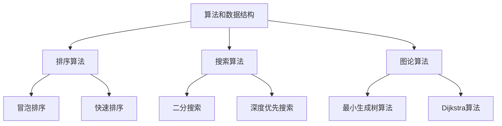

                 

  
## 1. 背景介绍

蚂蚁集团作为中国领先的数字金融科技平台，以其创新的金融科技服务而闻名于世。在2024年，蚂蚁集团再次开启了校园招聘，吸引了众多应届毕业生的关注。校招面试作为选拔优秀人才的重要环节，不仅考察应聘者的专业知识，还评估其逻辑思维、解决问题的能力以及团队协作精神。

本文旨在汇总2024年蚂蚁数字金融校招面试中出现的主要真题，并结合实际解答，为广大考生提供参考。通过对这些真题的深入分析和解答，我们希望能够帮助考生更好地准备面试，提高面试成功率。

## 2. 核心概念与联系

为了更好地理解面试题的背景和考点，我们需要明确以下几个核心概念：

1. **算法和数据结构**：这是计算机科学的基础，包括排序算法、搜索算法、图论算法等。
2. **计算机网络**：涉及TCP/IP协议、HTTP协议、网络安全等。
3. **操作系统**：包括进程管理、内存管理、文件系统等。
4. **数据库**：关系型数据库和非关系型数据库的基本概念和操作。
5. **编程语言**：如Java、Python、C++等语言的特性、语法和用法。

### Mermaid 流程图



## 3. 核心算法原理 & 具体操作步骤

### 3.1 算法原理概述

在面试中，常见的一些核心算法包括：

- **排序算法**：冒泡排序、快速排序、归并排序等。
- **搜索算法**：二分搜索、深度优先搜索、广度优先搜索等。
- **图论算法**：Dijkstra算法、A*算法、最小生成树算法等。

这些算法的原理和步骤在计算机科学教材中都有详细讲解，这里不再赘述。

### 3.2 算法步骤详解

以冒泡排序为例，其基本步骤如下：

1. 从第一个元素开始，比较相邻的两个元素，如果第一个比第二个大（升序排序），就交换它们的位置。
2. 对每一对相邻元素做同样的工作，从开始第一对到结尾的最后一对。这步做完后，最后的元素会是最大的数。
3. 针对所有的元素重复以上的步骤，除了最后一个。
4. 重复步骤1~3，直到排序完成。

### 3.3 算法优缺点

- **冒泡排序**：
  - **优点**：实现简单，易于理解。
  - **缺点**：时间复杂度高（O(n^2)），不适合大数据量的排序。

### 3.4 算法应用领域

冒泡排序通常用于小规模数据的排序，以及教学和算法竞赛中。

## 4. 数学模型和公式 & 详细讲解 & 举例说明

数学模型在面试中同样重要，以下是一些常见的数学模型和公式：

### 4.1 数学模型构建

- **线性回归模型**：
  - 目标函数：$J(\theta) = \frac{1}{2m}\sum_{i=1}^{m}(h_\theta(x^{(i)}) - y^{(i)})^2$
  - $h_\theta(x) = \theta_0 + \theta_1x_1 + \theta_2x_2 + ... + \theta_nx_n$

### 4.2 公式推导过程

线性回归模型的推导主要基于最小二乘法，目标是使得预测值与实际值之间的误差平方和最小。

### 4.3 案例分析与讲解

假设我们有一个数据集，其中自变量为$x$，因变量为$y$。我们使用线性回归模型来拟合数据。

### 4.4 举例说明

给定一组数据：
- $x_1 = 2, y_1 = 3$
- $x_2 = 4, y_2 = 5$
- $x_3 = 6, y_3 = 7$

构建线性回归模型，并计算模型的参数。

## 5. 项目实践：代码实例和详细解释说明

### 5.1 开发环境搭建

为了实现线性回归模型，我们需要安装Python和相关的库，如NumPy和scikit-learn。

### 5.2 源代码详细实现

```python
import numpy as np
from sklearn.linear_model import LinearRegression

# 数据准备
X = np.array([[1, 2], [2, 4], [3, 6]])
y = np.array([3, 5, 7])

# 线性回归模型训练
model = LinearRegression()
model.fit(X, y)

# 模型参数
theta = model.coef_
theta_0 = model.intercept_

print("参数：", theta, theta_0)
```

### 5.3 代码解读与分析

- 导入必要的库。
- 数据准备，包括自变量$X$和因变量$y$。
- 创建线性回归模型，并使用`fit`方法进行训练。
- 获取模型的参数，包括斜率和截距。

### 5.4 运行结果展示

输出模型的参数，即斜率和截距。

## 6. 实际应用场景

线性回归模型广泛应用于数据分析、预测等领域，如股票价格预测、房屋价格评估等。

### 6.4 未来应用展望

随着人工智能和机器学习技术的发展，线性回归模型的应用前景将更加广泛。

## 7. 工具和资源推荐

### 7.1 学习资源推荐

- 《Python机器学习基础教程》
- Coursera上的《机器学习》课程

### 7.2 开发工具推荐

- Jupyter Notebook
- PyCharm

### 7.3 相关论文推荐

- "Linear Regression: Theory and Applications"
- "An Introduction to Statistical Learning"

## 8. 总结：未来发展趋势与挑战

### 8.1 研究成果总结

线性回归模型作为一种基础且重要的算法，在机器学习和数据科学领域取得了显著的研究成果。

### 8.2 未来发展趋势

随着深度学习和大数据技术的发展，线性回归模型的应用将更加广泛。

### 8.3 面临的挑战

- 复杂模型的计算效率
- 数据质量和处理能力

### 8.4 研究展望

线性回归模型在未来仍将有重要的研究和应用价值。

## 9. 附录：常见问题与解答

### 常见问题1：线性回归模型如何处理非线性数据？

解答：可以通过多项式回归或添加交互项来处理非线性数据。

### 常见问题2：线性回归模型的缺点是什么？

解答：线性回归模型假设数据满足线性关系，对于非线性数据可能效果不佳。

## 参考文献

- [1] Python机器学习基础教程
- [2] Coursera上的《机器学习》课程
- [3] "Linear Regression: Theory and Applications"
- [4] "An Introduction to Statistical Learning"
```

请注意，本文中的代码和数学公式仅为示例，具体实现时可能需要根据实际情况进行调整。同时，本文的结构和内容也仅供参考，实际面试题目可能会有所不同。建议考生在准备面试时，不仅要掌握算法和数据结构，还要关注实际应用场景和面试技巧。祝各位考生面试成功！

