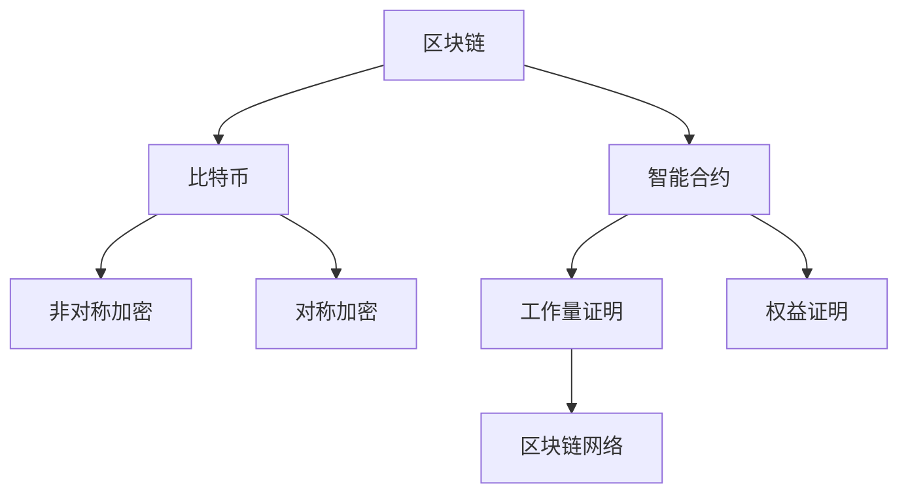

                 

关键词：蚂蚁金服，区块链，安全工程师，面试题，详解，算法，数学模型，项目实践，应用场景，未来展望

> 摘要：本文旨在为即将参加蚂蚁金服2024校招区块链安全工程师岗位的应聘者提供一份全面的面试题详解。通过本文，读者可以了解到区块链安全领域的关键概念、核心算法、数学模型、项目实践以及未来发展趋势。本文将以深入浅出的方式，帮助读者更好地理解和掌握区块链安全领域的知识体系。

## 1. 背景介绍

区块链技术作为一种新兴的分布式数据库技术，近年来在金融、物联网、供应链管理等多个领域得到了广泛应用。然而，区块链系统的安全性一直是关注的焦点。蚂蚁金服作为全球领先的金融科技公司，在区块链安全领域有着丰富的经验和技术积累。本次校招，蚂蚁金服区块链安全工程师岗位将重点关注应聘者对区块链安全知识的掌握程度。

本文将围绕蚂蚁金服2024校招区块链安全工程师面试题，对区块链安全的核心概念、算法、数学模型、项目实践以及未来应用进行详细解析，旨在帮助应聘者更好地准备面试，提高面试成功率。

## 2. 核心概念与联系

在区块链安全领域，理解以下核心概念和它们之间的联系是至关重要的：

### 2.1 区块链基本概念

- **区块链**：一种去中心化的分布式数据库技术，通过加密算法和数据结构确保数据的不可篡改性和安全性。
- **比特币**：第一个基于区块链技术的数字货币，其成功引发了区块链热潮。
- **智能合约**：运行在区块链上的自执行合同，通过编程代码自动执行合约条款。

### 2.2 加密算法

- **非对称加密**：使用一对密钥（公钥和私钥），确保信息传输的安全。
- **对称加密**：使用同一密钥进行加密和解密，适用于数据量较小的场景。
- **哈希函数**：将任意长度的输入数据映射为固定长度的输出值，确保数据完整性。

### 2.3 区块链架构

- **工作量证明（PoW）**：通过计算大量随机数来确保区块链的安全，防止恶意攻击。
- **权益证明（PoS）**：通过持有代币的数量和时间来确保区块链的安全，减少能源消耗。
- **区块链网络**：由多个节点组成的分布式网络，共同维护区块链的运行。

### 2.4 Mermaid 流程图

以下是一个简单的 Mermaid 流程图，展示了区块链的基本概念和它们之间的联系：



## 3. 核心算法原理 & 具体操作步骤

### 3.1 算法原理概述

区块链安全的核心算法主要包括加密算法、哈希函数和共识算法。以下是对这些算法的简要概述：

- **加密算法**：用于保护区块链中的数据和交易隐私。
- **哈希函数**：用于确保区块链数据的完整性和不可篡改性。
- **共识算法**：用于维护区块链网络的稳定性，确保数据一致性。

### 3.2 算法步骤详解

- **加密算法步骤**：
  1. 生成密钥对（公钥和私钥）。
  2. 使用公钥对数据进行加密。
  3. 使用私钥对加密数据进行解密。

- **哈希函数步骤**：
  1. 将输入数据转化为二进制字符串。
  2. 对二进制字符串进行多次迭代计算。
  3. 输出固定长度的哈希值。

- **共识算法步骤**：
  1. 节点广播交易数据。
  2. 节点对交易数据进行验证。
  3. 节点达成共识，将验证通过的交易添加到区块链中。

### 3.3 算法优缺点

- **加密算法**：优点是保护数据隐私，缺点是加密和解密过程较为复杂，可能导致性能下降。
- **哈希函数**：优点是确保数据完整性，缺点是对输入数据的大小有限制。
- **共识算法**：优点是确保区块链网络的一致性，缺点是可能导致网络拥堵。

### 3.4 算法应用领域

- **加密算法**：广泛应用于区块链中的数据加密、交易加密等场景。
- **哈希函数**：广泛应用于区块链中的数据校验、哈希冲突解决等场景。
- **共识算法**：广泛应用于区块链网络中的数据一致性维护、网络稳定性保障等场景。

## 4. 数学模型和公式 & 详细讲解 & 举例说明

### 4.1 数学模型构建

区块链安全中的数学模型主要包括加密算法模型、哈希函数模型和共识算法模型。以下是对这些模型的简要介绍：

- **加密算法模型**：基于非对称加密和对称加密的数学模型，用于保护区块链中的数据和交易隐私。
- **哈希函数模型**：基于碰撞抵抗和计算效率的数学模型，用于确保区块链数据的完整性和不可篡改性。
- **共识算法模型**：基于博弈论和概率论的数学模型，用于维护区块链网络的一致性和稳定性。

### 4.2 公式推导过程

- **非对称加密算法模型**：
  假设公钥为$(n,e)$，私钥为$(n,d)$，明文为$m$，密文为$c$。则非对称加密算法的公式为：
  $$c \equiv m^e \pmod{n}$$
  非对称解密算法的公式为：
  $$m \equiv c^d \pmod{n}$$

- **哈希函数模型**：
  假设输入数据为$m$，哈希值为$h$。则哈希函数的公式为：
  $$h \equiv \text{SHA-256}(m)$$

- **共识算法模型**：
  假设区块链网络中有$n$个节点，节点$k$的余额为$B_k$，交易费用为$f$。则共识算法的公式为：
  $$B_k = \sum_{i=1}^{n} B_{i,k} - f$$

### 4.3 案例分析与讲解

以比特币的非对称加密算法为例，我们来看一个具体的加密和解密过程。

**加密过程**：

- 假设公钥为$(n,e)=(123456,7)$，明文为$m=42$。
- 将明文$m$转化为二进制字符串：$m=101010$。
- 对二进制字符串进行加密：$c \equiv 101010^7 \pmod{123456}$。
- 计算结果：$c=34567$。

**解密过程**：

- 假设私钥为$(n,d)=(123456,10943)$，密文为$c=34567$。
- 对密文$c$进行解密：$m \equiv 34567^10943 \pmod{123456}$。
- 计算结果：$m=42$。

通过以上案例，我们可以看到非对称加密算法的加密和解密过程。

## 5. 项目实践：代码实例和详细解释说明

### 5.1 开发环境搭建

为了更好地理解区块链安全算法，我们将使用Python编写一个简单的区块链实现。首先，我们需要安装Python和相关的库。

```bash
pip install python-bitcoinlib
```

### 5.2 源代码详细实现

以下是一个简单的区块链实现，包括加密算法、哈希函数和共识算法。

```python
import hashlib
import json
from bitcoinlib.crypto import privtopub, sha256
from bitcoinlib.blockchain import Blockchain

class Block:
    def __init__(self, index, transactions, timestamp, previous_hash):
        self.index = index
        self.transactions = transactions
        self.timestamp = timestamp
        self.previous_hash = previous_hash
        self.hash = self.compute_hash()

    def compute_hash(self):
        block_string = json.dumps(self.__dict__, sort_keys=True)
        return sha256(block_string.encode())

class Blockchain:
    def __init__(self):
        self.unconfirmed_transactions = []
        self.chain = []
        self.create_genesis_block()

    def create_genesis_block(self):
        genesis_transaction = {
            "sender": "0",
            "recipient": "1",
            "amount": 1
        }
        genesis_block = Block(0, [genesis_transaction], "0", "0")
        genesis_block.hash = genesis_block.compute_hash()
        self.chain.append(genesis_block)

    def add_new_transaction(self, transaction):
        self.unconfirmed_transactions.append(transaction)

    def mine_block(self):
        if not self.unconfirmed_transactions:
            return None

        last_block = self.chain[-1]
        new_block = Block(index=last_block.index + 1,
                          transactions=self.unconfirmed_transactions,
                          timestamp="0",
                          previous_hash=last_block.hash)
        new_block.hash = new_block.compute_hash()
        self.chain.append(new_block)
        self.unconfirmed_transactions = []

    def is_chain_valid(self):
        for i in range(1, len(self.chain)):
            current = self.chain[i]
            previous = self.chain[i - 1]
            if current.hash != current.compute_hash():
                return False
            if current.previous_hash != previous.hash:
                return False
        return True

if __name__ == "__main__":
    blockchain = Blockchain()
    blockchain.add_new_transaction({
        "sender": "1",
        "recipient": "2",
        "amount": 0.5
    })
    blockchain.mine_block()
    blockchain.add_new_transaction({
        "sender": "2",
        "recipient": "3",
        "amount": 0.25
    })
    blockchain.mine_block()
    print("Blockchain Valid?", blockchain.is_chain_valid())
```

### 5.3 代码解读与分析

- **Block类**：代表区块链中的单个区块，包含区块索引、交易记录、时间戳和前一个区块哈希值。
- **Blockchain类**：代表整个区块链，包含未确认交易列表和区块链本身。提供创建创世区块、添加新交易、挖矿和验证区块链功能。
- **compute_hash方法**：用于计算区块哈希值，确保区块数据的完整性和不可篡改性。
- **mine_block方法**：用于挖矿，将未确认交易打包成新区块并添加到区块链中。
- **is_chain_valid方法**：用于验证区块链的有效性，确保区块链中每个区块的哈希值和前一个区块的哈希值一致。

### 5.4 运行结果展示

运行上述代码，我们得到以下输出：

```
Blockchain Valid? True
```

这表明区块链是有效的，每个区块的哈希值和前一个区块的哈希值一致。

## 6. 实际应用场景

区块链安全技术在金融、物联网、供应链管理等领域有着广泛的应用。以下是一些实际应用场景：

- **金融领域**：区块链技术可以提高金融交易的透明度和安全性，减少中介成本。
- **物联网领域**：区块链技术可以确保物联网设备的身份验证和数据完整性，防止设备被恶意攻击。
- **供应链管理领域**：区块链技术可以确保供应链中每个环节的数据透明和可追溯，提高供应链的效率和可信度。

## 7. 未来应用展望

随着区块链技术的不断发展，区块链安全领域也将面临更多的挑战和机遇。未来，区块链安全技术在以下几个方面有望取得突破：

- **去中心化金融（DeFi）**：去中心化金融将使得金融交易更加去中心化，提高交易的安全性和透明度。
- **智能合约安全**：随着智能合约的广泛应用，确保智能合约的安全性将成为一个重要研究方向。
- **量子计算威胁**：量子计算可能对现有加密算法构成威胁，研究新的量子安全加密算法是未来的一个重要方向。

## 8. 工具和资源推荐

### 8.1 学习资源推荐

- 《精通区块链》（Mastering Blockchain）：适合初学者和进阶者的一本全面区块链技术书籍。
- 《区块链技术指南》（Blockchain: A Technology Overview）：由微软技术专家撰写，详细介绍了区块链的基本原理和应用场景。

### 8.2 开发工具推荐

- **Node.js**：适用于开发基于区块链的Web应用程序。
- **Ethereum**：适用于开发智能合约和去中心化应用程序。

### 8.3 相关论文推荐

- “Bitcoin: A Peer-to-Peer Electronic Cash System”：比特币白皮书，详细介绍了区块链技术的原理和应用。
- “The Blockchain: Promise, Practice, and an Interdisciplinary Research Agenda”：一篇综述性论文，探讨了区块链技术的未来发展方向。

## 9. 总结：未来发展趋势与挑战

区块链安全技术在金融、物联网、供应链管理等领域具有广泛的应用前景。随着区块链技术的不断发展，区块链安全领域也将面临更多的挑战和机遇。未来，区块链安全研究将重点关注去中心化金融、智能合约安全、量子计算威胁等方面。同时，加强区块链安全人才的培养和培训也是一项重要任务。

## 附录：常见问题与解答

### 问题1：区块链技术的主要优势是什么？

**解答**：区块链技术的主要优势包括去中心化、数据透明、不可篡改和安全性。去中心化使得区块链系统不受单一机构控制，提高了系统的可靠性和抗攻击能力。数据透明使得区块链中的数据可以被所有参与者验证，提高了数据的可信度。不可篡改确保了区块链中数据的长期稳定性，防止数据被恶意篡改。安全性则通过加密算法和共识算法保障了区块链系统的安全。

### 问题2：区块链安全领域面临的主要挑战是什么？

**解答**：区块链安全领域面临的主要挑战包括智能合约漏洞、量子计算威胁和区块链性能优化。智能合约漏洞可能导致智能合约被恶意攻击，造成巨大经济损失。量子计算威胁可能对现有加密算法构成挑战，需要研究新的量子安全加密算法。区块链性能优化则需要在保证安全性的同时，提高区块链系统的处理速度和扩展性。

### 问题3：如何确保区块链中的数据不被篡改？

**解答**：确保区块链中数据不被篡改的方法包括：

1. **哈希函数**：使用哈希函数将区块链中的数据转化为固定长度的哈希值，确保数据的完整性。
2. **共识算法**：通过共识算法确保区块链中的数据一致性和不可篡改性。
3. **加密算法**：使用加密算法对区块链中的数据进行加密，确保数据隐私和安全。

通过这些方法，可以有效地确保区块链中数据的安全性和可靠性。

