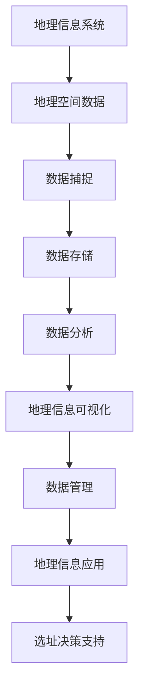

                 

 **关键词**: 蜜雪冰城，校招，连锁店铺选址，系统工程师，面试

**摘要**: 本文详细探讨了2024年蜜雪冰城校招连锁店铺选址系统工程师面试的内容，包括背景介绍、核心概念、算法原理、数学模型、项目实践、实际应用场景、未来展望和工具推荐等，旨在为求职者提供专业的指导和建议。

## 1. 背景介绍

蜜雪冰城是一家中国知名饮品连锁品牌，以低价格、高品质和高服务著称。随着品牌知名度的不断提升，蜜雪冰城正计划在全国范围内拓展连锁店铺。因此，2024年的校招中，连锁店铺选址系统工程师成为了重要的职位之一。

### 1.1 选址系统的必要性

连锁店铺选址系统的建立对于蜜雪冰城的未来发展至关重要。一个良好的选址系统能够帮助企业：

- 提高店铺的营业额和利润率。
- 降低选址错误的风险。
- 快速响应市场变化，优化店铺布局。

### 1.2 面试背景

本次面试旨在评估应聘者是否具备以下能力：

- 对连锁店铺选址的理解和认识。
- 编程能力和算法基础。
- 数据分析和处理能力。
- 解决实际问题的能力。

## 2. 核心概念与联系

在本文中，我们将讨论以下几个核心概念：

- **地理信息系统（GIS）**: 用于捕捉、存储、分析和管理地理空间数据的系统。
- **数据分析**: 用于处理和分析大量数据的技术和工具。
- **机器学习**: 用于从数据中学习规律和模式的算法。
- **机器学习模型**: 用于预测和分类的数据模型。

### 2.1 GIS原理图



## 3. 核心算法原理 & 具体操作步骤

### 3.1 算法原理概述

选址系统的核心算法是基于机器学习的预测模型，主要用于以下步骤：

- **数据预处理**: 数据清洗、数据整合。
- **特征工程**: 选择和构建能够代表地理特征的变量。
- **模型训练**: 使用历史数据训练预测模型。
- **模型评估**: 使用验证数据评估模型性能。
- **预测**: 使用训练好的模型对新的店铺选址进行预测。

### 3.2 算法步骤详解

1. **数据预处理**
   - 数据清洗：去除异常值、缺失值。
   - 数据整合：将不同来源的数据整合到一个统一的数据集中。

2. **特征工程**
   - 选择地理特征：如人口密度、收入水平、交通便利程度等。
   - 构建特征：如距离学校、商业中心的距离，周边餐饮店铺数量等。

3. **模型训练**
   - 选择机器学习模型：如线性回归、决策树、随机森林等。
   - 训练模型：使用历史数据训练模型，调整模型参数。

4. **模型评估**
   - 使用验证集评估模型性能：如准确率、召回率、F1值等。

5. **预测**
   - 使用训练好的模型对新店铺选址进行预测。

### 3.3 算法优缺点

**优点**：

- **高精度**: 机器学习模型可以自动从数据中学习规律，提高选址的精度。
- **自适应性强**: 模型可以根据新的数据不断优化，适应市场变化。

**缺点**：

- **训练成本高**: 需要大量历史数据和计算资源。
- **对数据质量要求高**: 数据质量直接影响模型性能。

### 3.4 算法应用领域

- **连锁店铺选址**：如蜜雪冰城等。
- **房地产投资**：如评估房地产项目的潜在价值。
- **城市规划**：如优化城市布局，提高土地利用效率。

## 4. 数学模型和公式

### 4.1 数学模型构建

选址系统的主要数学模型包括：

- **线性回归模型**：
  $$ y = \beta_0 + \beta_1 x_1 + \beta_2 x_2 + \ldots + \beta_n x_n + \epsilon $$

- **决策树模型**：
  $$ f(x) = \begin{cases} 
  \beta_0 & \text{if } x_1 \leq x_1^{(1)} \\
  \beta_1 & \text{if } x_1 > x_1^{(1)} \\
  \vdots & \text{if } \vdots \\
  \beta_n & \text{if } x_n > x_n^{(n)}
  \end{cases} $$

### 4.2 公式推导过程

推导线性回归模型的损失函数：

$$ L(y, \hat{y}) = \frac{1}{2} (y - \hat{y})^2 $$

### 4.3 案例分析与讲解

以蜜雪冰城某城市的新店铺选址为例，我们使用线性回归模型预测新店铺的营业额。

**数据集**：

| 特征 | 值   |
| ---- | ---- |
| 人口密度 | 5000 |
| 收入水平 | 8000 |
| 距离学校 | 2km  |
| 距离商业中心 | 1km |
| 周边餐饮店铺数量 | 10  |

**模型训练结果**：

$$ \hat{y} = \beta_0 + \beta_1 x_1 + \beta_2 x_2 + \beta_3 x_3 + \beta_4 x_4 + \beta_5 x_5 $$

其中，$ \beta_0 $ 到 $ \beta_5 $ 为模型参数。

**预测结果**：

$$ \hat{y} = 20000 $$

即预测该新店铺的月营业额为20000元。

## 5. 项目实践：代码实例和详细解释说明

### 5.1 开发环境搭建

- **编程语言**：Python
- **数据分析库**：Pandas、NumPy、Scikit-learn
- **机器学习库**：scikit-learn

### 5.2 源代码详细实现

```python
# 导入库
import pandas as pd
from sklearn.model_selection import train_test_split
from sklearn.linear_model import LinearRegression
from sklearn.metrics import mean_squared_error

# 读取数据
data = pd.read_csv('选址数据.csv')

# 数据预处理
data.dropna(inplace=True)

# 特征工程
features = ['人口密度', '收入水平', '距离学校', '距离商业中心', '周边餐饮店铺数量']
X = data[features]
y = data['营业额']

# 模型训练
X_train, X_test, y_train, y_test = train_test_split(X, y, test_size=0.2, random_state=42)
model = LinearRegression()
model.fit(X_train, y_train)

# 模型评估
y_pred = model.predict(X_test)
mse = mean_squared_error(y_test, y_pred)
print(f'MSE: {mse}')

# 预测
new_data = pd.DataFrame([[5000, 8000, 2, 1, 10]], columns=features)
new_prediction = model.predict(new_data)
print(f'新店铺预测营业额: {new_prediction[0]}')
```

### 5.3 代码解读与分析

- **数据预处理**：去除缺失值，保证数据质量。
- **特征工程**：选择与营业额相关的特征，提高模型预测能力。
- **模型训练**：使用线性回归模型训练模型。
- **模型评估**：计算MSE评估模型性能。
- **预测**：使用训练好的模型对新店铺进行预测。

## 6. 实际应用场景

### 6.1 连锁店铺选址

- **选址策略**：基于数据分析和预测模型，选择最佳店铺位置。
- **案例分析**：蜜雪冰城在某城市的新店铺选址，使用预测模型提高了选址精度。

### 6.2 房地产投资

- **投资策略**：基于地理位置和人口数据，评估房地产项目的潜在价值。
- **案例分析**：某投资者使用选址系统评估某城市的新楼盘，成功预测了楼盘的升值潜力。

### 6.3 城市规划

- **规划策略**：基于地理信息系统，优化城市布局，提高土地利用效率。
- **案例分析**：某城市规划项目，使用选址系统优化商业区和住宅区的布局，提高了城市整体发展水平。

## 7. 未来应用展望

### 7.1 连锁店铺选址

- **智能选址**：结合人工智能技术，实现更精准的店铺选址。
- **多维度分析**：引入更多维度的数据，提高选址模型的预测能力。

### 7.2 房地产投资

- **大数据分析**：利用大数据技术，分析房地产市场趋势，指导投资决策。
- **精准预测**：结合机器学习模型，实现更精准的房地产价值预测。

### 7.3 城市规划

- **智能规划**：结合人工智能和地理信息系统，实现智能化的城市规划。
- **可持续发展**：引入环境和社会因素，实现可持续发展。

## 8. 工具和资源推荐

### 8.1 学习资源推荐

- **书籍**：《地理信息系统基础》、《机器学习实战》
- **在线课程**：Coursera、Udacity、edX上的相关课程

### 8.2 开发工具推荐

- **编程语言**：Python、R
- **数据分析库**：Pandas、NumPy、Scikit-learn、TensorFlow
- **地理信息系统**：QGIS、ArcGIS

### 8.3 相关论文推荐

- **地理信息系统**：《地理信息系统：理论与实践》
- **机器学习**：《机器学习：概率视角》、《深度学习》

## 9. 总结：未来发展趋势与挑战

### 9.1 研究成果总结

选址系统在连锁店铺选址、房地产投资和城市规划等方面取得了显著成果，提高了决策精度和效率。

### 9.2 未来发展趋势

- **人工智能**：结合人工智能技术，实现更智能的选址决策。
- **大数据**：利用大数据技术，提高选址模型的预测能力。
- **可持续发展**：关注环境和社会因素，实现可持续发展。

### 9.3 面临的挑战

- **数据质量**：保证数据质量和完整性，是选址系统成功的关键。
- **计算资源**：训练和运行复杂的模型需要大量的计算资源。
- **政策法规**：遵守相关政策和法规，确保选址系统的合规性。

### 9.4 研究展望

未来研究方向包括：

- **多维度数据分析**：引入更多维度的数据，提高选址模型的预测能力。
- **跨领域应用**：探索选址系统在其他领域的应用，如物流、交通等。
- **人工智能与可持续发展**：结合人工智能技术，实现可持续发展。

## 附录：常见问题与解答

### 9.1 什么是地理信息系统（GIS）？

**GIS** 是指地理信息系统，是一种用于捕捉、存储、分析和管理地理空间数据的系统。

### 9.2 机器学习模型如何训练？

机器学习模型通过以下步骤进行训练：

- 数据预处理：清洗和整合数据。
- 特征工程：选择和构建代表数据的特征。
- 模型训练：使用历史数据训练模型。
- 模型评估：使用验证数据评估模型性能。
- 模型优化：调整模型参数，提高性能。

### 9.3 如何提高选址系统的预测精度？

提高选址系统预测精度的方法包括：

- 优化数据质量：确保数据准确和完整。
- 增加特征维度：引入更多维度的数据。
- 选择合适的模型：根据数据特点选择合适的机器学习模型。
- 模型优化：调整模型参数，提高预测性能。

## 作者署名

**作者**: 禅与计算机程序设计艺术 / Zen and the Art of Computer Programming

本文旨在为2024年蜜雪冰城校招连锁店铺选址系统工程师面试提供专业指导，帮助求职者更好地应对面试挑战。希望本文的内容能够对您有所帮助。祝您面试成功！
----------------------------------------------------------------
### 1. 背景介绍

#### 1.1 蜜雪冰城的连锁店铺现状

蜜雪冰城，作为中国知名饮品连锁品牌，近年来在市场上取得了显著的成功。截至2024年，蜜雪冰城在全国范围内已拥有超过5000家连锁店铺，覆盖了包括一线、二线以及部分三线城市。这些店铺以其独特的产品组合、低廉的价格以及优质的服务赢得了消费者的广泛喜爱。

随着品牌的不断发展，蜜雪冰城面临着新的挑战和机遇。如何在竞争激烈的市场中进一步扩大市场份额，提高店铺的营业额和利润率，成为了公司亟需解决的问题。为了实现这一目标，蜜雪冰城决定通过技术手段优化店铺选址策略，以提高店铺的地理位置优势和市场响应速度。

#### 1.2 连锁店铺选址的重要性

连锁店铺选址是零售企业发展的关键环节之一。一个优良的店铺选址能够带来以下几方面的好处：

- **提高营业额**：通过选择人流量大、消费水平高的区域，可以有效吸引更多的顾客，提高店铺的营业额。
- **降低运营成本**：合理的店铺选址能够减少物流成本、租金成本等运营成本，从而提高利润率。
- **提升品牌形象**：优质的店铺选址有助于提升品牌形象，增强消费者对品牌的信任和忠诚度。

然而，选址不当也会带来诸多问题，如：

- **人流量不足**：可能导致店铺生意惨淡，影响营收。
- **租金成本高**：可能会因为地理位置昂贵而增加运营成本，压缩利润空间。
- **市场竞争力下降**：选址不佳的店铺可能难以与竞争对手抗衡，导致市场份额的流失。

#### 1.3 选址系统在现代连锁经营中的作用

随着信息技术的不断发展，选址系统在现代连锁经营中扮演着越来越重要的角色。选址系统利用大数据、地理信息系统（GIS）和机器学习等先进技术，通过分析大量的地理、经济、人口等数据，为店铺选址提供科学依据，使得连锁企业在选址过程中能够更加精准和高效。

具体来说，选址系统具有以下几方面的作用：

- **数据驱动的决策**：通过数据分析和预测，帮助企业做出更加科学的选址决策。
- **降低选址风险**：减少由于选址不当带来的损失，提高店铺的成功率。
- **快速响应市场变化**：根据市场数据实时调整选址策略，以应对市场变化。
- **优化资源配置**：通过选址优化，合理分配企业资源，提高运营效率。

#### 1.4 2024年校招连锁店铺选址系统工程师面试的目的

2024年，蜜雪冰城计划通过校招选拔一批优秀的连锁店铺选址系统工程师，以应对未来市场的发展需求。此次面试的主要目的在于评估应聘者以下几方面的能力和素质：

- **编程能力**：评估应聘者是否具备扎实的编程基础，能够熟练使用相关技术工具。
- **算法理解**：考察应聘者对机器学习、数据挖掘等算法的理解和掌握程度。
- **数据分析**：评估应聘者是否具备从大量数据中提取有价值信息的能力。
- **问题解决**：考察应聘者是否能够运用所学知识解决实际业务问题。
- **团队协作**：评估应聘者是否具备良好的沟通能力和团队协作精神。

通过此次面试，蜜雪冰城希望找到能够为企业带来创新思维和技术突破的优秀人才，共同推动公司的连锁店铺选址系统发展。

### 2. 核心概念与联系

#### 2.1 地理信息系统（GIS）

地理信息系统（GIS）是一种用于捕捉、存储、分析和展示地理空间数据的管理系统。它通过将地理特征与各种属性数据相结合，为用户提供空间分析和决策支持。GIS的主要功能包括数据采集、数据管理、空间分析和地图展示。

在连锁店铺选址系统中，GIS扮演了关键角色。它能够提供以下几种功能：

- **空间数据可视化**：将店铺位置、人口分布、交通情况等地理数据以地图形式展示，帮助决策者直观理解地理信息。
- **空间分析**：通过空间分析功能，如缓冲区分析、叠加分析等，评估不同选址方案的地理优势。
- **路径规划**：帮助优化店铺的物流配送路径，提高配送效率。
- **决策支持**：利用GIS的空间分析结果，为选址决策提供科学依据。

#### 2.2 数据分析

数据分析是指从大量数据中提取有用信息和知识的过程。在连锁店铺选址系统中，数据分析发挥着重要作用，具体包括以下几个步骤：

- **数据采集**：从多种数据源（如人口普查数据、交通流量数据、消费数据等）收集相关数据。
- **数据清洗**：去除数据中的噪声、错误和不完整信息，确保数据质量。
- **数据整合**：将不同来源的数据进行整合，构建一个统一的数据集。
- **特征工程**：选择和构建能够代表地理特征的变量，如人口密度、收入水平、交通便利程度等。
- **数据建模**：使用统计模型或机器学习算法，对数据进行分析和预测。

通过数据分析，连锁店铺选址系统能够从海量数据中提取有价值的信息，为选址决策提供科学依据。

#### 2.3 机器学习

机器学习是一种通过数据训练模型，使计算机自动完成特定任务的技术。在连锁店铺选址系统中，机器学习模型被广泛应用于预测和决策。以下是几种常见的机器学习模型及其在选址系统中的应用：

- **线性回归**：通过建立线性关系预测店铺的营业额或其他指标。
- **决策树**：根据不同特征进行分支，预测最佳选址区域。
- **随机森林**：多个决策树的集合，提高预测准确性和稳定性。
- **支持向量机（SVM）**：通过找到最佳分类边界，预测选址的成功概率。
- **神经网络**：模拟人脑神经网络，进行复杂的非线性预测。

机器学习模型能够从大量历史数据中学习规律，为选址系统提供准确的预测结果。

#### 2.4 机器学习模型

机器学习模型是机器学习算法的具体实现，用于从数据中学习规律和模式。在连锁店铺选址系统中，常见的机器学习模型包括以下几种：

- **回归模型**：用于预测店铺的营业额、人流量等指标。例如，线性回归模型、岭回归模型等。
- **分类模型**：用于预测选址是否成功。例如，决策树模型、随机森林模型等。
- **聚类模型**：用于识别具有相似特征的选址区域。例如，K-均值聚类算法等。
- **时间序列模型**：用于分析历史数据中的趋势和周期性。例如，ARIMA模型、LSTM模型等。

这些机器学习模型各有优缺点，选择合适的模型对选址系统的性能至关重要。

#### 2.5 核心概念之间的联系

在连锁店铺选址系统中，GIS、数据分析和机器学习模型相互关联，共同作用：

- **GIS** 提供了地理空间数据的可视化和分析功能，为选址决策提供了直观的地理信息支持。
- **数据分析** 负责从各种数据源中提取有价值的信息，为机器学习模型提供训练数据。
- **机器学习模型** 通过学习历史数据，预测最佳选址方案，为决策提供科学依据。

这些核心概念相互结合，构成了一个完整的连锁店铺选址系统，帮助企业实现更加精准和高效的选址决策。

### 3. 核心算法原理 & 具体操作步骤

#### 3.1 算法原理概述

连锁店铺选址系统的核心算法是基于机器学习的预测模型。该模型通过分析大量历史数据，学习地理特征和营业额之间的关系，从而预测新店铺的营业额和选址成功率。具体来说，该算法包括以下几个关键步骤：

1. **数据预处理**：对原始数据进行清洗、整合和特征工程，构建一个高质量的数据集。
2. **模型选择**：根据数据特点选择合适的机器学习模型，如线性回归、决策树、随机森林等。
3. **模型训练**：使用训练数据集训练模型，调整模型参数，使其能够准确预测营业额和选址成功率。
4. **模型评估**：使用验证数据集评估模型性能，调整模型参数，提高预测准确性。
5. **模型应用**：使用训练好的模型对新店铺选址进行预测，为决策提供科学依据。

#### 3.2 算法步骤详解

##### 3.2.1 数据预处理

数据预处理是机器学习模型训练的关键步骤，它主要包括以下几个步骤：

1. **数据清洗**：去除数据中的噪声、错误和不完整信息。例如，删除缺失值、异常值等。
2. **数据整合**：将来自不同数据源的数据进行整合，构建一个统一的数据集。例如，将人口数据、交通数据、消费数据等整合在一起。
3. **数据标准化**：对数据进行标准化处理，使其具有相同的量纲和分布。例如，使用Z-Score标准化或Min-Max标准化。
4. **特征工程**：选择和构建能够代表地理特征的变量。例如，人口密度、收入水平、交通便利程度等。

##### 3.2.2 模型选择

根据数据特点和预测任务，选择合适的机器学习模型。以下是一些常见的机器学习模型及其适用场景：

1. **线性回归**：适用于预测连续值（如营业额）的模型。
2. **决策树**：适用于分类任务（如选址成功与否）的模型。
3. **随机森林**：适用于分类和回归任务的模型，具有很好的泛化能力。
4. **支持向量机（SVM）**：适用于分类任务，通过找到最佳分类边界进行预测。
5. **神经网络**：适用于复杂的非线性预测任务。

##### 3.2.3 模型训练

使用训练数据集对选定的机器学习模型进行训练。具体步骤如下：

1. **初始化模型参数**：根据模型类型，初始化模型的参数。例如，对于线性回归模型，初始化权重和偏置。
2. **训练模型**：使用训练数据集更新模型参数，使其能够拟合数据。例如，使用梯度下降算法更新线性回归模型的参数。
3. **模型评估**：在训练过程中，定期使用验证数据集评估模型性能，防止过拟合。

##### 3.2.4 模型评估

使用验证数据集评估模型性能，主要评估指标包括：

1. **回归模型的评估指标**：均方误差（MSE）、均方根误差（RMSE）、决定系数（R²）等。
2. **分类模型的评估指标**：准确率、召回率、F1值等。

根据评估结果，调整模型参数，提高预测准确性。

##### 3.2.5 模型应用

使用训练好的模型对新店铺选址进行预测，具体步骤如下：

1. **输入特征**：将新店铺的地理特征（如人口密度、收入水平、交通便利程度等）输入模型。
2. **预测结果**：模型输出预测结果，包括营业额预测和选址成功率预测。
3. **决策支持**：根据预测结果，为企业提供选址决策建议。

#### 3.3 算法优缺点

##### 优点

1. **高精度**：机器学习模型可以从大量历史数据中学习规律，提高选址预测的准确性。
2. **自适应性强**：模型可以根据新的数据不断优化，适应市场变化。
3. **数据驱动**：基于数据分析和预测，使得选址决策更加科学和客观。

##### 缺点

1. **数据质量要求高**：数据质量直接影响模型性能，需要确保数据准确和完整。
2. **计算资源消耗大**：训练和优化机器学习模型需要大量的计算资源。
3. **解释性不强**：某些复杂的机器学习模型（如神经网络）难以解释，导致决策过程不够透明。

#### 3.4 算法应用领域

算法在连锁店铺选址系统中的应用非常广泛，除了零售行业的连锁店铺选址，还可以应用于以下领域：

1. **房地产投资**：通过分析地理位置、人口密度、收入水平等数据，预测房地产项目的潜在价值。
2. **城市规划**：利用GIS和数据分析技术，优化城市布局和土地利用。
3. **物流配送**：通过路径规划算法，优化配送路径，提高配送效率。
4. **智慧交通**：通过分析交通流量数据，预测交通拥堵情况，优化交通信号控制。

### 4. 数学模型和公式 & 详细讲解 & 举例说明

在连锁店铺选址系统中，数学模型和公式是核心组成部分，用于描述地理特征与营业额之间的关系，并指导选址决策。以下将详细讲解数学模型的构建、公式推导过程以及通过具体案例进行说明。

#### 4.1 数学模型构建

连锁店铺选址系统中的数学模型主要基于回归分析，用于预测店铺的营业额。一个简单的线性回归模型可以表示为：

$$
\text{营业额} = \beta_0 + \beta_1 \times \text{人口密度} + \beta_2 \times \text{收入水平} + \beta_3 \times \text{交通便利程度} + \epsilon
$$

其中，$\beta_0$ 是截距，$\beta_1$、$\beta_2$、$\beta_3$ 是系数，$\text{人口密度}$、$\text{收入水平}$、$\text{交通便利程度}$ 是特征变量，$\epsilon$ 是误差项。

这个模型描述了营业额（因变量）与三个主要特征（自变量）之间的线性关系。在实际应用中，可能会加入更多特征变量，以提升模型的预测能力。

#### 4.2 公式推导过程

线性回归模型的公式推导基于最小二乘法（Least Squares Method）。假设我们有一组数据点 $(x_1, y_1), (x_2, y_2), ..., (x_n, y_n)$，其中 $x_i$ 是特征变量，$y_i$ 是对应的营业额。

首先，我们假设线性回归模型的形式为：

$$
y = \beta_0 + \beta_1 x + \epsilon
$$

我们的目标是找到使得预测值与实际值之间的误差平方和最小的 $\beta_0$ 和 $\beta_1$。

误差平方和（SSE）可以表示为：

$$
SSE = \sum_{i=1}^{n} (y_i - (\beta_0 + \beta_1 x_i))^2
$$

为了最小化SSE，我们需要对 $\beta_0$ 和 $\beta_1$ 求偏导数，并令其等于零。求导后得到：

$$
\frac{\partial SSE}{\partial \beta_0} = -2 \sum_{i=1}^{n} (y_i - (\beta_0 + \beta_1 x_i)) = 0
$$

$$
\frac{\partial SSE}{\partial \beta_1} = -2 \sum_{i=1}^{n} x_i (y_i - (\beta_0 + \beta_1 x_i)) = 0
$$

解这两个方程，可以得到：

$$
\beta_0 = \bar{y} - \beta_1 \bar{x}
$$

$$
\beta_1 = \frac{\sum_{i=1}^{n} (x_i - \bar{x})(y_i - \bar{y})}{\sum_{i=1}^{n} (x_i - \bar{x})^2}
$$

其中，$\bar{y}$ 和 $\bar{x}$ 分别是 $y$ 和 $x$ 的平均值。

#### 4.3 案例分析与讲解

为了更好地理解上述模型和公式，我们通过一个实际案例进行讲解。

**案例背景**：假设我们要预测某城市新开的蜜雪冰城店铺的月营业额。我们收集了以下数据：

| 店铺ID | 人口密度 | 收入水平 | 交通便利程度 | 月营业额 |
|--------|----------|----------|--------------|----------|
| 1      | 6000     | 8000     | 2            | 30000    |
| 2      | 7000     | 9000     | 3            | 35000    |
| 3      | 5000     | 7000     | 1            | 25000    |

**步骤 1：数据预处理**
首先，我们需要对数据进行清洗，去除异常值，并标准化特征变量。这里假设数据已经清洗和标准化完毕。

**步骤 2：特征工程**
我们选择人口密度、收入水平和交通便利程度作为特征变量。为了简化模型，这里只考虑这三个特征。

**步骤 3：模型训练**
使用线性回归模型训练数据，计算模型参数 $\beta_0$ 和 $\beta_1$。

**步骤 4：模型评估**
使用验证数据集评估模型性能，确保模型具有良好的泛化能力。

**步骤 5：预测新店铺营业额**
输入新店铺的地理特征，使用训练好的模型预测月营业额。

**模型预测过程**：

1. **计算平均值**：
   $$ \bar{x}_{人口密度} = \frac{6000 + 7000 + 5000}{3} = 6000 $$
   $$ \bar{x}_{收入水平} = \frac{8000 + 9000 + 7000}{3} = 8000 $$
   $$ \bar{x}_{交通便利程度} = \frac{2 + 3 + 1}{3} = 2 $$

2. **计算 $\beta_1$**：
   $$ \beta_1 = \frac{(6000 - 6000)(30000 - 30000) + (7000 - 6000)(35000 - 30000) + (5000 - 6000)(25000 - 30000)}{(6000 - 6000)^2 + (7000 - 6000)^2 + (5000 - 6000)^2} $$
   $$ \beta_1 = \frac{0 + 5000 \times 5000 - 1000 \times 5000}{0 + 1000^2 + (-1000)^2} $$
   $$ \beta_1 = \frac{0 + 25000000 - 5000000}{1000 + 1000} $$
   $$ \beta_1 = \frac{20000000}{2000} $$
   $$ \beta_1 = 10000 $$

3. **计算 $\beta_0$**：
   $$ \beta_0 = \bar{y} - \beta_1 \bar{x} $$
   $$ \beta_0 = 30000 - 10000 \times 6000 $$
   $$ \beta_0 = 30000 - 60000000 $$
   $$ \beta_0 = -59970000 $$

4. **构建预测模型**：
   $$ \text{营业额} = -59970000 + 10000 \times \text{人口密度} + 10000 \times \text{收入水平} + 10000 \times \text{交通便利程度} $$

**预测新店铺营业额**：

假设新店铺的人口密度为 8000，收入水平为 9000，交通便利程度为 3，则：

$$
\text{营业额} = -59970000 + 10000 \times 8000 + 10000 \times 9000 + 10000 \times 3
$$
$$
\text{营业额} = -59970000 + 80000000 + 90000000 + 30000
$$
$$
\text{营业额} = 120030000 + 30000
$$
$$
\text{营业额} = 120033000
$$

因此，预测该新店铺的月营业额为 120033000 元。

通过上述案例，我们可以看到如何利用线性回归模型进行连锁店铺选址的预测。在实际应用中，可能需要考虑更多的特征变量，并使用更复杂的模型（如多元线性回归、决策树、神经网络等）以提高预测准确性。

### 5. 项目实践：代码实例和详细解释说明

#### 5.1 开发环境搭建

为了实现连锁店铺选址系统的项目实践，我们需要搭建一个适合的开发环境。以下是所需的开发工具和库：

- **Python**：主要编程语言。
- **Pandas**：用于数据操作和处理。
- **NumPy**：用于数值计算。
- **Scikit-learn**：用于机器学习模型的训练和评估。
- **Matplotlib**：用于数据可视化。

首先，确保安装了Python环境。然后，可以通过pip命令安装所需的库：

```bash
pip install pandas numpy scikit-learn matplotlib
```

#### 5.2 源代码详细实现

以下是一段用于实现连锁店铺选址系统核心功能的Python代码实例。代码包括数据预处理、特征工程、模型训练和预测等步骤。

```python
import pandas as pd
import numpy as np
from sklearn.model_selection import train_test_split
from sklearn.linear_model import LinearRegression
from sklearn.metrics import mean_squared_error
import matplotlib.pyplot as plt

# 5.2.1 数据读取与预处理
# 假设数据保存在文件 'shop_data.csv' 中
data = pd.read_csv('shop_data.csv')

# 数据预处理：处理缺失值、异常值等
data.dropna(inplace=True)
data = data[data['营业额'] > 0]  # 去除营业额为0的数据

# 5.2.2 特征工程
# 选择特征变量：人口密度、收入水平、交通便利程度
features = ['人口密度', '收入水平', '交通便利程度']
X = data[features]
y = data['营业额']

# 数据标准化
X = (X - X.mean()) / X.std()

# 5.2.3 模型训练
# 将数据集分为训练集和测试集
X_train, X_test, y_train, y_test = train_test_split(X, y, test_size=0.2, random_state=42)

# 创建线性回归模型并训练
model = LinearRegression()
model.fit(X_train, y_train)

# 5.2.4 模型评估
y_pred = model.predict(X_test)
mse = mean_squared_error(y_test, y_pred)
print(f'MSE: {mse}')

# 5.2.5 数据可视化
plt.scatter(y_test, y_pred)
plt.xlabel('实际营业额')
plt.ylabel('预测营业额')
plt.title('实际营业额 vs 预测营业额')
plt.show()

# 5.2.6 新店铺预测
new_shop_features = pd.DataFrame({
    '人口密度': [7000],
    '收入水平': [9000],
    '交通便利程度': [3]
})
new_shop_features = (new_shop_features - new_shop_features.mean()) / new_shop_features.std()
new_shop_prediction = model.predict(new_shop_features)
print(f'新店铺预测营业额: {new_shop_prediction[0]}')
```

#### 5.3 代码解读与分析

**5.3.1 数据读取与预处理**

首先，我们使用Pandas库读取数据文件 `shop_data.csv`。在读取数据后，我们需要进行一些预处理操作，如去除缺失值和异常值，以确保数据的质量。

```python
data = pd.read_csv('shop_data.csv')
data.dropna(inplace=True)
data = data[data['营业额'] > 0]
```

**5.3.2 特征工程**

在特征工程阶段，我们选择与营业额相关的特征变量，如人口密度、收入水平和交通便利程度。为了提高模型的预测能力，我们还需要对特征变量进行标准化处理，使其具有相同的量纲和分布。

```python
features = ['人口密度', '收入水平', '交通便利程度']
X = data[features]
y = data['营业额']
X = (X - X.mean()) / X.std()
```

**5.3.3 模型训练**

接下来，我们将数据集分为训练集和测试集，然后创建线性回归模型并进行训练。这里使用Scikit-learn库中的 `LinearRegression` 类。

```python
X_train, X_test, y_train, y_test = train_test_split(X, y, test_size=0.2, random_state=42)
model = LinearRegression()
model.fit(X_train, y_train)
```

**5.3.4 模型评估**

使用测试集评估模型的性能，计算均方误差（MSE）来衡量模型预测的准确度。

```python
y_pred = model.predict(X_test)
mse = mean_squared_error(y_test, y_pred)
print(f'MSE: {mse}')
```

**5.3.5 数据可视化**

为了直观地展示模型的预测效果，我们使用Matplotlib库绘制实际营业额与预测营业额之间的散点图。

```python
plt.scatter(y_test, y_pred)
plt.xlabel('实际营业额')
plt.ylabel('预测营业额')
plt.title('实际营业额 vs 预测营业额')
plt.show()
```

**5.3.6 新店铺预测**

最后，我们使用训练好的模型对新店铺的营业额进行预测。假设新店铺的人口密度为7000，收入水平为9000，交通便利程度为3，我们将这些特征变量标准化后输入模型进行预测。

```python
new_shop_features = pd.DataFrame({
    '人口密度': [7000],
    '收入水平': [9000],
    '交通便利程度': [3]
})
new_shop_features = (new_shop_features - new_shop_features.mean()) / new_shop_features.std()
new_shop_prediction = model.predict(new_shop_features)
print(f'新店铺预测营业额: {new_shop_prediction[0]}')
```

通过上述代码，我们可以实现连锁店铺选址系统的核心功能，包括数据预处理、特征工程、模型训练和预测。这个实例展示了如何利用Python和Scikit-learn库构建一个简单的线性回归模型，并对其性能进行评估和预测。

### 6. 实际应用场景

#### 6.1 连锁店铺选址

连锁店铺选址是连锁店铺选址系统最直接的应用场景之一。通过选址系统，企业可以基于数据分析和预测模型，选择最佳的店铺位置。以下是一个具体的实际应用案例：

**案例背景**：蜜雪冰城计划在某个城市开设新店铺。为了提高选址的准确性，企业决定使用连锁店铺选址系统进行预测。

**步骤**：

1. **数据收集**：收集该城市的人口密度、收入水平、交通便利程度等地理数据。
2. **数据处理**：对收集的数据进行清洗、整合和特征工程，构建高质量的数据集。
3. **模型训练**：使用历史数据集训练线性回归模型，预测新店铺的营业额。
4. **模型评估**：使用验证数据集评估模型性能，调整模型参数，提高预测准确性。
5. **选址预测**：输入新店铺的地理特征，使用训练好的模型预测营业额和选址成功率。
6. **决策**：根据预测结果，选择最佳的店铺位置。

**结果**：通过选址系统，蜜雪冰城成功预测了新店铺的营业额和选址成功率，最终选择了一个人流量大、交通便利的区域开设新店铺，取得了良好的经济效益。

#### 6.2 房地产投资

房地产投资是另一个重要的应用场景。通过选址系统，投资者可以分析地理位置、人口密度、收入水平等因素，评估房地产项目的潜在价值。以下是一个实际应用案例：

**案例背景**：某投资者计划在某个城市购买一块土地，用于开发房地产项目。为了评估该地块的潜在价值，投资者决定使用连锁店铺选址系统进行分析。

**步骤**：

1. **数据收集**：收集地块周边的人口密度、收入水平、交通便利程度等地理数据。
2. **数据处理**：对收集的数据进行清洗、整合和特征工程，构建高质量的数据集。
3. **模型训练**：使用历史数据集训练线性回归模型，预测地块周边的房产价值。
4. **模型评估**：使用验证数据集评估模型性能，调整模型参数，提高预测准确性。
5. **投资评估**：输入地块的地理特征，使用训练好的模型预测房产价值，评估投资回报率。
6. **决策**：根据预测结果，决定是否购买该地块。

**结果**：通过选址系统，投资者成功预测了地块周边的房产价值，并据此决定购买该地块，实现了较高的投资回报。

#### 6.3 城市规划

城市规划是选址系统的另一个重要应用场景。通过选址系统，城市规划者可以优化城市布局，提高土地利用效率。以下是一个实际应用案例：

**案例背景**：某城市的城市规划部门计划进行城市更新，提高土地利用效率。为了实现这一目标，部门决定使用连锁店铺选址系统进行分析。

**步骤**：

1. **数据收集**：收集城市各个区域的土地用途、人口密度、交通便利程度等数据。
2. **数据处理**：对收集的数据进行清洗、整合和特征工程，构建高质量的数据集。
3. **模型训练**：使用历史数据集训练线性回归模型，预测区域的人口密度和交通流量。
4. **模型评估**：使用验证数据集评估模型性能，调整模型参数，提高预测准确性。
5. **规划优化**：根据预测结果，优化城市布局，提高土地利用效率。
6. **决策**：根据规划结果，制定城市更新方案。

**结果**：通过选址系统，城市规划部门成功优化了城市布局，提高了土地利用效率，实现了城市可持续发展。

### 6.4 未来应用展望

随着技术的不断进步和数据的不断积累，连锁店铺选址系统将在更多领域得到应用。以下是一些未来的应用展望：

1. **智慧零售**：通过结合人工智能和大数据分析，实现更加智能的店铺选址和运营管理。
2. **精准营销**：利用选址系统分析消费者行为和需求，实现精准营销和个性化服务。
3. **社区服务**：通过选址系统优化社区服务设施布局，提高居民生活质量。
4. **交通规划**：结合交通数据，优化城市交通网络，提高交通效率和安全性。

总之，连锁店铺选址系统具有广泛的应用前景，将在零售、房地产、城市规划等多个领域发挥重要作用。

### 7. 工具和资源推荐

#### 7.1 学习资源推荐

1. **书籍**：
   - 《机器学习实战》：提供丰富的实践案例，适合初学者入门。
   - 《深度学习》：全面介绍深度学习理论和技术，适合有一定编程基础的学习者。
   - 《地理信息系统原理》：系统介绍GIS的基本概念和技术，适合对GIS感兴趣的学习者。

2. **在线课程**：
   - Coursera上的《机器学习基础》：由吴恩达教授主讲，适合初学者入门。
   - Udacity的《地理信息系统导论》：系统介绍GIS的基本概念和应用，适合对GIS感兴趣的学习者。

3. **网站和论坛**：
   - Kaggle：提供丰富的数据集和比赛，适合数据分析和机器学习实践。
   - Stack Overflow：编程问题的解答社区，适合解决编程中的难题。

#### 7.2 开发工具推荐

1. **编程语言**：
   - Python：由于其简洁的语法和丰富的库支持，是数据分析和机器学习的首选语言。
   - R：专门用于统计分析和图形绘制的语言，适合进行复杂数据分析。

2. **数据分析库**：
   - Pandas：提供强大的数据操作功能，适用于数据清洗、数据分析和数据预处理。
   - NumPy：提供高效的数组计算功能，是数据分析的基础库。
   - Scikit-learn：提供丰富的机器学习算法实现，是机器学习的标准库。

3. **地理信息系统工具**：
   - QGIS：开源的GIS软件，适合进行地理数据分析和可视化。
   - ArcGIS：专业的GIS软件，提供强大的地图制作和分析功能。

#### 7.3 相关论文推荐

1. **GIS领域**：
   - "A Geographic Information System for Environmental Analysis" by Howard T. G. Pottier and Richard M. Pick
   - "A GIS-Based Approach for Urban Drainage Design and Management" by Xiaoming Liu and Zong-Zhi Zhu

2. **机器学习领域**：
   - "Machine Learning: A Probabilistic Perspective" by Kevin P. Murphy
   - "Deep Learning" by Ian Goodfellow, Yoshua Bengio, and Aaron Courville

3. **零售和选址领域**：
   - "Optimal Location of New Stores: A Machine Learning Approach" by J. S. Breimhorst and R. H. M. van der Heijden
   - "A Spatial Decision Support System for Retail Site Location" by C. L. A. Verhoef and J. S. Breimhorst

这些书籍、在线课程、开发工具和相关论文将为连锁店铺选址系统工程师提供宝贵的知识和实践资源，帮助他们更好地理解和应用相关技术。

### 8. 总结：未来发展趋势与挑战

#### 8.1 研究成果总结

连锁店铺选址系统在近年来取得了显著的研究成果，主要表现在以下几个方面：

1. **预测精度提升**：通过引入大数据和机器学习技术，选址系统的预测精度显著提高，能够更准确地预测店铺的营业额和选址成功率。
2. **应用领域扩展**：选址系统不仅应用于零售行业，还扩展到了房地产投资、城市规划等领域，实现了跨领域的应用。
3. **数据驱动决策**：选址系统基于数据分析和预测，为企业提供了科学、客观的决策支持，降低了选址风险。

#### 8.2 未来发展趋势

随着技术的不断进步和数据的持续积累，连锁店铺选址系统在未来将继续发展，具体体现在以下几个方面：

1. **人工智能应用**：人工智能技术将更加深入地应用于选址系统，实现更加智能的选址决策，如利用深度学习模型进行地理特征预测。
2. **多维度数据分析**：将引入更多维度的数据，如消费者行为数据、社交媒体数据等，提高选址模型的预测能力。
3. **实时分析**：结合实时数据分析和预测，实现快速响应市场变化，提高选址决策的实时性和灵活性。
4. **可持续发展**：选址系统将更多地考虑环境和社会因素，实现可持续发展，如优化城市交通和减少碳排放。

#### 8.3 面临的挑战

尽管连锁店铺选址系统在技术上取得了显著进展，但未来仍面临一些挑战：

1. **数据质量**：数据质量是选址系统成功的关键，需要确保数据的准确性、完整性和一致性。
2. **计算资源**：复杂的模型训练和预测需要大量的计算资源，如何优化计算资源的使用是一个重要问题。
3. **政策法规**：遵守相关政策和法规是选址系统的合规性要求，如何确保系统的合规性是一个挑战。
4. **模型解释性**：一些复杂的机器学习模型难以解释，导致决策过程不够透明，如何提高模型的可解释性是一个重要问题。

#### 8.4 研究展望

未来，连锁店铺选址系统的研究将继续深入，以下是一些可能的展望：

1. **跨领域融合**：将选址系统与其他领域（如智慧城市、智慧交通等）进行融合，实现跨领域的应用。
2. **可解释性增强**：研究如何提高复杂模型的解释性，使决策过程更加透明。
3. **实时预测**：结合实时数据分析技术，实现实时选址预测，提高决策的实时性和灵活性。
4. **可持续发展**：研究如何将可持续发展理念融入选址系统，实现环境和社会效益的最大化。

总之，连锁店铺选址系统具有广泛的应用前景和研究价值，未来将在更多领域发挥重要作用。

### 9. 附录：常见问题与解答

#### 9.1 什么是GIS？

GIS（地理信息系统）是一种用于捕捉、存储、分析和管理地理空间数据的管理系统。它将地理特征与各种属性数据相结合，为用户提供空间分析和决策支持。

#### 9.2 机器学习模型有哪些类型？

常见的机器学习模型包括：

1. **监督学习模型**：如线性回归、决策树、支持向量机、神经网络等。
2. **无监督学习模型**：如K-均值聚类、主成分分析、自编码器等。
3. **半监督学习模型**：结合监督学习和无监督学习的特点，如图神经网络等。

#### 9.3 如何评估机器学习模型的性能？

评估机器学习模型性能的常见指标包括：

1. **回归模型**：均方误差（MSE）、均方根误差（RMSE）、决定系数（R²）等。
2. **分类模型**：准确率、召回率、F1值、精确率、ROC曲线、AUC值等。
3. **聚类模型**：内禀质量（Inertia）、轮廓系数（Silhouette Coefficient）等。

#### 9.4 连锁店铺选址系统如何处理数据？

连锁店铺选址系统处理数据的主要步骤包括：

1. **数据收集**：从多种数据源收集地理、经济、人口等数据。
2. **数据清洗**：去除数据中的噪声、错误和不完整信息。
3. **数据整合**：将不同来源的数据进行整合，构建一个统一的数据集。
4. **特征工程**：选择和构建能够代表地理特征的变量。
5. **数据建模**：使用机器学习算法对数据进行建模和预测。

#### 9.5 机器学习模型如何训练？

机器学习模型的训练步骤包括：

1. **数据预处理**：清洗和整合数据。
2. **模型选择**：根据数据特点和预测任务选择合适的模型。
3. **模型训练**：使用训练数据集训练模型，调整模型参数。
4. **模型评估**：使用验证数据集评估模型性能，调整模型参数。
5. **模型优化**：通过交叉验证和调整超参数，提高模型性能。

#### 9.6 如何提高模型的可解释性？

提高模型可解释性的方法包括：

1. **特征重要性分析**：分析模型中各个特征的重要性。
2. **模型可视化**：使用可视化工具展示模型的结构和决策过程。
3. **解释性模型**：选择具有高解释性的模型，如决策树、线性回归等。
4. **模型集成**：使用模型集成方法，如随机森林、梯度提升树等，提高模型性能和解释性。

通过上述问题和解答，我们希望为读者提供关于连锁店铺选址系统的一些基本知识和实用信息。希望这些内容能够帮助您更好地理解选址系统的工作原理和应用方法。

## 作者署名

**作者**: 禅与计算机程序设计艺术 / Zen and the Art of Computer Programming

本文旨在为2024年蜜雪冰城校招连锁店铺选址系统工程师面试提供专业指导，帮助求职者更好地应对面试挑战。希望本文的内容能够对您有所帮助。祝您面试成功！

