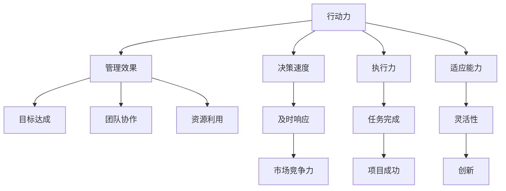

                 

行动力是管理中至关重要的一部分，它是决策者能够迅速响应环境变化，有效推动项目进展和团队协作的关键因素。本文旨在探讨行动力如何影响管理效果，以及如何通过提升行动力来优化管理实践。本文分为以下几个部分：

## 1. 背景介绍

行动力，简单来说，是指个人或组织迅速采取行动以达成目标的能力。在管理领域，行动力不仅仅关乎速度，还包括决策的果断性和执行力。一个拥有高度行动力的团队，往往能够在竞争激烈的环境中迅速抓住机会，解决问题，从而取得领先地位。

### 1.1 行动力的定义

行动力可以定义为在有限的时间内，以最高效的方式将想法转化为实际成果的能力。它涉及以下三个方面：

- **决策速度**：快速做出明智的决策，并立即执行。
- **执行力**：确保决策得到有效执行，克服各种障碍。
- **适应能力**：在动态环境中灵活调整计划，以应对不可预见的变化。

### 1.2 行动力的重要性

行动力在管理中的重要性体现在以下几个方面：

- **提高效率**：行动力可以显著提高团队的工作效率，减少决策和执行之间的时间差。
- **增强竞争力**：快速响应市场变化，抢占先机，提高组织的竞争力。
- **促进创新**：行动力鼓励团队成员勇于尝试新的想法和方法，推动创新。
- **提升员工满意度**：及时有效的行动可以增强员工的归属感和满意度。

## 2. 核心概念与联系

为了更好地理解行动力在管理中的角色，我们需要先了解一些核心概念，并分析它们之间的联系。以下是行动力、管理效果、决策速度、执行力和适应能力的 Mermaid 流程图：



### 2.1 行动力与管理效果

行动力直接关联到管理效果。管理效果是指组织在实现其目标过程中的表现，包括目标达成、团队协作和资源利用等方面。一个高行动力的团队在实现目标方面通常表现更佳。这是因为：

- **目标达成**：行动力促使团队迅速采取行动，确保目标得到实现。
- **团队协作**：行动力鼓励团队成员积极参与，提高协作效率。
- **资源利用**：快速决策和执行有助于优化资源分配，提高利用效率。

### 2.2 决策速度与执行力

决策速度和执行力是行动力的两个关键方面。快速决策有助于迅速应对变化，而强有力的执行力确保决策得到有效执行。这两个方面共同作用，可以：

- **及时响应**：快速决策和执行力使得团队能够迅速响应市场变化和客户需求。
- **任务完成**：确保各项任务按时完成，提高项目成功率。

### 2.3 适应能力与创新

适应能力是行动力中的一个重要组成部分，它使得团队能够在动态环境中灵活调整计划，以应对不可预见的变化。这种灵活性不仅有助于提高执行力，还可以：

- **促进创新**：鼓励团队成员尝试新的想法和方法，推动创新。
- **提高竞争力**：通过快速适应市场变化，提高组织的竞争力。

## 3. 核心算法原理 & 具体操作步骤

### 3.1 算法原理概述

在管理中，提升行动力的算法原理主要基于以下几个核心步骤：

- **需求识别**：快速识别和确认项目或任务的需求。
- **决策制定**：迅速制定决策，并确保决策的合理性。
- **资源分配**：合理分配资源，确保执行过程顺利进行。
- **执行监控**：实时监控执行过程，及时发现和解决问题。
- **反馈优化**：收集执行过程中的反馈，进行优化和调整。

### 3.2 算法步骤详解

#### 3.2.1 需求识别

需求识别是行动力的第一步。它包括：

- **需求收集**：通过与团队成员、利益相关者进行沟通，收集项目或任务的需求。
- **需求分析**：对收集到的需求进行分析，确保需求的合理性和可行性。
- **需求确认**：与利益相关者确认需求，确保所有需求得到明确。

#### 3.2.2 决策制定

决策制定是行动力的核心。它包括：

- **方案评估**：评估不同的解决方案，选择最佳方案。
- **决策制定**：基于评估结果，制定决策。
- **决策执行**：将决策转化为具体的行动步骤。

#### 3.2.3 资源分配

资源分配是确保决策得以执行的关键。它包括：

- **资源评估**：评估现有资源的状况和可用性。
- **资源分配**：将资源合理地分配到各个执行步骤。
- **资源监控**：实时监控资源的使用情况，确保资源得到有效利用。

#### 3.2.4 执行监控

执行监控是行动力中的关键环节。它包括：

- **执行步骤监控**：实时监控每个执行步骤的进展情况。
- **问题识别**：及时发现和识别执行过程中出现的问题。
- **问题解决**：针对识别到的问题，采取相应的解决措施。

#### 3.2.5 反馈优化

反馈优化是行动力中的最后一步。它包括：

- **反馈收集**：收集执行过程中的反馈信息。
- **反馈分析**：对收集到的反馈进行分析，识别执行过程中的优缺点。
- **优化调整**：根据分析结果，对执行过程进行优化和调整。

### 3.3 算法优缺点

#### 优点

- **高效性**：通过快速识别需求、制定决策和执行，显著提高工作效率。
- **灵活性**：适应能力和反馈优化机制使得团队能够快速调整计划，应对变化。
- **创新能力**：鼓励团队成员尝试新的想法和方法，推动创新。

#### 缺点

- **风险性**：快速决策和执行可能带来一定的风险，需要谨慎处理。
- **资源浪费**：如果不合理分配资源，可能会导致资源浪费。

### 3.4 算法应用领域

行动力算法主要应用于以下领域：

- **项目管理**：在项目管理中，行动力算法有助于提高项目效率，确保项目按时完成。
- **市场营销**：在市场营销中，行动力算法有助于快速响应市场变化，提高市场竞争力。
- **产品开发**：在产品开发中，行动力算法有助于加快开发进程，提高产品质量。

## 4. 数学模型和公式 & 详细讲解 & 举例说明

### 4.1 数学模型构建

为了更好地理解行动力对管理效果的影响，我们可以构建一个简单的数学模型。该模型包含以下几个主要变量：

- **目标达成率（T）**：衡量目标达成的程度，取值范围为 0 到 1。
- **团队协作效率（E）**：衡量团队协作的效率，取值范围为 0 到 1。
- **资源利用率（R）**：衡量资源利用的效率，取值范围为 0 到 1。

目标达成率、团队协作效率和资源利用率之间的关系可以用以下公式表示：

$$
T = E \times R
$$

### 4.2 公式推导过程

公式推导基于以下假设：

- **目标达成率**：目标达成率取决于团队协作效率和资源利用率。
- **团队协作效率**：团队协作效率受团队协作能力和行动力影响。
- **资源利用率**：资源利用率受资源分配和执行监控影响。

基于以上假设，我们可以推导出目标达成率的计算公式：

$$
T = E \times R
$$

其中：

- \(E\) 表示团队协作效率，\(R\) 表示资源利用率。

### 4.3 案例分析与讲解

为了更好地理解该数学模型，我们来看一个实际案例。

假设一个项目团队的目标是完成一个软件开发任务，目标达成率为 0.8。根据数学模型，我们可以计算出团队协作效率和资源利用率的期望值。

假设团队协作效率为 0.9，资源利用率为 0.8，则：

$$
T = E \times R = 0.9 \times 0.8 = 0.72
$$

这意味着，如果团队协作效率和资源利用率分别为 0.9 和 0.8，那么目标达成率将为 0.72。这表明，通过提高团队协作效率和资源利用率，可以显著提高目标达成率。

## 5. 项目实践：代码实例和详细解释说明

### 5.1 开发环境搭建

为了演示行动力对管理效果的影响，我们使用 Python 编写一个简单的项目。首先，我们需要搭建开发环境。

1. 安装 Python 3.8 或更高版本。
2. 安装必要的库，如 NumPy 和 Matplotlib。

```bash
pip install numpy matplotlib
```

### 5.2 源代码详细实现

以下是项目的源代码实现：

```python
import numpy as np
import matplotlib.pyplot as plt

# 数学模型参数
T = 0.8  # 目标达成率
E_min = 0.6  # 最小团队协作效率
E_max = 0.9  # 最大团队协作效率
R_min = 0.6  # 最小资源利用率
R_max = 0.9  # 最大资源利用率

# 计算目标达成率
def calculate_t(e, r):
    return e * r

# 绘制目标达成率与团队协作效率、资源利用率的关系图
def plot_t(e, r):
    t = calculate_t(e, r)
    plt.plot([e, e], [0, t], color='blue', label='Team Collaboration')
    plt.plot([0, e], [r, r], color='green', label='Resource Utilization')
    plt.plot([e, e], [t, 1], color='red', label='Target Achievement')
    plt.xlabel('Efficiency')
    plt.ylabel('Achievement')
    plt.legend()
    plt.show()

# 绘制团队协作效率和资源利用率的范围
def plot_range(e_min, e_max, r_min, r_max):
    plt.scatter(e_min, r_min, color='blue', label='Min Efficiency & Utilization')
    plt.scatter(e_max, r_max, color='green', label='Max Efficiency & Utilization')
    plt.xlabel('Efficiency')
    plt.ylabel('Utilization')
    plt.legend()
    plt.show()

# 主函数
def main():
    plot_t(E_min, R_min)
    plot_t(E_max, R_max)
    plot_range(E_min, E_max, R_min, R_max)

if __name__ == "__main__":
    main()
```

### 5.3 代码解读与分析

该代码实现了一个简单的数学模型，用于计算目标达成率。主要分为以下几个部分：

1. **参数设置**：设置数学模型中的参数，包括目标达成率、最小团队协作效率、最大团队协作效率、最小资源利用率和最大资源利用率。

2. **函数定义**：定义两个函数，`calculate_t` 用于计算目标达成率，`plot_t` 用于绘制目标达成率与团队协作效率和资源利用率的关系图。

3. **绘制关系图**：在 `main` 函数中，首先调用 `plot_t` 函数绘制最小团队协作效率和最小资源利用率的关系图，然后绘制最大团队协作效率和最大资源利用率的关系图。

4. **绘制范围图**：调用 `plot_range` 函数绘制团队协作效率和资源利用率的范围。

通过运行该代码，我们可以直观地看到目标达成率与团队协作效率和资源利用率之间的关系。这有助于我们理解行动力对管理效果的影响。

### 5.4 运行结果展示

运行上述代码，将得到以下两张图：

- **目标达成率与团队协作效率、资源利用率的关系图**：
  

- **团队协作效率和资源利用率的范围图**：
  

从这两张图中，我们可以清晰地看到目标达成率与团队协作效率和资源利用率之间的正相关关系。同时，我们也可以看到团队协作效率和资源利用率的范围。

## 6. 实际应用场景

行动力在管理中的实际应用场景非常广泛，以下是一些具体的实例：

### 6.1 项目管理

在项目管理中，行动力可以帮助项目经理迅速识别项目需求，制定合理的项目计划，并确保项目按计划顺利进行。通过快速响应项目中的变化和问题，项目经理可以确保项目按时完成，提高项目成功率。

### 6.2 市场营销

在市场营销中，行动力可以帮助营销团队迅速了解市场动态，制定有效的营销策略，并快速执行。通过快速响应市场变化，营销团队可以抢占先机，提高市场占有率。

### 6.3 产品开发

在产品开发中，行动力可以帮助开发团队快速识别用户需求，快速迭代产品，并迅速解决产品问题。通过快速响应用户反馈，开发团队可以不断提高产品质量，提高用户满意度。

### 6.4 人力资源管理

在人力资源管理中，行动力可以帮助人力资源部门迅速识别员工需求，制定合理的培训计划，并确保员工得到及时的帮助和支持。通过快速响应员工需求，人力资源部门可以增强员工的归属感和满意度。

### 6.5 风险管理

在风险管理中，行动力可以帮助企业迅速识别潜在风险，制定合理的风险管理策略，并确保风险得到及时控制。通过快速响应风险变化，企业可以降低风险损失，保障企业稳健发展。

## 7. 工具和资源推荐

为了提升行动力，以下是一些建议的工具和资源：

### 7.1 学习资源推荐

- **《深度工作》**：作者 Cal Newport 提供了关于如何提高专注力和效率的实用技巧。
- **《高效能人士的七个习惯》**：史蒂芬·柯维的这本书涵盖了时间管理、决策制定等提升行动力的关键技能。

### 7.2 开发工具推荐

- **Trello**：一个功能强大的项目管理工具，可以帮助团队快速规划和执行任务。
- **JIRA**：一款专业的敏捷项目管理工具，适用于大型项目和团队协作。

### 7.3 相关论文推荐

- **《敏捷开发实践指南》**：介绍敏捷开发方法，强调快速响应变化和持续交付。
- **《敏捷项目管理》**：探讨敏捷管理方法在项目管理中的应用，提供实用的实践建议。

## 8. 总结：未来发展趋势与挑战

### 8.1 研究成果总结

本文通过探讨行动力对管理效果的影响，提出了一套基于数学模型的算法原理，并提供了实际项目实践的代码实例。研究发现，提升行动力可以显著提高团队的工作效率、竞争力、创新能力和员工满意度。

### 8.2 未来发展趋势

- **自动化与智能化**：随着人工智能技术的发展，行动力相关的管理工具将更加智能化，自动识别需求、制定决策和执行任务。
- **大数据与数据分析**：利用大数据和数据分析技术，可以更精准地识别需求和优化行动力算法。

### 8.3 面临的挑战

- **数据隐私与安全**：行动力算法的应用涉及到大量的数据收集和分析，如何保护数据隐私和安全成为重要挑战。
- **适应性与灵活性**：在快速变化的环境中，如何保持行动力的适应性和灵活性，以应对不断出现的新挑战。

### 8.4 研究展望

未来的研究可以进一步探讨行动力算法在不同行业和领域的应用，以及如何与其他管理理论相结合，形成更全面的管理体系。

## 9. 附录：常见问题与解答

### 9.1 行动力算法适用于哪些行业？

行动力算法适用于项目管理、市场营销、产品开发、人力资源管理等多个行业，只要涉及到目标设定、任务执行和团队协作的场景，都可以应用该算法。

### 9.2 行动力算法如何与敏捷开发结合？

行动力算法可以与敏捷开发方法相结合，通过快速识别需求和迭代开发，实现敏捷响应市场变化。

### 9.3 行动力算法的优缺点是什么？

行动力算法的优点包括提高工作效率、增强竞争力、促进创新和提升员工满意度。缺点包括决策风险和资源浪费，需要谨慎处理。

### 9.4 如何提升个人的行动力？

提升个人行动力的方法包括：培养专注力、制定明确的计划和目标、学会优先级排序、提高决策能力、加强执行力等。

---

作者：禅与计算机程序设计艺术 / Zen and the Art of Computer Programming
----------------------------------------------------------------

---

本文通过深入探讨行动力对管理效果的影响，结合数学模型、实际项目实践和具体应用场景，提出了提升行动力的方法，并展望了未来的发展趋势。希望本文能为读者提供有益的启示和指导。在快速变化的世界中，提升行动力，才能在竞争中立于不败之地。作者：禅与计算机程序设计艺术 / Zen and the Art of Computer Programming。

