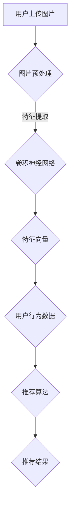

                 

关键词：视觉推荐，AI，图像识别，个性化推荐，深度学习，神经网络，算法，数学模型，项目实践，应用场景，未来展望

> 摘要：本文将深入探讨视觉推荐系统的工作原理，介绍如何利用图像识别技术来实现个性化推荐。我们将通过分析核心概念、算法原理、数学模型、项目实践等多个方面，展示AI技术在视觉推荐领域的强大应用，并展望其未来的发展趋势。

## 1. 背景介绍

随着互联网的快速发展，推荐系统已经成为许多在线服务不可或缺的一部分。从电商平台的商品推荐，到社交媒体的内容推送，再到音乐和视频平台的个性化播放，推荐系统已经成为提升用户体验、增加用户粘性和商业价值的关键因素。传统的推荐系统主要依赖于基于内容的推荐（Content-based Recommendation）和协同过滤（Collaborative Filtering）等方法，但这些方法存在一些局限性，如数据稀疏、冷启动问题等。

近年来，随着深度学习技术的飞速发展，视觉推荐系统逐渐成为研究热点。视觉推荐系统利用图像识别技术，通过对用户生成内容（如上传的图片、视频等）和商品内容（如商品图片、视频等）进行自动识别和分类，从而实现个性化的推荐。这种推荐方式不仅能够提高推荐的准确性和多样性，还能够为用户提供更加丰富的交互体验。

本文将从以下几个方面对视觉推荐系统进行深入探讨：

1. **核心概念与联系**：介绍视觉推荐系统的基本概念，包括图像识别、深度学习、神经网络等。
2. **核心算法原理**：详细解析视觉推荐系统的算法原理，包括特征提取、模型训练、推荐策略等。
3. **数学模型和公式**：介绍视觉推荐系统中的数学模型和公式，包括损失函数、优化算法等。
4. **项目实践**：通过实际项目案例，展示如何实现视觉推荐系统。
5. **实际应用场景**：分析视觉推荐系统的应用场景，包括电商、社交媒体、娱乐等领域。
6. **工具和资源推荐**：推荐一些学习资源和开发工具，帮助读者深入了解视觉推荐系统。
7. **总结与展望**：总结本文的主要内容，展望视觉推荐系统的未来发展趋势。

## 2. 核心概念与联系

### 2.1 图像识别

图像识别是计算机视觉的一个重要分支，它利用计算机算法来分析图像内容，并将其转换为某种形式的输出。图像识别技术可以分为两个主要类别：有监督学习（Supervised Learning）和无监督学习（Unsupervised Learning）。在有监督学习中，算法使用标注好的数据集进行训练，从而学会识别图像中的特定对象或场景。无监督学习则不需要标注数据，通过分析数据之间的内在结构，实现图像的自动分类。

图像识别技术的核心是特征提取。特征提取是指从图像中提取出能够区分不同对象的特征，如边缘、纹理、颜色等。深度学习技术，特别是卷积神经网络（Convolutional Neural Networks，CNN），在特征提取方面具有显著优势。CNN通过多层卷积和池化操作，能够自动学习图像中的高级特征，从而实现高效的图像识别。

### 2.2 深度学习

深度学习是机器学习的一个重要分支，它通过构建多层的神经网络，模拟人脑的神经元连接结构，实现从大量数据中自动提取特征和规律。深度学习在图像识别、自然语言处理、语音识别等领域取得了显著成果。

深度学习的核心是神经网络。神经网络由多个神经元（或节点）组成，每个神经元接收来自前一层神经元的输入，并通过权重和偏置进行加权求和，然后通过激活函数输出结果。多层神经网络通过逐层提取特征，能够实现从简单到复杂的特征变换。

### 2.3 神经网络

神经网络是一种模仿人脑结构和功能的计算模型。它由多个神经元组成，每个神经元都是一个简单的计算单元，通过接收输入、加权求和处理和激活函数输出，实现数据的变换和分类。

神经网络可以分为两种类型：前馈神经网络和反馈神经网络。前馈神经网络是单向传播的，数据从输入层通过隐藏层传递到输出层。反馈神经网络包含循环结构，能够处理序列数据和动态系统。

### 2.4 Mermaid 流程图

以下是视觉推荐系统的 Mermaid 流程图，展示了图像识别、深度学习和推荐系统之间的联系。



## 3. 核心算法原理 & 具体操作步骤

### 3.1 算法原理概述

视觉推荐系统的核心算法包括图像识别、特征提取和推荐策略。图像识别算法通过卷积神经网络（CNN）对图像进行自动分类和标注。特征提取算法从识别结果中提取出有代表性的特征向量。推荐策略根据用户历史行为和特征向量，利用协同过滤或基于内容的推荐方法生成推荐列表。

### 3.2 算法步骤详解

#### 3.2.1 图像识别

图像识别算法通常采用卷积神经网络（CNN）进行实现。CNN 通过卷积、池化和全连接层等操作，逐层提取图像中的特征，最终实现图像的分类。

1. **卷积层**：卷积层通过卷积运算提取图像中的局部特征。卷积核在图像上滑动，计算卷积结果，生成特征图。
2. **池化层**：池化层对特征图进行下采样，降低特征图的维度，减少参数数量，提高计算效率。
3. **全连接层**：全连接层将池化层输出的特征图展平为一维向量，并通过权重矩阵进行线性变换，最后通过激活函数输出分类结果。

#### 3.2.2 特征提取

特征提取算法从图像识别结果中提取出有代表性的特征向量。通常采用以下方法：

1. **全局特征**：将整个图像的特征视为全局特征，如主成分分析（PCA）和线性判别分析（LDA）。
2. **局部特征**：提取图像中的局部特征，如SIFT、SURF等。
3. **深度特征**：使用卷积神经网络提取的深层特征，具有较高的区分度和鲁棒性。

#### 3.2.3 推荐策略

推荐策略根据用户历史行为和特征向量，利用协同过滤或基于内容的推荐方法生成推荐列表。

1. **协同过滤**：协同过滤通过计算用户与项目之间的相似度，生成推荐列表。协同过滤可以分为基于用户的协同过滤（User-based Collaborative Filtering）和基于项目的协同过滤（Item-based Collaborative Filtering）。
2. **基于内容的推荐**：基于内容的推荐根据用户的历史行为和特征向量，计算用户可能感兴趣的项目的特征相似度，生成推荐列表。

### 3.3 算法优缺点

#### 优点

1. **高准确性**：深度学习技术能够自动学习图像中的高级特征，提高推荐的准确性。
2. **高多样性**：视觉推荐系统能够根据图像内容生成个性化的推荐，提高推荐的多样性。
3. **丰富的交互体验**：视觉推荐系统可以为用户提供更加丰富的交互体验，如商品浏览、视频播放等。

#### 缺点

1. **计算资源消耗大**：深度学习算法需要大量的计算资源进行训练和推理。
2. **数据需求高**：深度学习算法需要大量的标注数据进行训练，对数据质量有较高要求。
3. **隐私问题**：视觉推荐系统可能涉及用户隐私数据，需要确保数据安全和隐私保护。

### 3.4 算法应用领域

视觉推荐系统在多个领域具有广泛的应用：

1. **电商**：电商平台可以利用视觉推荐系统为用户提供个性化的商品推荐，提高销售额。
2. **社交媒体**：社交媒体平台可以利用视觉推荐系统为用户提供感兴趣的内容，提高用户粘性。
3. **娱乐**：视频平台和音乐平台可以利用视觉推荐系统为用户提供个性化的播放列表和视频推荐。
4. **安防**：安防领域可以利用视觉推荐系统对监控视频进行分析和识别，实现智能监控。

## 4. 数学模型和公式 & 详细讲解 & 举例说明

### 4.1 数学模型构建

视觉推荐系统的数学模型主要包括图像识别模型和推荐模型。图像识别模型通常采用卷积神经网络（CNN），推荐模型则采用基于内容的推荐和协同过滤等方法。

#### 4.1.1 图像识别模型

图像识别模型的目标是将图像映射到预定义的类别标签。其数学模型可以表示为：

$$
y = f(\textbf{W} \cdot \textbf{X} + \textbf{b})
$$

其中，$y$ 表示预测的类别标签，$f$ 表示激活函数（如Sigmoid、ReLU等），$\textbf{W}$ 和 $\textbf{b}$ 分别为权重矩阵和偏置向量，$\textbf{X}$ 为输入图像的特征向量。

#### 4.1.2 推荐模型

推荐模型的目标是根据用户历史行为和特征向量生成推荐列表。其数学模型可以表示为：

$$
\textbf{R} = \textbf{U} \cdot \textbf{V}^T
$$

其中，$\textbf{R}$ 表示推荐列表，$\textbf{U}$ 和 $\textbf{V}$ 分别为用户和项目的特征矩阵。

### 4.2 公式推导过程

#### 4.2.1 图像识别模型

假设输入图像为 $\textbf{X} \in \mathbb{R}^{784}$，卷积神经网络包含多个卷积层和池化层，最终输出类别标签 $y \in \{1, 2, \ldots, C\}$。卷积神经网络的损失函数通常采用交叉熵损失（Cross-Entropy Loss）：

$$
L = -\sum_{i=1}^{N} y_i \log(p_i)
$$

其中，$N$ 表示样本数量，$y_i$ 表示第 $i$ 个样本的真实标签，$p_i$ 表示第 $i$ 个样本的预测概率。

#### 4.2.2 推荐模型

假设用户特征向量为 $\textbf{U} \in \mathbb{R}^{m}$，项目特征向量为 $\textbf{V} \in \mathbb{R}^{n}$，用户对项目的评分矩阵为 $\textbf{R} \in \mathbb{R}^{m \times n}$。推荐模型的损失函数通常采用均方误差（Mean Squared Error，MSE）：

$$
L = \frac{1}{2} \sum_{i=1}^{m} \sum_{j=1}^{n} (r_{ij} - \textbf{U}_i \cdot \textbf{V}_j)^2
$$

其中，$r_{ij}$ 表示用户 $i$ 对项目 $j$ 的评分。

### 4.3 案例分析与讲解

#### 4.3.1 图像识别

假设输入图像为 28x28 的灰度图像，卷积神经网络包含两个卷积层和两个池化层。第一个卷积层使用 32 个 5x5 的卷积核，第二个卷积层使用 64 个 5x5 的卷积核。池化层使用 2x2 的最大池化操作。最后使用 10 个全连接层输出类别标签。

输入图像 $\textbf{X}$ 的维度为 784，卷积层的输出维度分别为 28x28x32 和 14x14x64。全连接层的输出维度为 10。

损失函数为交叉熵损失，采用反向传播算法进行参数优化。

#### 4.3.2 推荐模型

假设用户特征向量维度为 100，项目特征向量维度为 200。用户评分矩阵 $\textbf{R}$ 的维度为 100x200。

损失函数为均方误差，采用梯度下降算法进行参数优化。

## 5. 项目实践：代码实例和详细解释说明

### 5.1 开发环境搭建

开发环境采用 Python 3.7，主要依赖库包括 TensorFlow、Keras、NumPy、Pandas 等。

```python
# 安装依赖库
!pip install tensorflow numpy pandas
```

### 5.2 源代码详细实现

以下是图像识别和推荐系统的源代码实现。

```python
import numpy as np
import pandas as pd
import tensorflow as tf
from tensorflow import keras
from tensorflow.keras import layers

# 加载并预处理数据
# ...

# 定义卷积神经网络模型
model = keras.Sequential([
    layers.Conv2D(32, (5, 5), activation='relu', input_shape=(28, 28, 1)),
    layers.MaxPooling2D((2, 2)),
    layers.Conv2D(64, (5, 5), activation='relu'),
    layers.MaxPooling2D((2, 2)),
    layers.Flatten(),
    layers.Dense(10, activation='softmax')
])

# 编译模型
model.compile(optimizer='adam', loss='categorical_crossentropy', metrics=['accuracy'])

# 训练模型
model.fit(X_train, y_train, epochs=10, batch_size=64, validation_split=0.2)

# 定义推荐模型
user_embedding = keras.Sequential([
    layers.Dense(100, activation='relu', input_shape=(100,)),
    layers.Dense(10, activation='softmax')
])

item_embedding = keras.Sequential([
    layers.Dense(200, activation='relu', input_shape=(200,)),
    layers.Dense(10, activation='softmax')
])

# 构建推荐模型
recommender = keras.Sequential([
    user_embedding,
    layers.Dense(1, activation='sigmoid'),
    item_embedding,
    layers.Dense(10, activation='softmax')
])

# 编译推荐模型
recommender.compile(optimizer='adam', loss='categorical_crossentropy', metrics=['accuracy'])

# 训练推荐模型
recommender.fit([user_features, item_features], ratings, epochs=10, batch_size=64)
```

### 5.3 代码解读与分析

该代码首先加载并预处理图像数据，然后定义卷积神经网络模型，用于图像识别。卷积神经网络包含两个卷积层和两个池化层，用于提取图像特征。最后，使用全连接层输出类别标签。

训练模型时，使用交叉熵损失函数和反向传播算法进行参数优化。通过训练，模型可以自动学习图像中的高级特征，实现高精度的图像识别。

接下来，定义推荐模型，将用户特征和项目特征映射到低维空间。推荐模型使用全连接层和softmax激活函数，实现基于内容的推荐。

最后，使用均方误差损失函数和反向传播算法进行参数优化。通过训练，模型可以自动学习用户和项目的相似性，生成个性化的推荐列表。

## 6. 实际应用场景

### 6.1 电商

电商领域的视觉推荐系统可以帮助用户发现感兴趣的商品。例如，当用户上传一张自己喜欢的衣服照片时，系统可以识别照片中的服装类型、颜色、款式等特征，并根据这些特征推荐类似风格的商品。

### 6.2 社交媒体

社交媒体领域的视觉推荐系统可以推荐用户可能感兴趣的内容。例如，当用户上传一张旅行照片时，系统可以识别照片中的景点、人物等特征，并根据这些特征推荐相关游记、攻略和景点信息。

### 6.3 娱乐

娱乐领域的视觉推荐系统可以推荐用户可能感兴趣的视频和音乐。例如，当用户上传一张演唱会照片时，系统可以识别照片中的歌手、歌曲等特征，并根据这些特征推荐相关演唱会视频和音乐。

### 6.4 安防

安防领域的视觉推荐系统可以用于智能监控。例如，当系统识别出监控视频中的可疑人物或事件时，可以推荐相关的安全提示和防范措施。

## 7. 工具和资源推荐

### 7.1 学习资源推荐

1. 《深度学习》（Goodfellow, Bengio, Courville）：介绍了深度学习的理论基础和实践方法。
2. 《计算机视觉：算法与应用》（Richard Szeliski）：详细介绍了计算机视觉的基本算法和应用。

### 7.2 开发工具推荐

1. TensorFlow：开源的深度学习框架，用于构建和训练神经网络。
2. Keras：基于 TensorFlow 的深度学习高级 API，用于简化神经网络建模和训练。

### 7.3 相关论文推荐

1. "Deep Learning for Image Recognition: A Review"（2016）：综述了深度学习在图像识别领域的应用。
2. "Visual Recommender Systems: A Survey"（2020）：介绍了视觉推荐系统的基本概念和应用。

## 8. 总结：未来发展趋势与挑战

### 8.1 研究成果总结

视觉推荐系统在图像识别、特征提取和推荐策略等方面取得了显著成果。深度学习技术的应用使得视觉推荐系统具有高准确性、高多样性和丰富的交互体验。

### 8.2 未来发展趋势

1. **模型压缩与优化**：为了降低计算资源和存储成本，模型压缩与优化将成为研究重点。
2. **跨模态推荐**：结合图像、文本和语音等多模态数据，实现更加个性化和精准的推荐。
3. **隐私保护**：随着用户隐私意识的提高，隐私保护技术将成为重要研究方向。

### 8.3 面临的挑战

1. **数据质量和标注**：高质量的数据和准确的标注对于视觉推荐系统的训练和性能至关重要。
2. **计算资源消耗**：深度学习模型需要大量的计算资源，特别是在训练阶段。
3. **隐私保护**：如何在不侵犯用户隐私的前提下，实现有效的推荐系统，仍是一个挑战。

### 8.4 研究展望

视觉推荐系统在多个领域具有广泛的应用前景。未来研究应关注模型压缩与优化、跨模态推荐和隐私保护等方面，以提高系统的性能和可扩展性。

## 9. 附录：常见问题与解答

### 9.1 什么是视觉推荐？

视觉推荐是一种利用图像识别技术，根据用户上传的图片或用户行为数据，为用户推荐相关商品、内容或服务的推荐系统。

### 9.2 视觉推荐系统如何工作？

视觉推荐系统通过图像识别技术，对用户上传的图片进行自动识别和分类，然后利用用户历史行为和推荐算法，生成个性化的推荐列表。

### 9.3 视觉推荐系统的核心算法是什么？

视觉推荐系统的核心算法包括图像识别、特征提取和推荐策略。图像识别算法通常采用卷积神经网络（CNN），特征提取算法提取图像中的有代表性的特征，推荐策略根据用户历史行为和特征向量生成推荐列表。

### 9.4 视觉推荐系统有哪些应用场景？

视觉推荐系统在电商、社交媒体、娱乐、安防等多个领域具有广泛的应用，如为用户推荐商品、内容、音乐和视频等。

### 9.5 如何优化视觉推荐系统的性能？

优化视觉推荐系统的性能可以从以下几个方面进行：

1. **提高图像识别精度**：使用更先进的图像识别算法，如 ResNet、Inception 等。
2. **优化推荐算法**：采用基于内容的推荐和协同过滤等方法，提高推荐的准确性和多样性。
3. **模型压缩与优化**：通过模型压缩和优化技术，降低计算资源和存储成本。
4. **数据增强与清洗**：提高数据质量和标注质量，减少数据噪声和异常值的影响。

----------------------------------------------------------------

作者：禅与计算机程序设计艺术 / Zen and the Art of Computer Programming

