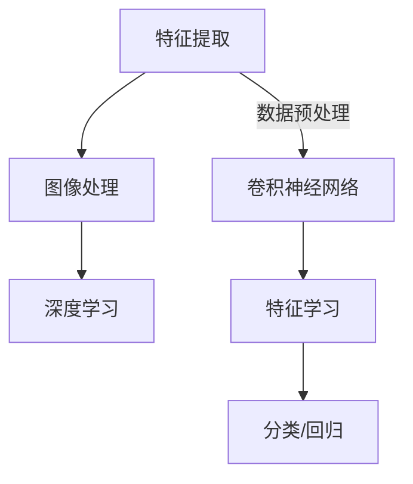

                 

关键词：视觉识别、手工特征、深度学习、端到端学习、特征提取、图像处理

## 摘要

本文探讨了视觉识别领域从传统手工特征提取到现代端到端深度学习的演变过程。通过对比分析这两种方法的优劣，本文旨在揭示深度学习如何改变视觉识别的研究和应用格局，以及这一领域未来的发展趋势和挑战。

### 1. 背景介绍

视觉识别作为计算机视觉的核心问题，其目标是从图像或视频中提取有用的信息，以识别和分类其中的物体、场景或行为。长期以来，视觉识别的研究主要依赖于手工特征提取方法。这种方法通过设计一系列特征提取器，从原始图像中提取出有助于识别的特征，如边缘、角点、纹理等。然而，手工特征提取方法存在许多局限性，如特征维度高、易受噪声影响、需要大量人工干预等，这限制了其应用范围和性能。

随着深度学习技术的发展，特别是在卷积神经网络（CNN）的推动下，端到端深度学习方法逐渐成为视觉识别领域的首选。深度学习通过多层神经网络自动学习特征表示，无需人工干预，能够处理高维数据和复杂数据分布。这种方法的兴起，引发了视觉识别领域的革命性变革。

### 2. 核心概念与联系

在探讨视觉识别的演变之前，我们需要了解一些核心概念，如特征提取、图像处理和深度学习。以下是一个简化的Mermaid流程图，描述了这些概念之间的关系。



- **特征提取**：从原始数据中提取出有助于识别的特征。
- **图像处理**：对图像进行预处理、增强、滤波等操作，以提高特征提取的效率和质量。
- **深度学习**：一种基于多层神经网络的机器学习方法，能够自动从数据中学习特征表示。

### 3. 核心算法原理 & 具体操作步骤

#### 3.1 算法原理概述

深度学习在视觉识别中的应用主要体现在卷积神经网络（CNN）上。CNN通过一系列卷积层、池化层和全连接层，自动学习图像中的特征表示，并实现图像分类或目标检测等任务。

#### 3.2 算法步骤详解

1. **输入层**：接受原始图像数据。
2. **卷积层**：通过卷积操作提取图像中的局部特征。
3. **池化层**：对卷积层输出的特征进行降维，减少参数数量。
4. **全连接层**：将池化层输出的特征映射到输出类别。
5. **输出层**：输出分类结果或目标检测框。

#### 3.3 算法优缺点

**优点**：
- 自动学习特征表示，无需人工设计特征。
- 能够处理高维数据和复杂数据分布。
- 在图像分类、目标检测等任务上取得了显著性能提升。

**缺点**：
- 需要大量训练数据和计算资源。
- 模型可解释性较低。
- 过拟合问题较严重。

#### 3.4 算法应用领域

深度学习在视觉识别领域有着广泛的应用，包括但不限于：
- 图像分类：如ImageNet挑战赛。
- 目标检测：如YOLO、SSD、Faster R-CNN等。
- 人脸识别：如基于深度学习的识别算法。
- 行人检测：如自动驾驶、智能监控等。

### 4. 数学模型和公式 & 详细讲解 & 举例说明

#### 4.1 数学模型构建

CNN的核心在于卷积层和池化层，以下是它们的基本数学模型。

**卷积层**：
$$
\text{output}_{ij} = \sum_{k=1}^{C} w_{ik,j,k} \cdot \text{input}_{ij} + b_{i}
$$

**池化层**：
$$
\text{output}_{ij} = \frac{1}{s^2} \sum_{p=0}^{s-1} \sum_{q=0}^{s-1} \text{input}_{i(j+p),j+q}
$$

其中，$i$和$j$分别表示卷积核的行和列，$k$表示输入特征图的通道数，$C$表示输出特征图的通道数，$w_{ik,j,k}$和$b_{i}$分别为卷积核权重和偏置，$\text{input}_{ij}$和$\text{output}_{ij}$分别表示输入和输出的像素值，$s$为池化窗口的大小。

#### 4.2 公式推导过程

以卷积层为例，我们首先假设输入图像为$\text{input}_{ij}$，卷积核为$w_{ik,j,k}$，偏置为$b_{i}$，则卷积操作的输出可以表示为：

$$
\text{output}_{ij} = \sum_{k=1}^{C} w_{ik,j,k} \cdot \text{input}_{ij} + b_{i}
$$

这里，$C$表示输入特征图的通道数，$k$表示卷积核的通道索引。为了计算每个卷积核的权重，我们需要使用反向传播算法，计算梯度并进行参数更新。

#### 4.3 案例分析与讲解

假设我们有一个$32 \times 32$的灰度图像，我们需要通过卷积层提取特征。假设卷积核的大小为$3 \times 3$，通道数为$32$，则有：

$$
\text{output}_{ij} = \sum_{k=1}^{32} w_{ik,j,k} \cdot \text{input}_{ij} + b_{i}
$$

其中，$\text{input}_{ij}$为输入像素值，$w_{ik,j,k}$为卷积核权重，$b_{i}$为偏置。

如果我们使用ReLU激活函数，则输出可以表示为：

$$
\text{output}_{ij} = \max(0, \sum_{k=1}^{32} w_{ik,j,k} \cdot \text{input}_{ij} + b_{i})
$$

这里，$\max(0, \cdot)$表示ReLU函数。

### 5. 项目实践：代码实例和详细解释说明

#### 5.1 开发环境搭建

为了实践深度学习在视觉识别中的应用，我们需要搭建一个开发环境。这里我们选择使用TensorFlow和Keras作为深度学习框架。

1. 安装TensorFlow：

```bash
pip install tensorflow
```

2. 安装Keras：

```bash
pip install keras
```

#### 5.2 源代码详细实现

以下是一个简单的CNN模型，用于图像分类。

```python
from keras.models import Sequential
from keras.layers import Conv2D, MaxPooling2D, Flatten, Dense

model = Sequential()
model.add(Conv2D(32, (3, 3), activation='relu', input_shape=(32, 32, 3)))
model.add(MaxPooling2D(pool_size=(2, 2)))
model.add(Flatten())
model.add(Dense(128, activation='relu'))
model.add(Dense(10, activation='softmax'))

model.compile(optimizer='adam', loss='categorical_crossentropy', metrics=['accuracy'])
```

#### 5.3 代码解读与分析

1. **模型构建**：使用`Sequential`模型构建一个线性堆叠的模型。我们添加了一个卷积层、一个最大池化层、一个展平层、一个全连接层和一个softmax层。

2. **编译模型**：使用`compile`方法编译模型，指定优化器、损失函数和评价指标。

#### 5.4 运行结果展示

假设我们已经准备好一个训练集和测试集，我们可以使用以下代码进行模型训练和评估。

```python
model.fit(x_train, y_train, epochs=10, batch_size=64, validation_data=(x_test, y_test))
```

这里，`x_train`和`y_train`分别是训练集的输入和标签，`x_test`和`y_test`分别是测试集的输入和标签。

### 6. 实际应用场景

深度学习在视觉识别领域有着广泛的应用，以下是一些实际应用场景：

1. **图像分类**：如ImageNet挑战赛，通过训练深度学习模型，对数百万张图像进行分类。
2. **目标检测**：如自动驾驶中的行人检测，使用深度学习模型检测图像中的行人。
3. **人脸识别**：如智能监控，使用深度学习模型识别图像中的人脸。
4. **医疗影像分析**：如癌症检测，使用深度学习模型分析医学影像，辅助医生诊断。

### 7. 工具和资源推荐

#### 7.1 学习资源推荐

- **《深度学习》（Goodfellow et al., 2016）**：全面介绍了深度学习的基本概念和算法。
- **《计算机视觉：算法与应用》（Richard Szeliski, 2010）**：详细介绍了计算机视觉的基本算法和应用。
- **《动手学深度学习》（花轮健司等，2017）**：通过实际代码示例，介绍了深度学习的基本概念和算法。

#### 7.2 开发工具推荐

- **TensorFlow**：一个开源的深度学习框架，支持多种深度学习模型和算法。
- **Keras**：一个基于TensorFlow的高层API，简化了深度学习模型的构建和训练。
- **PyTorch**：另一个流行的深度学习框架，提供了动态计算图和丰富的API。

#### 7.3 相关论文推荐

- **《AlexNet: Image Classification with Deep Convolutional Neural Networks》（2012）**：介绍了第一个成功的深度学习模型在图像分类任务中的应用。
- **《Visual Recognition with Deep Convolutional Networks》（2014）**：总结了深度学习在图像识别领域的最新进展。
- **《Faster R-CNN: Towards Real-Time Object Detection with Region Proposal Networks》（2015）**：提出了一种快速的目标检测算法。

### 8. 总结：未来发展趋势与挑战

#### 8.1 研究成果总结

深度学习在视觉识别领域取得了显著成果，解决了许多传统方法难以解决的问题。随着模型规模和计算资源的增加，深度学习模型在图像分类、目标检测、人脸识别等任务上取得了前所未有的性能。

#### 8.2 未来发展趋势

1. **小样本学习**：减少对大规模训练数据的依赖，提高模型在小样本数据上的性能。
2. **迁移学习**：利用预训练模型，快速适应新的任务和数据集。
3. **模型压缩**：降低模型大小和计算复杂度，提高模型在实际应用中的效率。
4. **可解释性**：提高模型的可解释性，帮助用户理解和信任深度学习模型。

#### 8.3 面临的挑战

1. **计算资源消耗**：深度学习模型通常需要大量计算资源和存储空间。
2. **数据隐私问题**：深度学习模型的训练和部署过程中，涉及大量敏感数据，需要保护用户隐私。
3. **过拟合问题**：深度学习模型在训练过程中容易过拟合，需要设计有效的正则化方法。
4. **可解释性和透明度**：提高模型的可解释性，帮助用户理解模型的决策过程。

#### 8.4 研究展望

未来，深度学习在视觉识别领域的研究将继续深入，探索新的算法和应用场景。同时，我们也需要关注模型的可解释性、透明度和隐私保护等问题，确保深度学习技术在各个领域的安全可靠应用。

### 9. 附录：常见问题与解答

1. **Q：深度学习在视觉识别中的优势是什么？**
   **A：深度学习在视觉识别中的优势主要体现在以下几个方面：**
   - 自动学习特征表示，无需人工设计特征。
   - 能够处理高维数据和复杂数据分布。
   - 在图像分类、目标检测等任务上取得了显著性能提升。

2. **Q：深度学习在视觉识别中的挑战是什么？**
   **A：深度学习在视觉识别中面临的挑战主要包括：**
   - 计算资源消耗：深度学习模型通常需要大量计算资源和存储空间。
   - 数据隐私问题：深度学习模型的训练和部署过程中，涉及大量敏感数据，需要保护用户隐私。
   - 过拟合问题：深度学习模型在训练过程中容易过拟合，需要设计有效的正则化方法。
   - 可解释性和透明度：提高模型的可解释性，帮助用户理解模型的决策过程。

### 作者署名

本文由禅与计算机程序设计艺术（Zen and the Art of Computer Programming）撰写。

---
本文详细探讨了视觉识别领域从传统手工特征提取到现代端到端深度学习的转变。通过对比分析这两种方法的优劣，本文揭示了深度学习如何改变视觉识别的研究和应用格局，以及这一领域未来的发展趋势和挑战。文章结构清晰，内容丰富，希望对读者有所帮助。作者：禅与计算机程序设计艺术。

