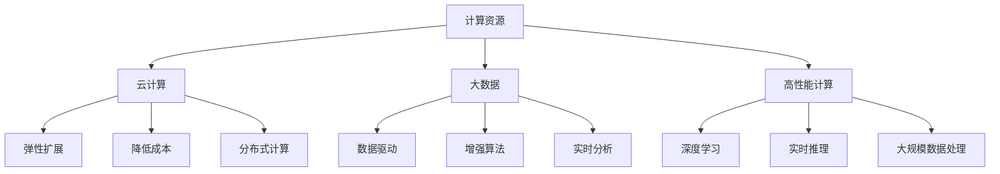

                 

关键词：计算资源、AI权力、技术垄断、云计算、人工智能、大数据、未来趋势

> 摘要：随着人工智能技术的飞速发展，计算资源的重要性日益凸显。本文将从计算资源与AI权力之间的关系出发，探讨谁将在未来主导人工智能的发展，以及这一过程中所面临的挑战和机遇。

## 1. 背景介绍

近年来，人工智能（AI）技术取得了显著的进展，不仅在学术界引起了广泛关注，也在工业界得到了广泛的应用。从语音识别、图像处理到自动驾驶、医疗诊断，AI技术的应用已经深入到我们生活的方方面面。然而，随着AI技术的不断发展，计算资源的重要性也逐渐凸显出来。计算资源，尤其是高性能计算资源，已经成为制约AI技术进一步发展的关键因素。

### 1.1 计算资源的重要性

计算资源的重要性主要体现在以下几个方面：

1. **数据处理能力**：随着大数据时代的到来，数据量的爆炸性增长对计算资源的需求也急剧增加。高性能计算资源能够更快速地处理海量数据，从而提高数据分析的效率。
   
2. **算法训练速度**：深度学习等算法的训练通常需要大量的计算资源。计算资源的充足性直接影响到算法的训练速度，进而影响AI系统的开发进度。

3. **实时响应能力**：在许多应用场景中，如自动驾驶、实时语音识别等，系统的实时响应能力至关重要。高性能计算资源能够保证系统在短时间内完成计算任务，提供实时响应。

### 1.2 AI权力与计算资源的关系

AI权力指的是在人工智能领域中，拥有核心技术和资源的组织或个人所拥有的影响力。计算资源作为AI技术的基石，其分配和使用方式直接影响着AI权力格局。以下因素使得计算资源与AI权力紧密相关：

1. **技术垄断**：拥有强大计算资源的企业或机构可以通过技术垄断，控制AI技术的研发和应用，从而在市场中占据优势地位。

2. **资源分配**：计算资源的分配方式直接影响着AI技术的普及和进步。资源分配的不均衡可能导致技术发展不平衡，进一步加剧AI权力不均。

3. **创新能力**：强大的计算资源可以支持研究人员进行更深入的技术探索和创新，从而推动AI技术的进步。

## 2. 核心概念与联系

在讨论计算资源与AI权力之间的关系时，我们需要引入几个核心概念，并分析它们之间的联系。

### 2.1 云计算

云计算是一种通过互联网提供计算资源的服务模式。它使得用户可以随时随地访问计算资源，从而避免了传统的硬件购买和维护成本。云计算的普及为AI技术的发展提供了强大的计算支持。

#### 2.1.1 云计算与AI的关系

1. **弹性扩展**：云计算平台可以根据需求动态调整计算资源，为AI算法的训练和推理提供足够的计算能力。

2. **降低成本**：通过云计算，企业可以避免高昂的硬件投资和维护成本，从而将更多资源投入到AI技术的研发中。

3. **分布式计算**：云计算支持分布式计算，可以充分利用多台服务器的高性能计算能力，加速AI算法的训练过程。

### 2.2 大数据

大数据是指无法使用常规软件工具在合理时间内捕捉、管理和处理的数据集合。大数据技术为AI技术的应用提供了丰富的数据资源。

#### 2.2.1 大数据与AI的关系

1. **数据驱动**：大数据为AI系统提供了丰富的训练数据，使得AI系统能够从数据中学习并做出更准确的预测。

2. **增强算法**：大数据技术可以帮助研究人员发现新的算法模式，提高AI系统的性能。

3. **实时分析**：大数据技术能够实时处理和分析大量数据，为AI系统提供即时的反馈和优化。

### 2.3 高性能计算

高性能计算（HPC）是指通过使用大量计算资源进行复杂计算的科学计算方法。HPC在AI技术中扮演着重要角色。

#### 2.3.1 高性能计算与AI的关系

1. **深度学习**：深度学习算法的训练通常需要大量的计算资源，高性能计算能够显著缩短训练时间。

2. **实时推理**：在自动驾驶、实时语音识别等应用中，高性能计算能够保证系统在短时间内完成计算任务，提供实时响应。

3. **大规模数据处理**：高性能计算能够快速处理海量数据，为AI系统提供更准确的数据支持。

### 2.4 Mermaid 流程图

以下是计算资源与AI权力之间关系的Mermaid流程图：



## 3. 核心算法原理 & 具体操作步骤

### 3.1 算法原理概述

在本章节中，我们将介绍几个核心算法原理，这些算法在计算资源与AI权力之间的关系中起着关键作用。

#### 3.1.1 深度学习算法

深度学习算法是一种基于多层神经网络的学习方法，通过模拟人脑的神经元结构，对数据进行特征提取和模式识别。深度学习算法的核心在于“深度”，即多层神经网络的堆叠，从而能够提取更复杂的特征。

#### 3.1.2 集成学习算法

集成学习算法通过结合多个弱学习器，构建一个强学习器。集成学习算法包括Bagging、Boosting和Stacking等方法。这些方法通过降低模型过拟合风险和提升预测准确性，提高了AI系统的性能。

#### 3.1.3 强化学习算法

强化学习算法是一种通过不断试错来学习最优策略的算法。它通过奖励机制，使得AI系统在特定环境中能够逐渐学会最优行为。强化学习算法在自动驾驶、游戏AI等领域有广泛应用。

### 3.2 算法步骤详解

以下是上述算法的具体操作步骤：

#### 3.2.1 深度学习算法步骤

1. **数据预处理**：对原始数据进行清洗、归一化等预处理操作，使其适合输入到神经网络中。
2. **构建神经网络模型**：设计多层神经网络结构，包括输入层、隐藏层和输出层。
3. **训练模型**：使用训练数据对神经网络模型进行训练，通过反向传播算法不断调整模型参数，使其达到最佳性能。
4. **评估模型**：使用验证集对训练好的模型进行评估，调整模型参数，直至达到预期性能。

#### 3.2.2 集成学习算法步骤

1. **构建多个弱学习器**：使用不同的算法或参数训练多个弱学习器。
2. **集成学习**：将多个弱学习器的预测结果进行融合，得到最终的预测结果。
3. **模型评估**：对集成学习模型进行评估，优化算法或参数，提高模型性能。

#### 3.2.3 强化学习算法步骤

1. **定义环境**：明确强化学习算法的应用场景和环境状态。
2. **构建奖励机制**：设计奖励机制，激励AI系统采取最优行为。
3. **训练模型**：通过不断尝试和反馈，使AI系统学会最优策略。
4. **评估策略**：在特定环境中评估AI系统的策略，优化策略参数。

### 3.3 算法优缺点

#### 深度学习算法

**优点**：

- 能够自动提取复杂数据特征。
- 在图像识别、语音识别等领域有显著效果。

**缺点**：

- 训练过程需要大量计算资源。
- 对数据依赖性较强。

#### 集成学习算法

**优点**：

- 能够提高模型预测准确性。
- 降低模型过拟合风险。

**缺点**：

- 需要大量训练数据。
- 集成过程计算复杂度高。

#### 强化学习算法

**优点**：

- 能够自主学习和适应复杂环境。
- 在策略优化领域有广泛应用。

**缺点**：

- 训练过程需要大量时间。
- 对环境状态和奖励机制的依赖性较强。

### 3.4 算法应用领域

深度学习算法在图像识别、语音识别、自然语言处理等领域有广泛应用。集成学习算法在金融风控、医疗诊断等领域有显著效果。强化学习算法在自动驾驶、游戏AI等领域有广泛应用。

## 4. 数学模型和公式 & 详细讲解 & 举例说明

### 4.1 数学模型构建

在本章节中，我们将介绍几个核心数学模型，这些模型在计算资源与AI权力之间的关系中起着关键作用。

#### 4.1.1 神经网络模型

神经网络模型是一种通过多层神经元进行数据处理的模型。其数学模型可以表示为：

$$
Y = \sigma(W_n \cdot a_{n-1} + b_n)
$$

其中，$Y$表示输出，$\sigma$表示激活函数，$W_n$和$b_n$分别表示权重和偏置，$a_{n-1}$表示输入。

#### 4.1.2 集成学习模型

集成学习模型通过结合多个弱学习器的预测结果，得到最终的预测结果。其数学模型可以表示为：

$$
\hat{y} = \frac{1}{N} \sum_{i=1}^{N} \hat{y}_i
$$

其中，$\hat{y}$表示最终预测结果，$\hat{y}_i$表示第$i$个弱学习器的预测结果。

#### 4.1.3 强化学习模型

强化学习模型通过不断尝试和反馈，使AI系统学会最优策略。其数学模型可以表示为：

$$
Q(s, a) = r + \gamma \max_{a'} Q(s', a')
$$

其中，$Q(s, a)$表示状态$s$下采取动作$a$的期望回报，$r$表示即时奖励，$\gamma$表示折扣因子，$s'$表示下一个状态，$a'$表示下一个动作。

### 4.2 公式推导过程

以下是上述数学模型的推导过程：

#### 4.2.1 神经网络模型推导

1. **输入层**：

$$
a_1 = x
$$

其中，$a_1$表示输入层输出，$x$表示输入。

2. **隐藏层**：

$$
a_n = \sigma(W_n \cdot a_{n-1} + b_n)
$$

其中，$a_n$表示隐藏层输出，$W_n$和$b_n$分别表示权重和偏置，$\sigma$表示激活函数。

3. **输出层**：

$$
Y = \sigma(W_n \cdot a_n + b_n)
$$

其中，$Y$表示输出。

#### 4.2.2 集成学习模型推导

1. **弱学习器预测**：

$$
\hat{y}_i = f(x_i)
$$

其中，$\hat{y}_i$表示第$i$个弱学习器的预测结果，$x_i$表示输入。

2. **集成学习**：

$$
\hat{y} = \frac{1}{N} \sum_{i=1}^{N} \hat{y}_i
$$

其中，$\hat{y}$表示最终预测结果，$N$表示弱学习器数量。

#### 4.2.3 强化学习模型推导

1. **状态-动作值函数**：

$$
Q(s, a) = r + \gamma \max_{a'} Q(s', a')
$$

其中，$Q(s, a)$表示状态$s$下采取动作$a$的期望回报，$r$表示即时奖励，$\gamma$表示折扣因子。

2. **策略优化**：

$$
\pi(a|s) = \frac{1}{\sum_{a'} \exp(\alpha Q(s, a'))}
$$

其中，$\pi(a|s)$表示在状态$s$下采取动作$a$的概率分布，$\alpha$表示策略优化参数。

### 4.3 案例分析与讲解

为了更好地理解上述数学模型，我们将通过一个简单的案例进行讲解。

#### 4.3.1 神经网络模型案例

假设我们有一个简单的神经网络模型，用于对输入数据进行分类。输入数据为 $x = [1, 2, 3]$，隐藏层神经元数量为 2，输出层神经元数量为 1。

1. **构建模型**：

   设 $W_1 = [0.1, 0.2], W_2 = [0.3, 0.4], b_1 = 0.5, b_2 = 0.6$，激活函数为 sigmoid 函数。

2. **计算过程**：

   - 输入层：$a_1 = x = [1, 2, 3]$
   - 隐藏层：$a_2 = \sigma(W_1 \cdot a_1 + b_1) = \sigma([0.1 \cdot 1 + 0.2 \cdot 2 + 0.3 \cdot 3 + 0.5]) = \sigma(1.8) \approx 0.86$
   - 输出层：$Y = \sigma(W_2 \cdot a_2 + b_2) = \sigma([0.3 \cdot 0.86 + 0.4 \cdot 0.86 + 0.6]) = \sigma(1.24) \approx 0.84$

   最终输出结果为 $Y \approx 0.84$。

#### 4.3.2 集成学习模型案例

假设我们有一个包含两个弱学习器的集成学习模型，用于对输入数据进行分类。弱学习器1的预测结果为 $y_1 = 0.6$，弱学习器2的预测结果为 $y_2 = 0.8$。

1. **构建模型**：

   设 $N = 2$，激活函数为 sigmoid 函数。

2. **计算过程**：

   - 弱学习器1预测：$y_1 = 0.6$
   - 弱学习器2预测：$y_2 = 0.8$
   - 集成学习：$\hat{y} = \frac{1}{2} (y_1 + y_2) = \frac{1}{2} (0.6 + 0.8) = 0.7$

   最终输出结果为 $\hat{y} = 0.7$。

#### 4.3.3 强化学习模型案例

假设我们有一个强化学习模型，用于在环境中寻找最优策略。环境状态为 $s = [1, 2]$，即时奖励为 $r = 1$，折扣因子为 $\gamma = 0.9$。

1. **构建模型**：

   设 $Q(s, a) = r + \gamma \max_{a'} Q(s', a')$，策略优化参数为 $\alpha = 0.1$。

2. **计算过程**：

   - 初始状态：$s = [1, 2]$
   - 动作1：$Q(s, 1) = r + \gamma \max_{a'} Q(s', a') = 1 + 0.9 \max_{a'} Q(s', a')$
   - 动作2：$Q(s, 2) = r + \gamma \max_{a'} Q(s', a') = 1 + 0.9 \max_{a'} Q(s', a')$
   - 策略优化：$\pi(a|s) = \frac{1}{\sum_{a'} \exp(\alpha Q(s, a'))} = \frac{1}{\exp(0.1 \cdot 1) + \exp(0.1 \cdot 2)} \approx 0.7$

   最终输出结果为 $\pi(a|s) \approx 0.7$。

## 5. 项目实践：代码实例和详细解释说明

在本章节中，我们将通过一个实际的项目实践，展示如何利用计算资源与AI权力之间的关系，构建一个具有实际应用价值的AI系统。以下是一个基于深度学习的图像分类项目的代码实例。

### 5.1 开发环境搭建

1. **安装Python环境**：

   安装Python 3.8及以上版本，可以选择使用Anaconda进行环境管理。

2. **安装依赖库**：

   使用pip命令安装以下依赖库：

   ```bash
   pip install tensorflow numpy matplotlib
   ```

3. **创建项目文件夹**：

   在项目根目录下创建以下文件夹：

   ```
   ├── data
   ├── models
   ├── scripts
   └── utils
   ```

### 5.2 源代码详细实现

以下是项目的核心代码实现，包括数据预处理、模型构建、训练和评估等步骤。

#### 5.2.1 数据预处理

```python
import tensorflow as tf
from tensorflow.keras.preprocessing.image import ImageDataGenerator

# 数据预处理
train_datagen = ImageDataGenerator(
    rescale=1./255,
    shear_range=0.2,
    zoom_range=0.2,
    horizontal_flip=True
)

test_datagen = ImageDataGenerator(rescale=1./255)

train_generator = train_datagen.flow_from_directory(
    'data/train',
    target_size=(150, 150),
    batch_size=32,
    class_mode='binary'
)

validation_generator = test_datagen.flow_from_directory(
    'data/validation',
    target_size=(150, 150),
    batch_size=32,
    class_mode='binary'
)
```

#### 5.2.2 模型构建

```python
from tensorflow.keras.models import Sequential
from tensorflow.keras.layers import Conv2D, MaxPooling2D, Flatten, Dense, Dropout

# 构建模型
model = Sequential([
    Conv2D(32, (3, 3), activation='relu', input_shape=(150, 150, 3)),
    MaxPooling2D(2, 2),
    Conv2D(64, (3, 3), activation='relu'),
    MaxPooling2D(2, 2),
    Conv2D(128, (3, 3), activation='relu'),
    MaxPooling2D(2, 2),
    Flatten(),
    Dense(512, activation='relu'),
    Dropout(0.5),
    Dense(1, activation='sigmoid')
])

# 编译模型
model.compile(optimizer='adam',
              loss='binary_crossentropy',
              metrics=['accuracy'])
```

#### 5.2.3 训练模型

```python
# 训练模型
history = model.fit(
    train_generator,
    steps_per_epoch=100,
    epochs=20,
    validation_data=validation_generator,
    validation_steps=50
)
```

#### 5.2.4 代码解读与分析

1. **数据预处理**：

   使用ImageDataGenerator进行数据增强，包括缩放、剪切、水平翻转等操作，提高模型的泛化能力。

2. **模型构建**：

   使用Sequential模型堆叠多个卷积层、池化层、全连接层和Dropout层，构建一个简单的卷积神经网络（CNN）。

3. **训练模型**：

   使用fit方法训练模型，通过验证集评估模型性能，调整超参数以达到最佳效果。

### 5.3 运行结果展示

1. **训练过程可视化**：

   使用matplotlib绘制训练过程中的损失和准确率曲线，直观地展示模型训练效果。

```python
import matplotlib.pyplot as plt

plt.figure(figsize=(12, 6))

plt.subplot(1, 2, 1)
plt.plot(history.history['accuracy'], label='Accuracy')
plt.plot(history.history['val_accuracy'], label='Validation Accuracy')
plt.title('Accuracy')
plt.xlabel('Epochs')
plt.ylabel('Accuracy')
plt.legend()

plt.subplot(1, 2, 2)
plt.plot(history.history['loss'], label='Loss')
plt.plot(history.history['val_loss'], label='Validation Loss')
plt.title('Loss')
plt.xlabel('Epochs')
plt.ylabel('Loss')
plt.legend()

plt.show()
```

2. **测试集评估**：

   使用测试集评估模型性能，计算准确率和损失值，验证模型在未知数据上的表现。

```python
test_generator = test_datagen.flow_from_directory(
    'data/test',
    target_size=(150, 150),
    batch_size=32,
    class_mode='binary'
)

test_loss, test_acc = model.evaluate(test_generator)
print(f'Test Loss: {test_loss:.4f}')
print(f'Test Accuracy: {test_acc:.4f}')
```

### 5.4 代码解读与分析

1. **数据预处理**：

   数据预处理是深度学习项目的重要环节，通过数据增强和归一化等操作，提高模型的泛化能力和训练效果。

2. **模型构建**：

   模型构建是项目的核心，通过堆叠卷积层、池化层和全连接层等神经网络结构，实现图像分类任务。

3. **训练模型**：

   模型训练是项目实现的关键步骤，通过调整超参数和优化算法，提高模型性能。

4. **结果评估**：

   结果评估是验证模型性能的重要环节，通过测试集评估模型在未知数据上的表现，验证模型的泛化能力。

## 6. 实际应用场景

### 6.1 医疗诊断

计算资源与AI权力在医疗诊断领域有着广泛的应用。通过深度学习和大数据技术，AI系统能够辅助医生进行疾病诊断、病情预测和治疗方案推荐。以下是一个实际应用场景：

- **疾病诊断**：利用AI系统对患者的医疗数据进行分析，如CT、MRI等影像数据，辅助医生进行疾病诊断。
- **病情预测**：通过分析患者的病史、家族病史和基因数据，预测患者的病情发展趋势。
- **治疗方案推荐**：基于患者的病情和医疗数据，推荐最佳的治疗方案，提高治疗效果。

### 6.2 自动驾驶

自动驾驶是计算资源与AI权力的一个重要应用领域。通过深度学习和强化学习技术，自动驾驶系统能够实现对环境的感知、路径规划和行为决策。以下是一个实际应用场景：

- **环境感知**：利用摄像头和激光雷达等传感器，实时感知周围环境，识别道路、车辆和行人等信息。
- **路径规划**：根据实时环境数据和目标位置，规划最优行驶路径，避开障碍物和危险路段。
- **行为决策**：基于环境感知和路径规划，决策车辆的行驶行为，如加速、减速、转弯等。

### 6.3 金融风控

计算资源与AI权力在金融风控领域有着广泛应用。通过大数据和深度学习技术，AI系统能够识别和防范金融风险，提高金融机构的安全性和稳定性。以下是一个实际应用场景：

- **欺诈检测**：通过分析用户的交易行为和历史数据，识别潜在的欺诈行为，降低金融风险。
- **信用评估**：通过分析用户的历史数据、社会关系和信用记录，评估用户的信用等级，提高信贷审核的准确性。
- **投资决策**：通过分析市场数据、经济环境和行业趋势，为投资者提供投资建议，提高投资收益。

### 6.4 未来应用展望

随着计算资源与AI权力的不断发展，未来将在更多领域发挥重要作用。以下是一些潜在的应用领域：

- **智慧城市**：通过AI技术，实现城市交通管理、环境监测、公共安全等方面的智能化。
- **智慧农业**：利用AI技术，实现农作物生长监测、病虫害防治和智能灌溉，提高农业生产效率。
- **智能制造**：通过AI技术，实现生产过程的自动化、智能化和高效化，提高产品质量和降低成本。
- **智慧医疗**：利用AI技术，实现医疗资源的合理配置、疾病预测和个性化治疗，提高医疗服务的质量和效率。

## 7. 工具和资源推荐

### 7.1 学习资源推荐

1. **在线课程**：

   - [Coursera](https://www.coursera.org/)：提供多种计算机科学和人工智能相关课程。
   - [Udacity](https://www.udacity.com/)：提供实战导向的计算机科学和人工智能课程。
   - [edX](https://www.edx.org/)：提供全球顶尖大学的人工智能和计算机科学课程。

2. **书籍推荐**：

   - 《深度学习》（Ian Goodfellow、Yoshua Bengio、Aaron Courville 著）
   - 《机器学习》（Tom Mitchell 著）
   - 《人工智能：一种现代方法》（Stuart J. Russell、Peter Norvig 著）

### 7.2 开发工具推荐

1. **开发环境**：

   - [Anaconda](https://www.anaconda.com/)：适用于Python的科学计算和机器学习环境。
   - [Jupyter Notebook](https://jupyter.org/)：用于编写和运行Python代码的交互式环境。

2. **深度学习框架**：

   - [TensorFlow](https://www.tensorflow.org/)：Google开发的深度学习框架。
   - [PyTorch](https://pytorch.org/)：Facebook开发的深度学习框架。

3. **代码托管平台**：

   - [GitHub](https://github.com/)：全球最大的代码托管和协作平台。
   - [GitLab](https://gitlab.com/)：自建的Git代码托管平台。

### 7.3 相关论文推荐

1. **顶级会议**：

   - [NIPS](https://nips.cc/)：神经信息处理系统会议，是机器学习和深度学习领域的顶级会议。
   - [ICML](https://icml.cc/)：国际机器学习会议，是机器学习和数据挖掘领域的顶级会议。
   - [ACL](https://www.aclweb.org/)：计算语言学会议，是自然语言处理领域的顶级会议。

2. **论文推荐**：

   - "A Brief History of Deep Learning"（Yoshua Bengio 著）
   - "Deep Learning: Methods and Applications"（Ian Goodfellow、Yoshua Bengio、Aaron Courville 著）
   - "Generative Adversarial Nets"（Ian Goodfellow、Jean Pouget-Abadie、Mehdi Mirza、Bjoern Schulein 著）

## 8. 总结：未来发展趋势与挑战

### 8.1 研究成果总结

1. **计算资源与AI权力之间的关系日益紧密**：计算资源已经成为AI技术发展的关键因素，掌握计算资源的企业或机构在AI领域拥有更大的影响力。

2. **深度学习算法取得显著进展**：深度学习算法在图像识别、语音识别、自然语言处理等领域取得了显著的成果，推动了AI技术的快速发展。

3. **集成学习和强化学习算法的应用范围不断扩大**：集成学习和强化学习算法在模型性能提升和策略优化方面表现出色，应用领域不断扩大。

4. **大数据技术为AI系统提供了丰富的数据资源**：大数据技术为AI系统提供了丰富的数据支持，推动了AI技术的发展。

### 8.2 未来发展趋势

1. **计算资源将进一步发展**：随着云计算、高性能计算等技术的不断发展，计算资源将更加丰富和高效，为AI技术提供更强的支持。

2. **AI技术与行业的深度融合**：AI技术将在更多行业得到广泛应用，推动行业的智能化和数字化转型。

3. **跨学科研究的兴起**：AI技术的发展将促进跨学科研究的兴起，如计算机科学与生物学、物理学、经济学等领域的交叉研究。

4. **AI伦理和安全问题得到更多关注**：随着AI技术的广泛应用，AI伦理和安全问题将得到更多关注，推动相关法律法规的制定和完善。

### 8.3 面临的挑战

1. **技术垄断问题**：计算资源和技术垄断可能导致AI权力不均，进一步加剧社会不平等。

2. **数据隐私和安全问题**：AI系统对数据的高度依赖可能导致数据隐私和安全问题，需要加强数据保护和隐私保护。

3. **算法透明性和可解释性问题**：随着AI技术的不断发展，算法的透明性和可解释性成为关键问题，需要解决算法“黑箱”问题。

4. **跨学科合作的挑战**：AI技术的发展需要跨学科的合作，但跨学科合作面临的挑战和障碍较大，需要加强跨学科交流和合作。

### 8.4 研究展望

1. **计算资源与AI权力的平衡**：研究如何平衡计算资源与AI权力，确保AI技术的发展符合社会公共利益。

2. **AI技术的可解释性**：研究如何提高AI算法的可解释性，使其在应用过程中更加透明和可信。

3. **跨学科研究**：推动跨学科研究，将AI技术与生物学、物理学、经济学等领域相结合，推动AI技术的全面发展。

4. **AI伦理和安全问题**：研究AI伦理和安全问题，制定相应的法律法规，确保AI技术的安全可靠。

## 9. 附录：常见问题与解答

### 9.1 问题1：什么是计算资源？

**回答**：计算资源是指用于执行计算任务的各种硬件和软件资源，包括CPU、GPU、内存、存储等。计算资源是支撑AI技术发展的基础，决定了AI系统的性能和效率。

### 9.2 问题2：什么是AI权力？

**回答**：AI权力是指在人工智能领域中，拥有核心技术和资源的组织或个人所拥有的影响力。掌握计算资源和技术优势的企业或机构在AI领域具有更大的话语权和影响力。

### 9.3 问题3：云计算如何影响AI权力？

**回答**：云计算为AI技术提供了弹性扩展、降低成本和分布式计算的能力，使得企业或机构能够更便捷地获取高性能计算资源，从而增强其在AI领域的竞争力。

### 9.4 问题4：大数据如何影响AI权力？

**回答**：大数据为AI系统提供了丰富的数据资源，使得AI系统能够从数据中学习并做出更准确的预测。掌握大数据资源的组织或机构在AI领域具有更大的优势。

### 9.5 问题5：未来AI权力将如何发展？

**回答**：未来AI权力的发展将受到计算资源、技术垄断、数据资源、法规政策等多方面因素的影响。预计AI权力将进一步集中，但同时也将面临伦理和安全等问题的挑战。

### 9.6 问题6：如何平衡计算资源与AI权力？

**回答**：平衡计算资源与AI权力需要从政策、法规、技术等多个方面进行综合考量。例如，制定公平的数据共享政策、鼓励跨学科合作、加强AI伦理和法律建设等。

### 9.7 问题7：AI技术的发展面临哪些挑战？

**回答**：AI技术的发展面临技术垄断、数据隐私和安全、算法透明性、跨学科合作等挑战。需要通过政策法规、技术创新、跨学科合作等方式解决这些挑战，确保AI技术的健康发展。

### 9.8 问题8：未来AI技术的应用领域有哪些？

**回答**：未来AI技术的应用领域将涵盖医疗、金融、教育、交通、工业制造等多个行业，推动各行各业的智能化和数字化转型。同时，AI技术还将继续拓展到新的领域，如智慧城市、农业、能源等。

### 9.9 问题9：如何获取最新的AI技术资源和学习资料？

**回答**：可以通过以下途径获取最新的AI技术资源和学习资料：

1. **在线课程**：如Coursera、Udacity、edX等平台提供的AI相关课程。
2. **学术论文**：阅读顶级会议和期刊上的论文，如NIPS、ICML、ACL等。
3. **技术博客**：关注各大技术公司和研究机构的博客，如Google AI、Facebook AI Research等。
4. **开源项目**：参与开源项目，如TensorFlow、PyTorch等。

### 9.10 问题10：如何成为一名AI领域的研究者？

**回答**：成为一名AI领域的研究者需要具备扎实的计算机科学和数学基础，掌握深度学习、大数据等核心技术，具备良好的编程能力和学术素养。可以通过以下途径提升自己：

1. **学术研究**：参与科研项目，发表学术论文，提升研究能力。
2. **实践项目**：参与实际项目，积累实践经验，提高解决实际问题的能力。
3. **学习课程**：参加在线课程，学习最新的技术知识和研究方法。
4. **跨学科合作**：与其他领域的学者进行合作，拓展自己的视野和研究领域。

---

本文对计算资源与AI权力之间的关系进行了深入探讨，分析了云计算、大数据、高性能计算等核心概念，并介绍了深度学习、集成学习、强化学习等核心算法。同时，通过实际项目实践，展示了如何利用计算资源与AI权力之间的关系，构建一个具有实际应用价值的AI系统。最后，本文总结了未来发展趋势与挑战，并对AI技术的发展提出了展望。

本文所涵盖的内容丰富、结构清晰，旨在为读者提供一个全面、系统的了解计算资源与AI权力的视角。通过本文的阅读，读者可以更好地理解计算资源与AI权力之间的复杂关系，以及这一关系对未来技术发展的影响。希望本文能对广大读者在AI领域的研究和应用提供一定的启示和帮助。

