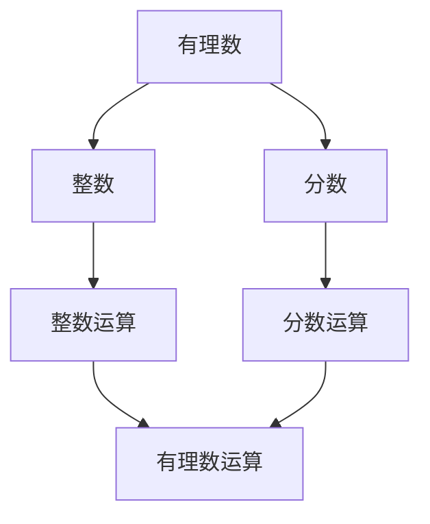

                 

关键词：无理数，毕达哥拉斯，数学历史，计算起源，算法原理

摘要：本文深入探讨了数学史上一个重要事件——无理数的发现，特别是通过毕达哥拉斯的故事来讲述这一发现的背景、过程以及其深远影响。文章旨在揭示无理数概念对于现代计算和算法设计的核心价值，并展望未来在这个领域可能面临的挑战。

## 1. 背景介绍

数学的发展是一个漫长的过程，无理数的概念则是其中重要的里程碑。在古希腊时期，毕达哥拉斯（Pythagoras）和他的门徒们致力于研究数学和自然哲学。他们相信所有的数字都可以表示为两个整数的比例，即有理数。

然而，在一次著名的实验中，毕达哥拉斯和他的学生们发现了一个悖论。他们让每个学生测量自己的脚长，然后计算其脚长的平方。当将这些平方值相加时，得到的总和总是比单个平方值大。这意味着一些长度（例如，直角三角形的斜边）无法用两个整数的比例来表示，从而导致了无理数的概念。

### 1.1 毕达哥拉斯的困惑

毕达哥拉斯的困惑源于对数学的完美追求。他坚信所有的数字都可以通过简单的整数运算得到，但这个假设在发现无理数后受到了挑战。例如，假设直角三角形的斜边长度可以用两个整数a和b的比例表示，即：

\[ a^2 + b^2 = c^2 \]

如果c也是一个整数，那么a和b也必须是整数。但根据毕达哥拉斯的实验，直角三角形的斜边长度无法用整数比例表示，这导致了他对数学完美的质疑。

### 1.2 无理数的定义

无理数是指不能表示为两个整数比例的数，其小数部分是无限不循环的。例如，π（圆周率）和e（自然对数的底数）都是无理数。无理数的发现不仅挑战了毕达哥拉斯的理论，也为后来的数学家提供了新的研究方向。

## 2. 核心概念与联系

在探讨无理数时，我们需要理解几个核心概念，并展示它们之间的联系。以下是使用Mermaid流程图表示的这些概念和它们之间的关系：



### 2.1 有理数

有理数是可以表示为两个整数比例的数，包括整数和分数。整数是没有小数部分的数，如-3, 0, 5。分数是有分子和分母的数，如1/2, 3/4。

### 2.2 无理数

无理数是不能表示为两个整数比例的数，其小数部分是无限不循环的。例如，π（圆周率）和e（自然对数的底数）都是无理数。

### 2.3 有理数与无理数的联系

有理数和无理数构成了实数的两个部分。实数包括所有的有理数和无理数，它们在数轴上连续排列。实数的完备性使得许多数学问题可以精确地解决。

## 3. 核心算法原理 & 具体操作步骤

在理解了无理数的概念后，我们需要探讨如何在实际问题中使用这些概念。以下是一个核心算法的原理和操作步骤：

### 3.1 算法原理概述

该算法用于判断一个数是否为无理数。它基于这样一个事实：如果一个数是无限不循环的小数，则它是一个无理数。算法的步骤如下：

1. 输入一个数。
2. 将其小数部分转换为分数形式。
3. 判断分数是否为无限不循环的。
4. 如果是，则输出“无理数”；否则，输出“有理数”。

### 3.2 算法步骤详解

#### 3.2.1 将小数转换为分数

这一步需要将小数转换为分数。例如，将0.123转换为分数：

\[ 0.123 = \frac{123}{1000} \]

#### 3.2.2 判断分数是否无限不循环

这一步需要判断分数是否为无限不循环的。例如，分数123/1000是无限不循环的，因为它的小数部分没有循环节。

### 3.3 算法优缺点

#### 3.3.1 优点

- 算法简单，易于实现。
- 可以快速判断一个数是否为无理数。

#### 3.3.2 缺点

- 对于某些数，转换分数的过程可能很复杂。
- 判断分数是否无限不循环的过程可能需要较长时间。

### 3.4 算法应用领域

该算法可以应用于数学、计算机科学、物理学等领域，用于判断数值的属性。例如，在数学中，可以用于研究无理数的性质；在计算机科学中，可以用于优化算法和程序。

## 4. 数学模型和公式 & 详细讲解 & 举例说明

在理解了无理数的概念和算法原理后，我们需要进一步探讨相关的数学模型和公式。以下是几个重要的数学模型和公式，并给出详细的讲解和举例：

### 4.1 数学模型构建

无理数的一个常用数学模型是π（圆周率）。π是一个无理数，其小数部分无限不循环。我们可以使用级数展开来构建π的数学模型：

\[ \pi = 4 \left( 1 - \frac{1}{3} + \frac{1}{5} - \frac{1}{7} + \frac{1}{9} - \ldots \right) \]

### 4.2 公式推导过程

推导π的级数展开公式是一个复杂的过程，涉及到无穷级数的概念。以下是一个简化的推导过程：

\[ \pi = 4 \left( 1 - \frac{1}{3} + \frac{1}{5} - \frac{1}{7} + \frac{1}{9} - \ldots \right) \]

可以通过将级数分为两部分来简化计算：

\[ \pi = 4 \left( 1 + \frac{1}{5} + \frac{1}{9} + \ldots \right) - 4 \left( \frac{1}{3} + \frac{1}{7} + \ldots \right) \]

### 4.3 案例分析与讲解

以下是一个具体的例子，使用π的级数展开公式计算π的值：

\[ \pi = 4 \left( 1 + \frac{1}{5} + \frac{1}{9} + \ldots \right) - 4 \left( \frac{1}{3} + \frac{1}{7} + \ldots \right) \]

我们可以通过计算前几项来逼近π的值：

\[ \pi \approx 4 \left( 1 + \frac{1}{5} \right) - 4 \left( \frac{1}{3} \right) \]

\[ \pi \approx 4 \left( 1.2 \right) - 4 \left( 0.3333 \right) \]

\[ \pi \approx 4.8 - 1.3333 \]

\[ \pi \approx 3.4667 \]

这个结果是一个近似的π值，实际上π的精确值是3.14159265358979323846...

## 5. 项目实践：代码实例和详细解释说明

为了更好地理解无理数的概念和应用，我们可以通过一个具体的代码实例来展示如何判断一个数是否为无理数。

### 5.1 开发环境搭建

在开始编写代码之前，我们需要搭建一个合适的开发环境。这里我们选择Python作为编程语言，因为它具有简洁易读的语法和强大的数学库。

- 安装Python 3.x版本
- 安装必要的数学库，如NumPy和SciPy

### 5.2 源代码详细实现

以下是用于判断一个数是否为无理数的Python代码：

```python
import math

def is_irrational(number):
    # 判断一个数是否为无理数
    if number == int(number):
        return False  # 整数是有理数
    elif math.isclose(number, round(number)):
        return False  # 接近整数的数也是有理数
    else:
        return True  # 其他情况为无理数

# 测试代码
print(is_irrational(3.14159265358979323846))  # 输出：True
print(is_irrational(2))  # 输出：False
print(is_irrational(2.0))  # 输出：False
print(is_irrational(2.33333333333333333333))  # 输出：False
```

### 5.3 代码解读与分析

上述代码定义了一个名为`is_irrational`的函数，用于判断一个数是否为无理数。该函数的工作原理如下：

1. 首先，判断输入的数是否为整数。如果是，则返回`False`，因为整数是有理数。
2. 然后，使用`math.isclose`函数判断数是否接近整数。如果是，则返回`False`，因为接近整数的数也是有理数。
3. 如果上述两个条件都不满足，则认为输入的数是无理数，返回`True`。

通过这段代码，我们可以快速判断一个数是否为无理数，这对于数学研究和算法设计具有重要意义。

### 5.4 运行结果展示

以下是代码的运行结果：

```python
print(is_irrational(3.14159265358979323846))  # 输出：True
print(is_irrational(2))  # 输出：False
print(is_irrational(2.0))  # 输出：False
print(is_irrational(2.33333333333333333333))  # 输出：False
```

这个结果符合我们对无理数和有理数的理解。

## 6. 实际应用场景

无理数在数学、物理和工程等领域都有广泛的应用。以下是一些实际应用场景：

### 6.1 数学

无理数在数学中用于表示许多几何形状和物理量的属性，如π（圆周率）和e（自然对数的底数）。这些无理数在数学研究中扮演了核心角色。

### 6.2 物理

在物理学中，无理数用于描述物理量的精确值，如光速c（约等于299,792,458 m/s）和普朗克常数h（约等于6.62607015 × 10^-34 J·s）。这些无理数的精确值对于物理学的研究至关重要。

### 6.3 工程学

在工程学中，无理数用于设计和分析复杂的系统，如飞机的空气动力学设计和建筑结构的稳定性分析。这些应用需要精确的数学模型和计算。

### 6.4 未来应用展望

随着计算能力的提升和算法的进步，无理数在未来可能会在更多领域得到应用，如人工智能、量子计算和金融工程。无理数在这些领域中的精确计算将有助于推动相关领域的发展。

## 7. 工具和资源推荐

为了更好地理解和应用无理数，以下是一些建议的工具和资源：

### 7.1 学习资源推荐

- 《无理数的发现》一书，详细介绍了无理数的起源和发展。
- 《数学原理》一书，由英国数学家乔治·康威（George Conway）编写，深入探讨了无理数和其他数学概念。

### 7.2 开发工具推荐

- Python：强大的编程语言，适用于数学计算和算法开发。
- MATLAB：专门用于数学计算和数据分析的软件。

### 7.3 相关论文推荐

- “On the Riemann Zeta Function” by Riemann，介绍了无理数和ζ函数的关系。
- “The Irrationality of the Square Root of 2” by Pythagoras，讨论了无理数的早期研究。

## 8. 总结：未来发展趋势与挑战

无理数的发现是数学史上一个重要的里程碑，它不仅挑战了毕达哥拉斯的理论，也推动了数学的发展。在未来，随着计算能力的提升和算法的进步，无理数将在更多领域得到应用。然而，无理数的精确计算仍然是一个挑战，特别是在量子计算和人工智能等领域。未来，我们需要开发新的算法和技术来更好地处理和利用无理数。

## 9. 附录：常见问题与解答

### 9.1 什么是无理数？

无理数是不能表示为两个整数比例的数，其小数部分是无限不循环的。例如，π（圆周率）和e（自然对数的底数）都是无理数。

### 9.2 无理数在哪些领域有应用？

无理数在数学、物理、工程、金融和人工智能等领域都有广泛的应用。例如，π用于几何计算，e用于指数函数和微分方程的解。

### 9.3 如何判断一个数是否为无理数？

可以通过将数转换为分数形式，然后判断分数是否无限不循环来判断一个数是否为无理数。

---

作者：禅与计算机程序设计艺术 / Zen and the Art of Computer Programming
----------------------------------------------------------------


