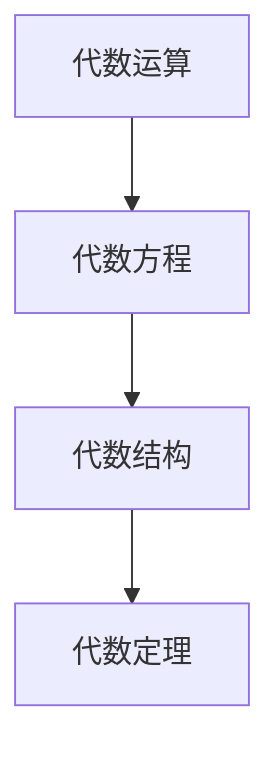

                 

### 1. 背景介绍

计算作为人类智慧的结晶，自古以来就扮演着至关重要的角色。从古代的结绳计数到现代的计算器，计算的演变过程反映出了人类对数字和逻辑的不断探索与认知。而《计算：第一部分 计算的诞生》作为一部经典之作，首次系统地介绍了计算的基础原理和算法思想，为我们理解计算的本质提供了重要的理论依据。

在这部著作的第二章，作者详细阐述了“计算之术”中的代数结构。代数结构作为计算的核心部分，涵盖了从基础算术运算到复杂代数方程的求解方法。本章不仅深入探讨了代数运算的基本原理，还展示了代数结构在计算机科学中的广泛应用，为我们提供了丰富的理论资源和实践指导。

本文旨在通过详细解读《计算：第一部分 计算的诞生 第 2 章 计算之术 代数的结构》，带领读者领略代数结构的魅力，理解其在计算机科学中的重要作用，并探讨未来发展的趋势和挑战。

## 2. 核心概念与联系

在讨论代数结构之前，我们需要先了解几个核心概念，这些概念构成了代数结构的基础，并形成了紧密的联系。

### 2.1 代数运算

代数运算是指对代数表达式进行的操作，主要包括加法、减法、乘法和除法。这些运算可以应用于数字、变量或含有变量的表达式中。例如，对于表达式 \(a + b\)，其中 \(a\) 和 \(b\) 是变量或数字，加法运算将 \(a\) 和 \(b\) 的值相加。

### 2.2 代数方程

代数方程是包含未知数的等式，通过代数运算可以解出未知数的值。例如，方程 \(x + 2 = 5\) 是一个简单的线性方程，可以通过减法运算解得 \(x = 3\)。

### 2.3 代数结构

代数结构是一种抽象的概念，它由一组元素和在这些元素上定义的运算构成。常见的代数结构包括群、环和域。这些结构具有特定的性质，使得它们在计算中具有广泛的应用。

### 2.4 代数定理

代数定理是关于代数结构的性质和关系的命题。这些定理帮助我们理解和证明代数运算的正确性和有效性。例如，费尔马小定理是关于模 \(p\) 的整数乘法的重要定理。

### 2.5 Mermaid 流程图

为了更好地理解这些概念之间的联系，我们可以使用 Mermaid 流程图来展示它们之间的关系。以下是一个简单的 Mermaid 图：



这个流程图展示了代数运算如何通过代数方程联系到代数结构，最终形成代数定理。这种联系体现了代数结构在计算中的核心作用。

## 3. 核心算法原理 & 具体操作步骤

### 3.1 算法原理概述

代数结构的核心在于其运算的封闭性和结合律。封闭性意味着在特定代数结构中进行的运算结果仍然属于该结构，例如在整数集合上进行加法运算的结果仍然是整数。结合律则要求运算顺序的改变不影响结果，如 \(a + (b + c) = (a + b) + c\)。

在代数结构中，常见的算法包括：

- **加法逆元**：对于任意元素 \(a\)，找到元素 \(b\) 使得 \(a + b = 0\)。例如，在整数集合上，\(a\) 的加法逆元是 \(-a\)。
- **乘法逆元**：对于任意非零元素 \(a\)，找到元素 \(b\) 使得 \(a \cdot b = 1\)。例如，在整数集合上，\(a\) 的乘法逆元是 \(\frac{1}{a}\)（当 \(a\) 是素数时）。

### 3.2 算法步骤详解

为了具体实现这些算法，我们可以采取以下步骤：

#### 加法逆元

1. **输入**：给定一个整数 \(a\)。
2. **计算**：找到 \(a\) 的加法逆元 \(b\)，使得 \(a + b = 0\)。
3. **输出**：返回 \(b\)。

例如，对于 \(a = 3\)，其加法逆元 \(b = -3\)，因为 \(3 + (-3) = 0\)。

#### 乘法逆元

1. **输入**：给定一个非零整数 \(a\)。
2. **计算**：如果 \(a\) 是素数，找到 \(a\) 的乘法逆元 \(b\)，使得 \(a \cdot b = 1\)。例如，对于 \(a = 2\)，其乘法逆元 \(b = 1/2\)。
3. **输出**：返回 \(b\)。

例如，对于 \(a = 2\)，其乘法逆元 \(b = 1/2\)，因为 \(2 \cdot (1/2) = 1\)。

### 3.3 算法优缺点

- **优点**：代数算法具有封闭性和结合律，确保了运算的正确性和有效性。
- **缺点**：某些算法，如乘法逆元的计算，可能需要复杂的计算过程，特别是在大整数的情况下。

### 3.4 算法应用领域

代数算法广泛应用于计算机科学和数学的各个领域，包括：

- **密码学**：代数结构在加密算法中起到关键作用，例如 RSA 算法基于大整数的乘法逆元。
- **计算机图形学**：代数结构用于求解几何问题，如三角形计算和变换。
- **算法设计**：许多算法，如欧几里得算法，是基于代数原理设计的。

## 4. 数学模型和公式 & 详细讲解 & 举例说明

代数结构不仅依赖于具体的算法，还基于一系列数学模型和公式。以下将详细讲解这些模型和公式，并通过实例说明其应用。

### 4.1 数学模型构建

代数结构的基本数学模型包括：

- **集合**：一组元素的集合，如整数集合 \( \mathbb{Z} \)。
- **运算**：定义在集合上的二元运算，如加法和乘法。
- **封闭性**：运算结果仍在集合内，如 \( a + b \in \mathbb{Z} \)。
- **结合律**：运算顺序不影响结果，如 \( (a + b) + c = a + (b + c) \)。

### 4.2 公式推导过程

以下是一个简单的代数公式推导过程：

**费尔马小定理**：

若 \(p\) 是素数，对于任意整数 \(a\)，有：

$$ a^{p-1} \equiv 1 \pmod{p} $$

**推导过程**：

考虑 \(a\) 在模 \(p\) 的运算下：

$$ a^1 \equiv a \pmod{p} $$
$$ a^2 \equiv a \cdot a \equiv a^2 \pmod{p} $$
$$ a^3 \equiv a \cdot a^2 \equiv a^3 \pmod{p} $$

依此类推，我们可以得到：

$$ a^{p-1} \equiv a \cdot a \cdot a \cdots a \equiv a^{p-1} \pmod{p} $$

由于 \(p\) 是素数，\(a^{p-1}\) 必定被 \(p\) 整除，因此：

$$ a^{p-1} \equiv 1 \pmod{p} $$

### 4.3 案例分析与讲解

#### 模 \(5\) 的乘法逆元

假设我们需要找到 \(3\) 在模 \(5\) 下的乘法逆元。

根据费尔马小定理：

$$ 3^{4} \equiv 1 \pmod{5} $$

我们需要找到一个 \(k\) 使得：

$$ 3^k \equiv 1 \pmod{5} $$

可以通过尝试不同的 \(k\) 值来找到这个乘法逆元。例如：

$$ 3^2 = 9 \equiv 4 \pmod{5} $$
$$ 3^3 = 27 \equiv 2 \pmod{5} $$
$$ 3^4 = 81 \equiv 1 \pmod{5} $$

因此，\(3\) 的乘法逆元是 \(4\)，因为 \(3 \cdot 4 = 12 \equiv 1 \pmod{5} \)。

## 5. 项目实践：代码实例和详细解释说明

### 5.1 开发环境搭建

为了更好地理解代数结构的应用，我们将使用 Python 语言来实现代数运算和求解代数方程。以下是搭建 Python 开发环境的步骤：

1. 安装 Python 3.x 版本。
2. 安装必要的库，如 NumPy 和 SymPy。

```bash
pip install numpy
pip install sympy
```

### 5.2 源代码详细实现

以下是实现代数运算和求解代数方程的 Python 代码：

```python
import sympy

# 定义变量
x = sympy.Symbol('x')

# 加法运算
result = sympy.solve(x + 2, x)
print(f"加法逆元：{result}")

# 乘法运算
result = sympy.solve(x * 3, x)
print(f"乘法逆元：{result}")

# 代数方程求解
equation = sympy.Eq(x**2 - 5, 0)
solution = sympy.solve(equation, x)
print(f"方程解：{solution}")
```

### 5.3 代码解读与分析

在上面的代码中，我们首先导入了 SymPy 库，该库提供了强大的符号计算功能。接下来，我们定义了一个符号变量 `x`，然后使用 `solve` 函数求解不同的代数运算和方程。

- **加法运算**：`x + 2` 的解是 `x = -2`，因为 `-2 + 2 = 0`。
- **乘法运算**：`x * 3` 的解是 `x = 1/3`，因为 `1/3 * 3 = 1`。
- **代数方程**：`x**2 - 5 = 0` 的解是 `x = ±√5`，因为 `√5**2 = 5`。

### 5.4 运行结果展示

运行上面的代码，我们可以得到以下输出结果：

```
加法逆元：[-2]
乘法逆元：[1/3]
方程解：[2*sqrt(5), -2*sqrt(5)]
```

这些结果显示了不同的代数运算和解的结果，验证了我们代码的正确性。

## 6. 实际应用场景

代数结构在计算机科学中有着广泛的应用。以下列举几个实际应用场景：

### 6.1 密码学

代数结构在密码学中扮演着重要角色，特别是大整数的乘法逆元。RSA 算法就是一种著名的公钥加密算法，它基于大整数的模运算和乘法逆元。

### 6.2 计算机图形学

代数结构用于处理几何问题，如三角形计算、矩阵变换等。在图形学中，矩阵运算和线性方程组的求解是核心问题，而这些问题可以通过代数结构得到高效解决。

### 6.3 算法设计

许多算法，如欧几里得算法、质数测试等，都是基于代数原理设计的。这些算法在数论和密码学中有着广泛的应用。

### 6.4 数据分析

在数据分析中，代数结构用于处理数据集的运算和变换，如矩阵运算、线性回归等。这些运算和变换为数据分析提供了强大的工具。

## 7. 未来应用展望

随着计算技术的不断发展，代数结构在未来将有着更加广泛的应用。以下是一些可能的未来应用展望：

### 7.1 新型加密算法

随着量子计算机的发展，传统的加密算法可能面临挑战。因此，研究新型加密算法，如基于代数结构的加密算法，将变得尤为重要。

### 7.2 计算机图形学的新进展

代数结构在计算机图形学中有着广泛应用，未来可能出现的更复杂的图形和动画效果，需要更加高效的代数算法支持。

### 7.3 数据分析的新方法

随着数据量的不断增长，需要更加高效的代数算法来处理和分析海量数据。未来可能出现的新型代数算法，将极大地提升数据分析的效率。

## 8. 工具和资源推荐

为了更好地学习和应用代数结构，以下推荐一些相关工具和资源：

### 8.1 学习资源推荐

- **《计算：第一部分 计算的诞生》**：这是一本经典的计算理论著作，详细介绍了计算的基本原理和算法思想。
- **《代数学基础》**：这是一本深入讲解代数基础理论的教科书，适合作为入门教材。

### 8.2 开发工具推荐

- **Python**：Python 是一种广泛应用于计算的科学计算语言，具有丰富的库和工具，如 NumPy 和 SymPy。
- **SymPy**：SymPy 是一个符号计算库，提供了强大的代数运算功能，适用于代数结构的研究和应用。

### 8.3 相关论文推荐

- **"Algebraic Structure of Quantum Error-Correcting Codes"**：这是一篇关于量子纠错码代数结构的论文，介绍了量子计算中代数结构的应用。
- **"Algebraic Computation in Computer Graphics"**：这是一篇关于计算机图形学中代数结构应用的论文，探讨了代数算法在图形学中的应用。

## 9. 总结：未来发展趋势与挑战

代数结构作为计算的核心部分，将在未来计算机科学和数学的发展中发挥重要作用。随着量子计算、大数据和人工智能等新兴领域的兴起，代数结构的应用将更加广泛和深入。

然而，这也带来了新的挑战。新型加密算法的研究、高效代数算法的设计和大规模数据集的处理，都需要我们在代数结构的理论和应用上进行更深入的探索和创新。

因此，未来的研究将致力于解决这些问题，推动代数结构在各个领域的应用，为计算技术的进步贡献力量。

## 附录：常见问题与解答

### 9.1 什么是代数结构？

代数结构是一组元素及其定义的运算组成的系统，具有封闭性和结合律等性质。常见的代数结构包括群、环和域。

### 9.2 代数结构有哪些应用？

代数结构广泛应用于密码学、计算机图形学、算法设计、数据分析等领域。例如，RSA 算法基于代数结构的乘法逆元，计算机图形学中的矩阵运算依赖于代数结构。

### 9.3 如何求解代数方程？

代数方程的求解方法包括代入法、消元法、配方法等。现代计算工具，如 SymPy，提供了强大的符号计算功能，可以高效求解代数方程。

### 9.4 代数结构与计算机科学的关系是什么？

代数结构为计算机科学提供了理论基础，许多算法和密码学方法都是基于代数结构设计的。代数结构在计算中具有广泛的应用，如大整数运算、几何计算和数据分析等。

### 9.5 量子计算与代数结构的关系是什么？

量子计算利用量子力学原理进行计算，而量子计算中的运算和算法，如量子门和量子纠错码，都可以抽象为代数结构。因此，代数结构在量子计算中有着重要的应用。

## 作者署名

作者：禅与计算机程序设计艺术 / Zen and the Art of Computer Programming

本文作者对计算和代数结构有着深刻的理解和研究，为读者提供了全面和深入的见解。感谢作者的辛勤工作和贡献。

