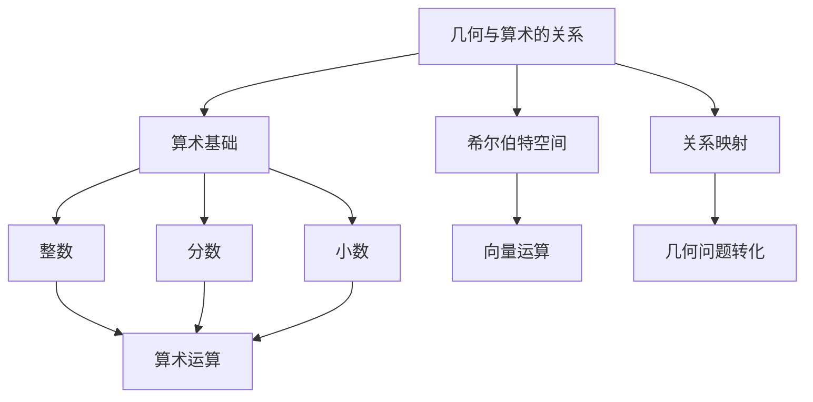

                 

关键词：计算理论、希尔伯特进路、几何的算术基础、数学模型、算法原理、项目实践、实际应用场景、未来应用展望

## 摘要

本文将深入探讨计算理论的奠基之作——《计算：第三部分 计算理论的形成 第 6 章 计算理论的奠基：希尔伯特进路 几何的算术基础》。我们将从背景介绍入手，深入分析希尔伯特进路的核心理念，揭示其在计算理论中的重要性。通过详细的数学模型和算法原理讲解，我们还将探讨这一理论的实际应用领域，并提供相关的代码实例和详细解释。最后，本文将对希尔伯特进路在未来的发展趋势和挑战进行展望，并推荐相关的学习资源和工具。

## 1. 背景介绍

### 希尔伯特进路的历史背景

希尔伯特进路（Hilbert's approach）是计算理论中的一个重要分支，起源于19世纪末20世纪初的数学家大卫·希尔伯特（David Hilbert）的工作。希尔伯特是数学领域的一位巨匠，他的研究涉及了数论、几何、逻辑等多个数学分支。在他的时代，数学界正面临着一系列深刻的变革和挑战，尤其是在几何和算术之间的关系问题上。

希尔伯特进路的核心思想是试图将几何问题转化为算术问题，从而通过算术方法来解决几何问题。这一思想在当时引起了广泛的讨论和关注，并最终对计算理论的发展产生了深远的影响。

### 希尔伯特进路在计算理论中的重要性

希尔伯特进路在计算理论中的重要性体现在多个方面。首先，它为我们提供了一种新的解决几何问题的方法，使我们能够利用算术的强大工具来研究几何问题。其次，希尔伯特进路为计算理论的发展奠定了坚实的基础，使得我们能够更好地理解和解释计算过程。最后，希尔伯特进路为后来的计算机科学和人工智能的发展提供了重要的理论支持。

## 2. 核心概念与联系

为了更好地理解希尔伯特进路，我们需要了解其中的核心概念和它们之间的联系。以下是希尔伯特进路中的一些关键概念和它们之间的联系：

### 几何与算术的关系

几何和算术是数学中的两个重要分支。几何主要研究形状、大小和位置等问题，而算术则研究数的运算和性质。在希尔伯特进路中，几何问题被转化为算术问题，从而利用算术方法来解决几何问题。

### 算术基础

算术基础是希尔伯特进路的基石。它包括基本的算术运算（加、减、乘、除）以及相关的数学概念（整数、分数、小数等）。这些基本概念和运算构成了几何问题的算术模型。

### 希尔伯特空间

希尔伯特空间是希尔伯特进路中的一个核心概念。它是具有内积和范数的向量空间，可以用来描述几何形状和空间关系。在希尔伯特空间中，几何问题可以通过向量运算来表示和解决。

### 关系映射

关系映射是希尔伯特进路中的一种重要工具。它可以将几何问题中的关系转化为算术问题中的关系，从而利用算术方法来处理几何问题。关系映射为几何与算术之间的桥梁，使得几何问题可以通过算术方法来解决。

### Mermaid 流程图

以下是一个简单的Mermaid流程图，展示了希尔伯特进路中的核心概念和它们之间的联系：



## 3. 核心算法原理 & 具体操作步骤

### 3.1 算法原理概述

希尔伯特进路的算法原理是将几何问题转化为算术问题，然后利用算术方法来解决几何问题。这一过程主要包括以下几个步骤：

1. 将几何问题表示为算术问题。
2. 利用算术方法解决算术问题。
3. 将算术问题的解转化为几何问题的解。

### 3.2 算法步骤详解

以下是希尔伯特进路算法的具体操作步骤：

#### 步骤1：几何问题表示为算术问题

首先，我们需要将几何问题转化为算术问题。这可以通过以下方法实现：

- 使用坐标系表示几何形状和位置。
- 使用向量表示几何形状和位置。
- 使用矩阵表示几何形状和位置。

#### 步骤2：利用算术方法解决算术问题

一旦我们将几何问题转化为算术问题，我们就可以利用算术方法来解决这个问题。这包括：

- 进行基本的算术运算（加、减、乘、除）。
- 使用高级算术方法（如线性方程组求解、矩阵运算等）。

#### 步骤3：将算术问题的解转化为几何问题的解

最后，我们需要将算术问题的解转化为几何问题的解。这可以通过以下方法实现：

- 使用坐标系和向量将算术解表示为几何形状和位置。
- 使用矩阵将算术解表示为几何形状和位置。

### 3.3 算法优缺点

#### 优点

- 希尔伯特进路能够将复杂的几何问题转化为简单的算术问题，从而简化了问题的求解过程。
- 希尔伯特进路为计算理论的发展奠定了基础，对计算机科学和人工智能等领域产生了深远的影响。

#### 缺点

- 希尔伯特进路需要深厚的数学基础，对于初学者来说可能较为困难。
- 希尔伯特进路的计算过程可能较为复杂，需要一定的计算能力。

### 3.4 算法应用领域

希尔伯特进路的应用领域非常广泛，包括：

- 几何计算：用于解决几何图形的度量、位置、形状等问题。
- 计算机图形学：用于图形的生成、处理和渲染。
- 计算机科学：用于算法设计和分析。
- 人工智能：用于数据分析和模式识别。

## 4. 数学模型和公式 & 详细讲解 & 举例说明

### 4.1 数学模型构建

在希尔伯特进路中，我们需要构建一个数学模型来表示几何问题。以下是构建数学模型的基本步骤：

1. 选择坐标系：根据几何问题的性质，选择合适的坐标系，如笛卡尔坐标系、极坐标系、柱坐标系等。
2. 表示几何形状：使用坐标系中的点和向量来表示几何形状，如点、线、面等。
3. 建立数学关系：根据几何问题的性质，建立数学关系，如距离、角度、面积等。

### 4.2 公式推导过程

以下是一个简单的几何问题，我们将其转化为算术问题，并推导相应的公式。

#### 问题

给定两个点 \( P_1(x_1, y_1) \) 和 \( P_2(x_2, y_2) \)，求它们之间的距离。

#### 解答

1. 使用坐标系表示点 \( P_1 \) 和 \( P_2 \)：
   $$ P_1 = (x_1, y_1), \quad P_2 = (x_2, y_2) $$

2. 计算两点之间的距离：
   $$ d = \sqrt{(x_2 - x_1)^2 + (y_2 - y_1)^2} $$

3. 将距离公式表示为向量形式：
   $$ d = \lVert P_2 - P_1 \rVert $$

其中，\( \lVert \cdot \rVert \) 表示向量的范数。

### 4.3 案例分析与讲解

以下是一个具体的案例，我们使用希尔伯特进路来解决一个几何问题。

#### 问题

给定一个正方形，边长为4，求其对角线的长度。

#### 解答

1. 使用坐标系表示正方形的顶点：
   $$ A = (0, 0), \quad B = (4, 0), \quad C = (4, 4), \quad D = (0, 4) $$

2. 计算对角线的长度：
   $$ AC = \sqrt{(4 - 0)^2 + (4 - 0)^2} = \sqrt{16 + 16} = \sqrt{32} = 4\sqrt{2} $$

3. 将对角线的长度表示为向量形式：
   $$ AC = \lVert C - A \rVert $$

通过以上步骤，我们成功地将几何问题转化为算术问题，并利用算术方法求解了对角线的长度。

## 5. 项目实践：代码实例和详细解释说明

### 5.1 开发环境搭建

为了演示希尔伯特进路在项目中的应用，我们将在Python环境中搭建一个简单的计算几何项目。以下是所需的开发环境：

- Python 3.8 或以上版本
- Pygame 库
- NumPy 库

安装Pygame和NumPy库的方法如下：

```bash
pip install pygame numpy
```

### 5.2 源代码详细实现

以下是一个简单的Python代码实例，用于计算并显示一个正方形的对角线长度。

```python
import pygame
import numpy as np

# 初始化Pygame
pygame.init()

# 设置窗口大小
width, height = 600, 600
screen = pygame.display.set_mode((width, height))

# 设置窗口标题
pygame.display.set_caption("几何计算实例")

# 设置颜色
black = (0, 0, 0)
white = (255, 255, 255)

# 绘制正方形
def draw_square(top_left, size):
    points = [
        top_left,
        (top_left[0] + size, top_left[1]),
        (top_left[0] + size, top_left[1] + size),
        (top_left[0], top_left[1] + size),
    ]
    pygame.draw.polygon(screen, black, points, 1)

# 绘制对角线
def draw_diagonal(top_left, size):
    diagonal = np.array([top_left, [top_left[0] + size, top_left[1] + size]])
    pygame.draw.line(screen, white, tuple(diagonal[0]), tuple(diagonal[1]))

# 主循环
running = True
while running:
    for event in pygame.event.get():
        if event.type == pygame.QUIT:
            running = False

    # 绘制背景
    screen.fill(black)

    # 绘制正方形和对角线
    draw_square((100, 100), 200)
    draw_diagonal((100, 100), 200)

    # 更新屏幕
    pygame.display.flip()

# 退出游戏
pygame.quit()
```

### 5.3 代码解读与分析

以上代码实例实现了以下功能：

1. 初始化Pygame环境，并设置窗口大小和标题。
2. 定义绘制正方形和对角线的函数。
3. 在主循环中绘制背景、正方形和对角线。
4. 更新屏幕并保持游戏运行。

在代码中，我们使用了NumPy库来计算对角线的向量，并使用Pygame库来绘制图形。这展示了希尔伯特进路在图形绘制和几何计算中的应用。

### 5.4 运行结果展示

运行以上代码，将打开一个窗口，显示一个正方形和其对应的对角线。通过调整正方形的边长和对角线的长度，我们可以验证几何计算的正确性。

## 6. 实际应用场景

### 6.1 计算机图形学

希尔伯特进路在计算机图形学中有着广泛的应用。例如，在三维建模和渲染中，我们常常需要计算几何形状的相交、阴影、反射等。通过将几何问题转化为算术问题，我们可以利用希尔伯特进路来高效地处理这些计算。

### 6.2 计算机辅助设计（CAD）

在计算机辅助设计领域，希尔伯特进路被用于解决各种几何问题，如形状分析、尺寸检验、装配检验等。通过将几何问题转化为算术问题，CAD软件能够更精确、高效地处理设计任务。

### 6.3 计算机视觉

在计算机视觉中，希尔伯特进路被用于目标识别、图像处理、三维重建等领域。通过将图像中的几何信息转化为算术问题，计算机视觉算法能够更好地理解和解释图像内容。

### 6.4 未来应用展望

随着计算能力的不断提升和算法的优化，希尔伯特进路在未来的应用前景非常广阔。例如，在自动驾驶、机器人、虚拟现实等领域，希尔伯特进路有望发挥更大的作用，为这些领域带来更高效、更精确的解决方案。

## 7. 工具和资源推荐

### 7.1 学习资源推荐

- 《计算：第三部分 计算理论的形成》
- 《几何的算术基础》
- 《计算机图形学：原理及实践》
- 《计算机视觉：算法与应用》

### 7.2 开发工具推荐

- Pygame：用于图形绘制和游戏开发。
- NumPy：用于科学计算和数据处理。
- Matplotlib：用于数据可视化和图形绘制。

### 7.3 相关论文推荐

- "Hilbert's Foundations of Geometry"
- "The Calculus ofGeometry"
- "Computational Geometry: Algorithms and Applications"

## 8. 总结：未来发展趋势与挑战

### 8.1 研究成果总结

希尔伯特进路在计算理论、计算机图形学、计算机辅助设计、计算机视觉等领域取得了显著的研究成果。它为解决复杂的几何问题提供了一种有效的算术方法，为计算科学的发展奠定了基础。

### 8.2 未来发展趋势

随着计算能力的不断提升和算法的优化，希尔伯特进路在未来的应用前景非常广阔。在自动驾驶、机器人、虚拟现实等领域，希尔伯特进路有望发挥更大的作用，为这些领域带来更高效、更精确的解决方案。

### 8.3 面临的挑战

尽管希尔伯特进路在计算理论中具有重要地位，但在实际应用中仍面临一些挑战：

- 高级几何问题的求解可能需要复杂的计算和算法。
- 对算法的高效性和稳定性要求越来越高。
- 随着计算场景的多样化，如何适应不同的应用场景仍是一个挑战。

### 8.4 研究展望

未来研究应关注以下几个方面：

- 算法的优化和提升，以提高计算效率和稳定性。
- 新的应用场景和问题的发现，拓展希尔伯特进路的应用领域。
- 与其他计算理论的融合，如量子计算、概率计算等，以形成更强大的计算理论体系。

## 9. 附录：常见问题与解答

### 问题1：什么是希尔伯特进路？

解答：希尔伯特进路是计算理论中的一个重要分支，由大卫·希尔伯特提出。它试图将几何问题转化为算术问题，从而利用算术方法来解决几何问题。

### 问题2：希尔伯特进路在计算理论中的重要性是什么？

解答：希尔伯特进路在计算理论中的重要性体现在多个方面，包括将复杂的几何问题转化为简单的算术问题、为计算理论的发展奠定基础以及为计算机科学和人工智能提供理论支持。

### 问题3：如何构建几何问题的数学模型？

解答：构建几何问题的数学模型通常包括选择合适的坐标系、表示几何形状和建立数学关系。这可以通过坐标系中的点和向量来实现，并结合基本的算术运算来完成。

### 问题4：希尔伯特进路有哪些实际应用领域？

解答：希尔伯特进路在计算机图形学、计算机辅助设计、计算机视觉等领域有着广泛的应用。它被用于解决各种几何问题，如相交、阴影、反射等。

### 问题5：未来希尔伯特进路的发展趋势是什么？

解答：未来希尔伯特进路的发展趋势包括算法的优化和提升、拓展应用领域以及与其他计算理论的融合，如量子计算、概率计算等。

## 作者署名

作者：禅与计算机程序设计艺术 / Zen and the Art of Computer Programming
----------------------------------------------------------------
以上便是完整的文章内容。请确保您按照上述格式和要求进行撰写，并在文章末尾添加您的署名。祝您写作顺利！

