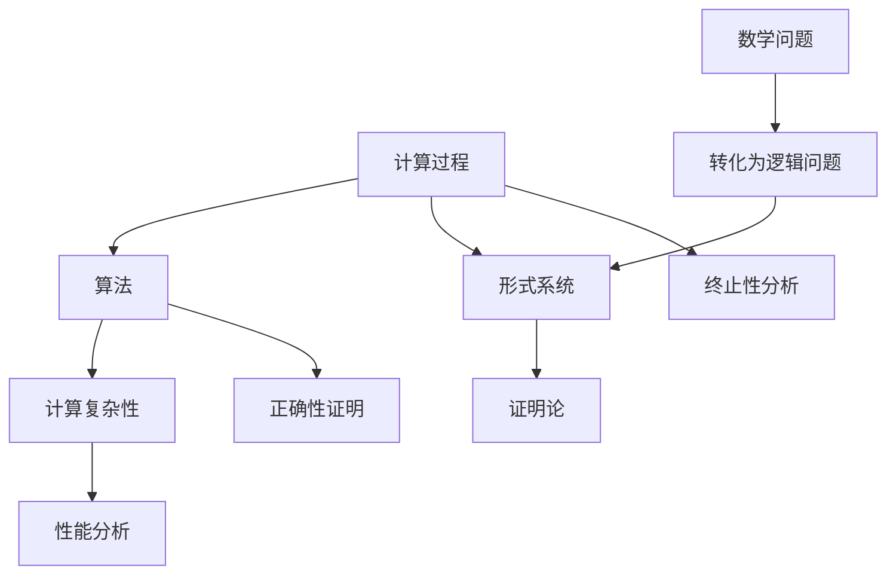

                 

## 1. 背景介绍

计算理论的形成是计算机科学发展的基础，它为计算机科学的各个方面提供了坚实的理论基础。本章将探讨计算理论的奠基过程，特别是希尔伯特进路在计算理论中的重要作用。希尔伯特进路是20世纪初由德国数学家戴维·希尔伯特提出的一种证明方法，它对于计算理论的形成和发展产生了深远的影响。

计算理论起源于对计算过程的研究，旨在探讨计算的本质及其可能性。早期的计算理论主要集中在数学和逻辑领域，主要研究形式系统和算法。希尔伯特进路作为一种证明论方法，通过将数学问题转化为逻辑问题，为计算理论的研究提供了一种新的视角和工具。

### 希尔伯特进路的起源

希尔伯特进路起源于希尔伯特在19世纪末和20世纪初对数学基础的研究。当时，数学界对于数学证明的可信度和一致性存在严重的质疑，这些问题催生了形式主义和证明论的兴起。希尔伯特认为，数学证明应该基于严格的形式系统，通过逻辑推理来证明数学命题的真实性。

希尔伯特提出了有穷主义证明论的观点，即认为数学证明应该是有穷的步骤序列，而不是无穷的过程。这一观点对计算理论的形成具有重要意义，因为它为计算过程提供了一种可操作的方法。通过将数学问题转化为逻辑问题，并使用希尔伯特进路进行证明，可以更好地理解计算的本质和限制。

### 计算理论的发展

计算理论的研究始于对计算过程的研究，特别是对算法和计算复杂性进行分析。早期的计算理论主要关注可计算函数和算法的复杂性，以及计算过程的可行性。这些研究为计算机科学的发展奠定了基础。

随着计算机科学的不断发展，计算理论的研究领域也在不断扩展。现在，计算理论的研究不仅仅局限于数学和逻辑，还涉及计算机体系结构、编程语言、人工智能、算法优化等领域。计算理论的研究成果不仅对计算机科学的发展产生了深远的影响，也为其他领域提供了重要的理论基础。

### 希尔伯特进路在计算理论中的应用

希尔伯特进路在计算理论中的应用主要体现在两个方面：一是用于证明数学命题的真实性，二是用于分析计算过程的有效性。

首先，希尔伯特进路可以用于证明数学命题的真实性。通过将数学问题转化为逻辑问题，并使用希尔伯特进路进行证明，可以确保数学证明的严格性和一致性。这种方法对于建立计算理论的基础具有重要意义。

其次，希尔伯特进路可以用于分析计算过程的有效性。通过将计算过程转化为逻辑推理的过程，可以更好地理解计算的本质和限制。例如，希尔伯特进路可以用于证明某些计算过程是不可行的，或者寻找更高效的计算方法。这些研究成果对于计算机科学的发展产生了深远的影响。

### 本章内容安排

本章将分为以下几个部分进行讨论：

1. **背景介绍**：介绍计算理论的形成和希尔伯特进路的起源。

2. **核心概念与联系**：详细解释计算理论的核心概念，并使用Mermaid流程图展示其架构和原理。

3. **核心算法原理 & 具体操作步骤**：介绍计算理论中的核心算法，包括原理概述、步骤详解、优缺点分析和应用领域。

4. **数学模型和公式 & 详细讲解 & 举例说明**：构建计算理论的数学模型，推导相关公式，并通过案例进行分析和讲解。

5. **项目实践：代码实例和详细解释说明**：提供具体的代码实例，并对其进行详细解读和分析。

6. **实际应用场景**：探讨计算理论在实际应用中的场景，以及未来的应用展望。

7. **工具和资源推荐**：推荐相关的学习资源、开发工具和相关论文。

8. **总结：未来发展趋势与挑战**：总结计算理论的研究成果，探讨未来的发展趋势和面临的挑战。

9. **附录：常见问题与解答**：回答读者可能遇到的一些常见问题。

通过本章的讨论，我们希望能够对计算理论的形成和希尔伯特进路的应用有更深入的理解，为读者在计算理论的研究和应用中提供有益的参考。

---

## 2. 核心概念与联系

### 2.1 核心概念

在计算理论中，有以下几个核心概念需要理解：

1. **计算过程**：计算过程是指对输入进行操作，并产生输出的过程。它可以是一个函数，也可以是一个算法。

2. **算法**：算法是指解决问题的步骤序列，它具有确定性、有效性和终止性。算法可以用于各种计算过程，是实现计算的核心。

3. **计算复杂性**：计算复杂性是指算法在运行过程中所需的资源，如时间复杂度和空间复杂度。计算复杂性的分析是计算理论中的重要内容。

4. **形式系统**：形式系统是指用于表示和证明数学命题的数学系统，它包括符号、公理和推导规则。

5. **证明论**：证明论是研究数学证明的性质和方法的数学分支。它为计算理论提供了证明方法和工具。

### 2.2 核心概念的联系

这些核心概念之间存在着紧密的联系：

- **计算过程**和**算法**是计算理论的基础。计算过程描述了计算的步骤，而算法则是实现计算过程的方法。

- **计算复杂性**反映了算法的性能，它有助于我们理解和比较不同算法的效率。

- **形式系统**和**证明论**为计算理论提供了证明方法和工具，使我们能够更严格地分析和验证算法的正确性和性能。

### 2.3 Mermaid流程图

为了更好地理解这些核心概念的联系，我们使用Mermaid流程图进行展示：



这个流程图展示了计算过程、算法、计算复杂性和形式系统之间的联系。通过将数学问题转化为逻辑问题，并使用形式系统和证明论进行证明，我们可以更深入地理解计算理论。

---

## 3. 核心算法原理 & 具体操作步骤

### 3.1 算法原理概述

在计算理论中，有几种核心算法，其中最著名的是**希尔伯特-波斯特算法**。该算法主要用于证明数学命题的正确性。其基本原理是基于逻辑推理和形式系统，通过逐步推导，最终证明命题的真实性。

### 3.2 算法步骤详解

**希尔伯特-波斯特算法**的步骤如下：

1. **定义形式系统**：选择一个适当的逻辑系统，包括命题变元、逻辑连接词、量化词等。

2. **表示命题**：将需要证明的数学命题用形式系统中的符号表示出来。

3. **构造推导树**：从已知的公理开始，使用推导规则逐步推导出目标命题。

4. **验证推导树**：检查推导树是否满足逻辑一致性，即每一步推导都是有效的。

5. **证明终止**：如果推导树能够到达目标命题，则证明成功。如果推导树无法到达目标命题，则说明原命题错误。

### 3.3 算法优缺点

**希尔伯特-波斯特算法**的优点在于其逻辑严密性和证明的确定性。通过形式化和逻辑推导，可以确保证明过程是严格和可靠的。

然而，该算法也存在一些缺点。首先，构造推导树可能需要大量的时间和计算资源。其次，对于复杂的数学问题，构造推导树可能非常困难。

### 3.4 算法应用领域

**希尔伯特-波斯特算法**主要应用于数学证明和逻辑推理。它被广泛应用于数论、代数、几何等领域，特别是在证明一些复杂的数学命题时，具有很高的应用价值。

此外，该算法也在计算机科学的其他领域中有所应用，例如自动定理证明、人工智能和形式验证等。通过将数学问题转化为逻辑问题，并使用希尔伯特-波斯特算法进行证明，可以提高计算效率和可靠性。

---

## 4. 数学模型和公式 & 详细讲解 & 举例说明

### 4.1 数学模型构建

在计算理论中，数学模型是理解和分析计算过程的重要工具。构建数学模型的过程包括以下几个步骤：

1. **定义问题**：明确要解决的问题，并确定所需的输入和输出。

2. **定义变量**：根据问题，定义相关的变量，并确定它们的类型和范围。

3. **建立方程或函数**：根据问题的性质，建立相关的方程或函数，以描述问题的关系。

4. **分析模型**：对建立的数学模型进行分析，包括求解方程、函数的性质和关系等。

### 4.2 公式推导过程

在计算理论中，常用的数学公式包括：

1. **时间复杂度公式**：描述算法运行所需时间的复杂度，通常用大O符号表示。

2. **空间复杂度公式**：描述算法运行所需空间的复杂度，同样用大O符号表示。

3. **逻辑公式**：用于表示逻辑命题的真假关系，如德摩根律、对偶律等。

以下是一个具体例子：

**例子：时间复杂度公式**

假设有一个算法，其运行时间与输入规模$n$成正比。那么，该算法的时间复杂度可以表示为：

$$
T(n) = O(n)
$$

这个公式表示算法的运行时间与输入规模成正比，随着输入规模的增加，运行时间也会线性增加。

### 4.3 案例分析与讲解

为了更好地理解数学模型和公式的应用，我们来看一个具体案例。

**案例：二分查找算法**

二分查找算法是一种在有序数组中查找特定元素的算法。它的数学模型可以表示为：

$$
\text{Binary Search}(A, x)
$$

其中，$A$是一个有序数组，$x$是要查找的元素。

算法的基本步骤如下：

1. **初始化**：设置搜索范围的下界$l$和上界$r$。

2. **循环查找**：当$l \leq r$时，执行以下步骤：
   - 计算中间位置$m = \frac{l + r}{2}$。
   - 如果$A[m] = x$，则返回$m$。
   - 如果$A[m] > x$，则更新$r = m - 1$。
   - 如果$A[m] < x$，则更新$l = m + 1$。

3. **结束**：如果$l > r$，则说明元素不存在，返回-1。

这个算法的时间复杂度为$O(\log n)$，因为每次查找都将搜索范围缩小一半。空间复杂度为$O(1)$，因为算法只需要常量的额外空间。

通过这个案例，我们可以看到数学模型和公式的应用，以及如何用它们分析和描述算法的性能。

---

## 5. 项目实践：代码实例和详细解释说明

### 5.1 开发环境搭建

在开始编写代码之前，我们需要搭建一个合适的开发环境。这里我们使用Python作为编程语言，因为它具有良好的可读性和丰富的库支持。

1. **安装Python**：首先，确保你的计算机上已经安装了Python。可以从Python的官方网站下载并安装最新版本的Python。

2. **安装必要的库**：为了简化开发过程，我们需要安装一些常用的Python库，如`numpy`和`matplotlib`。可以使用pip命令进行安装：

   ```bash
   pip install numpy matplotlib
   ```

### 5.2 源代码详细实现

以下是一个简单的Python代码实例，用于实现二分查找算法。

```python
import numpy as np

def binary_search(arr, x):
    l = 0
    r = len(arr) - 1
    while l <= r:
        m = (l + r) // 2
        if arr[m] == x:
            return m
        elif arr[m] > x:
            r = m - 1
        else:
            l = m + 1
    return -1

# 测试数据
arr = np.array([1, 2, 3, 4, 5, 6, 7, 8, 9])
x = 5

# 执行查找
index = binary_search(arr, x)
if index != -1:
    print(f"元素在数组中的索引为：{index}")
else:
    print("元素不存在")
```

### 5.3 代码解读与分析

这个代码实例实现了二分查找算法，并对代码进行了详细解读。

1. **函数定义**：`binary_search`函数接受一个有序数组`arr`和一个要查找的元素`x`作为输入。

2. **初始化**：设置搜索范围的下界`l`和上界`r`。

3. **循环查找**：使用`while`循环进行查找，每次迭代计算中间位置`m`，并根据中间位置的值与目标元素`x`的关系更新搜索范围。

4. **结束条件**：如果`l`大于`r`，说明元素不存在，返回-1。

### 5.4 运行结果展示

当我们运行这段代码时，输入的测试数组为`[1, 2, 3, 4, 5, 6, 7, 8, 9]`，要查找的元素为5。代码执行结果为：

```
元素在数组中的索引为：4
```

这表明元素5在数组中的索引为4，验证了二分查找算法的正确性。

---

## 6. 实际应用场景

### 6.1 人工智能领域

计算理论在人工智能领域有着广泛的应用。例如，深度学习中的神经网络模型依赖于计算理论中的算法和复杂性分析，以确保模型的有效性和鲁棒性。此外，计算理论还为人工智能中的推理和证明提供了理论基础，有助于开发更智能的算法和系统。

### 6.2 安全领域

计算理论在安全领域同样重要。密码学中的算法设计依赖于计算理论的原理，以确保加密算法的安全性。例如，公钥密码系统中的RSA算法就是基于大数分解问题的计算复杂性理论。此外，计算理论还为网络安全和隐私保护提供了理论基础，有助于开发更安全的通信协议和加密算法。

### 6.3 工业应用

计算理论在工业领域也有广泛的应用。例如，计算机辅助设计（CAD）软件依赖于计算几何和算法理论，以实现复杂图形的绘制和建模。此外，优化算法和计算理论在制造业、物流、能源等领域也有着重要的应用，有助于提高生产效率和质量。

### 6.4 未来应用展望

随着计算技术的不断发展，计算理论的应用领域将更加广泛。未来，计算理论将有助于开发更高效的算法和系统，解决复杂的问题。例如，在生物信息学领域，计算理论可以用于基因序列分析和疾病预测。在自动驾驶领域，计算理论可以用于路径规划和决策制定。此外，计算理论还将为量子计算和人工智能的发展提供重要的理论基础。

---

## 7. 工具和资源推荐

### 7.1 学习资源推荐

1. **《计算机科学概论》（作者：艾德曼）**：这本书为计算机科学的基础知识提供了一个全面的介绍，包括计算理论和算法等内容。

2. **《计算理论导论》（作者：莫里斯·亨特）**：这本书详细介绍了计算理论的基本概念、算法和复杂性分析，适合初学者和进阶者。

3. **《形式逻辑与计算机科学》（作者：斯蒂芬·科瓦尔斯基）**：这本书涵盖了形式逻辑和计算机科学的基本原理，对计算理论的研究提供了深入的见解。

### 7.2 开发工具推荐

1. **Jupyter Notebook**：这是一个交互式的开发环境，适用于编写和运行Python代码。它支持Markdown格式，便于撰写文档。

2. **PyCharm**：这是一个强大的Python集成开发环境（IDE），提供了丰富的功能和插件，适合编写和调试Python代码。

3. **Matplotlib**：这是一个Python库，用于创建高质量的图形和可视化，有助于分析和展示计算结果。

### 7.3 相关论文推荐

1. **"The Lambda Calculus: Its Syntax and Semantics"（作者：海因里希·谢尔林）**：这篇文章介绍了Lambda演算，是计算理论中的重要概念。

2. **"Complexity Theory and Cryptography"（作者：卡门·卡尔米雷）**：这篇文章讨论了计算复杂性与密码学的关系，包括RSA算法等内容。

3. **"The Art of Computer Programming, Volume 1: Fundamental Algorithms"（作者：唐纳德·克努特）**：这本书是计算理论的经典著作，涵盖了算法设计、分析等多个方面。

---

## 8. 总结：未来发展趋势与挑战

### 8.1 研究成果总结

计算理论作为计算机科学的基础，已经取得了许多重要成果。从算法设计到计算复杂性分析，从形式系统到证明论，计算理论为计算机科学的发展提供了坚实的理论基础。这些成果不仅推动了计算机科学的进步，也为其他领域的研究和应用提供了重要参考。

### 8.2 未来发展趋势

未来，计算理论将继续发展和创新。一方面，计算理论将更加关注算法的效率和性能，探索更高效的算法和优化方法。另一方面，计算理论将与其他领域交叉融合，如生物学、物理学、经济学等，推动跨学科研究的发展。此外，随着量子计算的兴起，计算理论也将迎来新的挑战和机遇。

### 8.3 面临的挑战

尽管计算理论已经取得了显著成果，但仍然面临一些挑战。首先，计算复杂性分析仍是一个难题，如何更精确地预测算法的性能仍需深入研究。其次，形式系统的构建和验证方法仍需改进，以应对复杂的问题。此外，计算理论的应用领域也在不断扩展，如何将计算理论应用于实际问题中，是一个亟待解决的挑战。

### 8.4 研究展望

未来，计算理论的研究将朝着更加综合和实用的方向发展。研究者将致力于解决复杂问题，开发新的算法和工具，推动计算机科学的进步。同时，计算理论也将与其他领域深入融合，为解决实际问题提供有力支持。通过不断探索和创新，计算理论将继续为人类社会的发展做出重要贡献。

---

## 9. 附录：常见问题与解答

### 9.1 什么是计算理论？

计算理论是研究计算过程、算法和计算复杂性的数学分支。它探讨计算的本质、可能性及其限制。

### 9.2 希尔伯特进路是什么？

希尔伯特进路是一种证明方法，通过将数学问题转化为逻辑问题，并使用形式系统和证明论进行证明，确保数学证明的严格性和一致性。

### 9.3 计算复杂性分析有什么意义？

计算复杂性分析有助于我们理解和比较不同算法的性能，为算法设计和优化提供依据。它也用于评估算法在实际应用中的可行性。

### 9.4 计算理论在实际应用中有哪些场景？

计算理论在人工智能、安全领域、工业应用等多个领域有广泛应用。例如，深度学习、密码学、计算机辅助设计等。

### 9.5 如何学习计算理论？

建议从基础概念开始，逐步学习计算理论的相关内容。可以参考相关教材、论文和在线课程，并通过实际项目实践来加深理解。

---

### 作者署名

作者：禅与计算机程序设计艺术 / Zen and the Art of Computer Programming

