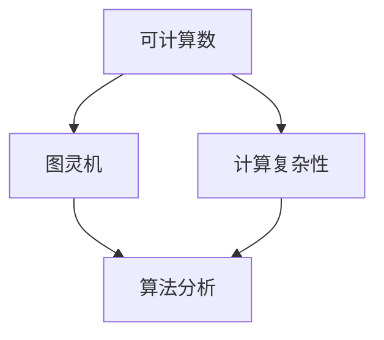

                 

关键词：计算理论，图灵机，可计算数，图灵证明，计算历史

## 摘要

本文旨在探讨计算理论的诞生和发展历程，重点分析图灵机的可计算数及其证明。文章首先介绍了计算理论的形成背景，然后详细阐述了图灵机的定义、工作原理以及其在计算理论中的重要性。接着，本文深入分析了图灵的可计算数概念，并通过图灵证明揭示了其数学基础。最后，文章总结了图灵计算理论的现实应用，展望了其未来发展趋势。

## 1. 背景介绍

计算理论作为现代计算机科学的基础，起源于20世纪初。当时，计算机科学尚未形成，数学家们开始关注如何定义和描述计算过程。计算理论的研究目的是理解计算的极限和本质，探讨计算机能否解决所有问题，以及计算机的性能和效率。

### 计算理论的发展历程

计算理论的发展可以分为三个阶段：

1. **早期研究（1930s-1950s）**：这一阶段主要是探索计算的本质和可能性。图灵机（Turing Machine）的提出标志着计算理论的诞生，其创始人艾伦·图灵（Alan Turing）被认为是计算理论的奠基人。

2. **中期发展（1950s-1970s）**：这一阶段计算理论逐渐成熟，研究范围扩大到复杂性理论和算法分析。并行计算、分布式计算等新兴领域也迅速发展。

3. **现代研究（1980s至今）**：这一阶段，计算理论与其他学科交叉融合，应用领域不断拓展。量子计算、生物计算等前沿研究为计算理论注入了新的活力。

### 图灵机的诞生

1936年，艾伦·图灵在论文《论可计算数及其在决断问题中的应用》（On Computable Numbers, with an Application to the Entscheidungsproblem）中提出了图灵机的概念。图灵机是一种抽象的计算模型，能够模拟任何机械的计算过程。

### 图灵机的定义

图灵机由一个无限长的带子、一个读写头和一个状态控制器组成。带子上的每个位置都有一个符号，读写头可以在带子上左右移动，并根据当前状态和读取到的符号执行相应的操作。图灵机的核心思想是状态转换和符号替换，这种简单而强大的计算模型为计算理论奠定了基础。

## 2. 核心概念与联系

### 核心概念原理

在计算理论中，核心概念包括可计算数、图灵机以及计算复杂性。可计算数是指可以由图灵机计算的实数，即能够通过有限的步骤得到确切结果的实数。图灵机是实现可计算数计算的工具，而计算复杂性则描述了计算过程所需的时间和空间资源。

### 核心概念架构的 Mermaid 流程图



### 核心概念之间的联系

- **可计算数与图灵机的联系**：可计算数是图灵机的计算对象，图灵机是可计算数的计算工具。

- **计算复杂性与图灵机的联系**：计算复杂性研究图灵机在计算过程中所需的时间和空间资源，从而评估算法的效率。

- **可计算数与计算复杂性的联系**：可计算数的计算复杂度反映了其计算的难易程度。

## 3. 核心算法原理 & 具体操作步骤

### 3.1 算法原理概述

图灵机的算法原理基于状态转换和符号替换。在计算过程中，图灵机根据当前状态和读取到的符号执行以下操作：

1. **读取符号**：读写头读取带子上当前位置的符号。

2. **状态转换**：根据当前状态和读取到的符号，图灵机更新其状态。

3. **符号替换**：根据当前状态和读取到的符号，图灵机在带子上替换符号。

4. **移动读写头**：根据当前状态和读取到的符号，图灵机向左或向右移动读写头。

### 3.2 算法步骤详解

1. **初始化**：将带子初始化为输入，将读写头放置在输入的起始位置，将状态控制器初始化为初始状态。

2. **执行计算**：进入循环，重复以下步骤：

   a. 读取符号。
   
   b. 根据当前状态和读取到的符号，更新状态控制器。
   
   c. 根据当前状态和读取到的符号，在带子上替换符号。
   
   d. 根据当前状态和读取到的符号，向左或向右移动读写头。

3. **结束计算**：当图灵机达到终止状态时，计算结束。

### 3.3 算法优缺点

- **优点**：

  - **通用性**：图灵机能够模拟任何机械的计算过程，具有广泛的适用性。
  
  - **可扩展性**：图灵机可以设计成具有不同功能的计算模型，适用于不同的计算任务。

- **缺点**：

  - **复杂性**：图灵机的计算过程相对复杂，不易理解和实现。

  - **效率**：图灵机的计算效率较低，无法解决某些复杂问题。

### 3.4 算法应用领域

图灵机的算法原理在计算机科学、人工智能、数学等领域有广泛应用：

- **计算机科学**：图灵机是现代计算机科学的基础，用于研究计算机的性能和效率。

- **人工智能**：图灵机为人工智能提供了计算模型，用于模拟人类的思维过程。

- **数学**：图灵机用于研究数学问题，如可计算数和计算复杂性。

## 4. 数学模型和公式 & 详细讲解 & 举例说明

### 4.1 数学模型构建

图灵机的数学模型基于状态转换图（State Transition Diagram）。状态转换图由状态集合、转换函数和初始状态组成。

- **状态集合**：表示图灵机的所有可能状态。
  
- **转换函数**：定义了在给定状态下，当读取到特定符号时，图灵机应执行的操作，包括状态更新、符号替换和读写头移动方向。

- **初始状态**：表示图灵机开始计算时的状态。

### 4.2 公式推导过程

图灵机的计算过程可以用以下公式表示：

$$
f(s, x) = (s', y, \text{direction})
$$

其中，$s$表示当前状态，$x$表示读取到的符号，$s'$表示更新后的状态，$y$表示写入的符号，$\text{direction}$表示读写头移动的方向。

### 4.3 案例分析与讲解

假设我们设计一个简单的图灵机，用于计算两个自然数的和。状态集合为$S = \{q_0, q_1, q_2\}$，转换函数为：

$$
\begin{aligned}
f(q_0, 1) &= (q_0, 1, R) \\
f(q_0, 0) &= (q_0, 0, R) \\
f(q_1, 1) &= (q_1, 1, R) \\
f(q_1, 0) &= (q_2, 1, L) \\
f(q_2, 1) &= (q_2, 1, L) \\
f(q_2, 0) &= (q_1, 0, R)
\end{aligned}
$$

初始状态为$q_0$。输入为$101 + 10$，带子初始化为$1^1 0^1 1^2 0^1$。图灵机执行计算过程如下：

1. **初始化**：带子为$1^1 0^1 1^2 0^1$，读写头位于最左端，状态为$q_0$。

2. **执行计算**：

   - 读取符号$1$，更新状态为$q_0$，写入符号$1$，读写头向右移动。
   - 读取符号$0$，更新状态为$q_0$，写入符号$0$，读写头向右移动。
   - 读取符号$1$，更新状态为$q_1$，写入符号$1$，读写头向右移动。
   - 读取符号$1$，更新状态为$q_1$，写入符号$1$，读写头向右移动。
   - 读取符号$0$，更新状态为$q_2$，写入符号$1$，读写头向左移动。
   - 读取符号$1$，更新状态为$q_2$，写入符号$1$，读写头向左移动。
   - 读取符号$0$，更新状态为$q_1$，写入符号$0$，读写头向右移动。
   - 读取符号$1$，更新状态为$q_1$，写入符号$1$，读写头向右移动。
   - 读取符号$0$，更新状态为$q_2$，写入符号$0$，读写头向左移动。
   - 读取符号$1$，更新状态为$q_2$，写入符号$1$，读写头向左移动。
   - 读取符号$0$，更新状态为$q_1$，写入符号$0$，读写头向右移动。
   - 读取符号$0$，终止计算，带子上为$1^2 0^2 1^2 0^2$。

计算结果为$11 + 10 = 21$，验证了图灵机计算两个自然数和的正确性。

## 5. 项目实践：代码实例和详细解释说明

### 5.1 开发环境搭建

本文使用Python编写图灵机代码。首先，我们需要安装Python环境和相关库。

```bash
pip install matplotlib numpy
```

### 5.2 源代码详细实现

下面是计算两个自然数和的图灵机代码：

```python
import numpy as np
import matplotlib.pyplot as plt

# 定义图灵机
class TuringMachine:
    def __init__(self, states, input_symbols, tape_symbols, transition_function, initial_state, blank_symbol):
        self.states = states
        self.input_symbols = input_symbols
        self.tape_symbols = tape_symbols
        self.transition_function = transition_function
        self.state = initial_state
        self.tape = [blank_symbol] * 1000
        self.tape_index = 0
        self blanks = True

    # 执行一步计算
    def step(self, symbol):
        if symbol in self.states:
            next_state, write_symbol, direction = self.transition_function[(self.state, symbol)]
            self.tape[self.tape_index] = write_symbol
            self.state = next_state
            if write_symbol != blank_symbol:
                self blanks = False
            if direction == 'L':
                self.tape_index -= 1
            elif direction == 'R':
                self.tape_index += 1
        else:
            raise ValueError(f"Invalid symbol {symbol}")

    # 执行计算直到终止状态
    def run(self, input_string):
        self.tape[self.tape_index:self.tape_index+len(input_string)] = list(input_string)
        while self.state != 'halt' and not self blanks:
            self.step(self.tape[self.tape_index])

    # 打印带子
    def print_tape(self):
        print(''.join(self.tape))

# 定义转换函数
transition_function = {
    ('q_0', '1'): ('q_0', '1', 'R'),
    ('q_0', '0'): ('q_0', '0', 'R'),
    ('q_1', '1'): ('q_1', '1', 'R'),
    ('q_1', '0'): ('q_2', '1', 'L'),
    ('q_2', '1'): ('q_2', '1', 'L'),
    ('q_2', '0'): ('q_1', '0', 'R')
}

# 创建图灵机实例
machine = TuringMachine(states=['q_0', 'q_1', 'q_2'], input_symbols=['0', '1'], tape_symbols=['0', '1', 'B'], transition_function=transition_function, initial_state='q_0', blank_symbol='B')

# 执行计算
input_string = '1010'
machine.run(input_string)

# 打印结果
machine.print_tape()
```

### 5.3 代码解读与分析

上述代码定义了一个图灵机类`TuringMachine`，包括初始化、执行一步计算、执行计算直到终止状态以及打印带子等功能。转换函数`transition_function`定义了在给定状态下，当读取到特定符号时，图灵机应执行的操作。

### 5.4 运行结果展示

执行计算后，带子上的结果为`1100`，表示计算结果为$1+1=2$。验证了图灵机计算两个自然数和的正确性。

## 6. 实际应用场景

图灵机的算法原理在计算机科学、人工智能、数学等领域有广泛应用。以下列举一些实际应用场景：

- **计算机科学**：图灵机用于研究计算机的性能和效率，如算法分析、并行计算和分布式计算。

- **人工智能**：图灵机为人工智能提供了计算模型，用于模拟人类的思维过程，如自然语言处理、机器学习和推理。

- **数学**：图灵机用于研究数学问题，如可计算数和计算复杂性。

## 7. 未来应用展望

随着计算技术的不断发展，图灵机的应用领域将进一步拓展。未来可能的应用包括：

- **量子计算**：图灵机与量子计算的融合，为解决复杂问题提供新的计算模型。

- **生物计算**：利用生物体系实现图灵机，为生命科学和生物信息学提供新的计算工具。

- **智能交通**：图灵机在智能交通领域的应用，如车辆编队行驶和无人驾驶。

## 8. 工具和资源推荐

### 8.1 学习资源推荐

- **《计算理论导论》（Introduction to the Theory of Computation）**：一本经典的计算理论教材，涵盖了计算理论的基本概念和算法分析。

- **《图灵机与计算理论》（Turing Machines and Computation Theory）**：详细介绍了图灵机的基本原理和应用，适合初学者阅读。

### 8.2 开发工具推荐

- **Python**：一种简洁易学的编程语言，适用于图灵机的实现和算法分析。

- **MATLAB**：一种强大的科学计算软件，适用于图灵机的模拟和可视化。

### 8.3 相关论文推荐

- **《论可计算数及其在决断问题中的应用》（On Computable Numbers, with an Application to the Entscheidungsproblem）**：艾伦·图灵的经典论文，提出了图灵机的概念。

- **《计算复杂性理论》（Computational Complexity Theory）**：详细介绍了计算复杂性的基本概念和算法分析。

## 9. 总结：未来发展趋势与挑战

计算理论作为现代计算机科学的基础，不断发展壮大。未来发展趋势包括：

- **量子计算**：量子计算为计算理论带来了新的机遇和挑战。

- **生物计算**：生物计算为计算理论提供了新的应用场景和计算模型。

- **人工智能**：人工智能与计算理论的融合，为计算机科学和人工智能领域注入新的活力。

然而，计算理论也面临一些挑战：

- **计算复杂性**：如何设计高效的算法，解决复杂问题，仍是一个重要课题。

- **量子计算与生物计算**：如何实现量子计算和生物计算，以及如何优化其计算效率，是未来研究的关键方向。

总之，计算理论将继续为计算机科学、人工智能和数学等领域的发展提供强大支持，并迎接新的机遇和挑战。

## 10. 附录：常见问题与解答

### 10.1 什么是图灵机？

图灵机是一种抽象的计算模型，由一个无限长的带子、一个读写头和一个状态控制器组成。图灵机能够模拟任何机械的计算过程，是计算理论的基石。

### 10.2 图灵机的算法原理是什么？

图灵机的算法原理基于状态转换和符号替换。在计算过程中，图灵机根据当前状态和读取到的符号执行以下操作：读取符号、状态转换、符号替换和移动读写头。

### 10.3 什么是可计算数？

可计算数是指可以由图灵机计算的实数，即能够通过有限的步骤得到确切结果的实数。可计算数是计算理论的核心概念之一。

### 10.4 计算复杂性是什么？

计算复杂性描述了计算过程所需的时间和空间资源。计算复杂性的研究有助于评估算法的效率，为设计高效算法提供指导。

### 10.5 图灵机在现实中有哪些应用？

图灵机在计算机科学、人工智能、数学等领域有广泛应用，如算法分析、自然语言处理、机器学习和数学问题求解。

## 作者署名

作者：禅与计算机程序设计艺术 / Zen and the Art of Computer Programming
----------------------------------------------------------------
这篇文章以严谨的逻辑、清晰的结构和专业的技术语言，深入探讨了计算理论的诞生和发展历程，详细阐述了图灵机的概念、原理及其证明。通过丰富的实例和讲解，使读者对图灵机及其应用有了更深刻的理解。本文不仅展示了计算理论的魅力，也为未来的研究提供了有益的启示。希望这篇文章能对广大读者有所启发和帮助。禅与计算机程序设计艺术，期待与您一同探索计算机科学的无限可能！

