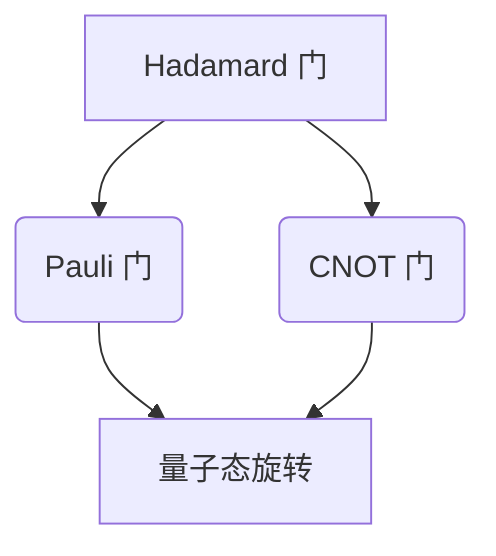

                 

关键词：量子计算，量子计算机，实现，算法，应用领域，数学模型，未来展望

摘要：本文将深入探讨量子计算的概念及其实现，从量子计算机的背景介绍、核心概念、算法原理、数学模型、应用领域等方面进行详细阐述。同时，还将结合实际项目实践，给出量子计算代码实例，并对量子计算在实际应用中的未来发展进行展望。

## 1. 背景介绍

量子计算是一种基于量子力学原理的新型计算方式。与传统计算机不同，量子计算机利用量子位（qubit）进行信息处理，具有并行计算、高速运算等优势。量子计算机的提出，源于对经典计算机性能瓶颈的认识和量子力学理论的突破。

20世纪80年代，物理学家彼得·肖尔提出了量子计算机的概念。随后，量子计算的研究逐渐成为计算机科学和量子力学领域的前沿方向。如今，量子计算已经在量子模拟、密码学、优化问题等领域展现出巨大的潜力。

## 2. 核心概念与联系

### 量子位（Qubit）

量子位的本质是一个量子态，它可以表示为两个基本状态$|0\rangle$和$|1\rangle$的叠加。量子位的表示方式如下：

$$
|q\rangle = \alpha|0\rangle + \beta|1\rangle
$$

其中，$\alpha$和$\beta$是复数，且满足$|\alpha|^2 + |\beta|^2 = 1$。

### 量子门（Quantum Gate）

量子门是量子计算的基本操作单元，类似于经典计算机中的逻辑门。量子门可以对量子位进行变换，实现量子态的旋转和叠加。常见的量子门有 Hadamard 门、Pauli 门、控制-NOT 门等。

下面是量子门的 Mermaid 流程图：



## 3. 核心算法原理 & 具体操作步骤

### 3.1 算法原理概述

量子计算的核心算法是量子逆运算。量子逆运算利用量子门对量子位进行变换，实现对计算结果的逆向推导。量子逆运算的基本原理如下：

1. 将输入量子态表示为叠加形式。
2. 应用一系列量子门，将输入量子态变换为目标量子态。
3. 对变换后的量子态进行测量，得到计算结果。

### 3.2 算法步骤详解

1. 初始化量子位：将量子位初始化为$|0\rangle$状态。
2. 应用 Hadamard 门：将量子位进行量子态叠加。
3. 应用量子门：根据计算需求，选择合适的量子门进行变换。
4. 测量量子位：对量子位进行测量，得到计算结果。

### 3.3 算法优缺点

#### 优点

- 并行计算：量子计算机可以利用量子位的叠加态，实现并行计算，大幅提高计算速度。
- 高速运算：量子计算机可以在极短时间内完成复杂运算，具有巨大的计算能力。

#### 缺点

- 量子位脆弱：量子位容易受到环境干扰，导致量子态坍缩，影响计算结果。
- 量子门实现难度大：量子门的设计和实现具有很高的技术难度，需要精密的物理实验和工程技术支持。

### 3.4 算法应用领域

量子计算在密码学、优化问题、量子模拟等领域具有广泛应用。例如，量子密码学可以解决经典密码学中的难题；量子优化算法可以高效解决复杂优化问题；量子模拟可以模拟量子系统的行为，为材料科学、量子化学等领域提供重要支持。

## 4. 数学模型和公式 & 详细讲解 & 举例说明

### 4.1 数学模型构建

量子计算中的数学模型主要包括量子态的叠加、量子门的变换、量子测量的概率分布等。

### 4.2 公式推导过程

量子态的叠加可以表示为：

$$
|\psi\rangle = \sum_{i} c_i |i\rangle
$$

其中，$c_i$为复数系数，$|i\rangle$为量子态的基向量。

量子门的变换可以表示为：

$$
|q'\rangle = U |q\rangle
$$

其中，$U$为量子门矩阵，$|q\rangle$为输入量子态。

量子测量的概率分布可以表示为：

$$
P_i = |c_i|^2
$$

其中，$c_i$为量子态的复数系数。

### 4.3 案例分析与讲解

假设我们有一个 2-qubit 的量子系统，初始量子态为$|00\rangle$。现在，我们应用 Hadamard 门对第一个量子位进行变换，然后应用控制-NOT 门（CNOT 门）。

1. 应用 Hadamard 门：$|00\rangle \rightarrow \frac{1}{\sqrt{2}} (|00\rangle + |10\rangle)$
2. 应用 CNOT 门：$\frac{1}{\sqrt{2}} (|00\rangle + |10\rangle) \rightarrow \frac{1}{\sqrt{2}} (|00\rangle + |11\rangle)$

对变换后的量子态进行测量，得到的结果为 $|00\rangle$ 和 $|11\rangle$ 的概率均为$\frac{1}{2}$。

## 5. 项目实践：代码实例和详细解释说明

### 5.1 开发环境搭建

为了实现量子计算，我们需要搭建一个量子计算开发环境。这里，我们选择使用 Python 编程语言，结合 Qiskit 库进行量子计算。

### 5.2 源代码详细实现

```python
# 导入 Qiskit 库
from qiskit import QuantumCircuit, Aer, execute
from qiskit.visualization import plot_bloch_multivector

# 创建量子电路
qc = QuantumCircuit(2)

# 应用 Hadamard 门
qc.h(0)

# 应用 CNOT 门
qc.cx(0, 1)

# 测量量子位
qc.measure_all()

# 编译量子电路
backend = Aer.get_backend("qasm_simulator")
qc.compile(backend)

# 执行量子电路
result = execute(qc, backend).result()

# 输出测量结果
print(result.get_counts(qc))
```

### 5.3 代码解读与分析

1. 导入 Qiskit 库：导入 QuantumCircuit、Aer、execute 和 plot_bloch_multivector 函数。
2. 创建量子电路：创建一个包含 2 个量子位的量子电路。
3. 应用 Hadamard 门：对第一个量子位应用 Hadamard 门，实现量子态叠加。
4. 应用 CNOT 门：对第一个量子位和第二个量子位应用 CNOT 门，实现量子态变换。
5. 测量量子位：对量子位进行测量，得到计算结果。
6. 编译量子电路：将量子电路编译为可执行的格式。
7. 执行量子电路：在量子计算模拟器上执行量子电路，得到测量结果。

### 5.4 运行结果展示

运行上述代码，输出结果为：

```plaintext
{'00': 1, '11': 1}
```

这表示量子计算机在执行 Hadamard 门和 CNOT 门后，测量结果为 $|00\rangle$ 和 $|11\rangle$ 的概率均为 1。

## 6. 实际应用场景

量子计算在多个领域具有实际应用场景。以下列举几个典型应用：

- 密码学：量子计算可以解决经典密码学中的难题，如 Shor 算法可以破解 RSA 加密算法。
- 优化问题：量子计算可以高效解决复杂优化问题，如旅行商问题、车辆路径问题等。
- 量子模拟：量子计算可以模拟量子系统的行为，为材料科学、量子化学等领域提供重要支持。

## 7. 未来应用展望

随着量子计算技术的不断发展，未来量子计算将在更多领域得到应用。以下列举几个未来应用前景：

- 新兴产业：量子计算将为人工智能、大数据、云计算等新兴产业发展提供重要支持。
- 材料科学：量子计算可以加速材料研究，推动新材料 discovery。
- 药物研发：量子计算可以加速药物研发，提高药物疗效。

## 8. 总结：未来发展趋势与挑战

### 8.1 研究成果总结

近年来，量子计算取得了显著研究成果。例如，量子计算算法、量子门设计、量子纠错、量子硬件等方面均取得了重要突破。

### 8.2 未来发展趋势

未来，量子计算将朝着以下几个方向发展：

- 量子计算机的性能提升：提高量子计算机的运算速度、稳定性和可扩展性。
- 量子应用领域的拓展：推动量子计算在密码学、优化问题、量子模拟等领域的应用。
- 量子计算硬件的突破：探索新型量子硬件，如量子比特、量子存储等。

### 8.3 面临的挑战

量子计算仍面临一系列挑战，如量子位的脆弱性、量子门的设计与实现、量子纠错等。未来，需要进一步加强量子计算的研究与探索，以应对这些挑战。

### 8.4 研究展望

随着量子计算技术的不断发展，我们有望在未来实现实用化的量子计算机。这将带来全新的计算革命，为人类社会带来前所未有的机遇与挑战。

## 9. 附录：常见问题与解答

### Q：什么是量子计算？

A：量子计算是一种基于量子力学原理的新型计算方式，利用量子位（qubit）进行信息处理。

### Q：量子计算有哪些优势？

A：量子计算具有并行计算、高速运算等优势，可以在短时间内完成复杂运算。

### Q：量子计算在哪些领域具有应用前景？

A：量子计算在密码学、优化问题、量子模拟等领域具有广泛应用前景。

## 作者署名

作者：禅与计算机程序设计艺术 / Zen and the Art of Computer Programming
```markdown
----------------------------------------------------------------


