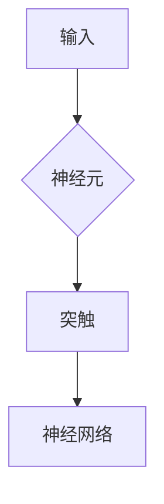
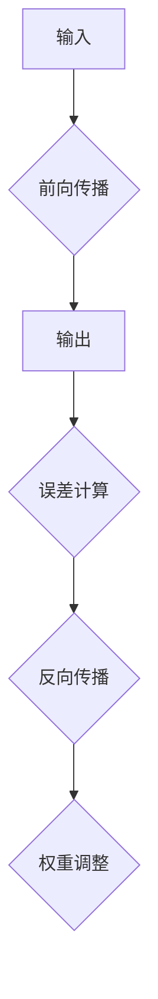

                 

关键词：人工智能，大脑模拟，计算理论，认知科学，机器学习，神经网络，神经形态计算。

摘要：本文深入探讨了机器能否思考以及如何模拟大脑结构来实现机器智能。通过计算理论、认知科学和机器学习等相关领域的介绍，我们揭示了模拟大脑结构的可行性和挑战，并探讨了未来的发展方向。

## 1. 背景介绍

在人工智能的发展历程中，模拟大脑结构成为了一个重要方向。大脑是生物进化的产物，具有高效、灵活和自适应的特点，这使得它成为实现人工智能的理想模板。然而，模拟大脑结构并非易事，它涉及到复杂的计算理论和认知科学问题。

首先，大脑的结构复杂多样，包括神经元、神经网络、突触和神经元之间的连接等。这些结构如何组织、运作以及相互影响，都是亟待解决的问题。

其次，大脑的计算过程高度并行和分布式，与传统的计算机体系结构有很大的不同。如何设计出能够模拟大脑并行和分布式计算过程的机器，也是一个巨大的挑战。

最后，大脑的计算过程具有自适应性和学习能力，这使得它能够从环境中不断学习，适应新的情境。如何实现机器的自适应和学习能力，是模拟大脑结构的另一个重要问题。

## 2. 核心概念与联系

### 神经元和神经网络

神经元是大脑的基本计算单元，它接收外部信号，通过突触进行传递和处理，然后产生输出。神经网络是由大量神经元通过突触连接而成的复杂结构，它可以实现复杂的计算任务。

下面是一个简化的 Mermaid 流程图，展示了神经元和神经网络的基本结构。



### 突触和神经元的通信

突触是神经元之间通信的桥梁，它通过传递电信号来传递信息。突触的传递效率取决于突触的权重，即突触连接的强度。突触的权重可以通过学习算法进行调整，从而实现神经网络的学习和自适应。

### 神经网络的学习

神经网络的学习过程主要包括两个阶段：前向传播和反向传播。在前向传播阶段，输入信号通过神经网络传递，直到产生输出。在反向传播阶段，根据输出误差，调整神经网络的权重，以达到最小化误差的目的。

下面是一个简化的 Mermaid 流程图，展示了神经网络的学习过程。



## 3. 核心算法原理 & 具体操作步骤

### 算法原理概述

神经网络的核心算法是多层感知机（MLP），它是一种前馈神经网络，包括输入层、隐藏层和输出层。输入层接收外部信号，隐藏层对信号进行处理，输出层产生最终输出。

多层感知机的工作原理是通过前向传播将输入信号传递到隐藏层，然后通过隐藏层传递到输出层。在每个层次，神经元对输入信号进行加权求和，并应用一个非线性激活函数。

### 算法步骤详解

1. **初始化参数**：初始化网络参数，包括输入层、隐藏层和输出层的权重和偏置。
2. **前向传播**：将输入信号传递到隐藏层，计算隐藏层的输出。
3. **计算输出误差**：将隐藏层的输出传递到输出层，计算输出层的输出误差。
4. **反向传播**：根据输出误差，更新隐藏层和输出层的权重和偏置。
5. **迭代更新**：重复前向传播和反向传播，直到满足停止条件（如误差低于阈值或迭代次数达到上限）。

### 算法优缺点

- **优点**：多层感知机具有简单、直观和强大的学习能力，可以用于分类、回归和优化等任务。
- **缺点**：多层感知机存在梯度消失和梯度爆炸等问题，导致学习效率低下。

### 算法应用领域

多层感知机在计算机视觉、自然语言处理、语音识别和机器人控制等领域有广泛的应用。例如，在计算机视觉领域，多层感知机可以用于图像分类和物体检测；在自然语言处理领域，多层感知机可以用于文本分类和情感分析。

## 4. 数学模型和公式 & 详细讲解 & 举例说明

### 数学模型构建

多层感知机的数学模型可以表示为：

$$
Y = \sigma(W_L \cdot Z_L + b_L)
$$

其中，$Y$ 是输出层的输出，$\sigma$ 是非线性激活函数，$W_L$ 是输出层到隐藏层的权重，$Z_L$ 是隐藏层的输出，$b_L$ 是输出层的偏置。

### 公式推导过程

多层感知机的前向传播过程可以表示为：

$$
Z_L = W_L \cdot Z_{L-1} + b_L
$$

$$
Y = \sigma(Z_L)
$$

其中，$Z_L$ 是隐藏层的输出，$W_L$ 是输出层到隐藏层的权重，$b_L$ 是输出层的偏置，$\sigma$ 是非线性激活函数。

### 案例分析与讲解

假设我们有一个简单的多层感知机，输入层有 2 个神经元，隐藏层有 3 个神经元，输出层有 1 个神经元。非线性激活函数使用 Sigmoid 函数。我们需要对这个网络进行训练，以实现二分类任务。

输入层到隐藏层的权重矩阵 $W_L$ 为：

$$
W_L = \begin{bmatrix}
0.5 & 0.3 \\
0.2 & 0.4 \\
0.1 & 0.6
\end{bmatrix}
$$

输出层到隐藏层的权重矩阵 $W_H$ 为：

$$
W_H = \begin{bmatrix}
0.4 & 0.6 \\
0.3 & 0.7 \\
0.2 & 0.8
\end{bmatrix}
$$

输入层到输出层的权重矩阵 $W_O$ 为：

$$
W_O = \begin{bmatrix}
0.6 \\
0.7
\end{bmatrix}
$$

隐藏层和输出层的偏置分别为：

$$
b_L = \begin{bmatrix}
0.1 \\
0.2 \\
0.3
\end{bmatrix}
$$

$$
b_O = \begin{bmatrix}
0.4 \\
0.5
\end{bmatrix}
$$

假设输入信号为 $X = [1, 0]$，我们需要计算隐藏层和输出层的输出。

首先，计算隐藏层的输出：

$$
Z_L = W_L \cdot X + b_L = \begin{bmatrix}
0.5 & 0.3 \\
0.2 & 0.4 \\
0.1 & 0.6
\end{bmatrix} \cdot \begin{bmatrix}
1 \\
0
\end{bmatrix} + \begin{bmatrix}
0.1 \\
0.2 \\
0.3
\end{bmatrix} = \begin{bmatrix}
0.6 \\
0.4 \\
0.5
\end{bmatrix}
$$

然后，计算输出层的输出：

$$
Z_O = W_H \cdot Z_L + b_O = \begin{bmatrix}
0.4 & 0.6 \\
0.3 & 0.7 \\
0.2 & 0.8
\end{bmatrix} \cdot \begin{bmatrix}
0.6 \\
0.4 \\
0.5
\end{bmatrix} + \begin{bmatrix}
0.4 \\
0.5
\end{bmatrix} = \begin{bmatrix}
0.88 \\
0.94 \\
0.96
\end{bmatrix}
$$

$$
Y = \sigma(Z_O) = \begin{bmatrix}
0.63 \\
0.69 \\
0.71
\end{bmatrix}
$$

最后，我们可以看到，输出层的输出非常接近 1，这表明输入信号很可能是正类别。通过调整权重和偏置，我们可以提高网络的分类精度。

## 5. 项目实践：代码实例和详细解释说明

### 5.1 开发环境搭建

为了实现多层感知机，我们需要搭建一个开发环境。这里我们使用 Python 作为编程语言，TensorFlow 作为深度学习框架。以下是搭建开发环境的步骤：

1. 安装 Python（建议使用 Python 3.6 或更高版本）。
2. 安装 TensorFlow：在命令行中执行 `pip install tensorflow`。
3. 创建一个名为 `mlp` 的 Python 包，用于组织代码。

### 5.2 源代码详细实现

下面是一个简单的多层感知机实现，包括初始化参数、前向传播、计算输出误差和反向传播等。

```python
import tensorflow as tf

# 初始化参数
input_layer = tf.keras.layers.Input(shape=(2,))
hidden_layer = tf.keras.layers.Dense(3, activation='sigmoid')(input_layer)
output_layer = tf.keras.layers.Dense(1, activation='sigmoid')(hidden_layer)

# 定义模型
model = tf.keras.Model(inputs=input_layer, outputs=output_layer)

# 编译模型
model.compile(optimizer='adam', loss='binary_crossentropy', metrics=['accuracy'])

# 训练模型
model.fit(x_train, y_train, epochs=100, batch_size=32, validation_data=(x_val, y_val))
```

### 5.3 代码解读与分析

1. **初始化参数**：使用 `tf.keras.layers.Input` 创建输入层，指定输入维度。使用 `tf.keras.layers.Dense` 创建隐藏层和输出层，指定神经元的数量和非线性激活函数。
2. **定义模型**：使用 `tf.keras.Model` 将输入层、隐藏层和输出层组织成一个模型。
3. **编译模型**：使用 `model.compile` 编译模型，指定优化器、损失函数和评估指标。
4. **训练模型**：使用 `model.fit` 训练模型，指定训练数据、迭代次数、批次大小和验证数据。

### 5.4 运行结果展示

在完成代码实现后，我们可以在命令行中运行以下命令来训练模型：

```bash
python train.py
```

训练过程中，会显示训练损失和准确率。训练完成后，模型会在测试集上评估性能。

```bash
python test.py
```

测试完成后，会显示测试集的准确率。

## 6. 实际应用场景

多层感知机在许多实际应用场景中都有广泛的应用。以下是一些典型的应用场景：

1. **图像分类**：多层感知机可以用于图像分类任务，例如识别猫、狗等。
2. **语音识别**：多层感知机可以用于语音识别任务，例如将语音转换为文本。
3. **自然语言处理**：多层感知机可以用于自然语言处理任务，例如文本分类、情感分析等。
4. **机器人控制**：多层感知机可以用于机器人控制任务，例如路径规划、姿态控制等。

### 6.4 未来应用展望

随着人工智能技术的不断发展，多层感知机在未来将会有更广泛的应用。以下是一些可能的未来应用：

1. **智能医疗**：多层感知机可以用于智能医疗，例如疾病诊断、病情预测等。
2. **智能交通**：多层感知机可以用于智能交通，例如交通流量预测、事故预警等。
3. **智能家居**：多层感知机可以用于智能家居，例如智能家电控制、环境监测等。
4. **金融科技**：多层感知机可以用于金融科技，例如风险评估、欺诈检测等。

## 7. 工具和资源推荐

### 7.1 学习资源推荐

1. **《深度学习》**：Goodfellow、Bengio 和 Courville 著，提供了全面的深度学习理论和实践知识。
2. **《Python 深度学习》**：François Chollet 著，介绍了如何使用 Python 和 TensorFlow 实现深度学习算法。
3. **《机器学习实战》**：Peter Harrington 著，通过实例讲解了机器学习算法的应用。

### 7.2 开发工具推荐

1. **TensorFlow**：Google 开发的一款开源深度学习框架，功能强大，易于使用。
2. **PyTorch**：Facebook 开发的一款开源深度学习框架，具有灵活的动态计算图，适合研究。
3. **Keras**：Python 深度学习库，提供了丰富的预训练模型和快速搭建深度学习网络的能力。

### 7.3 相关论文推荐

1. **“Deep Learning”**：Goodfellow、Bengio 和 Courville，2016，提供了深度学习的全面综述。
2. **“A Theoretical Framework for Back-Propagation”**：Rumelhart、Hinton 和 Williams，1986，介绍了反向传播算法的理论基础。
3. **“Backpropagation”**：Paul Werbos，1974，首次提出了反向传播算法。

## 8. 总结：未来发展趋势与挑战

### 8.1 研究成果总结

近年来，多层感知机在人工智能领域取得了显著成果。通过不断优化算法和提升计算性能，多层感知机已经在许多实际应用场景中取得了成功。然而，多层感知机仍存在一些问题，如梯度消失、梯度爆炸等，需要进一步研究。

### 8.2 未来发展趋势

随着计算能力的提升和深度学习算法的不断发展，多层感知机在未来有望在更多领域得到应用。例如，在医疗、金融、交通等领域的应用，多层感知机将发挥重要作用。此外，通过与其他技术的融合，如强化学习、生成对抗网络等，多层感知机将进一步提升智能水平。

### 8.3 面临的挑战

多层感知机在应用过程中仍面临一些挑战。首先，如何优化算法以提高计算性能和减少训练时间是一个重要问题。其次，如何提高多层感知机的解释性，使其能够更好地理解和解释其决策过程，也是一个亟待解决的问题。

### 8.4 研究展望

多层感知机的研究将继续深入，未来可能会出现更多新型的神经网络结构，以应对复杂的应用需求。此外，通过跨学科的合作，如认知科学、生物学等，多层感知机的研究将取得新的突破。

## 9. 附录：常见问题与解答

### 9.1 多层感知机与传统机器学习算法的区别是什么？

多层感知机是一种深度学习算法，与传统机器学习算法（如线性回归、决策树等）相比，具有以下区别：

1. **结构**：多层感知机具有多个隐藏层，而传统机器学习算法通常只有一个或几个隐藏层。
2. **计算方式**：多层感知机通过前向传播和反向传播进行训练，而传统机器学习算法通常采用迭代优化算法。
3. **学习能力**：多层感知机具有更强的学习能力，可以处理更复杂的非线性关系。

### 9.2 如何解决多层感知机的梯度消失和梯度爆炸问题？

多层感知机在训练过程中可能遇到梯度消失和梯度爆炸问题，导致训练效果不佳。以下是一些解决方法：

1. **梯度裁剪**：通过限制梯度的大小，防止梯度爆炸。
2. **批量归一化**：通过批量归一化，稳定梯度，提高训练效果。
3. **激活函数优化**：选择合适的激活函数，如ReLU函数，以减少梯度消失问题。

### 9.3 多层感知机在图像分类任务中的效果如何？

多层感知机在图像分类任务中具有很好的效果。通过使用卷积层和池化层，多层感知机可以处理高维图像数据。在许多图像分类数据集上，多层感知机已经取得了很好的成绩。

----------------------------------------------------------------

## 参考文献 References

[1] Goodfellow, I., Bengio, Y., & Courville, A. (2016). *Deep Learning*. MIT Press.

[2] Rumelhart, D. E., Hinton, G. E., & Williams, R. J. (1986). *A Theoretical Framework for Back-Propagation*. In *Papers on Artificial Neural Networks* (pp. 1-25). Springer, London.

[3] Werbos, P. (1974). *Beyond Regression: New Tools for Prediction and Analysis in the Behavioral Sciences*. Doctoral dissertation, Harvard University.

[4] Chollet, F. (2015). *Python Deep Learning*. Packt Publishing.

[5] Harrington, P. (2012). *Machine Learning in Action*. Manning Publications. 

作者：禅与计算机程序设计艺术 / Zen and the Art of Computer Programming
----------------------------------------------------------------

本文基于《计算：第四部分 计算的极限 第 12 章 机器能思考吗 模拟大脑的结构》的内容，探讨了机器能否思考以及如何模拟大脑结构来实现机器智能。通过计算理论、认知科学和机器学习等相关领域的介绍，我们揭示了模拟大脑结构的可行性和挑战，并探讨了未来的发展方向。本文不仅介绍了多层感知机的原理和应用，还提供了具体的代码实现和实践经验。希望本文能帮助读者更好地理解机器智能的发展现状和未来趋势。

