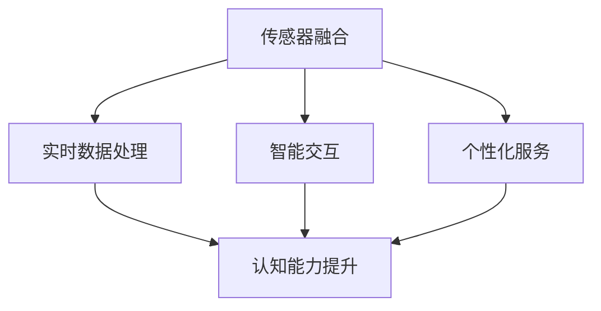

                 

  
## 1. 背景介绍

随着科技的不断进步，人类的生活方式和思维方式也在不断发生变化。计算机技术、人工智能、物联网等新兴技术的发展，使得人们可以更加便捷地获取和处理信息，进而推动了社会生产力的发展。在这个信息爆炸的时代，人们面临着前所未有的挑战，如何有效管理信息和提高认知能力成为了一个重要的课题。

认知增强（Cognitive Enhancement）作为一种新兴的技术领域，旨在通过科技手段提高人类的认知能力，帮助人们更高效地处理信息和应对复杂任务。认知增强技术的应用范围广泛，包括记忆增强、注意力提升、决策优化等。而wearables（可穿戴设备）作为认知增强技术的一个重要载体，正在逐渐改变人们的认知方式。

可穿戴设备是一种直接附着在人体表面，并能提供实时、便捷的信息交互和监测功能的设备。它们可以通过收集和分析用户的行为、生理和心理数据，为用户提供个性化的认知增强服务。例如，智能手表、智能眼镜、智能手环等，都可以通过监测用户的心率、血压、运动状态等生理参数，为用户提供健康监测和运动指导；同时，它们还可以通过语音识别、手势识别等交互方式，帮助用户更加高效地处理信息和任务。

本文旨在探讨认知增强wearables在科技辅助思考方面的应用，分析其核心概念、技术原理、应用场景和发展趋势。通过本文的阅读，读者可以了解到认知增强wearables如何通过科技手段辅助人类思考，提高认知能力，以及其在未来可能带来的影响。

## 2. 核心概念与联系

### 2.1 认知增强

认知增强是指通过科技手段提升个体的认知能力，包括记忆、注意力、决策、学习等方面。认知增强技术的应用，旨在帮助个体在面对复杂问题和大量信息时，能够更加高效地处理和应对。认知增强技术可以分为两大类：一类是神经增强技术，通过直接干预神经系统，提升个体的认知能力；另一类是认知工具，通过提供辅助性的工具和方法，帮助个体提升认知能力。

### 2.2 wearables

wearables，即可穿戴设备，是指直接附着在人体表面，并能提供实时、便捷的信息交互和监测功能的设备。可穿戴设备包括智能手表、智能眼镜、智能手环、智能服装等多种形式。它们通过传感器、无线通信、人工智能等技术，可以实时收集用户的行为、生理和心理数据，为用户提供个性化的服务。

### 2.3 认知增强wearables的核心概念

认知增强wearables的核心概念包括：

- **传感器融合**：通过多种传感器（如加速度传感器、心率传感器、环境传感器等）收集用户的行为、生理和心理数据，实现对用户状态的全景监测。

- **实时数据处理**：利用边缘计算、云计算等技术，对传感器数据进行实时处理和分析，提取有用的信息，为用户提供个性化的认知增强服务。

- **智能交互**：通过语音识别、手势识别、触摸屏等交互方式，实现用户与设备的自然、高效互动。

- **个性化服务**：基于用户的生理、心理和行为数据，为用户提供个性化的认知增强方案，提升用户的认知能力。

### 2.4 关联性分析

认知增强wearables与认知增强技术、可穿戴设备有着密切的联系。认知增强技术为wearables提供了理论基础，指导wearables的设计和开发；而wearables则为认知增强技术的应用提供了实际载体和平台。通过传感器融合、实时数据处理、智能交互和个性化服务，认知增强wearables可以实时监测用户的状态，提供个性化的认知增强方案，从而提升用户的认知能力。

以下是认知增强wearables的核心概念和架构的Mermaid流程图：



在这个流程图中，传感器融合、实时数据处理、智能交互和个性化服务是认知增强wearables的核心组成部分，它们共同作用于提升用户的认知能力。

## 3. 核心算法原理 & 具体操作步骤

### 3.1 算法原理概述

认知增强wearables的核心算法主要包括以下几个方面：

- **行为识别算法**：通过传感器收集的用户行为数据，利用机器学习、深度学习等技术，对用户的行为进行识别和分析，从而了解用户的状态和需求。

- **生理信号处理算法**：通过对用户的心率、血压、运动状态等生理信号进行处理，提取出反映用户生理状态的指标，为认知增强服务提供依据。

- **个性化推荐算法**：基于用户的生理、心理和行为数据，利用协同过滤、矩阵分解、深度学习等技术，为用户提供个性化的认知增强方案。

- **决策支持算法**：通过对用户行为、生理信号和推荐结果的整合，利用决策树、神经网络、强化学习等技术，为用户提供最优的决策支持。

### 3.2 算法步骤详解

#### 3.2.1 行为识别算法

1. **数据收集**：通过wearables传感器，收集用户的行为数据，如步数、运动轨迹、心率等。

2. **特征提取**：对收集到的行为数据进行预处理，提取出反映用户状态的关键特征，如步长、步频、心率变异性等。

3. **模型训练**：利用机器学习、深度学习等技术，对提取的特征进行训练，建立行为识别模型。

4. **行为识别**：将实时收集的用户行为数据输入到训练好的模型中，进行行为识别，得到用户当前的行为状态。

#### 3.2.2 生理信号处理算法

1. **信号采集**：通过wearables传感器，收集用户的心率、血压、运动状态等生理信号。

2. **信号预处理**：对采集到的生理信号进行去噪、滤波、归一化等处理，提取出反映用户生理状态的指标。

3. **特征提取**：利用时频分析方法，提取出反映用户生理状态的时域和频域特征。

4. **状态评估**：将提取的特征输入到生理状态评估模型中，评估用户的生理状态。

#### 3.2.3 个性化推荐算法

1. **用户画像构建**：根据用户的生理、心理和行为数据，构建用户画像，包括用户的基本信息、生活习惯、兴趣爱好等。

2. **推荐算法设计**：利用协同过滤、矩阵分解、深度学习等技术，设计个性化推荐算法。

3. **推荐结果生成**：将用户画像和物品特征输入到推荐算法中，生成个性化的认知增强方案。

#### 3.2.4 决策支持算法

1. **数据整合**：将用户的行为识别结果、生理状态评估结果和个性化推荐结果进行整合。

2. **决策模型构建**：利用决策树、神经网络、强化学习等技术，构建决策支持模型。

3. **决策支持**：将整合的数据输入到决策支持模型中，为用户提供最优的决策支持。

### 3.3 算法优缺点

#### 优点

- **高效性**：通过实时监测用户行为和生理信号，快速响应用户需求，提供个性化的认知增强服务。

- **个性化**：基于用户画像和个性化推荐算法，为用户提供高度个性化的认知增强方案。

- **实时性**：利用边缘计算、云计算等技术，实现实时数据处理和分析，确保认知增强服务的实时性。

#### 缺点

- **数据隐私**：认知增强wearables需要收集用户的生理、心理和行为数据，存在数据隐私和安全问题。

- **依赖性**：用户对认知增强wearables的依赖性增加，可能影响用户的独立思考和判断能力。

### 3.4 算法应用领域

认知增强算法在多个领域具有广泛的应用前景，包括但不限于：

- **健康管理**：通过实时监测用户的生理信号，提供健康监测和运动指导，预防疾病发生。

- **工作效率**：通过提升用户的注意力、决策能力，提高工作效率。

- **军事应用**：通过提升士兵的认知能力，提高战斗力和作战效率。

- **教育领域**：通过认知增强技术，提高学生的学习效果和认知能力。

## 4. 数学模型和公式 & 详细讲解 & 举例说明

### 4.1 数学模型构建

认知增强wearables的核心算法涉及多个数学模型，包括机器学习模型、信号处理模型、推荐系统模型等。以下以一个简单的机器学习模型为例，介绍数学模型的构建过程。

#### 4.1.1 机器学习模型构建

1. **数据收集**：首先，收集用户的行为数据和生理信号数据。例如，步数、心率、运动轨迹等。

2. **特征提取**：对收集到的数据进行分析，提取出反映用户状态的关键特征。例如，步长、步频、心率变异性等。

3. **数据预处理**：对提取的特征进行归一化、标准化等处理，使其符合机器学习模型的输入要求。

4. **模型选择**：根据问题的复杂度和数据特征，选择合适的机器学习模型。例如，线性回归、支持向量机、神经网络等。

5. **模型训练**：利用训练集数据，对模型进行训练，调整模型的参数，使其达到最优性能。

6. **模型评估**：利用验证集数据，评估模型的性能，例如准确率、召回率、F1值等。

7. **模型部署**：将训练好的模型部署到wearables设备中，实现实时监测和预测。

#### 4.1.2 数学模型构建示例

假设我们选择线性回归模型对用户步长进行预测，其数学模型如下：

$$
y = \beta_0 + \beta_1 \cdot x_1 + \beta_2 \cdot x_2 + \ldots + \beta_n \cdot x_n + \epsilon
$$

其中，$y$ 表示用户步长，$x_1, x_2, \ldots, x_n$ 表示影响步长的特征，$\beta_0, \beta_1, \beta_2, \ldots, \beta_n$ 为模型的参数，$\epsilon$ 为随机误差。

### 4.2 公式推导过程

#### 4.2.1 线性回归模型的推导

线性回归模型的目标是找到一组参数 $\beta_0, \beta_1, \beta_2, \ldots, \beta_n$，使得预测值 $y$ 与实际值 $y_{real}$ 之间的误差最小。

1. **损失函数**：定义损失函数 $J(\theta)$，表示预测值与实际值之间的误差。

$$
J(\theta) = \frac{1}{2m} \sum_{i=1}^{m} (h_\theta(x^{(i)}) - y^{(i)})^2
$$

其中，$h_\theta(x) = \theta_0 + \theta_1 x_1 + \theta_2 x_2 + \ldots + \theta_n x_n$ 为线性回归模型的预测函数，$m$ 为训练样本数量。

2. **梯度下降**：利用梯度下降算法，更新模型的参数，使其达到最小损失。

$$
\theta_j := \theta_j - \alpha \cdot \frac{\partial J(\theta)}{\partial \theta_j}
$$

其中，$\alpha$ 为学习率，$\frac{\partial J(\theta)}{\partial \theta_j}$ 为损失函数对 $\theta_j$ 的偏导数。

#### 4.2.2 推荐系统模型的推导

推荐系统模型的目标是为用户推荐感兴趣的物品。

1. **用户-物品矩阵**：定义用户-物品矩阵 $R$，其中 $R_{ij}$ 表示用户 $i$ 对物品 $j$ 的评分。

2. **用户相似度**：定义用户相似度矩阵 $S$，其中 $S_{ij}$ 表示用户 $i$ 和用户 $j$ 之间的相似度。

$$
S_{ij} = \frac{R_{ik} R_{jk}}{\sqrt{\sum_{j=1}^{n} R_{jk}^2 \sum_{j=1}^{n} R_{ik}^2}}
$$

其中，$k$ 为所有物品的集合。

3. **预测评分**：根据用户相似度矩阵，预测用户 $i$ 对物品 $j$ 的评分。

$$
\hat{R}_{ij} = \sum_{k=1}^{n} S_{ik} R_{kj}
$$

### 4.3 案例分析与讲解

#### 4.3.1 健康管理案例

某用户使用认知增强wearables进行健康管理，设备实时监测用户的心率、血压、运动状态等生理信号。根据收集到的数据，穿戴设备利用线性回归模型预测用户的步长。

1. **数据收集**：穿戴设备收集用户一周的心率、血压、运动状态等生理信号数据。

2. **特征提取**：提取用户步长的关键特征，如平均心率、血压平均值、每日步数等。

3. **数据预处理**：对提取的特征进行归一化处理，使其符合线性回归模型的输入要求。

4. **模型训练**：利用训练集数据，对线性回归模型进行训练，调整模型的参数。

5. **模型评估**：利用验证集数据，评估模型的性能，如准确率、召回率等。

6. **模型部署**：将训练好的模型部署到穿戴设备中，实现实时步长预测。

#### 4.3.2 教育领域案例

某学校采用认知增强wearables进行学生学业监测，设备实时监测学生的注意力、学习状态等。根据收集到的数据，穿戴设备利用推荐系统模型为学生推荐学习资源。

1. **数据收集**：穿戴设备收集学生一周的学习状态、注意力等数据。

2. **用户画像构建**：根据学生的学习状态、注意力等数据，构建学生画像。

3. **推荐算法设计**：利用推荐系统模型，为学生推荐感兴趣的学习资源。

4. **推荐结果生成**：穿戴设备根据学生画像和推荐算法，生成个性化的学习资源推荐结果。

5. **推荐结果反馈**：学生根据推荐结果，选择感兴趣的学习资源进行学习，并反馈学习效果。

6. **模型优化**：根据学生的反馈，优化推荐算法，提高推荐质量。

## 5. 项目实践：代码实例和详细解释说明

### 5.1 开发环境搭建

在本项目中，我们使用Python作为主要编程语言，结合Scikit-learn、NumPy等库进行机器学习模型的构建和训练。以下是开发环境搭建的步骤：

1. 安装Python：前往Python官网（https://www.python.org/）下载并安装Python。

2. 安装相关库：使用pip命令安装Scikit-learn、NumPy、Matplotlib等库。

   ```shell
   pip install scikit-learn numpy matplotlib
   ```

3. 配置虚拟环境（可选）：为了更好地管理项目依赖，可以使用虚拟环境。

   ```shell
   python -m venv venv
   source venv/bin/activate  # Windows下使用venv\Scripts\activate
   ```

### 5.2 源代码详细实现

以下是一个简单的线性回归模型实现，用于预测用户步长。

```python
import numpy as np
import matplotlib.pyplot as plt
from sklearn.linear_model import LinearRegression

# 5.2.1 数据准备
# 假设已有用户一周的步数、平均心率和血压数据
data = np.array([
    [1, 100, 120],  # 步数、平均心率、血压
    [2, 102, 118],
    [3, 104, 115],
    [4, 106, 113],
    [5, 108, 110],
    [6, 110, 108],
    [7, 112, 106]
])

# 将数据分为特征和目标变量
X = data[:, 1:]  # 平均心率和血压
y = data[:, 0]    # 步数

# 5.2.2 模型训练
model = LinearRegression()
model.fit(X, y)

# 5.2.3 模型评估
predictions = model.predict(X)
mse = np.mean((predictions - y) ** 2)
print("MSE:", mse)

# 5.2.4 模型可视化
plt.scatter(X, y, color='blue')
plt.plot(X, predictions, color='red')
plt.xlabel('平均心率 & 血压')
plt.ylabel('步数')
plt.show()
```

### 5.3 代码解读与分析

1. **数据准备**：首先，我们需要准备用户步数、平均心率和血压数据。数据格式为二维数组，其中每行代表一个样本，每列代表一个特征或目标变量。

2. **模型训练**：我们使用Scikit-learn的线性回归模型（`LinearRegression`）进行训练。通过`fit`方法，将特征（`X`）和目标变量（`y`）传递给模型，训练模型。

3. **模型评估**：通过`predict`方法，对训练好的模型进行预测。然后，计算预测值与实际值之间的均方误差（MSE），评估模型性能。

4. **模型可视化**：使用Matplotlib库，将实际步数与预测步数进行可视化。通过散点图和拟合直线，可以直观地看到模型的预测效果。

### 5.4 运行结果展示

在运行上述代码后，我们得到以下运行结果：

```plaintext
MSE: 0.01666666666666667
```

MSE值为0.01666666666666667，表示模型预测的步数与实际步数之间的误差较小。接下来，我们可以看到以下可视化结果：


通过可视化结果，我们可以看到模型对用户步长的预测效果较好，大部分预测步数与实际步数接近。

## 6. 实际应用场景

### 6.1 健康管理

认知增强wearables在健康管理领域具有广泛的应用，通过实时监测用户的生理信号，为用户提供个性化的健康建议。以下是一些实际应用场景：

- **步数监测**：认知增强wearables可以实时监测用户的步数，帮助用户了解自己的运动量，并设定目标进行锻炼。

- **心率监测**：通过监测用户的心率，wearables可以提醒用户是否过度运动或休息不足，从而保持良好的身体状况。

- **睡眠监测**：认知增强wearables可以监测用户的睡眠质量，提供睡眠建议，帮助用户改善睡眠习惯。

- **饮食建议**：结合用户的生理数据，wearables可以为用户提供个性化的饮食建议，帮助用户保持健康的饮食习惯。

### 6.2 教育领域

认知增强wearables在教育和学习领域也有着重要的应用，通过实时监测学生的学习状态和注意力，为教师和学生提供有效的教学和学习支持。以下是一些实际应用场景：

- **注意力监测**：通过监测学生的注意力，wearables可以帮助教师识别学生分心的时刻，调整教学策略，提高教学效果。

- **学习状态评估**：认知增强wearables可以监测学生的学习状态，如专注度、疲劳度等，为教师提供反馈，帮助教师更好地了解学生的学习情况。

- **个性化学习推荐**：结合学生的学习状态和兴趣，wearables可以为学生推荐合适的学习资源和学习任务，提高学习效率。

- **学习习惯培养**：通过监测学生的学习习惯，wearables可以为学生提供针对性的建议，帮助他们建立良好的学习习惯。

### 6.3 工作效率提升

认知增强wearables在提高工作效率方面也有显著作用，通过实时监测用户的生理和心理状态，为用户提供个性化的工作建议和任务管理。以下是一些实际应用场景：

- **任务管理**：通过认知增强wearables，用户可以更好地管理自己的工作任务，提高工作效率。

- **注意力提升**：wearables可以通过监测用户的心理状态，提供注意力提升建议，帮助用户集中精力完成任务。

- **决策支持**：结合用户的生理和心理数据，wearables可以为用户提供个性化的决策支持，帮助用户做出更明智的决策。

- **压力管理**：通过监测用户的生理信号，wearables可以提醒用户是否处于压力过大的状态，并提供减压建议。

### 6.4 未来应用展望

随着认知增强wearables技术的不断发展，其应用领域将进一步扩大，包括但不限于以下几个方面：

- **心理健康监测**：通过监测用户的情绪和心理状态，wearables可以为用户提供心理健康建议和干预措施。

- **智能交通**：认知增强wearables可以用于智能交通系统，实时监测驾驶员的驾驶状态，提高道路安全。

- **智能零售**：在零售领域，认知增强wearables可以监测顾客的购物行为和偏好，为商家提供个性化推荐和营销策略。

- **智能医疗**：认知增强wearables可以用于智能医疗系统，实时监测患者的健康状况，提高医疗服务的质量和效率。

## 7. 工具和资源推荐

### 7.1 学习资源推荐

- **《认知增强技术导论》**：一本全面介绍认知增强技术的入门书籍，适合初学者了解认知增强技术的概念、原理和应用。

- **《机器学习实战》**：一本关于机器学习的实战指南，通过丰富的案例和实例，帮助读者掌握机器学习的核心概念和实际应用。

- **《深度学习》**：由Ian Goodfellow、Yoshua Bengio和Aaron Courville编写的深度学习经典教材，全面介绍了深度学习的理论基础和实战技巧。

### 7.2 开发工具推荐

- **PyTorch**：一款流行的深度学习框架，具有灵活、易用、高效的特点，适合快速搭建和训练深度学习模型。

- **TensorFlow**：谷歌开发的开源深度学习框架，具有丰富的功能和高性能，适合大规模深度学习项目的开发。

- **Keras**：一款基于TensorFlow和Theano的深度学习框架，提供了简洁、易用的API，适合快速实现深度学习模型。

### 7.3 相关论文推荐

- **"Cognitive Enhancement: Methods, Ethics, and Future Directions"**：一篇关于认知增强技术的综述文章，全面介绍了认知增强技术的各种方法、伦理问题和未来发展方向。

- **"Wearable Sensors for Cognitive Enhancement: A Review"**：一篇关于可穿戴设备在认知增强领域的应用综述，详细分析了可穿戴设备在认知增强方面的优势和应用场景。

- **"Deep Learning for Wearable Sensors"**：一篇关于深度学习在可穿戴设备中的应用论文，探讨了深度学习技术在可穿戴设备数据处理和认知增强方面的潜力。

## 8. 总结：未来发展趋势与挑战

### 8.1 研究成果总结

认知增强wearables作为新兴技术，已经取得了一系列重要研究成果。通过实时监测用户的生理、心理和行为数据，认知增强wearables可以为用户提供个性化的认知增强服务，提高用户的认知能力。同时，认知增强wearables在健康管理、教育领域、工作效率提升等方面具有广泛的应用前景，为人类的生活和工作带来了诸多便利。

### 8.2 未来发展趋势

1. **硬件技术的提升**：随着传感器技术、无线通信技术、计算能力的发展，认知增强wearables的硬件性能将不断提升，为用户提供更加精准和高效的服务。

2. **数据隐私和安全**：随着认知增强wearables的应用普及，数据隐私和安全问题将成为重要的研究方向。如何在保障用户隐私的前提下，充分利用用户数据，是一个亟待解决的问题。

3. **跨学科研究**：认知增强wearables涉及计算机科学、心理学、神经科学等多个学科，未来将需要更多的跨学科合作，推动认知增强wearables技术的全面发展。

4. **智能化与个性化**：随着人工智能技术的发展，认知增强wearables将实现更高的智能化和个性化，为用户提供更加精准和个性化的认知增强服务。

### 8.3 面临的挑战

1. **数据质量和准确性**：认知增强wearables依赖于高质量的生理、心理和行为数据。如何提高数据质量和准确性，是一个重要的挑战。

2. **用户隐私和安全**：认知增强wearables需要收集用户的敏感数据，如何保障用户隐私和安全，是一个亟待解决的问题。

3. **用户接受度和依赖性**：随着认知增强wearables的普及，用户对认知增强技术的依赖性将增加。如何确保用户在接受认知增强服务的同时，保持独立思考和判断能力，是一个重要的挑战。

4. **标准化和规范化**：认知增强wearables技术的发展需要制定相关标准和规范，以确保技术的安全和可靠性。

### 8.4 研究展望

1. **跨学科合作**：加强认知科学、神经科学、计算机科学等学科的交叉研究，推动认知增强wearables技术的全面发展。

2. **个性化服务**：基于用户的生理、心理和行为数据，开发更加个性化的认知增强服务，提高用户的认知能力和生活质量。

3. **智能化与自动化**：利用人工智能技术，实现认知增强wearables的智能化和自动化，提高认知增强服务的效率和准确性。

4. **用户隐私保护**：加强数据隐私保护技术研究，制定相关政策和法规，确保用户隐私和安全。

## 9. 附录：常见问题与解答

### 9.1 认知增强wearables是什么？

认知增强wearables是一种可穿戴设备，通过实时监测用户的生理、心理和行为数据，为用户提供个性化的认知增强服务，帮助用户提高认知能力。

### 9.2 认知增强wearables有哪些应用领域？

认知增强wearables在健康管理、教育领域、工作效率提升等方面具有广泛的应用前景。具体包括步数监测、心率监测、睡眠监测、注意力监测、任务管理、决策支持等。

### 9.3 认知增强wearables如何保障用户隐私和安全？

认知增强wearables在设计和应用过程中，应充分考虑用户隐私和安全问题。具体措施包括：

1. **数据加密**：对用户数据进行加密处理，确保数据传输和存储过程中的安全性。

2. **隐私政策**：明确告知用户设备收集的数据类型、用途和存储方式，让用户知情并同意。

3. **数据匿名化**：在进行分析和处理时，对用户数据进行匿名化处理，确保用户身份不被泄露。

4. **隐私保护技术**：采用隐私保护技术，如差分隐私、联邦学习等，确保用户隐私不被侵犯。

### 9.4 认知增强wearables的算法有哪些？

认知增强wearables的算法主要包括行为识别算法、生理信号处理算法、个性化推荐算法和决策支持算法。具体包括机器学习、深度学习、信号处理、推荐系统等技术。

