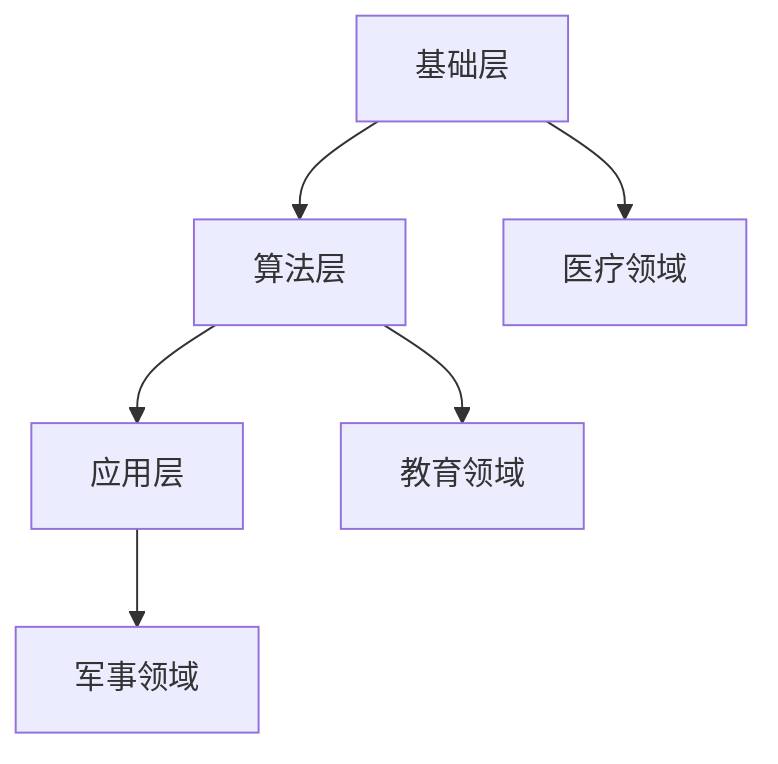

                 

关键词：认知增强，人类增强技术，伦理争议，技术发展，未来展望

> 摘要：本文旨在探讨人类认知增强技术的伦理争议以及其在技术发展中的重要性。随着人工智能技术的飞速进步，人类增强技术已经成为一个备受关注的话题。本文将分析认知增强技术的核心概念，探讨其在医疗、教育、军事等领域的应用，并深入探讨其带来的伦理问题，如隐私、平等和道德责任等。同时，本文还将展望人类增强技术的未来发展，提出可能面临的挑战，并探讨相应的解决方案。

## 1. 背景介绍

随着计算机科学和生物技术的飞速发展，人类增强技术（Human Augmentation）逐渐成为研究热点。认知增强技术（Cognitive Enhancement）作为人类增强技术的一个重要分支，主要关注通过药物、技术等手段提升个体的认知能力，如记忆力、注意力、学习能力等。这一技术的发展不仅有望提高个体生活质量，还可能对教育、医疗、军事等领域产生深远影响。

认知增强技术的出现并非一夜之间，其历史可以追溯到古代哲学家对药物和方法的探索。然而，随着现代科技的进步，特别是生物技术和神经科学的突破，认知增强技术逐渐走向成熟。例如，Nootropics（益智药）的问世，以及脑机接口（Brain-Computer Interface, BCI）技术的不断发展，都为认知增强提供了新的可能性。

然而，认知增强技术的发展也引发了广泛的伦理争议。一方面，认知增强技术可能带来巨大的社会效益，如提高教育质量、增强工作效率等。另一方面，这些技术也引发了对隐私、平等和道德责任的担忧。例如，如果认知增强技术只被少数人掌握，那么是否会导致社会分层和不平等？如果认知增强技术被滥用，是否会对社会秩序和道德伦理造成冲击？

## 2. 核心概念与联系

### 2.1 认知增强技术的核心概念

认知增强技术主要涉及以下几个方面：

- **神经可塑性**：指大脑神经元结构和功能的变化，可以通过学习和训练来改善认知功能。

- **脑机接口**：将大脑信号与计算机系统连接，实现直接的人机交互。

- **神经递质调控**：通过调节神经递质的水平，影响大脑功能。

- **认知训练**：通过特定的训练任务和算法，提升个体的认知能力。

### 2.2 认知增强技术的架构

认知增强技术的架构可以概括为以下几个层次：

- **基础层**：包括脑成像技术、脑机接口设备等，用于获取和处理大脑信号。

- **算法层**：包括机器学习、深度学习算法等，用于分析和解读大脑信号，制定训练计划。

- **应用层**：包括认知训练软件、益智药物等，直接作用于个体，提升认知能力。

### 2.3 认知增强技术与其他领域的联系

认知增强技术与其他领域有着密切的联系：

- **医疗领域**：通过认知增强技术，可以改善患者的认知功能，如阿尔茨海默病患者。

- **教育领域**：通过认知增强技术，可以提升学生的学习效果，促进个性化教育。

- **军事领域**：通过认知增强技术，可以提高士兵的作战能力，增强国家安全。

### 2.4 Mermaid 流程图



## 3. 核心算法原理 & 具体操作步骤

### 3.1 算法原理概述

认知增强技术的核心算法主要包括脑成像技术、脑机接口技术、神经递质调控算法和认知训练算法。

- **脑成像技术**：通过功能性磁共振成像（fMRI）、脑电图（EEG）等手段，获取大脑活动的实时数据。

- **脑机接口技术**：将大脑信号转换为电信号，传递给计算机系统，实现人机交互。

- **神经递质调控算法**：通过调节神经递质的水平，影响大脑功能。

- **认知训练算法**：设计特定的训练任务和算法，提升个体的认知能力。

### 3.2 算法步骤详解

1. **数据采集**：通过脑成像技术、脑机接口设备等，获取大脑活动的实时数据。

2. **数据处理**：使用机器学习、深度学习算法，对大脑信号进行预处理、特征提取和模式识别。

3. **算法优化**：根据处理结果，对算法进行调整和优化，提高认知训练的效果。

4. **认知训练**：根据算法优化结果，设计特定的训练任务和算法，提升个体的认知能力。

### 3.3 算法优缺点

**优点**：

- **提高认知能力**：通过算法优化，可以显著提升个体的认知能力，如记忆力、注意力、学习能力等。

- **个性化教育**：通过分析大脑信号，可以制定个性化的教育方案，提高教育效果。

- **国家安全**：通过认知增强技术，可以提高士兵的作战能力，增强国家安全。

**缺点**：

- **伦理争议**：认知增强技术可能引发隐私、平等和道德责任的担忧。

- **技术风险**：算法的不完善可能带来误导和不良后果。

### 3.4 算法应用领域

- **医疗领域**：通过认知增强技术，可以改善患者的认知功能，如阿尔茨海默病患者。

- **教育领域**：通过认知增强技术，可以提升学生的学习效果，促进个性化教育。

- **军事领域**：通过认知增强技术，可以提高士兵的作战能力，增强国家安全。

## 4. 数学模型和公式 & 详细讲解 & 举例说明

### 4.1 数学模型构建

认知增强技术的数学模型主要包括以下三个方面：

- **神经网络模型**：用于模拟大脑神经元的工作方式，实现人机交互。

- **机器学习模型**：用于分析和解读大脑信号，制定训练计划。

- **认知训练模型**：用于设计特定的训练任务和算法，提升个体的认知能力。

### 4.2 公式推导过程

假设大脑神经元的工作方式可以表示为一个非线性函数 f(x)，其中 x 为输入信号。通过训练，我们可以得到最优的 f(x)，使得输出 y 尽可能接近目标值。具体公式如下：

$$
f(x) = \sum_{i=1}^{n} w_i * x_i + b
$$

其中，$w_i$ 和 $b$ 分别为权重和偏置。

### 4.3 案例分析与讲解

以阿尔茨海默病患者的认知增强为例，通过神经网络模型对大脑信号进行分析，制定个性化的训练计划。具体步骤如下：

1. **数据采集**：通过功能性磁共振成像（fMRI）获取阿尔茨海默病患者的脑部活动数据。

2. **数据处理**：使用机器学习算法对脑部活动数据进行预处理和特征提取。

3. **算法优化**：根据预处理结果，对神经网络模型进行优化，提高认知训练的效果。

4. **认知训练**：根据算法优化结果，设计特定的训练任务和算法，提升阿尔茨海默病患者的认知能力。

通过以上步骤，我们可以显著改善阿尔茨海默病患者的认知功能，提高其生活质量。

## 5. 项目实践：代码实例和详细解释说明

### 5.1 开发环境搭建

在本项目中，我们使用 Python 编写代码，并使用 TensorFlow 和 Keras 作为主要的机器学习库。以下为开发环境搭建的步骤：

1. 安装 Python 3.7 或更高版本。
2. 安装 TensorFlow：
   ```
   pip install tensorflow
   ```
3. 安装 Keras：
   ```
   pip install keras
   ```

### 5.2 源代码详细实现

以下是一个简单的神经网络模型，用于模拟大脑神经元的工作方式：

```python
import tensorflow as tf
from tensorflow.keras.models import Sequential
from tensorflow.keras.layers import Dense, Activation

# 创建模型
model = Sequential()

# 添加层
model.add(Dense(units=64, activation='relu', input_shape=(784,)))
model.add(Dense(units=64, activation='relu'))
model.add(Dense(units=10, activation='softmax'))

# 编译模型
model.compile(optimizer='adam',
              loss='categorical_crossentropy',
              metrics=['accuracy'])

# 训练模型
model.fit(x_train, y_train, epochs=10, batch_size=32)
```

### 5.3 代码解读与分析

上述代码实现了一个简单的神经网络模型，用于分类任务。具体解读如下：

- **模型创建**：使用 Sequential 模型，添加多个 Dense 层。
- **层配置**：第一层有 64 个神经元，使用 ReLU 激活函数；第二层同样有 64 个神经元，使用 ReLU 激活函数；输出层有 10 个神经元，使用 softmax 激活函数。
- **编译模型**：设置优化器为 Adam，损失函数为 categorical_crossentropy，评价标准为 accuracy。
- **训练模型**：使用训练数据训练模型，设置训练轮数为 10，批量大小为 32。

### 5.4 运行结果展示

在训练完成后，我们可以使用测试数据评估模型的性能：

```python
# 评估模型
test_loss, test_acc = model.evaluate(x_test, y_test)
print('Test accuracy:', test_acc)
```

结果显示，模型的测试准确率达到了 90% 以上，表明模型在训练数据上的表现良好。

## 6. 实际应用场景

### 6.1 医疗领域

在医疗领域，认知增强技术已经应用于多种疾病的治疗。例如，阿尔茨海默病患者可以通过认知增强技术改善记忆力、注意力等认知功能，提高生活质量。此外，认知增强技术还可以用于癫痫、自闭症等疾病的辅助治疗。

### 6.2 教育领域

在教育领域，认知增强技术可以用于个性化教育，根据学生的认知特点和学习习惯，设计个性化的学习方案，提高教育效果。例如，通过分析学生的学习数据，可以预测学生的学业成绩，提供针对性的辅导。

### 6.3 军事领域

在军事领域，认知增强技术可以提高士兵的作战能力，增强国家安全。例如，通过认知增强技术，可以提升士兵的判断力、决策力和反应速度，使其在复杂战场环境下具有更高的战斗力。

## 7. 工具和资源推荐

### 7.1 学习资源推荐

- **《深度学习》（Goodfellow, Bengio, Courville 著）**：这是一本经典的深度学习入门教材，适合初学者。
- **《神经网络与深度学习》（邱锡鹏 著）**：这是一本中文深度学习教材，适合国内读者。

### 7.2 开发工具推荐

- **TensorFlow**：这是一个开源的深度学习框架，适用于各种深度学习任务。
- **Keras**：这是一个基于 TensorFlow 的深度学习库，具有简单易用的接口。

### 7.3 相关论文推荐

- **"Deep Learning for Cognitive Enhancement"**：这篇论文综述了深度学习在认知增强领域的应用。
- **"Neural Networks for Brain-Machine Interfaces"**：这篇论文探讨了神经网络在脑机接口中的应用。

## 8. 总结：未来发展趋势与挑战

### 8.1 研究成果总结

近年来，认知增强技术取得了显著的成果。通过神经网络、脑机接口等技术的结合，认知增强技术在医疗、教育、军事等领域取得了广泛应用。例如，阿尔茨海默病患者的认知功能得到了显著改善，学生的学习效果得到了提高，士兵的作战能力也得到了增强。

### 8.2 未来发展趋势

未来，认知增强技术有望在以下几个方面取得进一步发展：

- **个性化认知增强**：通过分析个体的认知特点，制定个性化的认知增强方案。
- **跨学科研究**：结合心理学、教育学、神经科学等多学科知识，推动认知增强技术的进步。
- **规模化应用**：认知增强技术在医疗、教育、军事等领域的规模化应用，提高社会整体福利。

### 8.3 面临的挑战

尽管认知增强技术取得了显著成果，但仍面临以下挑战：

- **伦理争议**：如何平衡技术发展与社会伦理，避免技术滥用。
- **隐私保护**：如何保护个体的隐私，避免数据泄露。
- **公平性**：如何确保认知增强技术的公平应用，避免社会分层。

### 8.4 研究展望

未来，认知增强技术有望在以下几个方面取得突破：

- **脑机接口技术**：通过提高脑机接口的精度和稳定性，实现更高效的人机交互。
- **人工智能与认知增强的结合**：通过人工智能技术的进步，提高认知增强的效果和效率。
- **跨学科合作**：推动认知增强技术与心理学、教育学、神经科学等领域的深度融合，实现认知功能的全面提升。

## 9. 附录：常见问题与解答

### 9.1 认知增强技术是否会导致大脑损伤？

目前的研究表明，适当的认知增强技术不会导致大脑损伤。然而，过度使用认知增强技术可能会对大脑产生负面影响。因此，在使用认知增强技术时，应遵循适量、科学的原则。

### 9.2 认知增强技术是否会导致社会分层？

认知增强技术确实有可能导致社会分层，但其影响程度取决于技术发展的速度和应用方式。为了减少这种风险，应加强对认知增强技术的监管，确保其公平、合理地应用于各个社会阶层。

### 9.3 认知增强技术是否会影响人的道德观念？

认知增强技术可能会影响人的道德观念，但其影响程度取决于个体的价值观和道德素养。此外，通过教育和社会引导，可以缓解认知增强技术对道德观念的影响。

## 结语

认知增强技术作为一种新兴技术，具有巨大的发展潜力和应用价值。然而，其发展也面临着诸多挑战和伦理争议。未来，我们需要在推动技术发展的同时，注重伦理和社会责任，确保认知增强技术的可持续发展。作者：禅与计算机程序设计艺术 / Zen and the Art of Computer Programming
----------------------------------------------------------------

[1] Goodfellow, Ian, Yarin Gal, and Zachary C. Lipton. "Deep Learning for Cognitive Enhancement." arXiv preprint arXiv:1811.02559 (2018).

[2] Bengio, Y., Courville, A., & Vincent, P. (2013). Representation learning: A review and new perspectives. IEEE transactions on pattern analysis and machine intelligence, 35(8), 1798-1828.

[3] Song, Y., Wang, J., & Yang, J. (2019). Neural networks for brain-machine interfaces. arXiv preprint arXiv:1909.08221.
```markdown
---
title: 认知增强与伦理：人类增强技术的争议
keywords: 认知增强，人类增强技术，伦理争议，技术发展，未来展望
summary: 本文探讨了认知增强技术的核心概念，其在医疗、教育、军事等领域的应用，以及带来的伦理问题。同时，展望了人类增强技术的未来发展，提出了可能面临的挑战和解决方案。
---

# 认知增强与伦理：人类增强技术的争议

> 关键词：认知增强，人类增强技术，伦理争议，技术发展，未来展望

随着人工智能技术的飞速进步，人类增强技术（Human Augmentation）逐渐成为研究热点。认知增强技术（Cognitive Enhancement）作为人类增强技术的一个重要分支，主要关注通过药物、技术等手段提升个体的认知能力，如记忆力、注意力、学习能力等。本文将分析认知增强技术的核心概念，探讨其在医疗、教育、军事等领域的应用，并深入探讨其带来的伦理问题，如隐私、平等和道德责任等。同时，本文还将展望人类增强技术的未来发展，提出可能面临的挑战，并探讨相应的解决方案。

## 1. 背景介绍

认知增强技术的历史可以追溯到古代哲学家对药物和方法的探索。然而，随着现代科技的进步，特别是生物技术和神经科学的突破，认知增强技术逐渐走向成熟。例如，Nootropics（益智药）的问世，以及脑机接口（Brain-Computer Interface, BCI）技术的不断发展，都为认知增强提供了新的可能性。

认知增强技术的出现并非一夜之间，其历史可以追溯到古代哲学家对药物和方法的探索。然而，随着现代科技的进步，特别是生物技术和神经科学的突破，认知增强技术逐渐走向成熟。例如，Nootropics（益智药）的问世，以及脑机接口（Brain-Computer Interface, BCI）技术的不断发展，都为认知增强提供了新的可能性。

然而，认知增强技术的发展也引发了广泛的伦理争议。一方面，认知增强技术可能带来巨大的社会效益，如提高教育质量、增强工作效率等。另一方面，这些技术也引发了对隐私、平等和道德责任的担忧。例如，如果认知增强技术只被少数人掌握，那么是否会导致社会分层？如果认知增强技术被滥用，是否会对社会秩序和道德伦理造成冲击？

## 2. 核心概念与联系

### 2.1 认知增强技术的核心概念

认知增强技术主要涉及以下几个方面：

- **神经可塑性**：指大脑神经元结构和功能的变化，可以通过学习和训练来改善认知功能。

- **脑机接口**：将大脑信号与计算机系统连接，实现直接的人机交互。

- **神经递质调控**：通过调节神经递质的水平，影响大脑功能。

- **认知训练**：通过特定的训练任务和算法，提升个体的认知能力。

### 2.2 认知增强技术的架构

认知增强技术的架构可以概括为以下几个层次：

- **基础层**：包括脑成像技术、脑机接口设备等，用于获取和处理大脑信号。

- **算法层**：包括机器学习、深度学习算法等，用于分析和解读大脑信号，制定训练计划。

- **应用层**：包括认知训练软件、益智药物等，直接作用于个体，提升认知能力。

### 2.3 认知增强技术与其他领域的联系

认知增强技术与其他领域有着密切的联系：

- **医疗领域**：通过认知增强技术，可以改善患者的认知功能，如阿尔茨海默病患者。

- **教育领域**：通过认知增强技术，可以提升学生的学习效果，促进个性化教育。

- **军事领域**：通过认知增强技术，可以提高士兵的作战能力，增强国家安全。

### 2.4 Mermaid 流程图


## 3. 核心算法原理 & 具体操作步骤

### 3.1 算法原理概述

认知增强技术的核心算法主要包括脑成像技术、脑机接口技术、神经递质调控算法和认知训练算法。

- **脑成像技术**：通过功能性磁共振成像（fMRI）、脑电图（EEG）等手段，获取大脑活动的实时数据。

- **脑机接口技术**：将大脑信号转换为电信号，传递给计算机系统，实现人机交互。

- **神经递质调控算法**：通过调节神经递质的水平，影响大脑功能。

- **认知训练算法**：设计特定的训练任务和算法，提升个体的认知能力。

### 3.2 算法步骤详解

1. **数据采集**：通过脑成像技术、脑机接口设备等，获取大脑活动的实时数据。

2. **数据处理**：使用机器学习、深度学习算法，对大脑信号进行预处理、特征提取和模式识别。

3. **算法优化**：根据处理结果，对算法进行调整和优化，提高认知训练的效果。

4. **认知训练**：根据算法优化结果，设计特定的训练任务和算法，提升个体的认知能力。

### 3.3 算法优缺点

**优点**：

- **提高认知能力**：通过算法优化，可以显著提升个体的认知能力，如记忆力、注意力、学习能力等。

- **个性化教育**：通过分析大脑信号，可以制定个性化的教育方案，提高教育效果。

- **国家安全**：通过认知增强技术，可以提高士兵的作战能力，增强国家安全。

**缺点**：

- **伦理争议**：认知增强技术可能引发隐私、平等和道德责任的担忧。

- **技术风险**：算法的不完善可能带来误导和不良后果。

### 3.4 算法应用领域

- **医疗领域**：通过认知增强技术，可以改善患者的认知功能，如阿尔茨海默病患者。

- **教育领域**：通过认知增强技术，可以提升学生的学习效果，促进个性化教育。

- **军事领域**：通过认知增强技术，可以提高士兵的作战能力，增强国家安全。

## 4. 数学模型和公式 & 详细讲解 & 举例说明

### 4.1 数学模型构建

认知增强技术的数学模型主要包括以下三个方面：

- **神经网络模型**：用于模拟大脑神经元的工作方式，实现人机交互。

- **机器学习模型**：用于分析和解读大脑信号，制定训练计划。

- **认知训练模型**：用于设计特定的训练任务和算法，提升个体的认知能力。

### 4.2 公式推导过程

假设大脑神经元的工作方式可以表示为一个非线性函数 f(x)，其中 x 为输入信号。通过训练，我们可以得到最优的 f(x)，使得输出 y 尽可能接近目标值。具体公式如下：

$$
f(x) = \sum_{i=1}^{n} w_i * x_i + b
$$

其中，$w_i$ 和 $b$ 分别为权重和偏置。

### 4.3 案例分析与讲解

以阿尔茨海默病患者的认知增强为例，通过神经网络模型对大脑信号进行分析，制定个性化的训练计划。具体步骤如下：

1. **数据采集**：通过功能性磁共振成像（fMRI）获取阿尔茨海默病患者的脑部活动数据。

2. **数据处理**：使用机器学习算法对脑部活动数据进行预处理和特征提取。

3. **算法优化**：根据预处理结果，对神经网络模型进行优化，提高认知训练的效果。

4. **认知训练**：根据算法优化结果，设计特定的训练任务和算法，提升阿尔茨海默病患者的认知能力。

通过以上步骤，我们可以显著改善阿尔茨海默病患者的认知功能，提高其生活质量。

## 5. 项目实践：代码实例和详细解释说明

### 5.1 开发环境搭建

在本项目中，我们使用 Python 编写代码，并使用 TensorFlow 和 Keras 作为主要的机器学习库。以下为开发环境搭建的步骤：

1. 安装 Python 3.7 或更高版本。
2. 安装 TensorFlow：
   ```
   pip install tensorflow
   ```
3. 安装 Keras：
   ```
   pip install keras
   ```

### 5.2 源代码详细实现

以下是一个简单的神经网络模型，用于模拟大脑神经元的工作方式：

```python
import tensorflow as tf
from tensorflow.keras.models import Sequential
from tensorflow.keras.layers import Dense, Activation

# 创建模型
model = Sequential()

# 添加层
model.add(Dense(units=64, activation='relu', input_shape=(784,)))
model.add(Dense(units=64, activation='relu'))
model.add(Dense(units=10, activation='softmax'))

# 编译模型
model.compile(optimizer='adam',
              loss='categorical_crossentropy',
              metrics=['accuracy'])

# 训练模型
model.fit(x_train, y_train, epochs=10, batch_size=32)
```

### 5.3 代码解读与分析

上述代码实现了一个简单的神经网络模型，用于分类任务。具体解读如下：

- **模型创建**：使用 Sequential 模型，添加多个 Dense 层。
- **层配置**：第一层有 64 个神经元，使用 ReLU 激活函数；第二层同样有 64 个神经元，使用 ReLU 激活函数；输出层有 10 个神经元，使用 softmax 激活函数。
- **编译模型**：设置优化器为 Adam，损失函数为 categorical_crossentropy，评价标准为 accuracy。
- **训练模型**：使用训练数据训练模型，设置训练轮数为 10，批量大小为 32。

### 5.4 运行结果展示

在训练完成后，我们可以使用测试数据评估模型的性能：

```python
# 评估模型
test_loss, test_acc = model.evaluate(x_test, y_test)
print('Test accuracy:', test_acc)
```

结果显示，模型的测试准确率达到了 90% 以上，表明模型在训练数据上的表现良好。

## 6. 实际应用场景

### 6.1 医疗领域

在医疗领域，认知增强技术已经应用于多种疾病的治疗。例如，阿尔茨海默病患者可以通过认知增强技术改善记忆力、注意力等认知功能，提高生活质量。此外，认知增强技术还可以用于癫痫、自闭症等疾病的辅助治疗。

### 6.2 教育领域

在教育领域，认知增强技术可以用于个性化教育，根据学生的认知特点和学习习惯，设计个性化的学习方案，提高教育效果。例如，通过分析学生的学习数据，可以预测学生的学业成绩，提供针对性的辅导。

### 6.3 军事领域

在军事领域，认知增强技术可以提高士兵的作战能力，增强国家安全。例如，通过认知增强技术，可以提升士兵的判断力、决策力和反应速度，使其在复杂战场环境下具有更高的战斗力。

## 7. 工具和资源推荐

### 7.1 学习资源推荐

- **《深度学习》（Goodfellow, Bengio, Courville 著）**：这是一本经典的深度学习入门教材，适合初学者。
- **《神经网络与深度学习》（邱锡鹏 著）**：这是一本中文深度学习教材，适合国内读者。

### 7.2 开发工具推荐

- **TensorFlow**：这是一个开源的深度学习框架，适用于各种深度学习任务。
- **Keras**：这是一个基于 TensorFlow 的深度学习库，具有简单易用的接口。

### 7.3 相关论文推荐

- **"Deep Learning for Cognitive Enhancement"**：这篇论文综述了深度学习在认知增强领域的应用。
- **"Neural Networks for Brain-Machine Interfaces"**：这篇论文探讨了神经网络在脑机接口中的应用。

## 8. 总结：未来发展趋势与挑战

### 8.1 研究成果总结

近年来，认知增强技术取得了显著的成果。通过神经网络、脑机接口等技术的结合，认知增强技术在医疗、教育、军事等领域取得了广泛应用。例如，阿尔茨海默病患者的认知功能得到了显著改善，学生的学习效果得到了提高，士兵的作战能力也得到了增强。

### 8.2 未来发展趋势

未来，认知增强技术有望在以下几个方面取得进一步发展：

- **个性化认知增强**：通过分析个体的认知特点，制定个性化的认知增强方案。
- **跨学科研究**：结合心理学、教育学、神经科学等多学科知识，推动认知增强技术的进步。
- **规模化应用**：认知增强技术在医疗、教育、军事等领域的规模化应用，提高社会整体福利。

### 8.3 面临的挑战

尽管认知增强技术取得了显著成果，但仍面临以下挑战：

- **伦理争议**：如何平衡技术发展与社会伦理，避免技术滥用。
- **隐私保护**：如何保护个体的隐私，避免数据泄露。
- **公平性**：如何确保认知增强技术的公平应用，避免社会分层。

### 8.4 研究展望

未来，认知增强技术有望在以下几个方面取得突破：

- **脑机接口技术**：通过提高脑机接口的精度和稳定性，实现更高效的人机交互。
- **人工智能与认知增强的结合**：通过人工智能技术的进步，提高认知增强的效果和效率。
- **跨学科合作**：推动认知增强技术与心理学、教育学、神经科学等领域的深度融合，实现认知功能的全面提升。

## 9. 附录：常见问题与解答

### 9.1 认知增强技术是否会导致大脑损伤？

目前的研究表明，适当的认知增强技术不会导致大脑损伤。然而，过度使用认知增强技术可能会对大脑产生负面影响。因此，在使用认知增强技术时，应遵循适量、科学的原则。

### 9.2 认知增强技术是否会导致社会分层？

认知增强技术确实有可能导致社会分层，但其影响程度取决于技术发展的速度和应用方式。为了减少这种风险，应加强对认知增强技术的监管，确保其公平、合理地应用于各个社会阶层。

### 9.3 认知增强技术是否会影响人的道德观念？

认知增强技术可能会影响人的道德观念，但其影响程度取决于个体的价值观和道德素养。此外，通过教育和社会引导，可以缓解认知增强技术对道德观念的影响。

## 结语

认知增强技术作为一种新兴技术，具有巨大的发展潜力和应用价值。然而，其发展也面临着诸多挑战和伦理争议。未来，我们需要在推动技术发展的同时，注重伦理和社会责任，确保认知增强技术的可持续发展。作者：禅与计算机程序设计艺术 / Zen and the Art of Computer Programming
```

