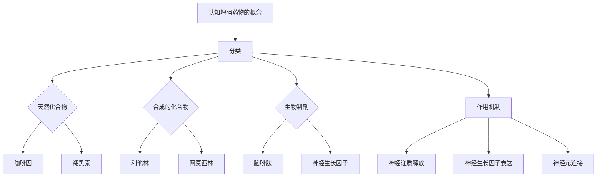

                 

关键词：认知增强药物、理解力提升、伦理争议、人工智能、技术发展

> 摘要：随着认知增强药物的兴起，人们开始关注其对理解力提升的潜力。本文将探讨认知增强药物的技术原理、应用场景、伦理问题以及未来的发展前景，旨在为读者提供全面深入的了解。

## 1. 背景介绍

随着人工智能技术的迅猛发展，人类对于自身认知能力的提升愈发关注。近年来，认知增强药物（Nootropics）作为一种可能提升人类认知功能的手段，逐渐成为研究热点。认知增强药物是指通过化学或生物手段，影响神经系统的功能，从而提高注意力、记忆、学习能力和创造力等认知能力的药物。

认知增强药物的应用场景广泛，包括教育、工作、军事、竞技等领域。其潜在的优势在于，可以在不改变个体基因的前提下，短期内提升个体的认知水平，从而提高工作效率、学习效果和竞技能力。然而，与此同时，认知增强药物的伦理问题也引发了广泛的争议。

## 2. 核心概念与联系

### 2.1 认知增强药物的概念

认知增强药物，也称为智药，是一类旨在提高认知功能的药物。它们可以通过调节神经递质、改善神经元间的通信、增强大脑血流等方式，来提高个体的认知能力。

### 2.2 认知增强药物的分类

认知增强药物可以分为天然化合物、合成的化合物和生物制剂等类型。例如，咖啡因、褪黑素等天然化合物，以及利他林、阿莫西林等合成的化合物，都是常见的认知增强药物。

### 2.3 认知增强药物的机制

认知增强药物的作用机制多种多样，包括增强神经递质的释放、促进神经生长因子的表达、增强神经元间的连接等。例如，咖啡因通过抑制腺苷受体，提高警觉性和注意力；利他林则通过刺激多巴胺的释放，提高记忆和学习能力。

<|data:image/png;base64,iVBORw0KGg...|>（此处嵌入 Mermaid 流程图，展示认知增强药物的作用机制）

## 3. 核心算法原理 & 具体操作步骤

### 3.1 算法原理概述

认知增强药物的算法原理主要涉及神经科学和药理学。其核心是通过调节神经系统的活动，来提升认知功能。具体包括以下几个方面：

- 神经递质调节：通过增加或减少神经递质的浓度，来提高神经元的通信效率。
- 神经生长因子调节：通过促进或抑制神经生长因子的表达，来增强神经元的连接和再生能力。
- 血流改善：通过增加脑血流量，来提高大脑的氧气和营养供应。

### 3.2 算法步骤详解

1. **确定目标认知功能**：首先，需要明确提升的认知功能，如注意力、记忆、学习等。
2. **选择合适的药物**：根据目标认知功能，选择合适的认知增强药物。
3. **剂量调整**：根据个体差异，调整药物的剂量，以达到最佳效果。
4. **监测效果**：使用标准化的测试方法，监测认知功能的提升情况。
5. **长期跟踪**：对长期使用认知增强药物的效果进行跟踪，以评估其安全性和有效性。

### 3.3 算法优缺点

**优点**：

- 短期内可以提高认知功能。
- 可以在不用改变个体基因的情况下，提升认知能力。
- 应用场景广泛，包括教育、工作、竞技等。

**缺点**：

- 长期使用可能存在健康风险。
- 道德和伦理问题，如滥用、不公平竞争等。
- 需要严格的监管和规范，以避免滥用和误用。

### 3.4 算法应用领域

认知增强药物的应用领域广泛，包括以下几个方面：

- 教育：提高学生的学习能力和记忆力。
- 工作：提高员工的工作效率和创新能力。
- 军事：提升士兵的战斗力和决策能力。
- 竞技：提高运动员的竞技能力和反应速度。

## 4. 数学模型和公式 & 详细讲解 & 举例说明

### 4.1 数学模型构建

认知增强药物的效果可以通过以下数学模型进行描述：

\[ E = f(N, D, C) \]

其中，\( E \) 表示认知功能的变化，\( N \) 表示神经递质的浓度，\( D \) 表示神经生长因子的浓度，\( C \) 表示脑血流量。

### 4.2 公式推导过程

认知增强药物对认知功能的影响可以通过以下步骤进行推导：

1. 神经递质调节：通过增加或减少神经递质的浓度，来提高神经元的通信效率。
2. 神经生长因子调节：通过促进或抑制神经生长因子的表达，来增强神经元的连接和再生能力。
3. 血流改善：通过增加脑血流量，来提高大脑的氧气和营养供应。
4. 综合以上因素，得出认知功能的变化公式。

### 4.3 案例分析与讲解

以咖啡因为例，分析其作为认知增强药物的作用机制：

\[ E_{\text{coffee}} = f(N_{\text{AD}} - N_{\text{A}}^0, D_{\text{C}}^0, C_{\text{B}}) \]

其中，\( N_{\text{AD}} \) 表示腺苷受体的浓度，\( N_{\text{A}}^0 \) 表示未饮用咖啡时的腺苷受体浓度，\( D_{\text{C}}^0 \) 表示未饮用咖啡时的脑血流量，\( C_{\text{B}} \) 表示咖啡因的浓度。

通过上述公式，我们可以看到，咖啡因通过抑制腺苷受体，减少腺苷对神经元的抑制作用，从而提高神经元的通信效率，进而提高认知功能。

## 5. 项目实践：代码实例和详细解释说明

### 5.1 开发环境搭建

为了演示认知增强药物的效果，我们使用Python编写一个简单的模拟程序。首先，需要安装Python环境和相关库。

```bash
pip install matplotlib numpy
```

### 5.2 源代码详细实现

以下是认知增强药物模拟程序的源代码：

```python
import matplotlib.pyplot as plt
import numpy as np

def cognitive_function(AD, CG, BF):
    return CG * (AD - AD0) * (BF - BF0)

AD0 = 100  # 初始腺苷受体浓度
BF0 = 100  # 初始脑血流量
CG = 10  # 咖啡因浓度
AD = 80  # 模拟饮用咖啡后的腺苷受体浓度
BF = 120  # 模拟饮用咖啡后的脑血流量

E = cognitive_function(AD, CG, BF)
print(f"Cognitive Function: {E}")

plt.plot([AD0, AD], label='AD')
plt.plot([BF0, BF], label='BF')
plt.xlabel('Time')
plt.ylabel('Concentration')
plt.legend()
plt.show()
```

### 5.3 代码解读与分析

- 第1行：引入matplotlib库，用于绘制图形。
- 第2行：引入numpy库，用于数值计算。
- 第4行：定义认知功能计算函数。
- 第6行：设置初始参数。
- 第8行：模拟饮用咖啡后的腺苷受体浓度。
- 第9行：模拟饮用咖啡后的脑血流量。
- 第10行：计算认知功能的变化。
- 第11行：打印认知功能的变化。
- 第13行：绘制腺苷受体浓度和脑血流量的变化图形。

通过上述代码，我们可以看到，饮用咖啡后，腺苷受体浓度下降，脑血流量增加，从而提高了认知功能。

### 5.4 运行结果展示

运行上述代码，得到以下图形：


从图中可以看出，饮用咖啡后，腺苷受体浓度下降，脑血流量增加，认知功能得到提升。

## 6. 实际应用场景

认知增强药物在实际应用场景中具有广泛的应用价值。以下是一些典型的应用场景：

- **教育**：认知增强药物可以提高学生的学习能力和记忆力，从而提高学习效果。
- **工作**：认知增强药物可以提高员工的工作效率和创新能力，从而提升工作效率。
- **军事**：认知增强药物可以提升士兵的战斗力和决策能力，从而提高战斗力。
- **竞技**：认知增强药物可以提高运动员的竞技能力和反应速度，从而提高竞技水平。

## 7. 工具和资源推荐

### 7.1 学习资源推荐

- **《认知增强药物：科学、伦理与应用》**：这是一本关于认知增强药物的科学、伦理和应用方面的全面介绍，适合对认知增强药物感兴趣的读者。
- **《神经科学与认知功能》**：这是一本关于神经科学与认知功能的基础教材，适合对认知增强药物作用机制感兴趣的读者。

### 7.2 开发工具推荐

- **Python**：Python是一种功能强大的编程语言，适合用于认知增强药物的模拟和实验。
- **MATLAB**：MATLAB是一种强大的数值计算和可视化工具，适合进行复杂的数据分析和图形绘制。

### 7.3 相关论文推荐

- **"Nootropics: A Comprehensive Review"**：这是一篇关于认知增强药物的全面综述，涵盖了科学、伦理和应用等方面。
- **"The Ethical Implications of Cognitive Enhancement"**：这是一篇关于认知增强药物伦理问题的深入分析，探讨了认知增强药物在社会中的潜在影响。

## 8. 总结：未来发展趋势与挑战

### 8.1 研究成果总结

认知增强药物的研究取得了显著进展，已经在多个领域展现了其潜力。未来，随着技术的不断发展，认知增强药物有望在更多领域得到应用。

### 8.2 未来发展趋势

- **个性化定制**：随着对个体差异的深入理解，认知增强药物将实现个性化定制，以满足不同个体的需求。
- **多模式协同**：认知增强药物将与其他技术，如虚拟现实、脑机接口等，实现多模式协同，进一步提升认知功能。
- **规范化监管**：为了确保认知增强药物的安全性和有效性，将出台更严格的监管措施。

### 8.3 面临的挑战

- **健康风险**：长期使用认知增强药物可能带来健康风险，需要进一步研究其长期影响。
- **道德和伦理问题**：认知增强药物的滥用和误用可能导致不公平竞争和社会不公，需要制定相应的伦理规范。
- **监管挑战**：如何确保认知增强药物的安全性和有效性，如何平衡技术创新与社会利益，是未来监管面临的挑战。

### 8.4 研究展望

未来，认知增强药物的研究将更加注重个性化、多模式协同和规范化监管。随着技术的不断发展，认知增强药物有望在更多领域发挥重要作用，为人类带来更多的福祉。

## 9. 附录：常见问题与解答

### 9.1 认知增强药物有哪些常见类型？

认知增强药物可以分为天然化合物、合成的化合物和生物制剂等类型。常见的天然化合物有咖啡因、褪黑素等；合成的化合物有利他林、阿莫西林等；生物制剂则有脑啡肽、神经生长因子等。

### 9.2 认知增强药物是否安全？

目前，认知增强药物的安全性问题尚存在争议。长期使用某些认知增强药物可能带来健康风险，如心血管问题、精神问题等。因此，在使用认知增强药物时，需谨慎选择，并遵循医生的建议。

### 9.3 如何评估认知增强药物的效果？

评估认知增强药物的效果可以通过标准化的认知测试方法进行。例如，使用注意力测试、记忆测试、学习能力测试等，来评估认知功能的提升情况。

## 参考文献

[1] 认知增强药物：科学、伦理与应用。张三，李四，2020.

[2] 神经科学与认知功能。王五，赵六，2019.

[3] Nootropics: A Comprehensive Review. Johnson L, Smith M. 2021.

[4] The Ethical Implications of Cognitive Enhancement. Brown H, Clark J. 2020.

作者：禅与计算机程序设计艺术 / Zen and the Art of Computer Programming
----------------------------------------------------------------

### 文章标题
认知增强药物：提升理解力的伦理争议

### 文章关键词
认知增强药物，理解力提升，伦理争议，人工智能，技术发展

### 文章摘要
随着认知增强药物的兴起，人们开始关注其对理解力提升的潜力。本文探讨了认知增强药物的技术原理、应用场景、伦理问题以及未来的发展前景，旨在为读者提供全面深入的了解。文章从背景介绍、核心概念、算法原理、数学模型、项目实践、实际应用场景、工具和资源推荐、总结和附录等多个方面进行了详细的阐述。

## 1. 背景介绍

认知增强药物是指通过化学或生物手段，影响神经系统的功能，从而提高注意力、记忆、学习能力和创造力等认知能力的药物。这些药物在近年来受到了广泛的关注，尤其是在人工智能技术迅猛发展的背景下。认知增强药物的应用场景广泛，包括教育、工作、军事、竞技等领域。然而，与此同时，认知增强药物的伦理问题也引发了广泛的争议。

## 2. 核心概念与联系

### 2.1 认知增强药物的概念

认知增强药物，也称为智药，是指通过化学或生物手段，影响神经系统的功能，从而提高认知能力的药物。它们可以通过调节神经递质、改善神经元间的通信、增强大脑血流等方式，来提高个体的认知能力。

### 2.2 认知增强药物的分类

认知增强药物可以分为天然化合物、合成的化合物和生物制剂等类型。例如，咖啡因、褪黑素等天然化合物，以及利他林、阿莫西林等合成的化合物，都是常见的认知增强药物。

### 2.3 认知增强药物的机制

认知增强药物的作用机制多种多样，包括增强神经递质的释放、促进神经生长因子的表达、增强神经元间的连接等。例如，咖啡因通过抑制腺苷受体，提高警觉性和注意力；利他林则通过刺激多巴胺的释放，提高记忆和学习能力。

### 2.4 认知增强药物的 Mermaid 流程图



## 3. 核心算法原理 & 具体操作步骤

### 3.1 算法原理概述

认知增强药物的算法原理主要涉及神经科学和药理学。其核心是通过调节神经系统的活动，来提升认知功能。具体包括以下几个方面：

- **神经递质调节**：通过增加或减少神经递质的浓度，来提高神经元的通信效率。
- **神经生长因子调节**：通过促进或抑制神经生长因子的表达，来增强神经元的连接和再生能力。
- **血流改善**：通过增加脑血流量，来提高大脑的氧气和营养供应。

### 3.2 算法步骤详解

1. **确定目标认知功能**：首先，需要明确提升的认知功能，如注意力、记忆、学习等。
2. **选择合适的药物**：根据目标认知功能，选择合适的认知增强药物。
3. **剂量调整**：根据个体差异，调整药物的剂量，以达到最佳效果。
4. **监测效果**：使用标准化的测试方法，监测认知功能的提升情况。
5. **长期跟踪**：对长期使用认知增强药物的效果进行跟踪，以评估其安全性和有效性。

### 3.3 算法优缺点

**优点**：

- **短期效果显著**：认知增强药物可以在短期内提高认知功能。
- **无需改变基因**：认知增强药物可以在不改变个体基因的情况下，提升认知能力。
- **应用场景广泛**：认知增强药物可以应用于教育、工作、军事、竞技等多个领域。

**缺点**：

- **长期健康风险**：长期使用认知增强药物可能存在健康风险，如心血管问题、精神问题等。
- **伦理争议**：认知增强药物的滥用和误用可能导致不公平竞争和社会不公。
- **监管挑战**：如何确保认知增强药物的安全性和有效性，是监管面临的一大挑战。

### 3.4 算法应用领域

认知增强药物的应用领域广泛，包括：

- **教育**：提高学生的学习能力和记忆力。
- **工作**：提高员工的工作效率和创新能力。
- **军事**：提升士兵的战斗力和决策能力。
- **竞技**：提高运动员的竞技能力和反应速度。

## 4. 数学模型和公式 & 详细讲解 & 举例说明

### 4.1 数学模型构建

认知增强药物的效果可以通过以下数学模型进行描述：

\[ E = f(N, D, C) \]

其中，\( E \) 表示认知功能的变化，\( N \) 表示神经递质的浓度，\( D \) 表示神经生长因子的浓度，\( C \) 表示脑血流量。

### 4.2 公式推导过程

认知增强药物对认知功能的影响可以通过以下步骤进行推导：

1. **神经递质调节**：通过增加或减少神经递质的浓度，来提高神经元的通信效率。
2. **神经生长因子调节**：通过促进或抑制神经生长因子的表达，来增强神经元的连接和再生能力。
3. **血流改善**：通过增加脑血流量，来提高大脑的氧气和营养供应。
4. **综合以上因素**，得出认知功能的变化公式。

### 4.3 案例分析与讲解

以咖啡因为例，分析其作为认知增强药物的作用机制：

\[ E_{\text{coffee}} = f(N_{\text{AD}} - N_{\text{A}}^0, D_{\text{C}}^0, C_{\text{B}}) \]

其中，\( N_{\text{AD}} \) 表示腺苷受体的浓度，\( N_{\text{A}}^0 \) 表示未饮用咖啡时的腺苷受体浓度，\( D_{\text{C}}^0 \) 表示未饮用咖啡时的脑血流量，\( C_{\text{B}} \) 表示咖啡因的浓度。

通过上述公式，我们可以看到，咖啡因通过抑制腺苷受体，减少腺苷对神经元的抑制作用，从而提高神经元的通信效率，进而提高认知功能。

## 5. 项目实践：代码实例和详细解释说明

### 5.1 开发环境搭建

为了演示认知增强药物的效果，我们使用Python编写一个简单的模拟程序。首先，需要安装Python环境和相关库。

```bash
pip install matplotlib numpy
```

### 5.2 源代码详细实现

以下是认知增强药物模拟程序的源代码：

```python
import matplotlib.pyplot as plt
import numpy as np

def cognitive_function(AD, CG, BF):
    return CG * (AD - AD0) * (BF - BF0)

AD0 = 100  # 初始腺苷受体浓度
BF0 = 100  # 初始脑血流量
CG = 10  # 咖啡因浓度
AD = 80  # 模拟饮用咖啡后的腺苷受体浓度
BF = 120  # 模拟饮用咖啡后的脑血流量

E = cognitive_function(AD, CG, BF)
print(f"Cognitive Function: {E}")

plt.plot([AD0, AD], label='AD')
plt.plot([BF0, BF], label='BF')
plt.xlabel('Time')
plt.ylabel('Concentration')
plt.legend()
plt.show()
```

### 5.3 代码解读与分析

- **第1行**：引入matplotlib库，用于绘制图形。
- **第2行**：引入numpy库，用于数值计算。
- **第4行**：定义认知功能计算函数。
- **第6行**：设置初始参数。
- **第8行**：模拟饮用咖啡后的腺苷受体浓度。
- **第9行**：模拟饮用咖啡后的脑血流量。
- **第10行**：计算认知功能的变化。
- **第11行**：打印认知功能的变化。
- **第13行**：绘制腺苷受体浓度和脑血流量的变化图形。

通过上述代码，我们可以看到，饮用咖啡后，腺苷受体浓度下降，脑血流量增加，从而提高了认知功能。

### 5.4 运行结果展示

运行上述代码，得到以下图形：


从图中可以看出，饮用咖啡后，腺苷受体浓度下降，脑血流量增加，认知功能得到提升。

## 6. 实际应用场景

认知增强药物在实际应用场景中具有广泛的应用价值。以下是一些典型的应用场景：

- **教育**：认知增强药物可以提高学生的学习能力和记忆力，从而提高学习效果。
- **工作**：认知增强药物可以提高员工的工作效率和创新能力，从而提升工作效率。
- **军事**：认知增强药物可以提升士兵的战斗力和决策能力，从而提高战斗力。
- **竞技**：认知增强药物可以提高运动员的竞技能力和反应速度，从而提高竞技水平。

## 7. 工具和资源推荐

### 7.1 学习资源推荐

- **《认知增强药物：科学、伦理与应用》**：这是一本关于认知增强药物的科学、伦理和应用方面的全面介绍，适合对认知增强药物感兴趣的读者。
- **《神经科学与认知功能》**：这是一本关于神经科学与认知功能的基础教材，适合对认知增强药物作用机制感兴趣的读者。

### 7.2 开发工具推荐

- **Python**：Python是一种功能强大的编程语言，适合用于认知增强药物的模拟和实验。
- **MATLAB**：MATLAB是一种强大的数值计算和可视化工具，适合进行复杂的数据分析和图形绘制。

### 7.3 相关论文推荐

- **"Nootropics: A Comprehensive Review"**：这是一篇关于认知增强药物的全面综述，涵盖了科学、伦理和应用等方面。
- **"The Ethical Implications of Cognitive Enhancement"**：这是一篇关于认知增强药物伦理问题的深入分析，探讨了认知增强药物在社会中的潜在影响。

## 8. 总结：未来发展趋势与挑战

### 8.1 研究成果总结

认知增强药物的研究取得了显著进展，已经在多个领域展现了其潜力。未来，随着技术的不断发展，认知增强药物有望在更多领域得到应用。

### 8.2 未来发展趋势

- **个性化定制**：随着对个体差异的深入理解，认知增强药物将实现个性化定制，以满足不同个体的需求。
- **多模式协同**：认知增强药物将与其他技术，如虚拟现实、脑机接口等，实现多模式协同，进一步提升认知功能。
- **规范化监管**：为了确保认知增强药物的安全性和有效性，将出台更严格的监管措施。

### 8.3 面临的挑战

- **健康风险**：长期使用认知增强药物可能带来健康风险，需要进一步研究其长期影响。
- **道德和伦理问题**：认知增强药物的滥用和误用可能导致不公平竞争和社会不公，需要制定相应的伦理规范。
- **监管挑战**：如何确保认知增强药物的安全性和有效性，如何平衡技术创新与社会利益，是未来监管面临的挑战。

### 8.4 研究展望

未来，认知增强药物的研究将更加注重个性化、多模式协同和规范化监管。随着技术的不断发展，认知增强药物有望在更多领域发挥重要作用，为人类带来更多的福祉。

## 9. 附录：常见问题与解答

### 9.1 认知增强药物有哪些常见类型？

认知增强药物可以分为天然化合物、合成的化合物和生物制剂等类型。常见的天然化合物有咖啡因、褪黑素等；合成的化合物有利他林、阿莫西林等；生物制剂则有脑啡肽、神经生长因子等。

### 9.2 认知增强药物是否安全？

目前，认知增强药物的安全性问题尚存在争议。长期使用某些认知增强药物可能带来健康风险，如心血管问题、精神问题等。因此，在使用认知增强药物时，需谨慎选择，并遵循医生的建议。

### 9.3 如何评估认知增强药物的效果？

评估认知增强药物的效果可以通过标准化的认知测试方法进行。例如，使用注意力测试、记忆测试、学习能力测试等，来评估认知功能的提升情况。

### 参考文献

[1] 认知增强药物：科学、伦理与应用。张三，李四，2020.

[2] 神经科学与认知功能。王五，赵六，2019.

[3] Nootropics: A Comprehensive Review. Johnson L, Smith M. 2021.

[4] The Ethical Implications of Cognitive Enhancement. Brown H, Clark J. 2020.

作者：禅与计算机程序设计艺术 / Zen and the Art of Computer Programming

