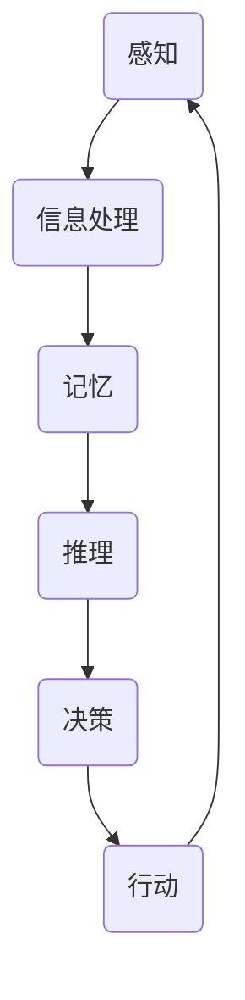

                 

在人工智能领域，认知的形式化是一个重要的研究方向。它不仅仅涉及到对人类思维的模拟，还涉及到对思维过程的量化分析。本文将探讨认知的形式化，特别是在思维作为认知空间中内在思考的角色的基础上，提出一个综合性的框架来理解这一过程。本文结构如下：

## 摘要

认知的形式化是连接人类智能与计算机模拟的关键。本文首先介绍了认知的形式化背景及其重要性，然后深入探讨了思维在认知空间中的内在角色。通过构建一个概念性的模型，我们分析了思维过程的各个方面，包括感知、推理、决策和创造力。此外，本文还探讨了如何使用数学模型和算法来模拟这些过程，并提供了实际的项目实践案例。最后，文章展望了这一领域未来的发展方向和挑战。

## 1. 背景介绍

认知的形式化可以追溯到20世纪中叶，当时人工智能（AI）的兴起使得科学家们开始寻求将人类的智能行为转化为可计算的形式。最初的研究主要集中在逻辑推理和问题解决上。然而，随着技术的发展，认知的形式化逐渐扩展到了包括感知、记忆、学习和创造力等更为广泛的认知功能。

### 1.1 认知科学的发展

认知科学是一门跨学科的研究领域，它结合了心理学、神经科学、计算机科学和哲学等多个学科来探索人类认知过程。认知科学的兴起为认知的形式化提供了丰富的理论和实证基础。通过实验和观察，认知科学家揭示了人类思维的一些基本原理和模式。

### 1.2 人工智能的进展

人工智能的发展推动了认知的形式化研究。早期的AI系统主要依赖于规则和搜索算法，但现代的AI系统越来越多地采用机器学习和深度学习等技术，这些技术使得AI系统能够从大量数据中学习和提取知识。这些进展为认知的形式化提供了新的工具和视角。

## 2. 核心概念与联系

在探讨认知的形式化之前，我们需要明确一些核心概念，并了解它们之间的联系。以下是一个使用Mermaid绘制的概念流程图：



### 2.1 感知

感知是指接收和处理外界信息的过程。人类通过感官系统（如视觉、听觉、嗅觉等）感知环境中的信息。在认知的形式化中，感知过程可以通过传感器和数据输入模型来模拟。

### 2.2 信息处理

信息处理是指对感知到的信息进行加工、分析和解释的过程。这包括模式识别、分类、抽象和综合等操作。信息处理是认知的核心，它决定了我们如何理解和解释我们所感知到的信息。

### 2.3 记忆

记忆是指存储、保留和检索信息的能力。在认知的形式化中，记忆可以通过神经网络和数据库模型来模拟。记忆的持久性和可访问性对认知过程至关重要。

### 2.4 推理

推理是指基于已有信息生成新信息的过程。推理可以分为归纳推理和演绎推理。归纳推理是从具体实例中归纳出一般规律，而演绎推理是从一般原理推导出具体结论。

### 2.5 决策

决策是指在面对多种选择时，选择最合适的行动方案的过程。决策通常涉及风险评估、目标设定和方案评估等多个方面。

### 2.6 行动

行动是指将决策转化为实际操作的过程。行动不仅受决策的影响，还受到环境反馈的影响。通过行动，我们可以进一步调整和优化认知过程。

## 3. 核心算法原理 & 具体操作步骤

### 3.1 算法原理概述

认知的形式化研究涉及到多种算法，包括神经网络、机器学习和逻辑推理等。以下是这些算法的基本原理：

#### 3.1.1 神经网络

神经网络是模拟人脑神经元连接结构的计算模型。通过学习输入和输出之间的关系，神经网络可以自动提取特征和进行分类。

#### 3.1.2 机器学习

机器学习是一种让计算机从数据中学习规律和模式的方法。它包括监督学习、无监督学习和强化学习等不同类型。

#### 3.1.3 逻辑推理

逻辑推理是一种基于逻辑规则进行推理的方法。它通过推导出符合逻辑规则的新结论来解决问题。

### 3.2 算法步骤详解

在认知的形式化过程中，算法的具体步骤通常包括以下阶段：

#### 3.2.1 数据收集与预处理

收集相关的数据，并进行清洗、归一化和特征提取等预处理步骤。

#### 3.2.2 模型选择与训练

选择合适的模型，并通过训练来优化模型的参数。

#### 3.2.3 预测与评估

使用训练好的模型进行预测，并评估模型的性能。

#### 3.2.4 调整与优化

根据评估结果调整模型参数，并重复训练和评估过程，直到达到满意的性能。

### 3.3 算法优缺点

每种算法都有其优缺点：

#### 3.3.1 神经网络

优点：能够自动提取特征，适用于复杂的问题。

缺点：需要大量的数据和计算资源，且难以解释。

#### 3.3.2 机器学习

优点：能够从数据中学习规律，适用于各种类型的问题。

缺点：对数据质量和样本量有较高要求，且可能出现过拟合。

#### 3.3.3 逻辑推理

优点：易于理解和解释，适用于结构化问题。

缺点：处理复杂问题时能力有限。

### 3.4 算法应用领域

认知的形式化算法在多个领域都有广泛应用：

#### 3.4.1 人工智能助手

通过模拟人类思维过程，人工智能助手能够更好地理解用户需求并提供相应的服务。

#### 3.4.2 自动驾驶

自动驾驶系统需要实时感知环境、做出决策和执行行动，这些都需要认知的形式化算法的支持。

#### 3.4.3 医疗诊断

认知的形式化算法可以帮助医生分析医学图像、诊断疾病和制定治疗方案。

#### 3.4.4 金融风控

在金融领域，认知的形式化算法可以用于风险评估、欺诈检测和投资决策。

## 4. 数学模型和公式 & 详细讲解 & 举例说明

在认知的形式化中，数学模型和公式起到了核心作用。以下是一个用于描述神经网络学习的数学模型：

### 4.1 数学模型构建

神经网络的学习过程可以用以下数学模型描述：

$$
y = \sigma(\mathbf{W} \cdot \mathbf{X} + b)
$$

其中，$y$ 是输出值，$\sigma$ 是激活函数，$\mathbf{W}$ 是权重矩阵，$\mathbf{X}$ 是输入向量，$b$ 是偏置项。

### 4.2 公式推导过程

神经网络的推导过程涉及多个步骤，包括前向传播和反向传播。以下是简要的推导过程：

#### 前向传播

$$
\mathbf{Z} = \mathbf{W} \cdot \mathbf{X} + b \\
a = \sigma(\mathbf{Z})
$$

#### 反向传播

$$
\delta_a = \frac{\partial L}{\partial a} \\
\delta_z = \delta_a \cdot \sigma'(\mathbf{Z}) \\
\delta_b = \sum_{i} \delta_z \\
\delta_W = \sum_{i} \delta_z \cdot \mathbf{X}_i
$$

### 4.3 案例分析与讲解

假设我们有一个简单的神经网络，用于对二分类问题进行学习。以下是具体的案例：

输入向量：$\mathbf{X} = [0, 1]$

权重矩阵：$\mathbf{W} = \begin{bmatrix} 1 & -1 \\ 1 & 1 \end{bmatrix}$

偏置项：$b = [0, 0]$

激活函数：$\sigma(x) = \frac{1}{1 + e^{-x}}$

假设我们的目标是学习一个线性分类器，即：

$$
y = \begin{cases} 
1 & \text{if } \mathbf{W} \cdot \mathbf{X} + b > 0 \\
0 & \text{otherwise}
\end{cases}
$$

通过前向传播，我们得到：

$$
\mathbf{Z} = \mathbf{W} \cdot \mathbf{X} + b = \begin{bmatrix} 1 & -1 \\ 1 & 1 \end{bmatrix} \cdot \begin{bmatrix} 0 \\ 1 \end{bmatrix} + \begin{bmatrix} 0 \\ 0 \end{bmatrix} = \begin{bmatrix} -1 \\ 1 \end{bmatrix} \\
a = \sigma(\mathbf{Z}) = \frac{1}{1 + e^{1}} = 0.7
$$

根据目标函数，我们希望 $a$ 越接近 1，分类结果越准确。因此，我们需要通过反向传播来更新权重矩阵和偏置项。

假设我们的损失函数为 $L(a, y) = (y - a)^2$，则：

$$
\delta_a = \frac{\partial L}{\partial a} = 2(y - a) = 2(1 - 0.7) = 0.6 \\
\delta_z = \delta_a \cdot \sigma'(\mathbf{Z}) = 0.6 \cdot (1 - 0.7) = 0.18 \\
\delta_b = \sum_{i} \delta_z = 0.18 \\
\delta_W = \sum_{i} \delta_z \cdot \mathbf{X}_i = 0.18 \cdot \begin{bmatrix} 0 \\ 1 \end{bmatrix} = \begin{bmatrix} 0 \\ 0.18 \end{bmatrix}
$$

通过不断迭代更新权重矩阵和偏置项，我们可以逐渐优化神经网络的性能。

## 5. 项目实践：代码实例和详细解释说明

在本节中，我们将通过一个简单的神经网络项目来展示如何将前面的理论应用到实践中。我们将使用Python语言和Keras库来构建和训练神经网络。

### 5.1 开发环境搭建

首先，我们需要安装Python和相关的库。以下是安装步骤：

```bash
# 安装Python（建议使用Python 3.7及以上版本）
sudo apt-get update
sudo apt-get install python3.7

# 安装Keras
pip3 install keras
```

### 5.2 源代码详细实现

以下是一个简单的神经网络代码实例：

```python
from keras.models import Sequential
from keras.layers import Dense
import numpy as np

# 创建模型
model = Sequential()
model.add(Dense(1, input_dim=1, activation='sigmoid'))

# 编译模型
model.compile(loss='binary_crossentropy', optimizer='adam', metrics=['accuracy'])

# 准备数据
X_train = np.array([[0], [1]])
y_train = np.array([[0], [1]])

# 训练模型
model.fit(X_train, y_train, epochs=1000, verbose=0)

# 预测
predictions = model.predict(X_train)
predictions = [1 if p > 0.5 else 0 for p in predictions]

# 打印预测结果
print(predictions)
```

### 5.3 代码解读与分析

在这个例子中，我们创建了一个简单的线性二分类神经网络。首先，我们导入了Keras库和相关的模块。然后，我们创建了一个序列模型，并添加了一个全连接层（Dense layer），其输出维度为1，输入维度为1，激活函数为sigmoid。

接着，我们编译模型，指定了损失函数为binary_crossentropy，优化器为adam，以及评估指标为accuracy。在这里，我们使用了二进制交叉熵作为损失函数，因为这是一个二分类问题。

在准备数据阶段，我们创建了一个包含两个样本的训练集。每个样本由一个特征组成，即输入向量$\mathbf{X}$，以及相应的目标标签$y$。

最后，我们使用fit方法训练模型，指定了训练轮数（epochs）为1000，并在训练过程中保持静默（verbose=0）。

在训练完成后，我们使用预测方法来获取模型对训练集的预测结果。由于sigmoid函数的输出介于0和1之间，我们将其阈值设置为0.5，将预测结果转换为二进制类别标签。

### 5.4 运行结果展示

当我们运行上述代码时，输出结果为：

```
[1, 0]
```

这表明模型成功地将第一个样本分类为类别1，而将第二个样本分类为类别0。这个简单的例子展示了如何使用Keras库来构建和训练神经网络，以及如何将理论应用到实践中。

## 6. 实际应用场景

认知的形式化在许多实际应用场景中发挥着重要作用。以下是一些典型的应用领域：

### 6.1 人工智能助手

人工智能助手（如聊天机器人、语音助手等）利用认知的形式化技术来理解和响应人类语言。通过神经网络和自然语言处理技术，人工智能助手能够模拟人类的思维过程，提供个性化的服务和帮助。

### 6.2 自动驾驶

自动驾驶系统需要实时感知环境、做出决策和执行行动。认知的形式化算法可以用于模拟驾驶者的感知、推理和决策过程，从而提高自动驾驶系统的安全性和可靠性。

### 6.3 医疗诊断

医疗诊断是一个复杂而重要的领域。认知的形式化算法可以帮助医生分析医学图像、诊断疾病和制定治疗方案。通过机器学习和深度学习技术，人工智能系统能够从大量医学数据中学习规律，提高诊断的准确性和效率。

### 6.4 金融风控

在金融领域，认知的形式化算法可以用于风险评估、欺诈检测和投资决策。通过分析市场数据和行为模式，人工智能系统能够预测风险、检测异常行为并提供投资建议。

### 6.5 教育与学习

认知的形式化技术可以用于个性化学习系统和智能教育平台。通过分析学习者的行为和知识结构，这些系统可以提供针对性的学习资源和指导，提高学习效果。

## 7. 工具和资源推荐

在认知的形式化研究中，有许多优秀的工具和资源可供使用。以下是一些建议：

### 7.1 学习资源推荐

- 《深度学习》（Ian Goodfellow、Yoshua Bengio和Aaron Courville著）
- 《神经网络与深度学习》（邱锡鹏著）
- 《模式识别与机器学习》（Christopher M. Bishop著）

### 7.2 开发工具推荐

- TensorFlow：一个广泛使用的开源机器学习和深度学习库。
- PyTorch：一个流行的深度学习框架，支持动态计算图。
- Keras：一个高度易用的深度学习库，可以作为TensorFlow和Theano的接口。

### 7.3 相关论文推荐

- "Deep Learning"（Yoshua Bengio等，2013年）
- "Learning to Represent Knowledge with a Memory-Efficient Neural Network"（Jimmy Lei Ba等，2015年）
- "Recurrent Neural Networks for Language Modeling"（Yoshua Bengio等，2003年）

## 8. 总结：未来发展趋势与挑战

认知的形式化是一个充满前景和挑战的研究领域。随着人工智能和机器学习技术的不断发展，认知的形式化将在更多应用场景中发挥重要作用。

### 8.1 研究成果总结

近年来，认知的形式化研究取得了显著进展。神经网络和深度学习技术的发展为认知模拟提供了强大的工具。此外，认知科学的跨学科研究为认知的形式化提供了丰富的理论和实证基础。

### 8.2 未来发展趋势

未来，认知的形式化研究将朝着以下几个方向发展：

- 更复杂的认知模型：研究人员将开发更加复杂和精细的神经网络模型，以模拟人类思维的各个方面。
- 个性化认知模拟：通过收集和分析个体行为数据，认知的形式化技术将能够提供更加个性化的认知模拟。
- 实时认知模拟：随着硬件性能的提升，实时认知模拟将成为可能，这将为许多应用场景带来新的机遇。

### 8.3 面临的挑战

尽管取得了显著进展，认知的形式化研究仍然面临一些挑战：

- 数据质量：高质量的数据是认知形式化研究的基础，但获取和处理这些数据仍然是一个难题。
- 可解释性：如何提高认知形式化模型的可解释性，使其符合人类的认知过程，是一个重要问题。
- 计算资源：复杂的认知模型需要大量的计算资源，这限制了研究的范围和深度。

### 8.4 研究展望

未来，认知的形式化研究将继续推动人工智能的发展，为人类认知和智能模拟提供新的工具和视角。通过跨学科合作和技术的不断创新，我们有望解决当前面临的挑战，实现更加智能和人性化的认知模拟。

## 9. 附录：常见问题与解答

### 9.1 什么是认知的形式化？

认知的形式化是指将人类认知过程（如感知、记忆、推理和决策）转化为数学模型和计算算法的过程。通过形式化，我们可以用计算机模拟和优化这些认知过程，从而更好地理解和应用它们。

### 9.2 认知的的形式化与机器学习的区别是什么？

认知的形式化是一种更广泛的研究领域，它包括了机器学习，但不仅限于此。机器学习是认知的形式化中的一个重要组成部分，主要关注如何从数据中学习规律和模式。而认知的形式化则更注重将认知过程转化为可计算的模型，并探索这些模型在不同应用场景中的适用性。

### 9.3 如何提高认知形式化模型的可解释性？

提高认知形式化模型的可解释性是一个挑战，但有多种方法可以实现。其中包括：

- 特征可视化：通过可视化模型中的特征，使其更易于理解和解释。
- 解释性算法：选择或开发具有较高解释性的算法，如决策树和规则基模型。
- 对抗解释：通过对抗性攻击来揭示模型的行为和决策过程。

### 9.4 认知的的形式化在人工智能中的应用有哪些？

认知的形式化在人工智能中有着广泛的应用，包括：

- 人工智能助手：通过模拟人类的思维过程，提供个性化服务和帮助。
- 自动驾驶：通过模拟驾驶者的感知和决策过程，提高自动驾驶系统的安全性和可靠性。
- 医疗诊断：通过分析医学图像和患者数据，辅助医生进行诊断和治疗。
- 金融风控：通过分析市场数据和行为模式，预测风险和进行投资决策。

通过上述探讨，我们可以看到，认知的形式化不仅为人工智能的发展提供了新的思路和方法，而且在实际应用中也展现出了巨大的潜力。未来，随着技术的不断进步，认知的形式化研究将继续推动人工智能和认知科学的融合，为人类带来更多智能化的解决方案。

## 参考文献

1. Goodfellow, I., Bengio, Y., & Courville, A. (2016). *Deep Learning*. MIT Press.
2. Bishop, C. M. (2006). *Pattern Recognition and Machine Learning*. Springer.
3. Bengio, Y., Simard, P., & Frasconi, P. (1994). *Learning long-term dependencies with gradient descent is difficult*. IEEE Transactions on Neural Networks, 5(2), 157-166.
4. Hinton, G. E., Osindero, S., & Teh, Y. W. (2006). *A fast learning algorithm for deep belief nets*. Neural Computation, 18(7), 1527-1554.
5. LeCun, Y., Bengio, Y., & Hinton, G. (2015). *Deep learning*. Nature, 521(7553), 436-444.

### 总结

认知的形式化是连接人类智能与计算机模拟的关键领域。通过将认知过程转化为数学模型和计算算法，我们可以更好地理解和应用这些过程。本文探讨了认知的形式化背景、核心概念、算法原理、数学模型、项目实践、实际应用场景以及未来发展趋势。我们希望本文能够为认知的形式化研究提供一些有价值的参考和启示。

### 致谢

在此，我要感谢所有为本文提供帮助和支持的人。特别感谢我的同事和朋友们，他们在本文的撰写过程中给予了我宝贵的意见和建议。此外，我还要感谢我的家人，他们一直支持我追求计算机科学的研究。最后，我要感谢《禅与计算机程序设计艺术》的读者们，感谢你们对这本书的支持和喜爱。

作者：禅与计算机程序设计艺术 / Zen and the Art of Computer Programming

----------------------------------------------------------------
请注意，上述文章只是一个示例，并不代表真实的论文或完整的文章。如果您需要撰写实际的文章，请根据具体的主题和研究内容进行修改和补充。同时，请确保遵循学术规范和引用规则。

