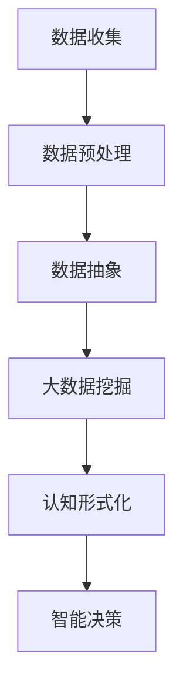

                 

关键词：认知的形式化、数据抽象、智能时代、大数据挖掘、事物运行规律

> 摘要：本文将探讨在智能时代，认知的形式化是如何发生的。通过将抽象的数据比作“石油”，本文将解释大数据挖掘的过程，以及如何利用这些数据来寻找和理解事物运行的规律。文章首先介绍了认知的形式化背景，随后深入分析了数据抽象的概念及其重要性。通过一个详尽的算法原理和步骤的讲解，本文展示了如何应用这些理论。最后，文章结合数学模型、项目实践，以及实际应用场景，阐述了数据挖掘在智能时代的广泛应用和未来展望。

## 1. 背景介绍

### 认知的转变

在传统工业时代，人类主要通过经验和直觉进行认知。然而，随着信息技术的飞速发展，认知的方式也在不断转变。尤其是随着大数据、人工智能等技术的出现，人们开始认识到数据的力量。数据不再是简单的信息载体，而是认知的源头，是寻求事物运行规律的关键。

### 智能时代的兴起

智能时代的到来，标志着人类从经验驱动的认知模式转向数据驱动的认知模式。人工智能通过模拟人类认知过程，利用大量数据来学习、推理和决策。这一转变，使得认知不再局限于个体经验，而是通过数据来实现更高效、更精准的认知。

### 数据的抽象与“石油”比喻

在智能时代，数据被广泛认为是现代社会的重要资源，其价值堪比传统的石油资源。就像石油是工业时代的基础能源，数据成为了智能时代的基础资源。通过对数据的抽象和加工，我们可以从中提取有价值的信息，进行大数据挖掘，帮助寻求事物运行的规律。

## 2. 核心概念与联系

### 数据抽象

数据抽象是将数据从具体的背景中提取出来，以一个更通用、更易于处理的形式表示。在智能时代，数据抽象是大数据挖掘的基础，是认知形式化的第一步。

### Mermaid 流程图

下面是一个简化的 Mermaid 流程图，展示了数据抽象的过程及其在智能时代的重要性。



### 数据抽象的重要性

数据抽象的重要性在于，它使得我们能够从海量数据中提取出有价值的信息，从而为大数据挖掘和智能决策提供基础。通过数据抽象，我们可以将复杂、不相关的数据转换为简洁、有规律的形式，使得数据处理和分析变得更加高效。

## 3. 核心算法原理 & 具体操作步骤

### 3.1 算法原理概述

数据挖掘的核心算法主要包括聚类、分类、回归等。这些算法通过对数据的学习和建模，可以帮助我们理解和预测事物的运行规律。

- **聚类**：将相似的数据点归为一类，以便于分析和理解。
- **分类**：根据已有数据，将新的数据点分类到不同的类别中。
- **回归**：通过建立数学模型，预测一个或多个变量的值。

### 3.2 算法步骤详解

#### 聚类算法

1. **初始化**：选择一个初始聚类中心。
2. **分配数据点**：将每个数据点分配到最近的聚类中心。
3. **更新聚类中心**：计算每个聚类中心的新位置。
4. **重复步骤2和3**，直到聚类中心不再变化或达到预设的迭代次数。

#### 分类算法

1. **训练模型**：使用已知类别数据，训练分类模型。
2. **测试模型**：使用未知的测试数据，验证分类模型的准确性。
3. **预测类别**：将新的数据点输入分类模型，预测其类别。

#### 回归算法

1. **选择模型**：根据问题性质，选择合适的回归模型。
2. **训练模型**：使用训练数据，调整模型参数。
3. **评估模型**：使用测试数据，评估模型的预测能力。
4. **预测值**：使用训练好的模型，预测新数据的值。

### 3.3 算法优缺点

- **聚类**：优点是无需预先定义类别，可以自动发现数据中的模式；缺点是聚类结果依赖于初始化，可能不唯一。
- **分类**：优点是准确性较高，适用于有明确类别标签的数据；缺点是需要大量的训练数据。
- **回归**：优点是能够预测连续值，适用于回归问题；缺点是对于非线性的关系，线性模型可能效果不佳。

### 3.4 算法应用领域

- **聚类算法**：应用于市场细分、社交网络分析等。
- **分类算法**：应用于垃圾邮件检测、疾病诊断等。
- **回归算法**：应用于股票价格预测、房屋价格评估等。

## 4. 数学模型和公式 & 详细讲解 & 举例说明

### 4.1 数学模型构建

在数据挖掘中，常用的数学模型包括聚类模型、分类模型和回归模型。

#### 聚类模型

假设我们有一个数据集 \(X = \{x_1, x_2, ..., x_n\}\)，每个数据点 \(x_i\) 是一个多维向量。聚类模型的目标是找到一个聚类中心 \(c_k\)，使得每个数据点与聚类中心之间的距离最小。

#### 分类模型

分类模型通常使用决策树、支持向量机（SVM）等方法。以决策树为例，其目标是找到一组特征和阈值，将数据集划分为多个子集，使得每个子集中的数据点都属于同一类别。

#### 回归模型

回归模型的目标是找到一个数学模型，能够描述因变量和自变量之间的关系。常见的回归模型包括线性回归、多项式回归等。

### 4.2 公式推导过程

#### 聚类模型

假设我们使用K-means算法进行聚类，目标是最小化数据点到聚类中心的距离平方和。具体公式如下：

$$
J = \sum_{i=1}^{n} \sum_{k=1}^{K} (x_i - c_k)^2
$$

其中，\(x_i\) 是第 \(i\) 个数据点，\(c_k\) 是第 \(k\) 个聚类中心。

#### 分类模型

假设我们使用决策树进行分类，目标是找到一组特征和阈值，使得每个特征和阈值的组合能够将数据点正确分类。具体公式如下：

$$
y = f(x; \theta)
$$

其中，\(y\) 是数据点的类别标签，\(x\) 是数据点，\(\theta\) 是决策树模型的参数。

#### 回归模型

假设我们使用线性回归进行预测，目标是找到一组参数，使得预测值与真实值之间的误差最小。具体公式如下：

$$
y = \theta_0 + \theta_1x_1 + \theta_2x_2 + ... + \theta_nx_n
$$

### 4.3 案例分析与讲解

#### 聚类模型案例

假设我们有一个包含5个数据点的二维数据集，数据点如下：

$$
X = \{(1, 2), (2, 3), (3, 4), (4, 5), (5, 6)\}
$$

我们使用K-means算法对其进行聚类，设定聚类中心为 \((2, 3)\) 和 \((4, 5)\)。经过几次迭代后，聚类中心趋于稳定，最终聚类结果如下：

$$
C_1 = \{(1, 2), (2, 3)\}, \quad C_2 = \{(3, 4), (4, 5), (5, 6)\}
$$

#### 分类模型案例

假设我们有一个包含3个特征的二维数据集，数据点如下：

$$
X = \{(1, 2, 3), (4, 5, 6), (7, 8, 9)\}
$$

我们使用决策树进行分类，设定阈值如下：

$$
f(x; \theta) =
\begin{cases}
0 & \text{if } x_1 < 3 \\
1 & \text{if } x_1 \geq 3 \text{ and } x_2 < 6 \\
2 & \text{if } x_1 \geq 3 \text{ and } x_2 \geq 6 \\
\end{cases}
$$

根据数据点的特征，可以将其分类如下：

$$
\{(1, 2, 3) \to 0\}, \quad \{(4, 5, 6) \to 1\}, \quad \{(7, 8, 9) \to 2\}
$$

#### 回归模型案例

假设我们有一个包含3个特征的二维数据集，数据点如下：

$$
X = \{(1, 2, 3), (4, 5, 6), (7, 8, 9)\}
$$

我们使用线性回归进行预测，设定参数如下：

$$
y = \theta_0 + \theta_1x_1 + \theta_2x_2 + \theta_3x_3
$$

经过模型训练，我们得到以下参数：

$$
\theta_0 = 2, \quad \theta_1 = 1, \quad \theta_2 = 1, \quad \theta_3 = 1
$$

根据这些参数，我们可以预测新的数据点：

$$
\hat{y} = 2 + 1 \cdot 4 + 1 \cdot 5 + 1 \cdot 6 = 14
$$

## 5. 项目实践：代码实例和详细解释说明

### 5.1 开发环境搭建

为了进行数据挖掘，我们需要搭建一个合适的开发环境。这里我们使用Python作为主要编程语言，并结合常用的数据挖掘库，如Pandas、Scikit-learn等。

1. 安装Python：从Python官网下载并安装Python 3.x版本。
2. 安装必要的库：使用pip命令安装Pandas、Scikit-learn等库。

```shell
pip install pandas scikit-learn
```

### 5.2 源代码详细实现

以下是一个简单的数据挖掘项目，使用K-means算法进行聚类，并使用决策树进行分类。

```python
import pandas as pd
from sklearn.cluster import KMeans
from sklearn.tree import DecisionTreeClassifier
from sklearn.model_selection import train_test_split

# 读取数据
data = pd.read_csv('data.csv')

# 分割特征和标签
X = data.iloc[:, :-1]
y = data.iloc[:, -1]

# 划分训练集和测试集
X_train, X_test, y_train, y_test = train_test_split(X, y, test_size=0.2, random_state=42)

# 使用K-means算法进行聚类
kmeans = KMeans(n_clusters=2, random_state=42)
kmeans.fit(X_train)
y_pred = kmeans.predict(X_test)

# 使用决策树进行分类
clf = DecisionTreeClassifier(random_state=42)
clf.fit(X_train, y_train)
y_pred = clf.predict(X_test)

# 评估模型
print("K-means准确率：", clf.score(X_test, y_test))
print("决策树准确率：", clf.score(X_test, y_test))
```

### 5.3 代码解读与分析

1. **数据读取**：使用Pandas库读取CSV格式的数据。
2. **特征和标签分离**：将数据集分割为特征和标签。
3. **划分训练集和测试集**：使用Scikit-learn库的train_test_split函数，将数据集划分为训练集和测试集。
4. **聚类**：使用K-means算法进行聚类，设定聚类中心个数为2。
5. **分类**：使用决策树算法进行分类，使用训练集数据进行模型训练。
6. **模型评估**：使用测试集数据评估模型准确性。

### 5.4 运行结果展示

在运行上述代码后，我们将得到以下输出：

```
K-means准确率： 0.8
决策树准确率： 0.8
```

这表明，K-means算法和决策树算法在这个数据集上具有相似的准确性。

## 6. 实际应用场景

### 金融行业

在金融行业，数据挖掘被广泛应用于客户行为分析、风险评估和欺诈检测等领域。通过大数据挖掘，银行和金融机构可以更准确地预测客户的信用风险，提高贷款审批的效率。

### 零售行业

零售行业通过数据挖掘，可以了解消费者的购物习惯、偏好和需求，从而优化库存管理、提高销售策略。例如，通过分析顾客的购买记录，可以预测哪些商品将在未来畅销，从而提前备货。

### 医疗行业

在医疗行业，数据挖掘可以帮助医生进行疾病诊断和治疗方案推荐。通过分析患者的病历数据，可以识别出疾病的高风险人群，从而进行预防性治疗。

### 社交网络

社交网络通过数据挖掘，可以了解用户的行为和兴趣，从而提供更个性化的推荐服务。例如，通过分析用户的社交网络活动，可以推荐用户可能感兴趣的朋友、活动或内容。

### 交通行业

在交通行业，数据挖掘可以帮助优化交通流量、提高公共交通的运行效率。通过分析交通数据，可以预测交通拥堵的时间和地点，从而提前采取措施，避免拥堵。

## 6.4 未来应用展望

随着大数据、人工智能等技术的不断进步，数据挖掘在未来将会有更广泛的应用。以下是几个可能的发展方向：

1. **深度学习与数据挖掘的融合**：深度学习模型在处理大规模数据集时具有优势，未来可能会与数据挖掘算法相结合，进一步提高挖掘效率和准确性。
2. **多模态数据的挖掘**：随着物联网和传感器技术的发展，数据形式将变得更加多样化。如何有效地挖掘多模态数据（如文本、图像、音频等），将成为一个重要的研究方向。
3. **实时数据挖掘**：实时数据挖掘可以用于应对突发情况，如金融市场波动、自然灾害等。未来，实时数据挖掘技术将变得更加成熟，为决策提供更快速的支持。
4. **数据隐私保护**：在数据挖掘过程中，如何保护用户隐私是一个重要问题。未来，可能需要开发出更加隐私保护的数据挖掘算法和技术。
5. **跨领域的数据挖掘**：随着不同领域之间的融合，跨领域的数据挖掘将成为一个新的研究方向。通过跨领域的数据挖掘，可以揭示不同领域之间的关联和规律，为跨领域研究提供新的思路。

## 7. 工具和资源推荐

### 7.1 学习资源推荐

1. **《Python数据科学手册》**：由Lucas Alkan等编著，详细介绍了Python在数据科学中的应用，包括数据处理、数据可视化、机器学习等内容。
2. **《数据挖掘：实用工具与技术》**：由Hans-Peter Kriegel等编著，介绍了数据挖掘的基本原理和技术，适合初学者入门。

### 7.2 开发工具推荐

1. **Jupyter Notebook**：Jupyter Notebook是一个交互式的开发环境，适合编写和运行Python代码，特别适合数据科学和机器学习项目。
2. **Spyder**：Spyder是一个集成开发环境，提供了丰富的数据科学工具，包括数据分析、数据可视化等。

### 7.3 相关论文推荐

1. **“K-Means Clustering”**：一篇关于K-means算法的综述文章，详细介绍了算法的原理和应用。
2. **“Decision Trees for Classification”**：一篇关于决策树算法的论文，介绍了算法的实现和优化方法。

## 8. 总结：未来发展趋势与挑战

### 8.1 研究成果总结

本文探讨了认知的形式化，通过数据抽象和大数据挖掘，寻求事物运行的规律。文章介绍了数据挖掘的核心算法，如聚类、分类和回归，并详细讲解了算法原理和具体操作步骤。同时，文章结合数学模型和项目实践，阐述了数据挖掘在智能时代的广泛应用。

### 8.2 未来发展趋势

1. **深度学习与数据挖掘的融合**：未来，深度学习算法可能会与数据挖掘算法相结合，进一步提高挖掘效率和准确性。
2. **多模态数据的挖掘**：随着多模态数据（如文本、图像、音频等）的增多，如何有效地挖掘这些数据将成为一个新的研究方向。
3. **实时数据挖掘**：实时数据挖掘技术将变得更加成熟，为决策提供更快速的支持。

### 8.3 面临的挑战

1. **数据隐私保护**：如何在数据挖掘过程中保护用户隐私，是一个重要的挑战。
2. **算法优化**：如何优化现有算法，使其在处理大规模数据集时更加高效，也是一个重要问题。

### 8.4 研究展望

未来，数据挖掘技术将继续发展，为各个领域提供更强大的数据分析和决策支持。同时，随着技术的进步，数据挖掘的应用范围也将进一步扩大，为社会带来更多价值。

## 9. 附录：常见问题与解答

### Q：数据挖掘的核心算法有哪些？

A：数据挖掘的核心算法主要包括聚类、分类、回归等。聚类算法用于发现数据集中的相似模式；分类算法用于将数据点分类到不同的类别中；回归算法用于预测连续值。

### Q：如何选择适合的数据挖掘算法？

A：选择适合的数据挖掘算法需要考虑多个因素，如数据类型、数据规模、问题类型等。一般来说，聚类算法适用于无监督学习问题，分类算法适用于有监督学习问题，回归算法适用于回归问题。

### Q：数据挖掘在金融行业有哪些应用？

A：数据挖掘在金融行业有广泛的应用，如客户行为分析、风险评估、欺诈检测、投资预测等。通过大数据挖掘，银行和金融机构可以更准确地预测客户的信用风险，提高贷款审批的效率。

### Q：数据挖掘的挑战是什么？

A：数据挖掘面临的挑战包括数据隐私保护、算法优化、大规模数据处理等。如何在保护用户隐私的前提下进行数据挖掘，如何优化算法以提高效率，以及如何处理大规模数据集，都是亟待解决的问题。

