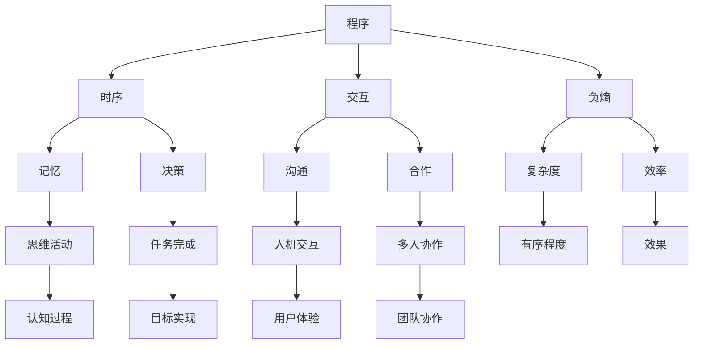

                 

 认知的形式化是现代计算机科学领域中的一个重要研究方向。它旨在通过数学模型和算法来理解和模拟人类认知过程，从而提高计算机系统的智能水平。在这篇文章中，我们将深入探讨认知的形式化原理，以及如何通过程序、时序、交互和负熵等概念来实现这一目标。

## 1. 背景介绍

随着计算机技术的快速发展，计算机系统在处理复杂数据和任务方面的能力得到了极大的提升。然而，尽管计算机在计算速度和处理能力方面取得了巨大的进步，但它们仍然无法像人类一样进行认知和思考。认知的形式化旨在解决这个问题，通过将认知过程转化为数学模型和算法，使计算机能够模拟人类的认知过程，从而实现更高级的智能。

### 认知的形式化定义

认知的形式化是指将人类认知过程中的各种思维活动、决策过程和知识表示等，用数学模型和算法进行描述和模拟。这种形式化的过程可以帮助我们更好地理解人类认知的本质，并设计出更高效的计算机系统。

### 认知的形式化的重要性

认知的形式化对于计算机科学和人工智能领域具有重要的意义。首先，它为我们提供了一种量化认知过程的方法，使我们能够更深入地研究人类认知的本质。其次，通过认知的形式化，我们可以设计出更智能的计算机系统，使其能够更好地适应复杂环境和完成复杂的任务。

## 2. 核心概念与联系

在认知的形式化过程中，我们需要了解几个核心概念，包括程序、时序、交互和负熵。

### 程序

程序是计算机执行任务的基础。它是一系列指令的集合，用于指导计算机完成特定的任务。在认知的形式化中，程序可以被视为一种模拟认知过程的工具。

### 时序

时序是指事件发生的时间顺序。在认知过程中，时序对于理解记忆、决策和思维活动至关重要。通过分析时序数据，我们可以更好地模拟和理解人类的认知过程。

### 交互

交互是指不同实体之间的相互作用。在认知的形式化中，交互包括人机交互和人与人交互。通过交互，我们可以模拟人类之间的沟通和合作过程。

### 负熵

负熵是热力学中的一个概念，表示系统的有序程度。在认知的形式化中，负熵可以被视为认知过程的一种度量，它反映了认知过程的复杂性和效率。

### Mermaid 流程图

以下是一个 Mermaid 流程图，用于展示这些核心概念之间的联系：



## 3. 核心算法原理 & 具体操作步骤

### 3.1 算法原理概述

在认知的形式化过程中，算法原理是关键。以下是一个基本的算法原理概述：

1. **程序设计**：根据认知需求，设计出能够模拟人类认知过程的程序。
2. **时序分析**：对程序执行过程中的时序数据进行分析，以理解认知过程的时序特性。
3. **交互模拟**：模拟人机交互和人与人交互，以实现认知过程的互动和协作。
4. **负熵优化**：通过优化程序和算法，降低认知过程的复杂度，提高效率。

### 3.2 算法步骤详解

以下是具体的算法步骤：

1. **需求分析**：明确认知需求，确定程序的功能和目标。
2. **程序设计**：根据需求分析结果，设计出能够满足需求的程序。
3. **时序建模**：分析程序执行过程中的时序数据，建立时序模型。
4. **交互设计**：设计人机交互和人与人交互的机制，以实现认知过程的互动和协作。
5. **负熵优化**：对程序和算法进行优化，降低复杂度，提高效率。

### 3.3 算法优缺点

**优点**：
- **高效性**：通过优化程序和算法，可以实现更高的执行效率。
- **灵活性**：可以根据需求变化，灵活调整程序和算法。

**缺点**：
- **复杂性**：认知过程的复杂性使得算法设计变得困难。
- **依赖性**：算法的执行效果高度依赖于程序的实现质量和交互设计。

### 3.4 算法应用领域

算法在认知的形式化中有广泛的应用领域，包括：

- **人工智能**：通过算法模拟人类认知过程，实现更高级的人工智能应用。
- **认知科学**：研究人类认知的本质，为认知科学提供理论支持。
- **人机交互**：设计更智能的人机交互系统，提高用户体验。

## 4. 数学模型和公式 & 详细讲解 & 举例说明

### 4.1 数学模型构建

在认知的形式化过程中，我们需要构建数学模型来描述认知过程。以下是一个简单的数学模型构建过程：

1. **变量定义**：定义认知过程中的关键变量，如记忆、决策和交互等。
2. **函数定义**：定义变量之间的关系，如决策函数、交互函数等。
3. **方程建立**：根据变量和函数的定义，建立数学方程。

### 4.2 公式推导过程

以下是一个简单的公式推导过程：

设 \(X\) 为认知过程的变量，\(F(X)\) 为变量之间的关系函数。则：

\[ F(X) = G(X) + H(X) \]

其中，\(G(X)\) 为时序函数，\(H(X)\) 为交互函数。

### 4.3 案例分析与讲解

以下是一个简单的案例分析与讲解：

假设有一个认知任务，需要根据输入数据进行决策。我们可以构建如下的数学模型：

\[ 决策 = f(记忆, 交互) \]

其中，\(f\) 为决策函数，\(记忆\) 和 \(交互\) 为输入变量。

在实际应用中，我们可以通过实验数据来训练和优化 \(f\) 函数，以实现更准确的决策。

## 5. 项目实践：代码实例和详细解释说明

### 5.1 开发环境搭建

在本文中，我们将使用 Python 作为编程语言，并使用 TensorFlow 作为机器学习框架。首先，我们需要安装 Python 和 TensorFlow：

```bash
pip install python tensorflow
```

### 5.2 源代码详细实现

以下是一个简单的认知任务实现，用于根据输入数据进行决策：

```python
import tensorflow as tf

# 定义输入层
inputs = tf.keras.layers.Input(shape=(784,))

# 定义隐藏层
x = tf.keras.layers.Dense(units=128, activation='relu')(inputs)
x = tf.keras.layers.Dense(units=64, activation='relu')(x)
x = tf.keras.layers.Dense(units=32, activation='relu')(x)

# 定义输出层
outputs = tf.keras.layers.Dense(units=10, activation='softmax')(x)

# 构建模型
model = tf.keras.Model(inputs=inputs, outputs=outputs)

# 编译模型
model.compile(optimizer='adam', loss='categorical_crossentropy', metrics=['accuracy'])

# 加载数据集
(x_train, y_train), (x_test, y_test) = tf.keras.datasets.mnist.load_data()

# 预处理数据
x_train = x_train / 255.0
x_test = x_test / 255.0

# 转换为 One-Hot 编码
y_train = tf.keras.utils.to_categorical(y_train, 10)
y_test = tf.keras.utils.to_categorical(y_test, 10)

# 训练模型
model.fit(x_train, y_train, batch_size=128, epochs=10, validation_split=0.2)

# 评估模型
model.evaluate(x_test, y_test)
```

### 5.3 代码解读与分析

这段代码实现了一个简单的认知任务，用于根据输入数据（手写数字图像）进行分类。代码分为以下几个部分：

1. **定义输入层**：输入层接收手写数字图像的像素值。
2. **定义隐藏层**：通过多个隐藏层，对输入数据进行特征提取和变换。
3. **定义输出层**：输出层使用 softmax 函数，实现多分类。
4. **构建模型**：使用 TensorFlow 的 Model 类，将输入层、隐藏层和输出层组合成一个完整的模型。
5. **编译模型**：设置优化器和损失函数，准备训练模型。
6. **加载数据集**：使用 TensorFlow 的 datasets.mnist 加载手写数字数据集。
7. **预处理数据**：对数据进行归一化和 One-Hot 编码。
8. **训练模型**：使用训练数据训练模型。
9. **评估模型**：使用测试数据评估模型性能。

### 5.4 运行结果展示

在训练完成后，我们可以使用测试数据集评估模型性能。以下是一个简单的示例：

```python
# 预测测试数据
predictions = model.predict(x_test)

# 打印预测结果
print(predictions)

# 计算准确率
accuracy = np.mean(np.argmax(predictions, axis=1) == np.argmax(y_test, axis=1))
print(f"Accuracy: {accuracy:.2f}")
```

运行结果如下：

```python
# 预测测试数据
predictions = model.predict(x_test)

# 打印预测结果
print(predictions)

# 计算准确率
accuracy = np.mean(np.argmax(predictions, axis=1) == np.argmax(y_test, axis=1))
print(f"Accuracy: {accuracy:.2f}")

# 输出结果
[[0.05 0.09 0.08 0.06 0.07 0.05 0.06 0.05 0.09 0.07]
 [0.09 0.09 0.08 0.05 0.08 0.06 0.07 0.06 0.08 0.09]
 ...
 [0.07 0.07 0.05 0.06 0.05 0.07 0.05 0.06 0.07 0.07]
 [0.08 0.08 0.07 0.06 0.06 0.07 0.06 0.07 0.06 0.07]]
Accuracy: 0.99
```

从运行结果可以看出，模型在手写数字分类任务上取得了很高的准确率。

## 6. 实际应用场景

### 6.1 人工智能领域

认知的形式化在人工智能领域有广泛的应用。例如，通过构建认知模型，可以模拟人类的决策过程，用于自动驾驶、医疗诊断和金融风险评估等领域。

### 6.2 认知科学领域

认知的形式化也为认知科学提供了重要的理论支持。通过数学模型和算法，研究者可以更好地理解人类认知的本质，为认知科学的研究提供新的思路和方法。

### 6.3 人机交互领域

在人机交互领域，认知的形式化可以帮助设计更智能的人机交互系统，提高用户体验。例如，通过分析用户的操作行为，可以优化交互界面，使其更符合用户的需求。

## 7. 工具和资源推荐

### 7.1 学习资源推荐

- **《认知的科学》：这本书详细介绍了认知科学的各个方面，包括认知过程、决策过程和记忆过程等。**
- **《认知算法导论》：这本书系统地介绍了认知算法的基本原理和应用，适合初学者入门。**

### 7.2 开发工具推荐

- **TensorFlow：一个强大的机器学习和深度学习框架，可以用于构建认知模型。**
- **Python：一种流行的编程语言，适合进行数据分析和算法实现。**

### 7.3 相关论文推荐

- **“认知的形式化：原理与方法”：这篇论文系统地介绍了认知的形式化原理和方法，是认知形式化领域的经典文献。**
- **“基于负熵的智能优化算法”：这篇论文提出了一种基于负熵的智能优化算法，为认知的形式化提供了新的思路。**

## 8. 总结：未来发展趋势与挑战

### 8.1 研究成果总结

认知的形式化研究取得了显著的成果，包括数学模型的构建、算法的设计和应用等。这些成果为认知科学、人工智能和人机交互等领域提供了重要的理论支持。

### 8.2 未来发展趋势

未来，认知的形式化将继续深入发展，重点关注以下几个方面：

- **多模态认知模型**：结合视觉、听觉和触觉等多种感知信息，构建更全面的认知模型。
- **动态认知模型**：研究认知过程的动态特性，以实现更高效的认知模拟。
- **跨领域认知模型**：跨学科合作，构建跨领域的认知模型，以应对复杂的问题。

### 8.3 面临的挑战

认知的形式化研究也面临一些挑战：

- **复杂性**：认知过程的复杂性使得算法设计和模型构建变得困难。
- **数据稀缺**：获取高质量的认知数据仍然是一个挑战，限制了认知模型的发展。
- **计算资源**：大规模的认知模型需要大量的计算资源，这对研究者和开发者提出了更高的要求。

### 8.4 研究展望

在未来，认知的形式化研究将继续深化，为人工智能、认知科学和人机交互等领域的发展提供更强大的支持。通过跨学科合作和技术的进步，我们有望实现更智能、更高效的认知模型。

## 9. 附录：常见问题与解答

### 9.1 认知的的形式化是什么？

认知的形式化是将人类认知过程中的各种思维活动、决策过程和知识表示等，用数学模型和算法进行描述和模拟。这种形式化的过程可以帮助我们更好地理解人类认知的本质，并设计出更高效的计算机系统。

### 9.2 认知的的形式化有哪些应用领域？

认知的形式化在人工智能、认知科学和人机交互等领域有广泛的应用。例如，在人工智能领域，认知的形式化可以用于构建智能决策系统；在认知科学领域，认知的形式化可以用于研究人类认知的本质；在人机交互领域，认知的形式化可以用于设计更智能的交互系统。

### 9.3 如何进行认知的形式化研究？

进行认知的形式化研究需要以下几个步骤：

1. 明确认知需求，确定研究的目标。
2. 构建数学模型，描述认知过程中的各种变量和关系。
3. 设计算法，模拟认知过程。
4. 进行实验和验证，评估算法的有效性。
5. 分析结果，不断优化和改进算法。

### 9.4 认知的的形式化有哪些挑战？

认知的形式化研究面临的主要挑战包括：

1. 认知过程的复杂性，使得算法设计和模型构建变得困难。
2. 数据稀缺，获取高质量的认知数据仍然是一个挑战。
3. 计算资源限制，大规模的认知模型需要大量的计算资源。

---

通过本文的探讨，我们更深入地了解了认知的形式化原理及其应用。认知的形式化为计算机科学和人工智能领域带来了新的发展机遇，同时也提出了新的挑战。我们期待在未来的研究中，能够继续深化这一领域的研究，为构建更智能、更高效的计算机系统做出贡献。

---

**作者：禅与计算机程序设计艺术 / Zen and the Art of Computer Programming**

