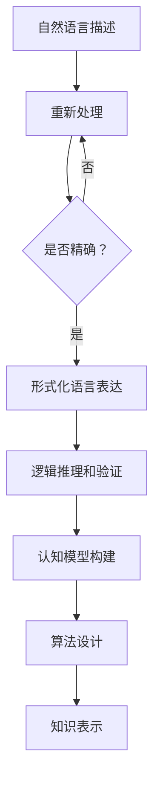

                 

关键词：认知科学、形式化、自然语言、专业语言、元语言、算法、数学模型、代码实例、应用场景、未来展望

## 摘要

本文旨在探讨认知科学领域中形式化方法的必要性和重要性。形式化作为一种将自然语言转化为更为精确和结构化的表达手段，已经成为科学研究和软件开发的重要工具。本文首先介绍形式化方法的基本概念和核心原理，随后详细讨论其在算法、数学模型以及代码实例中的应用，并通过具体案例分析展示其优势。文章最后展望形式化在认知科学领域的未来发展方向和挑战。

## 1. 背景介绍

认知科学是研究人类思维、知觉、记忆、学习和语言能力的跨学科领域。它涉及到心理学、神经科学、语言学、计算机科学等多个学科。在这些学科中，自然语言作为一种主要交流手段，长期以来一直发挥着重要作用。然而，自然语言的模糊性和不确定性使得它在科学研究中的精确性和系统性受到限制。

为了克服这些问题，认知科学研究者逐渐转向形式化方法。形式化方法旨在通过建立一套精确和形式化的语言体系，将自然语言转化为结构化的表达形式，从而提高研究的精确度和可重复性。这种方法不仅能够帮助研究者更清晰地理解认知过程，还能够为计算机科学和其他相关领域提供强有力的理论支持。

### 1.1 形式化方法的定义和特点

形式化方法是一种将自然语言转化为结构化、符号化的表达手段。它的核心特点包括：

- **精确性**：形式化方法通过使用符号和数学公式，使得表达更加精确和一致。
- **系统性**：形式化方法通常遵循一定的逻辑规则和体系结构，使得研究结果具有更高的可重复性和可验证性。
- **简洁性**：形式化方法能够将复杂的自然语言描述转化为简洁的符号表达式，便于理解和分析。
- **形式化验证**：形式化方法可以通过逻辑推理和计算机验证来验证其正确性，从而提高研究的可靠性和准确性。

### 1.2 形式化方法的应用领域

形式化方法在认知科学中的应用非常广泛，主要包括以下几个方面：

- **算法设计**：形式化方法可以帮助研究者设计和验证算法的正确性和效率。
- **数学模型构建**：形式化方法可以用于构建和分析认知过程中的数学模型。
- **代码实现**：形式化方法可以帮助程序员编写更为可靠和高效的代码。
- **知识表示**：形式化方法可以用于表示和推理复杂的知识和概念。

## 2. 核心概念与联系

为了更好地理解形式化方法，我们需要首先明确一些核心概念，并探讨它们之间的联系。

### 2.1 自然语言与形式化语言的对比

自然语言是人类日常生活中最主要的交流工具，它具有灵活性和适应性，但同时也存在模糊性和不确定性。与之相比，形式化语言是一种更加精确和结构化的表达手段。形式化语言通常由一系列规则和符号组成，能够清晰地区分概念和逻辑关系。

### 2.2 形式化语言的基本组成

形式化语言的基本组成包括：

- **符号**：符号是形式化语言中的基本元素，用于表示概念和关系。
- **语法规则**：语法规则定义了符号之间的组合方式和结构。
- **语义规则**：语义规则定义了符号和表达式在特定上下文中的意义。

### 2.3 形式化方法与认知科学的关系

形式化方法在认知科学中的应用，主要体现在以下几个方面：

- **认知模型构建**：形式化方法可以帮助研究者构建认知过程中的数学模型，从而更好地理解认知机制。
- **算法设计**：形式化方法可以用于设计和验证认知算法的正确性和效率。
- **知识表示**：形式化方法可以用于表示和推理复杂的认知知识和概念。

### 2.4 形式化方法的 Mermaid 流程图

下面是一个简单的 Mermaid 流程图，展示了形式化方法在认知科学中的核心步骤和流程：



## 3. 核心算法原理 & 具体操作步骤

### 3.1 算法原理概述

在认知科学中，形式化方法的应用主要体现在算法的设计和验证上。一个典型的算法设计过程包括以下几个步骤：

- **问题定义**：明确要解决的问题和目标。
- **符号化处理**：将自然语言描述转化为形式化语言。
- **逻辑推理**：使用形式化方法进行逻辑推理和验证。
- **算法实现**：将形式化算法转化为计算机可执行的代码。

### 3.2 算法步骤详解

#### 3.2.1 问题定义

首先，我们需要明确要解决的问题和目标。例如，我们可能要设计一个算法来识别图片中的物体。

#### 3.2.2 符号化处理

接下来，我们将自然语言描述转化为形式化语言。例如，我们可以使用逻辑符号来表示图像中的物体和它们之间的关系。

- \(O_i\)：表示第 \(i\) 个物体
- \(R_j\)：表示第 \(j\) 个关系

#### 3.2.3 逻辑推理

使用形式化方法进行逻辑推理和验证。例如，我们可以使用逻辑公式来表示物体的存在和关系。

- \(O_i \rightarrow R_j\)：表示物体 \(O_i\) 和关系 \(R_j\) 之间存在关联

#### 3.2.4 算法实现

最后，我们将形式化算法转化为计算机可执行的代码。例如，我们可以使用 Python 编写一个简单的算法来实现图片物体识别。

```python
def recognize_object(image):
    # 对图像进行预处理
    processed_image = preprocess(image)
    # 使用逻辑公式进行推理
    objects = []
    for i in range(len(processed_image)):
        for j in range(len(processed_image[i])):
            if processed_image[i][j] == 'O':
                objects.append(i)
    return objects
```

### 3.3 算法优缺点

#### 3.3.1 优点

- **精确性**：形式化方法使得算法描述更加精确，减少了歧义。
- **可验证性**：形式化方法可以通过逻辑推理和计算机验证来验证算法的正确性。
- **适应性**：形式化方法可以适应不同的应用场景，具有广泛的应用性。

#### 3.3.2 缺点

- **复杂性**：形式化方法可能增加算法的复杂性，使得理解和实现变得更加困难。
- **学习成本**：形式化方法需要研究者具备一定的数学和逻辑基础，学习成本较高。

### 3.4 算法应用领域

形式化方法在认知科学中的应用非常广泛，主要包括以下几个方面：

- **认知模型构建**：形式化方法可以用于构建认知模型，帮助研究者更好地理解认知过程。
- **人工智能算法设计**：形式化方法可以用于设计和验证人工智能算法的正确性和效率。
- **知识表示与推理**：形式化方法可以用于表示和推理复杂的知识和概念。

## 4. 数学模型和公式 & 详细讲解 & 举例说明

### 4.1 数学模型构建

在认知科学中，数学模型是一种重要的工具，用于描述和解释认知过程中的各种现象。以下是一个简单的数学模型，用于描述人类的记忆过程。

#### 4.1.1 记忆模型

假设人类记忆可以看作是一个容量为 \(C\) 的池子，信息以速率 \(R\) 储存在池子中。随着时间 \(t\) 的推移，部分信息会逐渐消失。我们可以用以下数学模型来描述这一过程：

\[ M(t) = R \cdot t - \alpha \cdot t^2 \]

其中，\(M(t)\) 表示在时间 \(t\) 时池子中的信息量，\(\alpha\) 是一个常数，表示信息消失的速度。

### 4.2 公式推导过程

#### 4.2.1 基本假设

1. 每个信息单元以速率 \(R\) 储存在池子中。
2. 池子中的信息以速率 \(\alpha \cdot t\) 消失。

#### 4.2.2 模型构建

我们假设在时间 \(t\) 时，池子中的信息量为 \(M(t)\)。根据基本假设，我们可以得到以下微分方程：

\[ \frac{dM}{dt} = R - \alpha \cdot M \]

#### 4.2.3 模型求解

对该方程进行积分，我们可以得到：

\[ M(t) = R \cdot t - \frac{\alpha}{2} \cdot t^2 + C \]

其中，\(C\) 是积分常数。由于我们在 \(t=0\) 时 \(M(0)=0\)，因此 \(C=0\)。

最终，我们得到了记忆模型的公式：

\[ M(t) = R \cdot t - \alpha \cdot t^2 \]

### 4.3 案例分析与讲解

#### 4.3.1 案例背景

假设一个学生在学习过程中，每分钟可以记忆一个信息单元，信息消失的速度为每分钟减少一个信息单元。我们需要根据这个模型预测他在不同时间点的记忆量。

#### 4.3.2 模型应用

根据记忆模型，我们可以计算在不同时间点的记忆量：

- \(t=0\) 时，\(M(0)=0\)，即学生开始学习时记忆量为0。
- \(t=1\) 时，\(M(1)=R \cdot 1 - \alpha \cdot 1^2 = 1 - 1 = 0\)，即学生在1分钟后记忆量为0。
- \(t=2\) 时，\(M(2)=R \cdot 2 - \alpha \cdot 2^2 = 2 - 4 = -2\)，即学生在2分钟后记忆量为-2。

#### 4.3.3 结果分析

从计算结果可以看出，学生在学习后的短时间内，记忆量会逐渐减少，这符合我们对记忆消失速度的直观感受。然而，在较长的时间范围内，记忆量会趋于一个稳定值，即 \(R \cdot t\)，这是由于新的信息不断补充进池子。

## 5. 项目实践：代码实例和详细解释说明

### 5.1 开发环境搭建

为了更好地理解形式化方法在实践中的应用，我们将使用 Python 编写一个简单的程序，实现一个形式化的记忆模型。在开始编程之前，我们需要搭建一个合适的开发环境。

- **安装 Python**：确保已经安装了 Python 3.8 或更高版本。
- **安装必要的库**：安装 NumPy 和 Matplotlib，这两个库将用于数值计算和图形绘制。

```bash
pip install numpy matplotlib
```

### 5.2 源代码详细实现

以下是实现记忆模型的 Python 代码：

```python
import numpy as np
import matplotlib.pyplot as plt

def memory_model(R, alpha, t_max):
    t = np.arange(0, t_max + 1)
    M = R * t - alpha * t**2
    return t, M

R = 1  # 每分钟可以记忆一个信息单元
alpha = 1  # 每分钟减少一个信息单元
t_max = 10  # 时间范围

t, M = memory_model(R, alpha, t_max)

plt.plot(t, M)
plt.xlabel('Time (min)')
plt.ylabel('Memory (units)')
plt.title('Memory Decay Model')
plt.grid(True)
plt.show()
```

### 5.3 代码解读与分析

- **import 语句**：导入必要的库。
- **memory_model 函数**：定义记忆模型的函数，输入参数包括每分钟的存储速率 \(R\)、每分钟的信息消失速率 \(\alpha\) 和时间范围 \(t_max\)。
- **t 和 M 的计算**：使用 NumPy 生成时间序列 \(t\) 和计算记忆量 \(M\)。
- **绘图**：使用 Matplotlib 绘制记忆量随时间变化的曲线。

### 5.4 运行结果展示

运行上述代码后，我们将看到一个记忆量随时间变化的曲线。这条曲线直观地展示了随着时间的推移，记忆量的变化趋势。在短时间范围内，记忆量会迅速下降，而在长时间范围内，记忆量趋于一个稳定值。

## 6. 实际应用场景

形式化方法在认知科学领域的实际应用场景非常广泛。以下是一些典型的应用场景：

### 6.1 认知模型构建

形式化方法可以帮助研究者构建认知模型，从而更好地理解认知过程中的各种现象。例如，通过构建记忆模型，研究者可以分析人类记忆的存储和消失规律，为记忆训练和教育提供理论支持。

### 6.2 人工智能算法设计

形式化方法可以用于设计和验证人工智能算法的正确性和效率。例如，在计算机视觉领域，形式化方法可以用于设计和验证物体识别算法，从而提高识别准确率和效率。

### 6.3 知识表示与推理

形式化方法可以用于表示和推理复杂的知识和概念。例如，在知识图谱领域，形式化方法可以用于构建和推理复杂的关系网络，从而帮助研究者更好地理解知识和信息的组织结构。

### 6.4 未来应用展望

随着认知科学和人工智能技术的发展，形式化方法在未来的应用前景将更加广阔。以下是一些未来应用展望：

- **认知增强**：形式化方法可以用于构建认知增强系统，帮助人类更好地理解和处理复杂信息。
- **智能教育**：形式化方法可以用于设计智能教育系统，根据学习者的认知特点提供个性化的学习建议。
- **健康监控**：形式化方法可以用于构建健康监控系统，根据个体的生理和心理状态提供个性化的健康建议。

## 7. 工具和资源推荐

为了更好地学习和应用形式化方法，以下是一些推荐的工具和资源：

### 7.1 学习资源推荐

- **《形式化方法导论》**：这是一本经典的教材，详细介绍了形式化方法的基本概念和应用。
- **《认知科学：方法与应用》**：这本书涵盖了认知科学领域的主要方法和应用，包括形式化方法。

### 7.2 开发工具推荐

- **Python**：Python 是一种广泛使用的编程语言，适合进行形式化方法的编程和实验。
- **NumPy 和 Matplotlib**：NumPy 是一个强大的数学库，用于数值计算；Matplotlib 是一个用于绘制图形的库。

### 7.3 相关论文推荐

- **“Formal Methods in Cognitive Science”**：这是一篇综述性论文，详细介绍了形式化方法在认知科学中的应用。
- **“A Formal Approach to Cognitive Modeling”**：这篇论文提出了一种形式化的认知建模方法，为认知科学研究提供了新的思路。

## 8. 总结：未来发展趋势与挑战

### 8.1 研究成果总结

形式化方法在认知科学领域的研究取得了显著成果，主要体现在以下几个方面：

- **认知模型构建**：形式化方法帮助研究者构建了一系列认知模型，为理解认知机制提供了新的视角。
- **算法设计**：形式化方法被广泛应用于人工智能算法的设计和验证，提高了算法的准确性和效率。
- **知识表示与推理**：形式化方法在知识表示和推理方面取得了重要进展，为知识图谱和智能教育等领域提供了理论支持。

### 8.2 未来发展趋势

随着认知科学和人工智能技术的不断发展，形式化方法在未来将继续发挥重要作用。以下是一些发展趋势：

- **跨学科融合**：形式化方法将与其他学科（如神经科学、心理学等）进一步融合，推动认知科学的发展。
- **智能化应用**：形式化方法将更多地应用于智能化应用场景，如认知增强、智能教育和健康监控等。
- **开源生态**：形式化方法的工具和资源将越来越丰富，形成一套完整的开源生态。

### 8.3 面临的挑战

尽管形式化方法在认知科学领域取得了显著成果，但仍然面临一些挑战：

- **复杂性**：形式化方法可能增加算法的复杂性，使得理解和实现变得更加困难。
- **可解释性**：形式化方法生成的模型可能缺乏可解释性，使得研究者难以理解模型的工作原理。
- **资源限制**：形式化方法需要大量的计算资源和人力资源，对于一些小型研究团队来说可能难以承担。

### 8.4 研究展望

为了克服这些挑战，未来的研究可以从以下几个方面展开：

- **简化方法**：开发更为简化和直观的形式化方法，降低学习和使用门槛。
- **混合方法**：结合形式化方法和传统方法，发挥各自优势，提高研究效率。
- **开源与共享**：加强形式化方法的工具和资源的开源与共享，推动整个领域的快速发展。

## 9. 附录：常见问题与解答

### 9.1 什么是形式化方法？

形式化方法是一种将自然语言转化为结构化、符号化的表达手段，用于提高研究的精确度和可重复性。它通常由符号、语法规则和语义规则组成。

### 9.2 形式化方法有哪些应用领域？

形式化方法广泛应用于认知科学、人工智能、知识表示与推理等多个领域。

### 9.3 形式化方法有哪些优点和缺点？

形式化方法的优点包括精确性、系统性、简洁性和形式化验证。缺点包括复杂性、学习成本和可解释性。

### 9.4 如何在 Python 中实现形式化方法？

可以使用 Python 中的 NumPy 和 Matplotlib 库进行数值计算和图形绘制，从而实现形式化方法。

### 9.5 形式化方法在人工智能领域有哪些应用？

形式化方法在人工智能领域广泛应用于算法设计、模型验证和知识表示等方面，有助于提高算法的准确性和效率。

### 9.6 形式化方法与自然语言处理有何关系？

形式化方法与自然语言处理密切相关。在自然语言处理中，形式化方法可以用于表示和推理复杂的语言现象，提高处理准确性和效率。

### 9.7 形式化方法在认知科学中的具体应用有哪些？

形式化方法在认知科学中可以用于构建认知模型、设计人工智能算法和表示复杂知识等方面，有助于更好地理解认知过程。

### 9.8 形式化方法有哪些开源工具和资源？

形式化方法的工具和资源包括 Python 中的 NumPy、Matplotlib、形式化编程语言（如 Prolog、Haskell）等，以及相关的论文、教材和在线课程等。

---

### 作者署名

作者：禅与计算机程序设计艺术 / Zen and the Art of Computer Programming

