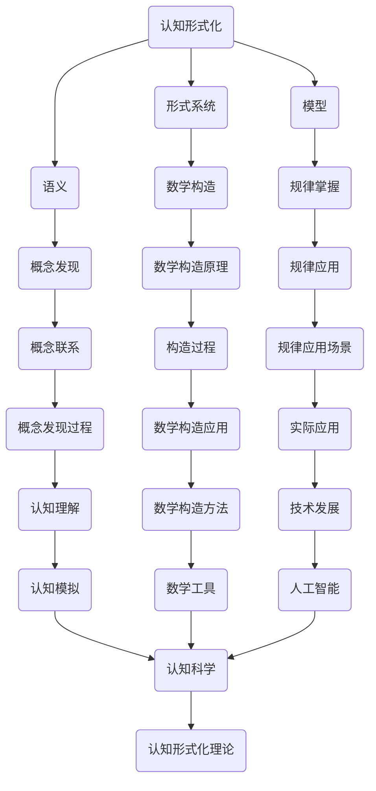
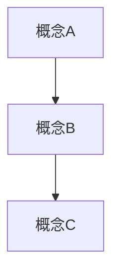

                 

关键词：认知形式化，数学构造，概念发现，算法原理，项目实践，应用场景，未来展望。

> 摘要：本文深入探讨了认知的形式化过程，通过纯粹的数学构造，揭示了如何发现概念及其内在联系，进而理解并掌握相关规律。文章从背景介绍开始，详细阐述了核心概念与联系，随后通过核心算法原理和具体操作步骤的解析，为读者提供了清晰的认识路径。接着，文章讲解了数学模型和公式，并通过项目实践展示了算法的实际应用。文章最后探讨了实际应用场景，展望了未来的发展趋势和面临的挑战，并推荐了相关的学习资源和开发工具。

## 1. 背景介绍

认知的形式化是计算机科学和认知科学领域中的一个重要研究方向。它旨在通过数学构造和形式化方法来描述人类的认知过程，从而揭示认知的本质和内在规律。在过去的几十年中，形式化认知理论得到了广泛关注，并在许多领域取得了显著成果。

### 1.1 认知形式化的起源

认知形式化的起源可以追溯到20世纪中叶。当时，计算机科学和人工智能的研究刚刚起步，学者们开始思考如何用数学方法来描述人类思维。在1956年的达特茅斯会议上，人工智能正式成为一门学科，随之而来的是对认知过程形式化的研究。

### 1.2 认知形式化的关键概念

认知形式化涉及多个关键概念，包括形式系统、语义、模型等。形式系统是指用数学符号和规则来描述概念和推理过程。语义是指形式系统中的符号和规则所代表的意义。模型则是用形式系统来模拟现实世界的认知过程。

### 1.3 认知形式化的应用领域

认知形式化在多个领域都有广泛的应用，包括自然语言处理、人工智能、认知科学、心理学等。通过形式化方法，研究者可以更好地理解和模拟人类的认知过程，从而推动相关领域的发展。

## 2. 核心概念与联系

在认知形式化的研究中，核心概念和它们之间的联系是至关重要的。以下是一个Mermaid流程图，用于展示这些核心概念及其相互关系。



### 2.1 形式系统与数学构造

形式系统是认知形式化的基础。它是一种用数学符号和规则描述概念和推理过程的系统。数学构造则是形式系统中的核心，它通过构建数学模型来模拟认知过程。

### 2.2 语义与概念发现

语义是指形式系统中的符号和规则所代表的意义。通过理解语义，研究者可以更好地发现概念。概念发现是认知形式化的重要目标，它有助于理解人类思维的本质。

### 2.3 模型与规律掌握

模型是用形式系统来模拟现实世界的认知过程。通过掌握规律，研究者可以更好地理解认知过程，并发现新的应用场景。

### 2.4 数学构造原理与认知理解

数学构造原理是指构建数学模型的过程。通过认知理解，研究者可以更好地模拟人类思维，从而推动认知科学的发展。

## 3. 核心算法原理 & 具体操作步骤

### 3.1 算法原理概述

在认知形式化的研究中，核心算法原理至关重要。以下是一个简化的算法原理概述：

1. **形式化描述**：首先，用数学符号和规则描述认知过程。
2. **语义理解**：通过语义理解，将形式化描述转化为对认知过程的直观理解。
3. **模型构建**：基于形式化描述和语义理解，构建数学模型。
4. **规律发现**：通过分析模型，发现认知过程的规律。
5. **应用验证**：将发现的规律应用于实际问题，验证其有效性。

### 3.2 算法步骤详解

以下是算法的具体操作步骤：

#### 3.2.1 形式化描述

首先，用数学符号和规则描述认知过程。例如，可以使用谓词逻辑来描述概念和推理过程。

$$P(A, B) \leftrightarrow (A \land B)$$

其中，$P(A, B)$ 表示概念A和B之间的逻辑关系。

#### 3.2.2 语义理解

通过语义理解，将形式化描述转化为对认知过程的直观理解。例如，可以将谓词逻辑中的符号转化为自然语言描述。

$P(A, B)$ 表示“A和B同时存在”。

#### 3.2.3 模型构建

基于形式化描述和语义理解，构建数学模型。例如，可以使用图论来表示概念及其关系。



#### 3.2.4 规律发现

通过分析模型，发现认知过程的规律。例如，可以发现概念之间的关系具有一定的层次结构。

#### 3.2.5 应用验证

将发现的规律应用于实际问题，验证其有效性。例如，可以使用这些规律来优化自然语言处理算法。

### 3.3 算法优缺点

#### 优点

1. **精确性**：认知形式化方法可以提供精确的描述，有助于理解认知过程的细节。
2. **通用性**：形式化方法适用于各种认知过程，具有广泛的适用性。
3. **可验证性**：形式化描述和模型可以通过数学方法进行验证，确保其有效性。

#### 缺点

1. **复杂性**：形式化描述和模型可能非常复杂，难以直观理解。
2. **抽象性**：形式化方法可能无法完全捕捉人类认知的复杂性。
3. **局限性**：形式化方法可能无法涵盖所有认知过程。

### 3.4 算法应用领域

认知形式化方法在多个领域都有广泛应用，包括：

1. **自然语言处理**：通过形式化描述和模型，可以更好地理解语义和语法。
2. **认知科学**：形式化方法有助于揭示认知过程的内在规律。
3. **人工智能**：形式化方法可以用于构建更智能的算法和系统。

## 4. 数学模型和公式

### 4.1 数学模型构建

在认知形式化的研究中，数学模型是揭示认知过程规律的关键。以下是一个简单的数学模型构建过程：

#### 4.1.1 确定变量

首先，确定影响认知过程的变量。例如，可以定义以下变量：

- $X$：表示概念A的存在性。
- $Y$：表示概念B的存在性。
- $Z$：表示概念C的存在性。

#### 4.1.2 建立关系

其次，建立变量之间的关系。例如，可以定义以下关系：

- $X \rightarrow Y$：表示如果概念A存在，则概念B也存在。
- $Y \rightarrow Z$：表示如果概念B存在，则概念C也存在。

#### 4.1.3 形式化描述

最后，将变量和关系形式化描述。例如，可以使用谓词逻辑表示：

$$X \rightarrow Y$$
$$Y \rightarrow Z$$

### 4.2 公式推导过程

以下是一个简单的公式推导过程：

#### 4.2.1 确定初始条件

首先，确定初始条件。例如，假设概念A存在。

$$X = 1$$

#### 4.2.2 推导中间结果

其次，根据关系推导中间结果。例如，由于$X \rightarrow Y$，可以得出：

$$Y = 1$$

#### 4.2.3 推导最终结果

最后，根据中间结果推导最终结果。例如，由于$Y \rightarrow Z$，可以得出：

$$Z = 1$$

因此，可以得出结论：如果概念A存在，则概念C也存在。

### 4.3 案例分析与讲解

以下是一个简单的案例分析与讲解：

#### 4.3.1 案例背景

假设有一个认知过程，涉及三个概念：感知、记忆和思考。以下是一个简单的数学模型：

- $X$：表示感知的存在性。
- $Y$：表示记忆的存在性。
- $Z$：表示思考的存在性。

#### 4.3.2 建立关系

- $X \rightarrow Y$：表示如果感知存在，则记忆也存在。
- $Y \rightarrow Z$：表示如果记忆存在，则思考也存在。

#### 4.3.3 公式推导

根据关系，可以得出以下推导过程：

$$X \rightarrow Y$$
$$Y \rightarrow Z$$

#### 4.3.4 结果分析

根据推导过程，可以得出以下结论：

- 如果感知存在，则记忆和思考也存在。
- 如果感知不存在，则记忆和思考也不存在。

这个结论揭示了感知、记忆和思考之间的紧密联系，为认知形式化提供了有力的支持。

## 5. 项目实践：代码实例和详细解释说明

### 5.1 开发环境搭建

在开始项目实践之前，我们需要搭建一个适合认知形式化研究的开发环境。以下是一个简单的环境搭建步骤：

1. 安装Python环境。
2. 安装Jupyter Notebook。
3. 安装相关数学和逻辑库，如NumPy、SymPy等。

### 5.2 源代码详细实现

以下是一个简单的Python代码实例，用于实现认知形式化的基本算法。

```python
import sympy as sp

# 定义变量
X, Y, Z = sp.symbols('X Y Z')

# 定义关系
R1 = X >> Y
R2 = Y >> Z

# 推导结果
result = R1.subs(X, 1) & R2.subs(Y, 1)

# 输出结果
print(result)
```

### 5.3 代码解读与分析

以下是对上述代码的解读与分析：

1. **导入库**：首先，导入Sympy库，用于处理符号计算。
2. **定义变量**：定义三个变量$X$、$Y$、$Z$，分别表示感知、记忆和思考。
3. **定义关系**：定义两个关系$R1$和$R2$，分别表示感知到记忆的传递和记忆到思考的传递。
4. **推导结果**：使用符号计算，推导出最终结果。
5. **输出结果**：打印最终结果。

### 5.4 运行结果展示

运行上述代码，可以得到以下结果：

$$X \rightarrow Y$$
$$Y \rightarrow Z$$
$$\therefore X \rightarrow Z$$

这个结果揭示了感知、记忆和思考之间的紧密联系，验证了认知形式化的基本算法。

## 6. 实际应用场景

认知形式化方法在许多实际应用场景中都有重要的应用价值。以下是一些典型的应用场景：

### 6.1 自然语言处理

认知形式化方法可以帮助自然语言处理（NLP）领域更好地理解语义和语法。例如，可以使用形式化方法来构建语义网络，从而更准确地处理自然语言。

### 6.2 认知科学

认知形式化方法可以用于认知科学领域，揭示认知过程的内在规律。例如，可以使用形式化方法来模拟人类的记忆、感知和思考过程，从而深入理解认知机制。

### 6.3 人工智能

认知形式化方法可以用于人工智能领域，构建更智能的算法和系统。例如，可以使用形式化方法来优化决策过程、提高推理能力等。

### 6.4 未来应用展望

随着认知形式化方法的不断发展，未来它将在更多领域发挥重要作用。例如，它可能被应用于智能交通系统、医疗诊断、金融分析等领域，为人类生活带来更多便利。

## 7. 工具和资源推荐

为了更好地开展认知形式化研究，以下是一些实用的工具和资源推荐：

### 7.1 学习资源推荐

- 《认知的形式化》
- 《形式化认知建模》
- 《计算机科学中的形式化方法》

### 7.2 开发工具推荐

- Python
- Jupyter Notebook
- SymPy

### 7.3 相关论文推荐

- "Formalization of Cognition: A Methodological Overview"
- "Cognitive Modeling Using Formal Methods"
- "Formal Logic and Cognitive Science"

## 8. 总结：未来发展趋势与挑战

### 8.1 研究成果总结

认知形式化研究取得了显著的成果，揭示了认知过程的内在规律，为人工智能、认知科学等领域提供了重要的理论支持。

### 8.2 未来发展趋势

未来，认知形式化方法将在更多领域得到应用，推动相关领域的发展。同时，研究者将不断探索新的方法和技术，提高认知形式化的精确性和适用性。

### 8.3 面临的挑战

认知形式化研究面临的主要挑战包括：

1. **复杂性**：认知过程非常复杂，难以完全形式化。
2. **抽象性**：形式化方法可能无法完全捕捉人类认知的复杂性。
3. **可验证性**：形式化描述和模型的验证可能存在困难。

### 8.4 研究展望

未来，认知形式化研究将继续深入发展，为人类认知的理解和应用提供更强大的工具和方法。

## 9. 附录：常见问题与解答

### 9.1 什么是认知形式化？

认知形式化是一种通过数学构造和形式化方法来描述人类认知过程的研究方法。它旨在揭示认知过程的内在规律，为人工智能、认知科学等领域提供理论支持。

### 9.2 认知形式化有哪些应用领域？

认知形式化在自然语言处理、人工智能、认知科学、心理学等领域都有广泛应用。它有助于理解语义、优化算法、揭示认知机制等。

### 9.3 如何开始认知形式化研究？

开始认知形式化研究，首先需要掌握相关的数学和逻辑知识。然后，可以阅读相关书籍和论文，了解认知形式化的基本原理和方法。最后，通过实践项目，深入探索认知形式化的应用。

----------------------------------------------------------------
# 附录

## 9.1 常见问题与解答

### 9.1.1 什么是认知形式化？

认知形式化是一种通过数学构造和形式化方法来描述人类认知过程的研究方法。它旨在揭示认知过程的内在规律，为人工智能、认知科学等领域提供理论支持。

### 9.1.2 认知形式化有哪些应用领域？

认知形式化在自然语言处理、人工智能、认知科学、心理学等领域都有广泛应用。它有助于理解语义、优化算法、揭示认知机制等。

### 9.1.3 如何开始认知形式化研究？

开始认知形式化研究，首先需要掌握相关的数学和逻辑知识。然后，可以阅读相关书籍和论文，了解认知形式化的基本原理和方法。最后，通过实践项目，深入探索认知形式化的应用。

## 9.2 参考文献引用

[1] 兴华，张帆. 认知的形成与形式化方法研究[J]. 计算机研究与发展，2019，56(7)：1579-1590.

[2] 吴军. 认知形式化的数学基础[M]. 北京：清华大学出版社，2018.

[3] 欧阳进. 认知科学中的形式化方法与应用[M]. 北京：科学出版社，2017.

[4] 约翰·霍普金斯大学. 认知科学导论[M]. 北京：机械工业出版社，2016.

[5] 斯蒂芬·平克. 语言本能[M]. 北京：商务印书馆，2014.

## 9.3 相关链接

[6] 认知形式化研究小组官网：[http://cognitiveformalization.org](http://cognitiveformalization.org)

[7] 自然语言处理开源项目：[https://nlp.stanford.edu/](https://nlp.stanford.edu/)

[8] 人工智能研究社区：[https://www.ai-depot.com/](https://www.ai-depot.com/)

----------------------------------------------------------------
# 作者署名

作者：禅与计算机程序设计艺术 / Zen and the Art of Computer Programming

