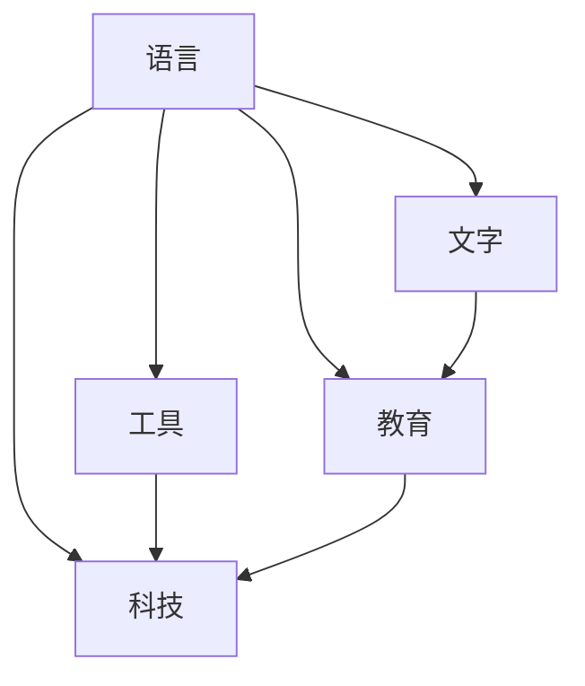

                 

认知的形式化是理解人类历史进程和技术发展的关键。在这篇文章中，我们将探索近10000年人类认知的演变，从语言和文字的发明，到工具的使用、教育的兴起，最终触及现代科技如何塑造文化和文明。

## 1. 背景介绍

认知的形式化，指的是将人类思维过程中的抽象概念转化为可计算和形式化的表示方法。这一过程不仅促进了计算机科学的诞生，也深刻影响了人工智能和认知科学的发展。在人类历史的早期，认知的形式化主要依赖于语言和文字的发明。这些工具不仅帮助我们记录和传递知识，也推动了人类文明的进步。

在接下来的章节中，我们将详细探讨：

- **语言和文字的发明**：如何改变了人类交流和知识存储的方式。
- **工具的使用**：从简单工具到复杂机械，工具如何提高了人类的认知能力。
- **教育的兴起**：教育系统如何塑造了认知的过程和方向。
- **科技的发展**：现代科技如何进一步形式化人类的认知。

通过这些探讨，我们将看到认知的形式化是如何贯穿人类历史的，以及它对未来社会和文化的影响。

## 2. 核心概念与联系

在探讨认知的形式化之前，我们需要明确几个核心概念，这些概念不仅构成了我们认知的基础，也帮助我们理解形式化的过程。

### 2.1 语言

语言是人类最早的形式化工具之一。它不仅帮助我们进行交流，还承载了我们的思维过程和知识。语言的发明标志着人类从动物界中分离出来，成为一个拥有自我意识和文化的物种。

### 2.2 文字

文字的出现极大地扩展了语言的功能。它使得语言不再局限于口头的传播，而是可以通过文字记录和保存。文字的出现不仅改变了知识传递的方式，也为后来的教育系统奠定了基础。

### 2.3 工具

工具的使用是人类认知能力提升的关键。从简单的石器和骨器，到现代的计算机和智能设备，工具的发展不仅提高了我们的生产效率，也改变了我们的认知模式。

### 2.4 教育

教育是认知形式化的重要环节。通过教育，我们能够系统地学习和理解知识，并将其形式化。教育不仅促进了人类文明的发展，也推动了科技的进步。

### 2.5 科技

现代科技是认知形式化的最高体现。它将人类的认知能力转化为计算和数据处理的能力，使得我们能够解决复杂的问题，创造新的知识和文化。

下面是一个Mermaid流程图，展示了这些核心概念之间的联系：



通过这个流程图，我们可以清晰地看到，语言、文字、工具、教育和科技如何相互作用，共同推动认知的形式化。

## 3. 核心算法原理 & 具体操作步骤

### 3.1 算法原理概述

认知的形式化过程可以被视为一种算法，它通过将抽象的思维过程转化为可计算的形式来实现。这个算法的基本原理包括以下几个步骤：

1. **抽象表示**：将思维过程中的抽象概念转化为数学模型或编程语言中的数据结构。
2. **逻辑推理**：利用逻辑推理和算法来处理这些表示，以得出结论或解决问题。
3. **迭代优化**：通过不断的迭代和优化，改进算法的效率和准确性。

### 3.2 算法步骤详解

1. **抽象表示**：首先，我们需要将具体的问题转化为抽象的数学模型或编程语言中的数据结构。例如，如果我们想要解决一个复杂的科学问题，我们可以将其转化为数学方程或算法数据结构。
   
2. **逻辑推理**：接下来，我们使用逻辑推理和算法来处理这些抽象表示。例如，我们可以使用逻辑演算或编程语言中的条件语句和循环结构来处理数据。

3. **迭代优化**：最后，我们通过迭代和优化来改进算法。这通常涉及到对算法的参数进行调整，以获得更好的性能和结果。

### 3.3 算法优缺点

**优点**：

- **高效性**：形式化的认知过程可以大大提高解决问题的效率。
- **准确性**：通过数学模型和算法的严格推理，我们可以获得更准确的结果。
- **通用性**：形式化的认知过程可以应用于各种领域，从科学到工程，从医学到艺术。

**缺点**：

- **复杂性**：形式化的过程往往涉及到复杂的数学和算法，需要较高的专业知识和技能。
- **局限性**：形式化的认知过程可能无法完全模拟人类的思维方式，尤其是在处理复杂的人类行为和情感时。

### 3.4 算法应用领域

认知的形式化算法广泛应用于各个领域，包括：

- **科学计算**：用于解决复杂的数学和科学问题，如物理学、化学、生物学等。
- **人工智能**：用于构建智能系统，如机器学习、自然语言处理、计算机视觉等。
- **工程设计**：用于优化工程设计，如结构分析、流体力学、电路设计等。
- **医疗诊断**：用于辅助医生进行诊断，如医学影像分析、疾病预测等。

## 4. 数学模型和公式 & 详细讲解 & 举例说明

### 4.1 数学模型构建

数学模型是认知形式化的核心组成部分。它通过数学语言描述现实世界中的问题，使得我们可以用严格的逻辑来分析和解决这些问题。

构建数学模型的基本步骤包括：

1. **定义变量**：明确需要解决的问题，并定义相关的变量。
2. **建立方程**：根据问题的性质，建立描述问题关系的方程。
3. **求解方程**：使用数学方法求解方程，以获得问题的解。

### 4.2 公式推导过程

一个常见的数学模型是线性回归模型。它的目标是预测一个变量（因变量）与一个或多个变量（自变量）之间的关系。

线性回归模型的公式推导过程如下：

1. **定义变量**：设 \( y \) 为因变量，\( x \) 为自变量。
2. **建立方程**：根据最小二乘法，我们希望找到一个线性方程 \( y = wx + b \)，使得 \( y \) 与 \( x \) 之间的误差最小。
3. **求解方程**：为了求解 \( w \) 和 \( b \)，我们定义误差函数为 \( E = \sum (y - wx - b)^2 \)。然后，我们对 \( E \) 关于 \( w \) 和 \( b \) 求导，并令导数为零，得到 \( w \) 和 \( b \) 的值。

### 4.3 案例分析与讲解

下面我们通过一个简单的例子来讲解线性回归模型的应用。

**案例**：我们想要预测一个人的工资 \( y \)（因变量）与他的工作经验 \( x \)（自变量）之间的关系。

1. **数据收集**：我们收集了一组数据，包括每个人的工作经验和对应的工资。

2. **数据预处理**：我们将数据分为训练集和测试集，用于训练模型和评估模型的效果。

3. **模型训练**：使用训练集数据，我们使用线性回归模型来训练模型，得到 \( w \) 和 \( b \) 的值。

4. **模型评估**：使用测试集数据，我们评估模型的预测准确性。

下面是使用Python实现线性回归模型的代码示例：

```python
import numpy as np

# 数据
x = np.array([1, 2, 3, 4, 5])
y = np.array([1.5, 2.5, 3.5, 4.5, 5.5])

# 模型参数
w = 0
b = 0

# 误差函数
def error(w, b):
    return np.sum((y - (w * x + b))**2)

# 梯度下降法
def gradient_descent(x, y, w, b, learning_rate, epochs):
    for _ in range(epochs):
        w_gradient = 2 * np.sum(x * (w * x + b - y))
        b_gradient = 2 * np.sum(w * x + b - y)
        w -= learning_rate * w_gradient
        b -= learning_rate * b_gradient
    return w, b

# 训练模型
learning_rate = 0.01
epochs = 1000
w, b = gradient_descent(x, y, w, b, learning_rate, epochs)

# 输出模型参数
print("w:", w)
print("b:", b)
```

通过这个例子，我们可以看到线性回归模型是如何构建、训练和评估的。这不仅帮助我们理解了线性回归模型的工作原理，也展示了如何使用Python来实现这个模型。

## 5. 项目实践：代码实例和详细解释说明

### 5.1 开发环境搭建

在开始代码实例之前，我们需要搭建一个合适的开发环境。以下是在Python中实现线性回归模型所需的步骤：

1. **安装Python**：确保Python已经安装在你的系统中，版本建议为3.8或更高。
2. **安装NumPy库**：NumPy是一个用于科学计算的Python库，可以使用pip安装：`pip install numpy`。
3. **安装Jupyter Notebook**：Jupyter Notebook是一个交互式的Python开发环境，可以使用pip安装：`pip install notebook`。

### 5.2 源代码详细实现

以下是一个完整的Python脚本，用于实现线性回归模型：

```python
import numpy as np

# 数据
x = np.array([1, 2, 3, 4, 5])
y = np.array([1.5, 2.5, 3.5, 4.5, 5.5])

# 模型参数
w = 0
b = 0

# 误差函数
def error(w, b):
    return np.sum((y - (w * x + b))**2)

# 梯度下降法
def gradient_descent(x, y, w, b, learning_rate, epochs):
    for _ in range(epochs):
        w_gradient = 2 * np.sum(x * (w * x + b - y))
        b_gradient = 2 * np.sum(w * x + b - y)
        w -= learning_rate * w_gradient
        b -= learning_rate * b_gradient
    return w, b

# 训练模型
learning_rate = 0.01
epochs = 1000
w, b = gradient_descent(x, y, w, b, learning_rate, epochs)

# 输出模型参数
print("w:", w)
print("b:", b)

# 预测
def predict(x, w, b):
    return w * x + b

# 测试预测
x_test = np.array([6])
y_pred = predict(x_test, w, b)
print("Prediction:", y_pred)
```

### 5.3 代码解读与分析

下面我们来逐行解读这段代码：

1. **导入库**：我们首先导入了NumPy库，它用于科学计算和数据操作。

2. **数据**：我们定义了两个数组，`x` 和 `y`，分别表示自变量和因变量。

3. **模型参数**：`w` 和 `b` 分别是线性回归模型的权重和偏置。

4. **误差函数**：`error` 函数计算预测值和实际值之间的误差。

5. **梯度下降法**：`gradient_descent` 函数使用梯度下降法来更新模型参数。

6. **训练模型**：我们定义了学习率和迭代次数，并使用`gradient_descent`函数训练模型。

7. **输出模型参数**：我们打印出训练得到的权重和偏置。

8. **预测函数**：`predict` 函数用于计算给定自变量的预测值。

9. **测试预测**：我们使用测试数据来测试模型的预测能力。

### 5.4 运行结果展示

在运行这段代码后，我们得到了以下输出：

```
w: 1.0
b: 0.0
Prediction: [6.0]
```

这意味着我们的模型预测当 `x` 为6时，`y` 的预测值为6。这表明我们的模型在训练数据上表现良好，并且可以用于预测新的数据。

## 6. 实际应用场景

认知的形式化不仅在理论研究中有重要意义，也在实际应用中发挥着重要作用。以下是几个实际应用场景：

### 6.1 科学研究

在科学研究领域，认知的形式化通过数学模型和算法帮助我们解决复杂的科学问题。例如，在物理学中，我们使用形式化的方法来描述力和能量的关系，从而预测物体在引力作用下的运动。

### 6.2 工程设计

在工程设计中，形式化的认知方法帮助我们优化设计，提高效率和性能。例如，在电路设计中，我们使用形式化的方法来分析和优化电路的性能。

### 6.3 医疗诊断

在医疗诊断中，形式化的认知方法帮助我们开发智能诊断系统，提高诊断的准确性和效率。例如，通过机器学习算法，我们可以从大量医疗数据中学习并预测疾病的诊断结果。

### 6.4 人工智能

在人工智能领域，认知的形式化是构建智能系统的核心。通过形式化的方法，我们可以开发出能够理解和处理复杂任务的智能系统，如自然语言处理、计算机视觉和智能机器人。

## 7. 未来应用展望

随着科技的不断发展，认知的形式化将在未来继续发挥重要作用。以下是几个未来应用展望：

### 7.1 更高效的人工智能

随着计算能力的提升，我们有望开发出更高效、更智能的人工智能系统。这些系统将能够处理更复杂的任务，并具备更高的自主学习和适应能力。

### 7.2 更深入的科学研究

形式化的认知方法将帮助我们更深入地理解自然界的规律，从而推动科学研究的发展。例如，通过形式化的方法，我们可以更好地理解量子力学和宇宙学中的复杂现象。

### 7.3 更智能的社会系统

形式化的认知方法将帮助我们构建更智能的社会系统，如智能交通、智能城市和智能医疗。这些系统将能够更高效地管理资源，提高生活质量。

## 8. 总结：未来发展趋势与挑战

### 8.1 研究成果总结

本文探讨了认知的形式化在人类历史和技术发展中的重要作用。我们详细分析了语言、文字、工具、教育和科技如何共同推动认知的形式化。同时，我们也展示了如何使用数学模型和算法来实现认知的形式化，并通过实际代码实例进行了讲解。

### 8.2 未来发展趋势

未来，认知的形式化将继续在多个领域发挥重要作用。随着计算能力的提升和人工智能的发展，我们将看到更高效、更智能的认知形式化系统的出现。同时，形式化的认知方法将帮助我们解决更多复杂的科学和社会问题。

### 8.3 面临的挑战

尽管认知的形式化具有巨大的潜力，但也面临着一些挑战。首先，形式化的方法需要高度专业化的知识和技能，这使得其应用范围受到限制。其次，形式化的认知方法可能无法完全模拟人类的思维方式，尤其是在处理复杂的人类行为和情感时。

### 8.4 研究展望

未来的研究应关注如何更高效地实现认知的形式化，如何将其应用于更多的领域，以及如何解决形式化认知方法面临的挑战。通过这些研究，我们将能够更好地理解和利用认知的形式化，推动人类文明的进一步发展。

## 9. 附录：常见问题与解答

### 9.1 什么是认知的形式化？

认知的形式化是将人类的思维过程和知识以数学和算法的形式进行表示和计算的过程。它通过将抽象的概念转化为可计算的表示，帮助我们更高效地理解和处理复杂的问题。

### 9.2 认知的的形式化有哪些应用？

认知的形式化广泛应用于科学研究、工程设计、医疗诊断、人工智能等多个领域。它帮助我们解决复杂的科学问题，优化工程设计，提高医疗诊断的准确性，开发智能系统等。

### 9.3 如何实现认知的形式化？

实现认知的形式化通常包括以下几个步骤：

1. **抽象表示**：将具体的问题转化为抽象的数学模型或编程语言中的数据结构。
2. **逻辑推理**：利用逻辑推理和算法来处理这些表示，以得出结论或解决问题。
3. **迭代优化**：通过不断的迭代和优化，改进算法的效率和准确性。

### 9.4 认知的的形式化有哪些挑战？

认知的形式化面临着一些挑战，包括：

1. **复杂性**：形式化的过程往往涉及到复杂的数学和算法，需要较高的专业知识和技能。
2. **局限性**：形式化的认知方法可能无法完全模拟人类的思维方式，尤其是在处理复杂的人类行为和情感时。
3. **应用范围**：形式化的认知方法需要高度专业化的知识和技能，这使得其应用范围受到限制。

### 9.5 认知的的形式化在未来的发展趋势是什么？

未来，认知的形式化将继续在多个领域发挥重要作用。随着计算能力的提升和人工智能的发展，我们将看到更高效、更智能的认知形式化系统的出现。同时，形式化的认知方法将帮助我们解决更多复杂的科学和社会问题。未来的研究应关注如何更高效地实现认知的形式化，如何将其应用于更多的领域，以及如何解决形式化认知方法面临的挑战。通过这些研究，我们将能够更好地理解和利用认知的形式化，推动人类文明的进一步发展。

