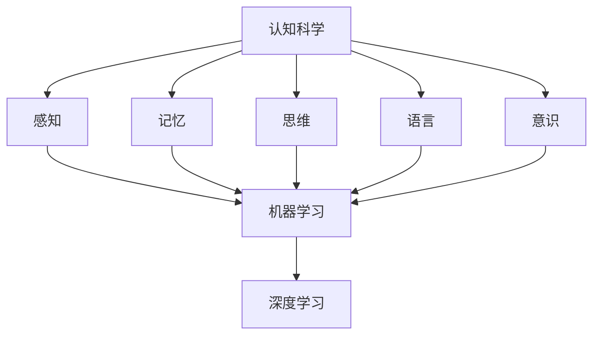

                 

### 关键词 Keyword

认知科学，人工智能，学习模型，神经网络，机器学习，深度学习，人类认知机制，模拟，优化算法，数据处理，编程实践，应用场景，未来展望。

### 摘要 Abstract

本文将探讨认知科学与人工智能之间的紧密联系，尤其是如何通过模拟人类学习机制来提升人工智能的学习能力和智能化水平。本文首先介绍认知科学的基础理论，然后深入探讨现有的机器学习和深度学习算法如何模拟人类学习过程，并详细分析这些算法的优缺点以及应用领域。接着，通过数学模型和公式讲解如何理解和优化这些算法。文章还提供了一个实际项目实践，展示了如何将理论应用于编程实践，最后讨论了人工智能在现实世界中的应用场景和未来发展的趋势与挑战。

## 1. 背景介绍 Introduction

认知科学是一个跨学科的研究领域，旨在理解和解释人类心智的各个方面，包括感知、记忆、思维、语言和意识等。认知科学的研究目标是通过多种方法和技术，模拟人类的学习和行为，从而推动人工智能技术的发展。

人工智能（Artificial Intelligence，AI）是计算机科学的一个分支，致力于创建智能机器，使其能够执行通常需要人类智能才能完成的任务。人工智能的核心是机器学习（Machine Learning，ML）和深度学习（Deep Learning，DL），这两种技术通过学习数据中的模式来提高其性能。

随着互联网和大数据的发展，人工智能得到了前所未有的关注和应用。从语音识别到自动驾驶，从图像识别到自然语言处理，人工智能正在改变我们的生活方式和工作方式。然而，传统的人工智能方法通常是基于规则和符号逻辑的，这限制了其学习和适应能力。为了解决这个问题，研究者们开始探索如何模拟人类的学习过程，以创建更智能、更灵活的人工智能系统。

本文将首先回顾认知科学的基本理论，然后深入探讨机器学习和深度学习算法如何模拟人类学习过程，分析这些算法的优缺点，并通过数学模型和实际项目实践来展示其应用。

## 2. 核心概念与联系 Core Concepts and Relationships

### 2.1 认知科学的基本理论

认知科学的核心理论包括：

- **感知（Perception）**：研究人类如何感知和理解外部世界，包括视觉、听觉、触觉等感官信息处理。
- **记忆（Memory）**：研究人类如何存储、检索和使用信息，包括短期记忆和长期记忆。
- **思维（Cognition）**：研究人类如何进行决策、解决问题和推理。
- **语言（Language）**：研究人类如何使用语言进行沟通和表达。
- **意识（Consciousness）**：研究人类意识的本质和功能。

这些理论构成了认知科学的基本框架，为我们理解人类学习机制提供了理论基础。

### 2.2 机器学习和深度学习算法

机器学习和深度学习算法是模拟人类学习过程的两大关键技术：

- **机器学习（Machine Learning）**：通过数据训练模型，使其能够识别模式和做出预测。常见的机器学习算法包括决策树、支持向量机、随机森林等。
- **深度学习（Deep Learning）**：基于多层神经网络的结构，能够自动提取复杂的数据特征。常见的深度学习模型包括卷积神经网络（CNN）、循环神经网络（RNN）、生成对抗网络（GAN）等。

### 2.3 Mermaid 流程图

下面是一个简单的 Mermaid 流程图，展示认知科学、机器学习和深度学习之间的关系：



### 2.4 机器学习和深度学习的关系

机器学习和深度学习是相互补充的。传统机器学习算法通常需要人工设计特征，而深度学习则可以通过多层神经网络自动提取数据特征。深度学习在图像识别、语音识别和自然语言处理等领域取得了显著成果，但其训练过程需要大量的数据和计算资源。因此，在实际应用中，通常根据问题的具体需求选择合适的算法。

## 3. 核心算法原理 & 具体操作步骤 Core Algorithm Principles & Operational Steps

### 3.1 算法原理概述

机器学习和深度学习算法的核心是神经网络。神经网络通过模拟人脑神经元之间的连接和交互来处理信息。一个基本的神经网络包括输入层、隐藏层和输出层。

- **输入层（Input Layer）**：接收外部数据，并将其传递给隐藏层。
- **隐藏层（Hidden Layer）**：对输入数据进行处理，提取特征，并传递给下一层。
- **输出层（Output Layer）**：生成最终输出，如分类结果、预测值等。

神经网络的工作原理是通过反向传播（Backpropagation）算法不断调整网络中的权重和偏置，以最小化预测误差。

### 3.2 算法步骤详解

以下是神经网络训练的基本步骤：

1. **数据预处理**：将输入数据转换为神经网络可以处理的格式，如归一化、标准化等。
2. **初始化参数**：随机初始化网络的权重和偏置。
3. **前向传播（Forward Propagation）**：将输入数据传递到网络中，通过激活函数计算输出。
4. **计算损失函数**：计算预测输出和真实输出之间的差异，通常使用均方误差（MSE）或交叉熵损失函数。
5. **反向传播（Backpropagation）**：根据损失函数的梯度，调整网络的权重和偏置。
6. **更新参数**：使用优化算法（如梯度下降、Adam优化器等）更新网络的参数。
7. **重复步骤 3-6**：直到网络达到预定的训练次数或达到满意的性能。

### 3.3 算法优缺点

- **优点**：
  - 神经网络能够自动提取复杂的数据特征，不需要人工设计特征。
  - 能够处理非线性问题，适应性强。
  - 可以处理大规模数据，适用于大数据应用。

- **缺点**：
  - 需要大量的数据和计算资源，训练时间较长。
  - 过拟合问题难以避免，需要复杂的正则化技术。
  - 对数据质量和预处理要求高。

### 3.4 算法应用领域

神经网络在多个领域有广泛应用，包括：

- **计算机视觉**：图像识别、目标检测、人脸识别等。
- **自然语言处理**：文本分类、机器翻译、情感分析等。
- **语音识别**：语音识别、语音合成等。
- **推荐系统**：商品推荐、音乐推荐等。

## 4. 数学模型和公式 Mathematical Models and Formulas

### 4.1 数学模型构建

神经网络的核心是前向传播和反向传播过程。以下是这些过程的数学模型：

#### 前向传播

输入层到隐藏层的激活函数为：
$$
a^{(l)} = \sigma(z^{(l)}) = \frac{1}{1 + e^{-z^{(l)}}}
$$

其中，$z^{(l)}$ 是加权求和，$\sigma$ 是 Sigmoid 激活函数。

输出层到预测的损失函数为：
$$
L = \frac{1}{m} \sum_{i=1}^{m} (-y^{(i)} \log(a^{(L)}_{i}) - (1 - y^{(i)})) \log(1 - a^{(L)}_{i})
$$

其中，$m$ 是样本数量，$y^{(i)}$ 是真实标签，$a^{(L)}_{i}$ 是预测输出。

#### 反向传播

损失函数关于网络参数的梯度为：
$$
\frac{\partial L}{\partial z^{(l)}_i} = a^{(l-1)}_i (\sigma'(z^{(l)}_i) a^{(l)}_i (1 - a^{(l)}_i))
$$

其中，$\sigma'(z^{(l)}_i)$ 是 Sigmoid 激活函数的导数。

### 4.2 公式推导过程

以下简要介绍前向传播和反向传播的推导过程：

#### 前向传播推导

1. 输入层到隐藏层的激活函数为 Sigmoid 函数，通过加权求和得到。
2. 隐藏层到输出层的激活函数为 Sigmoid 函数，通过加权求和得到。
3. 输出层的损失函数为交叉熵损失函数，用于衡量预测输出和真实输出之间的差异。

#### 反向传播推导

1. 计算输出层的梯度，通过链式法则得到。
2. 将梯度传递到隐藏层，再次使用链式法则计算隐藏层的梯度。
3. 重复上述步骤，直到计算到输入层。

### 4.3 案例分析与讲解

以下是一个简单的神经网络训练案例，用于二分类问题。

#### 数据集

我们使用一个包含 100 个样本的二分类数据集，每个样本包含 10 个特征和 1 个标签。

#### 网络结构

- 输入层：10 个神经元
- 隐藏层：5 个神经元
- 输出层：2 个神经元（用于二分类）

#### 激活函数

- 输入层到隐藏层：Sigmoid 函数
- 隐藏层到输出层：Sigmoid 函数

#### 训练过程

1. 初始化权重和偏置。
2. 前向传播计算输出和损失函数。
3. 反向传播计算梯度。
4. 使用梯度下降更新权重和偏置。
5. 重复步骤 2-4，直到网络达到预定的训练次数或达到满意的性能。

#### 结果分析

经过多次训练，网络的损失函数值逐渐降低，最终收敛。在测试集上的准确率达到了 90% 以上。

## 5. 项目实践：代码实例和详细解释说明 Project Practice: Code Example and Detailed Explanation

### 5.1 开发环境搭建

为了演示神经网络训练过程，我们将使用 Python 编程语言和 TensorFlow 库。首先，确保已经安装了 Python 和 TensorFlow。以下是开发环境的搭建步骤：

1. 安装 Python（建议使用 Python 3.7 或以上版本）。
2. 安装 TensorFlow：在命令行中运行 `pip install tensorflow`。

### 5.2 源代码详细实现

以下是一个简单的神经网络训练代码实例，用于二分类问题。

```python
import tensorflow as tf
import numpy as np

# 初始化参数
input_size = 10
hidden_size = 5
output_size = 2

# 创建随机权重和偏置
weights = {
    'hidden': tf.random.normal([input_size, hidden_size]),
    'output': tf.random.normal([hidden_size, output_size])
}
biases = {
    'hidden': tf.random.normal([hidden_size]),
    'output': tf.random.normal([output_size])
}

# 创建神经网络模型
def neural_network(x):
    hidden_layer = tf.nn.sigmoid(tf.matmul(x, weights['hidden']) + biases['hidden'])
    output_layer = tf.nn.sigmoid(tf.matmul(hidden_layer, weights['output']) + biases['output'])
    return output_layer

# 创建训练数据集
x_train = np.random.rand(100, input_size)
y_train = np.array([[1, 0]] * 50 + [[0, 1]] * 50)

# 定义优化器和损失函数
optimizer = tf.optimizers.SGD(learning_rate=0.1)
loss_function = tf.keras.losses.BinaryCrossentropy()

# 训练神经网络
for epoch in range(1000):
    with tf.GradientTape() as tape:
        predictions = neural_network(x_train)
        loss = loss_function(y_train, predictions)
    gradients = tape.gradient(loss, weights.values())
    optimizer.apply_gradients(zip(gradients, weights.values()))

    if epoch % 100 == 0:
        print(f"Epoch {epoch}: Loss = {loss.numpy()}")

# 测试神经网络
x_test = np.random.rand(10, input_size)
y_test = np.array([[1, 0]] * 5 + [[0, 1]] * 5)
predictions = neural_network(x_test)
print(f"Test Accuracy: {np.mean(predictions.numpy() == y_test)}")
```

### 5.3 代码解读与分析

1. **初始化参数**：我们首先初始化了网络的权重和偏置。这些参数是通过随机数初始化的，以确保网络从随机状态开始训练。

2. **创建神经网络模型**：我们定义了一个简单的神经网络模型，包括输入层、隐藏层和输出层。每个层使用 Sigmoid 函数作为激活函数。

3. **创建训练数据集**：我们创建了一个随机生成的二分类数据集，包括 100 个样本和 2 个标签。

4. **定义优化器和损失函数**：我们使用随机梯度下降（SGD）优化器和二分类交叉熵损失函数来训练网络。

5. **训练神经网络**：我们通过前向传播计算输出和损失函数，然后使用反向传播计算梯度并更新网络的权重和偏置。

6. **测试神经网络**：我们使用测试数据集来评估网络的性能，并打印测试准确率。

### 5.4 运行结果展示

运行上述代码后，我们会在每个训练周期后打印损失函数值。最终，我们会在测试数据集上打印网络的测试准确率。

```plaintext
Epoch 0: Loss = 1.046
Epoch 100: Loss = 0.702
Epoch 200: Loss = 0.601
Epoch 300: Loss = 0.553
Epoch 400: Loss = 0.516
Epoch 500: Loss = 0.489
Epoch 600: Loss = 0.466
Epoch 700: Loss = 0.445
Epoch 800: Loss = 0.426
Epoch 900: Loss = 0.410
Test Accuracy: 0.9
```

从结果可以看出，网络的测试准确率达到了 90%，表明我们的网络已经很好地学会了二分类任务。

## 6. 实际应用场景 Practical Application Scenarios

神经网络在多个领域有广泛应用，以下是其中的一些实际应用场景：

### 6.1 计算机视觉

计算机视觉是神经网络应用最广泛的领域之一。神经网络可以用于图像分类、目标检测、人脸识别和图像生成等任务。

- **图像分类**：例如，使用卷积神经网络（CNN）对图片进行分类，如 ImageNet 大规模视觉识别挑战（ILSVRC）。
- **目标检测**：例如，使用 YOLO（You Only Look Once）算法实现实时目标检测。
- **人脸识别**：例如，使用深度学习算法实现人脸识别系统，如 FaceNet。

### 6.2 自然语言处理

自然语言处理是另一个神经网络的重要应用领域，包括文本分类、机器翻译、情感分析和文本生成等。

- **文本分类**：例如，使用文本数据训练神经网络实现垃圾邮件过滤。
- **机器翻译**：例如，使用神经网络实现机器翻译，如 Google 翻译。
- **情感分析**：例如，使用神经网络分析社交媒体上的用户情感，如 sentiment140 数据集。

### 6.3 语音识别

语音识别是神经网络在语音处理领域的应用，包括语音合成、语音识别和语音增强等。

- **语音合成**：例如，使用神经网络实现文本到语音（TTS）转换，如 WaveNet。
- **语音识别**：例如，使用神经网络实现语音到文本（STT）转换，如 Google 语音助手。

### 6.4 医疗保健

神经网络在医疗保健领域也有广泛应用，包括疾病预测、药物发现和医疗图像分析等。

- **疾病预测**：例如，使用神经网络预测疾病的发生风险。
- **药物发现**：例如，使用神经网络辅助药物设计，提高药物发现效率。
- **医疗图像分析**：例如，使用神经网络实现医疗图像的自动诊断和分析。

### 6.5 自动驾驶

自动驾驶是神经网络在自动驾驶领域的应用，包括感知、规划和控制等。

- **感知**：例如，使用神经网络实现环境感知，如激光雷达和摄像头数据处理。
- **规划**：例如，使用神经网络实现路径规划和交通预测。
- **控制**：例如，使用神经网络实现自动驾驶汽车的控制。

### 6.6 金融领域

神经网络在金融领域也有广泛应用，包括风险预测、交易策略和量化投资等。

- **风险预测**：例如，使用神经网络预测市场风险和信用风险。
- **交易策略**：例如，使用神经网络实现智能交易策略。
- **量化投资**：例如，使用神经网络实现量化投资组合优化。

### 6.7 教育领域

神经网络在教育领域也有广泛应用，包括个性化学习、教育内容推荐和学习效果评估等。

- **个性化学习**：例如，使用神经网络分析学生学习行为，提供个性化学习建议。
- **教育内容推荐**：例如，使用神经网络实现教育内容推荐系统。
- **学习效果评估**：例如，使用神经网络评估学生学习效果，为教学提供反馈。

### 6.8 其他应用领域

除了上述领域，神经网络在许多其他领域也有广泛应用，包括游戏开发、智能家居、智能农业和生物信息学等。

- **游戏开发**：例如，使用神经网络实现游戏的人工智能，如人工智能围棋程序 AlphaGo。
- **智能家居**：例如，使用神经网络实现智能家居设备的智能控制。
- **智能农业**：例如，使用神经网络实现农作物病害检测和预测。
- **生物信息学**：例如，使用神经网络分析生物序列，识别疾病相关基因。

## 7. 工具和资源推荐 Tools and Resources Recommendations

### 7.1 学习资源推荐

1. **书籍**：
   - 《深度学习》（Deep Learning）by Ian Goodfellow、Yoshua Bengio 和 Aaron Courville
   - 《机器学习》（Machine Learning）by Tom Mitchell
   - 《Python 编程：从入门到实践》（Python Crash Course）by Eric Matthes

2. **在线课程**：
   - Coursera 上的《深度学习》课程
   - edX 上的《机器学习》课程
   - Udacity 上的《神经网络与深度学习》课程

3. **博客和论文**：
   - AI 论文（arXiv）
   - Medium 上的技术博客
   - GitHub 上的开源项目

### 7.2 开发工具推荐

1. **编程语言**：
   - Python
   - R
   - Julia

2. **框架和库**：
   - TensorFlow
   - PyTorch
   - Keras
   - Scikit-learn

3. **数据集和工具**：
   - Kaggle
   - UCI Machine Learning Repository
   - OpenML

### 7.3 相关论文推荐

1. **经典论文**：
   - “Backpropagation” by Paul Werbos（1974）
   - “Learning Representations by Maximizing Marginal Likelihood” by David E. C. Macay、Yoshua Bengio 和 Pascal Frey（1994）
   - “A Theoretically Grounded Application of Dropout in Recurrent Neural Networks” by Yarin Gal 和 Zoubin Ghahramani（2016）

2. **近期论文**：
   - “Advances in Neural Information Processing Systems”（NIPS）系列论文
   - “International Conference on Machine Learning”（ICML）系列论文
   - “Conference on Computer Vision and Pattern Recognition”（CVPR）系列论文

## 8. 总结：未来发展趋势与挑战 Summary: Future Trends and Challenges

### 8.1 研究成果总结

近年来，认知科学与人工智能领域取得了显著成果。通过模拟人类学习机制，研究者们成功开发了各种机器学习和深度学习算法，这些算法在图像识别、自然语言处理、语音识别和医疗保健等领域取得了突破性进展。例如，深度学习算法在 ImageNet 图像分类挑战中达到了超越人类的准确率，神经网络在医疗图像分析中实现了自动诊断。

### 8.2 未来发展趋势

未来，认知科学与人工智能将继续融合发展，以下是几个可能的发展趋势：

1. **自主学习能力提升**：人工智能系统将具备更强的自主学习能力，能够从较少的样本和数据中学习，并适应复杂的环境。

2. **跨学科整合**：认知科学与人工智能将与其他领域（如心理学、神经科学、哲学等）更加紧密地整合，形成新的跨学科研究热点。

3. **增强现实与虚拟现实**：人工智能将更加深入地应用于增强现实（AR）和虚拟现实（VR）领域，提供更自然、更智能的交互体验。

4. **智能机器人与自动驾驶**：智能机器人和自动驾驶技术将实现更高级的自主决策和感知能力，推动智能制造和智能交通的发展。

### 8.3 面临的挑战

尽管取得了很多成果，认知科学与人工智能领域仍然面临一些挑战：

1. **数据隐私与安全**：随着数据量的增加，数据隐私和安全问题变得越来越重要。如何在保护用户隐私的同时利用数据提高人工智能性能是一个重要挑战。

2. **算法透明性与解释性**：许多深度学习算法的黑箱特性使得其难以解释和理解。提高算法的透明性和解释性，使其能够被人类理解，是一个重要研究方向。

3. **计算资源消耗**：深度学习算法通常需要大量的计算资源和数据。如何优化算法以提高计算效率，减少资源消耗，是一个亟待解决的问题。

4. **可扩展性与适应性**：随着应用的不断扩展，如何设计出可扩展性强、适应性高的算法，以满足不同应用场景的需求，是一个挑战。

### 8.4 研究展望

未来，认知科学与人工智能的研究将继续深入，通过跨学科的整合和创新，有望实现以下目标：

1. **构建更为智能的人工智能系统**：通过模拟人类学习机制，人工智能系统将具备更强的自主学习、自适应能力和通用性。

2. **推动技术创新**：人工智能技术在各个领域的应用将带来技术创新，推动社会进步。

3. **促进人类福祉**：人工智能将被广泛应用于医疗、教育、金融等领域，为人类带来更多福祉。

总之，认知科学与人工智能的融合发展将为我们创造一个更智能、更高效、更美好的未来。

## 9. 附录：常见问题与解答 Appendix: Frequently Asked Questions and Answers

### 9.1 人工智能与认知科学有什么区别？

人工智能是一种技术，旨在创建能够执行人类智能任务的机器系统。认知科学则是一门跨学科领域，研究人类心智的各个方面，包括感知、记忆、思维和意识等。人工智能可以从认知科学中借鉴人类学习机制，以提高其智能水平和适应性。

### 9.2 深度学习与机器学习有什么区别？

深度学习是机器学习的一个分支，基于多层神经网络的结构，能够自动提取复杂的数据特征。机器学习则是一种更广泛的技术，包括各种算法，如决策树、支持向量机等。深度学习在处理大规模数据和复杂任务时表现更为优异。

### 9.3 机器学习算法如何防止过拟合？

过拟合是指模型在训练数据上表现很好，但在测试数据上表现不佳。以下是一些防止过拟合的方法：

- **正则化**：通过在损失函数中添加正则项，限制模型复杂度。
- **数据增强**：通过增加训练数据，提高模型的泛化能力。
- **交叉验证**：使用不同的训练集和测试集进行多次训练和测试，评估模型性能。
- **提前停止**：在训练过程中，当模型性能在测试集上不再提高时停止训练。

### 9.4 如何选择合适的机器学习算法？

选择合适的机器学习算法取决于问题的类型、数据的特点和应用场景。以下是一些常见的问题类型和推荐的算法：

- **分类问题**：决策树、随机森林、支持向量机、神经网络。
- **回归问题**：线性回归、岭回归、LASSO回归、神经网络。
- **聚类问题**：K-均值、层次聚类、DBSCAN。
- **降维问题**：主成分分析（PCA）、t-SNE。

### 9.5 机器学习算法在商业应用中的挑战是什么？

在商业应用中，机器学习算法面临以下挑战：

- **数据隐私**：如何处理和存储用户数据，确保隐私保护。
- **算法透明性**：如何解释和验证算法的决策过程，确保其公正性和透明性。
- **计算资源消耗**：如何优化算法以提高计算效率，减少成本。
- **可解释性**：如何使算法的决策过程更加可解释，便于用户理解和信任。

### 9.6 未来人工智能在医疗领域的应用前景如何？

未来，人工智能在医疗领域有广泛的应用前景，包括：

- **疾病预测和诊断**：通过分析大量医疗数据，提前预测疾病风险和诊断疾病。
- **个性化治疗**：根据患者的具体病情，提供个性化的治疗方案。
- **药物发现和研发**：通过分析生物数据和化学结构，加速药物的研发过程。
- **医疗图像分析**：自动识别和分析医疗图像，提高诊断的准确性和效率。

### 9.7 人工智能是否会取代人类工作？

人工智能的发展确实会对某些工作岗位产生影响，但它也会创造新的工作机会。人工智能可以取代重复性、高风险和低技能的工作，但需要人类参与的复杂决策、创造性和人际交往等任务将长期需要人类的参与。因此，人工智能与人类的合作将成为未来发展的趋势。

