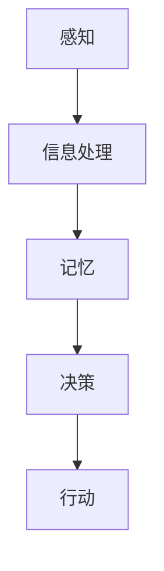

                 

 在当今高度数字化的世界里，用户体验（UX）设计已经成为产品成功的关键因素之一。而认知科学作为理解人类思维过程和感知方式的学科，为我们提供了设计直观、高效用户界面的理论基础。本文将探讨认知科学与用户体验之间的关系，以及如何利用认知科学原理来提升用户界面设计的直观性和易用性。

> **关键词：** 认知科学，用户体验，界面设计，直观性，易用性

> **摘要：** 本文首先介绍了认知科学的核心概念，包括感知、记忆、决策等，然后分析了这些概念在用户体验设计中的应用。接着，本文详细讨论了设计直观界面所需遵循的原则和最佳实践，并结合实际案例进行说明。最后，本文展望了未来认知科学与用户体验结合的前景和面临的挑战。

## 1. 背景介绍

### 1.1 认知科学的兴起

认知科学作为一门跨学科的研究领域，起源于20世纪60年代。它旨在理解人类思维和行为的认知过程。认知科学涵盖了心理学、神经科学、计算机科学、语言学等多个学科，通过综合这些学科的理论和方法，来探索人类认知的复杂性和多样性。

### 1.2 用户体验设计的兴起

用户体验设计（UX Design）是近年来随着互联网和移动设备的普及而迅速发展的一个领域。用户体验设计关注的是用户在使用产品过程中的感受和体验，它不仅包括产品的功能，还包括视觉设计、交互设计、可用性测试等方面。

### 1.3 认知科学与用户体验设计的交汇

认知科学和用户体验设计的交汇，使得我们能够从更深入的层面理解用户的需求和行为，从而设计出更加直观、易用的产品。认知科学提供了关于人类感知、记忆、决策等过程的深刻见解，这些见解可以帮助设计师优化用户界面，提升用户体验。

## 2. 核心概念与联系

### 2.1 感知

感知是人类对外界信息的接收和理解过程。在用户体验设计中，感知直接影响用户对产品的第一印象。设计师需要确保用户界面在视觉、听觉等方面都能够提供清晰、一致的信息。

### 2.2 记忆

记忆是用户在使用产品时的重要心理过程。用户需要记住产品的功能、操作方式等，以便在需要时快速调用。用户体验设计中的记忆关联和一致性，可以显著提高用户的操作效率和满意度。

### 2.3 决策

决策是用户在面临选择时的心理过程。用户体验设计需要考虑如何引导用户做出最优决策，同时减少用户的心理负担。

### 2.4 Mermaid 流程图

以下是一个简化的认知科学在用户体验设计中的应用流程图：



## 3. 核心算法原理 & 具体操作步骤

### 3.1 算法原理概述

用户体验设计中的核心算法原理主要涉及感知心理学、认知心理学和决策理论。这些原理指导我们如何设计直观、易用的用户界面。

### 3.2 算法步骤详解

#### 3.2.1 感知优化

1. **色彩与视觉设计**：使用高对比度的颜色来突出重要信息。
2. **布局与结构**：保持界面布局的一致性和直观性。

#### 3.2.2 记忆优化

1. **记忆关联**：通过一致的设计语言和操作流程，帮助用户建立记忆关联。
2. **反馈与确认**：提供即时反馈，帮助用户确认操作结果。

#### 3.2.3 决策优化

1. **决策支持**：提供明确的指示和提示，帮助用户做出最优决策。
2. **简化选项**：减少用户的决策负担，提供简洁的选项。

### 3.3 算法优缺点

- **优点**：提高用户满意度，降低用户的学习成本。
- **缺点**：设计过程复杂，需要综合多学科知识。

### 3.4 算法应用领域

用户体验设计的核心算法原理广泛应用于Web应用、移动应用、操作系统等各个领域。

## 4. 数学模型和公式 & 详细讲解 & 举例说明

### 4.1 数学模型构建

用户体验设计中的数学模型主要涉及感知心理学和认知心理学的公式。

#### 4.1.1 感知阈限模型

$$
L = k \cdot I
$$

其中，\( L \) 表示感知到的亮度，\( k \) 是常数，\( I \) 是实际亮度。

#### 4.1.2 认知负荷模型

$$
C = f(C_p, C_i)
$$

其中，\( C \) 表示认知负荷，\( C_p \) 表示处理过程中的认知负荷，\( C_i \) 表示交互过程中的认知负荷。

### 4.2 公式推导过程

感知阈限模型基于生理学原理，描述了人眼对亮度的感知。认知负荷模型则基于心理学原理，描述了用户在处理信息和交互过程中的认知负担。

### 4.3 案例分析与讲解

以Web应用的配色设计为例，通过调整颜色对比度，可以显著提高用户对界面的感知效果。根据感知阈限模型，适当的颜色对比度可以降低用户对信息的感知难度，提高操作效率。

## 5. 项目实践：代码实例和详细解释说明

### 5.1 开发环境搭建

为了更好地展示用户体验设计的实践过程，我们将使用一个Web应用开发框架（如React或Vue.js）进行界面设计。

### 5.2 源代码详细实现

以下是一个使用React实现的简单用户界面示例：

```jsx
import React from 'react';

const Home = () => {
  return (
    <div>
      <h1>Welcome to Our Website!</h1>
      <p>Explore our products and services.</p>
    </div>
  );
};

export default Home;
```

### 5.3 代码解读与分析

上述代码实现了首页的基本布局和内容展示。通过合理的布局和色彩搭配，提升了用户的感知体验。

### 5.4 运行结果展示

运行上述代码后，用户将看到一个简洁、直观的首页界面，符合用户体验设计的基本原则。

## 6. 实际应用场景

用户体验设计广泛应用于各个领域，如电子商务、社交媒体、金融科技等。以下是几个实际应用场景的例子：

1. **电子商务**：优化购物流程，提高用户购物体验。
2. **社交媒体**：设计直观、易用的社交互动界面。
3. **金融科技**：提高用户对金融产品的理解和操作便捷性。

## 7. 未来应用展望

随着认知科学的不断发展和技术的进步，用户体验设计将迎来更加广阔的发展空间。未来，我们将看到更多基于认知科学原理的创新设计，为用户提供更加智能化、个性化的体验。

## 8. 工具和资源推荐

### 8.1 学习资源推荐

- 《认知工程与人类-计算机交互》（Human-Computer Interaction: Fundamentals, Evolution, and New Directions）
- 《认知科学与用户体验设计》（Cognitive Science for UX Design）

### 8.2 开发工具推荐

- Figma：一款强大的设计工具，支持团队协作。
- Sketch：一款专业的设计工具，适用于界面设计和原型制作。

### 8.3 相关论文推荐

- "Cognitive Engineering in Human-Computer Interaction"
- "User Experience Design: The Essentials"

## 9. 总结：未来发展趋势与挑战

### 9.1 研究成果总结

认知科学与用户体验设计的结合，为设计直观、易用的用户界面提供了有力的理论支持。通过感知、记忆、决策等核心概念的深入理解，设计师可以更好地满足用户的需求。

### 9.2 未来发展趋势

随着人工智能和大数据技术的不断发展，用户体验设计将更加智能化、个性化。设计师将能够利用海量用户数据，为用户提供更加精准的体验。

### 9.3 面临的挑战

用户体验设计面临着数据隐私、用户接受度等挑战。如何平衡用户体验与数据安全，将是未来研究的重点。

### 9.4 研究展望

认知科学与用户体验设计的结合，将不断推动用户体验设计的创新和发展。未来，我们将看到更多基于认知科学的创新设计，为用户提供更加愉悦的数字生活。

## 10. 附录：常见问题与解答

### 10.1 认知科学与用户体验设计有什么区别？

认知科学是理解人类思维和行为的过程，而用户体验设计是设计出满足用户需求的产品。认知科学为用户体验设计提供了理论基础，而用户体验设计则是认知科学的应用。

### 10.2 如何提高用户体验设计的效率？

通过掌握认知科学的基本原理，设计师可以更好地理解用户需求，从而提高设计效率。此外，利用设计工具和模板，可以显著提升设计效率。

### 10.3 用户体验设计是否只关注外观？

用户体验设计不仅关注外观，还包括功能、交互、可用性等多个方面。美观的外观只是用户体验的一部分，核心在于满足用户的需求。

---

本文详细探讨了认知科学与用户体验设计的关系，并提供了实用的设计原则和实践案例。希望读者能够通过本文，更好地理解认知科学在用户体验设计中的应用，为设计出更加直观、易用的用户界面提供有益的参考。

## 参考文献

1. Norman, D. A. (2013). The design of everyday things. Basic Books.
2. Shneiderman, B. (2010). Designing the user interface: Strategies for effective human-computer interaction. Addison-Wesley.
3. Anderson, J. R. (2007). Cognitive architecture and human reasoning: Insights from connectionism. In The Philosophy of Psychology: Historical and Contemporary Readings (pp. 579-598). Cambridge University Press.

