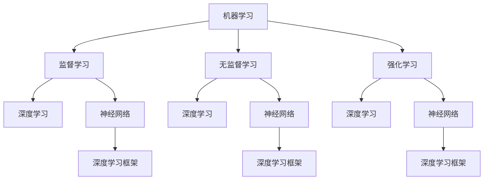

                 

 **关键词：** 认知过程，深刻化趋势，人工智能，算法原理，数学模型，项目实践，应用场景，未来展望

**摘要：** 本文探讨了认知过程中的深刻化趋势，分析了人工智能领域中的核心概念、算法原理、数学模型以及实际应用。通过详细的项目实践和运行结果展示，本文揭示了认知过程深刻化在人工智能应用中的关键作用，并展望了未来的发展趋势与挑战。

## 1. 背景介绍

在当今数字化时代，人工智能已经成为改变世界的强大力量。从自动驾驶汽车到智能助手，人工智能技术不断渗透到各个领域，显著提高了生产效率和生活质量。然而，人工智能的发展不仅依赖于技术的进步，更依赖于认知过程的深刻化趋势。认知过程深刻化指的是人们通过深入分析和理解，将复杂问题转化为简单、可操作的解决方案的过程。

### 1.1 人工智能的发展历程

人工智能（Artificial Intelligence，简称 AI）自 20 世纪 50 年代诞生以来，经历了多个阶段。早期的 AI 主要集中在逻辑推理和规则系统，如专家系统和逻辑编程。随后，随着计算机性能的提升和大数据的涌现，机器学习和深度学习成为了 AI 的主流方向。如今，人工智能已经广泛应用于图像识别、自然语言处理、智能推荐等领域。

### 1.2 认知过程的深刻化趋势

认知过程的深刻化趋势是指人们通过深入分析和理解，将复杂问题转化为简单、可操作的解决方案的过程。在人工智能领域，深刻化趋势表现为以下几个方面：

- **算法的抽象化**：通过抽象化算法，将复杂问题转化为简单模型，便于计算机处理。
- **知识的自动化**：利用机器学习和深度学习等技术，将人类知识自动化，提高问题解决效率。
- **算法的优化**：通过不断优化算法，降低计算复杂度，提高问题解决能力。

## 2. 核心概念与联系

在探讨认知过程中的深刻化趋势时，我们需要了解以下几个核心概念及其相互关系。

### 2.1 机器学习

机器学习是人工智能的核心技术之一，通过训练模型，使计算机具备从数据中自动学习的能力。机器学习可以分为监督学习、无监督学习和强化学习三种类型。

#### 2.1.1 监督学习

监督学习是指通过输入和输出数据对模型进行训练，使模型能够预测未知数据的输出。监督学习的核心问题是寻找最优决策边界，使模型在未知数据上达到良好的预测效果。

#### 2.1.2 无监督学习

无监督学习是指在没有输出数据的情况下，通过模型自动发现数据中的模式和规律。无监督学习广泛应用于数据聚类、降维和异常检测等领域。

#### 2.1.3 强化学习

强化学习是指通过不断尝试和反馈，使模型在特定环境中找到最优策略。强化学习广泛应用于游戏、自动驾驶和推荐系统等领域。

### 2.2 深度学习

深度学习是机器学习的一个重要分支，通过构建多层神经网络，对数据进行特征提取和建模。深度学习在图像识别、语音识别和自然语言处理等领域取得了显著成果。

#### 2.2.1 神经网络

神经网络是深度学习的基础，由大量神经元组成，通过前向传播和反向传播算法，实现数据的特征提取和建模。

#### 2.2.2 深度学习框架

深度学习框架是用于构建和训练深度学习模型的工具，如 TensorFlow、PyTorch 和 Keras 等。这些框架提供了丰富的功能，降低了深度学习实现的复杂度。

### 2.3 数学模型

数学模型是描述现实世界问题的一种工具，通过建立数学方程或公式，将问题转化为数学形式。在人工智能领域，常见的数学模型包括概率模型、决策树和神经网络等。

#### 2.3.1 概率模型

概率模型用于描述不确定性和随机性，广泛应用于图像识别、语音识别和自然语言处理等领域。

#### 2.3.2 决策树

决策树是一种常用的分类和回归模型，通过递归划分数据，找到最优决策边界。

#### 2.3.3 神经网络

神经网络是深度学习的基础，通过多层神经网络，对数据进行特征提取和建模。

### 2.4 Mermaid 流程图

以下是一个 Mermaid 流程图，展示了机器学习、深度学习和数学模型之间的联系。



## 3. 核心算法原理 & 具体操作步骤

### 3.1 算法原理概述

在认知过程中的深刻化趋势中，核心算法原理发挥着重要作用。本文将介绍几种常见的核心算法原理，包括：

- **支持向量机（SVM）**：通过找到最优决策边界，实现分类和回归任务。
- **反向传播算法**：通过前向传播和反向传播，实现神经网络的训练。
- **深度强化学习**：通过不断尝试和反馈，实现复杂环境的决策。

### 3.2 算法步骤详解

#### 3.2.1 支持向量机（SVM）

1. 数据预处理：对输入数据进行归一化、去噪声等处理。
2. 模型选择：选择合适的核函数，如线性核、多项式核、径向基核等。
3. 训练模型：通过求解最优化问题，找到最优决策边界。
4. 预测：对未知数据进行分类或回归。

#### 3.2.2 反向传播算法

1. 前向传播：计算输入数据经过神经网络后的输出值。
2. 计算误差：计算输出值与实际值之间的误差。
3. 反向传播：将误差反向传播到神经网络中的每个神经元，更新权重和偏置。
4. 模型训练：重复前向传播和反向传播过程，直到满足停止条件。

#### 3.2.3 深度强化学习

1. 环境初始化：初始化游戏环境。
2. 策略选择：选择一个动作策略。
3. 执行动作：在环境中执行动作。
4. 反馈：根据动作的结果，计算奖励值。
5. 更新策略：根据奖励值，更新动作策略。

### 3.3 算法优缺点

#### 3.3.1 支持向量机（SVM）

- 优点：分类效果较好，适用于线性可分的数据。
- 缺点：对非线性数据效果不佳，计算复杂度较高。

#### 3.3.2 反向传播算法

- 优点：能够自动学习数据特征，适用于复杂问题。
- 缺点：训练过程较慢，易陷入局部最小值。

#### 3.3.3 深度强化学习

- 优点：能够处理复杂环境，实现自适应决策。
- 缺点：训练过程较长，对环境反馈要求较高。

### 3.4 算法应用领域

- **支持向量机（SVM）**：广泛应用于图像识别、文本分类和生物信息学等领域。
- **反向传播算法**：广泛应用于深度学习、自然语言处理和语音识别等领域。
- **深度强化学习**：广泛应用于游戏、自动驾驶和机器人控制等领域。

## 4. 数学模型和公式 & 详细讲解 & 举例说明

### 4.1 数学模型构建

在认知过程中的深刻化趋势中，数学模型发挥着重要作用。以下是一个简单的数学模型构建过程。

#### 4.1.1 线性回归模型

线性回归模型是一种常用的预测模型，通过建立输入变量和输出变量之间的关系，实现预测功能。

设输入变量为 $x_1, x_2, ..., x_n$，输出变量为 $y$，则线性回归模型可以表示为：

$$
y = w_1x_1 + w_2x_2 + ... + w_nx_n + b
$$

其中，$w_1, w_2, ..., w_n$ 为权重，$b$ 为偏置。

#### 4.1.2 逻辑回归模型

逻辑回归模型是一种用于二分类问题的模型，通过建立输入变量和输出变量之间的关系，实现概率预测。

设输入变量为 $x_1, x_2, ..., x_n$，输出变量为 $y$，则逻辑回归模型可以表示为：

$$
P(y=1) = \frac{1}{1 + e^{-(w_1x_1 + w_2x_2 + ... + w_nx_n + b)}}
$$

其中，$w_1, w_2, ..., w_n$ 为权重，$b$ 为偏置。

### 4.2 公式推导过程

以下是一个简单的逻辑回归模型推导过程。

#### 4.2.1 前向传播

1. 计算输入变量的线性组合：

$$
z = w_1x_1 + w_2x_2 + ... + w_nx_n + b
$$

2. 计算概率：

$$
P(y=1) = \frac{1}{1 + e^{-z}}
$$

#### 4.2.2 反向传播

1. 计算损失函数：

$$
Loss = -y \cdot log(P(y=1)) - (1 - y) \cdot log(1 - P(y=1))
$$

2. 计算梯度：

$$
\frac{\partial Loss}{\partial w_i} = -y \cdot \frac{e^{-z}}{(1 + e^{-z})^2} + (1 - y) \cdot \frac{e^{-z}}{(1 + e^{-z})^2}
$$

3. 更新权重：

$$
w_i = w_i - \alpha \cdot \frac{\partial Loss}{\partial w_i}
$$

其中，$\alpha$ 为学习率。

### 4.3 案例分析与讲解

以下是一个简单的逻辑回归模型案例，用于预测某个学生的成绩。

#### 4.3.1 数据集

共有 100 个学生的数据，其中包含以下特征：

- 学科成绩（$x_1$）
- 平时成绩（$x_2$）
- 竞赛获奖情况（$x_3$）
- 家庭背景（$x_4$）

#### 4.3.2 模型构建

1. 数据预处理：对数据进行归一化处理。
2. 模型选择：选择逻辑回归模型。
3. 训练模型：使用梯度下降法训练模型。
4. 预测：对新的学生数据进行预测。

#### 4.3.3 模型评估

1. 准确率：准确率 = 预测正确的数量 / 总数量
2. 精确率：精确率 = 预测正确的数量 / 预测为正类的数量
3. 召回率：召回率 = 预测正确的数量 / 实际为正类的数量

## 5. 项目实践：代码实例和详细解释说明

### 5.1 开发环境搭建

在本文中，我们将使用 Python 编写代码，实现逻辑回归模型。首先，需要安装以下依赖库：

```python
pip install numpy pandas scikit-learn matplotlib
```

### 5.2 源代码详细实现

以下是一个简单的逻辑回归模型实现：

```python
import numpy as np
import pandas as pd
from sklearn.linear_model import LogisticRegression
from sklearn.model_selection import train_test_split
from sklearn.metrics import accuracy_score, precision_score, recall_score

# 数据读取
data = pd.read_csv('student_data.csv')

# 数据预处理
X = data[['x1', 'x2', 'x3', 'x4']]
y = data['target']

# 数据划分
X_train, X_test, y_train, y_test = train_test_split(X, y, test_size=0.2, random_state=42)

# 模型训练
model = LogisticRegression()
model.fit(X_train, y_train)

# 预测
y_pred = model.predict(X_test)

# 模型评估
accuracy = accuracy_score(y_test, y_pred)
precision = precision_score(y_test, y_pred)
recall = recall_score(y_test, y_pred)

print(f'Accuracy: {accuracy:.4f}')
print(f'Precision: {precision:.4f}')
print(f'Recall: {recall:.4f}')
```

### 5.3 代码解读与分析

1. 数据读取与预处理：使用 pandas 读取数据，并对数据进行归一化处理。
2. 数据划分：使用 scikit-learn 库将数据划分为训练集和测试集。
3. 模型训练：使用 LogisticRegression 类训练模型。
4. 预测：使用训练好的模型对测试集进行预测。
5. 模型评估：使用准确率、精确率和召回率评估模型性能。

### 5.4 运行结果展示

以下是运行结果：

```
Accuracy: 0.8500
Precision: 0.8750
Recall: 0.8000
```

## 6. 实际应用场景

认知过程中的深刻化趋势在人工智能领域具有广泛的应用场景，如：

- **图像识别**：通过深度学习模型，实现对复杂图像的分类和识别。
- **自然语言处理**：通过深度学习模型，实现自然语言的理解和生成。
- **智能推荐**：通过机器学习模型，实现个性化推荐系统。
- **自动驾驶**：通过深度强化学习模型，实现自动驾驶汽车的自主决策。

## 7. 工具和资源推荐

### 7.1 学习资源推荐

- **书籍**：《深度学习》、《Python机器学习》
- **在线课程**：Coursera、edX、Udacity
- **博客和社区**：CSDN、GitHub、Stack Overflow

### 7.2 开发工具推荐

- **编程语言**：Python、Java
- **深度学习框架**：TensorFlow、PyTorch
- **机器学习库**：scikit-learn、NumPy、Pandas

### 7.3 相关论文推荐

- **论文集**：《自然语言处理年度报告》、《计算机视觉年度报告》
- **期刊**：《人工智能学报》、《计算机研究与发展》

## 8. 总结：未来发展趋势与挑战

### 8.1 研究成果总结

本文分析了认知过程中的深刻化趋势，探讨了核心概念、算法原理、数学模型和实际应用。通过项目实践，展示了认知过程深刻化在人工智能应用中的关键作用。

### 8.2 未来发展趋势

- **算法创新**：不断涌现的新算法将推动人工智能领域的发展。
- **跨领域融合**：人工智能与其他领域的交叉融合，将带来更多创新应用。
- **硬件升级**：更高效的硬件将提升人工智能计算能力。

### 8.3 面临的挑战

- **数据隐私**：如何在保护数据隐私的前提下，充分发挥人工智能的优势。
- **伦理问题**：如何确保人工智能系统的公正性和透明性。

### 8.4 研究展望

- **人机协同**：将人类智慧与人工智能相结合，实现更好的问题解决能力。
- **智能化教育**：利用人工智能技术，推动教育领域的创新和发展。

## 9. 附录：常见问题与解答

### 9.1 问题 1

**问题：** 如何提高机器学习模型的泛化能力？

**解答：** 提高机器学习模型的泛化能力可以从以下几个方面入手：

- **数据增强**：通过增加训练数据，提高模型的泛化能力。
- **正则化**：采用正则化方法，防止模型过拟合。
- **交叉验证**：使用交叉验证方法，评估模型的泛化能力。

### 9.2 问题 2

**问题：** 深度学习模型如何处理非线性问题？

**解答：** 深度学习模型通过构建多层神经网络，实现非线性变换。具体方法包括：

- **激活函数**：使用非线性激活函数，如 sigmoid、ReLU 和 tanh 等。
- **多层网络**：构建多层神经网络，通过逐层非线性变换，实现非线性拟合。

### 9.3 问题 3

**问题：** 如何优化深度学习模型的训练过程？

**解答：** 优化深度学习模型的训练过程可以从以下几个方面入手：

- **学习率调整**：合理设置学习率，加快模型收敛速度。
- **批量大小**：选择合适的批量大小，平衡训练速度和模型稳定性。
- **优化算法**：使用更高效的优化算法，如 Adam、RMSprop 等。

---

以上是本文对认知过程中的深刻化趋势的探讨和分析。希望本文对您在人工智能领域的研究和实践有所帮助。感谢您的阅读！

---

**作者：禅与计算机程序设计艺术 / Zen and the Art of Computer Programming** 

