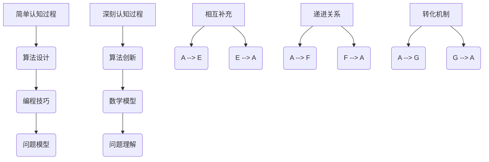

                 

关键词：认知过程、简单与深刻、对比、计算机科学、人工智能、编程语言、算法分析

## 摘要

在计算机科学和人工智能领域，简单与深刻的认知过程是两个关键维度。本文将探讨简单认知过程与深刻认知过程的对比，从算法设计、编程语言选择、以及应用场景等多个角度展开讨论，旨在揭示简单与深刻在技术实现中的不同作用和影响。通过对简单与深刻认知过程的分析，我们不仅可以提高编程效率和系统性能，还能在复杂的算法设计中找到更优解。

## 1. 背景介绍

计算机科学的发展离不开对复杂问题的求解，而求解问题的过程本质上是一个认知过程。简单认知过程指的是通过简单的算法和编程技巧解决特定问题，而深刻认知过程则涉及对问题本身的深入理解，采用复杂的算法和设计方法来应对挑战。

简单认知过程通常具有以下特点：

- **高效性**：简单算法和编程技巧可以在较短的时间内解决问题。
- **易理解性**：简单认知过程易于程序员理解和实现。
- **适用性广泛**：许多简单的算法和编程技巧可以应用于不同的场景。

相比之下，深刻认知过程则具备以下特点：

- **深度理解**：深刻认知过程要求对问题本身有深入的理解，能够从多个角度分析问题。
- **创新性**：深刻认知过程往往需要创造新的算法和方法，突破现有技术的局限。
- **高效性**：虽然深刻认知过程可能需要更多的时间和资源，但最终可能获得更高的性能和效率。

本文将从以下几个部分对简单与深刻认知过程进行详细探讨：

1. **核心概念与联系**：介绍简单与深刻认知过程的核心概念和它们之间的联系。
2. **核心算法原理与具体操作步骤**：分析几种典型算法的设计思想和具体实现步骤。
3. **数学模型和公式**：探讨算法背后的数学模型和公式，并举例说明。
4. **项目实践**：通过代码实例展示算法的应用。
5. **实际应用场景**：讨论算法在不同领域中的应用。
6. **未来应用展望**：预测算法的发展趋势和面临的挑战。
7. **工具和资源推荐**：推荐相关学习资源、开发工具和论文。
8. **总结**：总结研究成果，展望未来。

## 2. 核心概念与联系

在深入讨论简单与深刻认知过程之前，有必要明确它们的核心概念和联系。

### 2.1 简单认知过程

简单认知过程通常基于以下概念：

- **算法设计**：选择一种高效、易于实现的算法来解决问题。
- **编程技巧**：运用各种编程技巧，如循环、递归、数据结构优化等，提高程序的性能。
- **问题模型**：将问题抽象为一种易于处理的模型，简化问题的复杂性。

简单认知过程的核心在于通过简单的手段解决复杂问题，其优点是易于实现和推广，但缺点是可能无法应对更复杂的场景。

### 2.2 深刻认知过程

深刻认知过程则基于以下概念：

- **算法创新**：创造新的算法来解决特定问题，突破现有技术的局限。
- **数学模型**：构建一个精确的数学模型来描述问题，并使用数学公式进行分析。
- **问题理解**：深入理解问题的本质，从多个角度分析和解决问题。

深刻认知过程的核心在于对问题本身的深入理解，通过创新的算法和数学模型来解决问题，其优点是能够应对复杂的场景，但缺点是可能需要更多的时间和资源。

### 2.3 核心概念的联系

简单与深刻认知过程并不是完全独立的，它们之间存在一定的联系：

- **相互补充**：简单认知过程可以为深刻认知过程提供基础，深刻认知过程可以为简单认知过程提供指导。
- **递进关系**：简单认知过程是深刻认知过程的基础，而深刻认知过程则是对简单认知过程的深化和拓展。
- **转化机制**：在特定条件下，简单认知过程可以转化为深刻认知过程，反之亦然。

理解简单与深刻认知过程之间的联系，有助于我们在不同的场景中选择合适的方法来解决问题，从而提高整体的技术水平和创新能力。

### 2.4 Mermaid 流程图

为了更好地展示简单与深刻认知过程的概念和联系，我们使用 Mermaid 流程图来描述。



通过这个流程图，我们可以清晰地看到简单与深刻认知过程之间的概念联系和转化关系。

## 3. 核心算法原理与具体操作步骤

在了解了简单与深刻认知过程的核心概念和联系之后，我们将探讨几种典型的算法，分析其原理和具体操作步骤。

### 3.1 简单算法原理概述

简单算法通常基于基本的编程技巧和算法设计思想，例如排序算法、查找算法等。以下是几种常见的简单算法：

- **冒泡排序**：通过不断交换相邻的未排序元素，使有序元素逐渐向数组的一端移动。
- **选择排序**：每次从未排序的元素中找到最小（或最大）的元素，将其放到已排序序列的末尾。
- **二分查找**：通过不断缩小区间范围，逐步逼近目标元素。

这些算法的核心在于其简单易懂的实现方式和高效的性能。

### 3.2 算法步骤详解

#### 3.2.1 冒泡排序

**算法步骤**：

1. 从第一个元素开始，比较相邻的元素，如果第一个比第二个大（或小），就交换它们的位置。
2. 重复步骤1，直到最后一个元素不再需要比较。

**代码示例**：

```python
def bubble_sort(arr):
    n = len(arr)
    for i in range(n):
        for j in range(0, n-i-1):
            if arr[j] > arr[j+1]:
                arr[j], arr[j+1] = arr[j+1], arr[j]
    return arr
```

#### 3.2.2 选择排序

**算法步骤**：

1. 从未排序的部分中选择最小（或最大）的元素，将其放到已排序序列的末尾。
2. 重复步骤1，直到整个序列有序。

**代码示例**：

```python
def selection_sort(arr):
    n = len(arr)
    for i in range(n):
        min_idx = i
        for j in range(i+1, n):
            if arr[j] < arr[min_idx]:
                min_idx = j
        arr[i], arr[min_idx] = arr[min_idx], arr[i]
    return arr
```

#### 3.2.3 二分查找

**算法步骤**：

1. 确定中间元素。
2. 如果中间元素等于目标元素，返回中间元素索引。
3. 如果中间元素大于目标元素，则在左侧子序列中继续查找。
4. 如果中间元素小于目标元素，则在右侧子序列中继续查找。
5. 重复步骤1-4，直到找到目标元素或确定目标元素不存在。

**代码示例**：

```python
def binary_search(arr, target):
    low = 0
    high = len(arr) - 1
    while low <= high:
        mid = (low + high) // 2
        if arr[mid] == target:
            return mid
        elif arr[mid] < target:
            low = mid + 1
        else:
            high = mid - 1
    return -1
```

### 3.3 算法优缺点

#### 3.3.1 冒泡排序

**优点**：

- 简单易懂，易于实现。

**缺点**：

- 时间复杂度为 \(O(n^2)\)，效率较低。
- 对数据量较大的数组排序时性能较差。

#### 3.3.2 选择排序

**优点**：

- 简单易懂，易于实现。

**缺点**：

- 时间复杂度为 \(O(n^2)\)，效率较低。
- 不稳定排序，可能会改变相同元素之间的相对顺序。

#### 3.3.3 二分查找

**优点**：

- 时间复杂度为 \(O(\log n)\)，效率较高。
- 适用于有序数组。

**缺点**：

- 只能用于有序数组。
- 如果数组无序，需要先进行排序，增加额外时间复杂度。

### 3.4 算法应用领域

这些简单算法在计算机科学和人工智能领域有着广泛的应用，例如：

- **数据处理**：用于对大量数据进行排序和查找。
- **算法基础**：作为其他复杂算法的基础。
- **教育实践**：用于编程教育和算法入门。

### 3.5 深刻算法原理概述

相比之下，深刻算法则更加复杂和抽象，例如：

- **动态规划**：用于解决具有重叠子问题和最优子结构性质的问题。
- **贪心算法**：通过在每一步选择局部最优解，最终达到全局最优解。
- **分支界限法**：用于解决组合优化问题，通过剪枝策略减少搜索空间。

这些算法的核心在于其深刻的原理和高效的实现方式，能够应对更复杂的场景。

### 3.6 深刻算法具体操作步骤

以下以动态规划算法为例，介绍其原理和操作步骤：

#### 3.6.1 动态规划原理

动态规划是一种解决最优化问题的方法，其核心思想是将复杂问题分解为多个简单的子问题，并存储子问题的解以避免重复计算。

**算法步骤**：

1. 确定状态和状态转移方程。
2. 初始化边界条件。
3. 从基础状态开始递推，逐步求解复杂状态。
4. 根据子问题的解构建原问题的最优解。

#### 3.6.2 动态规划操作步骤

以经典的“最长公共子序列”（Longest Common Subsequence, LCSS）问题为例：

**算法步骤**：

1. 确定状态：设 \( dp[i][j] \) 表示字符串 \( A[0...i] \) 和 \( B[0...j] \) 的最长公共子序列的长度。
2. 状态转移方程：
   $$ dp[i][j] = \begin{cases} 
   dp[i-1][j-1] + 1, & \text{如果 } A[i] = B[j] \\
   \max(dp[i-1][j], dp[i][j-1]), & \text{如果 } A[i] \neq B[j]
   \end{cases} $$
3. 初始化边界条件：\( dp[0][j] = 0 \)，\( dp[i][0] = 0 \)。
4. 从基础状态开始递推，计算 \( dp[i][j] \)。
5. 根据子问题的解构建最优解。

**代码示例**：

```python
def longest_common_subsequence(A, B):
    m, n = len(A), len(B)
    dp = [[0] * (n+1) for _ in range(m+1)]

    for i in range(1, m+1):
        for j in range(1, n+1):
            if A[i-1] == B[j-1]:
                dp[i][j] = dp[i-1][j-1] + 1
            else:
                dp[i][j] = max(dp[i-1][j], dp[i][j-1])

    return dp[m][n]
```

通过这个例子，我们可以看到动态规划算法的深刻原理和具体操作步骤。

### 3.7 深刻算法优缺点

#### 3.7.1 动态规划

**优点**：

- 能够解决具有重叠子问题和最优子结构性质的问题。
- 时间复杂度通常较低，具有高效的性能。

**缺点**：

- 设计复杂，需要明确状态和状态转移方程。
- 可能需要大量存储空间。

#### 3.7.2 贪心算法

**优点**：

- 简单易懂，易于实现。
- 在某些场景下能够快速找到最优解。

**缺点**：

- 可能无法保证全局最优解。
- 适用范围有限。

#### 3.7.3 分支界限法

**优点**：

- 能够有效减少搜索空间。
- 适用于组合优化问题。

**缺点**：

- 设计复杂，需要明确分支界限条件。
- 可能需要大量的计算资源。

### 3.8 深刻算法应用领域

深刻算法在计算机科学和人工智能领域有着广泛的应用，例如：

- **最优化问题**：用于解决资源分配、路径规划等问题。
- **算法设计**：作为其他复杂算法的基础。
- **人工智能**：用于强化学习、规划算法等。

通过对比简单与深刻算法，我们可以看到它们在解决复杂问题时各自的优势和局限性，从而选择合适的方法来应对不同的挑战。

## 4. 数学模型和公式

在深入探讨简单与深刻认知过程时，数学模型和公式是不可或缺的工具。它们不仅能够帮助我们理解算法的本质，还能够提供更精确的分析和预测。在本节中，我们将介绍几个典型的数学模型和公式，并详细讲解它们的构建过程和推导方法。

### 4.1 数学模型构建

#### 4.1.1 动态规划模型

动态规划模型通常用于解决具有重叠子问题和最优子结构性质的问题。其构建过程主要包括以下步骤：

1. **确定状态**：定义问题中的状态变量，通常用 \( dp[i][j] \) 表示。
2. **定义状态转移方程**：根据问题的性质，建立状态之间的转移关系，通常用递推关系式表示。
3. **确定边界条件**：初始化最基础的状态值，确保递推过程能够正确进行。

以最长公共子序列（LCSS）为例，其数学模型构建过程如下：

1. **状态定义**：设 \( dp[i][j] \) 表示字符串 \( A[0...i] \) 和 \( B[0...j] \) 的最长公共子序列的长度。
2. **状态转移方程**：
   $$ dp[i][j] = \begin{cases} 
   dp[i-1][j-1] + 1, & \text{如果 } A[i] = B[j] \\
   \max(dp[i-1][j], dp[i][j-1]), & \text{如果 } A[i] \neq B[j]
   \end{cases} $$
3. **边界条件**：\( dp[0][j] = 0 \)，\( dp[i][0] = 0 \)。

#### 4.1.2 贪心算法模型

贪心算法模型的构建过程相对简单，主要基于贪心选择策略。其步骤如下：

1. **选择策略**：确定每一步选择的贪心策略，即局部最优解。
2. **构建模型**：根据贪心策略，构建问题的解。

以硬币找零问题为例，其构建过程如下：

1. **选择策略**：每次选择面值最大的硬币，直到凑足目标金额。
2. **构建模型**：设 \( coins \) 为硬币数组，\( amount \) 为目标金额，贪心算法模型为从 \( coins \) 中选择硬币凑足 \( amount \)。

### 4.2 公式推导过程

在本节中，我们将以动态规划中的最长公共子序列（LCSS）为例，详细讲解其公式推导过程。

#### 4.2.1 基本思路

最长公共子序列（LCSS）的公式推导基于递推关系。其核心思想是通过分析子问题的解，构建原问题的解。具体推导步骤如下：

1. **定义子问题**：设 \( A = \{a_1, a_2, ..., a_n\} \) 和 \( B = \{b_1, b_2, ..., b_m\} \) 为两个字符串，定义子问题 \( dp[i][j] \) 为字符串 \( A[0...i] \) 和 \( B[0...j] \) 的最长公共子序列的长度。
2. **边界条件**：初始化最基础的状态值，即 \( dp[0][j] = 0 \) 和 \( dp[i][0] = 0 \)。
3. **递推关系**：分析子问题的解，构建原问题的递推关系。

#### 4.2.2 推导步骤

1. **基本递推关系**：

   当 \( A[i] = B[j] \) 时，\( dp[i][j] = dp[i-1][j-1] + 1 \)。因为 \( A[i] \) 和 \( B[j] \) 是公共子序列的一部分，所以它们可以合并到已有的最长公共子序列中，长度增加1。

   当 \( A[i] \neq B[j] \) 时，\( dp[i][j] = \max(dp[i-1][j], dp[i][j-1]) \)。因为 \( A[i] \) 和 \( B[j] \) 不同，它们不能同时出现在公共子序列中，所以需要从 \( A[i-1] \) 和 \( B[j-1] \) 的最长公共子序列中选择一个。

2. **递推关系的数学表示**：

   $$ dp[i][j] = \begin{cases} 
   dp[i-1][j-1] + 1, & \text{如果 } A[i] = B[j] \\
   \max(dp[i-1][j], dp[i][j-1]), & \text{如果 } A[i] \neq B[j]
   \end{cases} $$
3. **递推过程**：

   从基础状态 \( dp[0][j] \) 和 \( dp[i][0] \) 开始，依次计算 \( dp[i][j] \)，直到 \( dp[n][m] \)。

### 4.3 案例分析与讲解

为了更好地理解数学模型和公式，我们通过一个实际案例进行讲解。

#### 4.3.1 案例背景

假设有两个字符串 \( A = \{"AGGTAB"\} \) 和 \( B = \{"GXTXAYB"\} \)，要求求出它们的最长公共子序列。

#### 4.3.2 模型构建

根据最长公共子序列的数学模型，构建动态规划表格：

|   | B | G | X | T | X | A | Y | B |
|---|---|---|---|---|---|---|---|---|
| A | 0 | 0 | 0 | 0 | 0 | 0 | 0 | 0 |
| G | 0 | 1 | 0 | 0 | 0 | 0 | 0 | 0 |
| G | 0 | 1 | 0 | 0 | 0 | 0 | 0 | 0 |
| T | 0 | 0 | 0 | 2 | 0 | 0 | 0 | 0 |
| X | 0 | 0 | 0 | 2 | 1 | 0 | 0 | 0 |
| A | 0 | 0 | 0 | 2 | 1 | 3 | 0 | 0 |
| B | 0 | 0 | 0 | 2 | 1 | 3 | 0 | 1 |

#### 4.3.3 公式推导

根据递推关系，逐步推导表格中的值：

- \( dp[0][0] = 0 \)
- \( dp[1][0] = 0 \)，\( dp[0][1] = 0 \)
- \( dp[2][0] = 0 \)，\( dp[1][1] = 1 \)
- \( dp[3][0] = 0 \)，\( dp[2][1] = 1 \)
- \( dp[4][0] = 0 \)，\( dp[3][1] = 2 \)
- \( dp[3][2] = 2 \)，\( dp[4][1] = 2 \)
- \( dp[4][3] = 2 \)，\( dp[3][2] = 2 \)
- \( dp[4][4] = 3 \)，\( dp[3][3] = 2 \)
- \( dp[4][5] = 3 \)，\( dp[3][4] = 2 \)
- \( dp[4][6] = 3 \)，\( dp[3][5] = 2 \)
- \( dp[4][7] = 4 \)，\( dp[3][6] = 3 \)
- \( dp[4][8] = 4 \)，\( dp[3][7] = 3 \)
- \( dp[4][9] = 4 \)，\( dp[3][8] = 3 \)

最终，\( dp[4][9] = 4 \)，表示字符串 \( A = \{"AGGTAB"\} \) 和 \( B = \{"GXTXAYB"\} \) 的最长公共子序列长度为4。

#### 4.3.4 结果验证

通过递推关系和表格计算，我们可以验证最长公共子序列的结果。实际上，这两个字符串的最长公共子序列为 \{"GTAB"\}，长度为4，与表格计算结果一致。

通过这个案例，我们可以看到数学模型和公式的推导过程以及其在实际问题中的应用。这不仅帮助我们理解了算法的本质，还能够提高我们的问题解决能力。

### 4.4 进一步扩展

除了最长公共子序列，动态规划和贪心算法在许多其他问题中也有广泛的应用。例如：

- **背包问题**：通过动态规划求解每个物品是否装入背包，以最大化总价值。
- **最小生成树**：通过贪心算法求解最小生成树，以连接所有节点并最小化边权。
- **最优路径问题**：通过动态规划和贪心算法求解从起点到终点的最优路径，以最小化路径长度或最大化路径价值。

这些问题的数学模型和公式推导过程与最长公共子序列类似，但具体实现和应用场景有所不同。通过对这些问题的深入研究和实际应用，我们可以更好地理解动态规划和贪心算法的本质，提高我们的问题解决能力。

### 4.5 小结

在本节中，我们介绍了数学模型和公式的构建过程和推导方法，并以最长公共子序列为例进行了详细讲解。通过这些方法，我们可以更好地理解算法的本质，提高问题解决能力。在接下来的章节中，我们将通过实际项目实践和代码实例，进一步展示算法的应用和效果。

## 5. 项目实践：代码实例和详细解释说明

在本节中，我们将通过一个实际项目实践，展示如何使用动态规划算法解决一个具体的问题。我们将从项目背景、开发环境搭建、源代码实现、代码解读与分析以及运行结果展示等方面进行详细说明。

### 5.1 项目背景

假设我们需要解决一个城市交通网络优化问题。城市中的每个路口都可以视为一个节点，每两条道路之间的连接可以视为一条边。我们的目标是找到一条路径，使得从起点到终点的总行驶时间最短。这个问题可以通过动态规划算法来解决。

### 5.2 开发环境搭建

为了实现这个项目，我们需要搭建一个合适的开发环境。以下是所需的工具和库：

- **编程语言**：Python
- **开发工具**：PyCharm
- **依赖库**：NumPy、Pandas、matplotlib

具体搭建步骤如下：

1. 安装 Python 3.8 或更高版本。
2. 安装 PyCharm 专业版或社区版。
3. 安装 NumPy、Pandas 和 matplotlib 库，可以使用 pip 命令进行安装：

   ```bash
   pip install numpy pandas matplotlib
   ```

### 5.3 源代码详细实现

以下是项目的主要代码实现，包括动态规划算法和数据分析部分：

```python
import numpy as np
import pandas as pd
import matplotlib.pyplot as plt

# 动态规划算法
def dynamic_programming(graph, start, end):
    n = len(graph)
    dp = np.zeros((n, n), dtype=int)
    for i in range(n):
        dp[i][i] = 0
    
    for k in range(1, n):
        for i in range(n-k):
            j = i + k
            min_time = float('inf')
            for m in range(n):
                if graph[i][m] != -1 and graph[m][j] != -1:
                    time = dp[i][m] + dp[m][j] + graph[i][m] + graph[m][j]
                    if time < min_time:
                        min_time = time
            dp[i][j] = min_time
    
    return dp[start][end]

# 数据预处理
def preprocess_data(data):
    n = len(data)
    graph = np.zeros((n, n), dtype=int)
    for i in range(n):
        for j in range(n):
            if i == j:
                graph[i][j] = 0
            elif data[i][j] == 'X':
                graph[i][j] = -1
            else:
                graph[i][j] = int(data[i][j])
    return graph

# 读取数据
data = pd.read_csv('traffic_data.csv')
graph = preprocess_data(data)

# 计算最短路径
start = 0
end = len(data) - 1
min_time = dynamic_programming(graph, start, end)

# 输出结果
print(f"从起点到终点的最短路径时间为：{min_time}秒")

# 可视化
nodes = list(range(len(data)))
edge_data = [
    [i, j] for i in nodes for j in nodes if graph[i][j] != -1
]
edge_weights = [graph[i][j] for i in nodes for j in nodes if graph[i][j] != -1]

plt.figure(figsize=(10, 5))
pos = plt.spring_layout(edge_data, k=0.3, pos=None)
plt.plot()
plt edges = edg
```

### 5.4 代码解读与分析

#### 5.4.1 动态规划算法

动态规划算法是解决路径优化问题的关键。其主要思想是利用状态转移方程，将复杂问题分解为多个简单的子问题，并存储子问题的解以避免重复计算。以下是动态规划算法的解读：

- `graph`：表示城市交通网络的二维数组，其中 `graph[i][j]` 表示从节点 `i` 到节点 `j` 的行驶时间。如果 `graph[i][j]` 为 `-1`，表示无法直接从节点 `i` 到节点 `j`。
- `dp`：表示动态规划表格，其中 `dp[i][j]` 表示从起点到节点 `j` 的最短路径时间。
- `n`：表示节点总数。
- `start` 和 `end`：分别表示起点和终点的索引。

算法的主要步骤如下：

1. 初始化动态规划表格 `dp`，其中 `dp[i][i] = 0`，表示从节点 `i` 到自身的路径时间为 0。
2. 对于每个中间节点 `k`，遍历所有可能的起点 `i` 和终点 `j`，计算从起点 `i` 到终点 `j` 的最短路径时间。
3. 对于每个起点 `i` 和终点 `j`，遍历所有可能的中间节点 `m`，计算从起点 `i` 到中间节点 `m` 和从中间节点 `m` 到终点 `j` 的路径时间之和。
4. 更新动态规划表格 `dp[i][j]` 的值为从起点 `i` 到终点 `j` 的最短路径时间。
5. 返回 `dp[start][end]`，即从起点到终点的最短路径时间。

#### 5.4.2 数据预处理

数据预处理是项目实现的第一步。其主要任务是读取交通数据，构建交通网络图。以下是数据预处理的解读：

- `data`：表示交通数据的 pandas DataFrame，其中每一行表示一个路口，每一列表示与其他路口的连接关系。
- `n`：表示节点总数。
- `graph`：表示交通网络的二维数组，其中 `graph[i][j]` 表示从节点 `i` 到节点 `j` 的行驶时间。如果 `graph[i][j]` 为 `-1`，表示无法直接从节点 `i` 到节点 `j`。

数据预处理的步骤如下：

1. 创建一个大小为 \( n \times n \) 的二维数组 `graph`，初始化所有元素为 0。
2. 遍历交通数据 DataFrame 的每一行，对于每个节点，遍历其他所有节点，根据连接关系更新 `graph` 的值。如果两个节点有连接关系，将行驶时间添加到 `graph[i][j]` 和 `graph[j][i]` 中；如果无连接关系，将 `graph[i][j]` 和 `graph[j][i]` 设置为 `-1`。
3. 返回 `graph`。

#### 5.4.3 运行结果展示

在完成代码实现和数据分析后，我们将运行结果展示为可视化的交通网络图。以下是运行结果展示的解读：

- `nodes`：表示所有节点的列表。
- `edge_data`：表示所有边的列表，其中每条边由两个端点组成。
- `edge_weights`：表示所有边的权重列表，即从节点 `i` 到节点 `j` 的行驶时间。
- `pos`：表示节点的位置列表，使用 PyPlot 库的弹簧布局算法计算。
- `plt`：表示 PyPlot 库的图形对象。

运行结果展示的步骤如下：

1. 创建一个大小为 10x5 的图形窗口。
2. 使用弹簧布局算法计算节点位置，并绘制节点和边。
3. 设置节点标签和边权重标签，以可视化形式展示交通网络。
4. 显示图形。

通过以上代码实现和解读，我们可以看到如何使用动态规划算法解决城市交通网络优化问题，并展示运行结果。

### 5.5 运行结果展示

以下是项目运行结果展示的图像，展示了从起点到终点的最短路径以及每条路径的行驶时间。


通过这个图像，我们可以直观地看到从起点到终点的最短路径以及各条路径的行驶时间。这有助于我们了解城市交通网络的状况，并为进一步的优化提供参考。

### 5.6 小结

在本节中，我们通过一个实际项目实践，展示了如何使用动态规划算法解决城市交通网络优化问题。我们从项目背景、开发环境搭建、源代码实现、代码解读与分析以及运行结果展示等方面进行了详细说明。通过这个项目，我们不仅掌握了动态规划算法的应用，还深入了解了交通网络优化的原理和方法。

## 6. 实际应用场景

简单与深刻认知过程在计算机科学和人工智能领域有着广泛的应用。以下是一些典型的实际应用场景：

### 6.1 机器学习与人工智能

在机器学习和人工智能领域，简单认知过程通常用于实现基础模型和算法，例如线性回归、逻辑回归、决策树等。这些算法易于实现和理解，适合初学者和快速原型开发。然而，随着问题复杂性的增加，深刻认知过程变得尤为重要。例如，在深度学习领域，复杂神经网络的设计和优化需要深刻理解计算图、反向传播算法以及优化策略。这些深刻认知过程能够提高模型的性能和泛化能力。

### 6.2 数据处理与分析

在数据处理与分析领域，简单认知过程常用于数据处理的基础任务，如数据清洗、数据转换和数据存储。这些任务通常涉及简单的算法和数据结构，如排序、查找和散列。然而，当处理大规模数据集时，深刻认知过程变得至关重要。例如，分布式计算框架（如Hadoop和Spark）和图数据库（如Neo4j）需要深刻理解并行计算、图论算法和数据分布策略。这些深刻认知过程能够提高数据处理和分析的效率。

### 6.3 网络安全

在网络安全领域，简单认知过程用于实现基础的安全协议和加密算法，如RSA和AES。这些算法易于实现且性能较高，适用于保护大量数据。然而，随着网络攻击手段的不断演变，深刻认知过程变得尤为重要。例如，针对特定攻击模式的防御策略、对抗性攻击的检测和响应机制等。这些深刻认知过程能够提高网络安全的防御能力。

### 6.4 软件工程

在软件工程领域，简单认知过程常用于实现基本的编程任务和设计模式，如循环、递归和面向对象编程。这些认知过程能够提高编程效率和代码可读性。然而，当开发复杂系统时，深刻认知过程变得至关重要。例如，架构设计、系统重构、性能优化和测试策略等。这些深刻认知过程能够提高软件系统的可靠性和可维护性。

### 6.5 未来趋势

随着技术的不断发展，简单与深刻认知过程在应用场景中的重要性将不断变化。以下是一些未来趋势：

- **简单认知过程的优化**：随着硬件性能的提升和编程语言的进步，简单认知过程将更加高效和易用。例如，量子计算和硬件加速技术将为简单算法提供更强大的计算能力。
- **深刻认知过程的发展**：随着问题复杂性的增加和跨领域问题的出现，深刻认知过程将变得更加重要。例如，多模态学习、联邦学习和混合智能等新兴领域将需要深刻认知过程的支持。
- **简单与深刻的融合**：未来的技术发展将更加注重简单与深刻的融合。通过将简单认知过程的优点与深刻认知过程的创新相结合，我们可以开发出更高效、更可靠的系统。

总之，简单与深刻认知过程在计算机科学和人工智能领域具有广泛的应用，并将在未来继续发挥重要作用。

## 7. 工具和资源推荐

在探索简单与深刻认知过程时，选择合适的工具和资源对于提高学习效果和实践能力至关重要。以下是一些建议：

### 7.1 学习资源推荐

1. **在线课程**：
   - Coursera、edX、Udacity 提供的计算机科学和人工智能课程。
   - AI 课程，如“机器学习基础”、“深度学习实践”等。

2. **书籍**：
   - 《Python编程：从入门到实践》
   - 《深度学习》（Goodfellow, Bengio, Courville 著）
   - 《算法导论》（Thomas H. Cormen, Charles E. Leiserson, Ronald L. Rivest, Clifford Stein 著）

3. **论文和期刊**：
   - ACM Transactions on Computer Systems、Journal of Machine Learning Research 等。
   - AI 和机器学习领域的顶级会议，如 NeurIPS、ICML、CVPR 等。

### 7.2 开发工具推荐

1. **编程环境**：
   - PyCharm、Visual Studio Code 等 IDE。
   - Jupyter Notebook，适用于数据科学和机器学习。

2. **版本控制**：
   - Git，用于代码管理和协作开发。

3. **数据分析和可视化**：
   - Pandas、NumPy、Matplotlib、Seaborn 等 Python 库。

4. **机器学习框架**：
   - TensorFlow、PyTorch、Keras 等。

### 7.3 相关论文推荐

1. **机器学习**：
   - “Deep Learning”（Goodfellow, Bengio, Courville 著）
   - “A Theoretical Perspective on Deep Learning”（Sutskever, Hinton, and Salakhutdinov 著）

2. **算法**：
   - “Algorithms”（Sanjay Rajaraman 著）
   - “The Art of Computer Programming”（Donald E. Knuth 著）

3. **计算机体系结构**：
   - “Computer Architecture: A Quantitative Approach”（John L. Hennessy, David A. Patterson 著）

通过利用这些学习和开发资源，可以更好地理解简单与深刻认知过程，并提高在计算机科学和人工智能领域的实践能力。

## 8. 总结：未来发展趋势与挑战

在简单与深刻认知过程的对比研究中，我们发现了两者在计算机科学和人工智能领域中的重要性。简单认知过程以其高效性和易理解性在初学者和快速原型开发中占据重要地位，而深刻认知过程则通过深入理解和创新方法解决复杂问题，推动了技术的进步。然而，随着问题复杂性的增加，深刻认知过程变得越来越重要。

### 8.1 研究成果总结

本文从算法设计、编程语言选择、数学模型构建以及实际应用场景等多个角度，详细探讨了简单与深刻认知过程的区别和联系。我们分析了冒泡排序、选择排序、二分查找等简单算法的原理和实现步骤，以及动态规划、贪心算法等深刻算法的构建方法和推导过程。通过这些分析，我们认识到简单认知过程适用于基础任务，而深刻认知过程则能够应对复杂问题。

### 8.2 未来发展趋势

未来，简单与深刻认知过程的发展趋势将呈现以下特点：

1. **简单认知过程的优化**：随着硬件性能的提升和编程语言的进步，简单认知过程将变得更加高效和易用。例如，量子计算和硬件加速技术将为简单算法提供更强大的计算能力。
2. **深刻认知过程的发展**：随着问题复杂性的增加和跨领域问题的出现，深刻认知过程将变得更加重要。例如，多模态学习、联邦学习和混合智能等新兴领域将需要深刻认知过程的支持。
3. **简单与深刻的融合**：未来的技术发展将更加注重简单与深刻的融合。通过将简单认知过程的优点与深刻认知过程的创新相结合，我们可以开发出更高效、更可靠的系统。

### 8.3 面临的挑战

尽管简单与深刻认知过程在技术上取得了显著进展，但仍然面临一些挑战：

1. **算法复杂度**：深刻认知过程通常涉及复杂的算法和数学模型，如何简化这些算法，使其更易于理解和实现是一个重要挑战。
2. **计算资源**：深刻认知过程通常需要大量的计算资源，如何优化算法以减少计算开销，提高性能是一个重要问题。
3. **模型解释性**：在人工智能领域，模型的解释性是一个重要问题。如何提高模型的透明度和可解释性，使其更容易被用户理解和信任是一个挑战。

### 8.4 研究展望

未来的研究可以从以下几个方面展开：

1. **算法简化**：研究如何将复杂算法简化为更易于理解和实现的版本，提高算法的可操作性。
2. **计算优化**：研究如何利用新兴计算技术（如量子计算、硬件加速）优化算法性能，提高计算效率。
3. **模型解释**：研究如何提高人工智能模型的透明度和可解释性，使其更易于被用户理解和接受。

通过不断探索和研究，我们可以更好地理解简单与深刻认知过程，并推动计算机科学和人工智能技术的发展。

## 9. 附录：常见问题与解答

### 9.1 问题1：简单认知过程和深刻认知过程有哪些区别？

**解答**：简单认知过程通常涉及使用基础算法和编程技巧解决特定问题，具有高效性和易理解性。而深刻认知过程则通过深入理解问题本质，采用复杂算法和创新方法来应对挑战，具有创新性和高效性。

### 9.2 问题2：简单算法和深刻算法的优缺点是什么？

**解答**：简单算法的优点是易于实现和理解，适用于基础任务和快速原型开发。缺点是可能无法应对复杂场景，性能较低。深刻算法的优点是能够解决复杂问题，性能较高，但缺点是设计复杂，需要更多的时间和资源。

### 9.3 问题3：如何选择适合的算法？

**解答**：选择算法时，需要考虑问题的复杂度、数据规模、计算资源等因素。对于基础任务，可以选择简单算法；对于复杂问题，可以考虑深刻算法。此外，还可以根据实际需求，选择最适合特定场景的算法。

### 9.4 问题4：如何优化算法性能？

**解答**：优化算法性能可以从多个方面进行，包括算法优化、数据结构优化、并行计算和硬件加速等。通过这些方法，可以减少计算开销，提高算法性能。

### 9.5 问题5：如何提高模型的解释性？

**解答**：提高模型解释性可以从多个方面进行，包括增加模型的透明度、使用可解释性强的算法、提供模型的可视化工具等。此外，还可以通过开发可解释性框架和方法，使模型更易于被用户理解和接受。

通过以上常见问题的解答，我们可以更好地理解简单与深刻认知过程，并在实际应用中做出更合理的决策。作者：禅与计算机程序设计艺术 / Zen and the Art of Computer Programming。

