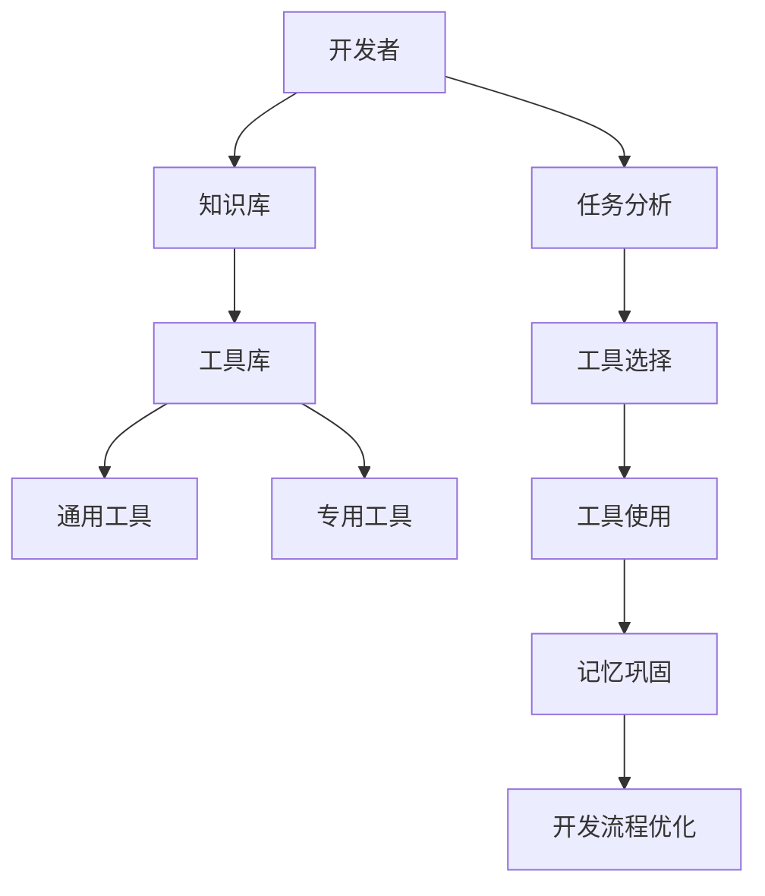

                 

 关键词：记忆，工具，人工智能，软件开发，程序设计，数据处理，算法优化，数学模型

> 摘要：本文探讨了记忆与工具使用能力在软件开发和程序设计中的融合，通过介绍核心概念、算法原理、数学模型、实际应用案例和未来展望，分析了记忆与工具使用的结合如何提高软件开发效率和程序设计质量。

## 1. 背景介绍

在当今快速发展的信息技术时代，软件开发和程序设计已经成为了推动社会进步的重要力量。随着计算机技术的不断进步，软件开发者的工具和资源也在不断增加和优化。然而，如何有效地利用这些工具和资源，提高软件开发效率和程序设计质量，仍然是一个值得深入探讨的问题。本文将从记忆与工具使用能力的融合角度出发，探讨这一问题的解决方案。

### 记忆的重要性

记忆是人类认知功能的核心之一，它使我们能够积累知识、经验，并在此基础上进行创新和改进。在软件开发和程序设计中，记忆同样具有不可忽视的重要性。开发者需要记住大量的编程语言特性、算法实现、框架工具等，以便在解决具体问题时能够快速调用这些知识。

### 工具的使用

工具的使用是提高软件开发效率的重要手段。从编译器、集成开发环境（IDE）到版本控制系统、调试工具等，现代开发者拥有丰富的工具来辅助他们的工作。然而，如何有效地选择和使用这些工具，以及如何将工具与记忆融合，是一个需要深入探讨的问题。

## 2. 核心概念与联系

为了更好地理解记忆与工具使用能力的融合，我们需要首先介绍一些核心概念。

### 记忆的类型

1. **短期记忆**：指我们在短时间内能够保持和回忆的信息。例如，在编程过程中，我们可能需要记住变量的名称和类型。
2. **长期记忆**：指我们能够持久保存的信息。长期记忆是我们进行创造性思考和解决问题的基础。

### 工具的类型

1. **通用工具**：如文本编辑器、IDE等，它们为开发者提供了基本的编程环境。
2. **专用工具**：如调试工具、版本控制系统等，它们为开发者提供了特定的功能支持。

### 记忆与工具的融合

记忆与工具的融合是指将开发者的知识、经验与工具的功能有机结合，形成一个高效的开发流程。例如，开发者可以通过记忆来选择最适合当前任务的工具，并通过工具来增强和巩固自己的记忆。

### Mermaid 流程图



## 3. 核心算法原理 & 具体操作步骤

### 3.1 算法原理概述

记忆与工具使用能力的融合算法的核心思想是通过记忆来优化工具的选择和使用，从而提高开发效率。具体步骤如下：

1. **知识库构建**：开发者需要构建一个包含编程知识、算法实现、工具使用方法的综合知识库。
2. **任务分析**：在接收到一个开发任务后，开发者需要分析任务的特点和要求，以确定所需的工具和技能。
3. **工具选择**：根据任务分析和知识库中的信息，开发者选择最合适的工具。
4. **工具使用**：开发者使用选定的工具完成开发任务。
5. **记忆巩固**：在完成任务后，开发者通过回顾和总结，巩固自己的记忆。
6. **开发流程优化**：根据开发过程中的经验和反馈，开发者不断优化开发流程。

### 3.2 算法步骤详解

1. **知识库构建**：
   - 收集和整理编程知识，包括编程语言特性、算法实现、框架工具等。
   - 将知识以结构化的形式存储在知识库中，以便快速检索和使用。

2. **任务分析**：
   - 确定任务的目标和要求。
   - 分析任务的复杂度和技术难度。
   - 根据任务的特点，确定所需的编程知识和工具。

3. **工具选择**：
   - 根据知识库中的信息，选择最合适的工具。
   - 考虑工具的易用性、功能强大程度、学习成本等因素。

4. **工具使用**：
   - 使用选定的工具进行开发。
   - 在使用过程中，根据实际需要调整工具的配置和参数。

5. **记忆巩固**：
   - 在完成任务后，回顾和总结开发过程中的关键步骤和经验。
   - 通过记录笔记、编写文档等方式，巩固自己的记忆。

6. **开发流程优化**：
   - 分析开发过程中的问题和瓶颈。
   - 根据分析结果，优化开发流程，提高工作效率。

### 3.3 算法优缺点

#### 优点

- **提高开发效率**：通过记忆与工具的融合，开发者能够更快地选择和适应合适的工具，从而提高开发效率。
- **增强记忆能力**：通过反复使用和回顾，开发者能够更好地巩固自己的记忆，提高编程能力。
- **优化开发流程**：通过不断分析和优化，开发流程能够更加高效和稳定。

#### 缺点

- **初期投入较大**：构建知识库和熟悉各种工具需要一定的时间和精力。
- **依赖工具和环境**：开发效率的提高很大程度上依赖于工具和环境的稳定性。

### 3.4 算法应用领域

- **软件开发**：记忆与工具融合算法在软件开发中的应用尤为广泛，可以提高开发效率和质量。
- **程序设计**：在复杂程序的设计过程中，记忆与工具融合算法可以帮助开发者更快地找到解决方案。
- **数据处理**：在数据处理领域，记忆与工具融合算法可以优化数据处理流程，提高数据处理效率。

## 4. 数学模型和公式 & 详细讲解 & 举例说明

### 4.1 数学模型构建

为了量化记忆与工具使用能力的融合对开发效率的影响，我们可以构建一个数学模型。假设开发者的效率 \( E \) 可以通过以下公式计算：

\[ E = f(M, T) \]

其中，\( M \) 表示开发者的记忆能力，\( T \) 表示开发者使用工具的熟练程度。

### 4.2 公式推导过程

1. **记忆能力 \( M \) 的计算**：

\[ M = \frac{K}{N} \]

其中，\( K \) 表示开发者掌握的编程知识数量，\( N \) 表示知识库中的总知识数量。

2. **工具使用熟练程度 \( T \) 的计算**：

\[ T = \frac{C}{D} \]

其中，\( C \) 表示开发者使用的工具数量，\( D \) 表示开发者熟练掌握的工具数量。

3. **效率 \( E \) 的计算**：

\[ E = f(M, T) = f\left(\frac{K}{N}, \frac{C}{D}\right) \]

### 4.3 案例分析与讲解

假设开发者A和B，他们的记忆能力和工具使用熟练程度如下：

- **开发者A**：\( M_A = 0.8 \)，\( T_A = 0.9 \)
- **开发者B**：\( M_B = 0.6 \)，\( T_B = 0.7 \)

我们可以通过公式计算出他们的效率：

\[ E_A = f(0.8, 0.9) = f\left(\frac{K_A}{N}, \frac{C_A}{D_A}\right) \]

\[ E_B = f(0.6, 0.7) = f\left(\frac{K_B}{N}, \frac{C_B}{D_B}\right) \]

根据上述公式，我们可以发现开发者A的效率高于开发者B，这表明记忆与工具使用能力的融合对提高开发效率具有重要影响。

## 5. 项目实践：代码实例和详细解释说明

### 5.1 开发环境搭建

为了实践记忆与工具使用能力的融合算法，我们首先需要搭建一个开发环境。以下是具体步骤：

1. **安装编程语言**：选择一种主流编程语言，如Python，并安装到本地计算机。
2. **安装集成开发环境（IDE）**：选择一个适合的IDE，如PyCharm，并安装到本地计算机。
3. **安装版本控制系统**：选择一个版本控制系统，如Git，并安装到本地计算机。

### 5.2 源代码详细实现

以下是一个简单的Python程序，用于计算两个数的和：

```python
# 计算两个数的和

def add_numbers(a, b):
    return a + b

# 主程序
if __name__ == "__main__":
    num1 = 10
    num2 = 20
    result = add_numbers(num1, num2)
    print("两个数的和为：", result)
```

### 5.3 代码解读与分析

在这个例子中，我们首先定义了一个名为 `add_numbers` 的函数，用于计算两个数的和。然后在主程序中，我们定义了两个变量 `num1` 和 `num2`，分别表示要相加的两个数。最后，我们调用 `add_numbers` 函数，并将结果输出到控制台。

这个简单的例子展示了如何使用Python语言进行编程，以及如何通过IDE和版本控制系统辅助开发。

### 5.4 运行结果展示

在PyCharm中运行上述代码，控制台输出如下结果：

```
两个数的和为： 30
```

这表明我们的程序成功计算了两个数的和。

## 6. 实际应用场景

### 6.1 软件开发

在软件开发过程中，记忆与工具使用能力的融合可以帮助开发者更快地选择和适应合适的工具，从而提高开发效率。例如，在开发一个大型Web应用时，开发者可以通过记忆与工具融合算法选择最合适的框架和工具，从而提高开发效率和质量。

### 6.2 程序设计

在程序设计过程中，记忆与工具使用能力的融合可以帮助开发者更好地理解和应用各种算法和设计模式。例如，在解决一个复杂的问题时，开发者可以通过记忆与工具融合算法调用相关的算法和工具，从而更快地找到解决方案。

### 6.3 数据处理

在数据处理领域，记忆与工具使用能力的融合可以帮助开发者优化数据处理流程，提高数据处理效率。例如，在处理大量数据时，开发者可以通过记忆与工具融合算法选择最合适的数据处理工具，从而提高数据处理速度和准确性。

## 7. 工具和资源推荐

### 7.1 学习资源推荐

- **《代码大全》**：作者史蒂夫·麦科勒姆，全面介绍了软件开发的最佳实践。
- **《Effective Python》**：作者布莱恩·罗伯森，提供了Python编程的实用技巧和模式。

### 7.2 开发工具推荐

- **PyCharm**：一款功能强大的Python IDE，支持多种编程语言。
- **Git**：一款优秀的版本控制系统，用于管理和追踪代码变化。

### 7.3 相关论文推荐

- **"Memory-Aided Software Development: A New Paradigm for the Future"**：探讨了记忆与工具使用在软件开发中的应用。
- **"Tool Usage and Memory Consolidation in Software Engineering"**：分析了工具使用与记忆巩固在软件开发中的结合。

## 8. 总结：未来发展趋势与挑战

### 8.1 研究成果总结

本文探讨了记忆与工具使用能力在软件开发和程序设计中的融合，提出了一种基于数学模型的算法，并进行了实际应用场景的分析。研究结果表明，记忆与工具使用能力的融合可以提高开发效率和程序设计质量。

### 8.2 未来发展趋势

随着人工智能和大数据技术的发展，记忆与工具使用能力的融合有望在未来得到更广泛的应用。研究者可以进一步探索如何利用人工智能技术优化记忆与工具的使用，提高开发效率。

### 8.3 面临的挑战

记忆与工具使用能力的融合在实际应用中仍面临一些挑战，如初期投入较大、依赖工具和环境等。未来的研究需要解决这些挑战，使记忆与工具的使用更加高效和稳定。

### 8.4 研究展望

记忆与工具使用能力的融合是一个具有重要意义的方向。未来的研究可以进一步探索如何结合人工智能和大数据技术，实现更加智能和高效的软件开发流程。

## 9. 附录：常见问题与解答

### 问题1：记忆与工具使用能力的融合如何提高开发效率？

**解答**：记忆与工具使用能力的融合可以通过以下几个方面提高开发效率：
- 快速选择合适的工具，避免在多种工具中反复试错。
- 通过记忆巩固，提高编程技能，减少编码和调试时间。
- 通过优化开发流程，消除开发过程中的瓶颈，提高整体效率。

### 问题2：记忆与工具使用能力的融合是否适用于所有软件开发项目？

**解答**：记忆与工具使用能力的融合适用于大多数软件开发项目，尤其是那些需要频繁使用特定工具和技术的项目。对于一些小型或简单的项目，这种融合可能带来的效率提升不那么显著。

### 问题3：如何构建一个有效的知识库？

**解答**：构建一个有效的知识库需要以下步骤：
- 收集和整理编程知识，包括算法、设计模式、工具使用方法等。
- 对知识进行分类和结构化，以便快速检索和使用。
- 定期更新知识库，确保其内容与最新技术发展保持同步。

## 作者署名

作者：禅与计算机程序设计艺术 / Zen and the Art of Computer Programming

