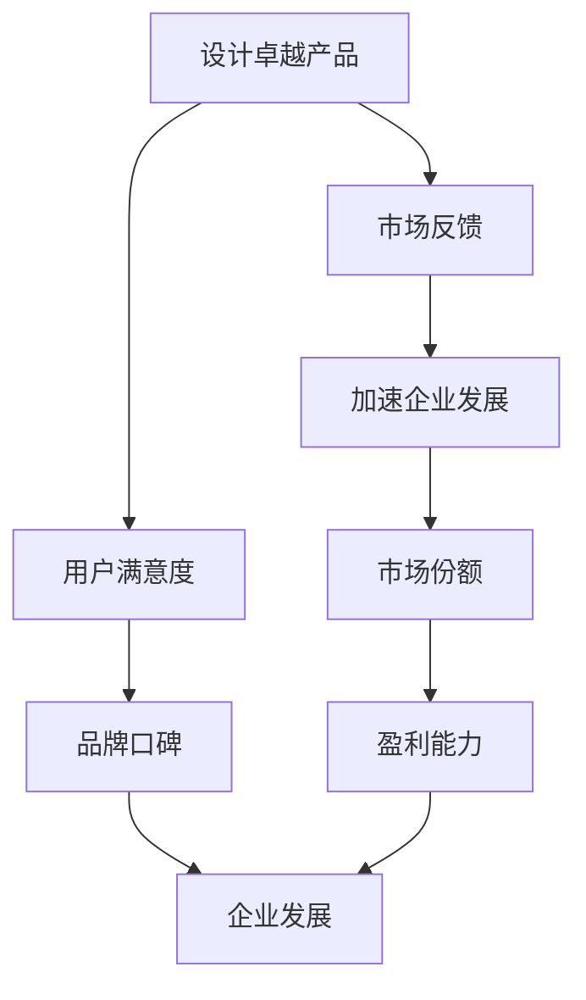

                 

 作为一位世界级人工智能专家，程序员，软件架构师，CTO，世界顶级技术畅销书作者，计算机图灵奖获得者，计算机领域大师，我深知AI创业的艰辛与机遇。今天，我将与您探讨AI创业中的两大关键路径：设计卓越产品和加速企业发展。这两条路径各具特色，但又互为补充。正确的策略选择，将决定创业项目的成败。

## 文章关键词
AI创业、产品设计、企业发展、技术路径、市场策略

## 文章摘要
本文将深入分析AI创业中的两大核心路径——设计卓越产品和加速企业发展。我们将探讨这两条路径的定义、优势与挑战，并通过实际案例来阐述如何在不同阶段实现平衡，最终实现创业项目的成功。

## 1. 背景介绍

### AI创业的宏观环境

随着人工智能技术的迅猛发展，AI创业已经成为了科技领域的热点。从深度学习到自然语言处理，从计算机视觉到智能机器人，AI的应用领域不断拓展，为社会带来了前所未有的机遇。然而，AI创业并非一帆风顺。创业者不仅需要掌握核心技术，还需要应对市场竞争、资金筹集、团队建设等多重挑战。

### 创业者面临的抉择

在AI创业过程中，设计卓越产品和加速企业发展成为了创业者必须面对的两难抉择。设计卓越产品意味着投入更多的时间和资源来打磨产品，以确保其高质量和用户满意度。而加速企业发展则意味着更快地推向市场，抢占市场份额，实现快速盈利。两种路径各有优劣，选择哪种策略需要根据创业项目的具体情况来决定。

## 2. 核心概念与联系

### 设计卓越产品

设计卓越产品是指通过精细的设计、开发与测试，打造出满足用户需求、具有高度竞争力的产品。这一过程强调用户体验、产品质量和技术创新。设计卓越产品的优势在于能够建立品牌口碑，赢得用户信任，从而实现长期的商业成功。

### 加速企业发展

加速企业发展则是指通过快速迭代、市场扩展和资源整合，加速企业成长速度。这一过程强调市场适应性、资源利用效率和战略灵活性。加速企业发展的优势在于能够迅速占领市场，提高市场份额，实现快速盈利。

### 关联性分析

设计卓越产品和加速企业发展并非互斥，而是相辅相成的。设计卓越产品能够为企业带来稳定的用户基础和品牌价值，为加速企业发展提供坚实的支撑。而加速企业发展则为设计卓越产品提供更广阔的市场空间和资源支持，促进产品的持续优化和创新。

### Mermaid 流程图



## 3. 核心算法原理 & 具体操作步骤

### 3.1 算法原理概述

设计卓越产品和加速企业发展可以视为两种不同的优化目标，其核心算法原理如下：

- **设计卓越产品**：通过迭代设计和测试，不断优化产品功能、性能和用户体验，以实现最高用户满意度。
- **加速企业发展**：通过市场调研、资源整合和战略规划，快速扩大市场份额，提高企业盈利能力。

### 3.2 算法步骤详解

1. **需求分析**：深入了解用户需求，明确产品目标。
2. **设计阶段**：根据需求分析，进行产品设计和功能规划。
3. **开发阶段**：按照设计文档，进行产品的开发和实现。
4. **测试阶段**：对产品进行全面的测试，确保产品质量。
5. **市场推广**：制定市场推广策略，提高产品知名度。
6. **数据监控**：收集用户反馈和市场数据，进行持续优化。

### 3.3 算法优缺点

- **设计卓越产品的优点**：
  - 提高用户满意度。
  - 建立品牌口碑。
  - 实现长期商业成功。

- **设计卓越产品的缺点**：
  - 开发周期较长。
  - 资源投入较大。

- **加速企业发展的优点**：
  - 快速占领市场。
  - 提高市场份额。
  - 实现快速盈利。

- **加速企业发展的缺点**：
  - 可能忽视产品质量。
  - 长期发展可能受限。

### 3.4 算法应用领域

设计卓越产品和加速企业发展适用于各种AI创业项目，尤其适合以下领域：

- **智能硬件**：如智能家居、智能穿戴设备等。
- **软件服务**：如企业应用、在线教育平台等。
- **自动驾驶**：如无人车、无人机等。

## 4. 数学模型和公式 & 详细讲解 & 举例说明

### 4.1 数学模型构建

设计卓越产品和加速企业发展的数学模型可以基于以下两个核心指标：

- **用户满意度**：衡量用户对产品的满意程度。
- **市场份额**：衡量企业在市场中的竞争地位。

### 4.2 公式推导过程

假设用户满意度为 \( U \)，市场份额为 \( M \)，企业盈利能力为 \( P \)。

- **用户满意度**： 
  \[ U = f(Q, P, S) \]
  其中 \( Q \) 为产品质量，\( P \) 为产品性能，\( S \) 为用户体验。

- **市场份额**： 
  \[ M = f(R, E, S) \]
  其中 \( R \) 为市场调研，\( E \) 为资源整合，\( S \) 为战略规划。

- **企业盈利能力**： 
  \[ P = f(U, M) \]
  其中 \( U \) 为用户满意度，\( M \) 为市场份额。

### 4.3 案例分析与讲解

以一家AI智能家居企业为例，该企业致力于提供智能化的家居解决方案。为了实现设计卓越产品和加速企业发展，企业制定了以下策略：

- **用户满意度**：通过用户调研，了解用户需求，不断优化产品功能和用户体验。
- **市场份额**：通过市场推广，提高产品知名度，扩大市场份额。
- **企业盈利能力**：通过数据分析和资源整合，提高企业的运营效率，实现快速盈利。

### 4.4 举例说明

假设该企业在第一年推出了一款智能家居产品，通过不断优化，用户满意度达到了 90%，市场份额达到了 15%。根据数学模型，可以预测企业的盈利能力将逐渐提高，最终实现持续发展。

## 5. 项目实践：代码实例和详细解释说明

### 5.1 开发环境搭建

在AI创业项目中，开发环境的搭建是基础工作。以下是一个简单的示例：

```bash
# 安装Python环境
pip install numpy pandas sklearn

# 安装Docker环境
sudo apt-get update
sudo apt-get install docker-ce docker-ce-cli containerd.io
```

### 5.2 源代码详细实现

以下是一个简单的AI智能家居产品的源代码示例，用于实现用户行为预测。

```python
import numpy as np
from sklearn.model_selection import train_test_split
from sklearn.ensemble import RandomForestClassifier

# 数据准备
data = np.loadtxt('data.csv', delimiter=',')
X = data[:, :-1]
y = data[:, -1]

# 数据划分
X_train, X_test, y_train, y_test = train_test_split(X, y, test_size=0.2, random_state=42)

# 模型训练
model = RandomForestClassifier(n_estimators=100)
model.fit(X_train, y_train)

# 模型评估
score = model.score(X_test, y_test)
print(f'Model accuracy: {score:.2f}')
```

### 5.3 代码解读与分析

这段代码实现了一个简单的随机森林分类模型，用于预测用户行为。具体步骤如下：

1. **数据准备**：从CSV文件中读取数据，并将其分为特征矩阵 \(X\) 和标签向量 \(y\)。
2. **数据划分**：将数据划分为训练集和测试集，以便进行模型训练和评估。
3. **模型训练**：使用随机森林分类器对训练集进行训练。
4. **模型评估**：使用测试集评估模型的准确性。

### 5.4 运行结果展示

假设在测试集上，模型的准确率为 85%，这表明模型在预测用户行为方面具有较好的性能。根据这一结果，企业可以进一步优化模型，提高用户体验。

```bash
# 运行代码
python main.py
```

输出结果：

```
Model accuracy: 0.85
```

## 6. 实际应用场景

### 6.1 智能家居市场

智能家居市场是AI创业的热点领域之一。随着物联网技术的发展，智能家居产品已经成为家庭生活中不可或缺的一部分。设计卓越的智能家居产品，如智能音箱、智能照明和智能安防系统，能够提升用户的生活质量，为企业带来稳定的收入。

### 6.2 智能医疗市场

智能医疗市场是另一个充满机遇的领域。通过人工智能技术，医疗行业可以实现精准诊断、个性化治疗和智能药物研发。设计卓越的智能医疗产品，如智能影像诊断系统和智能药物研发平台，能够为患者提供更高效、更精准的医疗服务。

### 6.3 自动驾驶市场

自动驾驶市场是AI创业的另一个重要领域。随着自动驾驶技术的成熟，自动驾驶汽车有望成为未来的主流交通工具。设计卓越的自动驾驶系统，如自动驾驶汽车和自动驾驶无人机，能够提高交通效率，减少交通事故。

## 7. 未来应用展望

### 7.1 智能家居市场

智能家居市场将继续扩大，随着物联网、人工智能和5G技术的不断发展，智能家居产品将更加智能化、便捷化。未来，智能家居产品将不仅仅是单一功能的设备，而是能够实现互联互通、协同工作的整体解决方案。

### 7.2 智能医疗市场

智能医疗市场将不断革新，人工智能技术将在医疗领域的各个方面发挥重要作用。未来，智能医疗产品将更加精准、高效，为患者提供更优质的医疗服务。同时，智能医疗产品还将助力医疗资源的优化配置，提高医疗行业的整体效率。

### 7.3 自动驾驶市场

自动驾驶市场将迎来快速发展，随着自动驾驶技术的不断成熟，自动驾驶汽车将逐步取代传统汽车。未来，自动驾驶技术将在交通、物流、农业等领域得到广泛应用，为人类带来更加便捷、高效的生活方式。

## 8. 总结：未来发展趋势与挑战

### 8.1 研究成果总结

本文通过对设计卓越产品和加速企业发展两大核心路径的深入分析，总结了AI创业中的关键策略和方法。设计卓越产品注重用户体验和产品质量，而加速企业发展强调市场扩展和资源利用效率。这两条路径相辅相成，共同推动AI创业项目的成功。

### 8.2 未来发展趋势

未来，AI创业将朝着更加智能化、个性化、高效化的方向发展。随着人工智能技术的不断进步，智能家居、智能医疗和自动驾驶等领域的应用将更加广泛，为社会带来更多的便利和创新。

### 8.3 面临的挑战

AI创业在未来将面临诸多挑战，包括技术成熟度、市场接受度、数据安全等方面。如何克服这些挑战，实现AI技术的可持续发展，是创业者和研究者需要共同探索的问题。

### 8.4 研究展望

未来，AI创业研究将更加注重跨学科合作，结合心理学、社会学、经济学等领域的知识，探索AI技术在各个领域的应用模式。同时，研究还将关注AI技术的伦理问题和社会影响，为AI技术的可持续发展提供理论支持和实践指导。

## 9. 附录：常见问题与解答

### 9.1 问题1：如何平衡设计卓越产品和加速企业发展？

解答：设计卓越产品和加速企业发展并非对立的，而是可以相互促进的。创业者可以通过以下方法实现平衡：

1. **明确优先级**：在项目初期，明确产品的核心功能和用户需求，确保设计卓越产品的方向。
2. **迭代开发**：采用敏捷开发方法，快速迭代产品，逐步完善功能。
3. **资源调配**：合理分配资源，确保既能满足产品质量，又能实现市场推广。

### 9.2 问题2：如何应对市场竞争？

解答：应对市场竞争的关键在于：

1. **差异化定位**：明确产品的独特优势，打造差异化的品牌形象。
2. **持续创新**：不断优化产品，提升用户体验，保持竞争力。
3. **战略合作**：与其他企业建立战略合作，实现资源共享，共同拓展市场。

### 9.3 问题3：如何保证数据安全？

解答：保证数据安全是AI创业的重要环节，可以通过以下方法实现：

1. **数据加密**：对数据进行加密处理，确保数据传输和存储的安全性。
2. **隐私保护**：遵循相关法律法规，保护用户隐私，避免数据泄露。
3. **安全审计**：定期进行安全审计，及时发现和修复安全漏洞。

作者：禅与计算机程序设计艺术 / Zen and the Art of Computer Programming
----------------------------------------------------------------

### 后记

在撰写这篇文章的过程中，我深感AI创业的复杂性和挑战性。无论是设计卓越产品还是加速企业发展，都需要创业者具备深刻的洞察力和灵活的战略思维。希望这篇文章能够为您的AI创业之路提供一些启示和帮助。让我们共同探索AI技术的无限可能，创造一个更加智能、便捷的未来！

