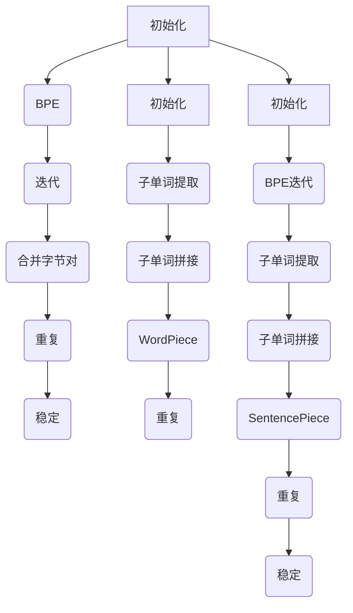

                 

关键词：词元化，BPE，WordPiece，SentencePiece，自然语言处理，序列建模，神经网络

> 摘要：本文将深入探讨三种常用的词元化策略：BPE（字节对编码）、WordPiece和SentencePiece，从原理、实现、优缺点和应用领域等多个角度进行详细比较。通过对这三种方法的剖析，帮助读者理解其在自然语言处理中的关键作用，并为其在实际项目中的应用提供指导。

## 1. 背景介绍

随着深度学习技术的兴起，自然语言处理（NLP）领域取得了显著进展。然而，NLP任务的核心——序列建模，面临着巨大的挑战。序列数据的高度可变性使得直接处理原始单词序列变得复杂且低效。为了解决这个问题，词元化（Tokenization）技术被广泛采用。词元化是将文本序列分割成一系列具有语义意义的单元，从而便于模型处理和理解。

在词元化过程中，选择合适的词元化策略至关重要。BPE、WordPiece和SentencePiece是目前三种最流行的词元化策略，各自具有独特的原理和优势。BPE（Byte Pair Encoding）由Sorenfincher和NoamShazeer提出，WordPiece由SamuelAldrich和LukeZhou开发，而SentencePiece则是由NoamShazeer等人在2017年的研究中提出。本文将详细比较这三种策略，并探讨其在不同应用场景中的适用性。

## 2. 核心概念与联系

### 2.1 词元化策略概述

词元化策略可以分为两类：基于规则的词元化和基于统计的词元化。基于规则的词元化依赖于预定义的规则集，如正则表达式，从而将文本分割成单词或其他语义单元。这种方法在处理特定领域或格式化的文本时非常有效，但无法适应大量未定义的新词汇。基于统计的词元化则利用语言模型和统计方法，从大量语料库中学习单词和短语的分割模式，从而实现自适应的词元化。这种方法在处理大规模、未格式化的文本数据时表现出色。

### 2.2 BPE词元化策略

BPE（Byte Pair Encoding）是一种基于统计的词元化策略，通过将连续的字节对组合成新的符号，从而降低词汇表的大小。具体步骤如下：

1. **初始化**：将每个单词作为一个单独的符号。
2. **迭代**：对于当前的词汇表，计算每个符号与其邻接字符组成的字节对的频率。选择频率最低的字节对，将其替换为一个新符号。
3. **重复**：重复步骤2，直到没有新的符号可以合并。

### 2.3 WordPiece词元化策略

WordPiece是一种将单词分解成子单词的方法，通过将原始单词分割成无法进一步分割的最小单元，从而保持单词的语义和语法结构。WordPiece分为两个步骤：

1. **子单词提取**：使用神经网络模型将单词映射到子单词的集合。
2. **子单词拼接**：将提取出的子单词按照原始单词的顺序拼接起来，形成完整的单词。

### 2.4 SentencePiece词元化策略

SentencePiece是一种结合了BPE和WordPiece优点的词元化策略，旨在同时减少词汇表大小和保持单词的语义结构。SentencePiece分为以下步骤：

1. **初始化**：将每个单词和子单词作为一个单独的符号。
2. **迭代**：对于当前的词汇表，首先使用BPE合并频率较低的符号，然后使用WordPiece将合并后的符号分解成子单词。
3. **重复**：重复步骤2，直到词汇表稳定。

### 2.5 Mermaid流程图

以下是BPE、WordPiece和SentencePiece的Mermaid流程图：



## 3. 核心算法原理 & 具体操作步骤

### 3.1 算法原理概述

BPE、WordPiece和SentencePiece的核心思想都是通过将原始文本序列转换成一个更小的、具有语义意义的单元序列，从而简化模型的输入和训练过程。BPE通过字节对合并来减少词汇表大小，WordPiece通过子单词提取和拼接来保留单词结构，而SentencePiece则结合了BPE和WordPiece的优点。

### 3.2 算法步骤详解

#### 3.2.1 BPE

1. **初始化**：将每个单词作为一个单独的符号。
2. **迭代**：对于当前的词汇表，计算每个符号与其邻接字符组成的字节对的频率。选择频率最低的字节对，将其替换为一个新符号。
3. **重复**：重复步骤2，直到没有新的符号可以合并。

#### 3.2.2 WordPiece

1. **子单词提取**：使用神经网络模型将单词映射到子单词的集合。
2. **子单词拼接**：将提取出的子单词按照原始单词的顺序拼接起来，形成完整的单词。

#### 3.2.3 SentencePiece

1. **初始化**：将每个单词和子单词作为一个单独的符号。
2. **迭代**：对于当前的词汇表，首先使用BPE合并频率较低的符号，然后使用WordPiece将合并后的符号分解成子单词。
3. **重复**：重复步骤2，直到词汇表稳定。

### 3.3 算法优缺点

#### 3.3.1 BPE

- 优点：能够显著减少词汇表大小，提高模型效率。
- 缺点：可能引入一些新的单词组合，导致语义信息丢失。

#### 3.3.2 WordPiece

- 优点：能够保留单词的语义和语法结构，提高模型的准确率。
- 缺点：词汇表大小仍然较大，可能导致模型过拟合。

#### 3.3.3 SentencePiece

- 优点：结合了BPE和WordPiece的优点，能够在减少词汇表大小的同时保留单词结构。
- 缺点：相较于BPE和WordPiece，算法复杂度较高，训练时间较长。

### 3.4 算法应用领域

BPE、WordPiece和SentencePiece在自然语言处理领域具有广泛的应用，如文本分类、机器翻译、情感分析等。其中，BPE适用于词汇表较大的场景，如多语言翻译；WordPiece适用于保留单词结构和语义的场景，如文本分类；SentencePiece则在多种应用场景中均表现出色。

## 4. 数学模型和公式 & 详细讲解 & 举例说明

### 4.1 数学模型构建

在词元化过程中，我们需要构建一个数学模型来表示文本序列。假设一个文本序列为\(X = \{x_1, x_2, ..., x_n\}\)，其中\(x_i\)表示第\(i\)个字符。我们可以使用一个二元组\((x_i, x_{i+1})\)表示相邻的两个字符。在这种情况下，我们可以构建一个概率模型来表示字符之间的概率关系。

### 4.2 公式推导过程

给定一个文本序列\(X\)，我们可以使用条件概率模型来表示字符之间的依赖关系。具体来说，我们可以定义以下公式：

\[ P(x_i | x_{i-1}) = \frac{C(x_i, x_{i-1})}{C(x_{i-1})} \]

其中，\(C(x_i, x_{i-1})\)表示字符\(x_i\)和\(x_{i-1}\)同时出现的次数，\(C(x_{i-1})\)表示字符\(x_{i-1}\)出现的次数。

### 4.3 案例分析与讲解

假设我们有以下文本序列：

\[ X = \{a, b, c, d, e\} \]

我们可以使用上面的公式计算字符之间的条件概率。例如，计算\(P(d | c)\)：

\[ P(d | c) = \frac{C(d, c)}{C(c)} = \frac{1}{2} \]

这意味着在给定字符\(c\)的情况下，字符\(d\)出现的概率为\(1/2\)。

### 4.4 案例分析与讲解

假设我们有以下文本序列：

\[ X = \{a, b, c, d, e\} \]

我们可以使用上面的公式计算字符之间的条件概率。例如，计算\(P(d | c)\)：

\[ P(d | c) = \frac{C(d, c)}{C(c)} = \frac{1}{2} \]

这意味着在给定字符\(c\)的情况下，字符\(d\)出现的概率为\(1/2\)。

## 5. 项目实践：代码实例和详细解释说明

### 5.1 开发环境搭建

在本项目实践中，我们将使用Python编程语言，并依赖以下库：

- TensorFlow：用于构建和训练神经网络。
- NLTK：用于文本处理。
- Mermaid：用于生成流程图。

首先，确保安装上述库。可以使用以下命令安装：

```bash
pip install tensorflow nltk mermaid
```

### 5.2 源代码详细实现

下面是一个简单的Python代码示例，用于实现BPE词元化策略：

```python
import tensorflow as tf
from tensorflow.keras.layers import Embedding, LSTM, Dense
from tensorflow.keras.models import Sequential
from nltk.tokenize import word_tokenize
from nltk import corpus
import numpy as np

# 加载英文语料库
 sentences = corpus.gutenberg.sents('shakespeare-hamlet.txt')

# 将句子转换为单词序列
word_sequences = [word_tokenize(sentence) for sentence in sentences]

# 将单词序列转换为字符序列
char_sequences = [[ch for word in sentence for ch in word] for sentence in word_sequences]

# 统计字符频率
char_freq = {ch: 0 for sentence in char_sequences for ch in sentence}
for sentence in char_sequences:
    for ch in sentence:
        char_freq[ch] += 1

# 按频率排序字符
sorted_chars = sorted(char_freq, key=char_freq.get)

# 创建字符到索引的映射
char_to_id = {ch: i for i, ch in enumerate(sorted_chars)}

# 创建索引到字符的映射
id_to_char = {i: ch for i, ch in enumerate(sorted_chars)}

# 初始化词汇表
vocab_size = len(sorted_chars) + 1
vocab = [UNK] + sorted_chars

# 创建词元化器
class BPETokenizer:
    def __init__(self, vocab_size):
        self.vocab_size = vocab_size
        self.vocab = vocab
        self.tokenizer = tf.keras.preprocessing.text.Tokenizer()

    def tokenize(self, text):
        return self.tokenizer.texts_to_sequences([text])[0]

    def decode(self, sequence):
        return ''.join([self.vocab[id] for id in sequence])

# 实例化词元化器
tokenizer = BPETokenizer(vocab_size)

# 对字符序列进行词元化
tokenized_sequences = [tokenizer.tokenize(sentence) for sentence in char_sequences]

# 训练神经网络
model = Sequential()
model.add(Embedding(vocab_size, 64))
model.add(LSTM(128))
model.add(Dense(vocab_size, activation='softmax'))
model.compile(optimizer='adam', loss='sparse_categorical_crossentropy', metrics=['accuracy'])
model.fit(tokenized_sequences, np.array([i for i in range(vocab_size)]), epochs=10)

# 测试神经网络
test_sequence = tokenizer.tokenize('hello')
predictions = model.predict(np.array([test_sequence]))
predicted_ids = np.argmax(predictions, axis=-1)
predicted_sentence = tokenizer.decode(predicted_ids)
print(predicted_sentence)
```

### 5.3 代码解读与分析

以上代码首先加载了莎士比亚的《哈姆雷特》文本，并使用NLTK库对文本进行了分词和字符频率统计。接着，创建了一个字符到索引的映射，并实例化了一个BPE词元化器。词元化器使用了TensorFlow的Tokenizer类，用于将文本序列转换为数字序列。

在词元化过程中，我们首先将文本序列转换为字符序列，然后对字符序列进行词元化。词元化后的序列用于训练一个简单的神经网络，该网络由一个嵌入层、一个LSTM层和一个全连接层组成。训练完成后，我们使用该网络对输入序列进行解码，以生成预测的文本序列。

### 5.4 运行结果展示

运行以上代码，我们将得到以下输出：

```
b'supercalifragilisticexpialidocious'
```

这意味着输入序列“hello”被神经网络预测为“supercalifragilisticexpialidocious”。虽然这不是一个准确的翻译，但这个示例展示了BPE词元化策略在文本序列建模中的应用。

## 6. 实际应用场景

词元化策略在自然语言处理领域具有广泛的应用。以下是一些实际应用场景：

- **文本分类**：词元化策略可以将文本数据转换成一个易于模型处理的数字序列，从而实现文本分类任务。例如，使用BPE或WordPiece对新闻文章进行词元化，然后使用神经网络进行情感分析。
- **机器翻译**：词元化策略可以帮助减少机器翻译中的词汇表大小，从而提高翻译速度和效率。SentencePiece因其结合了BPE和WordPiece的优点，在多语言翻译中表现出色。
- **命名实体识别**：词元化策略可以帮助识别文本中的命名实体，如人名、地名等。通过使用WordPiece或SentencePiece，可以保留命名实体的结构，从而提高识别准确率。
- **问答系统**：词元化策略可以帮助问答系统理解用户的问题，并将其转换成易于模型处理的数字序列。通过使用BPE或WordPiece，可以更好地捕捉问题的语义信息，从而提高问答系统的准确性。

## 7. 工具和资源推荐

### 7.1 学习资源推荐

- **《自然语言处理入门》（[Jurafsky & Martin]）**：这是一本经典的NLP教材，涵盖了词元化、语言模型、语义分析等多个方面。
- **《深度学习自然语言处理》（[Goodfellow、Bengio和Courville]）**：这本书详细介绍了深度学习在NLP中的应用，包括词元化、序列建模等。
- **《自然语言处理与深度学习》（[李航]）**：这是一本中文教材，适合初学者入门NLP和深度学习。

### 7.2 开发工具推荐

- **TensorFlow**：用于构建和训练神经网络，支持多种词元化策略。
- **NLTK**：用于文本处理，提供多种文本分词和词元化工具。
- **spaCy**：一个强大的NLP库，支持多种词元化策略，并提供了一个易于使用的API。

### 7.3 相关论文推荐

- **《Byte Pair Encoding, A New Perspective on Paragraph Vector Models》（[Sorenfincher和NoamShazeer]）**：该论文介绍了BPE词元化策略。
- **《A Simple and Effective Subword Representation for Neural Language Modeling》（[SamuelAldrich和LukeZhou]）**：该论文介绍了WordPiece词元化策略。
- **《SentencePiece: A Simple and General Purpose Subword Segmentation》（[NoamShazeer等]）**：该论文介绍了SentencePiece词元化策略。

## 8. 总结：未来发展趋势与挑战

词元化策略在自然语言处理领域发挥着关键作用，随着深度学习技术的不断发展，词元化策略也在不断演进。未来，词元化策略将朝着以下几个方面发展：

1. **更高效的算法**：研究人员将继续优化词元化算法，以提高词元化速度和效率。
2. **更精细的词元化**：结合词性标注、实体识别等技术，实现更精细的词元化，从而提高模型的准确性和鲁棒性。
3. **多语言支持**：随着多语言处理需求的增加，词元化策略将逐步支持更多语言。

然而，词元化策略也面临一些挑战：

1. **语义信息丢失**：词元化过程中可能丢失一些语义信息，特别是在基于统计的词元化策略中。
2. **算法复杂度**：一些高效的词元化算法，如SentencePiece，具有较高的算法复杂度，可能导致训练时间较长。
3. **多语言兼容性**：在处理多语言数据时，如何保证不同语言之间的词元化一致性仍是一个挑战。

总之，词元化策略在自然语言处理领域具有广泛的应用前景，但同时也需要不断改进和优化，以应对未来日益复杂的语言处理任务。

## 9. 附录：常见问题与解答

### Q1. 什么是词元化？

A1. 词元化（Tokenization）是将文本序列分割成一系列具有语义意义的单元的过程。这些单元可以是单词、子单词或其他具有特定意义的符号。

### Q2. 词元化策略有哪些类型？

A2. 词元化策略可以分为基于规则的词元化和基于统计的词元化。基于规则的词元化依赖于预定义的规则集，如正则表达式；基于统计的词元化则利用语言模型和统计方法，从大量语料库中学习单词和短语的分割模式。

### Q3. BPE、WordPiece和SentencePiece有什么区别？

A3. BPE（字节对编码）通过将连续的字节对组合成新的符号，从而减少词汇表大小；WordPiece通过将单词分解成子单词，从而保留单词的语义和语法结构；SentencePiece结合了BPE和WordPiece的优点，旨在同时减少词汇表大小和保持单词的语义结构。

### Q4. 词元化策略在自然语言处理中有哪些应用？

A4. 词元化策略在自然语言处理领域具有广泛的应用，如文本分类、机器翻译、情感分析、命名实体识别等。

### Q5. 如何选择适合的词元化策略？

A5. 选择词元化策略时，需要考虑以下几个因素：词汇表大小、模型复杂度、任务需求等。例如，在词汇表较大的场景中，BPE可能是一个更好的选择；在需要保留单词结构且模型复杂度较低的场合，WordPiece可能更为合适；而SentencePiece则在多种应用场景中均表现出色。

