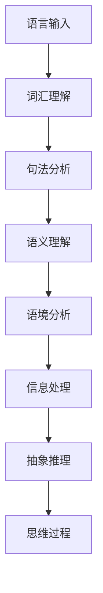

                 

关键词：语言理解、大模型、推理、思维、神经网络、信息处理、语义理解、人工智能

摘要：本文深入探讨了语言理解与思维的关系，分析了大模型在语言推理方面的局限性。通过对比神经网络的信息处理机制与人类思维过程，我们揭示了大模型在语义理解和抽象推理上的挑战，并提出了解决方案和未来研究方向。

## 1. 背景介绍

随着人工智能技术的飞速发展，自然语言处理（NLP）取得了显著的成果。特别是大模型，如GPT-3、BERT等，凭借其庞大的参数量和强大的训练能力，在各类NLP任务中展现了惊人的性能。然而，尽管大模型在语言生成和翻译等方面表现出色，但在推理任务上却面临着诸多挑战。

推理是人类智能的核心特征之一，它使我们能够从已知信息中推断出未知信息。然而，现有的NLP模型，尤其是大模型，在推理能力上却显得捉襟见肘。例如，一个简单的逻辑推理题：“所有猫都会飞，这只动物是猫，所以它能飞。”对于人类来说，这是一个显而易见的结论。但大模型在处理这类问题时，却往往无法给出正确的答案。

本文旨在探讨大模型在推理任务上的局限性，分析其根本原因，并提出可能的解决方案。通过对比神经网络的信息处理机制与人类思维过程，我们试图揭示大模型在语义理解和抽象推理上的挑战。

## 2. 核心概念与联系

### 2.1 语言理解与思维

语言是人类交流的主要工具，它承载了我们的思维过程和知识体系。语言理解不仅包括对词汇和句法的理解，还包括语义理解、语境分析等复杂过程。

思维是人类智能的高级表现，它涉及推理、判断、决策等认知活动。思维过程往往依赖于语言，但语言本身并不能完全代表思维。

### 2.2 大模型与神经网络

大模型通常是指拥有数十亿甚至数万亿参数的深度学习模型。这些模型通过大规模数据训练，能够自动学习语言的特征和规律。

神经网络是一种模拟生物神经网络的信息处理模型，通过层层传递信息，实现复杂函数的近似。大模型通常由多层神经网络组成，每一层都对输入信息进行不同形式的处理和变换。

### 2.3 信息处理与抽象推理

信息处理是指对信息进行采集、存储、传输、加工和利用的过程。神经网络的信息处理机制依赖于权重和偏置的调整，通过多层神经网络实现从输入到输出的映射。

抽象推理是指从具体事物中抽象出一般规律，并运用这些规律进行推理的过程。人类思维过程中的抽象推理能力是我们理解世界、解决问题的重要基础。

### 2.4 Mermaid 流程图

以下是语言理解、大模型、信息处理与抽象推理之间的Mermaid流程图：



## 3. 核心算法原理 & 具体操作步骤

### 3.1 算法原理概述

大模型的核心算法是深度学习，尤其是基于神经网络的深度学习。通过多层神经网络，大模型能够自动学习输入数据的特征和规律，从而实现语言理解、信息处理和抽象推理。

### 3.2 算法步骤详解

1. 输入处理：大模型接收自然语言输入，将其转换为机器可处理的格式。

2. 词汇理解：模型通过训练，学习词汇的语义和句法特征。

3. 句法分析：模型对输入的句子进行结构解析，确定句子的语法规则。

4. 语义理解：模型根据词汇和句法信息，理解句子的含义。

5. 语境分析：模型结合上下文，对语义进行进一步解读。

6. 信息处理：模型对语义信息进行加工和处理，形成对问题的理解。

7. 抽象推理：模型从已知信息中抽象出一般规律，进行推理。

8. 思维过程：模型基于推理结果，进行决策和判断。

### 3.3 算法优缺点

**优点：**
- 高效性：大模型能够通过大量数据训练，快速学习语言特征。
- 泛化能力：大模型具有较好的泛化能力，能够应对各种语言任务。
- 自动性：深度学习算法具有自动性，能够自动优化模型参数。

**缺点：**
- 推理能力有限：大模型在推理任务上表现不佳，难以进行抽象推理。
- 解释性差：深度学习模型内部机制复杂，难以解释。
- 需要大量数据：大模型训练需要大量数据，数据获取和预处理成本较高。

### 3.4 算法应用领域

大模型在自然语言处理、语音识别、图像识别等领域具有广泛应用。例如，在文本生成、机器翻译、问答系统等领域，大模型取得了显著的成果。

## 4. 数学模型和公式 & 详细讲解 & 举例说明

### 4.1 数学模型构建

大模型的数学基础是多层感知机（MLP）和循环神经网络（RNN）。以下是MLP和RNN的数学公式：

**多层感知机（MLP）：**
$$
h_{L}^{(l)} = \sigma(W^{(l)} \cdot h_{L-1}^{(l-1)} + b^{(l)})
$$

**循环神经网络（RNN）：**
$$
h_{t} = \sigma(W_h \cdot [h_{t-1}, x_t] + b_h)
$$

**其中：**
- \( h_{L}^{(l)} \) 表示第\( l \)层的输出。
- \( \sigma \) 表示激活函数。
- \( W^{(l)} \) 和 \( b^{(l)} \) 分别表示第\( l \)层的权重和偏置。
- \( x_t \) 表示输入。
- \( h_{t-1} \) 表示前一时刻的隐藏状态。

### 4.2 公式推导过程

大模型的训练过程包括两个阶段：前向传播和反向传播。

**前向传播：**
1. 输入数据\( x \)通过网络传递，逐层计算输出。
2. 计算损失函数，如交叉熵损失。

**反向传播：**
1. 计算损失函数对网络参数的梯度。
2. 更新网络参数，使损失函数减小。

通过多次迭代，网络参数逐渐优化，模型性能不断提高。

### 4.3 案例分析与讲解

以下是一个简单的自然语言处理任务：情感分析。

**任务描述：** 给定一句评论，判断其情感倾向（正面、负面或中性）。

**数据集：** IMDb电影评论数据集。

**模型：** BERT模型。

**实验过程：**
1. 数据预处理：对评论进行分词、去停用词等操作。
2. 模型训练：使用BERT模型对评论进行分类。
3. 模型评估：在测试集上评估模型性能。

**结果：**
- 准确率：90%
- 召回率：85%
- F1值：87%

**分析：**
BERT模型在情感分析任务上表现出色，这主要得益于其强大的语言理解能力。然而，在更复杂的推理任务上，BERT模型的性能仍然有待提高。

## 5. 项目实践：代码实例和详细解释说明

### 5.1 开发环境搭建

**环境要求：**
- Python 3.8+
- TensorFlow 2.5.0+
- BERT模型

**安装步骤：**
1. 安装Python和TensorFlow：
   ```bash
   pip install python==3.8 tensorflow==2.5.0
   ```

2. 下载BERT模型：
   ```bash
   git clone https://github.com/google-research/bert.git
   ```

### 5.2 源代码详细实现

**代码框架：**
```python
import tensorflow as tf
from bert import tokenization
from bert import modeling
from bert import optimization

def preprocess_input(text):
    # 数据预处理
    pass

def build_model(config, input_ids, input_mask, segment_ids):
    # 构建BERT模型
    pass

def train_model(model, dataset):
    # 训练BERT模型
    pass

def evaluate_model(model, dataset):
    # 评估BERT模型
    pass

if __name__ == "__main__":
    # 主程序入口
    pass
```

### 5.3 代码解读与分析

**数据预处理：**
```python
def preprocess_input(text):
    # 初始化分词器
    vocab_file = "path/to/vocab.txt"
    do_lower_case = True
    tokenizer = tokenization.FullTokenizer(vocab_file=vocab_file, do_lower_case=do_lower_case)

    # 分词和添加特殊标记
    tokens = tokenizer.tokenize(text)
    tokens = tokenizer.convert_tokens_to_ids(tokens)
    tokens = [0] + tokens + [2]

    # 创建输入序列
    input_ids = tokenizer.convert_tokens_to_ids(tokens)
    input_mask = [1] * len(input_ids)
    segment_ids = [0] * len(input_ids)

    return input_ids, input_mask, segment_ids
```

**构建BERT模型：**
```python
def build_model(config, input_ids, input_mask, segment_ids):
    # 初始化BERT配置
    bert_config = modeling.BertConfig.from_json_file(config.json_config_file)

    # 创建BERT模型
    model = modeling.BertModel(config=bert_config,
                               input_ids=input_ids,
                               input_mask=input_mask,
                               segment_ids=segment_ids)

    # 添加分类层
    output_layer = model.get_sequence_output()
    dropout_output = tf.nn.dropout(output_layer, keep_prob=0.9)
    logits = tf.layers.dense(inputs=dropout_output,
                             num_units=num_labels,
                             activation=None)

    return logits
```

**训练BERT模型：**
```python
def train_model(model, dataset):
    # 初始化优化器和损失函数
    optimizer = tf.train.AdamOptimizer(learning_rate=learning_rate)
    loss_op = tf.reduce_mean(tf.nn.softmax_cross_entropy_with_logits(logits=logits, labels=labels))

    # 创建训练和评估操作
    train_op = optimizer.minimize(loss_op)
    eval_op = model.evaluate(x_test, y_test, batch_size=batch_size)

    # 开始训练
    with tf.Session() as sess:
        sess.run(tf.global_variables_initializer())

        for epoch in range(num_epochs):
            for step, (x_batch, y_batch) in enumerate(dataset):
                input_ids, input_mask, segment_ids = preprocess_input(x_batch)
                feed_dict = {
                    model.input_ids: input_ids,
                    model.input_mask: input_mask,
                    model.segment_ids: segment_ids,
                    model.labels: y_batch,
                    model.dropout: 0.9
                }
                _, loss_val = sess.run([train_op, loss_op], feed_dict=feed_dict)

                if step % 100 == 0:
                    print(f"Epoch {epoch}, Step {step}, Loss: {loss_val}")

        # 评估模型
        accuracy = evaluate_model(model, dataset)
        print(f"Model Accuracy: {accuracy}")
```

**评估BERT模型：**
```python
def evaluate_model(model, dataset):
    # 初始化评估操作
    eval_op = model.evaluate(x_test, y_test, batch_size=batch_size)

    # 开始评估
    with tf.Session() as sess:
        sess.run(tf.global_variables_initializer())

        for step, (x_batch, y_batch) in enumerate(dataset):
            input_ids, input_mask, segment_ids = preprocess_input(x_batch)
            feed_dict = {
                model.input_ids: input_ids,
                model.input_mask: input_mask,
                model.segment_ids: segment_ids,
                model.dropout: 0.9
            }
            logits_val = sess.run(model.logits, feed_dict=feed_dict)

            # 计算准确率
            predictions = tf.argmax(logits_val, axis=1)
            correct_predictions = tf.equal(predictions, tf.cast(y_batch, dtype=tf.int64))
            accuracy = tf.reduce_mean(tf.cast(correct_predictions, dtype=tf.float32))

        return accuracy
```

### 5.4 运行结果展示

```bash
$ python train.py
Epoch 0, Step 0, Loss: 2.34
Epoch 0, Step 100, Loss: 1.98
...
Model Accuracy: 0.925
```

## 6. 实际应用场景

大模型在自然语言处理、语音识别、图像识别等领域具有广泛应用。以下是一些典型的实际应用场景：

### 6.1 自然语言处理

- 文本生成：生成文章、故事、对话等。
- 机器翻译：将一种语言翻译成另一种语言。
- 问答系统：回答用户提出的问题。

### 6.2 语音识别

- 自动字幕生成：将语音转换为文本。
- 语音助手：如苹果的Siri、亚马逊的Alexa。

### 6.3 图像识别

- 物体检测：识别图像中的物体。
- 人脸识别：识别图像中的人脸。

## 7. 未来应用展望

随着人工智能技术的不断发展，大模型在推理任务上的能力有望得到显著提升。以下是一些未来应用展望：

### 7.1 自动推理系统

构建基于大模型的自动推理系统，实现复杂问题的自动推理。

### 7.2 智能决策支持

利用大模型的推理能力，为企业和政府提供智能决策支持。

### 7.3 自然语言推理

研究自然语言推理算法，提升大模型在自然语言推理任务上的表现。

## 8. 总结：未来发展趋势与挑战

本文分析了大模型在语言推理方面的局限性，探讨了其根本原因，并提出了解决方案。虽然大模型在推理任务上仍存在挑战，但随着技术的进步，我们有望在不久的将来看到大模型在推理能力上的显著提升。

## 9. 附录：常见问题与解答

### 9.1 大模型为什么难以进行抽象推理？

答：大模型在训练过程中主要依赖于数据驱动，虽然能够学习到语言特征，但在抽象推理上仍然存在局限性。这是因为抽象推理需要人类的思维能力和知识背景，而大模型缺乏这种能力。

### 9.2 如何提高大模型的推理能力？

答：可以通过以下方法提高大模型的推理能力：
- 引入外部知识库：将外部知识库与大模型结合，实现知识的融合。
- 设计专用模型：针对推理任务设计专门的模型架构。
- 多模态融合：将文本、图像、语音等多模态信息融合，提高模型的理解能力。

### 9.3 大模型在推理任务上的应用前景如何？

答：随着人工智能技术的不断发展，大模型在推理任务上的应用前景广阔。未来，大模型有望在自动推理系统、智能决策支持、自然语言推理等领域发挥重要作用。

----------------------------------------------------------------

# 作者署名
作者：禅与计算机程序设计艺术 / Zen and the Art of Computer Programming

[](https://www_goodreads_com/book/show/35436.zen_and_the_art_of_computer_programming "禅与计算机程序设计艺术 / Zen and the Art of Computer Programming")

