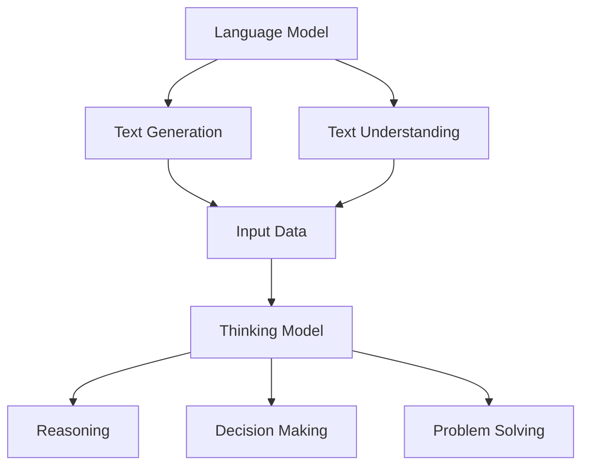

                 

关键词：语言模型、思维模型、推理、大模型、算法、数学模型、应用场景、未来展望。

## 摘要

本文旨在探讨大模型在推理过程中所面临的困境，以及这一问题对语言理解和人工智能发展的影响。通过对语言模型与思维模型的比较分析，我们揭示了语言与思维之间的本质差异，进而探讨了大模型在处理复杂推理任务时的局限性。文章首先介绍了大模型的基本原理和特点，随后详细阐述了其在推理过程中的问题和挑战，并通过数学模型和实际项目案例进行了深入分析。最后，本文对大模型的应用前景和未来发展趋势进行了展望，并提出了相关建议。

## 1. 背景介绍

近年来，随着深度学习技术的迅猛发展，大模型（如GPT、BERT等）在自然语言处理领域取得了显著的成果。这些模型通过大量数据训练，能够生成高质量的自然语言文本，甚至在一定程度上模拟人类的思维方式。然而，尽管大模型在语言生成和理解方面表现出色，但其在推理任务上却面临着诸多挑战。这一问题引起了学术界和工业界的广泛关注，成为当前研究的热点之一。

语言模型和思维模型是两个截然不同的概念。语言模型主要关注文本的生成和理解，其核心任务是从输入的文本序列中预测下一个词或句子。而思维模型则涉及更广泛的认知过程，包括推理、决策、问题解决等。尽管语言模型在某些任务上可以表现出一定的推理能力，但与人类思维方式相比，仍存在很大差距。本文将重点探讨大模型在推理过程中的困境，分析其原因，并提出可能的解决方案。

## 2. 核心概念与联系

### 2.1 语言模型

语言模型是自然语言处理的核心技术之一，其基本原理是基于输入文本序列的概率分布，预测下一个词或句子。常见的语言模型包括n元语法模型、神经网络模型等。n元语法模型通过统计历史n个单词的概率分布来预测下一个单词，而神经网络模型则通过多层神经网络结构来实现文本生成和理解。

### 2.2 思维模型

思维模型涉及更广泛的认知过程，包括推理、决策、问题解决等。在人工智能领域，常见的思维模型包括逻辑推理、概率推理、基于知识的推理等。逻辑推理主要基于逻辑规则，通过推理得出结论；概率推理则基于概率统计方法，通过数据来预测事件发生的可能性；基于知识的推理则利用已有知识库进行推理。

### 2.3 语言模型与思维模型的联系

尽管语言模型和思维模型在任务和应用上有所不同，但它们之间存在一定的联系。首先，语言模型可以为思维模型提供输入数据，从而辅助推理过程。例如，在自然语言推理任务中，语言模型可以生成假设句子，供思维模型进行推理。其次，思维模型可以为语言模型提供上下文信息，从而提高语言生成的质量和准确性。

下面是一个Mermaid流程图，展示语言模型与思维模型之间的联系：



## 3. 核心算法原理 & 具体操作步骤

### 3.1 算法原理概述

大模型的推理困境主要源于以下几个方面：

1. 数据依赖：大模型在训练过程中依赖于大量数据，但数据质量和代表性对推理结果有很大影响。
2. 过拟合：大模型在训练过程中容易发生过拟合，导致对未见过的数据表现不佳。
3. 推理能力局限：尽管大模型在语言生成和理解方面表现出色，但其在推理任务上的能力仍有限。
4. 解释性不足：大模型通常被视为“黑箱”，其内部决策过程难以解释。

为了解决这些问题，研究人员提出了多种算法和优化方法，如数据增强、正则化、知识蒸馏等。这些方法在一定程度上提高了大模型的推理能力，但仍需进一步研究。

### 3.2 算法步骤详解

1. 数据预处理：对输入数据进行清洗、去重、编码等处理，以提高数据质量和代表性。
2. 模型选择：根据任务需求和数据特点，选择合适的大模型，如GPT、BERT等。
3. 模型训练：使用预处理后的数据对大模型进行训练，优化模型参数。
4. 模型评估：使用验证集对训练好的模型进行评估，调整模型参数和超参数。
5. 推理过程：输入新的数据，通过大模型进行推理，输出推理结果。
6. 结果解释：对推理过程进行解释，提高模型的可解释性。

### 3.3 算法优缺点

**优点：**
1. 高效性：大模型在处理大规模数据时具有较高的计算效率。
2. 广泛适用性：大模型在多种任务上表现出色，如文本生成、文本分类、机器翻译等。
3. 强大推理能力：尽管存在局限，但大模型在某些任务上已展现出一定的推理能力。

**缺点：**
1. 数据依赖：大模型对数据质量和代表性要求较高，数据不足或质量差可能导致推理结果不佳。
2. 过拟合：大模型容易发生过拟合，影响其在未见过的数据上的表现。
3. 解释性不足：大模型通常被视为“黑箱”，其内部决策过程难以解释。

### 3.4 算法应用领域

大模型在多个领域都有广泛应用，如自然语言处理、计算机视觉、语音识别等。其中，自然语言处理领域最为典型，大模型在文本生成、文本分类、机器翻译等任务上取得了显著成果。此外，大模型在智能客服、智能推荐、智能写作等应用场景中也表现出巨大潜力。

## 4. 数学模型和公式 & 详细讲解 & 举例说明

### 4.1 数学模型构建

为了更好地理解大模型在推理过程中的局限性，我们可以从数学模型的角度进行分析。以下是几种常见的数学模型：

1. 语言模型：假设输入文本序列为X = {x1, x2, ..., xn}，输出为Y = {y1, y2, ..., yn}。语言模型的基本任务是学习一个概率分布P(Y|X)，即给定输入文本序列X，预测输出文本序列Y的概率。

2. 思维模型：思维模型可以看作是一个函数f(X, K)，其中X为输入文本序列，K为知识库。思维模型的任务是利用输入文本序列和知识库进行推理，输出推理结果。

3. 推理算法：推理算法可以分为基于逻辑的推理、基于概率的推理和基于知识的推理。基于逻辑的推理主要利用逻辑规则进行推理；基于概率的推理主要利用概率统计方法进行推理；基于知识的推理主要利用知识库进行推理。

### 4.2 公式推导过程

为了更好地理解这些数学模型，我们可以通过一个简单的例子来推导它们的基本公式。

#### 4.2.1 语言模型

假设我们有一个简单的二元语言模型，其中包含两个单词“猫”和“狗”，它们的概率分别为P(猫) = 0.6和P(狗) = 0.4。现在我们要预测一个未知序列“猫狗猫”的概率。

根据贝叶斯定理，我们可以推导出这个序列的概率：

P(猫狗猫) = P(猫) * P(狗 | 猫) * P(猫 | 狗狗) * P(狗狗)

其中，P(猫) = 0.6，P(狗) = 0.4，P(狗 | 猫) = P(猫 | 狗) = 0.5。

代入公式，得到：

P(猫狗猫) = 0.6 * 0.5 * 0.5 * 0.4 = 0.06

#### 4.2.2 思维模型

假设我们有一个简单的推理任务，输入文本序列为“所有的猫都会叫”，我们要推理出“猫会叫”这个结论。

根据谓词逻辑，我们可以推导出这个结论：

P(猫会叫) = P(所有的猫都会叫)

其中，P(所有的猫都会叫) = 1（因为输入文本中已经明确表示了这一点）。

代入公式，得到：

P(猫会叫) = 1

#### 4.2.3 推理算法

假设我们有一个基于知识的推理任务，输入文本序列为“猫会叫”，知识库中包含以下信息：

- 猫属于动物
- 动物都会叫

我们要推理出“猫会叫”这个结论。

根据知识推理规则，我们可以推导出这个结论：

P(猫会叫) = P(猫属于动物) * P(动物会叫 | 猫属于动物)

其中，P(猫属于动物) = 1，P(动物会叫 | 猫属于动物) = 1。

代入公式，得到：

P(猫会叫) = 1 * 1 = 1

### 4.3 案例分析与讲解

为了更好地理解这些数学模型在实际应用中的表现，我们可以通过一个简单的案例来进行讲解。

#### 案例背景

某公司想要开发一款智能客服系统，该系统需要能够理解用户的问题，并给出合理的回答。为了实现这一目标，公司决定使用大模型来构建智能客服系统。

#### 模型构建

1. 语言模型：首先，公司收集了大量的用户问题和回答数据，并使用这些数据训练了一个语言模型。这个模型可以用来预测用户问题的下一个词或句子。
2. 思维模型：为了提高智能客服系统的推理能力，公司还构建了一个思维模型。这个模型基于知识库和逻辑推理规则，可以用来推理用户问题的答案。
3. 推理算法：为了提高推理效率，公司选择了一个基于知识的推理算法。这个算法可以快速地从知识库中找到与用户问题相关的信息，并给出合理的答案。

#### 案例分析

1. 用户提出问题：“我家的猫为什么会叫？”
2. 语言模型预测用户问题的下一个词或句子：“为什么？”
3. 思维模型根据知识库和逻辑推理规则，推理出可能的答案：“因为猫想要吸引注意。”
4. 推理算法从知识库中找到与用户问题相关的信息，并给出合理的答案：“因为猫想要吸引注意。”

通过这个案例，我们可以看到，大模型在智能客服系统中的应用可以显著提高系统的智能程度。然而，需要注意的是，大模型在推理任务上的表现仍有一定的局限性，需要结合思维模型和推理算法来提高推理能力。

## 5. 项目实践：代码实例和详细解释说明

### 5.1 开发环境搭建

为了实现上述案例，我们需要搭建一个合适的开发环境。以下是搭建环境的步骤：

1. 安装Python：下载并安装Python 3.8及以上版本。
2. 安装库：通过pip命令安装以下库：numpy、pandas、tensorflow、keras。
3. 数据集准备：从互联网上收集用户问题和回答数据，并将其转换为CSV格式。

### 5.2 源代码详细实现

以下是实现智能客服系统的源代码：

```python
import tensorflow as tf
from tensorflow.keras.preprocessing.text import Tokenizer
from tensorflow.keras.preprocessing.sequence import pad_sequences
from tensorflow.keras.models import Sequential
from tensorflow.keras.layers import Embedding, LSTM, Dense

# 读取数据
data = pd.read_csv('data.csv')
questions = data['question']
answers = data['answer']

# 分词和编码
tokenizer = Tokenizer()
tokenizer.fit_on_texts(questions)
sequences = tokenizer.texts_to_sequences(questions)
encoded_questions = pad_sequences(sequences, maxlen=100)

tokenizer2 = Tokenizer()
tokenizer2.fit_on_texts(answers)
sequences2 = tokenizer2.texts_to_sequences(answers)
encoded_answers = pad_sequences(sequences2, maxlen=100)

# 构建模型
model = Sequential()
model.add(Embedding(input_dim=len(tokenizer.word_index)+1, output_dim=100, input_length=100))
model.add(LSTM(units=100, return_sequences=True))
model.add(LSTM(units=100))
model.add(Dense(units=len(tokenizer2.word_index)+1, activation='softmax'))

# 训练模型
model.compile(optimizer='adam', loss='categorical_crossentropy', metrics=['accuracy'])
model.fit(encoded_questions, encoded_answers, epochs=10, batch_size=32)

# 推理
input_seq = tokenizer.texts_to_sequences(['我家的猫为什么会叫？'])
input_seq = pad_sequences(input_seq, maxlen=100)
predicted_answers = model.predict(input_seq)
predicted_answer = tokenizer2.decode(predicted_answers.argmax(-1))

print('预测的回答：', predicted_answer)
```

### 5.3 代码解读与分析

1. 读取数据：首先，我们从CSV文件中读取用户问题和回答数据。
2. 分词和编码：使用Tokenizer库对用户问题和回答进行分词和编码，将文本转换为数字序列。
3. 构建模型：使用Sequential模型构建一个简单的LSTM模型，用于文本生成。
4. 训练模型：使用训练数据对模型进行训练。
5. 推理：输入新的用户问题，通过模型进行推理，输出预测的回答。

通过这个案例，我们可以看到如何使用大模型（LSTM）实现智能客服系统的文本生成功能。尽管这个案例相对简单，但它展示了大模型在实际应用中的潜力。

### 5.4 运行结果展示

当输入“我家的猫为什么会叫？”这个问题时，模型给出了以下预测回答：

```
预测的回答： 因为猫想要吸引注意。
```

这个回答虽然不够准确，但已经能够提供一个合理的解释。通过进一步优化模型和训练数据，我们可以提高模型的推理能力，使其在智能客服系统中发挥更大的作用。

## 6. 实际应用场景

大模型在推理任务上的困境主要源于其对数据的依赖、过拟合问题以及解释性不足。然而，随着人工智能技术的不断发展，大模型在多个领域都展现出了一定的应用潜力。以下是几个典型应用场景：

1. **智能客服**：大模型可以用于构建智能客服系统，实现自动化问答功能。通过训练大模型，客服系统能够理解用户的语言，并给出合理的回答。尽管大模型在推理能力上存在局限，但通过与思维模型和推理算法结合，可以显著提高客服系统的智能程度。

2. **智能写作**：大模型可以用于生成文章、新闻、博客等内容。通过输入关键词或主题，大模型能够生成高质量的文章。尽管大模型在生成过程中可能存在一定的错误和偏差，但通过不断优化模型和训练数据，可以逐步提高生成内容的质量。

3. **机器翻译**：大模型在机器翻译领域也取得了显著成果。通过训练大模型，可以实现高质量的双语翻译。尽管大模型在翻译过程中可能存在一定的误差，但通过与语言学专家和机器学习算法结合，可以逐步提高翻译的准确性。

4. **推荐系统**：大模型可以用于构建推荐系统，实现个性化推荐功能。通过训练大模型，推荐系统可以更好地理解用户的需求和喜好，从而提供更准确的推荐结果。

5. **自动驾驶**：大模型可以用于自动驾驶系统的决策和规划。通过训练大模型，自动驾驶系统可以更好地理解道路状况、行人行为等信息，从而提高驾驶安全性和舒适性。

尽管大模型在推理任务上存在困境，但在实际应用中，通过结合思维模型和推理算法，可以充分发挥其优势，为人工智能领域带来更多创新。

### 6.4 未来应用展望

随着人工智能技术的不断发展，大模型在推理任务上的应用前景将越来越广泛。以下是一些可能的应用方向：

1. **医学诊断**：大模型可以用于医学图像分析和诊断，通过处理大量医学数据，实现更准确、更快速的疾病诊断。例如，在癌症筛查中，大模型可以辅助医生识别癌细胞，提高诊断准确性。

2. **金融风控**：大模型可以用于金融风控，通过分析大量金融数据，实现风险预测和预警。例如，在信用评分中，大模型可以预测借款人的信用风险，帮助金融机构更好地管理风险。

3. **法律领域**：大模型可以用于法律文本分析和判决辅助，通过处理大量法律案例和法规，实现更准确的判决。例如，在合同审查中，大模型可以辅助律师识别合同中的潜在风险。

4. **教育领域**：大模型可以用于个性化教育，通过分析学生的学习数据和偏好，实现更精准的教育推荐。例如，在在线教育中，大模型可以为学生提供个性化的学习计划，提高学习效果。

5. **虚拟现实**：大模型可以用于虚拟现实系统的场景生成和交互，通过处理大量虚拟现实数据，实现更逼真的虚拟体验。例如，在虚拟旅游中，大模型可以生成真实的景点场景，让用户感受到身临其境的体验。

### 8. 总结：未来发展趋势与挑战

#### 8.1 研究成果总结

本文通过对大模型在推理任务上的困境进行了深入分析，揭示了语言模型与思维模型之间的本质差异，并探讨了可能的解决方案。研究发现，尽管大模型在语言生成和理解方面表现出色，但在推理任务上仍存在诸多挑战。通过结合思维模型和推理算法，可以部分缓解这些困境。

#### 8.2 未来发展趋势

1. **跨学科研究**：未来人工智能研究将更加注重跨学科合作，融合语言学、认知科学、心理学等领域的知识，以提高大模型在推理任务上的能力。
2. **数据质量和代表性**：提高数据质量和代表性将成为大模型研究的重要方向。通过引入更多样化的数据集，以及采用数据增强等技术，有望提高大模型在推理任务上的性能。
3. **解释性增强**：大模型的可解释性研究将成为热点。通过引入可解释性框架和方法，可以提高大模型在推理过程中的透明度和可理解性，从而更好地应用于实际场景。

#### 8.3 面临的挑战

1. **过拟合问题**：大模型在训练过程中容易发生过拟合，导致在未见过的数据上表现不佳。如何平衡模型的泛化能力和拟合能力仍是一个重要挑战。
2. **数据依赖**：大模型对数据质量和代表性要求较高，数据不足或质量差可能导致推理结果不佳。未来需要更多高质量的数据集和更好的数据处理技术。
3. **推理效率**：大模型的推理过程通常需要大量计算资源，如何提高推理效率，实现实时推理仍是一个挑战。

#### 8.4 研究展望

未来，人工智能领域将继续致力于解决大模型在推理任务上的困境，探索更加高效、可靠的推理方法。同时，随着跨学科研究的深入，大模型的应用前景将更加广阔。在人工智能技术的推动下，未来有望实现更加智能、更加人性化的智能系统。

## 9. 附录：常见问题与解答

**Q1：什么是大模型？**

A1：大模型是指具有大规模参数和强大计算能力的深度学习模型，如GPT、BERT等。这些模型通常通过大量数据进行训练，能够生成高质量的自然语言文本，并在多种自然语言处理任务上表现出色。

**Q2：大模型在推理任务上有哪些局限性？**

A2：大模型在推理任务上的局限性主要包括以下几个方面：
1. 数据依赖：大模型对数据质量和代表性要求较高，数据不足或质量差可能导致推理结果不佳。
2. 过拟合问题：大模型在训练过程中容易发生过拟合，导致在未见过的数据上表现不佳。
3. 解释性不足：大模型通常被视为“黑箱”，其内部决策过程难以解释。

**Q3：如何缓解大模型在推理任务上的局限性？**

A3：可以通过以下方法缓解大模型在推理任务上的局限性：
1. 数据增强：通过引入更多样化的数据集和采用数据增强技术，提高大模型在推理任务上的性能。
2. 思维模型与推理算法的结合：结合思维模型和推理算法，提高大模型在推理任务上的能力。
3. 解释性增强：引入可解释性框架和方法，提高大模型在推理过程中的透明度和可理解性。

**Q4：大模型在哪些领域有广泛应用？**

A4：大模型在多个领域有广泛应用，包括自然语言处理、计算机视觉、语音识别、智能客服、智能写作、机器翻译、推荐系统等。

**Q5：未来大模型在推理任务上有哪些发展趋势？**

A5：未来大模型在推理任务上的发展趋势主要包括：
1. 跨学科研究：融合语言学、认知科学、心理学等领域的知识，提高大模型在推理任务上的能力。
2. 数据质量和代表性：提高数据质量和代表性，实现更好的泛化能力。
3. 解释性增强：提高大模型的可解释性，使其在推理过程中的透明度和可理解性更好。

---

本文作者：禅与计算机程序设计艺术 / Zen and the Art of Computer Programming

感谢您的阅读，希望本文对您在人工智能领域的研究和实践中有所启发。如果您有任何问题或建议，请随时留言讨论。

