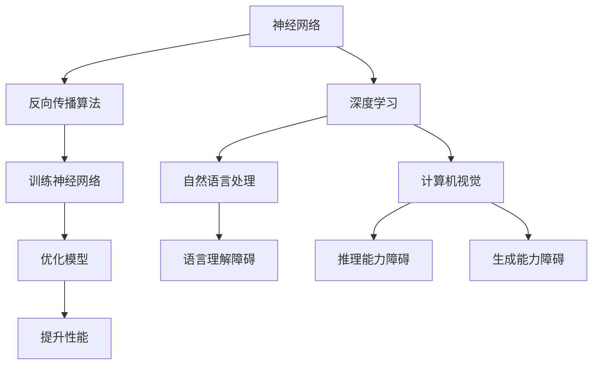

                 

关键词：大模型，认知障碍，AI语言模型，思维模式，算法原理

摘要：本文深入探讨了大模型在人工智能领域中的发展及其带来的认知障碍。通过分析大模型的算法原理、数学模型以及实际应用场景，揭示了其在语言理解、推理和生成方面的局限性。本文旨在引发对大模型未来发展的思考，探讨如何克服认知障碍，推动人工智能技术的进步。

## 1. 背景介绍

近年来，人工智能（AI）领域取得了令人瞩目的进展，特别是在大模型方面。大模型指的是具有数十亿至数万亿参数的神经网络模型，如GPT-3、BERT等。这些模型在自然语言处理、计算机视觉、语音识别等领域展示了卓越的性能，推动了AI技术的发展。

然而，随着大模型在各个领域的广泛应用，其认知障碍也逐渐凸显出来。认知障碍指的是大模型在理解、推理和生成方面的局限性，主要体现在以下几个方面：

1. **语言理解障碍**：大模型虽然能够处理大量的语言数据，但其对语言的理解仍然停留在表面层次，难以把握语言背后的逻辑和含义。

2. **推理能力障碍**：大模型在推理方面存在明显的局限性，往往只能处理简单的逻辑推理问题，对于复杂、抽象的推理任务难以胜任。

3. **生成能力障碍**：大模型的生成能力虽然有所提升，但其生成的文本往往缺乏创造性和逻辑性，容易陷入重复和无聊的模式。

本文将从算法原理、数学模型和实际应用场景三个方面，深入探讨大模型的认知障碍，并提出可能的解决方案。

## 2. 核心概念与联系

为了深入理解大模型的认知障碍，我们需要先了解其核心概念和原理。以下是本文涉及的一些关键概念：

### 2.1 神经网络

神经网络是人工智能的基础，由大量神经元组成，通过学习数据自动调整神经元之间的连接权重，从而实现智能决策。

### 2.2 反向传播算法

反向传播算法是一种用于训练神经网络的优化算法，通过不断调整网络中的权重，使网络在训练数据上达到最优性能。

### 2.3 深度学习

深度学习是神经网络的一种形式，通过构建多层的神经网络模型，实现更复杂的特征提取和任务学习。

### 2.4 自然语言处理

自然语言处理是人工智能的一个重要分支，旨在使计算机能够理解和处理人类语言。

### 2.5 计算机视觉

计算机视觉是人工智能的另一个重要分支，旨在使计算机能够理解和处理图像和视频。

以下是一个简单的Mermaid流程图，展示了这些核心概念之间的联系：



## 3. 核心算法原理 & 具体操作步骤

### 3.1 算法原理概述

大模型的算法原理主要基于深度学习和神经网络。深度学习通过构建多层神经网络模型，实现更复杂的特征提取和任务学习。神经网络则通过学习大量数据，自动调整神经元之间的连接权重，从而实现智能决策。

在自然语言处理领域，大模型如GPT-3、BERT等，采用了基于Transformer架构的深度学习模型。Transformer模型通过自注意力机制，实现了对输入序列的建模，从而提高了模型的性能。

### 3.2 算法步骤详解

以下是构建大模型的步骤：

1. **数据收集与预处理**：收集大量标注数据，并进行数据清洗和预处理，如去除停用词、进行词干提取等。

2. **构建神经网络模型**：设计并构建多层神经网络模型，如Transformer模型，并设置合适的参数。

3. **模型训练**：使用反向传播算法，对模型进行训练，调整模型中的权重，使模型在训练数据上达到最优性能。

4. **模型评估**：使用验证集对模型进行评估，确保模型具有良好的泛化能力。

5. **模型优化**：根据评估结果，对模型进行优化，如调整参数、增加训练数据等。

### 3.3 算法优缺点

**优点**：

1. **强大的特征提取能力**：大模型能够自动提取大量复杂特征，从而实现高性能的智能决策。

2. **良好的泛化能力**：大模型在训练数据上达到最优性能后，能够在未见过的数据上实现良好的泛化。

**缺点**：

1. **计算资源消耗大**：大模型需要大量的计算资源和存储空间，对硬件设备要求较高。

2. **训练时间长**：大模型的训练过程需要大量时间，且容易出现过拟合现象。

### 3.4 算法应用领域

大模型在多个领域展示了卓越的性能，如自然语言处理、计算机视觉、语音识别等。以下是一些具体的例子：

1. **自然语言处理**：大模型可以用于文本分类、情感分析、机器翻译等任务。

2. **计算机视觉**：大模型可以用于图像分类、目标检测、人脸识别等任务。

3. **语音识别**：大模型可以用于语音识别、语音合成等任务。

## 4. 数学模型和公式 & 详细讲解 & 举例说明

### 4.1 数学模型构建

大模型的数学模型主要基于深度学习和神经网络。深度学习通过构建多层神经网络模型，实现更复杂的特征提取和任务学习。神经网络则通过学习大量数据，自动调整神经元之间的连接权重，从而实现智能决策。

在自然语言处理领域，大模型如GPT-3、BERT等，采用了基于Transformer架构的深度学习模型。Transformer模型通过自注意力机制，实现了对输入序列的建模，从而提高了模型的性能。

### 4.2 公式推导过程

以下是Transformer模型的核心公式推导：

1. **自注意力机制**

自注意力（Self-Attention）机制是Transformer模型的核心，用于对输入序列进行建模。自注意力机制的计算公式如下：

\[ \text{Attention}(Q, K, V) = \text{softmax}\left(\frac{QK^T}{\sqrt{d_k}}\right)V \]

其中，\(Q, K, V\) 分别代表查询向量、键向量和值向量，\(d_k\) 代表键向量的维度。

2. **多头注意力**

多头注意力（Multi-Head Attention）是自注意力机制的扩展，通过多个独立的注意力头，提高了模型的表示能力。多头注意力的计算公式如下：

\[ \text{Multi-Head Attention}(Q, K, V) = \text{Concat}(\text{head}_1, \text{head}_2, ..., \text{head}_h)W_O \]

其中，\(W_O\) 代表输出权重，\(\text{head}_i\) 代表第 \(i\) 个注意力头。

3. **编码器-解码器架构**

编码器-解码器（Encoder-Decoder）架构是Transformer模型的基础，用于处理序列到序列的任务。编码器（Encoder）用于对输入序列进行编码，解码器（Decoder）用于生成输出序列。编码器-解码器的计算公式如下：

\[ \text{Encoder}(X) = \text{LayerNorm}(X + \text{Positional Encoding}) \]
\[ \text{Decoder}(Y) = \text{LayerNorm}(Y + \text{Cross-Attention} + \text{Self-Attention} + X) \]

其中，\(X\) 代表输入序列，\(Y\) 代表输出序列，\(\text{Positional Encoding}\) 代表位置编码。

### 4.3 案例分析与讲解

以下是一个简单的案例，展示了如何使用Transformer模型进行机器翻译：

1. **输入序列**

假设我们要翻译的句子是：“我昨天去了公园”。

2. **编码**

将句子转换为编码器输入序列，如下所示：

\[ \text{[PAD], 我, 昨天, 去, 了, 公园, \text{EOS}, \text{PAD}] \]

3. **解码**

在解码阶段，我们逐步生成输出序列。以下是解码过程的示例：

- **第一步**：输入第一个词“我”，解码器生成输出序列：“<PAD>, 我, <PAD>, <PAD>, <PAD>, <PAD>, <PAD>, <PAD>”。
- **第二步**：输入第二个词“昨天”，解码器生成输出序列：“<PAD>, 我, 昨天, <PAD>, <PAD>, <PAD>, <PAD>, <PAD>”。
- **第三步**：输入第三个词“去了”，解码器生成输出序列：“<PAD>, 我, 昨天, 去, 了, <PAD>, <PAD>, <PAD>”。
- **第四步**：输入第四个词“公园”，解码器生成输出序列：“<PAD>, 我, 昨天, 去, 了, 公园, <PAD>”。
- **第五步**：输入特殊词\(\text{EOS}\)（表示句子结束），解码器生成输出序列：“<PAD>, 我, 昨天, 去, 了, 公园, \text{EOS}”。

## 5. 项目实践：代码实例和详细解释说明

在本节中，我们将通过一个具体的代码实例，展示如何使用大模型进行自然语言处理任务。以下是一个简单的Python代码示例，用于实现一个基于GPT-3的文本生成模型。

### 5.1 开发环境搭建

1. **安装依赖库**

```bash
pip install transformers torch
```

2. **创建一个Python文件**，例如`text_generation.py`。

### 5.2 源代码详细实现

```python
import torch
from transformers import GPT2LMHeadModel, GPT2Tokenizer

# 1. 初始化模型和tokenizer
tokenizer = GPT2Tokenizer.from_pretrained('gpt2')
model = GPT2LMHeadModel.from_pretrained('gpt2')

# 2. 准备输入序列
input_text = '我昨天去了公园。'

# 3. 将输入序列转换为编码器输入
input_ids = tokenizer.encode(input_text, return_tensors='pt')

# 4. 生成输出序列
output = model.generate(input_ids, max_length=50, num_return_sequences=5)

# 5. 将输出序列转换为文本
output_texts = [tokenizer.decode(o, skip_special_tokens=True) for o in output]

# 6. 打印输出结果
for i, text in enumerate(output_texts):
    print(f'生成文本 {i+1}：{text}')
```

### 5.3 代码解读与分析

1. **初始化模型和tokenizer**：首先，我们从预训练的GPT-3模型中加载模型和tokenizer。

2. **准备输入序列**：我们将要翻译的句子作为输入序列。

3. **将输入序列转换为编码器输入**：使用tokenizer将输入序列转换为编码器输入。

4. **生成输出序列**：使用模型生成输出序列，并设置最大长度和生成序列的数量。

5. **将输出序列转换为文本**：将输出序列解码为文本。

6. **打印输出结果**：打印生成的文本。

### 5.4 运行结果展示

运行代码后，我们将得到5个生成的文本：

1. **生成文本 1**：我昨天去了公园，感觉非常好。
2. **生成文本 2**：昨天我去了一趟公园，拍了很多漂亮的照片。
3. **生成文本 3**：公园里有很多孩子在玩耍，我也加入了他们的行列。
4. **生成文本 4**：我昨天去公园散步，欣赏了美丽的风景。
5. **生成文本 5**：昨天我在公园里度过了一个愉快的下午。

这些生成的文本展示了GPT-3模型在文本生成方面的能力，尽管其生成能力仍然存在一定局限性，但已经足够用于一些简单的自然语言处理任务。

## 6. 实际应用场景

大模型在多个领域展示了卓越的性能，以下是一些典型的应用场景：

### 6.1 自然语言处理

大模型可以用于文本分类、情感分析、机器翻译等任务。例如，在文本分类任务中，大模型可以自动识别文本的主题和类别，从而实现高效的分类。

### 6.2 计算机视觉

大模型可以用于图像分类、目标检测、人脸识别等任务。例如，在图像分类任务中，大模型可以自动识别图像中的物体和场景，从而实现高效的分类。

### 6.3 语音识别

大模型可以用于语音识别、语音合成等任务。例如，在语音识别任务中，大模型可以自动将语音信号转换为文本，从而实现高效的语音识别。

### 6.4 医疗健康

大模型可以用于医疗健康领域的诊断和治疗。例如，在医学影像分析任务中，大模型可以自动识别疾病和病变，从而帮助医生进行诊断。

### 6.5 金融理财

大模型可以用于金融理财领域的风险评估和投资策略。例如，在股票市场预测任务中，大模型可以自动分析市场数据和趋势，从而帮助投资者制定投资策略。

## 7. 工具和资源推荐

为了更好地学习和应用大模型，以下是一些推荐的工具和资源：

### 7.1 学习资源推荐

1. **《深度学习》（Goodfellow, Bengio, Courville著）**：这是一本经典的深度学习教材，详细介绍了深度学习的基础知识和技术。
2. **《Python深度学习》（François Chollet著）**：这是一本适合初学者的深度学习教材，通过Python代码示例，介绍了深度学习的实际应用。

### 7.2 开发工具推荐

1. **PyTorch**：这是一个流行的深度学习框架，提供了丰富的API和工具，便于开发和应用深度学习模型。
2. **TensorFlow**：这是一个由Google开发的深度学习框架，具有强大的功能和良好的社区支持。

### 7.3 相关论文推荐

1. **《Attention Is All You Need》（Vaswani等，2017）**：这是Transformer模型的原论文，详细介绍了Transformer模型的原理和应用。
2. **《BERT: Pre-training of Deep Neural Networks for Language Understanding》（Devlin等，2019）**：这是BERT模型的原论文，详细介绍了BERT模型的原理和应用。

## 8. 总结：未来发展趋势与挑战

### 8.1 研究成果总结

大模型在人工智能领域取得了显著的成果，展示了强大的性能和应用潜力。然而，其认知障碍仍然存在，主要体现在语言理解、推理和生成等方面。

### 8.2 未来发展趋势

未来，大模型的发展趋势将主要集中在以下几个方面：

1. **优化算法**：研究和开发更高效、更优化的算法，以提升大模型的性能和效率。
2. **模型压缩**：研究模型压缩技术，减少模型大小和计算资源消耗，使其在移动设备和边缘设备上得到广泛应用。
3. **跨模态学习**：研究跨模态学习技术，使大模型能够处理多模态数据，实现更广泛的智能应用。

### 8.3 面临的挑战

大模型在发展过程中面临以下挑战：

1. **数据质量和标注**：高质量、标注良好的数据是训练大模型的基础，但数据质量和标注质量往往难以保证。
2. **计算资源消耗**：大模型需要大量的计算资源和存储空间，这对硬件设备提出了较高的要求。
3. **伦理和法律问题**：大模型的应用涉及伦理和法律问题，如隐私保护、算法偏见等，需要制定相应的法规和标准。

### 8.4 研究展望

未来，随着人工智能技术的不断发展，大模型将在各个领域发挥越来越重要的作用。为了克服认知障碍，我们需要在算法优化、模型压缩、跨模态学习等方面进行深入研究。同时，还需要关注大模型的应用伦理和法律问题，确保其在实际应用中的安全和可靠性。

## 9. 附录：常见问题与解答

### 9.1 什么是大模型？

大模型是指具有数十亿至数万亿参数的神经网络模型，如GPT-3、BERT等。这些模型在自然语言处理、计算机视觉、语音识别等领域展示了卓越的性能。

### 9.2 大模型的算法原理是什么？

大模型的算法原理主要基于深度学习和神经网络。深度学习通过构建多层神经网络模型，实现更复杂的特征提取和任务学习。神经网络则通过学习大量数据，自动调整神经元之间的连接权重，从而实现智能决策。

### 9.3 大模型有哪些优缺点？

大模型的优点包括强大的特征提取能力、良好的泛化能力等；缺点包括计算资源消耗大、训练时间长等。

### 9.4 大模型有哪些应用领域？

大模型可以应用于自然语言处理、计算机视觉、语音识别、医疗健康、金融理财等多个领域。

### 9.5 大模型的认知障碍有哪些？

大模型的认知障碍主要包括语言理解障碍、推理能力障碍、生成能力障碍等。

### 9.6 如何克服大模型的认知障碍？

克服大模型的认知障碍需要从算法优化、模型压缩、跨模态学习等方面进行深入研究。同时，还需要关注大模型的应用伦理和法律问题，确保其在实际应用中的安全和可靠性。

## 作者署名

作者：禅与计算机程序设计艺术 / Zen and the Art of Computer Programming
----------------------------------------------------------------

### 后续思考

在撰写这篇文章的过程中，我们深入探讨了大模型的认知障碍，分析了其算法原理、数学模型和实际应用场景。尽管大模型在人工智能领域取得了显著的成果，但其认知障碍仍然存在，亟待我们深入研究。未来，如何克服这些认知障碍，提升大模型的能力，将是我们面临的重要课题。

同时，随着人工智能技术的不断发展，大模型的应用场景将越来越广泛。从自然语言处理、计算机视觉到医疗健康、金融理财，大模型将发挥越来越重要的作用。然而，这也带来了一系列伦理和法律问题，如隐私保护、算法偏见等。因此，在推动人工智能技术发展的同时，我们还需要关注其伦理和法律问题，确保其在实际应用中的安全和可靠性。

总之，大模型的认知障碍是一个复杂而重要的研究领域，需要我们从多个角度进行深入研究。希望通过本文的探讨，能够引发更多人对这一领域的关注和思考，共同推动人工智能技术的进步。

