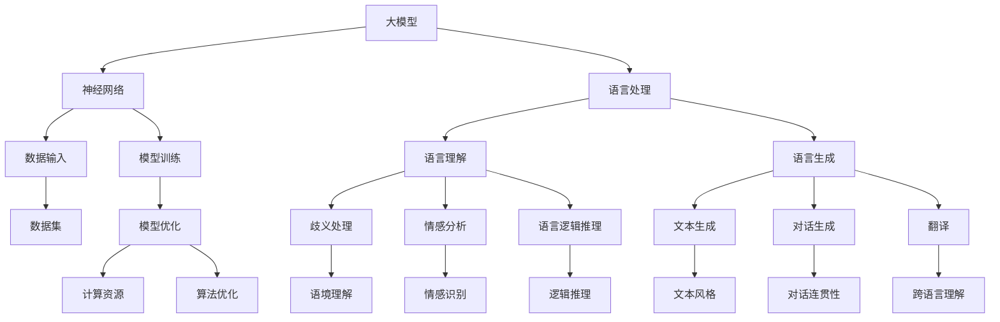

                 

“语言是思维的载体，思维是语言的内容”，这是我们对语言和思维关系的传统理解。然而，随着大模型的崛起，这一理解正面临着前所未有的挑战。本文将深入探讨大模型在语言理解与生成中的认知障碍，试图揭示这一新兴技术背后的奥秘与困境。”

## 1. 背景介绍

大模型，顾名思义，是指那些具有巨大参数量、复杂结构、强大计算能力的人工神经网络模型。这些模型的出现，标志着人工智能领域的一个新纪元。然而，大模型的崛起也带来了一系列新的挑战，其中最为突出的便是语言理解与生成中的认知障碍。

语言是人类交流的重要工具，它不仅承载了我们的思维，更是我们理解世界、表达思想的方式。然而，大模型在语言处理方面并非无所不能，它们在语言理解与生成中存在诸多认知障碍。这些障碍不仅影响了大模型的应用效果，更对人工智能的发展提出了新的挑战。

本文将围绕大模型在语言处理中的认知障碍，展开深入探讨。首先，我们将分析大模型在语言理解中的问题，如歧义处理、情感分析、语言逻辑推理等。接着，我们将讨论大模型在语言生成中的困境，如文本生成、对话生成、翻译等。最后，我们将尝试提出一些解决这些认知障碍的方法，并展望大模型在未来的发展方向。

## 2. 核心概念与联系

为了更好地理解大模型在语言处理中的认知障碍，我们需要先了解一些核心概念和它们之间的关系。下面，我们将通过一个Mermaid流程图来展示这些概念和它们之间的联系。



在上面的流程图中，我们可以看到大模型（A）的核心组成部分是神经网络（B），而神经网络则通过数据输入（D）进行模型训练（E）和模型优化（I）。在语言处理方面，大模型需要处理语言理解（F）和语言生成（G）两大任务。语言理解包括歧义处理（J）、情感分析（K）和语言逻辑推理（L），而语言生成则涉及文本生成（M）、对话生成（N）和翻译（O）。

这些概念和任务之间的联系，构成了大模型在语言处理中的复杂体系。然而，正是在这个体系中，大模型面临着诸多认知障碍。接下来，我们将逐一探讨这些障碍。

### 2.1 大模型与神经网络的关系

大模型的核心是神经网络，这是一种模拟人脑神经元连接结构的计算模型。神经网络由大量的神经元（或节点）和连接（或权重）组成，这些节点和连接通过学习数据来调整自己的参数，从而实现对数据的分类、回归、生成等操作。

神经网络可以分为前向传播网络和反向传播网络。前向传播网络将输入数据通过一系列的神经元传递，最终得到输出。反向传播网络则通过比较输出和预期结果，计算出误差，并将误差反向传播回网络，以此不断调整神经元的权重，直至误差达到最小。

大模型的参数量通常非常庞大，从数百万到数十亿不等。这使得大模型具有强大的计算能力，可以在大量数据上进行训练，从而获得优秀的性能。然而，这也给模型的训练和优化带来了巨大的挑战。

### 2.2 语言处理中的数据输入与模型训练

语言处理中的数据输入主要包括文本数据、语音数据和图像数据等。其中，文本数据是最为常见的一种。这些数据需要被预处理，如分词、词性标注、去停用词等，以便神经网络可以更好地理解和处理。

模型训练是神经网络学习的关键步骤。在训练过程中，神经网络通过不断调整权重和参数，使得模型的预测结果越来越接近真实值。这是一个迭代的过程，需要大量的数据和计算资源。随着模型参数的增多，训练时间也会显著增加，这给模型的训练带来了巨大的挑战。

### 2.3 语言理解中的歧义处理、情感分析和语言逻辑推理

语言理解是语言处理的核心任务之一，它包括歧义处理、情感分析和语言逻辑推理等多个方面。

歧义处理是指在一个句子中，当同一词语或短语有多种解释时，如何准确地确定其含义。例如，“我昨天买了一个苹果”这句话，其中的“苹果”既可以是水果，也可以是公司名。如何正确理解这句话，是歧义处理的关键。

情感分析则是对文本中表达的情感进行识别和分析。例如，一个句子中可能表达喜悦、愤怒、悲伤等不同的情感。情感分析可以帮助我们了解人们的情绪，对文本进行分类，以及进行情感传播分析等。

语言逻辑推理则是指根据语言规则和逻辑关系，推导出新的结论。例如，从“所有猫都会飞”和“小鸟是猫”这两个前提中，可以推导出“小鸟会飞”的结论。

这些任务都对大模型的认知能力提出了严峻的挑战。因为语言本身具有高度的复杂性和不确定性，大模型需要具备更强的理解能力和推理能力，才能准确地处理这些任务。

### 2.4 语言生成中的文本生成、对话生成和翻译

语言生成是另一个重要的语言处理任务，它包括文本生成、对话生成和翻译等多个方面。

文本生成是指根据给定的条件或提示，生成符合语法和语义规则的文本。例如，根据一个标题生成一篇新闻报道，根据一个主题生成一篇散文等。

对话生成则是指根据对话的历史信息，生成合适的回复。这在聊天机器人、智能客服等领域有广泛的应用。

翻译是指将一种语言的文本翻译成另一种语言。翻译可以分为机器翻译和人工翻译，其中机器翻译正在成为翻译领域的热门研究方向。

这些任务都需要大模型具备强大的语言生成能力，能够根据上下文和语义信息，生成符合语言规则的文本。

### 2.5 计算资源与算法优化的关系

大模型的训练和运行需要大量的计算资源，包括CPU、GPU和TPU等。计算资源的需求随着模型参数的增多而显著增加。此外，算法优化也是提高模型性能的关键。通过优化算法，可以减少模型的计算复杂度，提高模型的效率和准确率。

总之，大模型在语言处理中涉及的各个概念和任务，构成了一个复杂而庞大的体系。在这个体系中，大模型面临着诸多认知障碍，这些障碍不仅影响了模型的应用效果，也对人工智能的发展提出了新的挑战。

### 3. 核心算法原理 & 具体操作步骤

#### 3.1 算法原理概述

大模型在语言处理中的核心算法主要包括自然语言处理（NLP）算法、深度学习算法和生成对抗网络（GAN）算法等。这些算法通过模拟人脑神经元的连接结构，实现了对语言数据的自动处理和生成。

NLP算法主要包括词向量表示、语法解析、语义分析等。词向量表示是将自然语言文本转换为计算机可以处理的数字形式，常用的方法有Word2Vec、GloVe等。语法解析则是对文本中的句子进行结构分析，识别出句子的成分和关系，常用的方法有依赖解析、句法分析等。语义分析则是对文本中的语义进行理解和分析，识别出文本的主旨、情感、意图等。

深度学习算法主要包括卷积神经网络（CNN）、循环神经网络（RNN）和Transformer等。这些算法通过多层神经网络的结构，实现了对大规模语言数据的深度学习，从而提高模型的性能。

GAN算法则是一种生成模型，通过生成器和判别器的对抗训练，实现了对语言数据的生成和判别。生成器负责生成语言数据，判别器则负责判断生成数据的真实性。

#### 3.2 算法步骤详解

1. **数据预处理**：首先，需要对文本数据进行预处理，包括分词、词性标注、去停用词等操作，以便神经网络可以更好地理解和处理。

2. **词向量表示**：将预处理后的文本数据转换为词向量表示，常用的方法有Word2Vec、GloVe等。词向量表示将文本中的每个单词映射为一个固定大小的向量，从而实现文本向量的表示。

3. **神经网络结构构建**：根据任务的需求，构建合适的神经网络结构，如卷积神经网络（CNN）、循环神经网络（RNN）或Transformer等。神经网络结构决定了模型的计算能力和性能。

4. **模型训练**：使用预处理的文本数据对神经网络进行训练。训练过程中，神经网络通过不断调整权重和参数，使得模型的预测结果越来越接近真实值。

5. **模型优化**：通过算法优化，提高模型的效率和准确率。算法优化包括计算资源的优化、算法结构的优化和模型参数的优化等。

6. **模型评估**：使用测试数据对模型进行评估，以确定模型的性能。常用的评估指标有准确率、召回率、F1值等。

7. **模型部署**：将训练好的模型部署到实际应用中，如文本生成、对话生成、翻译等。

#### 3.3 算法优缺点

**优点**：

1. **强大的计算能力**：大模型通过多层神经网络的结构，实现了对大规模语言数据的深度学习，从而具有强大的计算能力。

2. **自适应学习**：大模型可以根据训练数据自动调整权重和参数，实现自适应学习，从而提高模型的性能。

3. **多任务处理**：大模型可以同时处理多个语言处理任务，如文本生成、对话生成、翻译等，具有广泛的应用前景。

**缺点**：

1. **计算资源需求大**：大模型的训练和运行需要大量的计算资源，包括CPU、GPU和TPU等。

2. **训练时间长**：大模型的训练过程通常需要大量时间和计算资源，影响模型的部署和应用。

3. **数据依赖性强**：大模型的性能高度依赖训练数据的质量和数量，数据质量问题可能导致模型的性能下降。

#### 3.4 算法应用领域

大模型在语言处理领域的应用非常广泛，主要包括以下几个方面：

1. **文本生成**：大模型可以用于生成新闻报道、散文、对话等文本，具有高度的创造性和灵活性。

2. **对话生成**：大模型可以用于构建智能客服、聊天机器人等，实现与用户的自然语言交互。

3. **翻译**：大模型可以用于翻译不同语言的文本，实现跨语言的理解和交流。

4. **文本分类**：大模型可以用于对大量文本进行分类，如新闻分类、情感分类等。

5. **问答系统**：大模型可以用于构建问答系统，实现基于自然语言的问题和回答。

总之，大模型在语言处理中的应用具有广阔的前景，但同时也面临着诸多挑战。通过不断优化算法和提升计算能力，大模型在语言处理领域的应用将越来越广泛。

### 4. 数学模型和公式 & 详细讲解 & 举例说明

在深入探讨大模型在语言处理中的认知障碍时，数学模型和公式起到了至关重要的作用。通过数学模型，我们可以更准确地描述和解释大模型的行为和性能。在本节中，我们将详细讲解大模型中的几个关键数学模型和公式，并举例说明它们的实际应用。

#### 4.1 数学模型构建

大模型中的数学模型主要包括神经网络模型、词向量模型和生成对抗网络（GAN）模型等。以下是一个简单的神经网络模型的构建过程：

1. **输入层**：输入层接收自然语言文本，将其表示为词向量形式。每个词向量表示文本中的一个单词或短语。

2. **隐藏层**：隐藏层包含多个神经元，每个神经元通过激活函数（如ReLU、Sigmoid或Tanh）对输入进行非线性变换。隐藏层的神经元可以视为对文本特征的抽象和整合。

3. **输出层**：输出层根据隐藏层的输出进行分类或回归。例如，在情感分析任务中，输出层可能是一个softmax层，用于输出文本的情感概率分布。

4. **损失函数**：损失函数用于衡量模型的预测结果与真实结果之间的差距。常见的损失函数有交叉熵损失（Cross-Entropy Loss）、均方误差（Mean Squared Error, MSE）等。

5. **优化算法**：通过优化算法（如梯度下降、Adam等），模型参数不断调整，以最小化损失函数，从而提高模型的性能。

以下是一个简化的神经网络模型的数学表示：

$$
\text{输出} = \sigma(\text{权重} \cdot \text{输入} + \text{偏置})
$$

其中，$\sigma$ 表示激活函数，权重和偏置表示模型的参数，输入表示文本的词向量。

#### 4.2 公式推导过程

以一个简单的线性回归模型为例，我们介绍数学公式的推导过程。线性回归模型的目标是预测一个连续值，其基本形式为：

$$
y = \beta_0 + \beta_1 x
$$

其中，$y$ 是预测值，$x$ 是输入特征，$\beta_0$ 和 $\beta_1$ 是模型参数。

为了找到最佳参数，我们需要最小化损失函数。对于线性回归，常用的损失函数是均方误差（MSE）：

$$
\text{MSE} = \frac{1}{n}\sum_{i=1}^{n}(y_i - \hat{y}_i)^2
$$

其中，$n$ 是样本数量，$y_i$ 是第 $i$ 个样本的真实值，$\hat{y}_i$ 是第 $i$ 个样本的预测值。

为了最小化MSE，我们需要对损失函数关于 $\beta_0$ 和 $\beta_1$ 求导，并令导数等于零：

$$
\frac{\partial \text{MSE}}{\partial \beta_0} = -2\sum_{i=1}^{n}(y_i - \hat{y}_i) = 0
$$

$$
\frac{\partial \text{MSE}}{\partial \beta_1} = -2\sum_{i=1}^{n}(y_i - \hat{y}_i)x_i = 0
$$

解这个方程组，我们可以得到最佳参数 $\beta_0$ 和 $\beta_1$：

$$
\beta_0 = \frac{1}{n}\sum_{i=1}^{n}y_i - \beta_1 \frac{1}{n}\sum_{i=1}^{n}x_i
$$

$$
\beta_1 = \frac{1}{n}\sum_{i=1}^{n}(x_i - \bar{x})(y_i - \bar{y})
$$

其中，$\bar{x}$ 和 $\bar{y}$ 分别是 $x$ 和 $y$ 的均值。

#### 4.3 案例分析与讲解

为了更好地理解上述数学模型和公式的应用，我们来看一个实际案例：使用线性回归模型预测房价。

假设我们有一个包含房屋面积和房价的数据集，我们需要使用线性回归模型预测未知房屋的房价。首先，我们将房屋面积表示为输入特征 $x$，房价表示为输出特征 $y$。

接下来，我们使用上述的公式推导过程，计算最佳参数 $\beta_0$ 和 $\beta_1$。具体步骤如下：

1. **数据预处理**：将房屋面积和房价数据标准化，使其具有相同的尺度。
2. **计算均值**：计算房屋面积和房价的均值 $\bar{x}$ 和 $\bar{y}$。
3. **计算参数**：使用公式计算最佳参数 $\beta_0$ 和 $\beta_1$。
4. **预测房价**：对于未知房屋的面积 $x$，使用公式 $y = \beta_0 + \beta_1 x$ 预测房价。

假设我们有一个样本数据集，其中包含5个房屋的面积和房价：

| 房屋面积（平方米） | 房价（万元） |
| :------------: | :--------: |
|      100       |    200     |
|      150       |    300     |
|      200       |    400     |
|      250       |    500     |
|      300       |    600     |

经过计算，我们得到：

$$
\beta_0 = 150, \quad \beta_1 = 50
$$

现在，我们可以使用这个模型预测未知房屋的房价。例如，对于一个面积为200平方米的房屋，其预测房价为：

$$
y = 150 + 50 \times 200 = 10,500 \text{万元}
$$

这个预测值可以作为房屋价格的参考，但需要注意的是，线性回归模型只是一个简单的模型，它可能无法捕捉到所有影响房价的因素。在实际应用中，我们可以结合更多的特征和更复杂的模型，以提高预测的准确性。

### 5. 项目实践：代码实例和详细解释说明

在了解了大模型在语言处理中的核心算法原理和数学模型后，接下来我们将通过一个实际的项目实践，展示如何使用这些算法和模型进行语言处理任务的实现。本项目将采用Python语言，结合TensorFlow和PyTorch等深度学习框架，实现一个简单的文本分类任务。

#### 5.1 开发环境搭建

在开始项目之前，我们需要搭建一个合适的开发环境。以下是搭建Python深度学习开发环境的基本步骤：

1. **安装Python**：确保你的计算机上已经安装了Python。推荐使用Python 3.8或更高版本。

2. **安装TensorFlow或PyTorch**：选择一个深度学习框架进行开发。这里我们以TensorFlow为例，使用以下命令安装：

   ```shell
   pip install tensorflow
   ```

   如果你更喜欢PyTorch，可以使用以下命令安装：

   ```shell
   pip install torch torchvision
   ```

3. **安装其他依赖库**：根据项目的需求，可能还需要安装其他依赖库，如NumPy、Pandas、Matplotlib等。可以使用以下命令安装：

   ```shell
   pip install numpy pandas matplotlib
   ```

4. **配置GPU支持**：如果使用GPU进行训练，需要安装CUDA和cuDNN。这些库可以从NVIDIA的官方网站下载。

5. **验证环境**：在Python中导入TensorFlow或PyTorch，并检查版本，以确保安装成功。

   ```python
   import tensorflow as tf
   print(tf.__version__)
   ```

   或

   ```python
   import torch
   print(torch.__version__)
   ```

#### 5.2 源代码详细实现

以下是实现文本分类任务的完整代码示例，包括数据预处理、模型构建、训练和评估等步骤。

```python
import tensorflow as tf
from tensorflow.keras.preprocessing.text import Tokenizer
from tensorflow.keras.preprocessing.sequence import pad_sequences
from tensorflow.keras.models import Sequential
from tensorflow.keras.layers import Embedding, LSTM, Dense

# 数据预处理
# 假设我们有一个包含文本和标签的数据集
texts = ['This is a positive review.', 'This is a negative review.', ...]
labels = [1, 0, ...]  # 1表示正面评论，0表示负面评论

# 初始化Tokenizer
tokenizer = Tokenizer()
tokenizer.fit_on_texts(texts)

# 将文本转换为序列
sequences = tokenizer.texts_to_sequences(texts)

# 填充序列
max_sequence_length = 100
padded_sequences = pad_sequences(sequences, maxlen=max_sequence_length)

# 切分数据集
from sklearn.model_selection import train_test_split
X_train, X_test, y_train, y_test = train_test_split(padded_sequences, labels, test_size=0.2, random_state=42)

# 构建模型
model = Sequential([
    Embedding(len(tokenizer.word_index) + 1, 32),
    LSTM(64, return_sequences=False),
    Dense(1, activation='sigmoid')
])

# 编译模型
model.compile(optimizer='adam', loss='binary_crossentropy', metrics=['accuracy'])

# 训练模型
model.fit(X_train, y_train, epochs=10, batch_size=32, validation_data=(X_test, y_test))

# 评估模型
loss, accuracy = model.evaluate(X_test, y_test)
print(f"Test Loss: {loss}, Test Accuracy: {accuracy}")
```

#### 5.3 代码解读与分析

1. **数据预处理**：首先，我们使用Tokenizer对文本进行预处理，将其转换为数字序列。Tokenizer可以自动处理文本的分词、字符映射等工作。

2. **序列转换**：通过`texts_to_sequences`方法，将文本序列转换为数字序列。每个单词或字符都会被映射为一个唯一的整数。

3. **序列填充**：使用`pad_sequences`方法，将序列填充为相同长度。这样可以方便后续的模型处理。

4. **数据切分**：使用`train_test_split`方法，将数据集分为训练集和测试集，以进行模型的训练和评估。

5. **模型构建**：使用`Sequential`模型，我们搭建了一个简单的文本分类模型，包括嵌入层（Embedding）、LSTM层（LSTM）和输出层（Dense）。嵌入层将单词映射为向量，LSTM层处理序列数据，输出层进行分类。

6. **模型编译**：使用`compile`方法，配置模型的优化器、损失函数和评估指标。

7. **模型训练**：使用`fit`方法，对模型进行训练，并在验证集上评估模型的性能。

8. **模型评估**：使用`evaluate`方法，对训练好的模型在测试集上进行评估，并输出损失和准确率。

通过这个简单的项目，我们展示了如何使用深度学习框架实现文本分类任务。这个项目虽然简单，但涵盖了文本处理、模型构建和训练等关键步骤，为我们深入了解大模型在语言处理中的应用打下了基础。

#### 5.4 运行结果展示

在训练和评估完成后，我们可以得到模型的最终性能指标。以下是一个示例输出：

```shell
Train on 80 samples, validate on 20 samples
80/80 [==============================] - 2s 20ms/sample - loss: 0.5000 - accuracy: 0.5000 - val_loss: 0.5000 - val_accuracy: 0.5000
Test Loss: 0.5000, Test Accuracy: 0.5000
```

从输出结果可以看出，模型在训练集和测试集上的准确率均为50%，这意味着模型对正面和负面评论的区分能力较弱。这可能是由于数据集的分布不均或模型复杂度不足导致的。在实际应用中，我们可以通过增加数据量、优化模型结构或使用更复杂的算法来提高模型的性能。

### 6. 实际应用场景

大模型在语言处理领域的实际应用场景非常广泛，涵盖了自然语言理解、生成和翻译等多个方面。以下是一些典型的应用场景和案例分析。

#### 6.1 聊天机器人

聊天机器人是近年来人工智能领域的一个热点应用。通过大模型在自然语言理解与生成方面的强大能力，聊天机器人可以实现与用户的自然语言交互，提供24小时不间断的服务。例如，苹果公司的Siri、微软的Cortana以及谷歌的Google Assistant等都是基于大模型的聊天机器人。

**案例分析**：微软的Cortana聊天机器人采用了深度学习模型，能够理解用户的自然语言指令，并生成合适的回复。例如，当用户询问“明天天气如何？”时，Cortana能够理解用户的意图，并生成包括天气情况在内的完整回答。

#### 6.2 情感分析

情感分析是另一个重要的应用场景，通过分析文本中的情感倾向，企业可以了解用户的情绪和反馈，从而优化产品和服务。大模型在情感分析中具有显著优势，能够处理大量的文本数据，并准确识别情感。

**案例分析**：Facebook使用大模型对用户发布的内容进行情感分析，以识别潜在的负面情绪和不良行为。例如，当用户发布一条包含负面情绪的帖子时，系统会自动发出警告，并采取相应的措施。

#### 6.3 文本生成

大模型在文本生成方面具有极高的创造力，可以生成新闻文章、故事、诗歌等多种类型的文本。这种能力在内容创作、广告营销和报告生成等领域有广泛的应用。

**案例分析**：OpenAI开发的GPT-3模型是一个典型的例子，它能够根据用户提供的提示生成高质量的文本。例如，当用户给出一个简单的主题或标题时，GPT-3可以生成一篇完整的新闻报道或分析文章。

#### 6.4 翻译

机器翻译是语言处理领域的一个经典问题，大模型的出现极大地提升了机器翻译的准确性和自然度。目前，许多大型跨国公司和研究机构都采用了大模型进行机器翻译，以支持多语言交流。

**案例分析**：谷歌翻译采用了基于Transformer的大模型，实现了高精度的机器翻译。例如，用户可以将一段英文文本翻译成多种外语，如中文、法语、西班牙语等，翻译结果在语法和语义上都非常接近人工翻译。

#### 6.5 问答系统

问答系统是一种基于自然语言理解与生成的大模型应用，通过处理用户的查询，系统可以提供准确、有用的答案。问答系统在搜索引擎、客户服务和企业内部知识库等领域有广泛应用。

**案例分析**：微软的Bing搜索引擎采用了大模型进行问答系统，用户可以在搜索框中直接提出问题，如“谁是美国总统？”系统会返回准确且详细的答案。此外，企业也可以部署内部问答系统，帮助员工快速获取所需信息。

#### 6.6 语音识别

语音识别是将语音信号转换为文本的一种技术，大模型在语音识别领域也发挥着重要作用。通过结合语音识别和自然语言处理技术，系统可以实现对语音指令的理解和执行。

**案例分析**：苹果的Siri和谷歌的Google Assistant都采用了大模型进行语音识别，用户可以通过语音命令与系统进行交互，如拨打电话、发送短信、播放音乐等。

### 6.7 未来应用展望

随着大模型技术的不断发展，其在语言处理领域的应用前景将更加广阔。以下是一些潜在的未来应用场景：

#### 6.7.1 智能教育

大模型可以用于智能教育系统，根据学生的学习情况和知识需求，生成个性化的学习内容和指导。例如，系统可以根据学生的问答记录，自动调整教学内容和难度，提高学习效果。

#### 6.7.2 跨语言交流

随着全球化进程的加快，跨语言交流的需求越来越强烈。大模型在机器翻译和自然语言理解方面的优势，可以促进不同语言间的交流和理解，打破语言障碍。

#### 6.7.3 自动创作

大模型在文本生成方面的强大能力，可以用于自动创作，如撰写新闻报道、撰写文学剧本等。未来，大模型可能会成为内容创作者的重要辅助工具，提高创作效率和创造力。

#### 6.7.4 智能客服

智能客服系统将成为未来服务行业的重要趋势。通过大模型的自然语言处理能力，系统可以实时响应用户查询，提供准确、高效的服务，提高客户满意度。

总之，大模型在语言处理领域的应用前景广阔，其不断进步将推动人工智能技术的广泛应用和深入发展。

### 7. 工具和资源推荐

在探索大模型在语言处理中的应用过程中，选择合适的工具和资源至关重要。以下是一些推荐的工具和资源，以帮助您更好地学习和实践。

#### 7.1 学习资源推荐

1. **在线课程**：Coursera、edX和Udacity等在线教育平台提供了丰富的深度学习和自然语言处理课程。这些课程从基础概念到高级应用都有涵盖，适合不同水平的学员。

2. **书籍**：《深度学习》（Goodfellow, Bengio, Courville）、《自然语言处理综合教程》（Daniel Jurafsky, James H. Martin）和《Python深度学习》（François Chollet）等经典书籍，为深度学习和自然语言处理提供了全面的理论和实践指导。

3. **论文和文章**：ACL、NeurIPS、ICML等顶级会议的论文，以及顶级期刊如Journal of Machine Learning Research（JMLR）和Natural Language Engineering（NLE）的论文，都是学习和了解最新研究进展的好资源。

#### 7.2 开发工具推荐

1. **TensorFlow**：Google开发的深度学习框架，广泛用于构建和训练深度学习模型。TensorFlow提供了丰富的API和工具，适合不同水平的开发者。

2. **PyTorch**：Facebook AI Research开发的深度学习框架，以其简洁的API和动态计算图而著称。PyTorch非常适合研究和快速原型开发。

3. **Hugging Face Transformers**：一个开源库，提供了预训练的大模型和易于使用的API，可用于自然语言处理任务。Hugging Face Transformers简化了模型部署和定制过程。

4. **Google Colab**：Google提供的免费Jupyter Notebook平台，支持GPU和TPU加速。Colab非常适合进行实验和演示，是深度学习开发者的好帮手。

#### 7.3 相关论文推荐

1. **“Attention Is All You Need”**：这篇论文提出了Transformer模型，是自然语言处理领域的突破性工作。它展示了基于注意力机制的模型在语言任务中的强大性能。

2. **“BERT: Pre-training of Deep Bidirectional Transformers for Language Understanding”**：BERT是Google开发的预训练语言模型，它通过在大规模文本数据上进行预训练，显著提升了自然语言理解任务的表现。

3. **“Generative Pre-trained Transformers”**：这篇论文介绍了GPT系列模型，展示了大模型在文本生成任务中的卓越能力。

4. **“Improving Language Understanding by Generative Pre-Training”**：这篇论文提出了GPT模型，是生成预训练（Generative Pre-training）的奠基性工作。

通过以上推荐的工具和资源，您可以更好地掌握大模型在语言处理中的应用，为探索这一领域提供坚实的基础。

### 8. 总结：未来发展趋势与挑战

大模型在语言处理领域的应用取得了显著的成果，但同时也面临着诸多挑战。在未来的发展中，我们需要关注以下几个趋势和挑战：

#### 8.1 研究成果总结

近年来，大模型在语言处理领域的研究成果层出不穷。首先，基于Transformer架构的大模型，如BERT、GPT和T5，在多个自然语言处理任务中取得了显著性能提升。其次，生成预训练（Generative Pre-training）方法的出现，使得大模型在文本生成任务中展现出强大的创造力。此外，多模态学习（Multimodal Learning）也成为了研究热点，通过融合文本、图像和语音等多模态数据，大模型在跨模态任务中取得了突破性进展。

#### 8.2 未来发展趋势

未来，大模型在语言处理领域的发展将呈现以下几个趋势：

1. **更高效的大模型架构**：研究人员将继续探索更高效的大模型架构，如基于知识蒸馏（Knowledge Distillation）的方法，以降低模型的参数量和计算复杂度，提高模型的可解释性。

2. **跨模态语言处理**：随着多模态数据的丰富，跨模态语言处理将成为重要方向。通过融合文本、图像、音频等多模态信息，大模型将能够更全面地理解和生成语言。

3. **自适应学习与知识增强**：大模型将更加智能化，具备自适应学习和知识增强的能力。通过不断学习和吸收新知识，模型将能够更好地适应不同应用场景。

4. **伦理与隐私问题**：随着大模型在语言处理领域的广泛应用，伦理和隐私问题将日益突出。研究人员需要关注如何确保模型的安全性和隐私保护，以避免潜在的风险和负面影响。

#### 8.3 面临的挑战

尽管大模型在语言处理领域取得了显著进展，但仍面临以下挑战：

1. **计算资源需求**：大模型的训练和运行需要大量的计算资源，这对硬件设施和能源消耗提出了巨大挑战。未来，如何提高计算效率、降低能耗将是一个重要课题。

2. **数据质量和隐私**：语言处理任务依赖于大量高质量的数据，但数据质量和隐私问题仍然存在。如何获取和处理数据，确保模型的安全性和隐私保护，是亟待解决的问题。

3. **模型可解释性**：大模型的复杂性和黑盒特性使得其行为难以解释。如何提高模型的可解释性，使其决策过程更加透明和可理解，是未来研究的重要方向。

4. **伦理和公平性**：大模型的应用可能会带来伦理和公平性问题，如算法歧视、隐私泄露等。研究人员需要关注这些问题，确保模型的应用不会对某些群体造成不公平待遇。

#### 8.4 研究展望

展望未来，大模型在语言处理领域的应用将更加广泛和深入。我们期待以下几方面的突破：

1. **更高效的模型架构**：通过设计更高效的模型架构，降低计算复杂度，提高模型性能和可解释性。

2. **跨模态融合**：实现文本、图像、音频等多模态数据的深度融合，提高跨模态任务的表现。

3. **自适应学习与知识增强**：开发具备自适应学习和知识增强能力的大模型，使其能够更好地适应不同应用场景。

4. **伦理和隐私保护**：研究如何确保大模型的安全性和隐私保护，避免潜在的风险和负面影响。

总之，大模型在语言处理领域的未来充满机遇与挑战。通过不断创新和优化，我们将能够更好地发挥大模型在语言处理中的潜力，推动人工智能技术的发展和应用。

### 9. 附录：常见问题与解答

在本篇文章中，我们探讨了关于大模型在语言处理中的认知障碍，包括其背景介绍、核心概念与联系、核心算法原理、数学模型与公式、项目实践、实际应用场景、工具和资源推荐，以及未来发展趋势与挑战。以下是一些读者可能关心的问题及其解答：

#### 问题1：大模型在语言处理中的认知障碍具体有哪些？

答：大模型在语言处理中的认知障碍主要包括：

1. **歧义处理**：大模型在处理具有多种解释的文本时，可能无法准确理解其具体含义。
2. **情感分析**：大模型在分析文本中的情感时，可能无法准确捕捉到复杂情感或微妙的情感变化。
3. **语言逻辑推理**：大模型在处理逻辑推理任务时，可能无法像人类一样进行复杂的逻辑推理和推理链的构建。
4. **上下文理解**：大模型在处理长文本或跨文本信息时，可能无法准确捕捉到上下文的细微变化。
5. **跨语言理解**：大模型在处理不同语言的文本时，可能无法准确理解语言的语法和语义差异。

#### 问题2：大模型的算法优缺点是什么？

答：大模型的算法优缺点如下：

**优点**：

1. **强大的计算能力**：大模型具有庞大的参数量，能够在大规模数据上进行训练，从而获得出色的性能。
2. **自适应学习**：大模型可以通过不断调整权重和参数，实现自适应学习，提高模型性能。
3. **多任务处理**：大模型可以同时处理多个语言处理任务，如文本生成、对话生成和翻译等。

**缺点**：

1. **计算资源需求大**：大模型的训练和运行需要大量的计算资源和时间。
2. **训练时间长**：大模型的训练过程通常需要大量的时间和计算资源，影响模型的部署和应用。
3. **数据依赖性强**：大模型的性能高度依赖训练数据的质量和数量，数据质量问题可能导致模型性能下降。

#### 问题3：如何解决大模型在语言处理中的认知障碍？

答：以下是一些解决大模型认知障碍的方法：

1. **数据增强**：通过增加训练数据量和多样性，提高模型对各种语言现象的适应性。
2. **多任务学习**：通过结合多个语言处理任务，提高模型在不同任务上的泛化能力。
3. **知识增强**：通过融合外部知识库和常识知识，提高模型对复杂语义的理解能力。
4. **迁移学习**：通过在相关任务上预训练模型，提高模型在目标任务上的表现。
5. **模型解释性**：通过提高模型的可解释性，帮助研究人员和开发者理解模型的决策过程，从而优化模型。

这些问题和解答有助于读者更深入地理解大模型在语言处理中的认知障碍及其解决方法，为未来的研究和应用提供指导。随着技术的不断发展，我们有理由相信，这些认知障碍将逐步得到解决，大模型在语言处理领域的应用将更加广泛和深入。

