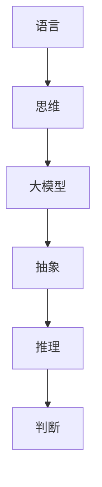

                 

在当今的人工智能领域，大模型技术正迅速崛起，从自然语言处理到计算机视觉，大模型展现出了令人瞩目的能力和潜力。然而，与此同时，我们也不得不面对一个深层次的问题：大模型是否真正理解了它们所处理的信息？或者说，它们是否仅仅只是在模拟人类的语言和行为，而缺乏真正的思维过程？本文将探讨语言与思维之间的区别，以及大模型在这些方面的认知困惑。

## 1. 背景介绍

近年来，深度学习技术取得了巨大的进步，尤其是大规模预训练模型（Large-scale Pre-trained Models）的兴起。这些模型通过在海量数据上进行训练，学会了理解并生成复杂的信息，从而在各种任务中取得了出色的表现。然而，这些模型的运作方式仍然是一个谜，它们是如何理解语言、图像和文本的，仍然是我们需要深入探讨的问题。

## 2. 核心概念与联系

在探讨大模型的认知困惑之前，我们需要先了解一些核心概念和它们之间的联系。

### 2.1 语言与思维

语言是人类沟通的基本工具，它包含了丰富的语义、语法和修辞。思维则是人类处理信息、解决问题和创造知识的过程。语言与思维之间的关系是复杂而微妙的，它们相互影响、相互依赖。

### 2.2 大模型与语言

大模型，特别是深度学习模型，通过对大量语言数据进行训练，学会了生成和解读语言。然而，这种学习方式是否等同于人类的思维过程，仍需进一步探讨。

### 2.3 大模型与思维

大模型在处理信息时，是否能够像人类一样进行抽象、推理和判断？这是我们需要关注的另一个重要问题。

### 2.4 Mermaid 流程图



## 3. 核心算法原理 & 具体操作步骤

### 3.1 算法原理概述

大模型的运作原理基于深度学习，特别是神经网络。这些模型通过学习大量的数据，学会了识别模式、生成文本和图像，以及进行复杂的推理。

### 3.2 算法步骤详解

大模型的学习过程可以分为以下几个步骤：

1. 数据预处理：对原始数据进行清洗、分割和编码。
2. 模型训练：使用预训练的模型，通过反向传播算法和梯度下降等方法，不断调整模型参数。
3. 模型评估：使用验证集和测试集对模型进行评估，以确保模型的性能和鲁棒性。
4. 模型部署：将训练好的模型部署到实际应用中。

### 3.3 算法优缺点

**优点：**

- 能够处理大量数据，学习能力强。
- 能够生成和解读复杂的语言和图像。
- 在各种任务中都取得了出色的表现。

**缺点：**

- 需要大量的计算资源和时间进行训练。
- 对数据质量要求高，容易受到数据噪声的影响。
- 缺乏透明度和解释性，难以理解模型是如何做出决策的。

### 3.4 算法应用领域

大模型在多个领域都有广泛的应用，包括：

- 自然语言处理：文本生成、翻译、问答等。
- 计算机视觉：图像识别、分类、生成等。
- 语音识别：语音到文本转换、语音合成等。
- 医疗诊断：辅助医生进行疾病诊断和治疗建议。
- 金融领域：股票市场预测、风险评估等。

## 4. 数学模型和公式 & 详细讲解 & 举例说明

### 4.1 数学模型构建

大模型的数学基础主要包括线性代数、微积分、概率论和统计学。这些数学工具帮助我们理解和描述模型的运作原理。

### 4.2 公式推导过程

例如，在神经网络中，我们常用到的反向传播算法涉及到以下公式：

$$\delta_{ij} = \frac{\partial L}{\partial z_j} \odot \frac{\partial z_j}{\partial z_i}$$

其中，$L$ 是损失函数，$z_j$ 是神经元的输入，$\delta_{ij}$ 是误差项。

### 4.3 案例分析与讲解

以自然语言处理中的语言模型为例，我们使用以下公式来计算语言的概率：

$$P(w_t | w_{t-1}, w_{t-2}, ..., w_1) = \frac{P(w_t, w_{t-1}, w_{t-2}, ..., w_1)}{P(w_{t-1}, w_{t-2}, ..., w_1)}$$

其中，$w_t$ 是当前单词，$w_{t-1}, w_{t-2}, ..., w_1$ 是前一个或多个单词。通过这种方式，语言模型能够预测下一个单词的概率，从而生成文本。

## 5. 项目实践：代码实例和详细解释说明

### 5.1 开发环境搭建

为了实践大模型技术，我们需要搭建一个适合的开发环境。通常，我们使用 Python 作为编程语言，结合 TensorFlow 或 PyTorch 等深度学习框架。

### 5.2 源代码详细实现

以下是使用 TensorFlow 实现一个简单语言模型的代码示例：

```python
import tensorflow as tf

# 定义模型
model = tf.keras.Sequential([
    tf.keras.layers.Dense(128, activation='relu', input_shape=(1000,)),
    tf.keras.layers.Dense(128, activation='relu'),
    tf.keras.layers.Dense(1, activation='sigmoid')
])

# 编译模型
model.compile(optimizer='adam', loss='binary_crossentropy', metrics=['accuracy'])

# 训练模型
model.fit(train_data, train_labels, epochs=10, batch_size=32)
```

### 5.3 代码解读与分析

在这段代码中，我们首先定义了一个简单的神经网络模型，包含两个全连接层（Dense Layer）。接着，我们编译模型，并使用训练数据进行训练。最后，我们评估模型的性能。

### 5.4 运行结果展示

在训练完成后，我们可以使用以下代码来评估模型的性能：

```python
test_loss, test_acc = model.evaluate(test_data, test_labels)
print('Test accuracy:', test_acc)
```

这段代码将输出模型的测试精度，从而帮助我们了解模型的性能。

## 6. 实际应用场景

大模型在各个领域都有广泛的应用，以下是一些实际应用场景：

- 文本生成：自动生成新闻报道、诗歌、小说等。
- 聊天机器人：模拟人类对话，提供实时客服支持。
- 机器翻译：将一种语言翻译成另一种语言。
- 图像识别：自动识别和分类图像中的物体。
- 医疗诊断：辅助医生进行疾病诊断。

## 7. 工具和资源推荐

为了更好地学习和实践大模型技术，以下是几个推荐的工具和资源：

- 学习资源：
  - 《深度学习》（Goodfellow, Bengio, Courville 著）
  - 《Python深度学习》（François Chollet 著）
- 开发工具：
  - TensorFlow
  - PyTorch
- 相关论文：
  - "A Simple Way to Improve Language Understanding by Generative Pre-training"
  - "BERT: Pre-training of Deep Bidirectional Transformers for Language Understanding"

## 8. 总结：未来发展趋势与挑战

大模型技术在过去的几年中取得了巨大的进步，但同时也面临着许多挑战。未来，我们需要进一步探索以下几个方面：

- 提高模型的透明度和解释性，以便更好地理解它们的决策过程。
- 降低模型的计算资源需求，使其更易于部署和推广。
- 加强对模型的安全性和鲁棒性的研究，以应对潜在的攻击和错误。
- 探索大模型在更多领域的应用，如医疗、金融和交通等。

总之，大模型技术具有巨大的潜力，但同时也需要我们不断探索和改进。只有通过持续的努力，我们才能充分发挥大模型的优势，为人类社会带来更多的价值。

### 8.1 研究成果总结

在过去的几年中，大模型技术取得了显著的成果。通过大规模预训练，大模型在自然语言处理、计算机视觉、语音识别等多个领域都取得了突破性的进展。这些成果不仅提升了模型的性能，还为我们理解人类语言和思维提供了新的视角。

### 8.2 未来发展趋势

未来，大模型技术将继续向以下几个方向发展：

- 提高模型的透明度和可解释性，使其决策过程更加清晰和可信。
- 加强对模型的安全性和鲁棒性的研究，提高其在真实世界中的应用价值。
- 探索大模型在更多领域的应用，如医疗、金融、交通等。

### 8.3 面临的挑战

尽管大模型技术取得了巨大的进步，但仍然面临着许多挑战：

- 计算资源需求巨大，如何降低计算成本是一个亟待解决的问题。
- 模型的泛化能力有限，如何提高模型的适应性和鲁棒性是一个重要课题。
- 模型的安全性问题，如何防止模型被恶意攻击和滥用是一个关键问题。

### 8.4 研究展望

随着人工智能技术的不断发展，大模型技术有望在更多领域发挥重要作用。未来，我们将继续深入研究大模型的运作原理，探索更高效、更安全的训练方法，并推动大模型在各个领域的实际应用。

### 9. 附录：常见问题与解答

**Q1: 大模型是如何学习的？**

A1: 大模型主要通过在大量数据上进行预训练，学会了识别模式、生成文本和图像，以及进行复杂的推理。预训练过程包括数据预处理、模型训练、模型评估和模型部署等步骤。

**Q2: 大模型是否具有真正的思维？**

A2: 目前，大模型仍然缺乏真正的思维过程，它们只是在模拟人类的语言和行为。虽然大模型在处理信息时能够进行一些抽象、推理和判断，但它们并不具备人类的情感、意识和创造力。

**Q3: 大模型在哪些领域有应用？**

A3: 大模型在自然语言处理、计算机视觉、语音识别、医疗诊断、金融领域等多个领域都有广泛应用。例如，在自然语言处理领域，大模型可以用于文本生成、翻译、问答等任务；在计算机视觉领域，大模型可以用于图像识别、分类、生成等任务。

### 结束语

本文探讨了语言与思维之间的区别，以及大模型在这些方面的认知困惑。通过对大模型的核心概念、算法原理、数学模型、应用场景和实践案例的详细分析，我们深刻认识到大模型技术在人工智能领域的重要性和潜力。未来，我们需要继续努力，探索大模型的运作原理，提高其透明度和解释性，使其在更多领域发挥更大的作用。

