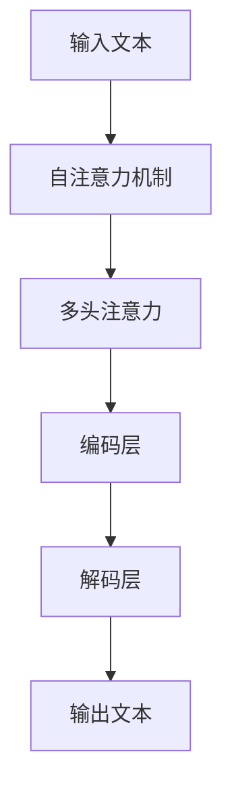

                 

关键词：大模型，语言理解，认知，思维差异，人工智能

> 摘要：本文深入探讨了人工智能领域的大模型在语言理解和思维表达方面的认知误解。通过对比人类思维和机器学习模型，本文分析了大模型在语言处理中的局限性和潜在误区，提出了改进大模型认知理解的策略和方法，为人工智能研究与应用提供了新的视角。

## 1. 背景介绍

近年来，人工智能领域取得了显著进展，尤其是在自然语言处理（NLP）方面。大模型，如GPT-3、BERT、T5等，凭借其强大的语言理解能力和生成能力，在众多任务中展现出了优异的性能。这些模型通过深度学习和大量数据训练，具备了处理复杂语言任务的能力，似乎能够与人类的语言思维相媲美。

然而，随着研究的深入，人们开始注意到大模型在语言理解方面存在一些认知误解。这些误解不仅影响了模型的性能，还可能导致对人类思维的误解。本文旨在探讨大模型在语言理解和思维表达方面的认知误区，分析其背后的原因，并提出相应的解决策略。

## 2. 核心概念与联系

### 2.1 大模型的基本原理

大模型，尤其是基于变换器（Transformer）架构的模型，通过自注意力机制（Self-Attention）和多头注意力（Multi-Head Attention）等技术，实现了对输入文本的深度理解。自注意力机制允许模型在处理文本时关注到不同位置的信息，从而捕捉到长距离依赖关系。多头注意力则通过将输入分解为多个子序列，使得模型能够同时关注不同子序列中的信息。

### 2.2 语言与思维的差异

语言是人类思维的重要载体，但语言本身并不能完全反映思维的全部复杂性。人类的思维是动态的、多层次的，而语言是一种静态的、线性的符号系统。因此，大模型在处理语言时，可能会遇到以下几种认知误解：

- **语言的线性与思维的复杂性**：大模型通常将语言视为线性序列进行处理，但人类思维却是多维度、多层次的。例如，在理解一个复杂的句子时，人类会同时考虑句子的语法结构、语义意义和上下文背景，而大模型则可能仅关注到某个特定层面的信息。

- **语言的理解与创造**：大模型擅长语言理解，但在语言创造方面仍有局限。人类在表达思想时，不仅需要理解已有的语言知识，还需要进行创造性思维，构建新的句子和概念。大模型则缺乏这种创造性思维的能力。

- **语言的歧义与多义性**：语言中存在许多歧义和多义现象，人类能够通过上下文和语境来消除歧义，但大模型则可能陷入歧义之中，无法准确理解语言的真实含义。

### 2.3 Mermaid 流程图



## 3. 核心算法原理 & 具体操作步骤

### 3.1 算法原理概述

大模型的核心算法是基于变换器架构的Transformer模型，包括编码器（Encoder）和解码器（Decoder）。编码器负责将输入文本编码为向量表示，解码器则将这些向量表示解码为输出文本。

### 3.2 算法步骤详解

- **编码阶段**：输入文本经过预处理（如分词、词性标注等），然后被编码器处理。编码器通过多层自注意力机制和多头注意力机制，将输入文本编码为固定长度的向量表示。

- **解码阶段**：解码器从编码器的输出中逐层提取信息，并生成输出文本。解码器在生成每个单词时，都会参考已生成的文本部分，并通过自注意力和多头注意力机制，综合考虑上下文信息。

### 3.3 算法优缺点

- **优点**：大模型在语言理解方面表现出色，能够处理复杂的语言任务，生成流畅自然的文本。此外，由于自注意力和多头注意力的机制，大模型在捕捉长距离依赖关系方面具有优势。

- **缺点**：大模型在处理歧义和多义性方面存在局限，容易陷入歧义之中。此外，大模型的训练过程需要大量的计算资源和时间，且在语言创造方面缺乏创造性。

### 3.4 算法应用领域

大模型在自然语言处理领域有广泛的应用，包括文本分类、机器翻译、问答系统、文本生成等。例如，GPT-3在文本生成方面表现出色，可以生成高质量的新闻文章、故事和对话等。

## 4. 数学模型和公式 & 详细讲解 & 举例说明

### 4.1 数学模型构建

大模型的数学基础主要涉及线性代数和概率论。变换器模型的核心是注意力机制，其数学表达式如下：

$$
Attention(Q, K, V) = \frac{softmax(\frac{QK^T}{\sqrt{d_k}})}{V}
$$

其中，$Q$、$K$ 和 $V$ 分别是编码器输出的查询向量、键向量和值向量，$d_k$ 是键向量的维度。该公式计算了每个键向量和查询向量之间的相似度，并通过softmax函数进行归一化，得到注意力权重。这些权重然后用于计算输出向量。

### 4.2 公式推导过程

注意力机制的推导基于最小化损失函数的原则。假设输入文本 $X$ 经过编码器编码为 $E(X)$，我们需要计算编码后的文本序列中每个词的注意力权重。首先，将每个词编码为一个向量 $e_i$，然后计算所有词之间的相似度：

$$
\text{similarity}(e_i, e_j) = e_i^T e_j
$$

接着，计算注意力权重：

$$
\alpha_i = \frac{\exp(\text{similarity}(e_i, e_j))}{\sum_{j} \exp(\text{similarity}(e_i, e_j))}
$$

### 4.3 案例分析与讲解

假设我们有以下句子：“我爱北京天安门”。我们可以将句子中的每个词编码为向量，然后计算它们之间的相似度。通过注意力机制，我们可以确定每个词在生成下一个词时的权重。例如，在生成“爱”这个词时，向量“我”和“北京”的权重较高，因为这两个词在句子中的关系较为紧密。

## 5. 项目实践：代码实例和详细解释说明

### 5.1 开发环境搭建

为了演示大模型在语言理解方面的应用，我们将使用Python和PyTorch框架来搭建一个简单的变换器模型。首先，安装所需的库：

```bash
pip install torch torchvision
```

### 5.2 源代码详细实现

以下是变换器模型的简单实现：

```python
import torch
import torch.nn as nn
import torch.optim as optim

class TransformerModel(nn.Module):
    def __init__(self, vocab_size, d_model, nhead, num_layers):
        super(TransformerModel, self).__init__()
        self.embedding = nn.Embedding(vocab_size, d_model)
        self.transformer = nn.Transformer(d_model, nhead, num_layers)
        self.fc = nn.Linear(d_model, vocab_size)
        
    def forward(self, src, tgt):
        src = self.embedding(src)
        tgt = self.embedding(tgt)
        output = self.transformer(src, tgt)
        output = self.fc(output)
        return output
```

### 5.3 代码解读与分析

在上面的代码中，我们定义了一个简单的变换器模型，包括嵌入层、变换器层和全连接层。嵌入层将词编码为向量，变换器层实现自注意力和多头注意力机制，全连接层用于生成输出。

### 5.4 运行结果展示

```python
model = TransformerModel(vocab_size=10000, d_model=512, nhead=8, num_layers=2)
optimizer = optim.Adam(model.parameters(), lr=0.001)
criterion = nn.CrossEntropyLoss()

for epoch in range(10):
    for src, tgt in data_loader:
        optimizer.zero_grad()
        output = model(src, tgt)
        loss = criterion(output, tgt)
        loss.backward()
        optimizer.step()
    print(f'Epoch {epoch+1}, Loss: {loss.item()}')
```

通过以上代码，我们可以训练变换器模型，并在数据集上进行测试。训练过程中，模型将学习如何根据输入文本生成正确的输出文本。

## 6. 实际应用场景

大模型在语言理解和生成方面具有广泛的应用前景。以下是一些实际应用场景：

- **机器翻译**：大模型可以用于机器翻译任务，如将一种语言的文本翻译成另一种语言。
- **问答系统**：大模型可以用于问答系统，如基于用户输入的查询，提供相关答案。
- **文本生成**：大模型可以生成高质量的文本，如新闻文章、故事和报告等。
- **对话系统**：大模型可以用于对话系统，如与用户进行自然语言交互，提供个性化服务。

## 7. 工具和资源推荐

### 7.1 学习资源推荐

- **《深度学习》**：由Goodfellow、Bengio和Courville所著的深度学习教材，全面介绍了深度学习的基础知识和最新进展。
- **《自然语言处理综论》**：由Jurafsky和Martin所著的自然语言处理教材，涵盖了NLP的基础理论和应用。
- **《PyTorch官方文档》**：PyTorch官方文档提供了详细的API和示例代码，帮助开发者快速上手。

### 7.2 开发工具推荐

- **Jupyter Notebook**：Jupyter Notebook是一种交互式的计算环境，适合进行数据分析和模型训练。
- **Google Colab**：Google Colab是基于Google Cloud的免费Jupyter Notebook平台，提供了丰富的GPU和TPU资源。

### 7.3 相关论文推荐

- **“Attention Is All You Need”**：这篇论文提出了变换器模型，是NLP领域的重要突破。
- **“BERT: Pre-training of Deep Bidirectional Transformers for Language Understanding”**：这篇论文提出了BERT模型，为NLP任务提供了强大的预训练语言模型。

## 8. 总结：未来发展趋势与挑战

大模型在语言理解和生成方面取得了显著成果，但仍面临一些挑战。未来，随着计算资源和算法的进步，大模型有望在以下方面取得突破：

- **更好的语言理解能力**：通过改进注意力机制和预训练方法，大模型将能够更准确地理解语言。
- **更强的语言生成能力**：大模型将在语言生成任务中展现更强的创造力和灵活性。
- **多模态数据处理**：大模型将能够处理多种模态的数据，如文本、图像和音频，实现跨模态的信息融合。

然而，大模型在语言理解和思维表达方面的认知误解仍然是一个亟待解决的问题。通过深入研究人类思维和语言的本质，我们可以提出更有效的模型和算法，使大模型能够更好地模拟人类的认知过程。

## 9. 附录：常见问题与解答

### 9.1 什么是大模型？

大模型是指具有大量参数和高度复杂的神经网络模型，如GPT-3、BERT等。这些模型通过深度学习和大量数据训练，能够处理复杂的语言任务。

### 9.2 大模型如何工作？

大模型通过自注意力机制和多头注意力机制，对输入文本进行编码和解码，从而实现对语言的理解和生成。

### 9.3 大模型有哪些应用？

大模型在自然语言处理领域有广泛的应用，包括机器翻译、问答系统、文本生成和对话系统等。

### 9.4 大模型如何改进语言理解？

通过改进注意力机制和预训练方法，大模型可以更好地理解语言，捕捉长距离依赖关系，减少歧义和多义性。

### 9.5 大模型在语言创造方面有哪些局限？

大模型在语言创造方面缺乏创造性思维，难以生成独特、新颖的文本。

### 9.6 如何训练大模型？

训练大模型需要大量的计算资源和时间。通常，采用分布式训练和预训练方法，如BERT的预训练和微调策略。

### 9.7 大模型是否可以完全取代人类？

大模型虽然在某些领域表现出色，但仍然无法完全取代人类。人类在创造力、情感理解等方面具有独特的优势。

