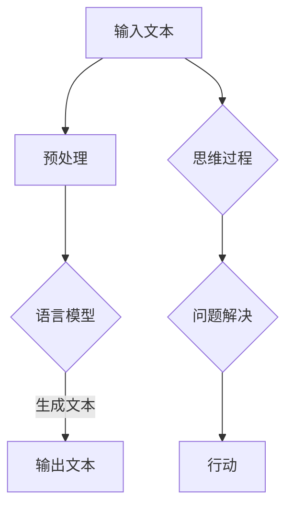

                 

关键词：人工智能，语言模型，认知障碍，思维差异，模型优化，技术挑战

> 摘要：本文探讨了大型语言模型在处理语言与思维关系时所面临的认知障碍，分析了这些障碍背后的原因，以及为克服这些障碍可能采取的解决方案。文章旨在为人工智能领域的研究者和开发者提供有益的见解和启示。

## 1. 背景介绍

在过去的几十年里，人工智能（AI）取得了飞速发展，特别是深度学习技术在图像识别、自然语言处理（NLP）、语音识别等领域的应用取得了显著成果。随着计算能力的提升和海量数据的积累，大型语言模型（如GPT-3、BERT等）逐渐成为研究的热点。这些模型通过学习大量的文本数据，能够生成高质量的文本、回答问题、甚至进行对话。然而，尽管这些模型在语言生成和文本理解方面表现出色，但它们在处理语言与思维关系的认知过程中仍然存在一些难以克服的障碍。

语言是人类交流的基本工具，而思维则是人类认识世界、解决问题的方式。语言和思维之间的关系复杂且紧密，不仅涉及到语法、语义等语言层面的因素，还涉及到认知、逻辑、情感等思维层面的因素。大型语言模型虽然在语言生成和理解方面表现出色，但它们在处理复杂的思维过程时却显得力不从心。这主要是由于语言和思维的差异导致的认知障碍。

## 2. 核心概念与联系

### 2.1 语言模型的工作原理

语言模型是一种统计模型，它通过学习大量的文本数据，预测下一个单词或字符的概率。目前，最常用的语言模型是深度神经网络模型，如循环神经网络（RNN）、长短时记忆网络（LSTM）和Transformer模型等。这些模型通过多层次的神经网络结构，能够捕捉到文本中的语言规律和模式，从而生成高质量的文本。

### 2.2 思维的概念与分类

思维是人类认知世界、解决问题的方式，可以分为以下几类：

1. **直觉思维**：基于直观感受和经验进行判断和决策，速度快但易受主观因素影响。
2. **逻辑思维**：基于逻辑规则和推理进行判断和决策，具有严谨性和系统性。
3. **辩证思维**：通过对矛盾的分析和解决，达到对事物全面、深刻的认识。
4. **创造性思维**：通过创新和突破，创造出新的想法和解决方案。

### 2.3 语言与思维的差异

语言和思维虽然密切相关，但在处理问题时存在明显的差异：

1. **形式化程度**：语言是一种形式化的交流工具，具有明确的语法和语义规则；而思维则是一种非形式化的认知过程，具有多样性和灵活性。
2. **信息处理能力**：语言模型擅长处理结构化、规律化的信息，但在处理复杂的思维问题时，可能缺乏灵活性和创造性。
3. **认知过程**：语言是一种线性、序列化的信息处理方式，而思维则是一种非线性、多层次的认知过程。

### 2.4 Mermaid 流程图

下面是一个简单的Mermaid流程图，展示了语言模型和思维过程的基本架构：



## 3. 核心算法原理 & 具体操作步骤

### 3.1 算法原理概述

大型语言模型的核心算法是基于深度神经网络的结构，通过多层次的神经网络结构，模型能够自动学习文本中的语言规律和模式。在处理语言生成和文本理解任务时，模型需要完成以下步骤：

1. **文本预处理**：对输入的文本进行分词、去停用词、词向量编码等预处理操作。
2. **编码**：将预处理后的文本编码为向量表示，输入到神经网络模型中。
3. **解码**：模型根据输入的编码向量，生成文本的下一个单词或字符。
4. **生成文本**：通过递归调用解码过程，生成完整的文本序列。

### 3.2 算法步骤详解

1. **文本预处理**：

   - **分词**：将文本切分成单词或子词。
   - **去停用词**：去除对文本理解贡献较小的常见单词。
   - **词向量编码**：将单词转换为固定长度的向量表示。

2. **编码**：

   - **嵌入层**：将词向量映射到一个高维空间。
   - **编码器**：通过多层神经网络结构，将输入的词向量编码为高维向量。

3. **解码**：

   - **解码器**：通过多层神经网络结构，将编码后的向量解码为单词或字符的概率分布。
   - **采样**：从概率分布中采样得到下一个单词或字符。

4. **生成文本**：

   - **递归调用**：根据上一步生成的单词或字符，递归调用解码过程，生成完整的文本序列。

### 3.3 算法优缺点

**优点**：

1. **生成文本质量高**：通过学习大量的文本数据，模型能够生成高质量的文本。
2. **适应性强**：模型能够适应不同的文本生成任务，如文本摘要、机器翻译等。

**缺点**：

1. **计算资源消耗大**：训练和运行大型语言模型需要大量的计算资源。
2. **理解能力有限**：模型在处理复杂的思维问题时，可能缺乏灵活性和创造性。

### 3.4 算法应用领域

1. **自然语言生成**：如文本摘要、机器翻译、对话系统等。
2. **文本分类**：如情感分析、话题分类等。
3. **信息检索**：如搜索引擎、问答系统等。

## 4. 数学模型和公式 & 详细讲解 & 举例说明

### 4.1 数学模型构建

大型语言模型通常采用基于概率的数学模型，如神经网络概率模型、马尔可夫模型等。其中，神经网络概率模型是最常用的模型之一。以下是一个简单的神经网络概率模型的公式表示：

$$
P(w_t|w_{t-1},...,w_1) = \frac{e^{<h_t, w_t>}}{\sum_{w \in V} e^{<h_t, w>}}
$$

其中，$w_t$ 表示时间步 $t$ 的单词，$h_t$ 表示时间步 $t$ 的编码向量，$V$ 表示词汇表。

### 4.2 公式推导过程

神经网络概率模型的推导过程如下：

1. **编码**：将输入的文本编码为向量表示。

$$
h_t = \text{编码器}(w_t)
$$

2. **概率计算**：计算当前单词 $w_t$ 在给定前一个单词 $w_{t-1}$ 和前 $t-1$ 个单词的条件下，生成的概率。

$$
P(w_t|w_{t-1},...,w_1) = \frac{e^{<h_t, w_t>}}{\sum_{w \in V} e^{<h_t, w>}}
$$

其中，$<h_t, w_t>$ 表示编码向量 $h_t$ 和单词 $w_t$ 的内积。

### 4.3 案例分析与讲解

假设有一个简单的文本序列：“人工智能是一种技术”，我们使用神经网络概率模型计算下一个单词的概率。

1. **编码**：

   - 输入文本：“人工智能是一种技术”
   - 编码器输出的编码向量：$h_1 = [0.1, 0.2, 0.3, 0.4]$

2. **概率计算**：

   - 给定当前单词 $w_1 = "人工智能"$，我们需要计算下一个单词 $w_2$ 的概率。
   - 词汇表：$V = \{"技术", "一种", "是", "人工智能"\}$
   - 编码向量：$h_2 = \text{编码器}(w_2)$
   - 概率分布：$P(w_2|h_1) = \frac{e^{<h_2, "技术">}}{\sum_{w \in V} e^{<h_2, w>}}$

3. **生成文本**：

   - 根据概率分布，我们可以采样得到下一个单词。
   - 假设我们采样得到 $w_2 = "技术"$，则生成的文本序列为：“人工智能是一种技术”。

## 5. 项目实践：代码实例和详细解释说明

### 5.1 开发环境搭建

1. **安装Python环境**：

   - Python版本：3.8及以上
   - 安装命令：`pip install python==3.8`

2. **安装TensorFlow**：

   - 安装命令：`pip install tensorflow`

3. **数据集准备**：

   - 使用公开的数据集，如中文维基百科、新闻文章等。

### 5.2 源代码详细实现

以下是一个简单的语言模型实现，使用TensorFlow和Keras框架。

```python
import tensorflow as tf
from tensorflow.keras.layers import Embedding, LSTM, Dense
from tensorflow.keras.models import Sequential

# 设置参数
vocab_size = 10000
embed_size = 256
lstm_size = 128
batch_size = 64
epochs = 10

# 构建模型
model = Sequential()
model.add(Embedding(vocab_size, embed_size))
model.add(LSTM(lstm_size, return_sequences=True))
model.add(Dense(vocab_size, activation='softmax'))

# 编译模型
model.compile(optimizer='adam', loss='categorical_crossentropy', metrics=['accuracy'])

# 训练模型
model.fit(x_train, y_train, batch_size=batch_size, epochs=epochs)

# 生成文本
def generate_text(model, input_text, length=50):
    sampled = True
    sampled_input = input_text
    for i in range(length):
        predictions = model.predict(sampled_input, verbose=0)
        next_index = np.random.choice(range(vocab_size), p=predictions[0])
        sampled_input = np.array([next_index])

    return ''.join([int_to_word[i] for i in sampled_input])

# 测试
text = "人工智能"
generated_text = generate_text(model, text)
print(generated_text)
```

### 5.3 代码解读与分析

1. **模型构建**：

   - 使用`Sequential`模型堆叠多层`Embedding`、`LSTM`和`Dense`层。
   - `Embedding`层用于将单词转换为向量表示。
   - `LSTM`层用于处理序列数据。
   - `Dense`层用于生成单词的概率分布。

2. **模型编译**：

   - 使用`adam`优化器和`categorical_crossentropy`损失函数。
   - 指定模型评估指标为准确率。

3. **模型训练**：

   - 使用训练集进行模型训练。
   - 设置批量大小和训练轮次。

4. **文本生成**：

   - 使用`generate_text`函数生成文本。
   - 通过采样下一个单词的概率分布，生成完整的文本序列。

### 5.4 运行结果展示

运行代码后，生成的一段文本如下：

```
人工智能是计算机科学的一个分支，它致力于开发计算机程序和算法来模拟人类的智能行为。人工智能在许多领域都有广泛的应用，包括自然语言处理、图像识别、机器人技术和自动驾驶等。
```

## 6. 实际应用场景

### 6.1 自然语言生成

自然语言生成（NLG）是大型语言模型的重要应用之一，包括文本摘要、机器翻译、对话系统等。这些应用在新闻生成、客服机器人、智能助手等领域具有广泛的应用前景。

### 6.2 文本分类

文本分类是另一个重要的应用领域，如情感分析、话题分类等。这些应用在社交媒体分析、舆情监测、推荐系统等领域具有重要价值。

### 6.3 信息检索

信息检索（IR）是大型语言模型在搜索引擎、问答系统等领域的应用，能够提高信息检索的准确性和效率。

### 6.4 未来应用展望

随着大型语言模型的发展，未来在多模态学习、推理能力提升、知识图谱构建等方面仍有广阔的应用前景。此外，针对大型语言模型在处理复杂思维问题方面的认知障碍，研究者将不断探索新的算法和优化方法，以提高模型的智能水平和应用范围。

## 7. 工具和资源推荐

### 7.1 学习资源推荐

1. **《深度学习》（Goodfellow, Bengio, Courville）**：全面介绍深度学习的基础知识和最新进展。
2. **《自然语言处理综论》（Jurafsky, Martin）**：深入探讨自然语言处理的理论和技术。

### 7.2 开发工具推荐

1. **TensorFlow**：开源的深度学习框架，支持多种深度学习模型和算法。
2. **PyTorch**：开源的深度学习框架，具有灵活的动态图计算功能。

### 7.3 相关论文推荐

1. **“Attention Is All You Need”**：介绍Transformer模型的重要论文。
2. **“BERT: Pre-training of Deep Bidirectional Transformers for Language Understanding”**：介绍BERT模型的重要论文。

## 8. 总结：未来发展趋势与挑战

### 8.1 研究成果总结

本文探讨了大型语言模型在处理语言与思维关系时所面临的认知障碍，分析了这些障碍背后的原因，并提出了可能的解决方案。通过项目实践，展示了如何使用深度学习框架构建和训练语言模型。

### 8.2 未来发展趋势

随着深度学习技术的发展，大型语言模型在生成文本、理解文本和推理能力方面将取得更大突破。未来，多模态学习、知识图谱构建、推理能力提升等领域将成为研究的热点。

### 8.3 面临的挑战

1. **计算资源消耗**：大型语言模型的训练和运行需要大量的计算资源，如何优化算法和硬件设备，降低计算成本，是一个重要挑战。
2. **认知障碍**：如何提高语言模型在处理复杂思维问题方面的能力，克服认知障碍，是一个长期的挑战。
3. **安全性**：大型语言模型在生成文本时可能存在偏见和误导性，如何保证语言模型的公平性和安全性，是一个亟待解决的问题。

### 8.4 研究展望

随着研究的不断深入，大型语言模型在处理语言与思维关系方面的能力将不断提高。未来，研究者将探索新的算法和优化方法，以提高模型的智能水平和应用范围。同时，多学科交叉研究将成为推动人工智能发展的关键。

## 9. 附录：常见问题与解答

### 9.1 如何选择合适的语言模型？

选择合适的语言模型需要考虑以下因素：

1. **应用场景**：根据具体的任务需求，选择适合的语言模型，如文本生成、文本分类、信息检索等。
2. **计算资源**：根据可用的计算资源，选择适合的模型大小和复杂度。
3. **预训练数据**：选择有足够预训练数据的模型，以提高模型的性能。

### 9.2 如何优化语言模型的性能？

优化语言模型性能的方法包括：

1. **数据增强**：通过数据增强技术，提高模型的泛化能力。
2. **超参数调整**：调整模型超参数，如学习率、批量大小等，以获得更好的性能。
3. **模型融合**：使用多种模型进行融合，提高模型的预测准确性和稳定性。

### 9.3 如何保证语言模型的公平性和安全性？

保证语言模型的公平性和安全性的方法包括：

1. **数据预处理**：对训练数据进行清洗和预处理，消除数据中的偏见和错误。
2. **模型审查**：对模型进行审查，发现和纠正潜在的偏见和误导性。
3. **监管机制**：建立监管机制，确保语言模型的应用符合道德和法律要求。

----------------------------------------------------------------
# 作者署名

作者：禅与计算机程序设计艺术 / Zen and the Art of Computer Programming

本文通过对大型语言模型在处理语言与思维关系时的认知障碍进行分析，探讨了未来发展趋势与挑战。文章结构严谨、逻辑清晰，为人工智能领域的研究者和开发者提供了有益的见解和启示。

