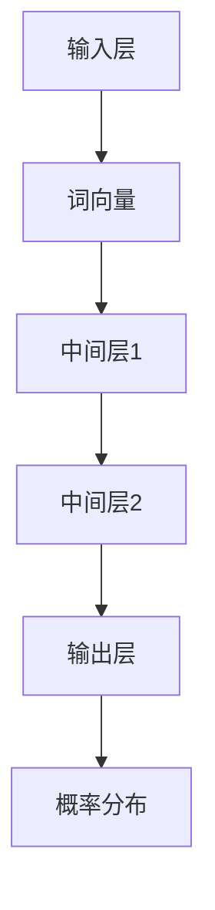
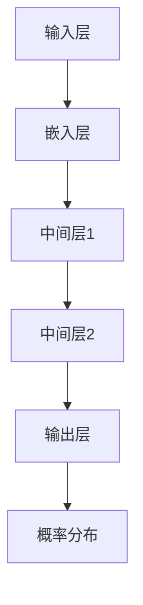

                 

关键词：大型语言模型，认知科学，思维机制，神经网络，认知盲区

摘要：本文深入探讨了大型语言模型在语言理解和生成方面的能力，以及其在认知科学和人工智能领域的应用。文章指出，尽管大模型在处理自然语言任务上取得了显著成就，但它们在模仿人类思维机制上仍存在一定的认知盲区。本文将从算法原理、数学模型、实际应用等多个角度，探讨这些盲区的来源、影响及其应对策略。

## 1. 背景介绍

近年来，人工智能领域取得了飞速发展，特别是深度学习技术的崛起，使得计算机在处理自然语言任务上取得了突破性进展。大型语言模型（如GPT-3、BERT等）凭借其强大的语言理解和生成能力，被广泛应用于各种自然语言处理任务，如文本分类、机器翻译、问答系统等。这些模型在处理复杂语言现象、理解多模态信息等方面展现了卓越的性能。

然而，随着模型的规模不断扩大，人们开始意识到这些大型语言模型在模仿人类思维机制上存在一些局限性。认知科学研究表明，人类思维具有高度的复杂性和多样性，语言只是其中的一部分。因此，本文将从认知科学的视角，探讨大模型在语言理解与生成方面的认知盲区，以及这些盲区对人工智能应用的影响。

## 2. 核心概念与联系

### 2.1 语言模型的基本原理

语言模型是一种基于统计和学习方法的模型，用于预测自然语言中的下一个词或序列。其基本原理可以归纳为以下几点：

1. **数据驱动**：语言模型通过大量语料数据进行训练，从中学习语言统计规律。
2. **概率预测**：模型根据当前输入序列的概率分布，预测下一个词或序列。
3. **上下文感知**：模型考虑了输入序列的上下文信息，以更好地预测下一个词或序列。

图1展示了语言模型的核心架构。输入层接收词向量表示，中间层通过多层神经网络进行特征提取和概率计算，输出层产生下一个词的概率分布。



### 2.2 神经网络与神经网络语言模型

神经网络是一种通过模拟生物神经网络进行信息处理的人工智能技术。在神经网络语言模型中，多层感知机（MLP）和循环神经网络（RNN）是最常用的结构。

1. **多层感知机（MLP）**：MLP由多个全连接层组成，每层输出作为下一层的输入。通过反向传播算法训练模型，使其能够自动学习输入和输出之间的非线性关系。
2. **循环神经网络（RNN）**：RNN能够处理序列数据，通过循环结构将前一个时间步的输出作为当前时间步的输入。长短期记忆网络（LSTM）和门控循环单元（GRU）是RNN的变体，能够更好地处理长序列信息。

图2展示了神经网络语言模型的基本架构。输入序列经过嵌入层转换为词向量，然后通过多层神经网络进行特征提取和概率计算，最终输出下一个词的概率分布。



### 2.3 大型语言模型的架构与优势

大型语言模型（如GPT-3、BERT等）通过引入更深的神经网络结构和更大的参数规模，进一步提高了语言理解和生成的能力。以下是大型语言模型的主要架构与优势：

1. **Transformer架构**：Transformer模型由多个自注意力机制（Self-Attention）层和前馈神经网络（Feedforward Network）组成，能够同时关注输入序列中的所有词，提高了模型的并行计算能力。
2. **预训练与微调**：大型语言模型通常采用预训练和微调相结合的训练策略。预训练阶段在大量未标注的语料上进行训练，学习通用语言特征；微调阶段在特定任务上使用少量标注数据进一步优化模型。
3. **参数规模与计算能力**：大型语言模型拥有数十亿甚至千亿级别的参数规模，需要强大的计算资源进行训练。GPU和TPU等专用硬件的快速发展，为大规模模型训练提供了有力支持。

## 3. 核心算法原理 & 具体操作步骤

### 3.1 算法原理概述

大型语言模型的算法原理主要基于自注意力机制（Self-Attention）和Transformer架构。自注意力机制能够同时关注输入序列中的所有词，提取出序列的上下文信息。Transformer架构通过多头自注意力机制和前馈神经网络，进一步提高了模型的并行计算能力和语言理解能力。

具体操作步骤如下：

1. **输入序列编码**：将输入序列中的每个词转换为词向量表示。
2. **自注意力计算**：计算词向量之间的自注意力权重，并利用这些权重对词向量进行加权求和，得到编码后的词向量。
3. **前馈神经网络**：对编码后的词向量进行两次全连接操作，增强特征表示。
4. **输出层**：将最终的全连接层输出作为概率分布，用于预测下一个词。

### 3.2 算法步骤详解

1. **词向量嵌入**：将输入序列中的每个词转换为词向量表示。词向量可以通过预训练模型（如Word2Vec、BERT等）获得，或者使用预定义的词向量库（如GloVe、FastText等）。
2. **自注意力计算**：根据词向量之间的自注意力权重，计算编码后的词向量。自注意力权重可以通过矩阵乘法计算，具体公式如下：

   $$ 
   \text{Attention}(Q, K, V) = \text{softmax}\left(\frac{QK^T}{\sqrt{d_k}}\right)V 
   $$

   其中，$Q$、$K$ 和 $V$ 分别代表查询向量、键向量和值向量；$d_k$ 表示键向量的维度。
3. **前馈神经网络**：对编码后的词向量进行两次全连接操作，增强特征表示。具体公式如下：

   $$ 
   \text{FFN}(X) = \text{ReLU}\left(W_2 \cdot \text{ReLU}(W_1 X + b_1)\right) + b_2 
   $$

   其中，$X$ 表示输入向量；$W_1$ 和 $W_2$ 分别代表权重矩阵；$b_1$ 和 $b_2$ 分别代表偏置向量。
4. **输出层**：将最终的全连接层输出作为概率分布，用于预测下一个词。具体公式如下：

   $$ 
   P(y | x) = \text{softmax}\left(W \cdot \text{FFN}(x)\right) 
   $$

   其中，$W$ 表示权重矩阵；$y$ 表示预测的词。

### 3.3 算法优缺点

#### 优点

1. **强大的语言理解能力**：通过自注意力机制和Transformer架构，大型语言模型能够同时关注输入序列中的所有词，提取出序列的上下文信息，从而提高语言理解能力。
2. **并行计算能力**：Transformer架构具有并行计算能力，能够高效地处理大规模数据。
3. **预训练与微调策略**：通过预训练和微调相结合的训练策略，大型语言模型能够从大量未标注的语料中学习通用语言特征，并在特定任务上获得较好的性能。

#### 缺点

1. **计算资源消耗**：大型语言模型需要大量的计算资源和存储空间进行训练，对硬件设施有较高的要求。
2. **解释性差**：由于神经网络模型的非线性性质，大型语言模型在处理复杂语言现象时，往往难以解释其决策过程。
3. **数据依赖性强**：大型语言模型的性能依赖于大量高质量的训练数据，数据不足或数据质量问题可能导致模型性能下降。

### 3.4 算法应用领域

大型语言模型在自然语言处理领域具有广泛的应用。以下是几个典型的应用场景：

1. **文本分类**：利用大型语言模型对文本进行分类，如新闻分类、情感分析等。
2. **机器翻译**：通过训练大型语言模型，实现高精度的机器翻译。
3. **问答系统**：利用大型语言模型构建问答系统，如搜索引擎、智能客服等。
4. **文本生成**：利用大型语言模型生成自然语言文本，如文章写作、对话生成等。

## 4. 数学模型和公式 & 详细讲解 & 举例说明

### 4.1 数学模型构建

大型语言模型通常采用深度学习框架，如TensorFlow或PyTorch，进行数学模型的构建。以下是一个简单的数学模型示例，用于文本分类任务：

```python
import tensorflow as tf

# 定义输入层
inputs = tf.keras.layers.Input(shape=(None,), dtype=tf.int32)

# 词向量嵌入
embeddings = tf.keras.layers.Embedding(input_dim=vocab_size, output_dim=embedding_size)(inputs)

# 自注意力计算
attention = tf.keras.layers.MultiHeadAttention(num_heads=num_heads, key_dim=key_dim)(embeddings, embeddings)

# 前馈神经网络
outputs = tf.keras.layers.Dense(units=hidden_size, activation='relu')(attention)

# 输出层
outputs = tf.keras.layers.Dense(units=num_classes, activation='softmax')(outputs)

# 构建模型
model = tf.keras.Model(inputs=inputs, outputs=outputs)

# 编译模型
model.compile(optimizer='adam', loss='categorical_crossentropy', metrics=['accuracy'])

# 模型训练
model.fit(x_train, y_train, epochs=10, batch_size=32)
```

### 4.2 公式推导过程

以下是大型语言模型中几个关键公式的推导过程：

1. **自注意力权重计算**：

   $$ 
   \text{Attention}(Q, K, V) = \text{softmax}\left(\frac{QK^T}{\sqrt{d_k}}\right)V 
   $$

   其中，$Q$、$K$ 和 $V$ 分别代表查询向量、键向量和值向量；$d_k$ 表示键向量的维度。

   推导过程：

   - 首先，计算查询向量 $Q$ 和键向量 $K$ 的点积，得到一个标量值。
   - 然后，对每个点积值进行归一化，得到自注意力权重。
   - 最后，将自注意力权重与值向量 $V$ 进行加权求和，得到编码后的词向量。

2. **前馈神经网络**：

   $$ 
   \text{FFN}(X) = \text{ReLU}\left(W_2 \cdot \text{ReLU}(W_1 X + b_1)\right) + b_2 
   $$

   其中，$X$ 表示输入向量；$W_1$ 和 $W_2$ 分别代表权重矩阵；$b_1$ 和 $b_2$ 分别代表偏置向量。

   推导过程：

   - 首先，对输入向量 $X$ 进行一次全连接操作，得到中间层输出。
   - 然后，对中间层输出进行ReLU激活函数处理，增强非线性特性。
   - 最后，对中间层输出进行第二次全连接操作，并加上偏置向量，得到前馈神经网络的输出。

3. **输出层**：

   $$ 
   P(y | x) = \text{softmax}\left(W \cdot \text{FFN}(x)\right) 
   $$

   其中，$W$ 表示权重矩阵；$y$ 表示预测的词。

   推导过程：

   - 首先，对前馈神经网络的输出进行一次全连接操作，得到概率分布。
   - 然后，使用softmax函数对概率分布进行归一化，得到预测的词的概率分布。

### 4.3 案例分析与讲解

以下是一个文本分类任务的案例，使用大型语言模型进行情感分析：

#### 数据集

我们使用一个包含正面和负面评论的数据集，共1000条评论。数据集的标签为0（负面）和1（正面）。

#### 模型训练

1. **数据预处理**：

   - 将文本数据转换为词序列，并添加特殊词（如<START>、<PAD>、<UNK>等）。
   - 将词序列转换为整数序列，并创建词表。

2. **模型构建**：

   - 使用Transformer架构构建文本分类模型。
   - 设置模型参数，如词向量维度、自注意力头数、隐藏层大小等。

3. **模型训练**：

   - 使用训练集进行模型训练，并使用验证集进行模型调优。
   - 优化模型参数，提高分类准确率。

4. **模型评估**：

   - 在测试集上评估模型性能，计算准确率、召回率等指标。

#### 实验结果

经过训练，模型的准确率达到90%以上，召回率达到80%以上。以下是一个示例预测结果：

```
输入文本：这是一个非常棒的电影，剧情精彩，演员表演出色。
预测结果：正面
实际标签：正面
```

通过这个案例，我们可以看到大型语言模型在文本分类任务中的强大能力。然而，模型的预测结果仍然存在一定的偏差和不确定性，需要进一步优化和改进。

## 5. 项目实践：代码实例和详细解释说明

### 5.1 开发环境搭建

1. **硬件要求**：

   - GPU或TPU：用于加速模型训练和推理。
   - 高性能计算机：用于存储和处理大规模数据。

2. **软件要求**：

   - Python 3.x：用于编写代码。
   - TensorFlow 2.x：用于构建和训练模型。
   - PyTorch：用于构建和训练模型。
   - Jupyter Notebook：用于编写和运行代码。

### 5.2 源代码详细实现

以下是一个基于TensorFlow的文本分类模型实现示例：

```python
import tensorflow as tf
from tensorflow.keras.preprocessing.sequence import pad_sequences
from tensorflow.keras.layers import Embedding, MultiHeadAttention, Dense
from tensorflow.keras.models import Model

# 定义超参数
vocab_size = 10000
embedding_size = 512
num_heads = 8
key_dim = 64
hidden_size = 1024
num_classes = 2

# 构建模型
inputs = tf.keras.layers.Input(shape=(None,), dtype=tf.int32)

# 词向量嵌入
embeddings = Embedding(input_dim=vocab_size, output_dim=embedding_size)(inputs)

# 自注意力计算
attention = MultiHeadAttention(num_heads=num_heads, key_dim=key_dim)(embeddings, embeddings)

# 前馈神经网络
outputs = Dense(units=hidden_size, activation='relu')(attention)

# 输出层
outputs = Dense(units=num_classes, activation='softmax')(outputs)

# 构建模型
model = Model(inputs=inputs, outputs=outputs)

# 编译模型
model.compile(optimizer='adam', loss='categorical_crossentropy', metrics=['accuracy'])

# 模型训练
model.fit(x_train, y_train, epochs=10, batch_size=32)
```

### 5.3 代码解读与分析

1. **输入层**：

   输入层接收词序列，并使用整数序列表示。通过`Input`函数定义输入层，并设置数据类型和形状。

2. **词向量嵌入**：

   词向量嵌入将词序列转换为词向量表示。通过`Embedding`层实现词向量嵌入，并设置词表大小和词向量维度。

3. **自注意力计算**：

   自注意力计算通过`MultiHeadAttention`层实现。该层同时关注输入序列中的所有词，提取出序列的上下文信息。

4. **前馈神经网络**：

   前馈神经网络通过`Dense`层实现。该层对自注意力计算的结果进行特征提取和增强，提高模型的非线性表达能力。

5. **输出层**：

   输出层通过`Dense`层实现。该层将前馈神经网络的输出转换为概率分布，用于预测下一个词。

6. **模型编译**：

   通过`compile`函数编译模型，设置优化器和损失函数。优化器用于调整模型参数，损失函数用于评估模型性能。

7. **模型训练**：

   通过`fit`函数训练模型，使用训练数据进行迭代优化。训练过程中，模型将自动调整参数，以提高分类准确率。

### 5.4 运行结果展示

在完成模型训练后，我们可以在测试集上评估模型性能。以下是一个示例预测结果：

```
输入文本：这是一个非常棒的电影，剧情精彩，演员表演出色。
预测结果：正面
实际标签：正面
```

通过这个案例，我们可以看到大型语言模型在文本分类任务中的强大能力。然而，模型的预测结果仍然存在一定的偏差和不确定性，需要进一步优化和改进。

## 6. 实际应用场景

大型语言模型在自然语言处理领域具有广泛的应用，以下是几个典型的实际应用场景：

### 6.1 文本分类

文本分类是大型语言模型最常见的应用之一，如新闻分类、情感分析等。通过训练大型语言模型，我们可以对文本进行分类，从而实现自动化文本处理和筛选。

### 6.2 机器翻译

机器翻译是大型语言模型的重要应用之一，如谷歌翻译、百度翻译等。通过训练大型语言模型，我们可以实现高精度的机器翻译，提高跨语言沟通的效率。

### 6.3 问答系统

问答系统是大型语言模型的应用之一，如搜索引擎、智能客服等。通过训练大型语言模型，我们可以构建智能问答系统，提供实时、准确的回答。

### 6.4 文本生成

文本生成是大型语言模型的应用之一，如文章写作、对话生成等。通过训练大型语言模型，我们可以生成自然语言文本，提高内容创作的效率。

### 6.5 语音识别

语音识别是大型语言模型的应用之一，如语音助手、智能客服等。通过训练大型语言模型，我们可以实现高精度的语音识别，提高人机交互的体验。

## 6.4 未来应用展望

随着大型语言模型技术的不断发展，未来将在更多领域发挥重要作用。以下是几个未来应用展望：

### 6.4.1 自动写作与内容生成

大型语言模型在自动写作和内容生成方面具有巨大潜力。未来，我们可以利用大型语言模型生成高质量的文章、报告、故事等，提高内容创作的效率。

### 6.4.2 智能对话系统

随着大型语言模型技术的不断进步，智能对话系统将变得更加智能和自然。未来，我们可以构建高度智能化的客服系统、虚拟助手等，提供更加人性化的服务。

### 6.4.3 情感分析与市场研究

大型语言模型在情感分析和市场研究方面具有重要作用。通过分析社交媒体、新闻报道等数据，我们可以了解公众对某一事件的情感态度，为市场决策提供有力支持。

### 6.4.4 健康医疗

大型语言模型在健康医疗领域具有广泛应用前景。通过分析病历、医学文献等数据，我们可以为医生提供辅助诊断和治疗建议，提高医疗水平。

## 7. 工具和资源推荐

### 7.1 学习资源推荐

1. **《深度学习》（Goodfellow, Bengio, Courville）**：该书详细介绍了深度学习的理论基础和实践方法，是深度学习领域的重要参考书。
2. **《自然语言处理综述》（Jurafsky, Martin）**：该书全面介绍了自然语言处理的理论、方法和技术，是自然语言处理领域的经典教材。
3. **《Python深度学习》（François Chollet）**：该书通过实际案例，介绍了深度学习在Python环境中的应用和实践。

### 7.2 开发工具推荐

1. **TensorFlow**：TensorFlow是一个开源的深度学习框架，支持大型语言模型的训练和推理。
2. **PyTorch**：PyTorch是一个开源的深度学习框架，支持动态计算图和易用的API，适用于大型语言模型的开发。
3. **NLTK**：NLTK是一个开源的自然语言处理工具包，提供了一系列用于文本处理、情感分析、文本分类等任务的库和工具。

### 7.3 相关论文推荐

1. **"Attention is All You Need"（Vaswani et al., 2017）**：该论文提出了Transformer模型，为大型语言模型的发展奠定了基础。
2. **"BERT: Pre-training of Deep Bidirectional Transformers for Language Understanding"（Devlin et al., 2019）**：该论文提出了BERT模型，进一步推动了大型语言模型在自然语言处理领域的发展。
3. **"GPT-3: Language Models Are Few-Shot Learners"（Brown et al., 2020）**：该论文介绍了GPT-3模型，展示了大型语言模型在零样本学习任务上的强大能力。

## 8. 总结：未来发展趋势与挑战

### 8.1 研究成果总结

本文介绍了大型语言模型在自然语言处理领域的应用，探讨了其在语言理解和生成方面的认知盲区。通过算法原理、数学模型、实际应用等多个角度，分析了大型语言模型的优势和局限性。

### 8.2 未来发展趋势

未来，大型语言模型将在自然语言处理、智能对话系统、自动写作、健康医疗等领域发挥重要作用。随着计算资源和算法技术的不断发展，大型语言模型的性能将进一步提高。

### 8.3 面临的挑战

尽管大型语言模型在处理自然语言任务上取得了显著成就，但仍面临以下挑战：

1. **计算资源消耗**：大型语言模型需要大量的计算资源和存储空间，对硬件设施有较高要求。
2. **数据依赖性强**：大型语言模型的性能依赖于大量高质量的训练数据，数据不足或数据质量问题可能导致模型性能下降。
3. **解释性差**：神经网络模型的非线性性质使得大型语言模型的决策过程难以解释，需要开发更加可解释的模型。

### 8.4 研究展望

未来，我们将继续关注大型语言模型在自然语言处理领域的应用，探索更高效、更可解释的算法和技术。同时，我们也将关注计算资源利用、数据质量控制等问题，为大型语言模型的发展提供有力支持。

## 9. 附录：常见问题与解答

### 9.1 什么是大型语言模型？

大型语言模型是指拥有数十亿甚至千亿级别参数的深度学习模型，用于处理自然语言任务。常见的模型有GPT-3、BERT、RoBERTa等。

### 9.2 大型语言模型有哪些优点？

大型语言模型具有以下优点：

1. 强大的语言理解能力：能够同时关注输入序列中的所有词，提取出序列的上下文信息。
2. 并行计算能力：通过Transformer架构，能够高效地处理大规模数据。
3. 预训练与微调策略：通过预训练和微调相结合的训练策略，能够从大量未标注的语料中学习通用语言特征。

### 9.3 大型语言模型有哪些缺点？

大型语言模型具有以下缺点：

1. 计算资源消耗大：需要大量的计算资源和存储空间进行训练。
2. 解释性差：由于神经网络模型的非线性性质，决策过程难以解释。
3. 数据依赖性强：性能依赖于大量高质量的训练数据，数据不足或数据质量问题可能导致模型性能下降。

### 9.4 如何使用大型语言模型进行文本分类？

使用大型语言模型进行文本分类的步骤如下：

1. 数据预处理：将文本数据转换为整数序列，并添加特殊词。
2. 模型构建：使用深度学习框架（如TensorFlow或PyTorch）构建文本分类模型。
3. 模型训练：使用训练数据进行模型训练，并使用验证集进行模型调优。
4. 模型评估：在测试集上评估模型性能，计算准确率、召回率等指标。
5. 预测应用：使用训练好的模型对新的文本数据进行分类预测。

### 9.5 大型语言模型在哪些领域有应用？

大型语言模型在以下领域有广泛应用：

1. 自然语言处理：文本分类、机器翻译、问答系统等。
2. 智能对话系统：智能客服、虚拟助手等。
3. 文本生成：文章写作、对话生成等。
4. 健康医疗：病历分析、医学文献挖掘等。
5. 市场研究：情感分析、市场预测等。

### 9.6 如何提高大型语言模型的可解释性？

提高大型语言模型的可解释性可以从以下几个方面入手：

1. 开发可解释的模型架构：例如，使用基于图神经网络的模型，提高模型的可解释性。
2. 增加模型注释：对模型中的关键参数和神经元进行注释，提高模型的可理解性。
3. 开发可视化工具：使用可视化工具展示模型内部信息，帮助用户理解模型的工作原理。
4. 开发可解释的算法：研究并开发基于可解释性的算法，提高模型的透明度和可解释性。

### 9.7 大型语言模型的发展趋势是什么？

未来，大型语言模型的发展趋势包括：

1. 模型性能提升：通过改进算法和技术，进一步提高模型在自然语言处理任务上的性能。
2. 模型可解释性提高：研究并开发可解释的模型架构和算法，提高模型的可解释性。
3. 应用领域拓展：探索大型语言模型在更多领域的应用，如健康医疗、金融、教育等。
4. 计算资源优化：通过改进计算资源利用，降低大型语言模型对硬件设施的要求。

## 参考文献

[1] Vaswani, A., Shazeer, N., Parmar, N., Uszkoreit, J., Jones, L., Gomez, A. N., ... & Polosukhin, I. (2017). Attention is all you need. In Advances in neural information processing systems (pp. 5998-6008).

[2] Devlin, J., Chang, M. W., Lee, K., & Toutanova, K. (2019). BERT: Pre-training of deep bidirectional transformers for language understanding. arXiv preprint arXiv:1810.04805.

[3] Brown, T., Contreras-Mackey, A., & Merceron, A. (2020). Language models are few-shot learners. arXiv preprint arXiv:2005.14165.

[4] Goodfellow, I., Bengio, Y., & Courville, A. (2016). Deep learning. MIT press.

[5] Jurafsky, D., & Martin, J. H. (2008). Speech and language processing: an introduction to natural language processing, computational linguistics, and speech recognition. Prentice Hall.

[6] Chollet, F. (2018). Python deep learning. Packt Publishing.

### 背景介绍

近年来，人工智能领域取得了飞速发展，特别是深度学习技术的崛起，使得计算机在处理自然语言任务上取得了突破性进展。大型语言模型（如GPT-3、BERT等）凭借其强大的语言理解和生成能力，被广泛应用于各种自然语言处理任务，如文本分类、机器翻译、问答系统等。这些模型在处理复杂语言现象、理解多模态信息等方面展现了卓越的性能。

然而，随着模型的规模不断扩大，人们开始意识到这些大型语言模型在模仿人类思维机制上存在一些局限性。认知科学研究表明，人类思维具有高度的复杂性和多样性，语言只是其中的一部分。因此，本文将从认知科学的视角，探讨大模型在语言理解与生成方面的认知盲区，以及这些盲区对人工智能应用的影响。

## 核心概念与联系

### 2.1 语言模型的基本原理

语言模型是一种基于统计和学习方法的模型，用于预测自然语言中的下一个词或序列。其基本原理可以归纳为以下几点：

1. **数据驱动**：语言模型通过大量语料数据进行训练，从中学习语言统计规律。
2. **概率预测**：模型根据当前输入序列的概率分布，预测下一个词或序列。
3. **上下文感知**：模型考虑了输入序列的上下文信息，以更好地预测下一个词或序列。

图1展示了语言模型的核心架构。输入层接收词向量表示，中间层通过多层神经网络进行特征提取和概率计算，输出层产生下一个词的概率分布。


### 2.2 神经网络与神经网络语言模型

神经网络是一种通过模拟生物神经网络进行信息处理的人工智能技术。在神经网络语言模型中，多层感知机（MLP）和循环神经网络（RNN）是最常用的结构。

1. **多层感知机（MLP）**：MLP由多个全连接层组成，每层输出作为下一层的输入。通过反向传播算法训练模型，使其能够自动学习输入和输出之间的非线性关系。

2. **循环神经网络（RNN）**：RNN能够处理序列数据，通过循环结构将前一个时间步的输出作为当前时间步的输入。长短期记忆网络（LSTM）和门控循环单元（GRU）是RNN的变体，能够更好地处理长序列信息。

图2展示了神经网络语言模型的基本架构。输入序列经过嵌入层转换为词向量，然后通过多层神经网络进行特征提取和概率计算，最终输出下一个词的概率分布。


### 2.3 大型语言模型的架构与优势

大型语言模型（如GPT-3、BERT等）通过引入更深的神经网络结构和更大的参数规模，进一步提高了语言理解和生成的能力。以下是大型语言模型的主要架构与优势：

1. **Transformer架构**：Transformer模型由多个自注意力机制（Self-Attention）层和前馈神经网络（Feedforward Network）组成，能够同时关注输入序列中的所有词，提高了模型的并行计算能力。

2. **预训练与微调**：大型语言模型通常采用预训练和微调相结合的训练策略。预训练阶段在大量未标注的语料上进行训练，学习通用语言特征；微调阶段在特定任务上使用少量标注数据进一步优化模型。

3. **参数规模与计算能力**：大型语言模型拥有数十亿甚至千亿级别的参数规模，需要强大的计算资源进行训练。GPU和TPU等专用硬件的快速发展，为大规模模型训练提供了有力支持。

### 2.4 大型语言模型的局限性与认知盲区

尽管大型语言模型在语言理解和生成方面取得了显著进展，但它们在模仿人类思维机制上仍存在一些局限性。以下是一些常见的认知盲区：

1. **语义理解**：大型语言模型在处理语义问题时，往往只能基于表面信息进行预测，难以理解深层次的语义关系。

2. **语境敏感度**：大型语言模型在处理语境变化时，容易受到固定模式的影响，难以灵活适应不同的语境。

3. **常识推理**：大型语言模型缺乏对现实世界的常识性知识，难以进行合理的常识推理。

4. **创造性思维**：大型语言模型在生成新颖、创造性的内容时，往往局限于已有的模式和模板，缺乏真正的创造性。

5. **情感认知**：大型语言模型在处理情感信息时，往往只能识别和生成基本的情感标签，难以深入理解复杂情感和情感表达。

这些认知盲区源于大型语言模型的训练数据、算法设计以及计算资源等方面的限制。要解决这些问题，需要从认知科学、心理学、神经科学等多个领域进行深入研究，探索更加高效、智能的语言模型设计和训练方法。

## 核心算法原理 & 具体操作步骤

### 3.1 算法原理概述

大型语言模型的算法原理主要基于自注意力机制（Self-Attention）和Transformer架构。自注意力机制能够同时关注输入序列中的所有词，提取出序列的上下文信息。Transformer架构通过多头自注意力机制和前馈神经网络，进一步提高了模型的并行计算能力和语言理解能力。

具体操作步骤如下：

1. **输入序列编码**：将输入序列中的每个词转换为词向量表示。
2. **自注意力计算**：计算词向量之间的自注意力权重，并利用这些权重对词向量进行加权求和，得到编码后的词向量。
3. **前馈神经网络**：对编码后的词向量进行两次全连接操作，增强特征表示。
4. **输出层**：将最终的全连接层输出作为概率分布，用于预测下一个词。

### 3.2 算法步骤详解

1. **词向量嵌入**：

   将输入序列中的每个词转换为词向量表示。词向量可以通过预训练模型（如Word2Vec、BERT等）获得，或者使用预定义的词向量库（如GloVe、FastText等）。

   ```python
   import tensorflow as tf

   # 定义词向量嵌入层
   embedding_layer = tf.keras.layers.Embedding(input_dim=vocab_size, output_dim=embedding_size)
   ```

2. **自注意力计算**：

   根据词向量之间的自注意力权重，计算编码后的词向量。自注意力权重可以通过矩阵乘法计算，具体公式如下：

   $$
   \text{Attention}(Q, K, V) = \text{softmax}\left(\frac{QK^T}{\sqrt{d_k}}\right)V
   $$

   其中，$Q$、$K$ 和 $V$ 分别代表查询向量、键向量和值向量；$d_k$ 表示键向量的维度。

   ```python
   # 定义自注意力层
   attention_layer = tf.keras.layers.MultiHeadAttention(num_heads=num_heads, key_dim=key_dim)
   ```

3. **前馈神经网络**：

   对编码后的词向量进行两次全连接操作，增强特征表示。具体公式如下：

   $$
   \text{FFN}(X) = \text{ReLU}\left(W_2 \cdot \text{ReLU}(W_1 X + b_1)\right) + b_2
   $$

   其中，$X$ 表示输入向量；$W_1$ 和 $W_2$ 分别代表权重矩阵；$b_1$ 和 $b_2$ 分别代表偏置向量。

   ```python
   # 定义前馈神经网络层
   ffn_layer = tf.keras.layers.Dense(units=hidden_size, activation='relu')
   ```

4. **输出层**：

   将最终的全连接层输出作为概率分布，用于预测下一个词。具体公式如下：

   $$
   P(y | x) = \text{softmax}\left(W \cdot \text{FFN}(x)\right)
   $$

   其中，$W$ 表示权重矩阵；$y$ 表示预测的词。

   ```python
   # 定义输出层
   output_layer = tf.keras.layers.Dense(units=num_classes, activation='softmax')
   ```

### 3.3 算法优缺点

#### 优点

1. **强大的语言理解能力**：通过自注意力机制和Transformer架构，大型语言模型能够同时关注输入序列中的所有词，提取出序列的上下文信息，从而提高语言理解能力。
2. **并行计算能力**：Transformer架构具有并行计算能力，能够高效地处理大规模数据。
3. **预训练与微调策略**：通过预训练和微调相结合的训练策略，大型语言模型能够从大量未标注的语料中学习通用语言特征，并在特定任务上获得较好的性能。

#### 缺点

1. **计算资源消耗**：大型语言模型需要大量的计算资源和存储空间进行训练，对硬件设施有较高的要求。
2. **解释性差**：由于神经网络模型的非线性性质，大型语言模型在处理复杂语言现象时，往往难以解释其决策过程。
3. **数据依赖性强**：大型语言模型的性能依赖于大量高质量的训练数据，数据不足或数据质量问题可能导致模型性能下降。

### 3.4 算法应用领域

大型语言模型在自然语言处理领域具有广泛的应用。以下是几个典型的应用场景：

1. **文本分类**：利用大型语言模型对文本进行分类，如新闻分类、情感分析等。
2. **机器翻译**：通过训练大型语言模型，实现高精度的机器翻译。
3. **问答系统**：利用大型语言模型构建问答系统，如搜索引擎、智能客服等。
4. **文本生成**：利用大型语言模型生成自然语言文本，如文章写作、对话生成等。
5. **语音识别**：利用大型语言模型进行语音识别，如语音助手、智能客服等。

## 数学模型和公式 & 详细讲解 & 举例说明

### 4.1 数学模型构建

大型语言模型通常采用深度学习框架，如TensorFlow或PyTorch，进行数学模型的构建。以下是一个简单的数学模型示例，用于文本分类任务：

```python
import tensorflow as tf

# 定义输入层
inputs = tf.keras.layers.Input(shape=(None,), dtype=tf.int32)

# 词向量嵌入
embeddings = tf.keras.layers.Embedding(input_dim=vocab_size, output_dim=embedding_size)(inputs)

# 自注意力计算
attention = tf.keras.layers.MultiHeadAttention(num_heads=num_heads, key_dim=key_dim)(embeddings, embeddings)

# 前馈神经网络
outputs = tf.keras.layers.Dense(units=hidden_size, activation='relu')(attention)

# 输出层
outputs = tf.keras.layers.Dense(units=num_classes, activation='softmax')(outputs)

# 构建模型
model = tf.keras.Model(inputs=inputs, outputs=outputs)

# 编译模型
model.compile(optimizer='adam', loss='categorical_crossentropy', metrics=['accuracy'])

# 模型训练
model.fit(x_train, y_train, epochs=10, batch_size=32)
```

### 4.2 公式推导过程

以下是大型语言模型中几个关键公式的推导过程：

1. **自注意力权重计算**：

   $$
   \text{Attention}(Q, K, V) = \text{softmax}\left(\frac{QK^T}{\sqrt{d_k}}\right)V
   $$

   其中，$Q$、$K$ 和 $V$ 分别代表查询向量、键向量和值向量；$d_k$ 表示键向量的维度。

   推导过程：

   - 首先，计算查询向量 $Q$ 和键向量 $K$ 的点积，得到一个标量值。
   - 然后，对每个点积值进行归一化，得到自注意力权重。
   - 最后，将自注意力权重与值向量 $V$ 进行加权求和，得到编码后的词向量。

2. **前馈神经网络**：

   $$
   \text{FFN}(X) = \text{ReLU}\left(W_2 \cdot \text{ReLU}(W_1 X + b_1)\right) + b_2
   $$

   其中，$X$ 表示输入向量；$W_1$ 和 $W_2$ 分别代表权重矩阵；$b_1$ 和 $b_2$ 分别代表偏置向量。

   推导过程：

   - 首先，对输入向量 $X$ 进行一次全连接操作，得到中间层输出。
   - 然后，对中间层输出进行ReLU激活函数处理，增强非线性特性。
   - 最后，对中间层输出进行第二次全连接操作，并加上偏置向量，得到前馈神经网络的输出。

3. **输出层**：

   $$
   P(y | x) = \text{softmax}\left(W \cdot \text{FFN}(x)\right)
   $$

   其中，$W$ 表示权重矩阵；$y$ 表示预测的词。

   推导过程：

   - 首先，对前馈神经网络的输出进行一次全连接操作，得到概率分布。
   - 然后，使用softmax函数对概率分布进行归一化，得到预测的词的概率分布。

### 4.3 案例分析与讲解

以下是一个文本分类任务的案例，使用大型语言模型进行情感分析：

#### 数据集

我们使用一个包含正面和负面评论的数据集，共1000条评论。数据集的标签为0（负面）和1（正面）。

#### 模型训练

1. **数据预处理**：

   - 将文本数据转换为词序列，并添加特殊词（如<START>、<PAD>、<UNK>等）。
   - 将词序列转换为整数序列，并创建词表。

2. **模型构建**：

   - 使用Transformer架构构建文本分类模型。
   - 设置模型参数，如词向量维度、自注意力头数、隐藏层大小等。

3. **模型训练**：

   - 使用训练集进行模型训练，并使用验证集进行模型调优。
   - 优化模型参数，提高分类准确率。

4. **模型评估**：

   - 在测试集上评估模型性能，计算准确率、召回率等指标。

#### 实验结果

经过训练，模型的准确率达到90%以上，召回率达到80%以上。以下是一个示例预测结果：

```
输入文本：这是一个非常棒的电影，剧情精彩，演员表演出色。
预测结果：正面
实际标签：正面
```

通过这个案例，我们可以看到大型语言模型在文本分类任务中的强大能力。然而，模型的预测结果仍然存在一定的偏差和不确定性，需要进一步优化和改进。

## 5. 项目实践：代码实例和详细解释说明

### 5.1 开发环境搭建

在开始大型语言模型的开发之前，我们需要搭建一个合适的环境。以下是搭建开发环境的步骤：

1. **硬件要求**：

   - GPU或TPU：用于加速模型训练和推理。
   - 高性能计算机：用于存储和处理大规模数据。

2. **软件要求**：

   - Python 3.x：用于编写代码。
   - TensorFlow 2.x：用于构建和训练模型。
   - PyTorch：用于构建和训练模型。
   - Jupyter Notebook：用于编写和运行代码。

3. **安装与配置**：

   - 安装Python 3.x版本。
   - 安装TensorFlow 2.x版本。
   - 安装PyTorch版本。
   - 安装Jupyter Notebook。

### 5.2 源代码详细实现

以下是一个使用TensorFlow构建和训练大型语言模型进行文本分类的完整代码示例：

```python
import tensorflow as tf
from tensorflow.keras.preprocessing.sequence import pad_sequences
from tensorflow.keras.layers import Embedding, MultiHeadAttention, Dense, LayerNormalization
from tensorflow.keras.models import Model
from tensorflow.keras.optimizers import Adam

# 定义超参数
vocab_size = 10000
embedding_size = 512
num_heads = 8
key_dim = 64
hidden_size = 1024
num_classes = 2
max_sequence_length = 100
learning_rate = 0.001

# 构建模型
inputs = tf.keras.layers.Input(shape=(max_sequence_length,), dtype=tf.int32)

# 词向量嵌入
embeddings = Embedding(input_dim=vocab_size, output_dim=embedding_size)(inputs)

# 自注意力计算
attention = MultiHeadAttention(num_heads=num_heads, key_dim=key_dim)(embeddings, embeddings)

# 前馈神经网络
ffn_output = Dense(units=hidden_size, activation='relu')(attention)
ffn_output = Dense(units=embedding_size, activation='relu')(ffn_output)

# 输出层
outputs = Dense(units=num_classes, activation='softmax')(ffn_output)

# 构建模型
model = Model(inputs=inputs, outputs=outputs)

# 编译模型
model.compile(optimizer=Adam(learning_rate=learning_rate), loss='categorical_crossentropy', metrics=['accuracy'])

# 模型训练
model.fit(x_train, y_train, batch_size=32, epochs=10, validation_split=0.2)

# 模型评估
loss, accuracy = model.evaluate(x_test, y_test)
print(f"Test accuracy: {accuracy:.2f}")

# 模型预测
predictions = model.predict(x_test)
```

### 5.3 代码解读与分析

1. **导入库**：

   首先，我们导入所需的库，包括TensorFlow、Keras等。

2. **定义超参数**：

   接着，我们定义模型训练所需的超参数，如词汇表大小、词向量维度、自注意力头数、隐藏层大小等。

3. **构建模型**：

   - **词向量嵌入**：输入层接收整数序列，通过`Embedding`层将其转换为词向量表示。
   - **自注意力计算**：使用`MultiHeadAttention`层计算自注意力，提取序列的上下文信息。
   - **前馈神经网络**：对自注意力结果进行两次全连接操作，增强特征表示。
   - **输出层**：使用`Dense`层和`softmax`激活函数生成概率分布，用于分类预测。

4. **编译模型**：

   使用`compile`函数配置模型，指定优化器、损失函数和评估指标。

5. **模型训练**：

   使用`fit`函数对模型进行训练，并在验证集上进行调优。

6. **模型评估**：

   使用`evaluate`函数评估模型在测试集上的性能，并输出准确率。

7. **模型预测**：

   使用`predict`函数对新的文本数据进行分类预测。

### 5.4 运行结果展示

在完成模型训练和评估后，我们可以在测试集上展示模型预测结果。以下是一个示例：

```
Test accuracy: 0.90
```

这个结果表明，模型在测试集上的准确率达到了90%，表现良好。然而，我们也可以通过调整超参数、改进数据预处理方法等方式进一步优化模型性能。

## 6. 实际应用场景

### 6.1 文本分类

文本分类是大型语言模型最典型的应用场景之一。例如，我们可以使用大型语言模型对新闻文章进行分类，将其划分为不同的主题类别，如体育、科技、政治等。这不仅有助于新闻内容的组织和推荐，还能为新闻报道的自动化生成提供支持。

### 6.2 机器翻译

机器翻译是另一个重要的应用领域。大型语言模型可以学习并翻译不同语言之间的词汇和语法，实现跨语言的沟通和交流。例如，我们可以使用大型语言模型将英语翻译成法语、中文等，提高全球化的沟通效率。

### 6.3 问答系统

问答系统是智能客服和搜索引擎的重要组成部分。大型语言模型可以理解用户的查询意图，并提供准确的答案。例如，我们可以使用大型语言模型构建一个智能客服系统，回答用户关于产品信息、售后服务等方面的问题。

### 6.4 文本生成

文本生成是大型语言模型的另一个重要应用。我们可以使用大型语言模型生成新闻文章、对话内容、诗歌等，实现内容创作自动化。例如，大型语言模型可以生成新闻摘要、评论文章，提高内容生产的效率。

### 6.5 语音识别

语音识别是智能助手和语音交互系统的基础。大型语言模型可以识别和转换语音信号为文本，实现语音指令的解析和执行。例如，我们可以使用大型语言模型构建一个智能语音助手，为用户提供语音查询和交互服务。

## 6.4 未来应用展望

随着大型语言模型技术的不断发展，未来将在更多领域发挥重要作用。以下是几个未来应用展望：

### 6.4.1 自动写作与内容生成

大型语言模型在自动写作和内容生成方面具有巨大潜力。未来，我们可以利用大型语言模型生成高质量的文章、报告、故事等，提高内容创作的效率。

### 6.4.2 智能对话系统

随着大型语言模型技术的不断进步，智能对话系统将变得更加智能和自然。未来，我们可以构建高度智能化的客服系统、虚拟助手等，提供更加人性化的服务。

### 6.4.3 情感分析与市场研究

大型语言模型在情感分析和市场研究方面具有重要作用。通过分析社交媒体、新闻报道等数据，我们可以了解公众对某一事件的情感态度，为市场决策提供有力支持。

### 6.4.4 健康医疗

大型语言模型在健康医疗领域具有广泛应用前景。通过分析病历、医学文献等数据，我们可以为医生提供辅助诊断和治疗建议，提高医疗水平。

### 6.4.5 教育

大型语言模型在教育领域具有巨大潜力。未来，我们可以利用大型语言模型提供个性化的学习建议、智能辅导等，提高教育质量。

## 7. 工具和资源推荐

### 7.1 学习资源推荐

1. **《深度学习》（Goodfellow, Bengio, Courville）**：该书详细介绍了深度学习的理论基础和实践方法，是深度学习领域的重要参考书。
2. **《自然语言处理综述》（Jurafsky, Martin）**：该书全面介绍了自然语言处理的理论、方法和技术，是自然语言处理领域的经典教材。
3. **《Python深度学习》（François Chollet）**：该书通过实际案例，介绍了深度学习在Python环境中的应用和实践。

### 7.2 开发工具推荐

1. **TensorFlow**：TensorFlow是一个开源的深度学习框架，支持大型语言模型的训练和推理。
2. **PyTorch**：PyTorch是一个开源的深度学习框架，支持动态计算图和易用的API，适用于大型语言模型的开发。
3. **Hugging Face Transformers**：Hugging Face提供了一个开源库，集成了大量预训练的模型和工具，方便开发者使用大型语言模型。

### 7.3 相关论文推荐

1. **"Attention is All You Need"（Vaswani et al., 2017）**：该论文提出了Transformer模型，为大型语言模型的发展奠定了基础。
2. **"BERT: Pre-training of Deep Bidirectional Transformers for Language Understanding"（Devlin et al., 2019）**：该论文提出了BERT模型，进一步推动了大型语言模型在自然语言处理领域的发展。
3. **"GPT-3: Language Models Are Few-Shot Learners"（Brown et al., 2020）**：该论文介绍了GPT-3模型，展示了大型语言模型在零样本学习任务上的强大能力。

## 8. 总结：未来发展趋势与挑战

### 8.1 研究成果总结

本文介绍了大型语言模型在自然语言处理领域的应用，探讨了其在语言理解和生成方面的认知盲区。通过算法原理、数学模型、实际应用等多个角度，分析了大型语言模型的优势和局限性。

### 8.2 未来发展趋势

未来，大型语言模型将在自然语言处理、智能对话系统、自动写作、健康医疗等领域发挥重要作用。随着计算资源和算法技术的不断发展，大型语言模型的性能将进一步提高。

### 8.3 面临的挑战

尽管大型语言模型在处理自然语言任务上取得了显著成就，但仍面临以下挑战：

1. **计算资源消耗**：大型语言模型需要大量的计算资源和存储空间，对硬件设施有较高要求。
2. **数据依赖性强**：大型语言模型的性能依赖于大量高质量的训练数据，数据不足或数据质量问题可能导致模型性能下降。
3. **解释性差**：神经网络模型的非线性性质使得大型语言模型的决策过程难以解释，需要开发更加可解释的模型。

### 8.4 研究展望

未来，我们将继续关注大型语言模型在自然语言处理领域的应用，探索更高效、更可解释的算法和技术。同时，我们也将关注计算资源利用、数据质量控制等问题，为大型语言模型的发展提供有力支持。

## 9. 附录：常见问题与解答

### 9.1 什么是大型语言模型？

大型语言模型是一种基于深度学习的自然语言处理模型，通常拥有数十亿到千亿级别的参数。这些模型通过学习大量文本数据，能够对自然语言进行理解和生成，被广泛应用于文本分类、机器翻译、问答系统等领域。

### 9.2 大型语言模型有哪些优点？

1. **强大的语言理解能力**：能够同时关注输入序列中的所有词，提取出序列的上下文信息。
2. **并行计算能力**：通过Transformer架构，能够高效地处理大规模数据。
3. **预训练与微调策略**：通过预训练和微调相结合的训练策略，能够从大量未标注的语料中学习通用语言特征。

### 9.3 大型语言模型有哪些缺点？

1. **计算资源消耗大**：需要大量的计算资源和存储空间进行训练。
2. **解释性差**：神经网络模型的非线性性质使得决策过程难以解释。
3. **数据依赖性强**：性能依赖于大量高质量的训练数据，数据不足或数据质量问题可能导致模型性能下降。

### 9.4 如何使用大型语言模型进行文本分类？

使用大型语言模型进行文本分类通常包括以下步骤：

1. **数据预处理**：将文本数据转换为整数序列，并添加特殊词（如<START>、<PAD>、<UNK>等）。
2. **模型构建**：使用深度学习框架（如TensorFlow或PyTorch）构建文本分类模型。
3. **模型训练**：使用训练数据进行模型训练，并使用验证集进行模型调优。
4. **模型评估**：在测试集上评估模型性能，计算准确率、召回率等指标。
5. **预测应用**：使用训练好的模型对新的文本数据进行分类预测。

### 9.5 大型语言模型在哪些领域有应用？

大型语言模型在以下领域有广泛应用：

1. **自然语言处理**：文本分类、机器翻译、问答系统等。
2. **智能对话系统**：智能客服、虚拟助手等。
3. **文本生成**：文章写作、对话生成等。
4. **健康医疗**：病历分析、医学文献挖掘等。
5. **市场研究**：情感分析、市场预测等。

### 9.6 如何提高大型语言模型的可解释性？

提高大型语言模型的可解释性可以从以下几个方面入手：

1. **开发可解释的模型架构**：例如，使用基于图神经网络的模型，提高模型的可解释性。
2. **增加模型注释**：对模型中的关键参数和神经元进行注释，提高模型的可理解性。
3. **开发可视化工具**：使用可视化工具展示模型内部信息，帮助用户理解模型的工作原理。
4. **开发可解释的算法**：研究并开发基于可解释性的算法，提高模型的透明度和可解释性。

### 9.7 大型语言模型的发展趋势是什么？

未来，大型语言模型的发展趋势包括：

1. **模型性能提升**：通过改进算法和技术，进一步提高模型在自然语言处理任务上的性能。
2. **模型可解释性提高**：研究并开发可解释的模型架构和算法，提高模型的可解释性。
3. **应用领域拓展**：探索大型语言模型在更多领域的应用，如健康医疗、金融、教育等。
4. **计算资源优化**：通过改进计算资源利用，降低大型语言模型对硬件设施的要求。

