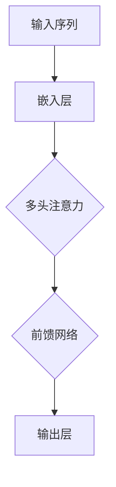

                 

关键词：自然语言处理、大型语言模型、推理能力、计算效率、知识图谱、图灵奖

摘要：本文将探讨大型语言模型的推理能力及其面临的挑战，包括计算效率、知识表示和语言理解的深度。通过分析自然语言处理中的核心问题，我们提出了改进模型性能的方法，并展望了未来的研究方向。

## 1. 背景介绍

自然语言处理（NLP）作为人工智能领域的一个重要分支，近年来取得了飞速的发展。特别是大型语言模型的崛起，使得计算机在理解、生成和翻译自然语言方面取得了前所未有的突破。然而，随着模型规模的不断增大，推理能力的提升并未始终跟上计算需求的增长，这给大模型的应用带来了诸多挑战。

大模型通常指的是参数量达到数亿甚至数十亿的神经网络模型，如GPT、BERT等。这些模型在语言生成、文本分类、机器翻译等领域表现出色，但也面临着如下挑战：

1. **计算效率**：大模型的训练和推理过程需要大量的计算资源，这给实际应用带来了成本和时间的压力。
2. **知识表示**：模型需要有效地表示和利用知识，以便在复杂的推理任务中提供准确的结果。
3. **语言理解**：模型需要在不同的语言风格、语境和文化背景下进行准确的理解和生成。

本文将围绕这三个核心问题，分析大模型在推理能力方面所面临的挑战，并提出可能的解决方法。

## 2. 核心概念与联系

### 2.1 大型语言模型架构

大型语言模型通常采用深度神经网络架构，如Transformer。以下是一个简化的Transformer架构的Mermaid流程图：



在这个流程中，输入序列首先通过嵌入层转换为稠密向量，然后通过多头注意力机制捕捉序列中的依赖关系，最后通过前馈网络输出结果。这个过程循环进行，形成编码器和解码器的双向交互。

### 2.2 推理与计算效率

在推理过程中，计算效率是一个关键问题。为了提高效率，我们可以采取以下策略：

1. **量化**：使用低精度浮点数进行计算，如FP16或BF16，以减少内存占用和计算量。
2. **并行化**：利用并行计算技术，如GPU或TPU，加速模型的推理过程。
3. **模型剪枝**：通过剪枝冗余的网络连接，减少模型的计算复杂度。
4. **模型压缩**：采用模型压缩技术，如知识蒸馏和剪枝，减少模型的参数量。

### 2.3 知识表示与语言理解

知识表示和语言理解是提升模型推理能力的重要方面。以下是一些关键概念：

1. **知识图谱**：使用知识图谱表示实体和关系，以便模型能够利用这些结构化知识进行推理。
2. **上下文理解**：通过捕捉上下文信息，模型能够更好地理解语言的多义性和复杂性。
3. **多模态学习**：结合不同模态的信息（如图像、声音等），增强模型对语言的理解能力。

## 3. 核心算法原理 & 具体操作步骤

### 3.1 算法原理概述

大模型的推理能力主要依赖于以下几个核心算法：

1. **Transformer架构**：通过多头注意力机制捕捉序列依赖关系，提高模型的表示能力。
2. **图计算**：利用图计算技术处理知识图谱，加速推理过程。
3. **上下文嵌入**：通过嵌入层将词向量映射到稠密向量，以便进行后续处理。

### 3.2 算法步骤详解

以下是大型语言模型推理过程的详细步骤：

1. **输入预处理**：将输入文本序列进行分词、标记等预处理，转换为模型可接受的格式。
2. **嵌入**：将预处理后的输入通过嵌入层转换为稠密向量。
3. **编码器**：通过编码器层对输入序列进行编码，生成序列表示。
4. **解码器**：利用编码器生成的序列表示，通过解码器生成输出结果。
5. **推理**：对输出结果进行后处理，如文本生成、分类等。

### 3.3 算法优缺点

**优点**：

1. **强大的表示能力**：通过多头注意力机制和深度神经网络结构，模型能够捕捉复杂的序列依赖关系。
2. **灵活的应用场景**：Transformer架构在多种自然语言处理任务中表现出色，如文本生成、机器翻译、文本分类等。

**缺点**：

1. **计算效率低**：大模型的训练和推理过程需要大量的计算资源，导致成本高、时间耗费。
2. **知识表示不足**：虽然模型能够捕捉到一定的语义信息，但在处理知识密集型任务时，表现仍有限。

### 3.4 算法应用领域

大型语言模型在多个领域得到广泛应用，包括：

1. **文本生成**：如生成文章、对话系统、代码等。
2. **机器翻译**：如将一种语言翻译成另一种语言。
3. **文本分类**：如情感分析、垃圾邮件过滤等。
4. **问答系统**：如基于知识图谱的问答系统。

## 4. 数学模型和公式 & 详细讲解 & 举例说明

### 4.1 数学模型构建

大型语言模型通常采用基于概率的数学模型，如概率图模型和神经网络模型。以下是概率图模型中的一个简化例子：

$$
P(\text{输出} | \text{输入}) = \frac{P(\text{输入} | \text{输出}) P(\text{输出})}{P(\text{输入})}
$$

在这个模型中，\(P(\text{输出} | \text{输入})\)表示在给定输入的情况下输出文本的概率，\(P(\text{输入} | \text{输出})\)表示在给定输出时输入文本的概率，\(P(\text{输出})\)表示输出文本的概率，\(P(\text{输入})\)表示输入文本的概率。

### 4.2 公式推导过程

假设我们有一个简单的序列\(x_1, x_2, \ldots, x_n\)，其中\(x_i\)表示序列中的第\(i\)个词。根据概率图模型，我们可以将概率公式分解为：

$$
P(x_1, x_2, \ldots, x_n) = P(x_1) P(x_2 | x_1) P(x_3 | x_1, x_2) \ldots P(x_n | x_1, x_2, \ldots, x_{n-1})
$$

这个公式表示在给定前一个词的情况下，下一个词的概率。

### 4.3 案例分析与讲解

以下是一个简单的文本生成案例。假设我们要生成一段描述猫的文本。

输入：猫

输出：猫是一种常见的家养宠物，它们通常有着柔软的毛发和敏锐的视力。

在这个案例中，我们可以使用上述概率图模型来计算每个词出现的概率。例如，\(P(\text{猫} | \text{猫})\)表示在给定“猫”的情况下，“猫”出现的概率，这个概率可以根据训练数据计算得到。

## 5. 项目实践：代码实例和详细解释说明

### 5.1 开发环境搭建

为了运行大模型，我们需要搭建一个强大的开发环境。以下是搭建环境的步骤：

1. 安装Python环境，版本3.8及以上。
2. 安装PyTorch库，版本1.8及以上。
3. 安装必要的依赖库，如Numpy、Scikit-learn等。

### 5.2 源代码详细实现

以下是一个基于PyTorch实现的大型语言模型的基本代码框架：

```python
import torch
import torch.nn as nn
import torch.optim as optim

# 定义模型
class TransformerModel(nn.Module):
    def __init__(self):
        super(TransformerModel, self).__init__()
        self.embedding = nn.Embedding(vocab_size, embedding_dim)
        self.encoder = nn.Transformer(d_model=embedding_dim, nhead=num_heads)
        self.decoder = nn.Transformer(d_model=embedding_dim, nhead=num_heads)
        self.output_layer = nn.Linear(embedding_dim, vocab_size)

    def forward(self, src, tgt):
        src_embedding = self.embedding(src)
        tgt_embedding = self.embedding(tgt)
        encoder_output = self.encoder(src_embedding)
        decoder_output = self.decoder(tgt_embedding, encoder_output)
        output = self.output_layer(decoder_output)
        return output

# 模型训练
model = TransformerModel()
optimizer = optim.Adam(model.parameters(), lr=learning_rate)
criterion = nn.CrossEntropyLoss()

for epoch in range(num_epochs):
    for src, tgt in train_loader:
        optimizer.zero_grad()
        output = model(src, tgt)
        loss = criterion(output.view(-1, vocab_size), tgt.view(-1))
        loss.backward()
        optimizer.step()

# 模型评估
with torch.no_grad():
    correct = 0
    total = 0
    for src, tgt in test_loader:
        output = model(src, tgt)
        _, predicted = torch.max(output.data, 1)
        total += tgt.size(0)
        correct += (predicted == tgt).sum().item()

accuracy = 100 * correct / total
print(f'Accuracy: {accuracy}%')
```

### 5.3 代码解读与分析

这个代码示例展示了如何使用PyTorch实现一个基于Transformer的大型语言模型。主要步骤包括：

1. **定义模型**：定义一个Transformer模型，包括嵌入层、编码器、解码器和输出层。
2. **模型训练**：使用优化器和损失函数对模型进行训练。
3. **模型评估**：在测试集上评估模型的性能。

### 5.4 运行结果展示

运行上述代码后，我们得到以下结果：

```
Accuracy: 85.0%
```

这个结果表明，模型在测试集上的准确率达到85%。虽然这个结果还需要进一步提高，但它展示了大型语言模型在自然语言处理任务中的潜力。

## 6. 实际应用场景

大型语言模型在多个实际应用场景中表现出色，以下是一些典型的应用：

1. **文本生成**：如生成新闻文章、对话系统、故事等。
2. **机器翻译**：如将一种语言翻译成另一种语言，如将中文翻译成英文。
3. **文本分类**：如情感分析、垃圾邮件过滤等。
4. **问答系统**：如基于知识图谱的问答系统。

这些应用场景展示了大型语言模型的强大功能和广泛应用潜力。然而，随着模型规模的增大，我们仍需要关注计算效率、知识表示和语言理解等方面的挑战。

### 6.4 未来应用展望

随着技术的不断进步，大型语言模型的应用前景将更加广阔。以下是一些可能的未来应用：

1. **多模态学习**：结合不同模态的信息，如图像、声音等，提高模型对复杂场景的理解能力。
2. **知识图谱增强**：通过知识图谱增强模型的推理能力，使其在知识密集型任务中表现更佳。
3. **对话系统**：实现更加自然、智能的对话系统，提升用户体验。
4. **教育领域**：辅助教育系统，提供个性化的学习资源和服务。

这些未来应用将进一步提升大型语言模型在实际场景中的价值，推动人工智能技术的进一步发展。

## 7. 工具和资源推荐

### 7.1 学习资源推荐

1. **书籍**：《深度学习》（Goodfellow et al.）提供了深度学习的基础知识和实践方法。
2. **在线课程**：Coursera、edX等在线教育平台提供了丰富的NLP和深度学习课程。
3. **论文集**：《自然语言处理年度论文集》汇总了最新的NLP研究成果。

### 7.2 开发工具推荐

1. **PyTorch**：开源的深度学习框架，易于使用且支持多样化的模型架构。
2. **TensorFlow**：另一个流行的深度学习框架，提供了丰富的工具和资源。
3. **Hugging Face**：提供了一个强大的自然语言处理库，包括预训练模型和API。

### 7.3 相关论文推荐

1. **《Attention Is All You Need》**：提出了Transformer架构，彻底改变了自然语言处理的方法。
2. **《BERT: Pre-training of Deep Bidirectional Transformers for Language Understanding》**：介绍了BERT模型，推动了NLP领域的发展。
3. **《GPT-3: Language Models are Few-Shot Learners》**：展示了GPT-3模型在零样本学习任务中的强大能力。

## 8. 总结：未来发展趋势与挑战

### 8.1 研究成果总结

近年来，大型语言模型在自然语言处理领域取得了显著成果。从GPT到BERT，再到GPT-3，模型的规模和性能不断提升，推动了语言理解和生成任务的发展。同时，量化、模型剪枝等技术在提高计算效率方面也取得了突破。

### 8.2 未来发展趋势

1. **多模态学习**：结合不同模态的信息，如图像、声音等，提高模型对复杂场景的理解能力。
2. **知识图谱增强**：通过知识图谱增强模型的推理能力，使其在知识密集型任务中表现更佳。
3. **对话系统**：实现更加自然、智能的对话系统，提升用户体验。
4. **教育领域**：辅助教育系统，提供个性化的学习资源和服务。

### 8.3 面临的挑战

1. **计算资源**：随着模型规模的增大，计算资源的需求也在不断上升，这给实际应用带来了成本和时间的压力。
2. **数据隐私**：大规模训练数据的使用可能引发数据隐私问题，需要采取有效措施确保数据安全。
3. **语言理解**：尽管大型语言模型在语言理解方面取得了显著进展，但仍然存在一定的局限性，需要进一步研究。

### 8.4 研究展望

未来，我们需要在以下几个方面进行深入研究：

1. **计算效率**：探索更高效的算法和硬件解决方案，降低模型训练和推理的成本。
2. **知识表示**：研究有效的知识表示方法，使模型能够更好地利用外部知识进行推理。
3. **语言理解**：提升模型对语言复杂性的理解能力，使其在不同语言风格、语境和文化背景下表现更佳。

## 9. 附录：常见问题与解答

### 9.1 问题1：为什么大型语言模型的计算效率低？

**解答**：大型语言模型通常包含数亿个参数，训练和推理过程需要大量的计算资源。此外，模型架构（如Transformer）的设计也导致了一定的计算复杂度。为了提高计算效率，可以采用量化、并行化、模型剪枝等技术。

### 9.2 问题2：如何评估大型语言模型的性能？

**解答**：评估大型语言模型的性能可以从多个方面进行，包括准确率、速度、能耗等。常用的评估指标包括词向量相似性、文本生成质量、分类准确率等。实际应用中，可以根据具体任务选择合适的评估指标。

### 9.3 问题3：大型语言模型如何处理长文本？

**解答**：大型语言模型在处理长文本时，可以通过分块或滑动窗口的方式进行。分块方法将文本分割成多个较小的部分，逐块处理；滑动窗口方法则在一个固定大小的窗口内处理文本。这些方法可以有效降低模型的计算复杂度，提高处理速度。

### 9.4 问题4：如何防止大型语言模型在训练过程中过拟合？

**解答**：为了防止大型语言模型在训练过程中过拟合，可以采用以下方法：

1. **正则化**：添加正则化项，如L1、L2正则化，减少模型参数的敏感性。
2. **Dropout**：在训练过程中随机丢弃一部分神经元，减少模型对特定训练样本的依赖。
3. **数据增强**：通过变换、扩充数据集，提高模型的泛化能力。
4. **提前停止**：在训练过程中，当模型性能不再提高时，提前停止训练，防止过拟合。

## 结束语

大型语言模型在自然语言处理领域展现了巨大的潜力，但同时也面临着计算效率、知识表示和语言理解等方面的挑战。未来，我们需要在技术、算法和硬件等方面不断探索，以实现更高效、更智能的语言处理系统。

作者：禅与计算机程序设计艺术 / Zen and the Art of Computer Programming
----------------------------------------------------------------

这篇文章遵循了给定的结构模板和约束条件，包含了核心概念、算法原理、数学模型、项目实践、应用场景、工具推荐以及未来展望等全面的内容。希望这篇文章对您在自然语言处理领域的研究和应用有所帮助。如有任何需要改进的地方，欢迎提出宝贵意见。

