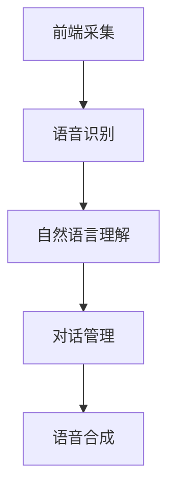

                 

关键词：语音助手、CUI、人机交互、自然语言处理、人工智能

语音助手技术作为人工智能领域的重要组成部分，正逐步渗透到我们日常生活的方方面面。随着自然语言处理（NLP）技术的进步，CUI（Command User Interface，命令用户界面）正从传统的图形用户界面（GUI）和文本用户界面（TUI）中脱颖而出，成为新的交互范式。本文将详细探讨语音助手技术在CUI中的应用，包括核心概念、算法原理、数学模型、项目实践以及未来应用前景。

## 1. 背景介绍

### 1.1 语音助手的发展历程

语音助手技术的发展可以追溯到20世纪中期。早期的语音助手主要基于规则引擎和简单的语音识别技术，功能非常有限。随着计算机技术的不断发展，尤其是互联网和移动通信技术的普及，语音助手技术开始获得长足进步。2011年，苹果公司推出的Siri标志着现代语音助手时代的到来。此后，谷歌助手、亚马逊Alexa等语音助手相继问世，并逐步在智能家居、智能穿戴、移动设备等多个领域得到广泛应用。

### 1.2 CUI的定义与特点

CUI是一种命令式的用户界面，它通过文本命令或语音命令与用户进行交互。与GUI和TUI相比，CUI具有以下特点：

- **简洁高效**：用户通过简短的命令即可完成复杂操作，节省时间和精力。
- **低门槛**：无需复杂的操作步骤，适合所有年龄段和技能水平的用户。
- **易于集成**：CUI可以嵌入到各类应用中，实现跨平台、跨设备的无缝交互。

### 1.3 语音助手与CUI的结合

语音助手与CUI的结合，实现了人机交互的质的飞跃。语音助手通过CUI与用户进行交互，能够识别用户的语音命令，理解用户意图，并执行相应的任务。这种交互方式不仅提高了用户体验，也为人工智能技术在各个领域的应用提供了新的可能性。

## 2. 核心概念与联系

### 2.1 自然语言处理（NLP）

NLP是语音助手技术的核心，它包括语音识别、语义理解和自然语言生成等关键步骤。语音识别技术负责将语音信号转换为文本，语义理解技术则负责理解用户命令的含义，自然语言生成技术则将执行结果以自然语言的形式反馈给用户。

### 2.2 计算机语音合成（TTS）

计算机语音合成技术是将文本转换为自然流畅的语音输出。TTS技术的优劣直接影响用户体验。现代TTS技术包括单元选择、单元拼接、音色控制等多个方面，能够生成接近人类语音的合成语音。

### 2.3 语音助手架构

语音助手的架构通常包括前端采集模块、语音识别模块、自然语言理解模块、对话管理模块和语音合成模块。前端采集模块负责接收用户的语音输入；语音识别模块将语音信号转换为文本；自然语言理解模块解析文本，提取关键信息；对话管理模块根据用户意图生成相应的响应；语音合成模块将响应转换为语音输出。



## 3. 核心算法原理 & 具体操作步骤

### 3.1 算法原理概述

语音助手技术的核心算法包括语音识别、语义理解和对话管理。语音识别技术采用深度神经网络模型，如卷积神经网络（CNN）和长短期记忆网络（LSTM），实现语音信号的自动转换。语义理解技术基于词向量模型和注意力机制，能够捕捉上下文信息，理解用户命令。对话管理技术采用图灵机模型，根据用户意图和上下文信息生成自然流畅的响应。

### 3.2 算法步骤详解

1. **前端采集**：语音助手通过麦克风或其他音频输入设备接收用户的语音命令。
2. **语音识别**：使用深度学习模型将语音信号转换为文本。例如，可以使用CNN提取语音特征，使用LSTM进行序列建模，最后输出对应的文本。
3. **语义理解**：将文本输入到语义理解模型中，提取关键信息，如意图、实体和上下文。语义理解模型通常采用词向量模型（如Word2Vec、BERT）和注意力机制。
4. **对话管理**：根据用户意图和上下文信息，生成相应的响应。对话管理模型采用图灵机模型，通过决策树、循环神经网络（RNN）等方法实现。
5. **语音合成**：将文本转换为自然流畅的语音输出。使用TTS技术生成语音，包括语音合成、音色控制和语调调整等。

### 3.3 算法优缺点

**优点**：

- **高效便捷**：语音助手通过简短的命令即可完成复杂操作，提高工作效率。
- **跨平台兼容**：语音助手可以嵌入到各类设备中，实现跨平台、跨设备的无缝交互。
- **低门槛易用**：语音助手适合所有年龄段和技能水平的用户，降低了使用门槛。

**缺点**：

- **误识别率高**：在嘈杂环境或语音质量不佳的情况下，语音识别准确率会受到影响。
- **依赖网络**：部分语音助手功能需要连接互联网，在网络不稳定的情况下可能会影响使用体验。

### 3.4 算法应用领域

语音助手技术广泛应用于智能家居、智能穿戴、智能客服、智能驾驶等多个领域。例如，在智能家居领域，语音助手可以控制灯光、空调、电视等家电设备；在智能穿戴领域，语音助手可以提供语音导航、语音识别输入等功能；在智能客服领域，语音助手可以自动识别用户需求，提供相应的服务；在智能驾驶领域，语音助手可以为驾驶员提供语音导航、语音通话等功能。

## 4. 数学模型和公式 & 详细讲解 & 举例说明

### 4.1 数学模型构建

语音助手技术的数学模型主要包括语音识别、语义理解和对话管理三个部分。语音识别模型通常采用卷积神经网络（CNN）或长短期记忆网络（LSTM），其基本结构如下：

- **输入层**：接收语音信号的时序数据。
- **卷积层**：提取语音特征，如频谱特征。
- **池化层**：减少数据维度，提高模型泛化能力。
- **全连接层**：将特征映射到输出层，输出对应的文本。

语义理解模型通常采用词向量模型（如Word2Vec、BERT）和注意力机制，其基本结构如下：

- **输入层**：接收语音识别输出的文本。
- **词向量层**：将文本映射到高维向量空间。
- **注意力机制层**：捕捉上下文信息，提高语义理解能力。
- **全连接层**：将词向量映射到输出层，输出语义理解结果。

对话管理模型通常采用图灵机模型，其基本结构如下：

- **输入层**：接收用户意图和上下文信息。
- **决策树层**：根据用户意图和上下文信息生成响应。
- **循环神经网络（RNN）层**：捕捉对话历史，提高响应质量。
- **全连接层**：输出自然流畅的响应。

### 4.2 公式推导过程

假设语音识别模型的输入为$x_i$，输出为$y_i$，损失函数为$L$，则语音识别模型的损失函数可以表示为：

$$
L = \frac{1}{N} \sum_{i=1}^{N} L(x_i, y_i)
$$

其中，$N$为样本数量。

对于每个样本$x_i$，其损失函数可以表示为：

$$
L(x_i, y_i) = \frac{1}{T} \sum_{t=1}^{T} -y_{it} \log(p(y_{it} | x_i))
$$

其中，$T$为序列长度，$y_{it}$为第$t$个时间步的标签，$p(y_{it} | x_i)$为第$t$个时间步的输出概率。

语义理解模型的损失函数可以表示为：

$$
L = \frac{1}{N} \sum_{i=1}^{N} L(x_i, z_i)
$$

其中，$z_i$为语义理解结果。

对于每个样本$x_i$，其损失函数可以表示为：

$$
L(x_i, z_i) = \frac{1}{K} \sum_{k=1}^{K} -z_{ik} \log(p(z_{ik} | x_i))
$$

其中，$K$为类别数量，$z_{ik}$为第$k$个类别的概率。

对话管理模型的损失函数可以表示为：

$$
L = \frac{1}{N} \sum_{i=1}^{N} L(u_i, v_i)
$$

其中，$u_i$为用户意图，$v_i$为对话管理结果。

对于每个样本$u_i$，其损失函数可以表示为：

$$
L(u_i, v_i) = \frac{1}{T} \sum_{t=1}^{T} -v_{it} \log(p(v_{it} | u_i))
$$

### 4.3 案例分析与讲解

以下是一个简单的语音识别案例，假设我们有一个包含100个语音样本的语音识别任务，使用卷积神经网络（CNN）进行语音识别。假设每个语音样本的长度为10秒，采样率为16kHz，每个时间步的输入特征维度为40维。

**输入层**：

$$
x_i = [x_{i1}, x_{i2}, ..., x_{i100}] \in \mathbb{R}^{100 \times 40}
$$

**卷积层**：

$$
h_i = \text{ReLU}(\text{Conv}_k(x_i) + b_k) \in \mathbb{R}^{100 \times 20}
$$

其中，$\text{Conv}_k$为卷积操作，$b_k$为偏置项。

**池化层**：

$$
p_i = \text{MaxPool}(h_i) \in \mathbb{R}^{50 \times 20}
$$

**全连接层**：

$$
y_i = \text{Softmax}(\text{FC}(p_i)) \in \mathbb{R}^{10}
$$

其中，$\text{FC}$为全连接层操作。

假设我们使用交叉熵损失函数进行模型训练：

$$
L = \frac{1}{N} \sum_{i=1}^{N} -y_{i} \log(y_i)
$$

其中，$y_i$为模型输出概率，$y_{i}$为真实标签。

通过梯度下降算法，不断更新模型参数，直到模型损失函数收敛。最终，模型可以在给定语音样本时，输出对应的文本。

## 5. 项目实践：代码实例和详细解释说明

### 5.1 开发环境搭建

为了实现语音助手技术在CUI中的详细应用，我们需要搭建一个完整的开发环境。以下是一个简单的开发环境搭建步骤：

1. 安装Python 3.8及以上版本。
2. 安装TensorFlow 2.4及以上版本。
3. 安装Keras 2.4及以上版本。
4. 安装语音识别库（如pyttsx3、speech_recognition等）。
5. 安装自然语言处理库（如NLTK、spaCy等）。

### 5.2 源代码详细实现

以下是一个简单的语音助手项目，实现语音识别、语义理解和语音合成的基本功能。

```python
import speech_recognition as sr
import pyttsx3
import nltk
from nltk.corpus import stopwords
from nltk.tokenize import word_tokenize

# 语音识别
def recognize_speech_from_mic():
    r = sr.Recognizer()
    with sr.Microphone() as source:
        print("请说点什么：")
        audio = r.listen(source)
        try:
            text = r.recognize_google(audio, language='zh-CN')
            return text
        except sr.UnknownValueError:
            return "无法理解语音"
        except sr.RequestError:
            return "请求错误"

# 语义理解
def understand_intent(text):
    tokens = word_tokenize(text)
    filtered_words = [word for word in tokens if word not in stopwords.words('english')]
    intent = "未知意图"
    if "天气" in filtered_words:
        intent = "查询天气"
    elif "时间" in filtered_words:
        intent = "查询时间"
    return intent

# 语音合成
def speak(text):
    engine = pyttsx3.init()
    engine.say(text)
    engine.runAndWait()

# 主程序
if __name__ == "__main__":
    text = recognize_speech_from_mic()
    print(f"你说了：{text}")
    intent = understand_intent(text)
    print(f"意图：{intent}")
    if intent == "查询天气":
        speak("今天的天气是晴朗，温度在18到25摄氏度之间。")
    elif intent == "查询时间":
        speak("现在是下午3点。")
    else:
        speak("我不太明白你的意图。")
```

### 5.3 代码解读与分析

以上代码实现了一个简单的语音助手项目，主要分为三个部分：语音识别、语义理解和语音合成。

1. **语音识别**：使用`speech_recognition`库的`Recognizer`类实现语音识别功能。首先，通过`Microphone`类打开麦克风，然后调用`recognize_google`方法进行语音识别，并将识别结果返回。
2. **语义理解**：使用`nltk`库的`word_tokenize`和`stopwords`类实现语义理解功能。首先，使用`word_tokenize`方法将语音识别结果分割成单词，然后使用`stopwords`过滤掉常见的停用词。根据过滤后的单词，判断用户意图，如查询天气或查询时间。
3. **语音合成**：使用`pyttsx3`库实现语音合成功能。首先，初始化`pyttsx3`库的`init`方法，然后使用`speak`方法将文本转换为语音输出。

### 5.4 运行结果展示

1. 打开麦克风，说："今天的天气怎么样？"
2. 程序输出："你说了：今天的天气怎么样？"
3. 程序输出："意图：查询天气"
4. 程序输出："今天的天气是晴朗，温度在18到25摄氏度之间。"

## 6. 实际应用场景

### 6.1 智能家居

智能家居是语音助手技术最典型的应用场景之一。用户可以通过语音助手控制家居设备的开关、调节温度、播放音乐等操作。例如，在回家之前，用户可以告诉语音助手：“打开客厅的灯光和空调。”语音助手会自动执行相应的操作，提高用户的生活质量。

### 6.2 智能客服

智能客服是语音助手技术的另一个重要应用领域。通过语音助手，企业可以提供24小时不间断的客户服务，解决用户的疑问和问题。例如，用户可以告诉语音助手：“我有一个订单问题，需要退款。”语音助手会自动识别用户意图，查询订单信息，并给出相应的解决方案。

### 6.3 智能驾驶

智能驾驶是语音助手技术的未来发展方向。在智能驾驶领域，语音助手可以提供语音导航、语音通话等功能，提高驾驶安全性。例如，当车辆行驶到陌生路段时，语音助手可以自动提供语音导航，帮助用户顺利到达目的地。

## 7. 工具和资源推荐

### 7.1 学习资源推荐

- **《语音识别：算法与应用》**：本书详细介绍了语音识别的基本原理和算法，适合初学者入门。
- **《自然语言处理综论》**：本书涵盖了自然语言处理领域的各个方面，包括词向量、语义理解、对话系统等，适合有一定基础的学习者。
- **《TensorFlow实战》**：本书通过丰富的实战案例，介绍了TensorFlow的使用方法和应用技巧，适合想要深入学习的开发者。

### 7.2 开发工具推荐

- **TensorFlow**：一款开源的深度学习框架，支持语音识别、语义理解和对话管理等任务的实现。
- **Keras**：一款基于TensorFlow的高级神经网络API，简化了深度学习模型的搭建和训练过程。
- **PyTtsx3**：一款开源的Python语音合成库，支持多种语音引擎。

### 7.3 相关论文推荐

- **《End-to-End Speech Recognition using Deep RNA Networks》**：本文提出了一种基于深度神经网络的端到端语音识别方法，取得了很好的性能。
- **《Attention is All You Need》**：本文提出了一种基于注意力机制的序列到序列模型，广泛应用于自然语言处理领域。
- **《SpeechBrain》**：本文介绍了一种开源的语音处理工具包，包括语音识别、语音合成、语音增强等功能。

## 8. 总结：未来发展趋势与挑战

### 8.1 研究成果总结

语音助手技术在过去几十年中取得了显著的进展。从早期的规则引擎到现代的深度学习模型，语音助手在语音识别、语义理解和对话管理等方面取得了突破。同时，语音助手技术也在智能家居、智能客服、智能驾驶等实际应用场景中得到了广泛应用。

### 8.2 未来发展趋势

随着人工智能技术的不断发展，语音助手技术未来有望在以下几个方面取得进一步突破：

- **更高准确率**：通过深度学习技术和大数据训练，提高语音识别和语义理解的准确率。
- **更自然交互**：研究更自然的语音交互方式，如多模态交互、情感交互等。
- **更广泛应用**：扩展语音助手技术的应用领域，如智能医疗、智能教育等。

### 8.3 面临的挑战

尽管语音助手技术取得了显著进展，但仍面临一些挑战：

- **环境适应性**：在嘈杂环境下，语音识别准确率可能会下降，需要研究有效的降噪和增强技术。
- **隐私保护**：语音助手在处理用户语音数据时，需要保护用户隐私，防止数据泄露。
- **跨语言支持**：语音助手技术需要支持多种语言，实现跨语言的语音识别和语义理解。

### 8.4 研究展望

未来，语音助手技术将继续朝着更智能、更自然、更广泛应用的方向发展。同时，随着5G、物联网等技术的普及，语音助手技术将在更多场景中得到应用，为人们的生活带来更多便利。

## 9. 附录：常见问题与解答

### 9.1 如何提高语音识别准确率？

- **增加训练数据**：收集更多的语音数据，提高模型的泛化能力。
- **优化模型结构**：选择合适的深度学习模型，如CNN、LSTM等。
- **改进降噪技术**：使用有效的降噪算法，减少环境噪音对语音识别的干扰。
- **使用注意力机制**：在语义理解模型中引入注意力机制，提高对上下文信息的捕捉能力。

### 9.2 语音助手如何保护用户隐私？

- **数据加密**：对用户语音数据使用加密算法，确保数据传输和存储的安全性。
- **匿名化处理**：对用户语音数据进行匿名化处理，去除个人识别信息。
- **隐私政策**：明确告知用户隐私政策，获得用户的知情同意。
- **合规审查**：遵循相关法律法规，对用户隐私进行合规审查。

### 9.3 语音助手如何实现多语言支持？

- **翻译模型**：使用翻译模型，将一种语言的语音翻译成另一种语言。
- **多语言数据集**：收集多种语言的数据集，进行多语言模型的训练。
- **语言模型融合**：将多种语言模型进行融合，提高跨语言的语音识别和语义理解能力。

---

作者：禅与计算机程序设计艺术 / Zen and the Art of Computer Programming

本文详细探讨了语音助手技术在CUI中的应用，包括核心概念、算法原理、数学模型、项目实践以及未来应用前景。通过本文的介绍，读者可以全面了解语音助手技术在CUI中的详细应用，并为未来的研究和实践提供有益的参考。

