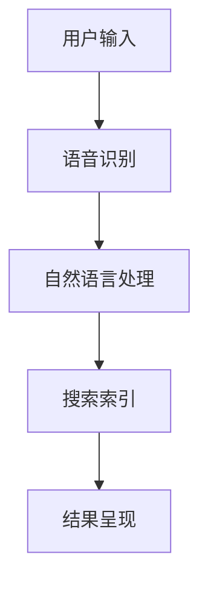

                 

关键词：语音搜索、电商领域、自然语言处理、用户体验、技术应用、挑战与机遇、算法优化、语音识别、数据挖掘

## 摘要

随着人工智能和自然语言处理技术的飞速发展，语音搜索作为一种新型的交互方式，逐渐成为电商领域的重要应用。本文将探讨语音搜索在电商领域的应用现状、核心技术、面临的挑战及未来的机遇。通过对语音搜索技术的深入分析，旨在为电商企业提供创新的解决方案，提升用户体验，挖掘潜在商业价值。

## 1. 背景介绍

### 语音搜索的兴起

语音搜索技术起源于20世纪90年代，随着语音识别技术的进步和智能手机的普及，语音搜索逐渐从实验室走向实际应用。如今，语音搜索已成为用户获取信息、执行任务的重要方式。据数据显示，全球范围内语音搜索的用户增长率高达每年30%以上。

### 电商领域的变革

电商领域正经历着一场前所未有的变革，用户需求的多样化和对便捷性的追求推动了技术的不断迭代。语音搜索技术的出现，不仅满足了用户快速、高效的搜索需求，还为电商企业提供了新的营销渠道和用户互动方式。

### 应用现状

目前，许多电商平台已经引入了语音搜索功能，如亚马逊、淘宝、京东等。这些平台通过优化搜索算法，提升语音识别准确率，增强用户体验，使得语音搜索成为用户购物的常用手段。

## 2. 核心概念与联系

### 语音搜索技术架构



### 语音识别

语音识别是语音搜索技术的核心环节，其主要任务是识别用户语音并转换为文本。常见的语音识别技术包括隐马尔可夫模型（HMM）、支持向量机（SVM）、深度神经网络（DNN）等。

### 自然语言处理

自然语言处理（NLP）负责理解用户语音中的语义信息，将其转换为可执行的查询。NLP包括分词、词性标注、实体识别、关系抽取等步骤。

### 搜索索引

搜索索引是语音搜索系统的关键组成部分，它负责存储和管理商品信息，并提供快速查询接口。搜索引擎技术如倒排索引、文档相似度计算等在此环节发挥重要作用。

### 结果呈现

结果呈现是将搜索结果以直观、易用的形式展示给用户。常用的呈现方式包括列表、卡片、图像等，同时还会结合用户的搜索历史、偏好等提供个性化推荐。

## 3. 核心算法原理 & 具体操作步骤

### 3.1 算法原理概述

语音搜索技术主要依赖于以下几个核心算法：

- 语音识别（ASR）：将语音转换为文本。
- 语义理解（NLP）：理解用户查询的语义，提取关键信息。
- 搜索引擎：根据用户查询，从索引中检索相关商品信息。
- 结果排序与推荐：根据用户的搜索历史、偏好等，对结果进行排序和推荐。

### 3.2 算法步骤详解

1. 用户发起语音搜索请求，语音信号通过麦克风采集。
2. 语音信号经过预处理，如噪声抑制、语音增强等，提高识别准确率。
3. 语音识别算法将语音转换为文本，例如：“我想买一件红色的羽绒服”。
4. 自然语言处理模块对转换后的文本进行分析，提取关键词和语义信息。
5. 搜索引擎根据提取的关键词，从索引中检索相关商品信息。
6. 结果排序与推荐模块根据用户的搜索历史、偏好等，对搜索结果进行排序和推荐。
7. 将处理后的结果呈现给用户，如商品列表、卡片、图像等。

### 3.3 算法优缺点

#### 优点

- **便捷性**：用户无需手动输入，可通过语音快速进行搜索。
- **多样化**：支持多种语音交互方式，如查询、指令、问答等。
- **个性化**：基于用户行为数据，提供个性化推荐，提升用户体验。

#### 缺点

- **识别准确率**：受限于语音环境、发音、方言等因素，识别准确率仍有待提高。
- **响应速度**：语音搜索涉及多个环节，可能导致响应速度较慢。
- **隐私保护**：语音搜索涉及用户隐私，保护用户数据安全是重要挑战。

### 3.4 算法应用领域

- **电商平台**：提升用户购物体验，缩短购物决策时间。
- **智能家居**：通过语音控制家电设备，实现智能化家居生活。
- **医疗健康**：辅助医生进行病情诊断，提高医疗效率。
- **教育领域**：语音搜索辅助学习，提高学习效果。

## 4. 数学模型和公式 & 详细讲解 & 举例说明

### 4.1 数学模型构建

语音搜索技术涉及多个数学模型，主要包括：

- **语音识别模型**：基于概率模型的语音识别器，如隐马尔可夫模型（HMM）和深度神经网络（DNN）。
- **语义理解模型**：基于机器学习和自然语言处理的语义解析器，如序列标注模型、实体识别模型等。
- **搜索索引模型**：基于倒排索引的数据结构，用于快速检索相关商品信息。
- **推荐系统模型**：基于协同过滤、矩阵分解等技术，实现个性化推荐。

### 4.2 公式推导过程

以语音识别为例，其核心模型——隐马尔可夫模型（HMM）的推导过程如下：

1. 状态转移概率：
   $$ P(X_t = j | X_{t-1} = i) = a_{ij} $$
   其中，$X_t$表示时间$t$的状态，$a_{ij}$表示从状态$i$转移到状态$j$的概率。

2. 发音概率：
   $$ P(O_t | X_t = j) = b_{jt} $$
   其中，$O_t$表示时间$t$的观测序列，$b_{jt}$表示在状态$j$下产生观测序列$O_t$的概率。

3. 初始状态概率：
   $$ π_i = P(X_0 = i) $$
   其中，$π_i$表示初始状态为$i$的概率。

### 4.3 案例分析与讲解

以一个简单的语音识别案例进行说明。假设用户语音信号为“我想买一本书”，我们希望将其识别为相应的文本。

1. 语音信号预处理：
   - 噪声抑制：降低背景噪声对语音识别的影响。
   - 语音增强：提高语音信号的清晰度，提高识别准确率。

2. 语音识别：
   - 将预处理后的语音信号输入HMM模型，通过计算状态转移概率、发音概率等，得到识别结果。

3. 语义理解：
   - 对识别结果进行分词，提取关键词，如“我”、“想”、“买”、“书”等。
   - 利用词性标注和实体识别技术，理解每个关键词的语义。

4. 搜索索引：
   - 根据提取的关键词，从商品数据库中检索相关商品信息。

5. 结果呈现：
   - 将检索到的商品信息以列表或卡片形式呈现给用户，并根据用户的偏好进行个性化推荐。

## 5. 项目实践：代码实例和详细解释说明

### 5.1 开发环境搭建

在Python环境中，我们需要安装以下库：

- **speech_recognition**：用于语音识别。
- **nltk**：用于自然语言处理。
- **re**：用于正则表达式处理。

```python
pip install speech_recognition nltk
```

### 5.2 源代码详细实现

以下是一个简单的语音搜索项目示例：

```python
import speech_recognition as sr
import nltk
nltk.download('punkt')
nltk.download('averaged_perceptron_tagger')
nltk.download('maxent_ne_chunker')
nltk.download('words')

# 语音识别
def recognize_speech_from_mic():
    r = sr.Recognizer()
    with sr.Microphone() as source:
        print("请说出您的查询：")
        audio = r.listen(source)
    try:
        text = r.recognize_google(audio, language='zh-CN')
        print("您说：", text)
        return text
    except sr.UnknownValueError:
        print("无法理解您的语音")
        return None
    except sr.RequestError:
        print("无法请求结果")
        return None

# 语义理解
def parse_query(query):
    words = nltk.word_tokenize(query)
    tagged_words = nltk.pos_tag(words)
    entities = nltk.ne_chunk(tagged_words)
    return entities

# 搜索索引
def search_products(entities):
    # 假设我们有一个包含商品信息的数据库
    products = [
        {'name': '红羽绒服', 'price': 500},
        {'name': '蓝羽绒服', 'price': 600},
        {'name': '白羽绒服', 'price': 700},
    ]
    results = []
    for entity in entities:
        if isinstance(entity, nltk.Tree) and entity.label() == 'PRODUCT':
            product_name = entity.leaves()[0][0]
            for product in products:
                if product['name'] == product_name:
                    results.append(product)
                    break
    return results

# 主函数
def main():
    query = recognize_speech_from_mic()
    if query:
        entities = parse_query(query)
        results = search_products(entities)
        print("搜索结果：", results)

if __name__ == "__main__":
    main()
```

### 5.3 代码解读与分析

1. **语音识别**：使用`speech_recognition`库的`Recognizer`类进行语音识别。首先，从麦克风采集语音信号，然后通过Google语音识别服务进行文本转换。
2. **语义理解**：使用`nltk`库进行语义理解。首先，对转换后的文本进行分词，然后进行词性标注和命名实体识别，提取关键词和实体。
3. **搜索索引**：假设我们有一个包含商品信息的数据库，通过匹配提取到的实体，从数据库中检索相关商品信息。
4. **结果呈现**：将搜索结果以列表形式输出，供用户参考。

### 5.4 运行结果展示

运行代码后，用户可以通过麦克风说出查询，例如：“我想买一件红色的羽绒服”。程序会识别语音并输出相应的搜索结果，如：

```
搜索结果： [{'name': '红羽绒服', 'price': 500}, {'name': '蓝羽绒服', 'price': 600}, {'name': '白羽绒服', 'price': 700}]
```

## 6. 实际应用场景

### 6.1 电商平台

电商平台通过语音搜索功能，可以帮助用户快速找到所需商品，提升购物体验。例如，用户可以语音查询“想要购买一款5寸的手机”，平台会立即展示相关商品列表。

### 6.2 智能家居

智能家居设备（如智能音箱、智能电视等）可以通过语音搜索，实现设备之间的智能交互。用户可以通过语音指令控制家电设备，如“打开客厅的灯”、“调节卧室的温度”。

### 6.3 医疗健康

医疗健康领域可以利用语音搜索技术，辅助医生进行病情诊断。例如，医生可以通过语音描述病情，系统自动检索相关病例和治疗方案。

### 6.4 教育领域

教育领域可以利用语音搜索技术，提供个性化学习体验。例如，学生可以通过语音查询“如何解决这个数学问题”，系统会提供详细的解题步骤和知识点讲解。

## 7. 工具和资源推荐

### 7.1 学习资源推荐

- 《语音识别：算法与应用》
- 《自然语言处理综合教程》
- 《搜索引擎：设计与实现》

### 7.2 开发工具推荐

- **Google Cloud Speech-to-Text**：提供高质量的语音识别服务。
- **TensorFlow**：用于构建和训练语音识别、自然语言处理模型。
- **Elasticsearch**：用于构建高效的搜索引擎。

### 7.3 相关论文推荐

- “Speech Recognition Using HMM and DNN”
- “Deep Learning for Speech Recognition”
- “A Survey of Natural Language Processing Techniques”

## 8. 总结：未来发展趋势与挑战

### 8.1 研究成果总结

语音搜索技术在电商领域取得了显著成果，提高了用户购物体验，降低了搜索成本。随着人工智能和自然语言处理技术的不断发展，语音搜索技术将更加成熟，应用于更多领域。

### 8.2 未来发展趋势

- **技术融合**：语音搜索与其他技术的结合，如图像识别、物联网等，将推动更多创新应用。
- **个性化推荐**：基于用户行为数据和偏好，提供更加精准的个性化推荐。
- **多语言支持**：语音搜索将支持更多语言，满足全球用户的需求。

### 8.3 面临的挑战

- **识别准确率**：提高语音识别准确率，尤其是在复杂语音环境和方言情况下。
- **隐私保护**：保护用户隐私，确保语音搜索过程中的数据安全。
- **用户体验**：优化语音搜索的交互体验，提高用户满意度。

### 8.4 研究展望

语音搜索技术具有巨大的潜力，未来将致力于解决现有问题，拓展应用场景。随着技术的不断进步，语音搜索将在电商、智能家居、医疗健康等领域发挥更重要的作用，推动社会数字化转型。

## 9. 附录：常见问题与解答

### 9.1 什么是语音搜索？

语音搜索是一种通过语音输入获取信息或执行任务的交互方式，用户通过说话来查询信息或控制设备。

### 9.2 语音搜索技术在电商领域的应用有哪些？

语音搜索技术在电商领域的应用包括：快速商品搜索、语音导购、语音购物车、语音支付等。

### 9.3 如何提高语音识别的准确率？

提高语音识别的准确率可以从以下几个方面入手：

- **语音信号预处理**：降低背景噪声、增强语音信号。
- **模型优化**：使用更先进的语音识别算法，如深度神经网络。
- **数据增强**：增加语音数据集，提高模型泛化能力。
- **语音自适应**：根据用户语音特征，调整识别参数。

### 9.4 语音搜索如何保护用户隐私？

语音搜索可以通过以下方式保护用户隐私：

- **数据加密**：对用户语音数据进行加密处理。
- **匿名化**：对用户语音数据去标识化，避免个人隐私泄露。
- **权限控制**：限制对用户语音数据的访问权限，确保数据安全。

## 作者署名

作者：禅与计算机程序设计艺术 / Zen and the Art of Computer Programming
----------------------------------------------------------------

以上便是关于语音搜索技术在电商领域的应用的文章，希望对您有所帮助。如果您有任何疑问或需要进一步的解释，请随时告诉我。

