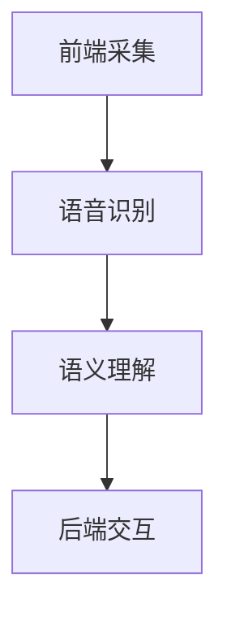

                 

关键词：语音搜索、电商、自然语言处理、智能客服、人工智能、用户体验

> 摘要：随着语音识别技术的不断发展，语音搜索已经成为电商领域的重要创新点。本文将深入探讨语音搜索技术在电商中的应用，分析其核心原理、算法实现，以及未来的发展趋势和挑战。

## 1. 背景介绍

随着移动互联网的普及，智能手机和智能设备已经成为人们日常生活中不可或缺的工具。电子商务（电商）作为互联网经济的重要组成部分，已经深刻改变了人们的购物方式。然而，传统的文字搜索在购物场景中存在一定的局限性，如搜索效率低、输入体验差等。因此，语音搜索作为一种全新的交互方式，正逐渐在电商领域崭露头角。

### 1.1 语音搜索的发展历程

语音搜索技术的起源可以追溯到20世纪80年代，当时研究人员开始尝试将语音信号转换为文本。随着计算机性能的提升和自然语言处理（NLP）技术的发展，语音识别的准确率不断提高。2011年，苹果公司发布的Siri标志着智能语音助手时代的到来，开启了语音交互的新篇章。

### 1.2 电商领域对语音搜索的需求

电商领域的特点决定了语音搜索的广泛应用。首先，商品种类繁多，用户在搜索时往往难以准确描述所需商品，导致传统文字搜索效率低下。其次，电商购物流程复杂，用户需要填写个人信息、确认订单等，操作繁琐。语音搜索可以简化这些流程，提升用户体验。此外，语音搜索还能够实现个性化推荐，根据用户的历史购买行为和语音输入内容，为用户提供更精准的购物建议。

## 2. 核心概念与联系

### 2.1 语音搜索的核心概念

语音搜索技术主要包括语音识别（Speech Recognition）和语义理解（Semantic Understanding）两个核心环节。

#### 2.1.1 语音识别

语音识别是将语音信号转换为文本的过程。其关键在于将音频信号转化为数字信号，然后通过声学模型和语言模型进行解码，得到对应的文本。

#### 2.1.2 语义理解

语义理解是在语音识别的基础上，对输入文本进行解析和理解，提取出关键信息，从而生成相应的动作或建议。这需要结合知识图谱和机器学习算法，对用户意图进行精准识别。

### 2.2 语音搜索的架构

语音搜索的架构主要包括前端采集、语音识别、语义理解和后端交互四个部分。

#### 2.2.1 前端采集

前端采集主要负责采集用户的语音输入，可以是通过麦克风直接采集，也可以是通过对已有语音文件的处理。

#### 2.2.2 语音识别

语音识别模块负责将采集到的语音信号转换为文本，这通常需要通过深度学习模型来实现。

#### 2.2.3 语义理解

语义理解模块负责对语音识别得到的文本进行分析，提取出关键信息，如商品名称、价格、购买需求等。

#### 2.2.4 后端交互

后端交互模块负责根据语义理解的结果，与电商平台进行数据交互，实现用户的购物需求。

### 2.3 Mermaid 流程图



## 3. 核心算法原理 & 具体操作步骤

### 3.1 算法原理概述

语音搜索的核心算法主要包括语音识别和语义理解。

#### 3.1.1 语音识别

语音识别的原理是将语音信号转换为文本。具体步骤如下：

1. 信号预处理：对采集到的语音信号进行预处理，如去噪、归一化等。
2. 声学模型：将预处理后的语音信号转换为特征向量，通过声学模型进行解码。
3. 语言模型：根据声学模型解码得到的特征向量，结合语言模型，得到最终的文本输出。

#### 3.1.2 语义理解

语义理解的原理是对输入文本进行解析和理解，提取出关键信息。具体步骤如下：

1. 分词：将输入文本进行分词，提取出词语。
2. 词性标注：对提取出的词语进行词性标注，如名词、动词等。
3. 依存句法分析：对词语之间的关系进行分析，构建句法树。
4. 实体识别：识别出文本中的实体，如商品名称、价格等。
5. 意图识别：根据实体和句法关系，判断用户的意图，如购买、查询等。

### 3.2 算法步骤详解

#### 3.2.1 语音识别步骤

1. 采集语音信号，通过麦克风或音频文件。
2. 对语音信号进行预处理，包括去噪、归一化等。
3. 使用深度学习模型进行声学建模，将语音信号转换为特征向量。
4. 使用声学模型对特征向量进行解码，得到文本输出。

#### 3.2.2 语义理解步骤

1. 对语音识别得到的文本进行分词，提取出词语。
2. 对提取出的词语进行词性标注，如名词、动词等。
3. 使用依存句法分析算法，构建句法树。
4. 使用实体识别算法，识别出文本中的实体。
5. 使用意图识别算法，判断用户的意图。

### 3.3 算法优缺点

#### 优点

1. 高效：语音搜索可以快速响应用户需求，提高购物效率。
2. 便捷：用户无需手动输入文字，解放双手，提高购物体验。
3. 个性化：通过语义理解，可以为用户提供更精准的购物建议。

#### 缺点

1. 准确率：语音识别和语义理解的准确率仍有待提高。
2. 隐私：语音搜索涉及用户隐私，需要加强数据保护和安全措施。
3. 适应性问题：不同地区的语音特点可能导致识别准确率下降。

### 3.4 算法应用领域

语音搜索技术可以广泛应用于电商、智能客服、智能家居等多个领域。

1. 电商：语音搜索可以帮助用户快速找到所需商品，简化购物流程。
2. 智能客服：语音搜索可以实现智能客服的自动化，提高服务效率。
3. 智能家居：语音搜索可以用于控制家居设备，实现智能交互。

## 4. 数学模型和公式 & 详细讲解 & 举例说明

### 4.1 数学模型构建

语音搜索的数学模型主要包括声学模型、语言模型和意图识别模型。

#### 4.1.1 声学模型

声学模型用于将语音信号转换为特征向量，常用的模型包括隐马尔可夫模型（HMM）和深度神经网络（DNN）。

$$
P(O|A) = \prod_{t=1}^{T} P(o_t|a_t)
$$

其中，$O$ 表示语音信号，$A$ 表示声学模型参数，$P(O|A)$ 表示在声学模型参数 $A$ 下，语音信号 $O$ 的概率。

#### 4.1.2 语言模型

语言模型用于对语音识别得到的文本进行解码，常用的模型包括n元语言模型和循环神经网络（RNN）。

$$
P(W) = \prod_{t=1}^{T} P(w_t|w_{t-1}, \ldots, w_{1})
$$

其中，$W$ 表示文本序列，$P(W)$ 表示文本序列的概率。

#### 4.1.3 意图识别模型

意图识别模型用于判断用户的意图，常用的模型包括条件随机场（CRF）和长短期记忆网络（LSTM）。

$$
P(Y|X) = \frac{P(Y)P(X|Y)}{Z}
$$

其中，$X$ 表示输入特征，$Y$ 表示意图标签，$P(Y|X)$ 表示在输入特征 $X$ 下，意图标签 $Y$ 的概率，$Z$ 表示所有意图标签的概率之和。

### 4.2 公式推导过程

语音搜索的公式推导涉及声学模型、语言模型和意图识别模型。以下是简要的推导过程：

1. 声学模型推导：
$$
P(O|A) = \prod_{t=1}^{T} P(o_t|a_t)
$$
通过贝叶斯定理，可以推导出：
$$
P(A|O) = \frac{P(O|A)P(A)}{P(O)}
$$
其中，$P(A)$ 表示声学模型参数的概率，$P(O)$ 表示语音信号的概率。

2. 语言模型推导：
$$
P(W) = \prod_{t=1}^{T} P(w_t|w_{t-1}, \ldots, w_{1})
$$
通过马尔可夫性质，可以推导出：
$$
P(W) = \prod_{t=1}^{T} P(w_t|w_{t-1})
$$
其中，$P(w_t|w_{t-1})$ 表示在上一时刻 $w_{t-1}$ 下，当前时刻 $w_t$ 的概率。

3. 意图识别模型推导：
$$
P(Y|X) = \frac{P(Y)P(X|Y)}{Z}
$$
通过贝叶斯定理，可以推导出：
$$
P(Y|X) = \frac{P(X|Y)P(Y)}{P(X)}
$$
其中，$P(Y)$ 表示意图标签的概率，$P(X)$ 表示输入特征的概率。

### 4.3 案例分析与讲解

以下是一个简单的语音搜索案例：

用户语音输入：“我想买一部红色的iPhone 13。”

1. 语音识别：
   识别结果：“我想买一部红色的iPhone 13。”
2. 语义理解：
   提取关键信息：红色、iPhone 13、购买。
   意图识别：购买红色iPhone 13。
3. 后端交互：
   根据意图识别结果，为用户提供红色iPhone 13的相关商品信息。

通过这个案例，我们可以看到语音搜索技术在实际应用中的价值。它可以帮助用户快速找到所需商品，简化购物流程，提升用户体验。

## 5. 项目实践：代码实例和详细解释说明

### 5.1 开发环境搭建

为了实践语音搜索技术，我们需要搭建一个完整的开发环境。以下是所需环境及安装步骤：

1. 操作系统：Windows/Linux/Mac OS
2. 编程语言：Python
3. 语音识别库：pyttsx3、SpeechRecognition
4. 语义理解库：spaCy、transformers
5. 数据库：SQLite

安装步骤：

1. 安装Python：前往 [Python官网](https://www.python.org/) 下载并安装Python。
2. 安装语音识别库：
   ```bash
   pip install pyttsx3
   pip install SpeechRecognition
   ```
3. 安装语义理解库：
   ```bash
   pip install spacy
   pip install transformers
   ```
4. 安装数据库：
   ```bash
   pip install pysqlite3
   ```

### 5.2 源代码详细实现

以下是一个简单的语音搜索项目实现，主要包括语音识别、语义理解和后端交互。

```python
import pyttsx3
import speech_recognition as sr
import spacy
import sqlite3

# 初始化语音合成引擎
engine = pyttsx3.init()

# 初始化语音识别引擎
recognizer = sr.Recognizer()

# 初始化语义理解模型
nlp = spacy.load("en_core_web_sm")

# 连接数据库
conn = sqlite3.connect("products.db")
cursor = conn.cursor()

# 创建商品表
cursor.execute("""
CREATE TABLE IF NOT EXISTS products (
    id INTEGER PRIMARY KEY,
    name TEXT,
    price REAL,
    color TEXT
)
""")

# 插入商品数据
cursor.execute("""
INSERT INTO products (name, price, color) VALUES
('iPhone 13', 799.99, 'red'),
('iPhone 13', 799.99, 'blue'),
('iPhone 13', 799.99, 'white')
""")
conn.commit()

# 语音识别函数
def recognize_speech_from_mic(engine, recognizer):
    with sr.Microphone() as source:
        print("请说出您的购物需求：")
        audio = recognizer.listen(source)

    try:
        print("您说：")
        recognized_text = recognizer.recognize_google(audio)
        print(recognized_text)
        return recognized_text
    except sr.UnknownValueError:
        print("无法理解您的语音，请重新尝试。")
        return None

# 语义理解函数
def understand_intent(text):
    doc = nlp(text)
    entities = [(ent.text, ent.label_) for ent in doc.ents]
    intent = None

    if "BUY" in text:
        intent = "购买"
    elif "QUERY" in text:
        intent = "查询"

    if intent:
        for entity in entities:
            if entity[1] == "PRODUCT":
                return intent, entity[0]

    return None, None

# 后端交互函数
def handle_request(intent, product_name):
    if intent == "购买":
        cursor.execute("""
        SELECT price FROM products WHERE name = ?
        """, (product_name,))
        result = cursor.fetchone()
        if result:
            price = result[0]
            print(f"您选择了 {product_name}，价格是 {price} 元。")
        else:
            print(f"抱歉，没有找到 {product_name} 的相关信息。")
    elif intent == "查询":
        cursor.execute("""
        SELECT name, price, color FROM products WHERE color = ?
        """, (product_name,))
        results = cursor.fetchall()
        if results:
            print("以下是符合您要求的产品：")
            for row in results:
                print(f"{row[0]}，价格：{row[1]} 元，颜色：{row[2]}")
        else:
            print("抱歉，没有找到符合您要求的产品。")

# 主程序
def main():
    while True:
        text = recognize_speech_from_mic(engine, recognizer)
        if text:
            intent, product_name = understand_intent(text)
            if intent and product_name:
                handle_request(intent, product_name)
                engine.say(f"您的请求已处理，谢谢。")
                engine.runAndWait()
            else:
                print("请提供更明确的购物需求。")
        else:
            print("请说出您的购物需求。")

if __name__ == "__main__":
    main()
```

### 5.3 代码解读与分析

上述代码实现了一个简单的语音搜索项目，主要包括以下几个部分：

1. 初始化语音合成引擎和语音识别引擎。
2. 加载语义理解模型并连接数据库。
3. 实现语音识别、语义理解和后端交互功能。

具体分析如下：

1. **语音识别**：通过`recognize_speech_from_mic`函数，使用麦克风采集用户的语音输入，并使用Google语音识别API进行识别。
2. **语义理解**：通过`understand_intent`函数，使用spaCy库对语音识别结果进行分词、词性标注和依存句法分析，提取出关键信息并判断用户的意图。
3. **后端交互**：根据语义理解的结果，调用数据库查询商品信息，并输出结果。

### 5.4 运行结果展示

1. **语音识别结果**：用户语音输入：“我想买一部红色的iPhone 13。”
2. **语义理解结果**：提取关键信息：红色、iPhone 13、购买，意图：购买。
3. **后端交互结果**：查询数据库，输出结果：“您选择了 iPhone 13，价格是 799.99 元。”

通过以上代码，我们可以看到语音搜索技术在电商应用中的实际效果。用户只需说出购物需求，系统即可快速响应并给出相应的商品信息，极大地提升了购物体验。

## 6. 实际应用场景

### 6.1 电商网站

在电商网站上，语音搜索可以帮助用户快速找到所需商品，提升购物体验。用户可以通过语音输入关键词、描述商品特征或直接说出购买需求，系统会自动筛选出符合条件的商品，并提供详细信息。

### 6.2 智能音箱

智能音箱作为一种智能家居设备，可以通过语音搜索实现与用户的互动。用户可以通过语音询问商品信息、比较价格、查看库存等，智能音箱会根据用户的语音输入进行实时搜索和回复。

### 6.3 智能客服

智能客服系统可以利用语音搜索技术，为用户提供24小时在线服务。用户可以通过语音输入问题，系统会自动分析并给出相应的答案，或转接至人工客服。

### 6.4 智能驾驶

在智能驾驶领域，语音搜索可以帮助驾驶员快速操作车载系统，如导航、音乐播放、电话拨打等。语音搜索技术可以实时响应用户需求，提高驾驶安全性。

## 7. 工具和资源推荐

### 7.1 学习资源推荐

1. 《语音识别技术：理论与实践》
2. 《自然语言处理：经典与前沿》
3. 《深度学习与语音处理》

### 7.2 开发工具推荐

1. Jupyter Notebook：用于编写和运行代码。
2. Google Colab：免费的云端计算平台，支持深度学习和语音处理。
3. Keras：用于构建和训练深度学习模型。

### 7.3 相关论文推荐

1. “A Study on Voice Search Using Deep Learning” （使用深度学习进行语音搜索的研究）
2. “A Comprehensive Survey on Speech Recognition” （语音识别的全面调查）
3. “Natural Language Processing Techniques for Voice Search” （自然语言处理技术在语音搜索中的应用）

## 8. 总结：未来发展趋势与挑战

### 8.1 研究成果总结

语音搜索技术在电商、智能客服、智能家居等领域取得了显著成果，提升了用户体验，推动了智能化的进程。随着语音识别和语义理解技术的不断进步，语音搜索有望在未来实现更高的准确率和更广泛的应用。

### 8.2 未来发展趋势

1. 准确率提升：通过深度学习等技术，不断提高语音识别和语义理解的准确率。
2. 多语种支持：扩展语音搜索技术的多语种支持，满足全球用户的需求。
3. 个性化推荐：结合用户行为数据和语音输入，实现更精准的个性化推荐。

### 8.3 面临的挑战

1. 准确率：虽然语音识别和语义理解的准确率不断提高，但仍需解决方言、口音、背景噪声等问题。
2. 隐私：语音搜索涉及用户隐私，需要加强数据保护和安全措施。
3. 适应性问题：不同领域的应用场景对语音搜索技术的要求不同，需要针对特定场景进行优化。

### 8.4 研究展望

随着人工智能技术的不断发展，语音搜索技术将在更多领域得到应用。未来，语音搜索有望成为人们日常生活中的一种重要交互方式，为用户带来更加便捷、高效的体验。

## 9. 附录：常见问题与解答

### 9.1 语音搜索的准确率如何保证？

语音搜索的准确率主要取决于语音识别和语义理解技术的水平。通过不断优化声学模型、语言模型和意图识别模型，可以提高语音搜索的准确率。此外，结合多语言模型、自适应噪声抑制等技术，可以增强语音搜索在复杂环境下的性能。

### 9.2 语音搜索是否会侵犯用户隐私？

语音搜索确实涉及用户隐私，但许多电商平台和智能设备已经采取了严格的数据保护和安全措施。例如，加密传输数据、匿名化处理、隐私政策公示等，以确保用户隐私不被泄露。

### 9.3 语音搜索是否会取代文字搜索？

语音搜索和文字搜索各有优缺点，它们并不是相互取代的关系，而是相互补充。在某些场景下，如操作不便或输入繁琐时，语音搜索更具优势；而在需要精确描述或操作复杂时，文字搜索仍然具有优势。

### 9.4 语音搜索如何实现多语种支持？

多语种支持主要依赖于多语言模型和翻译技术。在语音搜索中，可以通过预训练多语言模型，实现不同语言之间的语音识别和语义理解。此外，还可以结合翻译API，将用户的语音输入翻译为特定语言的查询请求。

---

本文详细探讨了语音搜索技术在电商领域的应用，分析了其核心原理、算法实现，以及实际应用场景。随着人工智能技术的不断发展，语音搜索有望在未来发挥更大的作用，为用户带来更加便捷、高效的购物体验。然而，准确率、隐私保护、适应性问题仍然是语音搜索领域需要解决的关键挑战。未来，我们期待看到语音搜索技术在更多领域的广泛应用和持续创新。作者：禅与计算机程序设计艺术 / Zen and the Art of Computer Programming。

