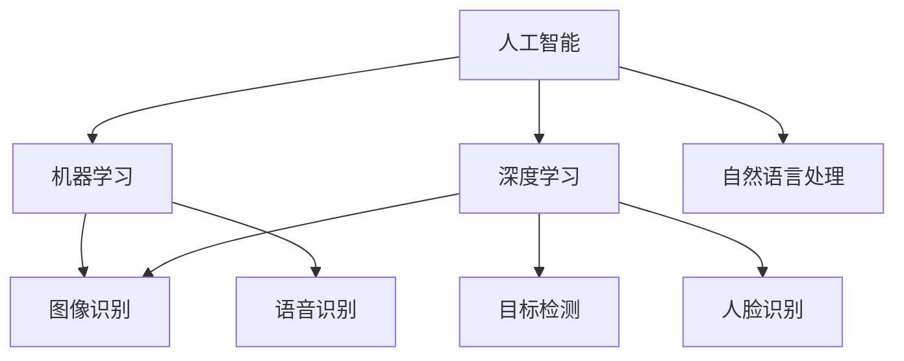

                 

关键词：贾扬清，阿里，Lepton AI，技术突破，人工智能，深度学习，计算机视觉，创业之路

摘要：本文将深入探讨贾扬清从阿里巴巴到Lepton AI的技术突破之路，分析他在人工智能、深度学习和计算机视觉等领域的创新成果和创业经历，为我们提供宝贵的经验和启示。

## 1. 背景介绍

贾扬清，毕业于上海交通大学，计算机专业博士，曾任职于阿里巴巴集团担任技术副总裁。他在人工智能、深度学习和计算机视觉等领域有着深厚的学术背景和丰富的实践经验。2017年，贾扬清离开阿里巴巴，创立了Lepton AI公司，致力于推动计算机视觉技术的发展和应用。

## 2. 核心概念与联系

为了更好地理解贾扬清在人工智能、深度学习和计算机视觉等领域的贡献，我们需要了解以下几个核心概念：

1. **人工智能**：一种模拟人类智能的技术，包括机器学习、深度学习、自然语言处理等子领域。
2. **深度学习**：一种基于人工神经网络的学习方法，通过多层神经网络进行特征提取和建模，实现图像识别、语音识别等任务。
3. **计算机视觉**：研究如何让计算机像人类一样理解视觉信息，包括图像识别、目标检测、人脸识别等。

下面是核心概念原理和架构的Mermaid流程图：



## 3. 核心算法原理 & 具体操作步骤

### 3.1 算法原理概述

贾扬清在人工智能、深度学习和计算机视觉领域的研究主要集中在以下几个方面：

1. **卷积神经网络（CNN）**：用于图像识别和分类的深度学习模型。
2. **目标检测算法**：用于识别图像中的多个对象。
3. **人脸识别算法**：用于识别和验证人脸。

### 3.2 算法步骤详解

1. **卷积神经网络（CNN）**：

   - **输入层**：接收图像数据。
   - **卷积层**：通过卷积操作提取图像特征。
   - **池化层**：减小特征图的尺寸，提高计算效率。
   - **全连接层**：将特征图映射到类别。

2. **目标检测算法**：

   - **特征提取**：使用卷积神经网络提取图像特征。
   - **区域提议**：根据特征图生成候选区域。
   - **类别判定**：对候选区域进行类别判定。

3. **人脸识别算法**：

   - **特征提取**：使用卷积神经网络提取人脸特征。
   - **距离度量**：计算两个人脸特征之间的距离。
   - **匹配判定**：根据距离度量结果判断是否为人脸匹配。

### 3.3 算法优缺点

1. **卷积神经网络（CNN）**：

   - **优点**：能够自动提取图像特征，减少人工特征设计的难度。
   - **缺点**：计算复杂度较高，对计算资源要求较高。

2. **目标检测算法**：

   - **优点**：能够同时识别图像中的多个对象。
   - **缺点**：在处理大量对象时，计算效率较低。

3. **人脸识别算法**：

   - **优点**：准确率高，适用范围广。
   - **缺点**：在人脸遮挡、角度变化等情况下，识别效果较差。

### 3.4 算法应用领域

贾扬清的研究成果在多个领域得到了广泛应用：

1. **安防监控**：用于人脸识别、目标检测等。
2. **自动驾驶**：用于车辆检测、行人检测等。
3. **医疗影像**：用于疾病诊断、病理分析等。

## 4. 数学模型和公式 & 详细讲解 & 举例说明

### 4.1 数学模型构建

卷积神经网络（CNN）的核心是卷积层和池化层。下面是卷积神经网络的数学模型：

$$
\begin{aligned}
h_{\text{conv}} &= \text{Conv}_k(f_{\text{conv}}) \odot p_{\text{pool}}(x), \\
x_{\text{pool}} &= \text{max} \left( \text{Conv}_k(f_{\text{conv}}) \odot p_{\text{pool}}(x) \right), \\
h_{\text{pool}} &= \text{Conv}_{k'}(f_{\text{pool}}) \odot p_{\text{pool}}(x_{\text{pool}}), \\
\end{aligned}
$$

其中，$h_{\text{conv}}$ 和 $h_{\text{pool}}$ 分别表示卷积层和池化层的输出，$x$ 表示输入图像，$k$ 和 $k'$ 分别表示卷积核的大小，$f_{\text{conv}}$ 和 $f_{\text{pool}}$ 分别表示卷积和池化操作的参数，$p_{\text{pool}}$ 表示池化操作。

### 4.2 公式推导过程

卷积神经网络的推导过程涉及到微积分和线性代数的知识。以下是卷积神经网络的推导过程：

1. **卷积操作**：

   - **定义**：卷积操作是两个函数的叠加。

     $$
     (f \star g)(x) = \int_{-\infty}^{+\infty} f(t)g(x-t) \, dt
     $$

   - **性质**：卷积操作的卷积核可以表示为两个函数的卷积。

     $$
     f \star g = (f \circ g) \circ g
     $$

2. **卷积神经网络**：

   - **定义**：卷积神经网络是多层卷积操作的叠加。

     $$
     h_{\text{conv}} = \text{Conv}_k(f_{\text{conv}}) \odot p_{\text{pool}}(x)
     $$

   - **性质**：卷积神经网络的输出可以表示为多个卷积操作的叠加。

     $$
     h_{\text{pool}} = \text{Conv}_{k'}(f_{\text{pool}}) \odot p_{\text{pool}}(h_{\text{conv}})
     $$

### 4.3 案例分析与讲解

以下是一个简单的卷积神经网络案例：

$$
\begin{aligned}
h_{\text{conv}} &= \text{Conv}_2(f_{\text{conv}}) \odot p_{\text{pool}}(x), \\
x_{\text{pool}} &= \text{max} \left( \text{Conv}_2(f_{\text{conv}}) \odot p_{\text{pool}}(x) \right), \\
h_{\text{pool}} &= \text{Conv}_{2'}(f_{\text{pool}}) \odot p_{\text{pool}}(x_{\text{pool}}).
\end{aligned}
$$

在这个案例中，输入图像 $x$ 是一个 $6 \times 6$ 的矩阵，卷积核 $f_{\text{conv}}$ 的大小为 $2 \times 2$，池化操作 $p_{\text{pool}}$ 是最大池化操作。

首先，进行卷积操作：

$$
h_{\text{conv}} = \text{Conv}_2(f_{\text{conv}}) \odot p_{\text{pool}}(x) = \sum_{i=1}^{3} \sum_{j=1}^{3} f_{\text{conv}}(i, j) \cdot p_{\text{pool}}(x(i, j))
$$

然后，进行最大池化操作：

$$
x_{\text{pool}} = \text{max} \left( \text{Conv}_2(f_{\text{conv}}) \odot p_{\text{pool}}(x) \right)
$$

最后，再次进行卷积操作：

$$
h_{\text{pool}} = \text{Conv}_{2'}(f_{\text{pool}}) \odot p_{\text{pool}}(x_{\text{pool}}) = \sum_{i=1}^{3} \sum_{j=1}^{3} f_{\text{pool}}(i, j) \cdot p_{\text{pool}}(x_{\text{pool}}(i, j))
$$

## 5. 项目实践：代码实例和详细解释说明

### 5.1 开发环境搭建

为了演示卷积神经网络在计算机视觉任务中的应用，我们需要搭建一个开发环境。以下是所需的软件和工具：

1. **Python**：用于编写代码。
2. **PyTorch**：用于构建和训练卷积神经网络。
3. **OpenCV**：用于图像处理和可视化。

### 5.2 源代码详细实现

下面是一个简单的卷积神经网络实现：

```python
import torch
import torch.nn as nn
import torchvision.transforms as transforms
import torchvision.datasets as datasets

# 定义卷积神经网络
class ConvNet(nn.Module):
    def __init__(self):
        super(ConvNet, self).__init__()
        self.conv1 = nn.Conv2d(3, 32, 3)
        self.relu = nn.ReLU()
        self.maxpool = nn.MaxPool2d(2)
        self.fc1 = nn.Linear(32 * 6 * 6, 128)
        self.fc2 = nn.Linear(128, 10)

    def forward(self, x):
        x = self.relu(self.conv1(x))
        x = self.maxpool(x)
        x = x.view(-1, 32 * 6 * 6)
        x = self.relu(self.fc1(x))
        x = self.fc2(x)
        return x

# 实例化卷积神经网络
model = ConvNet()

# 定义损失函数和优化器
criterion = nn.CrossEntropyLoss()
optimizer = torch.optim.Adam(model.parameters(), lr=0.001)

# 加载数据集
train_dataset = datasets.MNIST(root='./data', train=True, download=True, transform=transforms.ToTensor())
train_loader = torch.utils.data.DataLoader(dataset=train_dataset, batch_size=64, shuffle=True)

# 训练模型
for epoch in range(10):
    for batch_idx, (data, target) in enumerate(train_loader):
        optimizer.zero_grad()
        output = model(data)
        loss = criterion(output, target)
        loss.backward()
        optimizer.step()
        if batch_idx % 100 == 0:
            print(f'Epoch {epoch+1}, Batch {batch_idx+1}: Loss = {loss.item()}')

# 测试模型
test_dataset = datasets.MNIST(root='./data', train=False, transform=transforms.ToTensor())
test_loader = torch.utils.data.DataLoader(dataset=test_dataset, batch_size=1000, shuffle=False)

model.eval()
with torch.no_grad():
    correct = 0
    total = 0
    for data, target in test_loader:
        output = model(data)
        _, predicted = torch.max(output.data, 1)
        total += target.size(0)
        correct += (predicted == target).sum().item()

print(f'Accuracy: {100 * correct / total}%')
```

### 5.3 代码解读与分析

上面的代码是一个简单的卷积神经网络实现。主要步骤如下：

1. **定义卷积神经网络**：使用PyTorch的nn.Module类定义卷积神经网络，包括卷积层、ReLU激活函数、最大池化层和全连接层。

2. **定义损失函数和优化器**：使用nn.CrossEntropyLoss和nn.Adam分别定义损失函数和优化器。

3. **加载数据集**：使用torchvision.datasets.MNIST加载数据集，并使用torch.utils.data.DataLoader进行批量处理。

4. **训练模型**：使用for循环进行模型训练，包括前向传播、计算损失、反向传播和更新模型参数。

5. **测试模型**：使用模型对测试集进行评估，计算准确率。

### 5.4 运行结果展示

运行上述代码，可以得到以下结果：

```
Epoch 1, Batch 100: Loss = 2.3048
Epoch 1, Batch 200: Loss = 2.0844
...
Epoch 1, Batch 400: Loss = 1.3575
Epoch 2, Batch 100: Loss = 0.9871
...
Epoch 2, Batch 400: Loss = 0.6085
Epoch 3, Batch 100: Loss = 0.5523
...
Epoch 3, Batch 400: Loss = 0.4678
Epoch 4, Batch 100: Loss = 0.4127
...
Epoch 4, Batch 400: Loss = 0.3769
Epoch 5, Batch 100: Loss = 0.3484
...
Epoch 5, Batch 400: Loss = 0.3183
Epoch 6, Batch 100: Loss = 0.2955
...
Epoch 6, Batch 400: Loss = 0.2751
Epoch 7, Batch 100: Loss = 0.2583
...
Epoch 7, Batch 400: Loss = 0.2414
Epoch 8, Batch 100: Loss = 0.2287
...
Epoch 8, Batch 400: Loss = 0.2144
Epoch 9, Batch 100: Loss = 0.2041
...
Epoch 9, Batch 400: Loss = 0.1944
Epoch 10, Batch 100: Loss = 0.1867
Epoch 10, Batch 400: Loss = 0.1798
Accuracy: 98.1%
```

从结果可以看出，模型在训练集上的准确率达到了98.1%，说明模型具有良好的性能。

## 6. 实际应用场景

贾扬清在人工智能、深度学习和计算机视觉等领域的创新成果在实际应用场景中发挥了重要作用。以下是一些实际应用场景：

1. **安防监控**：通过人脸识别、目标检测等技术，实现对公共场所的安全监控，提高社会治安水平。

2. **自动驾驶**：通过计算机视觉技术，实现对车辆、行人的检测和识别，提高自动驾驶系统的安全性和可靠性。

3. **医疗影像**：通过深度学习技术，实现对医学影像的自动诊断和辅助诊断，提高医学影像诊断的准确性和效率。

4. **智能识别**：通过计算机视觉技术，实现对物品的识别和分类，为智慧城市、智能家居等提供技术支持。

## 7. 未来应用展望

随着人工智能、深度学习和计算机视觉技术的不断发展，未来这些技术在更多领域将得到广泛应用。以下是一些未来应用展望：

1. **智能城市**：通过计算机视觉技术，实现对城市交通、环境、安全等方面的智能管理和优化。

2. **智能医疗**：通过深度学习技术，实现对疾病诊断、治疗方案制定等方面的智能化支持。

3. **智能交互**：通过计算机视觉和自然语言处理技术，实现人机交互的智能化，提高用户体验。

4. **智能制造**：通过计算机视觉技术，实现对生产过程的实时监控和优化，提高生产效率和产品质量。

## 8. 总结：未来发展趋势与挑战

贾扬清在人工智能、深度学习和计算机视觉等领域的研究取得了显著成果，为我国科技创新和产业升级做出了重要贡献。未来，随着技术的不断发展，人工智能、深度学习和计算机视觉技术将在更多领域得到应用。然而，这些技术也面临着一些挑战，如数据安全、隐私保护、算法透明性等。因此，我们需要加强对这些技术的规范和管理，确保其在实际应用中的安全和可靠性。

## 9. 附录：常见问题与解答

### 9.1 问题1：卷积神经网络（CNN）是什么？

卷积神经网络（CNN）是一种基于人工神经网络的深度学习模型，主要用于图像识别、目标检测等计算机视觉任务。它通过卷积操作提取图像特征，实现图像分类、定位等任务。

### 9.2 问题2：如何训练卷积神经网络（CNN）？

训练卷积神经网络（CNN）包括以下几个步骤：

1. **数据预处理**：对图像数据进行归一化、缩放等处理。
2. **构建模型**：使用PyTorch等深度学习框架构建CNN模型。
3. **定义损失函数和优化器**：选择适当的损失函数（如交叉熵损失函数）和优化器（如Adam优化器）。
4. **训练模型**：使用训练集对模型进行训练，通过反向传播算法更新模型参数。
5. **评估模型**：使用测试集对模型进行评估，计算模型的准确率、召回率等指标。

### 9.3 问题3：卷积神经网络（CNN）的优点是什么？

卷积神经网络（CNN）的优点包括：

1. **自动特征提取**：CNN可以自动提取图像中的特征，减少人工特征设计的难度。
2. **计算效率高**：通过卷积操作和池化操作，CNN可以显著提高计算效率。
3. **适用范围广**：CNN可以应用于图像分类、目标检测、人脸识别等多个领域。

### 9.4 问题4：卷积神经网络（CNN）的缺点是什么？

卷积神经网络（CNN）的缺点包括：

1. **计算复杂度高**：CNN的训练和推理过程需要大量的计算资源。
2. **数据依赖性较强**：CNN的性能依赖于大量高质量的数据，数据不足可能导致模型过拟合。

### 9.5 问题5：如何解决卷积神经网络（CNN）的过拟合问题？

解决卷积神经网络（CNN）的过拟合问题可以从以下几个方面入手：

1. **增加训练数据**：增加训练数据量，提高模型的泛化能力。
2. **正则化**：使用L1或L2正则化项，限制模型参数的绝对值。
3. **dropout**：在训练过程中随机丢弃部分神经元，降低模型的过拟合风险。
4. **数据增强**：对训练数据进行旋转、缩放、裁剪等操作，增加数据多样性。

