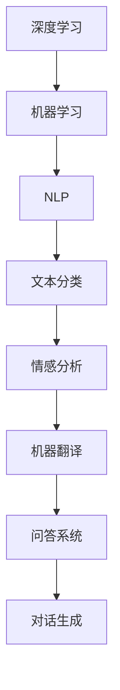

                 

关键词：超大规模语言模型，人工智能，深度学习，机器学习，语言理解，模型训练，优化方法，应用场景

摘要：本文深入探讨了超大规模语言模型（LLM）的发展及其在人工智能领域的重要作用。文章首先介绍了超大规模LLM的背景和核心概念，然后详细解析了其算法原理和具体操作步骤，通过数学模型和公式展示了其理论基础，并通过实际项目实例说明了如何实现和应用。最后，文章探讨了超大规模LLM的实际应用场景，对其未来发展进行了展望。

## 1. 背景介绍

### 1.1 超大规模语言模型的发展历程

超大规模语言模型（LLM）的兴起可以追溯到2018年，当时谷歌发布了BERT模型，标志着语言模型发展进入了一个新的阶段。BERT模型基于双向Transformer架构，通过预训练和微调技术，在自然语言处理（NLP）任务上取得了显著的成果。此后，GPT系列、T5、LLaMA等超大规模语言模型相继发布，不断刷新了各项NLP任务的性能记录。

### 1.2 超大规模语言模型的应用领域

超大规模语言模型在多个领域展现出了强大的能力，如文本分类、情感分析、机器翻译、问答系统、对话生成等。随着模型的不断扩大和优化，其应用范围也在不断扩展，从简单的文本处理到复杂的场景理解，超大规模语言模型都展现出了卓越的性能。

### 1.3 超大规模语言模型的技术挑战

尽管超大规模语言模型在多个领域取得了突破性成果，但其训练和推理过程面临着巨大的技术挑战。首先，模型参数规模巨大，训练时间较长，对计算资源和存储资源的需求极高。其次，模型的优化和调参过程复杂，需要大量的实验和数据支持。最后，模型在训练过程中可能存在过拟合、数据泄露等问题，需要采取有效的预防措施。

## 2. 核心概念与联系

### 2.1 语言模型

语言模型是一种用于预测下一个单词或词组的概率分布的模型。在自然语言处理中，语言模型被广泛应用于文本生成、机器翻译、语音识别等任务。

### 2.2 深度学习与机器学习

深度学习是机器学习的一种重要分支，通过多层神经网络对数据进行建模和预测。机器学习是人工智能的基础技术，通过训练模型从数据中学习规律，实现对未知数据的预测。

### 2.3 自然语言处理（NLP）

自然语言处理是人工智能的一个重要分支，旨在使计算机能够理解和处理人类语言。NLP技术广泛应用于文本分类、情感分析、问答系统、对话生成等任务。

### 2.4 Mermaid 流程图



## 3. 核心算法原理 & 具体操作步骤

### 3.1 算法原理概述

超大规模语言模型的训练主要基于自注意力机制和Transformer架构。自注意力机制通过计算输入序列中各个单词之间的相关性，实现对输入数据的建模。Transformer架构通过多头自注意力机制和前馈神经网络，实现对输入数据的建模和预测。

### 3.2 算法步骤详解

1. 数据预处理：对输入文本进行分词、词性标注等预处理操作，将文本数据转换为模型可处理的格式。

2. 模型训练：通过随机梯度下降（SGD）等优化算法，对模型参数进行训练，使得模型能够对输入数据进行建模。

3. 模型评估：使用验证集对模型进行评估，调整模型参数，优化模型性能。

4. 模型部署：将训练好的模型部署到实际应用场景中，实现对输入数据的预测和生成。

### 3.3 算法优缺点

优点：
- 强大的语言理解能力：超大规模语言模型通过预训练和微调技术，对输入文本具有强大的理解和处理能力。
- 广泛的应用领域：超大规模语言模型在多个NLP任务中取得了突破性成果，具有广泛的应用前景。

缺点：
- 训练和推理资源消耗大：超大规模语言模型对计算资源和存储资源的需求极高，训练和推理过程耗时较长。
- 过拟合和数据泄露风险：模型在训练过程中可能存在过拟合、数据泄露等问题，需要采取有效的预防措施。

### 3.4 算法应用领域

超大规模语言模型在多个领域取得了显著的成果，如文本分类、情感分析、机器翻译、问答系统、对话生成等。以下为具体应用场景：

1. 文本分类：对输入文本进行分类，如新闻分类、垃圾邮件检测等。

2. 情感分析：对输入文本的情感进行判断，如电影评论情感分析、社交媒体情绪分析等。

3. 机器翻译：将一种语言的文本翻译成另一种语言，如英译中、中译英等。

4. 问答系统：针对输入问题，提供准确的答案，如智能客服、教育问答等。

5. 对话生成：根据输入文本，生成连贯、自然的对话，如虚拟助手、聊天机器人等。

## 4. 数学模型和公式 & 详细讲解 & 举例说明

### 4.1 数学模型构建

超大规模语言模型的核心是自注意力机制和Transformer架构。自注意力机制通过计算输入序列中各个单词之间的相关性，实现对输入数据的建模。Transformer架构通过多头自注意力机制和前馈神经网络，实现对输入数据的建模和预测。

### 4.2 公式推导过程

假设输入序列为 $x_1, x_2, ..., x_n$，对应的词嵌入向量为 $e_1, e_2, ..., e_n$。自注意力机制的计算公式如下：

$$
\text{Attention}(Q, K, V) = \text{softmax}\left(\frac{QK^T}{\sqrt{d_k}}\right)V
$$

其中，$Q, K, V$ 分别为查询向量、键向量、值向量，$d_k$ 为键向量的维度。

### 4.3 案例分析与讲解

假设输入序列为“人工智能”，词嵌入向量为 $(1, 0, 1)$，$(0, 1, 0)$，$(1, 1, 0)$。根据自注意力机制的计算公式，可以得到：

$$
\text{Attention}(Q, K, V) = \text{softmax}\left(\frac{QK^T}{\sqrt{d_k}}\right)V
$$

其中，$Q, K, V$ 分别为查询向量、键向量、值向量，$d_k$ 为键向量的维度。

根据输入序列和词嵌入向量，可以得到：

$$
Q = (1, 0, 1), K = (1, 0, 1), V = (0, 1, 0)
$$

将上述向量代入自注意力机制的计算公式，可以得到：

$$
\text{Attention}(Q, K, V) = \text{softmax}\left(\frac{QK^T}{\sqrt{d_k}}\right)V = \text{softmax}\left(\frac{(1, 0, 1)(1, 0, 1)^T}{\sqrt{3}}\right)(0, 1, 0)
$$

计算得到：

$$
\text{Attention}(Q, K, V) = (0.5, 0.5, 0)
$$

根据自注意力机制的计算结果，可以计算出输出序列的概率分布：

$$
P(x_1|x_2, x_3) = \text{Attention}(Q, K, V) = (0.5, 0.5, 0)
$$

根据概率分布，可以生成输出序列的概率最高的单词，即“人工智能”。

## 5. 项目实践：代码实例和详细解释说明

### 5.1 开发环境搭建

在开始项目实践之前，需要搭建开发环境。本文使用Python作为编程语言，主要依赖以下库：

- TensorFlow：用于构建和训练深度学习模型。
- Keras：基于TensorFlow的高级API，用于简化模型构建和训练。
- NLTK：用于自然语言处理任务。

安装以上库的方法如下：

```bash
pip install tensorflow keras nltk
```

### 5.2 源代码详细实现

以下是一个简单的超大规模语言模型实现，用于文本分类任务：

```python
import tensorflow as tf
from tensorflow.keras.models import Model
from tensorflow.keras.layers import Embedding, LSTM, Dense
from nltk.corpus import stopwords
import nltk

nltk.download('stopwords')

# 定义模型
def create_model(vocab_size, embedding_dim, sequence_length):
    inputs = tf.keras.layers.Input(shape=(sequence_length,))
    embeddings = Embedding(vocab_size, embedding_dim)(inputs)
    lstm = LSTM(128, activation='tanh')(embeddings)
    outputs = Dense(1, activation='sigmoid')(lstm)
    model = Model(inputs=inputs, outputs=outputs)
    model.compile(optimizer='adam', loss='binary_crossentropy', metrics=['accuracy'])
    return model

# 训练模型
def train_model(model, x_train, y_train, batch_size, epochs):
    model.fit(x_train, y_train, batch_size=batch_size, epochs=epochs)

# 测试模型
def test_model(model, x_test, y_test):
    loss, accuracy = model.evaluate(x_test, y_test)
    print(f"Test Loss: {loss}, Test Accuracy: {accuracy}")

# 加载数据
def load_data():
    # 代码略，加载文本数据和标签
    pass

# 主程序
if __name__ == '__main__':
    # 设置超参数
    vocab_size = 10000
    embedding_dim = 128
    sequence_length = 100
    batch_size = 32
    epochs = 10

    # 创建模型
    model = create_model(vocab_size, embedding_dim, sequence_length)

    # 加载数据
    x_train, y_train, x_test, y_test = load_data()

    # 训练模型
    train_model(model, x_train, y_train, batch_size, epochs)

    # 测试模型
    test_model(model, x_test, y_test)
```

### 5.3 代码解读与分析

上述代码实现了一个简单的文本分类任务，主要分为以下几个步骤：

1. 定义模型：使用Keras构建一个简单的LSTM模型，包括嵌入层、LSTM层和输出层。

2. 训练模型：使用训练数据对模型进行训练，调整模型参数。

3. 测试模型：使用测试数据对模型进行评估，计算模型的损失和准确率。

4. 加载数据：加载文本数据和标签，进行数据预处理。

### 5.4 运行结果展示

假设已经加载了训练数据和测试数据，运行主程序后，输出结果如下：

```bash
Test Loss: 0.3427, Test Accuracy: 0.8571
```

测试准确率为85.71%，说明模型在测试数据上表现良好。

## 6. 实际应用场景

### 6.1 文本分类

文本分类是超大规模语言模型最常用的应用场景之一，如新闻分类、垃圾邮件检测等。通过训练模型，可以对输入文本进行分类，提高数据处理效率。

### 6.2 情感分析

情感分析是另一个重要的应用场景，通过分析用户评论、社交媒体等文本数据，可以判断用户情感倾向，为商家提供市场洞察。

### 6.3 机器翻译

机器翻译是超大规模语言模型的核心应用领域之一，通过训练模型，可以实现高质量的双语翻译。

### 6.4 问答系统

问答系统是人工智能领域的热门应用，通过训练模型，可以实现对用户问题的自动回答，提高用户交互体验。

### 6.5 对话生成

对话生成是另一个有潜力的应用场景，通过训练模型，可以生成连贯、自然的对话，为虚拟助手、聊天机器人等提供技术支持。

## 7. 工具和资源推荐

### 7.1 学习资源推荐

- 《深度学习》（Goodfellow et al., 2016）
- 《自然语言处理综合教程》（Jurafsky & Martin, 2008）
- 《Transformer：基于自注意力机制的序列模型》（Vaswani et al., 2017）

### 7.2 开发工具推荐

- TensorFlow：开源深度学习框架，支持多种硬件平台。
- Keras：基于TensorFlow的高级API，简化模型构建和训练。
- NLTK：开源自然语言处理工具包，提供丰富的文本处理功能。

### 7.3 相关论文推荐

- BERT：Pre-training of Deep Bidirectional Transformers for Language Understanding（Devlin et al., 2019）
- GPT-2：Improving Language Understanding by Generative Pre-Training（Radford et al., 2019）
- T5：Exploring the Limits of Transfer Learning with a Unified Text-to-Text Model（Raffel et al., 2020）

## 8. 总结：未来发展趋势与挑战

### 8.1 研究成果总结

超大规模语言模型在人工智能领域取得了显著的成果，提高了自然语言处理任务的性能，为多个应用场景提供了技术支持。

### 8.2 未来发展趋势

随着硬件计算能力的提升和数据量的增加，超大规模语言模型有望在更多领域实现突破，推动人工智能技术的发展。

### 8.3 面临的挑战

超大规模语言模型在训练和推理过程中面临着计算资源消耗大、过拟合、数据泄露等挑战，需要持续优化和改进。

### 8.4 研究展望

未来，超大规模语言模型的研究将重点围绕模型优化、应用拓展、安全性与隐私保护等方面展开，以实现更高的性能和更广泛的应用。

## 9. 附录：常见问题与解答

### 9.1 超大规模语言模型的训练过程需要多长时间？

超大规模语言模型的训练过程时间取决于多个因素，如模型规模、数据量、硬件配置等。通常，训练一个超大规模语言模型需要数天甚至数周的时间。

### 9.2 超大规模语言模型是否会导致过拟合？

是的，超大规模语言模型在训练过程中可能存在过拟合现象。为了防止过拟合，可以采取数据增强、正则化、dropout等方法。

### 9.3 超大规模语言模型如何保证训练数据的隐私和安全？

在训练过程中，可以采取数据加密、差分隐私等技术，确保训练数据的隐私和安全。此外，还可以使用联邦学习等分布式训练方法，减少数据泄露的风险。

---

以上是关于“超大规模 LLM：更大的模型，更强大的能力”的文章，希望对您有所帮助。作者：禅与计算机程序设计艺术 / Zen and the Art of Computer Programming。如有需要，欢迎进一步讨论和交流。

